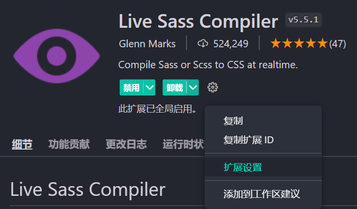
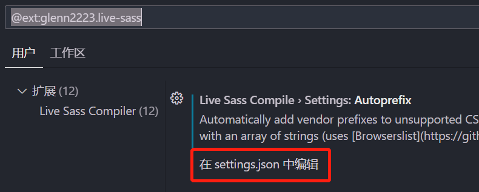
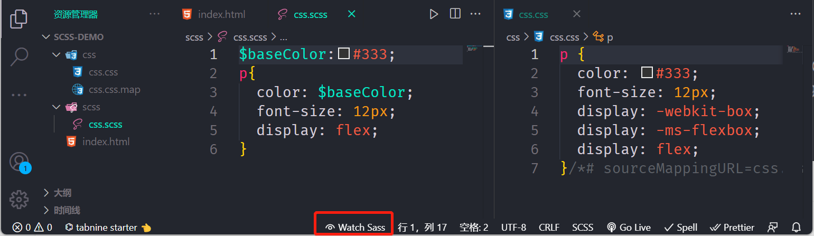

## 关于 sass(scss)、less、postcss、stylus 的简介和区别

### 为什么会出现 css 预处理器

比如一个项目的主题色在很多地方引用，后面需要修改，就得改很多个地方，难以维护。css 预处理器就是解决类似问题的。

### css 预处理器的本质

它会通过编译器最终编译成浏览器可以识别的 CSS 文件。比较优秀的有：sass、less、stylus。

### sass

sass 是一种动态样式语言，由 Ruby 开发者设计和开发，比 CSS 多出好些功能，比如变量、嵌套、运算、混入、继承、指令、颜色处理、函数等。

### sass 与 scss 的关系

sass 从第三代开始，放弃了缩进风格，并且完全向下兼容普通的 css 代码，这一代的 sass 也被称为 scss。

### sass/scss 与 less、stylus 的区别

#### 编译环境不一样

Sass 需要 Ruby 环境

Less 需要引入 less.js

Stylus 需要安装 node

#### 变量符不一样

Sass

$color:#eee;

Less

@color:#eee;

Stylus

mainColor:#eee;

#### 输出风格

SASS 的输出风格有四种：

nested，嵌套缩进的 CSS 代码，默认值

expanded，展开的多行 CSS 代码

compact，简洁格式的 CSS 代码

compressed，压缩后的 CSS 代码

### 总结

使用 CSS 预处理是为了让 CSS 代码更好维护，开发更加灵活、强大。

## vscode 集成 sass

### 安装插件

安装 Live Sass Compiler 这个插件，进行一些配置，打开下面这个地址

https://github.com/ritwickdey/vscode-live-sass-compiler

找到 Settings=>Settings Docs，点击打开，复制里面的配置

```js
"liveSassCompile.settings.formats":[
    {
        /*
         nested：嵌套格式
         expanded：展开格式
         compact：紧凑格式
         compressed：压缩格式
        */
        "format": "expanded", // 可定制的出口CSS样式（expanded，compact，compressed，nested）
        "extensionName": ".css",
        "savePath": "~/../css" // null表示当前目录
    }
],
/*排除目录*/
"liveSassCompile.settings.excludeList":[
    "**/node_modules/**",
    ".vscode/**"
],
/*是否生成对应的map*/
"liveSassCompile.settings.generateMap": true,
/*是否添加兼容前缀，例如：-webkit- -moz-等*/
"liveSassCompile.settings.autoprefix": [
    "> 1%",
    "last 2 versions"
]

```

找到这个插件，点击拓展设置



紧接着在 settings.json 中设置，将刚才的代码粘贴进去



### 将 scss 编译成 css

点击 vscode 下面的 Watchs Sass，就会将 scss 转为 css



## sass 的几种输出格式

这个就是改上面 settings.json 中的 format 的值，编译出来的 CSS 会展示不同的格式

对下面这段代码设置不同的 format 值，编译展示不同的 CSS

```css
html {
  font-size: 12px;
  color: #333;

  .container {
    font-size: 14px;
    .header {
      width: 50%;
      height: 50%;
      .left {
        float: left;
      }
    }
    .footer {
      background-color: green;
    }
    &::after {
      display: inline-block;
    }
  }
}
```

比如将设置 format 为 expanded：展开格式，那么将编译为

```css
html {
  font-size: 12px;
  color: #333;
}
html .container {
  font-size: 14px;
}
html .container .header {
  width: 50%;
  height: 50%;
}
html .container .header .left {
  float: left;
}
html .container .footer {
  background-color: green;
}
html .container::after {
  display: inline-block;
}
```

## sass 语法功能扩张

### 选择器嵌套

有下面这段 css 代码，如何改造成 scss 代码

```css
.container {
  width: 1200px;
  margin: 0 auto;
}

.container .header {
  height: 90px;
  line-height: 90px;
}

.container .header .logo {
  width: 100px;
  height: 60px;
}

.container .center {
  height: 60px;
  background-color: #f00;
}

.container .footer {
  font-size: 16px;
  text-align: center;
}
```

用 scss 就可以这样写

```css
.container {
  width: 1200px;
  margin: 0 auto;

  .header {
    height: 90px;
    line-height: 90px;

    .logo {
      width: 100px;
      height: 60px;
    }
  }

  .center {
    height: 60px;
    background-color: #f00;
  }

  .footer {
    font-size: 16px;
    text-align: center;
  }
}
```

编译出来的 css 代码和上面一样

## 父选择器&

再来看下面这段 css 代码，如何改造成 scss

```css
.container {
  width: 1200px;
  margin: 0 auto;
}

.container a {
  color: #333;
}

.container a:hover {
  text-decoration: underline;
  color: #f00;
}

.container .top {
  border: 1px solid #f2f2f2;
}

.container .top-left {
  float: left;
  width: 200px;
}
```

可以这样写

```css
.container {
  width: 1200px;
  margin: 0 auto;
  a {
    color: #333;
    &:hover {
      text-decoration: underline;
      color: #f00;
    }
  }
  .top {
    border: 1px solid #f2f2f2;
    &-left {
      float: left;
      width: 200px;
    }
  }
}
```

### 属性嵌套

还有下面这段 css 代码，如何改写

```css
.container a {
  color: #333;
  font-size: 14px;
  font-family: serif;
  font-weight: bold;
}
```

可以这么写

```css
.container {
  a {
    color: #333;
    font: {
      size: 14px;
      family: serif;
      weight: bold;
    }
  }
}
```

### 占位符选择器%必须通过@extend

下面这段 scss 代码正常是不会编译

```css
.button%base {
  display: inline-block;
  margin-bottom: 0;
  font-weight: normal;
  text-align: center;
  white-space: nowrap;
  vertical-align: middle;
  -ms-touch-action: manipulation;
  touch-action: manipulation;
  cursor: pointer;
  background-image: none;
  border: 1px solid transparent;
  padding: 6px 12px;
  font-size: 14px;
  line-height: 1.42857143;
  border-radius: 4px;
  -webkit-user-select: none;
  -moz-user-select: none;
  -ms-user-select: none;
  user-select: none;
}
```

但是如果使用@extend 就会被编译

```css
.button%base {
  display: inline-block;
  margin-bottom: 0;
  font-weight: normal;
  text-align: center;
  white-space: nowrap;
  vertical-align: middle;
  -ms-touch-action: manipulation;
  touch-action: manipulation;
  cursor: pointer;
  background-image: none;
  border: 1px solid transparent;
  padding: 6px 12px;
  font-size: 14px;
  line-height: 1.42857143;
  border-radius: 4px;
  -webkit-user-select: none;
  -moz-user-select: none;
  -ms-user-select: none;
  user-select: none;
}

.btn-default {
  @extend %base;
  color: #333;
  background-color: #fff;
  border-color: #ccc;
}

.btn-success {
  @extend %base;
  color: #fff;
  background-color: #5cb85c;
  border-color: #4cae4c;
}

.btn-danger {
  @extend %base;
  color: #fff;
  background-color: #d9534f;
  border-color: #d43f3a;
}
```

经过编译就会变成下面这样

```css
.button.btn-danger,
.button.btn-success,
.button.btn-default {
  display: inline-block;
  margin-bottom: 0;
  font-weight: normal;
  text-align: center;
  white-space: nowrap;
  vertical-align: middle;
  -ms-touch-action: manipulation;
  touch-action: manipulation;
  cursor: pointer;
  background-image: none;
  border: 1px solid transparent;
  padding: 6px 12px;
  font-size: 14px;
  line-height: 1.42857143;
  border-radius: 4px;
  -webkit-user-select: none;
  -moz-user-select: none;
  -ms-user-select: none;
  user-select: none;
}

.btn-default {
  color: #333;
  background-color: #fff;
  border-color: #ccc;
}

.btn-success {
  color: #fff;
  background-color: #5cb85c;
  border-color: #4cae4c;
}

.btn-danger {
  color: #fff;
  background-color: #d9534f;
  border-color: #d43f3a;
}
```

## sass 的两种注释

### 单行注释

// 不会编译到 css 中

### 多行注释

/\*\*/ 会被编译到 css 中

## sass 变量详解

### css 变量的定义与书写

```css
:root {
  --color: #f00;
}

body {
  --border-color: #f2f2f2;
}

.header {
  --background-color: #f8f8f8;
}

p {
  color: var(--color);
  border-color: var(--border-color);
}

.header {
  background-color: var(--background-color);
}
```

SASS 的写法

```css
$font-size: 14px;
.container {
  font-size: $font-size;
}
```

### sass 变量的定义

#### 定义规则

- 变量以美元符号($)开头，后面跟变量名；
- 变量名是不以数字开头的可包含字母、数字、下划线、横线（连接符）；
- 写法同 css，即变量名和值之间用冒号(:)分隔；
- 变量一定要先定义，后使用；

#### 连接符与下划线

通过连接符与下划线 定义的同名变量为同一变量，建议使用连接符

```css
$font-size: 14px;
$font_size: 16px;
.container {
  font-size: $font-size;
}
```

上面这段 scss 代码会被编译成

```css
.container {
  font-size: 16px;
}
```

### 变量的作用域

#### 局部变量

定义：在选择器内容定义的变量，只能在选择器范围内使用

```css
.container {
  $font-size: 14px;
  font-size: $font-size;
}
```

会编译成

```css
.container {
  font-size: 14px;
}
```

#### 全局变量

定义后能全局使用的变量

##### 第一种：在选择器外面的最前面定义的变量

```css
$font-size: 16px;
.container {
  font-size: $font-size;
}
.footer {
  font-size: $font-size;
}
```

会编译成

```css
.container {
  font-size: 16px;
}

.footer {
  font-size: 16px;
}
```

##### 第二种：使用 !global 标志定义全局变量

```css
.container {
  $font-size: 16px !global;
  font-size: $font-size;
}
.footer {
  font-size: $font-size;
}
```

会编译成

```css
.container {
  font-size: 16px;
}

.footer {
  font-size: 16px;
}
```

### 变量值类型

变量值的类型可以有很多种

SASS 支持 7 种主要的数据类型

- 数字，1, 2, 13, 10px，30%
- 字符串，有引号字符串与无引号字符串，"foo", 'bar', baz
- 颜色，blue, #04a3f9, rgba(255,0,0,0.5)
- 布尔型，true, false
- 空值，null
- 数组 (list)，用空格或逗号作分隔符，1.5em 1em 0 2em, Helvetica, Arial, sans-serif
- maps, 相当于 JavaScript 的 object，(key1: value1, key2: value2)

例如

```css
$layer-index: 10;
$border-width: 3px;
$font-base-family: "Open Sans", Helvetica, Sans-Serif;
$top-bg-color: rgba(255, 147, 29, 0.6);
$block-base-padding: 6px 10px 6px 10px;
$blank-mode: true;
$var: null; // 值null是其类型的唯一值。它表示缺少值，通常由函数返回以指示缺少结果。
$color-map: (
  color1: #fa0000,
  color2: #fbe200,
  color3: #95d7eb
);

$fonts: (
  serif: "Helvetica Neue",
  monospace: "Consolas"
);
```

使用

```css
.container {
  $font-size: 16px !global;
  font-size: $font-size;
  @if $blank-mode {
    background-color: #000;
  } @else {
    background-color: #fff;
  }
  content: type-of($var);
  content: length($var);
  color: map-get($color-map, color2);
}

.footer {
  font-size: $font-size;
}

// 如果列表中包含空值，则生成的CSS中将忽略该空值。
.wrap {
  font: 18px bold map-get($fonts, "sans");
}
```

会编译成

```css
.container {
  font-size: 16px;
  background-color: #000;
  content: null;
  content: 1;
  color: #fbe200;
}

.footer {
  font-size: 16px;
}

.wrap {
  font: 18px bold;
}
```

### 默认值

```
$color:#333;
// 如果$color之前没定义就使用如下的默认值
$color:#666 !default;
.container {
    border-color: $color;
}
```

## sass 导入@import 详解

### @import

Sass 拓展了 @import 的功能，允许其导入 SCSS 或 Sass 文件。被导入的文件将合并编译到同一个 CSS 文件中，另外，被导入的文件中所包含的变量或者混合指令 (mixin) 都可以在导入的文件中使用。

**例如**

public.scss

```css
$font-base-color: #333;
```

在 index.scss 里面使用

```css
@import "public";
$color: #666;
.container {
  border-color: $color;
  color: $font-base-color;
}
```

**注意：**跟我们普通 css 里面@import 的区别

###### 如下几种方式，都将作为普通的 css 语句，不会导入任何 sass 文件

1. 文件拓展名是 .css；
2. 文件名以 http:// 开头；
3. 文件名是 url()；
4. @import 包含 media queries。

```css
@import "public.css";
@import url(public);
@import "http://xxx.com/xxx";
@import "landscape" screen and (orientation: landscape);
```

### 局部文件(partials)

Sass 源文件中可以通过@import 指令导入其他 Sass 源文件，被导入的文件就是局部文件，局部文件让 Sass 模块化编写更加容易。

如果一个目录正在被 Sass 程序监测，目录下的所有 scss/sass 源文件都会被编译，但通常不希望局部文件被编译，因为局部文件是用来被导入到其他文件的。如果不想局部文件被编译，文件名可以以下划线 （\_）开头

例如：

\_theme.scss

```css
$border-color: #999;
$background-color: #f2f2f2;
```

使用

```css
@import "theme";
.container {
  border-color: $border-color;
  background-color: $background-color;
}
```

可以看到，@import 引入的 theme.scss，可以没有下划线，这是允许的，这也就意味着，同一个目录下不能同时出现两个相关名的 sass 文件（一个不带下划线，一个带下划线），添加下划线的文件将会被忽略。

### 嵌套 @import

大多数情况下，一般在文件的最外层（不在嵌套规则内）使用 @import，其实，也可以将 @import 嵌套进 CSS 样式或者 @media 中，与平时的用法效果相同，只是这样导入的样式只能出现在嵌套的层中。

例如

\_base.scss

```css
.main-color {
  color: #f00;
}
```

使用

```css
.container {
  @import "base";
}
```

**注意：**@import 不能嵌套使用在控制指令或混入中

## sass 混合指令 (mixin directives)

混合指令（Mixin）用于定义可重复使用的样式。混合指令可以包含所有的 CSS 规则，绝大部分 Sass 规则，甚至通过参数功能引入变量，输出多样化的样式。

### 定义与使用混合指令 @mixin

```css
@mixin mixin-name() {
  /* css 声明 */
}
```

#### 例 1：标准形式

定义

```css
// 定义页面一个区块基本的样式
@mixin block {
  width: 96%;
  margin-left: 2%;
  border-radius: 8px;
  border: 1px #f6f6f6 solid;
}
```

使用

```css
.container {
  @include block;
}
```

会被编译成

```css
.container {
  width: 96%;
  margin-left: 2%;
  border-radius: 8px;
  border: 1px #f6f6f6 solid;
}
```

#### 例 2：嵌入选择器

例如

```css
// 定义警告字体样式,下划线（_）与横线（-）是一样的
@mixin warning-text {
  .warn-text {
    font-size: 12px;
    color: rgb(255, 253, 123);
    line-height: 180%;
  }
}
```

使用

```css
// 使用混入
.container {
  @include warning-text();
}
```

会被编译成

```css
.container .warn-text {
  font-size: 12px;
  color: rgb(255, 253, 123);
  line-height: 180%;
}
```

#### 例 3：使用变量

定义

```css
// 定义flex布局元素纵轴的排列方式
@mixin flex-align($aitem) {
  -webkit-box-align: $aitem;
  -webkit-align-items: $aitem;
  -ms-flex-align: $aitem;
  align-items: $aitem;
}
```

使用

```css
// 只有一个参数，直接传递参数
.container {
  @include flex-align(center);
}

// 给指定参数指定值
.footer {
  @include flex-align($aitem: center);
}
```

#### 例 4：使用变量（多参数）

例如

```css
// 定义块元素内边距
@mixin block-padding($top, $right, $bottom, $left) {
  padding-top: $top;
  padding-right: $right;
  padding-bottom: $bottom;
  padding-left: $left;
}
```

使用一

```css
// 按照参数顺序赋值
.container {
  @include block-padding(10px, 20px, 30px, 40px);
}
```

使用二

```css
// 可指定参数赋值
.container {
  @include block-padding($left: 20px, $top: 10px, $bottom: 10px, $right: 30px);
}
```

使用三：只设置两边

```css
// 可指定参数赋值
.container {
  @include block-padding($left: 10px, $top: 10px, $bottom: 0, $right: 0);
}
```

**问题：**必须指定 4 个值

#### 例 5：指定默认值

定义

```css
// 定义块元素内边距，参数指定默认值
@mixin block-padding($top: 0, $right: 0, $bottom: 0, $left: 0) {
  padding-top: $top;
  padding-right: $right;
  padding-bottom: $bottom;
  padding-left: $left;
}
```

使用

```css
// 可指定参数赋值
.container {
  // 不带参数
  //@include block-padding;
  //按顺序指定参数值
  //@include block-padding(10px,20px);
  //给指定参数指定值
  @include block-padding($left: 10px, $top: 20px);
}
```

#### 例 6：可变参数

参数不固定的情况

```css
/** 
    *定义线性渐变
    *@param $direction  方向
    *@param $gradients  颜色过度的值列表
 */

@mixin linear-gradient($direction, $gradients...) {
  background-color: nth($gradients, 1);
  background-image: linear-gradient($direction, $gradients);
}
```

使用

```css
.table-data {
  @include linear-gradient(to right, #f00, orange, yellow);
}
```

会编译成

```css
.table-data {
  background-color: #f00;
  background-image: -webkit-gradient(
    linear,
    left top,
    right top,
    from(#f00),
    color-stop(orange),
    to(yellow)
  );
  background-image: linear-gradient(to right, #f00, orange, yellow);
}
```

### @mixin 混入总结

- mixin 是可以重复使用的一组 CSS 声明
- mixin 有助于减少重复代码，只需声明一次，就可在文件中引用
- 混合指令可以包含所有的 CSS 规则，绝大部分 Sass 规则，甚至通过参数功能引入变量，输出多样化的样式。
- 使用参数时建议加上默认值

**什么时候用？？？？** 很多地方都会用到却能根据不同场景灵活使用的样式

## sass @extend（继承）指令

​ 在设计网页的时候通常遇到这样的情况：一个元素使用的样式与另一个元素完全相同，但又添加了额外的样式。通常会在 HTML 中给元素定义两个 class，一个通用样式，一个特殊样式。

### css 案例

接下来以警告框为例进行讲解 4 种类型

| 标记    | 说明                     |
| ------- | ------------------------ |
| info    | 信息！请注意这个信息。   |
| success | 成功！很好地完成了提交。 |
| warning | 警告！请不要提交。       |
| danger  | 错误！请进行一些更改。   |

所有警告框的基本样式（风格、字体大小、内边距、边框等...） ，因为我们通常会定义一个通用 alert 样式

```css
.alert {
  padding: 15px;
  margin-bottom: 20px;
  border: 1px solid transparent;
  border-radius: 4px;
  font-size: 12px;
}
```

不同警告框单独风格

```css
.alert-info {
  color: #31708f;
  background-color: #d9edf7;
  border-color: #bce8f1;
}

.alert-success {
  color: #3c763d;
  background-color: #dff0d8;
  border-color: #d6e9c6;
}

.alert-warning {
  color: #8a6d3b;
  background-color: #fcf8e3;
  border-color: #faebcc;
}

.alert-danger {
  color: #a94442;
  background-color: #f2dede;
  border-color: #ebccd1;
}
```

使用

```css
<div class="alert alert-info">
    信息！请注意这个信息。
</div>

<div class="alert alert-success">
    成功！很好地完成了提交。
</div>

<div class="alert alert-warning">
    警告！请不要提交。
</div>

<div class="alert alert-danger">
    错误！请进行一些更改。
</div>
```

### 使用继承@extend 改进

基本样式我们没有变，主要是各个警告框单独的样式

```css
.alert-info {
  @extend .alert;
  color: #31708f;
  background-color: #d9edf7;
  border-color: #bce8f1;
}

.alert-success {
  @extend .alert;
  color: #3c763d;
  background-color: #dff0d8;
  border-color: #d6e9c6;
}

.alert-warning {
  @extend .alert;
  color: #8a6d3b;
  background-color: #fcf8e3;
  border-color: #faebcc;
}

.alert-danger {
  @extend .alert;
  color: #a94442;
  background-color: #f2dede;
  border-color: #ebccd1;
}
```

会被编译成

```css
// 继承.alert的样式
.alert,
.alert-danger,
.alert-warning,
.alert-success,
.alert-info {
  padding: 15px;
  margin-bottom: 20px;
  border: 1px solid transparent;
  border-radius: 4px;
  font-size: 12px;
}

.alert-info {
  color: #31708f;
  background-color: #d9edf7;
  border-color: #bce8f1;
}

.alert-success {
  color: #3c763d;
  background-color: #dff0d8;
  border-color: #d6e9c6;
}

.alert-warning {
  color: #8a6d3b;
  background-color: #fcf8e3;
  border-color: #faebcc;
}

.alert-danger {
  color: #a94442;
  background-color: #f2dede;
  border-color: #ebccd1;
}
```

使用时就不须要再写基本类了

```css
<div class="alert-info">
    信息！请注意这个信息。
</div>

<div class="alert-success">
    成功！很好地完成了提交。
</div>

<div class="alert-warning">
    警告！请不要提交。
</div>

<div class="alert-danger">
    错误！请进行一些更改。
</div>
```

### 使用多个@extend

定义两个类

```css
.alert {
  padding: 15px;
  margin-bottom: 20px;
  border: 1px solid transparent;
  border-radius: 4px;
  font-size: 12px;
}

.important {
  font-weight: bold;
  font-size: 14px;
}
```

使用

```css
.alert-danger {
  @extend .alert;
  @extend .important;
  color: #a94442;
  background-color: #f2dede;
  border-color: #ebccd1;
}
```

### @extend 多层继承

第一层继承

```css
.alert {
  padding: 15px;
  margin-bottom: 20px;
  border: 1px solid transparent;
  border-radius: 4px;
  font-size: 12px;
}

.important {
  @extend .alert;
  font-weight: bold;
  font-size: 14px;
}
```

再继承

```css
.alert-danger {
  @extend .important;
  color: #a94442;
  background-color: #f2dede;
  border-color: #ebccd1;
}
```

### 占位符%

你可能发现被继承的 css 父类并没有被实际应用，也就是说 html 代码中没有使用该类，它的唯一目的就是扩展其他选择器。

对于该类，可能不希望被编译输出到最终的 css 文件中，它只会增加 CSS 文件的大小，永远不会被使用。

这就是占位符选择器的作用。

占位符选择器类似于类选择器，但是，它们不是以句点(.)开头，而是以百分号(%)开头。

当在 Sass 文件中使用占位符选择器时，它可以用于扩展其他选择器，但不会被编译成最终的 CSS。

改写

```css
%alert {
  padding: 15px;
  margin-bottom: 20px;
  border: 1px solid transparent;
  border-radius: 4px;
  font-size: 12px;
}

.alert-info {
  @extend %alert;
  color: #31708f;
  background-color: #d9edf7;
  border-color: #bce8f1;
}

.alert-success {
  @extend %alert;
  color: #3c763d;
  background-color: #dff0d8;
  border-color: #d6e9c6;
}

.alert-warning {
  @extend %alert;
  color: #8a6d3b;
  background-color: #fcf8e3;
  border-color: #faebcc;
}

.alert-danger {
  @extend %alert;
  color: #a94442;
  background-color: #f2dede;
  border-color: #ebccd1;
}
```

编译结果为

```css
// 可以看到这里没有编译.alert
.alert-danger,
.alert-warning,
.alert-success,
.alert-info {
  padding: 15px;
  margin-bottom: 20px;
  border: 1px solid transparent;
  border-radius: 4px;
  font-size: 12px;
}

.alert-info {
  color: #31708f;
  background-color: #d9edf7;
  border-color: #bce8f1;
}

.alert-success {
  color: #3c763d;
  background-color: #dff0d8;
  border-color: #d6e9c6;
}

.alert-warning {
  color: #8a6d3b;
  background-color: #fcf8e3;
  border-color: #faebcc;
}

.alert-danger {
  color: #a94442;
  background-color: #f2dede;
  border-color: #ebccd1;
}
```

还可以使用@minix 进行改进

```css
@mixin alert {
  padding: 15px;
  margin-bottom: 20px;
  border: 1px solid transparent;
  border-radius: 4px;
  font-size: 12px;
}

.alert-info {
  @include alert;
  color: #31708f;
  background-color: #d9edf7;
  border-color: #bce8f1;
}

.alert-success {
  @include alert;
  color: #3c763d;
  background-color: #dff0d8;
  border-color: #d6e9c6;
}

.alert-warning {
  @include alert;
  color: #8a6d3b;
  background-color: #fcf8e3;
  border-color: #faebcc;
}

.alert-danger {
  @include alert;
  color: #a94442;
  background-color: #f2dede;
  border-color: #ebccd1;
}
```

最终编译成

```css
.alert-info {
  padding: 15px;
  margin-bottom: 20px;
  border: 1px solid transparent;
  border-radius: 4px;
  font-size: 12px;
  color: #31708f;
  background-color: #d9edf7;
  border-color: #bce8f1;
}

.alert-success {
  padding: 15px;
  margin-bottom: 20px;
  border: 1px solid transparent;
  border-radius: 4px;
  font-size: 12px;
  color: #3c763d;
  background-color: #dff0d8;
  border-color: #d6e9c6;
}

.alert-warning {
  padding: 15px;
  margin-bottom: 20px;
  border: 1px solid transparent;
  border-radius: 4px;
  font-size: 12px;
  color: #8a6d3b;
  background-color: #fcf8e3;
  border-color: #faebcc;
}

.alert-danger {
  padding: 15px;
  margin-bottom: 20px;
  border: 1px solid transparent;
  border-radius: 4px;
  font-size: 12px;
  color: #a94442;
  background-color: #f2dede;
  border-color: #ebccd1;
}
```

可以看到相当于把.alert 样式都混入到各自的样式中，相较于继承来说，并不是那么友好。

## sass 运算 (operations)符的基本使用

### 等号操作符

所有数据类型都支持等号运算符:

| 符号 | 说明   |
| ---- | ------ |
| ==   | 等于   |
| !=   | 不等于 |

例 1 数字比较：

```css
$theme: 1;
.container {
  @if $theme==1 {
    background-color: red;
  } @else {
    background-color: blue;
  }
}
```

例 2 字符串比较：

```css
$theme: "blue";
.container {
  @if $theme != "blue" {
    background-color: red;
  } @else {
    background-color: blue;
  }
}
```

所有数据类型均支持相等运算 `==` 或 `!=`，此外，每种数据类型也有其各自支持的运算方式。

### 关系（比较）运行符

| 符号       | 说明     |
| ---------- | -------- |
| < （lt）   | 小于     |
| > （gt）   | 大于     |
| <= （lte） | 小于等于 |
| >= （gte） | 大于等于 |

例

```css
$theme: 3;
.container {
  @if $theme >= 5 {
    background-color: red;
  } @else {
    background-color: blue;
  }
}
```

### 逻辑运行符

| 符号 | 说明   |
| ---- | ------ |
| and  | 逻辑与 |
| or   | 逻辑或 |
| not  | 逻辑非 |

例

```css
$width: 100;
$height: 200;
$last: false;
div {
  @if $width>50 and $height<300 {
    font-size: 16px;
  } @else {
    font-size: 14px;
  }
  @if not $last {
    border-color: red;
  } @else {
    border-color: blue;
  }
}
```

### 数字操作符

| 符号 | 说明 |
| ---- | ---- |
| +    | 加   |
| -    | 减   |
| \*   | 乘   |
| /    | 除   |
| %    | 取模 |

例

```css
/* 
    +、-、*、/、%
    线数字、百分号、css部分单位（px、pt、in...）
    +
    线数字与百分号或单位运算时会自动转化成相应的百分比与单位值
*/
.container {
  /* ==================+ 运算===================== */
  width: 50 + 20; // 70
  width: 50 + 20%; // 70%
  width: 50% + 20%; // 70%
  width: 10px + 20px; // 30px
  width: 10pt + 20px; // 25pt (1px=3/4pt)
  width: 10pt + 20; // 30pt
  width: 10px + 10; // 20px
  /* ==================- 运算===================== */
  height: 50 - 30; // 20
  height: 10 - 30%; // -20%
  height: 60% - 30%; // 30%
  height: 50px - 20px; // 30px
  height: 50pt - 20px; // 35pt
  height: 50pt - 40; // 10pt
  /* ==================* 运算===================== */
  height: 50 * 30; // 1500
  height: 10 * 30%; // 300%
  /* height: 60% * 30%; 出现了两个百分号*/
  /* height: 50px * 20px; 出现了两个单位*/
  height: 50 * 2px; // 100px
  height: 50pt * 4; // 200pt
  /* ==================/运算 (除完后最多只能保留一种单位)===================== */
  $width: 100px;
  width: 10 / 5; // 10/5
  width: 10px / 5px; // 10px/5px
  width: 10px / 10 * 2; // 2px
  width: 20px / 2px * 5%; // 50%
  width: ($width/2); // 使用变量与括号 50px
  z-index: round(10) / 2; // 使用了函数 // 5
  height: (500px/2); // 使用了括号 // 250px
  /* ==================% 运算===================== */
  width: 10 % 3; // 1
  width: 50 % 3px; // 2px
  width: 50px % 4px; // 2px
  width: 50px % 7; // 1px
  width: 50% % 7; // 1%
  width: 50% % 9%; // 5%
  width: 50px % 10pt; // 50px % 13.33333px  = 10px
  width: 50px % 13.33333px; // 10.00001px
  width: 50px + 10pt; //  63.3333333333px
  /* width: 50px % 5%; 单位不统一*/
}
```

/ 在 CSS 中通常起到分隔数字的用途，SassScript 作为 CSS 语言的拓展当然也支持这个功能，同时也赋予了 / 除法运算的功能。也就是说，如果 / 在 SassScript 中把两个数字分隔，编译后的 CSS 文件中也是同样的作用。

**以下三种情况 / 将被视为除法运算符号：**

- 如果值或值的一部分，是变量或者函数的返回值
- 如果值被圆括号包裹
- 如果值是算数表达式的一部分

例

```css
$width: 1000px;
div {
  font: 16px/30px Arial, Helvetica, sans-serif; // 不运算
  width: ($width/2); // 使用变量与括号
  z-index: round(10) / 2; // 使用了函数
  height: (500px/2); // 使用了括号
  margin-left: 5px + 8px/2px; // 使用了+表达式
}
```

如果需要使用变量，同时又要确保 / 不做除法运算而是完整地编译到 CSS 文件中，只需要用 #{} 插值语句将变量包裹。

### 字符串运算

`+` 可用于连接字符串

**注意**：如果有引号字符串（位于 + 左侧）连接无引号字符串，运算结果是有引号的，相反，无引号字符串（位于 + 左侧）连接有引号字符串，运算结果则没有引号。

```css
.container {
  content: "foo" + bar;
  content: foo + "bar";
  content: foo + bar;
  content: "foo"+"bar";
}
```

会编译成

```css
.container {
  content: "foobar";
  content: foobar;
  content: foobar;
  content: "foobar";
}
```

## sass 插值语句 #\{ \}

引入之前的案例发出一个问题

例如

```
p{
    font: 16px/30px Arial, Helvetica, sans-serif;
}
```

如果需要使用变量，同时又要确保 / 不做除法运算而是完整地编译到 CSS 文件中，只需要用 #{} 插值语句将变量包裹。

使用插值语法：

```
p {
    $font-size: 12px;
    $line-height: 30px;
    font: #{$font-size}/#{$line-height} Helvetica,
    sans-serif;
}
```

通过 `#{}` 插值语句可以在选择器、属性名、注释中使用变量：

```css
$class-name: danger;
$attr: color;
$author: "老姚";

/* 
   * 这是文件的说明部分
    @author: #{$author}
 */

a.#{$class-name} {
  border-#{$attr}: #f00;
}
```

会被编译成

```css
@charset "UTF-8";
/* 
   * 这是文件的说明部分
    @author: 老姚
 */
a.danger {
  border-color: #f00;
}
```

## sass 常见函数的基本使用

常见函数简介，更多函数列表可看：https://sass-lang.com/documentation/modules

### Color(颜色函数)

sass 包含很多操作颜色的函数。例如：lighten() 与 darken()函数可用于调亮或调暗颜色，opacify()函数使颜色透明度减少，transparent()函数使颜色透明度增加，mix()函数可用来混合两种颜色。

```css
p {
  height: 30px;
}

.p0 {
  background-color: #5c7a29;
}

.p1 {
  /* 
        让颜色变亮
        lighten($color, $amount)
        $amount 的取值在0% - 100% 之间
     */
  background-color: lighten(#5c7a29, 30%);
}

.p2 {
  // 让颜色变暗  通常使用color.scale()代替该方案
  background-color: darken(#5c7a29, 15%);
}

.p3 {
  // 降低颜色透明度  通常使用color.scale()代替该方案
  // background-color: opacify(#5c7a29,0.5);
  // 0.1和0.5这两个值，加起来不能超过1
  background-color: opacify(rgba(#5c7a29, 0.1), 0.5);
}
```

使用

```html
<p></p>
<p class="p0"></p>
<p class="p1"></p>
<p class="p2"></p>
<p class="p3"></p>
```

### String（字符串函数）

Sass 有许多处理字符串的函数，比如向字符串添加引号的 quote()、获取字符串长度的 string-length()和将内容插入字符串给定位置的 string-insert()。

例

```css
p {
  &:after {
    content: quote(这是里面的内容); // 加引号
  }
  background-color: unquote($string: "#F00"); // 去掉字符串
  z-index: str-length("sass学习"); // 计算字符串长度
}
```

最终编译成

```css
p {
  background-color: #f00;
  z-index: 6;
}
p:after {
  content: "这是里面的内容";
}
```

### Math(数值函数)

数值函数处理数值计算，例如：percentage()将无单元的数值转换为百分比，round()将数字四舍五入为最接近的整数，min()和 max()获取几个数字中的最小值或最大值，random()返回一个随机数。

例如

```css
p {
  z-index: abs($number: -15); // 15 绝对值
  z-index: ceil(5.8); //6 向上取整
  z-index: max(5, 1, 6, 8, 3); //8 获取最大值
  opacity: random(); // 随机 0-1
}
```

### List 函数

List 函数操作 List，length()返回列表长度，nth()返回列表中的特定项，join()将两个列表连接在一起，append()在列表末尾添加一个值。

例如：

```css
p {
  z-index: length(12px); //1 只有一个元素
  z-index: length(12px 5px 8px); //3 有3个元素
  z-index: index(a b c d, c); //3 c所在的位置
  padding: append(10px 20px, 30px); // 10px 20px 30px 将30px追加到列表末尾
  color: nth($list: red blue green, $n: 2); // blue 第2个位置是blue
}
```

### Map 函数

Map 函数操作 Map，map-get()根据键值获取 map 中的对应值，map-merge()来将两个 map 合并成一个新的 map，map-values()映射中的所有值。

```css
$font-sizes: (
  "small": 12px,
  "normal": 18px,
  "large": 24px,
);
$padding: (
  top: 10px,
  right: 20px,
  bottom: 10px,
  left: 30px,
);
p {
  font-size: map-get($font-sizes, "normal"); //18px
  @if map-has-key($padding, "right") {
    // 判断是否有right这个key
    padding-right: map-get($padding, "right");
  }
  &:after {
    content: map-keys($font-sizes) + " " + map-values($padding) + "";
  }
}
```

最终编译成

```css
p {
  font-size: 18px;
  padding-right: 20px;
}
p:after {
  content: '"small", "normal", "large" 10px, 20px, 10px, 30px';
}
```

### selector 选择器函数

选择符相关函数可对 CSS 选择进行一些相应的操作，例如：selector-append()可以把一个选择符附加到另一个选择符，selector-unify()将两组选择器合成一个复合选择器。

例如

```css
.header {
  background-color: #000;
  // 引号在前和在后返回的结果一样，和前面的字符串运算不一样
  content: selector-append(".a", ".b", ".c") + "";
  content: "" + selector-append(".a", ".b", ".c");
  content: selector-unify("a", ".disabled") + "";
}
```

最终编译成

```css
.header {
  background-color: #000;
  content: ".a.b.c";
  content: ".a.b.c";
  content: "a.disabled";
}
```

### 自检函数

自检相关函数，例如：feature-exists()检查当前 Sass 版本是否存在某个特性，variable-exists()检查当前作用域中是否存在某个变量，mixin-exists()检查某个 mixin 是否存在。

例如：

```css
$color: #f00;
@mixin padding($left: 0, $top: 0, $right: 0, $bottom: 0) {
  padding: $top $right $bottom $left;
}

.container {
  // 注意：这里是color，不是$color
  @if variable-exists(color) {
    color: $color;
  } @else {
    content: "$color不存在";
  }
  @if mixin-exists(padding) {
    @include padding($left: 10px, $right: 10px);
  }
}
```

自检函数通常用在代码的调试上

## sass 流程控制指令@if、@for、@each、@while

### @if 控制指令

@if()函数允许您根据条件进行分支，并仅返回两种可能结果中的一种。

语法方式同 js 的 if....else if ...else

代码形式：

```css
.container {
  // 第一种
  @if (/* 条件 */) {
    // ...
  }

  // 第二种
  @if (/* 条件 */) {
    // ...
  } @else {
    // ...
  }

  // 第三种
  @if (/* 条件 */) {
    // ...
  } @else if() {
    // ...
  } @else {
    // ...
  }
}
```

例 1

```css
$theme: "green";
.container {
  @if $theme== "red" {
    color: red;
  } @else if $theme== "blue" {
    color: blue;
  } @else if $theme== "green" {
    color: green;
  } @else {
    color: darkgray;
  }
}
```

例如，定义一个 css 的三角形@mixin 声明

```css
@mixin triangle($direction: top, $size: 30px, $border-color: black) {
  width: 0px;
  height: 0px;
  display: inline-block;
  border-width: $size;
  border-#{$direction}-width: 0;
  @if ($direction==top) {
    border-color: transparent transparent $border-color transparent;
    border-style: dashed dashed solid dashed;
  } @else if($direction==right) {
    border-color: transparent transparent transparent $border-color;
    border-style: dashed dashed dashed solid;
  } @else if($direction==bottom) {
    border-color: $border-color transparent transparent transparent;
    border-style: solid dashed dashed dashed;
  } @else if($direction==left) {
    border-color: transparent $border-color transparent transparent;
    border-style: dashed solid dashed dashed;
  }
}
```

使用

```css
.p0 {
  @include triangle();
}

.p1 {
  @include triangle(right, 50px, red);
}

.p2 {
  @include triangle(bottom, 50px, blue);
}

.p3 {
  @include triangle(left, 50px, green);
}
```

html

```html
<p class="p0"></p>
<p class="p1"></p>
<p class="p2"></p>
<p class="p3"></p>
```

### @if 指令中的代码改进优化

```css
@mixin triangle($direction: top, $size: 30px, $border-color: black) {
  width: 0px;
  height: 0px;
  display: inline-block;
  border-width: $size;
  border-#{$direction}-width: 0;
  @if ($direction==top) {
    border-color: transparent transparent $border-color transparent;
    border-style: dashed dashed solid dashed;
  } @else if($direction==right) {
    border-color: transparent transparent transparent $border-color;
    border-style: dashed dashed dashed solid;
  } @else if($direction==bottom) {
    border-color: $border-color transparent transparent transparent;
    border-style: solid dashed dashed dashed;
  } @else if($direction==left) {
    border-color: transparent $border-color transparent transparent;
    border-style: dashed solid dashed dashed;
  }
}

.p0 {
  @include triangle();
}

.p1 {
  @include triangle(right, 50px, red);
}

.p2 {
  @include triangle(bottom, 50px, blue);
}

.p3 {
  @include triangle(left, 50px, green);
}
```

上面的代码会编译成

```css
.p0 {
  width: 0px;
  height: 0px;
  display: inline-block;
  border-width: 30px;
  border-top-width: 0;
  border-color: transparent transparent black transparent;
  border-style: dashed dashed solid dashed;
}

.p1 {
  width: 0px;
  height: 0px;
  display: inline-block;
  border-width: 50px;
  border-right-width: 0;
  border-color: transparent transparent transparent red;
  border-style: dashed dashed dashed solid;
}

.p2 {
  width: 0px;
  height: 0px;
  display: inline-block;
  border-width: 50px;
  border-bottom-width: 0;
  border-color: blue transparent transparent transparent;
  border-style: solid dashed dashed dashed;
}

.p3 {
  width: 0px;
  height: 0px;
  display: inline-block;
  border-width: 50px;
  border-left-width: 0;
  border-color: transparent green transparent transparent;
  border-style: dashed solid dashed dashed;
}
```

通过观察，我们发现

```css
width: 0px;
height: 0px;
display: inline-block;
```

这段代码是重复的，那么就可以使用继承指令的占位符

```css
%triangle {
  width: 0px;
  height: 0px;
  display: inline-block;
}

@mixin triangle($direction: top, $size: 30px, $border-color: black) {
  border-width: $size;
  border-#{$direction}-width: 0;
  @if ($direction==top) {
    border-color: transparent transparent $border-color transparent;
    border-style: dashed dashed solid dashed;
  } @else if($direction==right) {
    border-color: transparent transparent transparent $border-color;
    border-style: dashed dashed dashed solid;
  } @else if($direction==bottom) {
    border-color: $border-color transparent transparent transparent;
    border-style: solid dashed dashed dashed;
  } @else if($direction==left) {
    border-color: transparent $border-color transparent transparent;
    border-style: dashed solid dashed dashed;
  }
}

.p0 {
  @extend %triangle;
  @include triangle();
}

.p1 {
  @extend %triangle;
  @include triangle(right, 50px, red);
}

.p2 {
  @extend %triangle;
  @include triangle(bottom, 50px, blue);
}

.p3 {
  @extend %triangle;
  @include triangle(left, 50px, green);
}
```

最终编译出来的 css 代码，代码量就少很多，使用继承就是把公共的部分提取出去

```css
.p3,
.p2,
.p1,
.p0 {
  width: 0px;
  height: 0px;
  display: inline-block;
}

.p0 {
  border-width: 30px;
  border-top-width: 0;
  border-color: transparent transparent black transparent;
  border-style: dashed dashed solid dashed;
}

.p1 {
  border-width: 50px;
  border-right-width: 0;
  border-color: transparent transparent transparent red;
  border-style: dashed dashed dashed solid;
}

.p2 {
  border-width: 50px;
  border-bottom-width: 0;
  border-color: blue transparent transparent transparent;
  border-style: solid dashed dashed dashed;
}

.p3 {
  border-width: 50px;
  border-left-width: 0;
  border-color: transparent green transparent transparent;
  border-style: dashed solid dashed dashed;
}
```

### @for 指令

@for 指令可以在限制的范围内重复输出格式，每次按要求（变量的值）对输出结果做出变动。这个指令包含两种格式：@for $var from through ，或者 @for $var from to

区别在于 through 与 to 的含义：

- 当使用`through`时，条件范围包含与的值。
- 而使用`to` 时条件范围只包含的值不包含 的值。
- 另外，$var 可以是任何变量，比如 $i； 和 必须是整数值。

例 1

```css
@for $i from 1 to 4 {
  .p#{$i} {
    width: 10px * $i;
    height: 30px;
    background-color: red;
  }
}

@for $i from 1 through 3 {
  .p#{$i} {
    width: 10px * $i;
    height: 30px;
    background-color: red;
  }
}
```

使用

```css
<p class="p1"></p>
<p class="p2"></p>
<p class="p3"></p>
```

例 2：加载动画

```css
#loading {
  position: fixed;
  top: 200px;
  left: 46%;
}

#loading span {
  position: absolute;
  width: 20px;
  height: 20px;
  background: #3498db;
  opacity: 0.5;
  border-radius: 50%;
  animation: loading 1s infinite ease-in-out;
}

#loading span:nth-child(1) {
  left: 0;
  animation-delay: 0s;
}

#loading span:nth-child(2) {
  left: 20px;
  animation-delay: 0.2s;
}

#loading span:nth-child(3) {
  left: 40px;
  animation-delay: 0.4s;
}

#loading span:nth-child(4) {
  left: 60px;
  animation-delay: 0.6s;
}

#loading span:nth-child(5) {
  left: 80px;
  animation-delay: 0.8s;
}

@keyframes loading {
  0% {
    opacity: 0.3;
    transform: translateY(0px);
  }
  50% {
    opacity: 1;
    transform: translateY(-20px);
    background: green;
  }
  100% {
    opacity: 0.3;
    transform: translateY(0px);
  }
}
```

html

```css
<div id="loading">
    <span></span>
    <span></span>
    <span></span>
    <span></span>
    <span></span>
</div>
```

用@for 改进动画部分

```css
@for $i from 1 to 5 {
  #loading span:nth-child(#{$i}) {
    left: 20 * ($i - 1) + px;
    /* animation-delay: 20 * ($i - 1) / 100 + s; */
    animation-delay: unquote($string: "0.") + ($i - 1) * 2 + s; // 去掉字符串
  }
}
```

### @each 指令

@each 指令的格式是 $var in , $var 可以是任何变量名，比如 $length 或者 $name，而 是一连串的值，也就是值列表。

例如做如下效果


普通 CSS 的写法

```css
p {
  width: 10px;
  height: 10px;
  display: inline-block;
  margin: 10px;
}
.p0 {
  background-color: red;
}
.p1 {
  background-color: green;
}
.p2 {
  background-color: blue;
}

.p3 {
  background-color: turquoise;
}

.p4 {
  background-color: darkmagenta;
}
```

用@each 改进

```css
$color-list: red green blue turquoise darkmagenta;
@each $color in $color-list {
  $index: index($color-list, $color);
  .p#{$index - 1} {
    background-color: $color;
  }
}
```

### @while 指令

@while 指令重复输出格式直到表达式返回结果为 false。这样可以实现比 @for 更复杂的循环。

用 sass 实现 bootstrap 中 css 的这么一段代码

https://stackpath.bootstrapcdn.com/bootstrap/3.4.1/css/bootstrap.css

```css
.col-sm-12 {
  width: 100%;
}

.col-sm-11 {
  width: 91.66666667%;
}

.col-sm-10 {
  width: 83.33333333%;
}

.col-sm-9 {
  width: 75%;
}

.col-sm-8 {
  width: 66.66666667%;
}

.col-sm-7 {
  width: 58.33333333%;
}

.col-sm-6 {
  width: 50%;
}

.col-sm-5 {
  width: 41.66666667%;
}

.col-sm-4 {
  width: 33.33333333%;
}

.col-sm-3 {
  width: 25%;
}

.col-sm-2 {
  width: 16.66666667%;
}

.col-sm-1 {
  width: 8.33333333%;
}
```

用@while 实现

```css
$column: 12;
@while $column>0 {
  .col-sm-#{$column} {
    width: $column / 12 * 100%;
    // width: $column / 12 * 100 + %; 会标红
    width: $column / 12 * 100#{"%"};
    width: unquote($string: $column / 12 * 100 + "%");
  }
  $column: $column - 1;
}
```

## sass @function 的使用

### 函数作用

把一些比较复杂或经常用些的内容进行抽离（封装），以便重复使用

### 函数的定义与使用

#### 函数的定义

```css
@function function-name([$param1, $param2, ...]) {
  ... @return $value;
}
```

提示：函数名 function-name 与 function_name 是相同的

#### @return

它只允许在@函数体中使用，并且每个@function 必须以@return 结束。当遇到@return 时，它会立即结束函数并返回其结果。

例如：

下面这段 css 代码，如何用函数进行改写

```css
.row-cols-1 > * {
  width: 100%;
}

.row-cols-2 > * {
  width: 50%;
}

.row-cols-3 > * {
  width: 33.3333333333%;
}

.row-cols-4 > * {
  width: 25%;
}

.row-cols-5 > * {
  width: 20%;
}

.row-cols-6 > * {
  width: 16.6666666667%;
}
```

可以这样

```css
@function row-cols-width($column) {
  @return percentage(1 / $column);
}

@for $i from 1 through 6 {
  .row-cols-#{$i} > * {
    width: row-cols-width($i);
  }
}
```

### 函数的参数与默认值

```css
/** 
    *定义线性渐变
    *@param $direction  方向
    *@param $gradients  颜色过度的值列表
 */

@function background-linear-gradient(
  $direction,
  $start-color,
  $end-color: blue
) {
  @return linear-gradient($direction, $start-color, $end-color);
}
```

#### 正常传参调用

```css
.header {
  background-image: background-linear-gradient(to right, red, green);
}
```

#### 省略默认值

```css
.header {
  background-image: background-linear-gradient(to right, red);
}
```

#### 按照参数名传参

```css
.header {
  background-image: background-linear-gradient(
    $start-color: red,
    $direction: to bottom
  );
}
```

注意：函数参数默认值可以是任意 SassScript 表达式，甚至可以引用前面的参数

### 任意参数

#### 参数任意参数

```css
/** 
    *定义线性渐变
    *@param $direction  方向
    *@param $gradients  颜色过度的值列表
 */

@function background-linear-gradient($direction, $gradients...) {
  @return linear-gradient($direction, $gradients);
}

.header {
  background-image: background-linear-gradient(to bottom, red, green, blue);
}
```

#### 调用任意参数

```css
$widths: 50px, 30px, 100px;
.logo {
  width: min($widths...);
}
```

### 混入 mixin 和函数 function 的区别

- 混入 mixin 主要是通过传递参数的方式输出多样化的样式，为了可以现实代码**复用**。
- 函数的功能主要是通过传递参数后，经过函数内部的计算，最后@return 输出一个值。

## 三元条件函数 if 的使用

### 如何使用

```css
if($condition,$if-true,$if-false);
```

判断$condition，如果条件成立，则返回$if-true 的结果，如果条件不成立，则返回$if-false 的结果。

案例：

if 的写法（浅色与深色模式）

```css
$theme: "light";
.container {
  @if $theme== "light" {
    color: #000;
  } @else {
    color: #fff;
  }
}
```

三元条件函数 if 改进

```css
$theme: "light";
.container {
  color: if($theme== "light", #000, #fff);
}
```

## sass @use 的使用

### 作用

从其他 Sass 样式表加载 mixin，function 和变量，并将来自多个样式表的 CSS 组合在一起，@use 加载的样式表被称为“模块”，多次引入只包含一次。

@use 也可以看作是对@import 的增强

### 语法

```
@use '<url>' [as alias|namespace]
```

### 加载普通 scss、css

use 下面的\_common.scss

```css
$font-size: 14px !default;
* {
  margin: 0;
  padding: 0;
  font-size: $font-size;
  color: #333;
}

@function column-width($col, $total) {
  @return percentage($col/$total);
}

@mixin bgColor($bg-color: #f2f2f2) {
  background-color: $bg-color;
}
```

use 下面的 about.css

```css
h1 {
  font-size: 24px;
}
```

使用

```css
@use "use/common";
@use "use/about";
```

### 加载模块

新增\_global.scss

```css
$font-size: 28px;
@mixin base($color: #f00) {
  color: $color;
}

.gclass {
  background-color: #f00;
}
```

#### @import 的方式

```css
@import "use/common";
@import "use/global";
@import "use/global";
body {
  font-size: $font-size;
  @include base("#FFF");
  @include base("#000");
  width: column-width(3, 12);
  @include bgColor("#F00");
}
```

#### @use 的方式

```css
@use "use/common";
@use "use/global" as g1;
@use "use/global" as g2;
body {
  font-size: common.$font-size;
  @include g1.base("#FFF");
  @include g2.base("#000");
  width: common.column-width(3, 12);
  @include common.bgColor("#F00");
}
```

通过@use 引入的样式默认把文件名作为模块名使用，你可以通过 as 的形式重新取一个别名

#### @use 取消别名

可能@use "" as \* 来取消命名空间，这种方式加载的模块被提升为全局模块

注意：这种方式慎用

```css
@use "use/common";
@use "use/global" as *;
@use "use/global" as g2;
body {
  font-size: $font-size;
  @include base("#FFF");
  @include g2.base("#000");
  width: common.column-width(3, 12);
  @include common.bgColor("#F00");
}
```

### 定义私有成员

如果加载的模块内部有变量只想在模块内使用，可使用-或\_定义在变量头即可

例如：

```css
$-font-size: 14px;
* {
  margin: 0;
  padding: 0;
  font-size: $-font-size;
  color: #333;
}
@use "use/common";
@use "use/global" as *;
@use "use/global" as g2;
body {
  font-size: common.$-font-size; // 报错 Error: Private members can't be accessed from outside their modules.
  @include base("#FFF");
  @include g2.base("#000");
}
```

### 定义默认值

#### 通过！default 能变量定义默认值

```css
$font-size: 14px !default;
* {
  margin: 0;
  padding: 0;
  font-size: $font-size;
  color: #333;
}
```

#### @use 引入时可通过 with(...)修改默认值

```css
@use "use/common" with (
  $font-size: 16px
);
@use "use/global" as *;
@use "use/global" as g2;
common.$font-size: 28px; // 也可能通过这种方式覆盖
body {
  font-size: common.$font-size;
  @include base("#FFF");
  @include g2.base("#000");
}
```

### 默认加载 index.scss

创建\_index.scss

```css
@use "common" with (
  $font-size: 16px
);
@use "global" as *;
@use "global" as g2;
common.$font-size: 28px; // 也可能通过这种方式覆盖
body {
  font-size: common.$font-size;
  @include base("#FFF");
  @include g2.base("#000");
}
```

使用

```css
@use "use/index";
```

### @use 使用总结

- @use 引入同一个文件多次，不会重复引入，而@import 会重复引入
- @use 引入的文件都是一个模块，默认以文件名作为模块名，可通过 as alias 取别名
- @use 引入多个文件时，每个文件都是单独的模块，相同变量名不会覆盖，通过模块名访问，而@import 变量会被覆盖
- @use 方式可通过 @use 'xxx' as \*来取消命名空间，建议不要这么做
- @use 模块内可通过$- 或$*来定义私有成员，也就是说*或者-开头的 Variables mixins functions 不会被引入
- @use 模块内变量可通过！default 定义默认值，引入时可通用 with（...）的方式修改
- 可定义-index.scss 或\_index.scss 来合并多个 scss 文件，它@use 默认加载文件

## sass @forward 的使用

### 作用

通过 `@forward`加载一个模块的成员，并将这些成员当作自己的成员对外暴露出去，类似于类似于 es6 的 export ...，通常用于跨多个文件组织 Sass 库

### 转发、合并 scss

#### 转发

创建 forward/\_common.scss

```css
$font-size: 14px !default;
* {
  margin: 0;
  padding: 0;
  font-size: $font-size;
  color: #333;
}

@function column-width($col, $total) {
  @return percentage($col/$total);
}

@mixin bgColor($bg-color: #f2f2f2) {
  background-color: $bg-color;
}
```

创建启动合并 bootstrap.scss

```css
@forward "uses/common";
```

使用

```css
@use "bootstrap";
.body {
  font-size: bootstrap.$font-size;
  width: bootstrap.column-width(3, 12);
  @include bootstrap.bgColor("#F00");
}
```

#### 合并

新增一个\_global.scss

```css
$font-size: 28px;
@mixin base($color: #f00) {
  color: $color;
}

.gclass {
  background-color: #f00;
}
```

统一转发

```css
@forward "uses/common";
@forward "uses/global";
```

使用

```css
@use "bootstrap";
.body {
  font-size: bootstrap.$font-size;
  width: bootstrap.column-width(3, 12);
  @include bootstrap.bgColor("#F00");
  @include bootstrap.base("#000");
}
```

**问题：**当多个被转发的文件存在相同变量、函数、混入时会有问题

### 选择性转发

默认情况下，`@forward` 会将一个模块中所有成员都转发，如果只想转发某些成员，当你不想转发所有变量、函数、混入时，可使用

- `@forward "module" hide $var, mixinName, fnName` 禁止转发某些成员
- `@forward "module" show $var, mixinName, fnName` 只转发某些成员

各个成员通过逗号 `,` 分隔开，如果成员是变量，不能省略 `$` 符号。

```
@forward 'uses/common' as com-* hide com-bgColor,$com-font-size;
@forward 'uses/global' as glob-* show base;
```

使用

```css
@use "bootstrap";
.body {
  font-size: bootstrap.$com-font-size;
  width: bootstrap.com-column-width(3, 12);
  @include bootstrap.com-bgColor("#000");
  @include bootstrap.glob-base("#000");
}
```

### 转发时定义前缀

@forward "" as -\*

bootstrap.scs

```css
@forward "uses/common" as com-*;
@forward "uses/global" as glob-*;
```

使用

```css
@use "bootstrap";
.body {
  font-size: bootstrap.$com-font-size;
  width: bootstrap.com-column-width(3, 12);
  @include bootstrap.com-bgColor("#F00");
  @include bootstrap.glob-base("#000");
}
```

### 转发时配置模块的成员

bootstarp

```css
@forward "uses/common" as com-* with (
  $font-size: 30px !default
);
@forward "uses/global" as glob-* show glob-base;
```

使用

```css
@use "bootstrap" with (
  $com-font-size: 50px
);
.body {
  font-size: bootstrap.$com-font-size;
  width: bootstrap.com-column-width(3, 12);
  @include bootstrap.com-bgColor("#000");
  @include bootstrap.glob-base("#000");
}
```

### @use 与@forward 一起使用的情况

当一个模块里面须要同时使用@use 与@forward 时，建议先使用@forwar 后再使用@use

```css
@use "uses/code";
@forward "uses/common" as com-*;
@forward "uses/global" as glob-* show glob-base;
@use "use/common" as c1;
.test {
  font-size: c1.$font-size;
  color: code.$color;
}
```

## sass 中@at-root 使用

### 作用

@at-root 可以使被嵌套的选择器或属性跳出嵌套

### 语法

```css
@at-root <selector > {
  ...;
}
```

### 普通嵌套

```css
.parent {
  font-size: 12px;
  .child {
    font-size: 14px;
    .son {
      font-size: 16px;
    }
  }
}
```

#### 作用某个选择器使其跳出嵌套

```css
.parent {
  font-size: 12px;
  @at-root .child {
    font-size: 14px;
    @at-root .son {
      font-size: 16px;
    }
  }
}
```

#### 作用某些选择器使其跳出嵌套

```css
.parent {
  font-size: 12px;
  @at-root {
    .child-1 {
      font-size: 14px;
    }
    .child-2 {
      font-size: 16px;
    }
  }
}
```

### @at-root 与&的结合使用

&的使用

```css
.foo {
  & .bar {
    color: gray;
  }
}

.foo {
  & {
    color: gray;
  }
}

.foo {
  .bar & {
    color: gray;
  }
}
```

这跟前面加@at-root 效果是一样的

### 使用@at-root 结合#{&}实现 BEM 效果

理解 BEM：https://zhuanlan.zhihu.com/p/122214519

官网学习：https://en.bem.info/methodology/quick-start/

BEM 完整命名规则：block-name\_\_element-name--modifier-name (也可以换成驼峰式命名)

官方网站最新推出：block-name\_\_element-name_modifier-name

比较 BEM 的一则样式

```css
.block {
  width: 1000px;
}
.block__element {
  font-size: 12px;
}
.block--modifier {
  font-size: 14px;
}
.block__element--modifier {
  font-size: 16px;
}
```

实现

```css
.block {
  width: 1000px;
  @at-root #{&}__element {
    font-size: 12px;
    @at-root #{&}--modifier {
      font-size: 16px;
    }
  }
  @at-root #{&}--modifier {
    font-size: 14px;
  }
}

//或

.block {
  width: 1000px;
  @at-root {
    #{&}__element {
      font-size: 12px;
      @at-root #{&}--modifier {
        font-size: 16px;
      }
    }
    #{&}--modifier {
      font-size: 14px;
    }
  }
}

// 实现上也能直接用&实现
.block {
  width: 1000px;
  &__element {
    font-size: 12px;
    &--modifier {
      font-size: 16px;
    }
  }
  &--modifier {
    font-size: 14px;
  }
}
```

### @at-root (without: …)和@at-root (with: …)的使用

默认@at-root 只会跳出选择器嵌套，而不能跳出@media 或@support，如果要跳出这两种，则需使用@at-root (without: media)，@at-root (without: support)。这个语法的关键词有四个：

1、all（表示所有） 2、rule（表示常规 css） 3、media（表示 media） 4、supports（表示 supports）

演示

```css
@media screen {
  .parent {
    font-size: 12px;
    @at-root (without: media) {
      .child {
        font-size: 14px;
        .son {
          font-size: 16px;
        }
      }
    }
  }
}
@supports (display: flex) {
  .parent {
    font-size: 12px;
    @at-root (with: supports) {
      .child {
        font-size: 14px;
        .son {
          font-size: 16px;
        }
      }
    }
  }
}
```

案例简单演示@at-root 的用法

html

```css
<!DOCTYPE html>
<html lang="en">

<head>
    <meta charset="UTF-8">
    <meta http-equiv="X-UA-Compatible" content="IE=edge">
    <meta name="viewport" content="width=device-width, initial-scale=1.0">
    <title>演示@at-root的用法</title>
    <link rel="stylesheet" href="css/test.css">
</head>

<body>
    <!-- 头部 -->
    <header class="header">
        <div class="logo">logo</div>
        <form class="search-form">
            <div class="content">
                <input class="input" placeholder="搜索内容">
                <button class="button">搜索</button>
            </div>
        </form>
    </header>
    <!-- 中间 -->
    <div class="center"></div>
    <!-- 底部 -->
    <footer class="footer"></footer>
</body>

</html>
```

简单的 test.scss

```css
body {
  margin: 0;
  padding: 0;
  width: 750px;
  max-width: 750px;
  margin: 0 auto;
  display: flex;
  flex-direction: column;
  height: 100vh;
}

.header {
  background-color: aquamarine;
  height: 100px;
  display: flex;
  align-items: center;
  padding: 0 30px;
  @at-root .logo {
    font-size: 36px;
    margin-right: 30px;
  }
  .search-form {
    .content {
      display: flex;
      align-items: center;
      .input {
        padding: 4px 10px;
        margin-right: 10px;
      }
      .button {
        border: none;
        background-color: cadetblue;
        color: #fff;
        height: 28px;
        width: 60px;
      }
    }
  }
}

.center {
  flex: 1;
  background-color: black;
}

.footer {
  height: 200px;
  background-color: burlywood;
}
```

## 参考链接

B 站地址：https://www.bilibili.com/video/BV1Ci4y1d74K/?p=1

sass 官方中文文档：https://www.sass.hk/docs/
