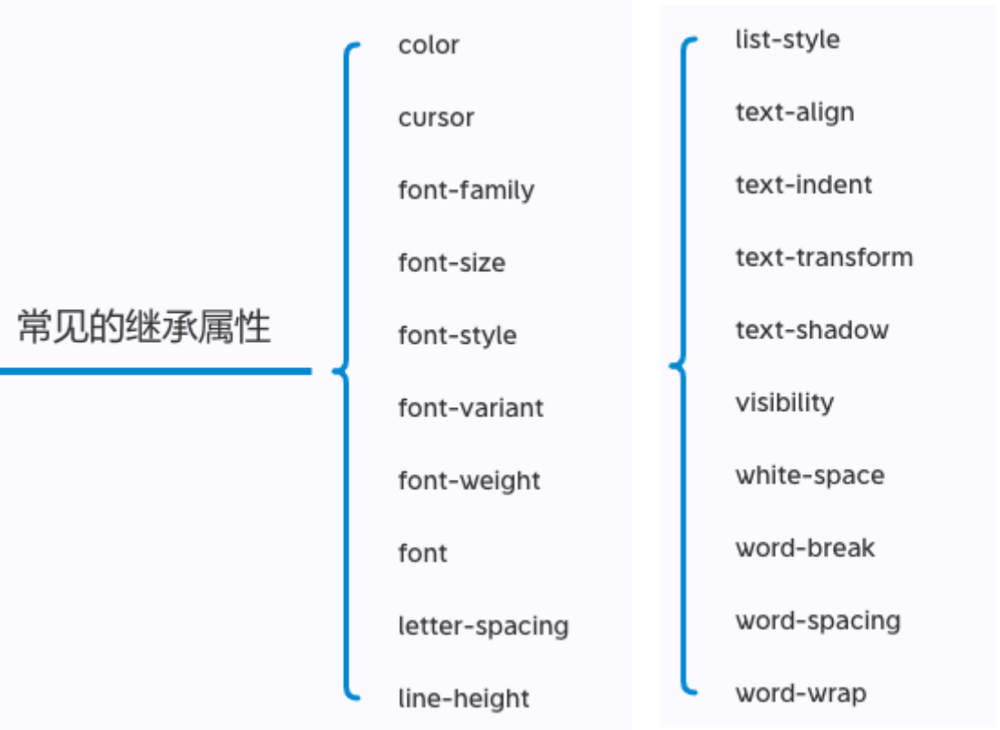
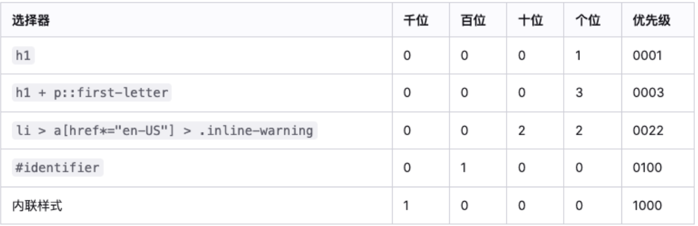

## CSS 的属性继承

CSS 的某些属性具有继承性(Inherited):

如果一个属性具备继承性, 那么在该元素上设置后, 它的后代元素都可以继承这个属性;

当然, 如果后代元素自己有设置该属性, 那么优先使用后代元素自己的属性(不管继承过来的属性权重多高);

如何知道一个属性是否具有继承性呢?

常见的 font-size/font-family/font-weight/line-height/color/text-align 都具有继承性;

这些不用刻意去记, 用的多自然就记住了;

另外要多学会查阅文档, 文档中每个属性都有标明其继承性的

注意(了解):

继承过来的是计算值, 而不是设置值

## 常见的继承属性有哪些呢?(不用记)



## CSS 属性的层叠

CSS 的翻译是层叠样式表, 什么是层叠呢?

对于一个元素来说, 相同一个属性我们可以通过不同的选择器给它进行多次设置;

那么属性会被一层层覆盖上去;

但是最终只有一个会生效

那么多个样式属性覆盖上去, 哪一个会生效呢?

判断一: 选择器的权重, 权重大的生效, 根据权重可以判断出优先级;

判断二: 先后顺序, 权重相同时, 后面设置的生效;

那么如何知道元素的权重呢?

## 选择器的权重

按照经验，为了方便比较 CSS 属性的优先级，可以给 CSS 属性所处的环境定义一个权值（权重）

- !important：10000
- 内联样式：1000
- id 选择器：100
- 类选择器、属性选择器、伪类：10
- 元素选择器、伪元素：1
- 通配符：0



```css
h1+p::first-letter h1(1)+p(1)+::first-letter(1)=3
其他的以此类推
```

## HTML 元素的类型

为了区分哪些元素需要独占一行, 哪些元素不需要独占一行, HTML 将元素区分(本质是通过 CSS 的)成了两类:

- 块级元素（block-level elements）: 独占父元素的一行
- 行内级元素（inline-level elements）:多个行内级元素可以在父元素的同一行中显示

## 通过 CSS 修改元素类型

div 之所以是块级元素仅仅是因为浏览器默认设置了 display 属性而已;

那么我们是否可以通过 display 来改变元素的特性呢?

当然可以!

## CSS 属性 - display

CSS 中有个 display 属性，能修改元素的显示类型，有 4 个常用值

- block：让元素显示为块级元素

- inline：让元素显示为行内级元素

- inline-block：让元素同时具备行内级、块级元素的特征

- none：隐藏元素

事实上 display 还有其他的值, 比如 flex

## display 值的特性(非常重要)

block 元素:

- 独占父元素的一行
- 可以随意设置宽高
- 高度默认由内容决定

inline-block 元素:

- 跟其他行内级元素在同一行显示
- 可以随意设置宽高
- 可以这样理解
  - 对外来说，它是一个行内级元素
  - 对内来说，它是一个块级元素

inline:

- 跟其他行内级元素在同一行显示;
- 不可以随意设置宽高;
- 宽高都由内容决定;

## 编写 HTML 时的注意事项

块级元素、inline-block 元素

- 一般情况下，可以包含其他任何元素（比如块级元素、行内级元素、inline-block 元素）
- 特殊情况，p 元素不能包含其他块级元素

行内级元素（比如 a、span、strong 等）

- 一般情况下，只能包含行内级元素

## 元素隐藏方法

方法一: display 设置为 none

- 元素不显示出来, 并且也不占据位置, 不占据任何空间(和不存在一样);

方法二: visibility 设置为 hidden

- 设置为 hidden, 虽然元素不可见, 但是会占据元素应该占据的空间;
- 默认为 visible, 元素是可见的;

方法三: rgba 设置颜色, 将 a 的值设置为 0

- rgba 的 a 设置的是 alpha 值, 可以设置透明度, 不影响子元素;

方法四: opacity 设置透明度, 设置为 0

- 设置整个元素的透明度, 会影响所有的子元素;

## CSS 属性 - overflow

overflow 用于控制内容溢出时的行为

- visible：溢出的内容照样可见
- hidden：溢出的内容直接裁剪
- scroll：溢出的内容被裁剪，但可以通过滚动机制查看
  - 会一直显示滚动条区域，滚动条区域占用的空间属于 width、height
- auto：自动根据内容是否溢出来决定是否提供滚动机制
