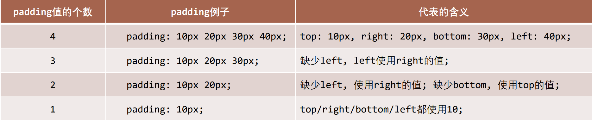
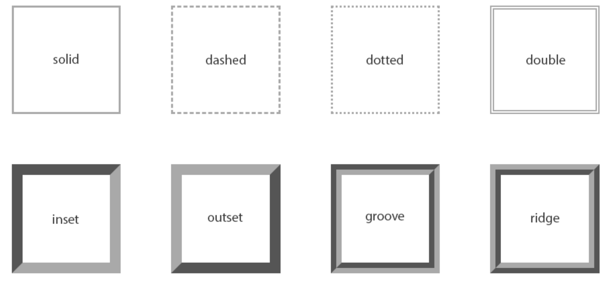
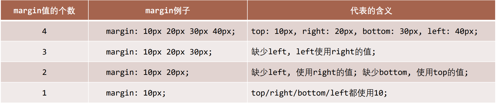
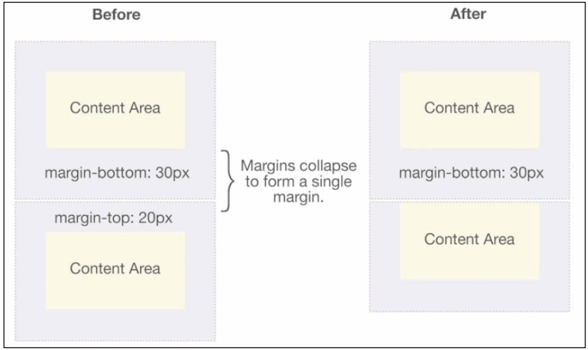
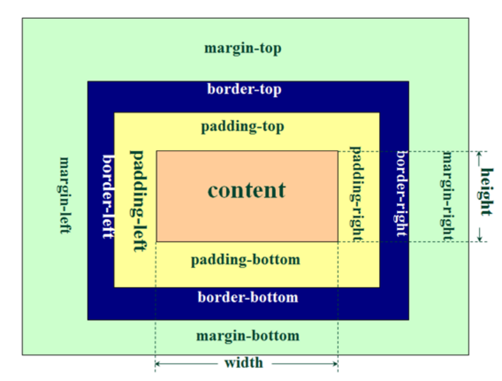
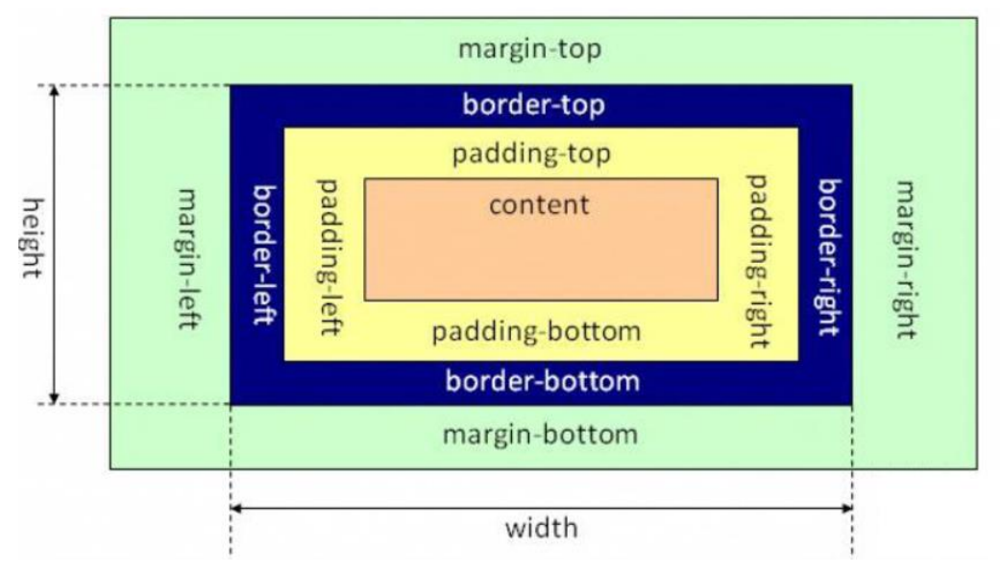

## 盒子模型(Box Model)

HTML 中的每一个元素都可以看做是一个盒子，如右下图所示，可以具备这 4 个属性

内容（content）

- 元素的内容 width/height

内边距（padding）

- 元素边框和内容之间的间距

边框（border）

- 元素自己的边框

外边距（margin）

- 元素和其他元素之间的间距

## 盒子模型的四边

因为盒子有四边, 所以 margin/padding/border 都包括 top/right/bottom/left 四个边，即“上 右 下 左”

## 内容 – 宽度和高度

设置内容是通过宽度和高度设置的:

- 宽度设置: width
- 高度设置: height

注意: 对于行内级非替换元素来说, 设置宽高是无效的!

另外我们还可以设置如下属性:

- min-width：最小宽度，无论内容多少，宽度都大于或等于 min-width
- max-width：最大宽度，无论内容多少，宽度都小于或等于 max-width
- 移动端适配时, 可以设置最大宽度和最小宽度;

下面两个属性不常用:

- min-height：最小高度，无论内容多少，高度都大于或等于 min-height
- max-height：最大高度，无论内容多少，高度都小于或等于 max-height

## 内边距 - padding

padding 属性用于设置盒子的内边距, 通常用于设置边框和内容之间的间距;

padding 包括四个方向, 所以有如下的取值:

- padding-top：上内边距
- padding-right：右内边距
- padding-bottom：下内边距
- padding-left：左内边距

padding 单独编写是一个缩写属性：

- padding-top、padding-right、padding-bottom、padding-left 的简写属性
- padding 缩写属性是从零点钟方向开始, 沿着顺时针转动的, 也就是上右下左;

padding 并非必须是四个值, 也可以有其他值;

## padding 的其他值



## 边框 - border

border 用于设置盒子的边框

边框相对于 content/padding/margin 来说特殊一些

- 边框具备宽度 width;
- 边框具备样式 style;
- 边框具备颜色 color;

### 设置边框的方式

边框宽度

- border-top-width、border-right-width、border-bottom-width、border-left-width
- border-width 是上面 4 个属性的简写属性

边框颜色

- border-top-color、border-right-color、border-bottom-color、border-left-color
- border-color 是上面 4 个属性的简写属性

边框样式

- border-top-style、border-right-style、border-bottom-style、border-left-style
- border-style 是上面 4 个属性的简写属性

### 边框的样式设置值

groove：凹槽, 沟槽, 边框看上去好象是雕刻在画布之内

ridge：山脊, 和 grove 相反，边框看上去好象是从画布中凸出来



### 同时设置的方式

如果我们相对某一边同时设置 宽度 样式 颜色, 可以进行如下设置:

- border-top
- border-right
- border-bottom
- border-left
- border：统一设置 4 个方向的边框

边框颜色、宽度、样式的编写顺序任意

```css
border: 1px solid #eee;
```

## 圆角 – border-radius

border-radius 用于设置盒子的圆角

border-radius 常见的值:

- 数值: 通常用来设置小的圆角, 比如 6px;
- 百分比: 通常用来设置一定的弧度或者圆形;

## border-radius 补充

border-radius 事实上是一个缩写属性:

- 将这四个属性 border-top-left-radius、border-top-right-radius、border-bottom-right-radius，和 border-bottomleft-radius 简写为一个属性。
- 开发中比较少见一个个圆角设置;

如果一个元素是正方形, 设置 border-radius 大于或等于 50%时，就会变成一个圆

## 外边距 - margin

margin 属性用于设置盒子的外边距, 通常用于元素和元素之间的间距;

margin 包括四个方向, 所以有如下的取值:

- margin-top：上外边距
- margin-right：右外边距
- margin-bottom：下外边距
- margin-left：左外边距

margin 单独编写是一个缩写属性：

- margin-top、margin-right、margin-bottom、margin-left 的简写属性
- margin 缩写属性是从零点钟方向开始, 沿着顺时针转动的, 也就是上右下左;

margin 也并非必须是四个值, 也可以有其他值;

## margin 的其他值



## 上下 margin 的传递

margin-top 传递

如果块级元素的顶部线和父元素的顶部线重叠，那么这个块级元素的 margin-top 值会传递给父元素

margin-bottom 传递

如果块级元素的底部线和父元素的底部线重写，并且父元素的高度是 auto，那么这个块级元素的 margin-bottom 值会传递给父元素

如何防止出现传递问题？

- 给父元素设置 padding-top\padding-bottom

- 给父元素设置 border
- 触发 BFC: 设置 overflow 为 auto

建议

- margin 一般是用来设置兄弟元素之间的间距
- padding 一般是用来设置父子元素之间的间距

## 上下 margin 的折叠

垂直方向上相邻的 2 个 margin（margin-top、margin-bottom）有可能会合并为 1 个 margin，这种现象叫做 collapse（折叠）

水平方向上的 margin（margin-left、margin-right）永远不会 collapse

折叠后最终值的计算规则：两个值进行比较，取较大的值

如何防止 margin collapse？

只设置其中一个元素的 margin

## 上下 margin 折叠的情况

两个兄弟块级元素之间上下 margin 的折叠



父子块级元素之间 margin 的折叠


## 外轮廓 - outline

outline 表示元素的外轮廓

- 不占用空间
- 默认显示在 border 的外面

outline 相关属性有

- outline-width: 外轮廓的宽度
- outline-style：取值跟 border 的样式一样，比如 solid、dotted 等
- outline-color: 外轮廓的颜色
- outline：outline-width、outline-style、outline-color 的简写属性，跟 border 用法类似

应用实例

去除 a 元素、input 元素的 focus 轮廓效果

## 盒子阴影 – box-shadow

box-shadow 属性可以设置一个或者多个阴影

```css
每个阴影用<shadow>表示
多个阴影之间用逗号,隔开，从前到后叠加
```

```css
<shadow>的常见格式如下: * 第1个<length>：offset-x, 水平方向的偏移，正数往右偏移 *
    第2个<length>：offset-y,
  垂直方向的偏移，正数往下偏移 * 第3个<length>：blur-radius, 模糊半径 *
    第4个<length>：spread-radius,
  延伸半径 * <color>：阴影的颜色，如果没有设置，就跟随color属性的颜色 *
    inset：外框阴影变成内框阴影;
```

```css
box-shadow: 10px 9px 17px 4px #ff9426;
```

## 盒子阴影 – 在线查看

https://html-css-js.com/css/generator/box-shadow/

## 文字阴影 - text-shadow

text-shadow 用法类似于 box-shadow，用于给文字添加阴影效果

相当于 box-shadow, 它没有 spread-radius 的值;

测试网址：

[Text Shadow CSS Generator Online (html-css-js.com)](https://html-css-js.com/css/generator/text-shadow/)

## 行内非替换元素的注意事项

以下属性对行内级非替换元素不起作用

width、height、margin-top、margin-bottom

以下属性对行内级非替换元素的效果比较特殊

padding-top、padding-bottom、上下方向的 border

## CSS 属性 - box-sizing

box-sizing 用来设置盒子模型中宽高的行为

content-box

padding、border 都布置在 width、height 外边

border-box

padding、border 都布置在 width、height 里边

## box-sizing: content-box



元素的实际占用宽度 = border + padding + width

元素的实际占用高度 = border + padding + height

## box-sizing: border-box


元素的实际占用宽度 = width

元素的实际占用高度 = height

## IE 盒子模型（IE8 以下浏览器）



## W3C 标准盒子模型


## 元素的水平居中方案

在一些需求中，需要元素在父元素中水平居中显示（父元素一般都是块级元素、inline-block）

行内级元素(包括 inline-block 元素)

- 水平居中：在父元素中设置 text-align: center

块级元素

- 水平居中：margin: 0 auto
