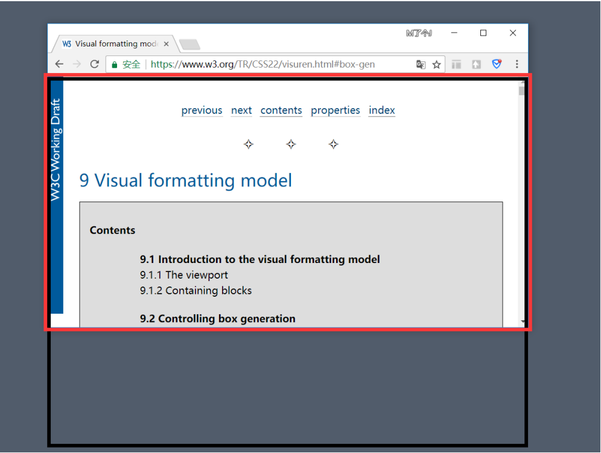
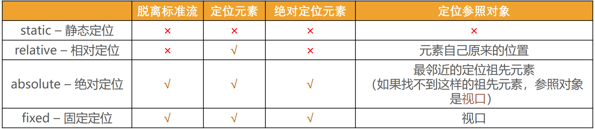

## 标准流（Normal Flow）

默认情况下，元素都是按照 normal flow（标准流、常规流、正常流、文档流【document flow】）进行排布

- 从左到右、从上到下按顺序摆放好
- 默认情况下，互相之间不存在层叠现象

## margin-padding 位置调整

在标准流中，可以使用 margin、padding 对元素进行定位，其中 margin 还可以设置负数

比较明显的缺点是

- 设置一个元素的 margin 或者 padding，通常会影响到标准流中其他元素的定位效果
- 不便于实现元素层叠的效果

## 认识元素的定位

定位允许您从正常的文档流布局中取出元素，并使它们具有不同的行为:

例如放在另一个元素的上面;

或者始终保持在浏览器视窗内的同一位置;

## 认识 position 属性

利用 position 可以对元素进行定位，常用取值有 5 个:

static：默认值, 静态定位

使用下面的值, 可以让元素变成 定位元素(positioned element)

- relative：相对定位
- absolute：绝对定位
- fixed：固定定位
- sticky：粘性定位

## 静态定位 - static

position 属性的默认值

元素按照 normal flow 布局，left 、right、top、bottom 没有任何作用

## 相对定位 - relative

元素按照 normal flow 布局

可以通过 left、right、top、bottom 进行定位

定位参照对象是元素自己原来的位置

相对定位的应用场景：在不影响其他元素位置的前提下，对当前元素位置进行微调

## 固定定位 - fixed

元素脱离 normal flow（脱离标准流、脱标）

可以通过 left、right、top、bottom 进行定位

定位参照对象是视口（viewport）

当画布滚动时，固定不动

## 画布 和 视口

视口（Viewport）：文档的可视区域，如下图红框所示

画布（Canvas）：用于渲染文档的区域

- 文档内容超出视口范围，可以通过滚动查看
- 如下图黑框所示

宽高对比

画布 >= 视口

## 绝对定位 - absolute

元素脱离 normal flow（脱离标准流、脱标）

可以通过 left、right、top、bottom 进行定位

- 定位参照对象是最邻近的定位祖先元素
- 如果找不到这样的祖先元素，参照对象是视口

定位元素（positioned element）

- position 值不为 static 的元素
- 也就是 position 值为 relative、absolute、fixed 的元素

## 子绝父相

在绝大数情况下，子元素的绝对定位都是相对于父元素进行定位

如果希望子元素相对于父元素进行定位，又不希望父元素脱标，常用解决方案是：

- 父元素设置 position: relative（让父元素成为定位元素，而且父元素不脱离标准流）
- 子元素设置 position: absolute
- 简称为“子绝父相”

## 将 position 设置为 absolute/fixed 元素的特点(一)

可以随意设置宽高

宽高默认由内容决定

不再受标准流的约束

- 不再严格按照从上到下、从左到右排布
- 不再严格区分块级(block)、行内级(inline)，行内块级(inline-block)的很多特性都会消失

不再给父元素汇报宽高数据

脱标元素内部默认还是按照标准流布局

## 将 position 设置为 absolute/fixed 元素的特点(二)

绝对定位元素（absolutely positioned element）

- position 值为 absolute 或者 fixed 的元素

对于绝对定位元素来说

- 定位参照对象的宽度 = left + right + margin-left + margin-right + 绝对定位元素的实际占用宽度
- 定位参照对象的高度 = top + bottom + margin-top + margin-bottom + 绝对定位元素的实际占用高度

如果希望绝对定位元素的宽高和定位参照对象一样，可以给绝对定位元素设置以下属性

- eft: 0、right: 0、top: 0、bottom: 0、margin:0

如果希望绝对定位元素在定位参照对象中居中显示，可以给绝对定位元素设置以下属性

- left: 0、right: 0、top: 0、bottom: 0、margin: auto
- 另外，还得设置具体的宽高值（宽高小于定位参照对象的宽高）

## 粘性定位 - sticky

另外还有一个定位的值是 position: sticky，比起其他定位值要新一些

- sticky 是一个大家期待已久的属性;
- 可以看做是相对定位和固定(绝对)定位的结合体;
- 它允许被定位的元素表现得像相对定位一样，直到它滚动到某个阈值点;
- 当达到这个阈值点时, 就会变成固定(绝对)定位;

sticky 是相对于最近的滚动祖先包含滚动视口的(the nearest ancestor scroll container’s scrollport )

## position 值对比

## CSS 属性 - z-index

z-index 属性用来设置定位元素的层叠顺序（仅对定位元素有效）

取值可以是正整数、负整数、0

比较原则

如果是兄弟关系

- z-index 越大，层叠在越上面
- z-index 相等，写在后面的那个元素层叠在上面

如果不是兄弟关系

- 各自从元素自己以及祖先元素中，找出最邻近的 2 个定位元素进行比较
- 而且这 2 个定位元素必须有设置 z-index 的具体数值
