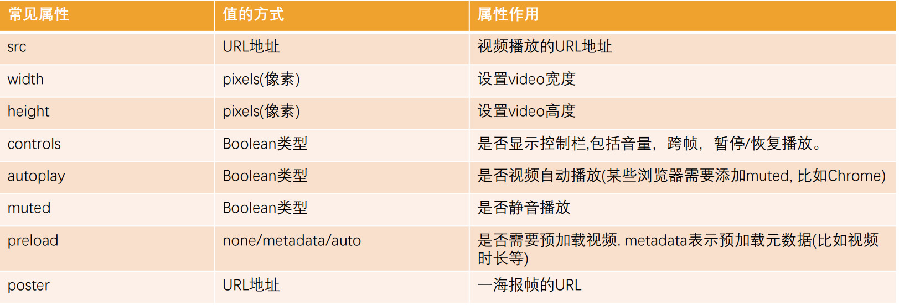
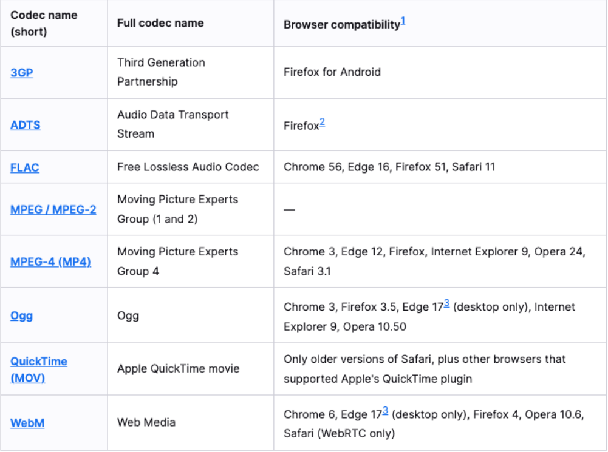
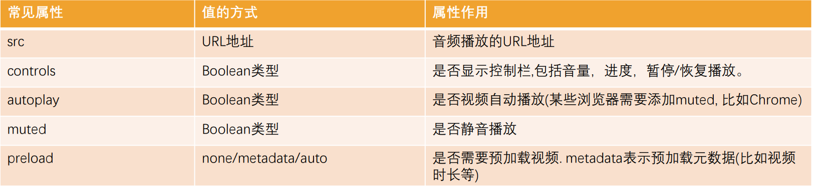
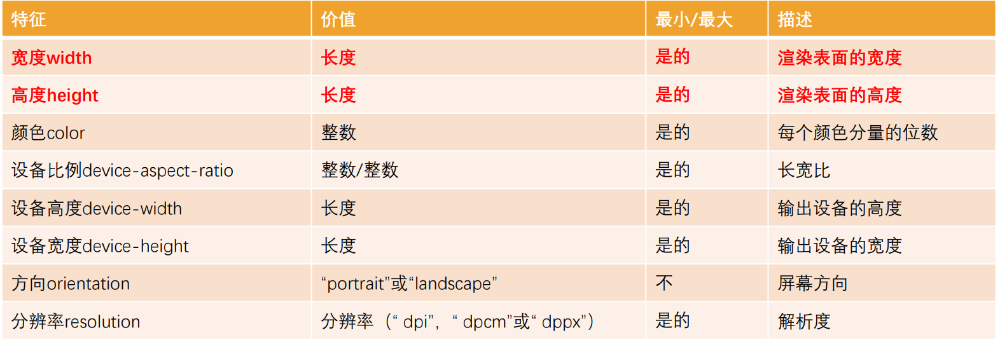
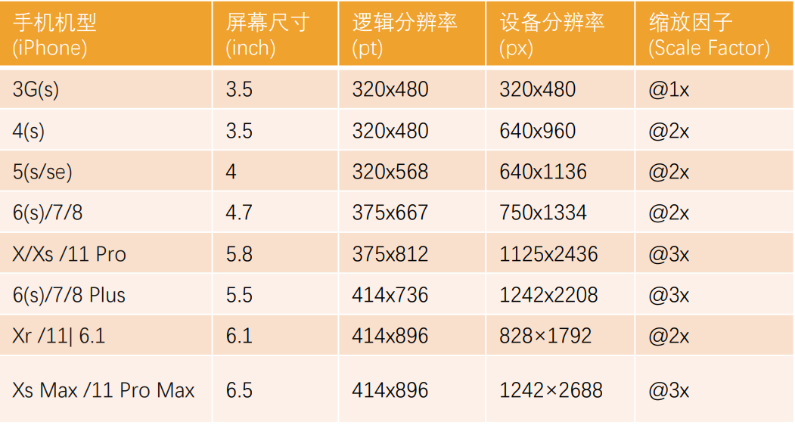

## HTML5 语义化元素

在 HMTL5 之前，我们的网站分布层级通常包括哪些部分呢？

header、nav、main、footer

但是这样做有一个弊端：

- 我们往往过多的使用 div, 通过 id 或 class 来区分元素；
- 对于浏览器来说这些元素不够语义化；
- 对于搜索引擎来说, 不利于 SEO 的优化；

HTML5 新增了语义化的元素：

```html
<header>
  ：头部元素
  <nav>
    ：导航元素
    <section>
      ：定义文档某个区域的元素
      <article>
        ：内容元素
        <aside>
          ：侧边栏元素
          <footer>：尾部元素</footer>
        </aside>
      </article>
    </section>
  </nav>
</header>
```


## HTML5 其他新增元素

Web 端事实上一直希望可以更好的嵌入音频和视频, 特别是 21 世纪以来, 用户带宽的不断提高, 浏览器因为和视频变得非常容易

- 在 HTML5 之前是通过 flash 或者其他插件实现的, 但是会有很多问题
- 比如无法很好的支持 HTML/CSS 特性, 兼容性问题等等

HTML5 增加了对媒体类型的支持：

- 音频：\<audio>
- 视频：\<video>

Video 和 Audio 使用方式有两个：

- 一方面我们可以直接通过元素使用 video 和 autio
- 另一方面我们可以通过 JavaScript 的 API 对其进行控制

## HTML5 新增元素 - video

HTML \<video>元素 用于在 HTML 或者 XHTML 文档中嵌入媒体播放器，用于支持文档内的视频播放

```html
<video src="./assets/fcrs.mp4" width="600" controls muted></video>
```

video 常见的属性:



poster：海报帧图片 URL，用于在视频处于下载中的状态时显示

## video 支持的视频格式

每个视频都会有自己的格式, 浏览器的 video 并非支持所有的视频格式



## video 的兼容性写法

在\<video>元素中间的内容，是针对浏览器不支持此元素时候的降级处理

- 内容一：通过\<source>元素指定更多视频格式的源
- 内容二：通过 p/div 等元素指定在浏览器不支持 video 元素的情况, 显示的内容

```html
<video src="./assets/fcrs.mp4" width="600" controls muted>
  <source src="./asset/fcrs.ogg" />
  <source src="./asset/fcrs.webm" />

  <p>当前您的浏览不支持视频的播放, 请更换更好用的浏览器!</p>
</video>
```

## HTML5 新增元素 - audio

HTML \<audio>元素用于在文档中嵌入音频内容, 和 video 的用法非常类似

```html
<audio src="./assets/yhbk.mp3" controls autoplay muted></audio>
```

常见属性:



## audio 支持的音频格式

每个音频都会有自己的格式, 浏览器的 audio 并非支持所有的视频格式

具体的支持的格式可以通过下面的链接查看:

https://developer.mozilla.org/en-US/docs/Web/Media/Formats/Audio_codecs

在\<audio>元素中间的内容，是针对浏览器不支持此元素时候的降级处理

## input 元素的扩展内容

HTML5 对 input 元素也进行了扩展，在之前我们已经学习过的其中几个属性也是 HTML5 的特性：

- placeholder：输入框的占位文字
- multiple：多个值
- autofocus：最多输入的内容

另外对于 input 的 type 值也有很多扩展：

- date
- time
- number
- tel
- color
- email

查看 MDN 文档:

https://developer.mozilla.org/zh-CN/docs/Web/HTML/Element/Input

## 新增全局属性 data-\*

在 HTML5 中, 新增一种全局属性的格式 data-\*, 用于自定义数据属性:

- data 设置的属性可以在 JavaScript 的 DOM 操作中通过 dataset 轻松获取到；
- 通常用于 HTML 和 JavaScript 数据之间的传递；

在小程序中, 就是通过 data-来传递数据的, 所以该全局属性必须要掌握

```html
<div
  class="box"
  age="18"
  data-name="why"
  data-age="18"
  data-height="1.88"
></div>
```

```js
const boxEl = document.querySelector(".box");
console.log(boxEl.dataset);
```

## CSS 属性 - white-space

white-space 用于设置空白处理和换行规则

- normal：合并所有连续的空白，允许单词超屏时自动换行
- nowrap：合并所有连续的空白，不允许单词超屏时自动换行
- pre：阻止合并所有连续的空白，不允许单词超屏时自动换行
- pre-wrap：阻止合并所有连续的空白，允许单词超屏时自动换行
- pre-line：合并所有连续的空白（但保留换行），允许单词超屏时自动换行

## CSS 属性 - text-overflow

text-overflow 通常用来设置文字溢出时的行为

- clip：溢出的内容直接裁剪掉（字符可能会显示不完整）

- ellipsis：溢出那行的结尾处用省略号表示

text-overflow 生效的前提是 overflow 不为 visible

常见的是将 white-space、text-overflow、overflow 一起使用：

省略号

```css
overflow: hidden;
white-space: nowrap;
text-overflow: ellipsis;
```

## CSS 中的函数

在前面我们有使用过很多个 CSS 函数:

- 比如 rgb/rgba/translate/rotate/scale 等;

- CSS 函数通常可以帮助我们更加灵活的来编写样式的值；

下面我们再学习几个非常好用的 CSS 函数:

- var: 使用 CSS 定义的变量;
- calc: 计算 CSS 值, 通常用于计算元素的大小或位置;
- blur: 毛玻璃(高斯模糊)效果;
- gradient：颜色渐变函数；

### CSS 函数 - var

CSS 中可以自定义属性

- 属性名需要以两个减号（--）开始;
- 属性值则可以是任何有效的 CSS 值;

```css
:root {
  /* 定义了一个变量(CSS属性) */
  /* 只有后代元素可以使用 */
  --main-color: #f00;
}
```

我们可以通过 var 函数来使用:

```css
.box {
  color: var(--main-color);
}
```

规则集定义的选择器, 是自定义属性的可见作用域(只在选择器内部有效)

所以推荐将自定义属性定义在 html 中，也可以使用 :root 选择器;

### CSS 函数 -calc

calc() 函数允许在声明 CSS 属性值时执行一些计算

计算支持加减乘除的运算

\+ 和 - 运算符的两边必须要有空白字符

通常用来设置一些元素的尺寸或者位置

### CSS 函数 - blur

blur() 函数将高斯模糊应用于输出图片或者元素;

- blur(radius)
- radius, 模糊的半径, 用于定义高斯函数的偏差值, 偏差值越大, 图片越模糊

通常会和两个属性一起使用：

- filter: 将模糊或颜色偏移等图形效果应用于元素;

```css
 img {
  filter: blur(5px);
}
```

- backdrop-filter: 为元素后面的区域添加模糊或者其他效果

```css
<div
  class="box"
  >  <div
  class="cover"
  > </div
  > </div
  > .box {
  display: inline-block;
  position: relative;
  /* filter: blur(5px); */
}

.cover {
  position: absolute;
  left: 0;
  right: 0;
  top: 0;
  bottom: 0;
  background-color: rgba(255, 255, 255, 0.2);
  backdrop-filter: blur(10px);
}
```

### CSS 函数 – gradient

\<gradient> 是一种\<image>CSS 数据类型的子类型，用于表现两种或多种颜色的过渡转变

- CSS 的\<image>数据类型描述的是 2D 图形
- 比如 background-image、list-style-image、border-image、content
- \<image>常见的方式是通过 url 来引入一个图片资源
- 它也可以通过 CSS 的\<gradient> 函数来设置颜色的渐变

\<gradient>常见的函数实现有下面几种：

- linear-gradient()：创建一个表示两种或多种颜色线性渐变的图片；
- radial-gradient()：创建了一个图像，该图像是由从原点发出的两种或者多种颜色之间的逐步过渡组成；
- repeating-linear-gradient()：创建一个由重复线性渐变组成的\<image>
- repeating-radial-gradient()：创建一个重复的原点触发渐变组成的\<image>

#### linear-gradient 的使用

linear-gradient：创建一个表示两种或多种颜色线性渐变的图片；

```css
background-image: linear-gradient(red, blue);
/* 改变方向 */
background-image: linear-gradient(to right, red, blue);
background-image: linear-gradient(to right top, red, blue);
background-image: linear-gradient(-45deg, red, blue);
background-image: linear-gradient(
  to right,
  red,
  blue 40px,
  orange 60%,
  purple 100%
);
```

radial-gradient：创建了一个图像，该图像是由从原点发出的两种或者多种颜色之间的逐步过渡组成；

```css
background-image: radial-gradient(red, blue);
background-image: radial-gradient(at 0% 50%, red, blue);
```

## 浏览器前缀

有时候可能会看到有些 CSS 属性名前面带有：-o-、-xv-、-ms-、mso-、-moz-、-webkit-

官方文档专业术语叫做：vendor-specific extensions（供应商特定扩展）

为什么需要浏览器前缀了？

- CSS 属性刚开始并没有成为标准，浏览器为了防止后续会修改名字给新的属性添加了浏览器前缀

上述前缀叫做浏览器私有前缀，只有对应的浏览器才能解析使用

- -o-、-xv-：Opera 等
- -ms-、mso-：IE 等
- -moz-：Firefox 等
- -webkit-：Safari、Chrome 等

注意：不需要手动添加，后面学习了模块化打包工具会自动添加浏览器前缀

## FC – Formatting Context

FC 的全称是 Formatting Context，元素在标准流里面都是属于一个 FC 的

块级元素的布局属于 Block Formatting Context（BFC）,也就是 block level box 都是在 BFC 中布局的

行内级元素的布局属于 Inline Formatting Context（IFC）,而 inline level box 都是在 IFC 中布局的

## BFC – Block Formatting Context

MDN 上有整理出在哪些具体的情况下会创建 BFC：

- 根元素（\<html>）
- 浮动元素（元素的 float 不是 none）
- 绝对定位元素（元素的 position 为 absolute 或 fixed）
- 行内块元素（元素的 display 为 inline-block）
- 表格单元格（元素的 display 为 table-cell，HTML 表格单元格默认为该值），表格标题（元素的 display 为 table-caption，HTML 表格标题默认为该值）
- 匿名表格单元格元素（元素的 display 为 table、table-row、 table-row-group、table-header-group、table-footer-group（分别是 HTML table、 row、tbody、thead、tfoot 的默认属性）或 inline-table）
- overflow 计算值(Computed)不为 visible 的块元素
- 弹性元素（display 为 flex 或 inline-flex 元素的直接子元素）
- 网格元素（display 为 grid 或 inline-grid 元素的直接子元素）
- display 值为 flow-root 的元素

## BFC 有什么作用呢？

简单概况如下：

- 在 BFC 中，box 会在垂直方向上一个挨着一个的排布；
- 垂直方向的间距由 margin 属性决定；
- 在同一个 BFC 中，相邻两个 box 之间的 margin 会折叠（collapse）；
- 在 BFC 中，每个元素的左边缘是紧挨着包含块的左边缘的；

那么这个东西有什么用呢？

## BFC 的作用一：解决折叠问题

在同一个 BFC 中，相邻两个 box 之间的 margin 会折叠（collapse）

那么如果我们让两个 box 是不同的 BFC 呢？那么就可以解决折叠问题

## BFC 的作用二：解决浮动高度塌陷

网上有很多说法，BFC 可以解决浮动高度塌陷，可以实现清除浮动的效果

- 但是从来没有给出过 BFC 可以解决高度塌陷的原理或者权威的文档说明
- 他们也压根没有办法解释，为什么可以解决浮动高度的塌陷问题，但是不能解决绝对定位元素的高度塌陷问题呢？

事实上，BFC 解决高度塌陷需要满足两个条件：

- 浮动元素的父元素触发 BFC，形成独立的块级格式化上下文（Block Formatting Context）；
- 浮动元素的父元素的高度是 auto 的；

BFC 的高度是 auto 的情况下，是如下方法计算高度的

- 1.如果只有 inline-level，是行高的顶部和底部的距离；
- 2.如果有 block-level，是由最底层的块上边缘和最底层块盒子的下边缘之间的距离
- 3.如果有绝对定位元素，将被忽略；
- 4.如果有浮动元素，那么会增加高度以包括这些浮动元 素的下边缘

## 媒体查询

媒体查询是一种提供给开发者针对不同设备需求进行定制化开发的一个接口

你可以根据设备的类型（比如屏幕设备、打印机设备）或者特定的特性（比如屏幕的宽度）来修改你的页面

媒体查询的使用方式主要有三种：

- 方式一：通过@media 和@import 使用不同的 CSS 规则（常用）；

```css
/* @import是可以和媒体查询结合来使用 */
@import url(./css/body_bgc.css) (max-width: 800px);
```

- 方式二：使用 media 属性为\<style> \<link> \<source> 和其他 HTML 元素指定特定的媒体类型；

```html
<link
  rel="stylesheet"
  media="screen and (max-width: 800px)"
  href="./css/body_bgc.css"
/>
```

```css
<style>
    @media (max-width: 800px) {
        body {
            background-color: orange;
        }
    }

    @media screen {

    }
</style>
```

- 方式三：使用 Window.matchMedia() 和 MediaQueryList.addListener() 方法来测试和监控媒体状态；

比较常用的是通过@media 来使用不同的 CSS 规则，目前掌握这个即可；

## 媒体查询 - 媒体类型（Media types）

在使用媒体查询时，你必须指定要使用的媒体类型

媒体类型是可选的，并且会（隐式地）应用 all 类型

常见的媒体类型值如下：

- all：适用于所有设备
- print：适用于在打印预览模式下在屏幕上查看的分页材料和文档
- screen（掌握）：主要用于屏幕
- speech：主要用于语音合成器

被废弃的媒体类型：

- CSS2.1 和 Media Queries 3 定义了一些额外的媒体类型(tty, tv, projection, handheld, braille, embossed, 以及 aural)
- 但是他们在 Media Queries 4 中已经被废弃，并且不应该被使用
- aural 类型被替换为具有相似效果的 speech

## 媒体查询 – 媒体特性（Media features）

媒体特性（Media features）描述了 浏览器、输出设备，或是预览环境的具体特征

- 通常会将媒体特性描述为一个表达式；
- 每条媒体特性表达式都必须用括号括起来；



## 媒体查询 – 逻辑操作符（logical operators）

媒体查询的表达式最终会获得一个 Boolean 值，也就是真（true）或者假（false）

- 如果结果为真（true），那么就会生效
- 如果结果为假（false），那么就不会生效

如果有多个条件，我们可以通过逻辑操作符联合复杂的媒体查询：

- and：and 操作符用于将多个媒体查询规则组合成单条媒体查询
- not：not 运算符用于否定媒体查询，如果不满足这个条件则返回 true，否则返回 false
- only：only 运算符仅在整个查询匹配时才用于应用样式
- , (逗号)：逗号用于将多个媒体查询合并为一个规则

比如下面的媒体查询，表示：屏幕宽度大于 500，小于 700 的时候，body 背景颜色为红色

```css
@media (min-width: 500px) and (max-width: 700px) {
  body {
    background-color: red;
  }
}
```

## 常见的移动端设备

这里我们以 iPhone 为例：



```css
@media (min-width: 320px) and (max-width: 375px) {
  .box {
    font-size: 15px;
  }
}
@media (min-width: 375px) and (max-width: 414px) {
  .box {
    font-size: 18px;
  }
}
@media (min-width: 414px) and (max-width: 480px) {
  .box {
    font-size: 21px;
  }
}
@media (min-width: 480px) {
  .box {
    font-size: 24px;
  }
}
```
