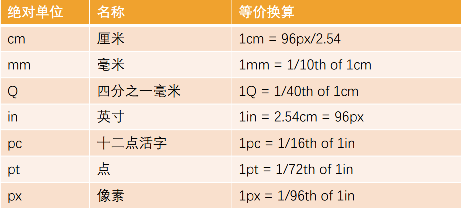
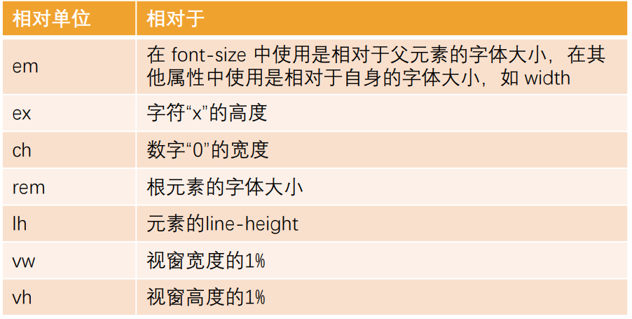
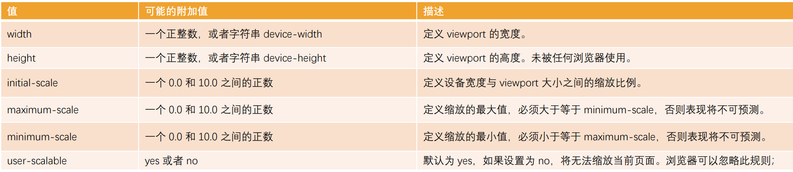
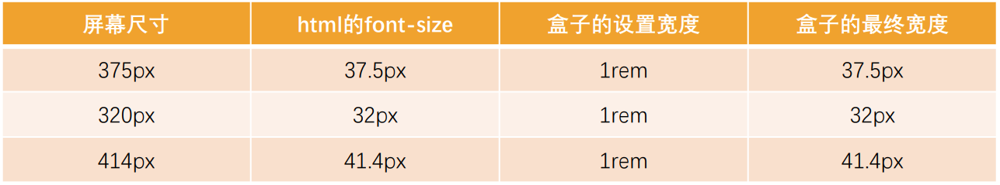
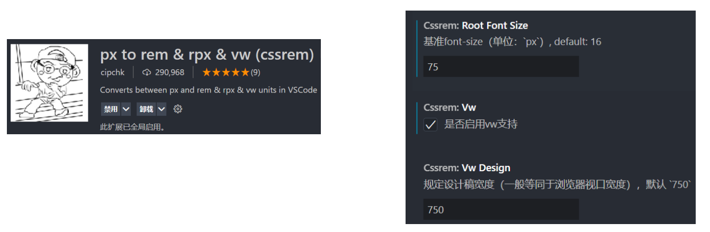
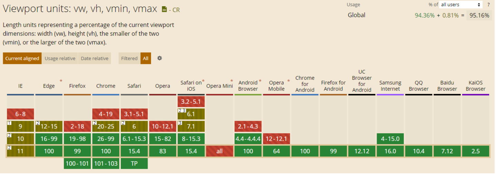
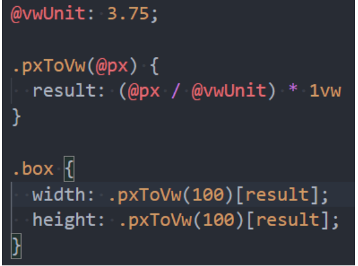
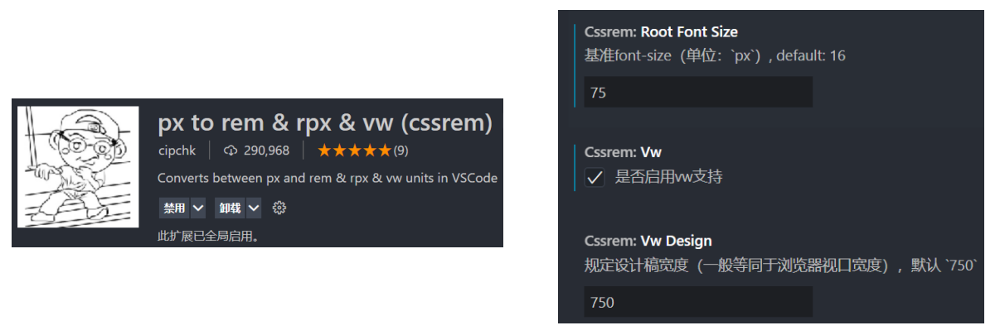

## CSS 中的单位

前面编写的 CSS 中，我们经常会使用 px 来表示一个长度（大小），比如 font-size 设置为 18px，width 设置为 100px

px 是一个长度（length）单位，事实上 CSS 中还有非常多的长度单位

整体可以分成两类：

- 绝对长度单位（Absolute length units）
- 相对长度单位（Relative length units）

## CSS 中的绝对单位（ Absolute length units ）

绝对单位：

- 它们与其他任何东西都没有关系，通常被认为总是相同的大小
- 这些值中的大多数在用于打印时比用于屏幕输出时更有用，例如，我们通常不会在屏幕上使用 cm
- 惟一一个您经常使用的值，就是 px(像素)



## CSS 中的相对单位（ Relative length units ）

相对长度单位

- 相对长度单位相对于其他一些东西
- 比如父元素的字体大小，或者视图端口的大小
- 使用相对单位的好处是，经过一些仔细的规划，您可以使文本或其他元素的大小与页面上的其他内容相对应



## 当我们聊 pixel 时，到底在聊些什么？

前面我们已经一直在使用 px 单位了，px 是 pixel 单词的缩写，翻译为像素

那么像素到底是什么呢？

- 像素是影响显示的基本单位。（比如屏幕上看到的画面、一幅图片）
- pix 是英语单词 picture 的常用简写，加上英语单词“元素”element，就得到 pixel
- “像素”表示“画像元素”之意，有时亦被称为 pel（picture element）

## 像素的不同分类（一）

但是这个 100 个 pixel 到底是多少呢？

- 我们确实可以在屏幕上看到一个大小，但是这个大小代表的真实含义是什么呢？
- 我们经常说一个电脑的分辨率、手机的分辨率，这个 CSS 当中的像素又是什么关系呢？

这里我们要深入到不同的像素概念中，来理解 CSS 中的 pixel 到底代表什么含义

像素单位常见的有三种像素名称：

- 设备像素（也称之为物理像素）；
- 设备独立像素（也称之为逻辑像素）；
- CSS 像素；

## 物理像素和逻辑像素

设备像素，也叫物理像素。

- 设备像素指的是显示器上的真实像素，每个像素的大小是屏幕固有的属性，屏幕出厂以后就不会改变了；
- 我们在购买显示器或者手机的时候，提到的设备分辨率就是设备像素的大小；
- 比如 iPhone X 的分辨率 1125x2436，指的就是设备像素；

设备独立像素，也叫逻辑像素。

- 如果面向开发者我们使用设备像素显示一个 100px 的宽度，那么在不同屏幕上显示效果会是不同的；
- 开发者针对不同的屏幕很难进行较好的适配，编写程序必须了解用户的分辨率来进行开发；
- 所以在设备像素之上，操作系统为开发者进行抽象，提供了逻辑像素的概念；
- 比如你购买了一台显示器，在操作系统上是以 1920x1080 设置的显示分辨率，那么无论你购买的是 2k、4k 的显示器，对于开发者来说，都是 1920x1080 的大小。

CSS 像素

CSS 中我们经常使用的单位也是 pixel，它在默认情况下等同于设备独立像素（也就是逻辑像素）；

毕竟逻辑像素才是面向我们开发者的；

我们可以通过 JavaScript 中的 screen.width 和 screen.height 获取到电脑的逻辑分辨率：

## DPR、PPI

DPR：device pixel ratio

- 2010 年，iPhone4 问世，不仅仅带来了移动互联网，还带来了 Retina 屏幕；
- Retina 屏幕翻译为视网膜显示屏，可以为用户带来更好的显示；
- 在 Retina 屏幕中，一个逻辑像素在长度上对应两个物理像素，这个比例称之为设备像素比（device pixel ratio）；
- 我们可以通过 window.devicePixelRatio 获取到当前屏幕上的 DPR 值；

PPI（了解）：每英寸像素（英语：Pixels Per Inch，缩写：PPI）

- 通常用来表示一个打印图像或者显示器上像素的密度；
- 前面我们提过 1 英寸=2.54 厘米，在工业领域被广泛应用；

## CSS 编写的痛点

CSS 作为一种样式语言, 本身用来给 HTML 元素添加样式是没有问题的

但是目前前端项目已经越来越复杂, 不再是简简单单的几行 CSS 就可以搞定的, 我们需要几千行甚至上万行的 CSS 来完成页面的美化工作

随着代码量的增加, 必然会造成很多的编写不便：

- 比如大量的重复代码, 虽然可以用类来勉强管理和抽取, 但是使用起来依然不方便
- 比如无法定义变量（当然目前已经支持）, 如果一个值被修改, 那么需要修改大量代码, 可维护性很差; (比如主题颜色)
- 比如没有专门的作用域和嵌套, 需要定义大量的 id/class 来保证选择器的准确性, 避免样式混淆
- 等等一系列的问题

所以有一种对 CSS 称呼是 “面向命名编程”

社区为了解决 CSS 面临的大量问题, 出现了一系列的 CSS 预处理器(CSS_preprocessor)

- CSS 预处理器是一个能让你通过预处理器自己独有的语法来生成 CSS 的程序;
- 市面上有很多 CSS 预处理器可供选择，且绝大多数 CSS 预处理器会增加一些原生 CSS 不具备的特性;
- 代码最终会转化为 CSS 来运行, 因为对于浏览器来说只识别 CSS;

## 常见的 CSS 预处理器

常见的预处理器有哪些呢? 目前使用较多的是三种预处理器:

Sass/Scss：

- 2007 年诞生，最早也是最成熟的 CSS 预处理器，拥有 ruby 社区的支持，是属于 Haml（一种模板系统）的一部分;
- 目前受 LESS 影响，已经进化到了全面兼容 CSS 的 SCSS;

Less:

- 2009 年出现，受 SASS 的影响较大，但又使用 CSS 的语法，让大部分开发者更容易上手;
- 比起 SASS 来，可编程功能不够，不过优点是使用方式简单、便捷，兼容 CSS，并且已经足够使用；
- 另外反过来也影响了 SASS 演变到了 SCSS 的时代；
- 著名的 Twitter Bootstrap 就是采用 LESS 做底层语言的，也包括 React 的 UI 框架 AntDesign。

Stylus:

- 2010 年产生，来自 Node.js 社区，主要用来给 Node 项目进行 CSS 预处理支持;
- 语法偏向于 Python, 使用率相对于 Sass/Less 少很多

## 认识 Less

什么是 Less 呢? 我们来看一下官方的介绍:

Less （Leaner Style Sheets 的缩写） 是一门 CSS 扩展语言, 并且兼容 CSS。

- Less 增加了很多相比于 CSS 更好用的特性;
- 比如定义变量、混入、嵌套、计算等等；
- Less 最终需要被编译成 CSS 运行于浏览器中（包括部署到服务器中）；

## less 代码的编译

方式一：下载 Node 环境，通过 npm 包管理下载 less 工具，使用 less 工具对代码进行编译；

- 因为目前我们还没有学习过 Node，更没有学习过 npm 工具；
- 所以先阶段不推荐大家使用 less 本地工具来管理；
- 后续我们学习了 webpack 其实可以自动完成这些操作的；

方法二：通过 VSCode 插件来编译成 CSS 或者在线编译

https://lesscss.org/less-preview/

方式三：引入 CDN 的 less 编译代码，对 less 进行实时的处理；

```html
<script src="https://cdn.jsdelivr.net/npm/less@4"></script>
```

方式四：将 less 编译的 js 代码下载到本地，执行 js 代码对 less 进行编译；

## Less 语法一：Less 兼容 CSS

Less 语法一：Less 是兼容 CSS 的

所以我们可以在 Less 文件中编写所有的 CSS 代码；

只是将 css 的扩展名改成了.less 结尾而已；

## Less 语法二 – 变量（Variables）

在一个大型的网页项目中，我们 CSS 使用到的某几种属性值往往是特定的

- 比如我们使用到的主题颜色值，那么每次编写类似于#f3c258 格式的语法；
- 一方面是记忆不太方便，需要重新编写或者拷贝样式；
- 另一方面如果有一天主题颜色改变，我们需要修改大量的代码；
- 所以，我们可以将常见的颜色或者字体等定义为变量来使用；

在 Less 中使用如下的格式来定义变量；

- @变量名: 变量值;

```css
@mainColor: #a40011;

div {
  color: @mainColor;
}
```

## Less 语法三 – 嵌套（Nesting）

特殊符号：& 表示当前选择器的父级

```css
.list {
  .item {
    font-size: 20px;

    &:hover {
      color: @mainColor;
    }

    &:nth-child(1) {
      color: orange;
    }

    &:nth-child(2) {
      color: #00f;
    }
  }
}
```

## Less 语法四 – 运算（Operations）

在 Less 中，算术运算符 +、-、 \* 、/ 可以对任何数字、颜色或变量进行运算。

算术运算符在加、减或比较之前会进行单位换算，计算的结果以最左侧操作数的单位类型为准；

如果单位换算无效或失去意义，则忽略单位；

```css
.box {
  width: 10% + 50px; // 60%
  background-color: #ff0000 + #00ff00; // #ffff00
}
```

## Less 语法五 – 混合没有参数（Mixins）

在原来的 CSS 编写过程中，多个选择器中可能会有大量相同的代码

我们希望可以将这些代码进行抽取到一个独立的地方，任何选择器都可以进行复用；

在 less 中提供了混入（Mixins）来帮助我们完成这样的操作；

混合（Mixin）是一种将一组属性从一个规则集（或混入）到另一个规则集的方法

注意：混入在没有参数的情况下，小括号可以省略，但是不建议这样使用

```css
.nowrap_ellipsis {
  white-space: nowrap;
  text-overflow: ellipsis;
  overflow: hidden;
}

.box {
  .nowrap_ellipsis();
}
```

## Less 语法五 – 混合带参数（Mixins）

混入也可以传入变量（暂时了解）

```css
.box_border(@borderWidth: 5px, @borderColor: purple) {
  border: @borderWidth solid @borderColor;
}

.box {
  .box_border(10px, orange);
}
```

## Less 语法六：映射（Maps）

作用: 弥补 less 中不能自定义函数的缺陷

```css
.box_size {
  width: 100px;
  height: 100px;
}

.box {
  width: .box_size() [width];
}
```

混入和映射结合：混入也可以当做一个自定义函数来使用（暂时了解）

```css
.pxToRem(@px) {
  result: (@px / @htmlFontSize) * 1rem;
}

.box {
  width: .pxToRem(100) [result];
  font-size: .pxToRem(18) [result];
}
```

## Less 语法七：extend 继承

和 mixins 作用类似，用于复用代码；

和 mixins 相比，继承代码最终会转化成并集选择器；

```css
.box_border {
  border: 5px solid #f00;
}

.box {
  width: 100px;
  background-color: orange;

  &:extend(.box_border);
}
```

## Less 语法八：Less 内置函数

Less 内置了多种函数用于转换颜色、处理字符串、算术运算等。

内置函数手册：https://less.bootcss.com/functions/

```css
.box {
  color: color(red); // 将red转为RGB的值
  width: convert(100px, "in"); // 单位的转换
  font-size: ceil(18.5px); // 数学函数，上取整
}
```

## Less 语法九：作用域（Scope）

在查找一个变量时，首先在本地查找变量和混合（mixins）；

如果找不到，则从“父”级作用域继承；

```css
@mainColor: #f00;

.box_mixin {
  @mainColor: orange;
}

.box {
  .item {
    span {
      color: @mainColor; // orange
      .box_mixin();
    }
  }
}
```

## Less 语法十：注释（Comments）

在 Less 中，块注释和行注释都可以使用；

- // 单行注释
- /_ 多行注释 _/

## Less 语法十一：导入（Importing）

导入的方式和 CSS 的用法是一致的；

导入一个 .less 文件，此文件中的所有变量就可以全部使用了；

如果导入的文件是 .less 扩展名，则可以将扩展名省略掉；

## 认识 Sass 和 Scss

事实上，最初 Sass 是 Haml 的一部分，Haml 是一种模板系统，由 Ruby 开发者设计和开发。

所以，Sass 的语法使用的是类似于 Ruby 的语法，没有花括号，没有分号，具有严格的缩进；

我们会发现它的语法和 CSS 区别很大，后来官方推出了全新的语法 SCSS，意思是 Sassy CSS，他是完全兼容 CSS 的

目前在前端学习 SCSS 直接学习 SCSS 即可：

- SCSS 的语法也包括变量、嵌套、混入、函数、操作符、作用域等；
- 通常也包括更为强大的控制语句、更灵活的函数、插值语法等；
- 大家可以根据之前学习的 less 语法来学习一些 SCSS 语法；
- https://sass-lang.com/guide

## 什么是移动端适配？

移动端开发目前主要包括三类：

- 原生 App 开发（iOS、Android、RN、uniapp、Flutter 等）
- 小程序开发（原生小程序、uniapp、Taro 等）
- Web 页面（移动端的 Web 页面，可以使用浏览器或者 webview 浏览）

这里有两个概念：

- 自适应：根据不同的设备屏幕大小来自动调整尺寸、大小；
- 响应式：会随着屏幕的实时变动而自动调整，是一种自适应；

## 认识视口 viewport

在前面我们已经简单了解过视口的概念了：

- 在一个浏览器中，我们可以看到的区域就是视口（viewport）；
- 我们说过 fixed 就是相对于视口来进行定位的；
- 在 PC 端的页面中，我们是不需要对视口进行区分，因为我们的布局视口和视觉视口是同一个；

但是在移动端，不太一样，你布局的视口和你可见的视口是不太一样的。

这是因为移动端的网页窗口往往比较小，我们可能会希望一个大的网页在移动端可以完整的显示；

所以在默认情况下，移动端的布局视口是大于视觉视口的；

所以在移动端，我们可以将视口划分为三种情况：

- 布局视口（layout viewport）
- 视觉视口（visual layout）
- 理想视口（ideal layout）

## 布局视口和视觉视口

布局视口（layout viewport）

默认情况下，一个在 PC 端的网页在移动端会如何显示呢？

- 第一，它会按照宽度为 980px 来布局一个页面的盒子和内容；
- 第二，为了显示可以完整的显示在页面中，对整个页面进行缩小；

我们相对于 980px 布局的这个视口，称之为布局视口（layout viewport）；

布局视口的默认宽度是 980px；

视觉视口（visual viewport）

- 如果默认情况下，我们按照 980px 显示内容，那么右侧有一部分区域 就会无法显示，所以手机端浏览器会默认对页面进行缩放以显示到用 户的可见区域中；
- 那么显示在可见区域的这个视口，就是视觉视口（visual viewport）

## 理想视口（ideal viewport）

如果所有的网页都按照 980px 在移动端布局，那么最终页面都会被缩放显示。

事实上这种方式是不利于我们进行移动的开发的，我们希望的是设置 100px，那么显示的就是 100px；

如何做到这一点呢？通过设置理想视口（ideal viewport）；

理想视口（ideal viewport）：

- 默认情况下的 layout viewport 并不适合我们进行布局；
- 我们可以对 layout viewport 进行宽度和缩放的设置，以满足正常在一个移动端窗口的布局；
- 这个时候可以设置 meta 中的 viewport；



## 移动端适配方案

移动端的屏幕尺寸通常是非常繁多的，很多时候我们希望在不同的屏幕尺寸上显示不同的大小；

比如我们设置一个 100x100 的盒子

- 在 375px 的屏幕上显示是 100x100;
- 在 320px 的屏幕上显示是 90+x90+;
- 在 414px 的屏幕上显示是 100+x100+;

其他尺寸也是类似，比如 padding、margin、border、left，甚至是 font-size 等等；

这个时候，我们可能可以想到一些方案来处理尺寸：

- 方案一：百分比设置；
  - 因为不同属性的百分比值，相对的可能是不同参照物，所以百分比往往很难统一；
  - 所以百分比在移动端适配中使用是非常少的；
- 方案二：rem 单位+动态 html 的 font-size；
- 方案三：vw 单位；
- 方案四：flex 的弹性布局；

## 适配方案 – rem+动态 html 的 font-size

rem 单位是相对于 html 元素的 font-size 来设置的，那么如果我们需要在不同的屏幕下有不同的尺寸，可以动态的修改 html 的 font-size 尺寸。

比如如下案例：

- 1.设置一个盒子的宽度是 2rem；
- 2.设置不同的屏幕上 html 的 font-size 不同；



这样在开发中，我们只需要考虑两个问题：

- 问题一：针对不同的屏幕，设置 html 不同的 font-size；
- 问题二：将原来要设置的尺寸，转化成 rem 单位；

## rem 的 font-size 尺寸

方案一：媒体查询

可以通过媒体查询来设置不同尺寸范围内的屏幕 html 的 font-size 尺寸；

缺点：

- 1.我们需要针对不同的屏幕编写大量的媒体查询；
- 2.如果动态改变尺寸，不会实时的进行更新；

```css
@media screen and (min-width: 320px) {
  html {
    font-size: 20px;
  }
}

@media screen and (min-width: 375px) {
  html {
    font-size: 24px;
  }
}

@media screen and (min-width: 414px) {
  html {
    font-size: 28px;
  }
}

@media screen and (min-width: 480px) {
  html {
    font-size: 32px;
  }
}

.box {
  width: 5rem;
  height: 5rem;
  background-color: orange;
}
```

方案二：编写 js 代码

如果希望实时改变屏幕尺寸时，font-size 也可以实时更改，可以通过 js 代码；

方法：

- 1.根据 html 的宽度计算出 font-size 的大小，并且设置到 html 上；
- 2.监听页面的实时改变，并且重新设置 font-size 的大小到 html 上；

```js
// 1.获取html的元素
const htmlEl = document.documentElement;

function setRemUnit() {
  // 2.获取html的宽度(视口的宽度)
  const htmlWidth = htmlEl.clientWidth;
  // 3.根据宽度计算一个html的font-size的大小
  const htmlFontSize = htmlWidth / 10;
  // 4.将font-size设置到html上
  htmlEl.style.fontSize = htmlFontSize + "px";
}
// 保证第一次进来时, 可以设置一次font-size
setRemUnit();

// 当屏幕尺寸发生变化时, 实时来修改html的font-size
window.addEventListener("resize", setRemUnit);
```

方案三：lib-flexible 库

事实上，lib-flexible 库做的事情是相同的，你也可以直接引入它；

```css
(function flexible (window, document) {
  var docEl = document.documentElement
  var dpr = window.devicePixelRatio || 1

  // adjust body font size
  function setBodyFontSize () {
    if (document.body) {
      document.body.style.fontSize = (12 * dpr) + 'px'
    }
    else {
      document.addEventListener('DOMContentLoaded', setBodyFontSize)
    }
  }
  setBodyFontSize();

  // set 1rem = viewWidth / 10
  function setRemUnit () {
    var rem = docEl.clientWidth / 10
    docEl.style.fontSize = rem + 'px'
  }

  setRemUnit()

  // reset rem unit on page resize
  window.addEventListener('resize', setRemUnit)
  window.addEventListener('pageshow', function (e) {
    if (e.persisted) {
      setRemUnit()
    }
  })

  // detect 0.5px supports
  if (dpr >= 2) {
    var fakeBody = document.createElement('body')
    var testElement = document.createElement('div')
    testElement.style.border = '.5px solid transparent'
    fakeBody.appendChild(testElement)
    docEl.appendChild(fakeBody)
    if (testElement.offsetHeight === 1) {
      docEl.classList.add('hairlines')
    }
    docEl.removeChild(fakeBody)
  }
}(window, document))
```

## rem 的单位换算

方案一：手动换算

- 比如有一个在 375px 屏幕上，100px 宽度和高度的盒子；
- 我们需要将 100px 转成对应的 rem 值；
- 100/37.5=2.6667，其他也是相同的方法计算即可；

方案二：less/scss 函数

```css
.pxToRem(@px) {
  result: 1rem * (@px / 37.5);
}

.box {
  width: .pxToRem(100) [result];
  height: .pxToRem(100) [result];
  background-color: orange;
}

p {
  font-size: .pxToRem(14) [result];
}
```

方案三：postcss-pxtorem（后续学习）

目前在前端的工程化开发中，我们可以借助于 webpack 的工具来完成自动的转化；

方案四：VSCode 插件

px to rem 的插件，在编写时自动转化；



## 适配方案 - vw

在 flexible GitHub 上已经有写过这样的一句话：

> 由于 viewport 单位得到众多浏览器的兼容，lib-flexible 这个过渡方案已经可以放弃使用，不管是现在的版本还是以前的版本，都存有一定的问题。建议大家开始使用 viewport 来替代此方。

所以它更推荐使用 viewport 的两个单位 vw、wh。

vw 的兼容性如何呢？



## vw 和 rem 的对比

rem 事实上是作为一种过渡的方案，它利用的也是 vw 的思想

- 前面不管是我们自己编写的 js，还是 flexible 的源码
- 都是将 1rem 等同于设计稿的 1/10，在利用 1rem 计算相对于整个屏幕的尺寸大小
- 那么我们来思考，1vw 不是刚好等于屏幕的 1/100 吗
- 而且相对于 rem 还更加有优势

vw 相比于 rem 的优势：

- 优势一：不需要去计算 html 的 font-size 大小，也不需要给 html 设置这样一个 font-size；
- 优势二：不会因为设置 html 的 font-size 大小，而必须给 body 再设置一个 font-size，防止继承；
- 优势三：因为不依赖 font-size 的尺寸，所以不用担心某些原因 html 的 font-size 尺寸被篡改，页面尺寸混乱；
- vw 相比于 rem 更加语义化，1vw 刚才是 1/100 的 viewport 的大小;
- 优势五：可以具备 rem 之前所有的优点；

vw 我们只面临一个问题，将尺寸换算成 vw 的单位即可；

所以，目前相比于 rem，更加推荐大家使用 vw（但是理解 rem 依然很重要）

## vw 的单位换算

方案一：手动换算

比如有一个在 375px 屏幕上，100px 宽度和高度的盒子；

我们需要将 100px 转成对应的 vw 值；

100/3.75=26.667，其他也是相同的方法计算即可；

方案二：less/scss 函数



方案三：postcss-px-to-viewport-8-plugin（后续学习）

和 rem 一样，在前端的工程化开发中，我们可以借助于 webpack 的工具来完成自动的转化；

方案四：VSCode 插件

px to vw 的插件，在编写时自动转化；


