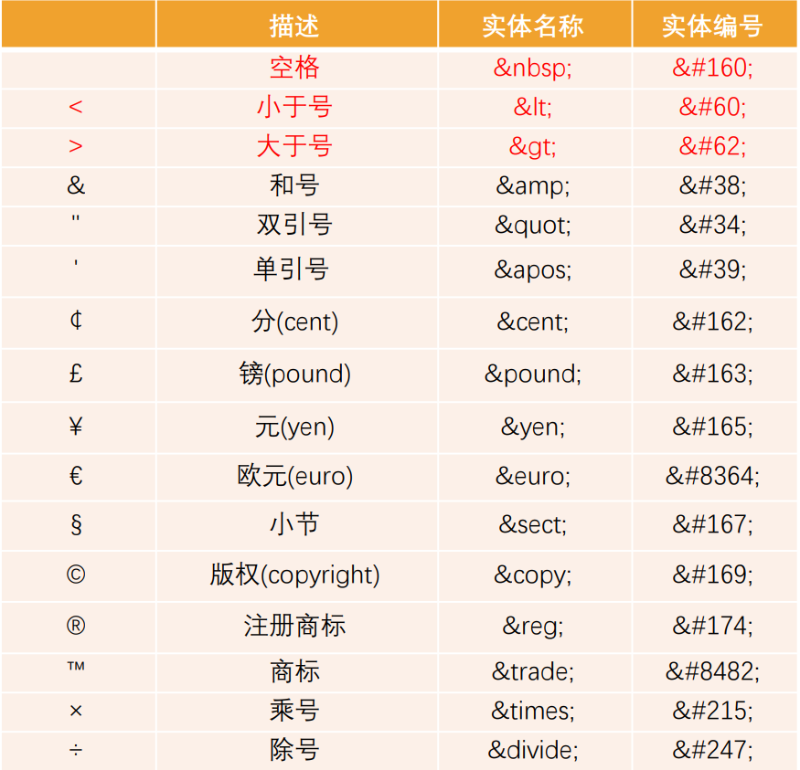
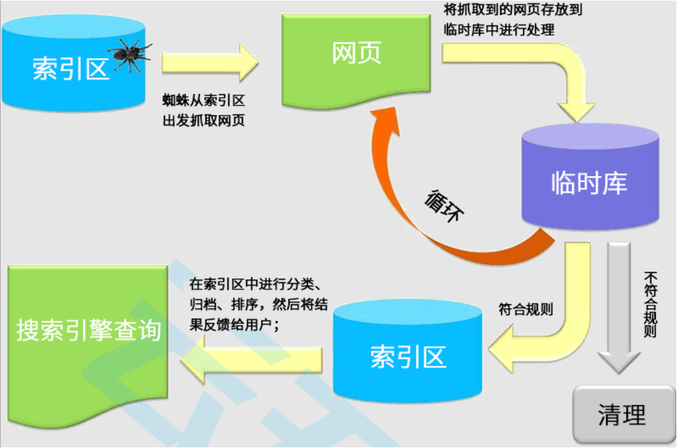
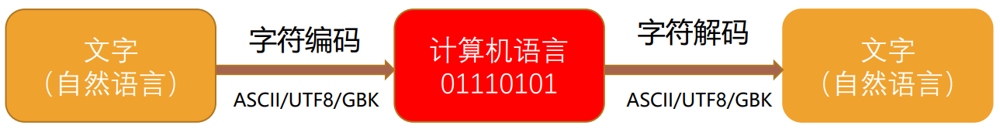

## 字符实体

HTML 实体是一段以连字号（&）开头、以分号（;）结尾的文本（字符串）

常见的字符实体有：



## 认识 URL

URL 代表着是统一资源定位符

通俗点说：URL 无非就是一个给定的独特资源在 Web 上的地址。

- 理论上说，每个有效的 URL 都指向一个唯一的资源；
- 这个资源可以是一个 HTML 页面，一个 CSS 文档，一幅图像，等等；

### URL 的格式

URL 的标准格式如下：

```html
[协议类型]://[服务器地址]:[端口号]/[文件路径][文件名]?[查询]#[片段ID]
```

### 和 URI 的区别

URI = Uniform Resource Identifier 统一资源标志符，用于标识 Web 技术使用的逻辑或物理资源；

URL = Uniform Resource Locator 统一资源定位符，俗称网络地址，相当于网络中的门牌号；

URI 在某一个规则下能把一个资源独一无二的识别出来

- URL 作为一个网络 Web 资源的地址，可以唯一将一个资源识别出来，所以 URL 是一个 URI；
- URL 是 URI 的一个子集；
- URI 并不一定是 URL

## 元素的语义化

元素的语义化：用正确的元素做正确的事情。

理论上来说，所有的 HTML 元素，我们都能实现相同的事情

标签语义化的好处

- 方便代码维护；
- 减少让开发者之间的沟通成本；
- 能让语音合成工具正确识别网页元素的用途，以便作出正确的反应；
- 有利于 SEO；

## 什么是 SEO？

搜索引擎优化（英语：search engine optimization，缩写为 SEO）是通过了解搜索引擎的运作规则来调整网站， 以及提高网站在有关搜索引擎内排名的方式。



## 认识字符编码

计算机是干什么的?

- 计算机一开始发明出来时是用来解决数字计算问题的，后来人们发现，计算机还可以做更多的事，例如文本处理。
- 但计算机其实挺笨的，它只“认识”010110111000…这样由 0 和 1 两个数字组成的二进制数字；
- 这是因为计算机的底层硬件实现就是用电路的开和闭两种状态来表示 0 和 1 两个数字的；
- 因此，计算机只可以直接存储和处理二进制数字。

为了在计算机上也能表示、存储和处理像文字、符号等等之类的字符，就必须将这些字符转换成二进制数字。

当然，肯定不是我们想怎么转换就怎么转换，否则就会造成同一段二进制数字在不同计算机上显示出来的字符不一样的情况， 因此必须得定一个统一的、标准的转换规则


