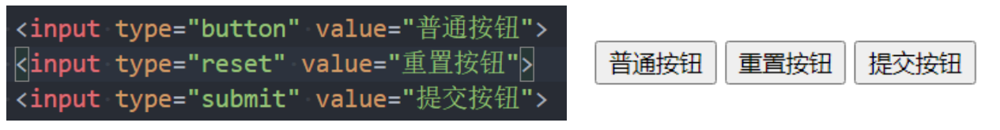
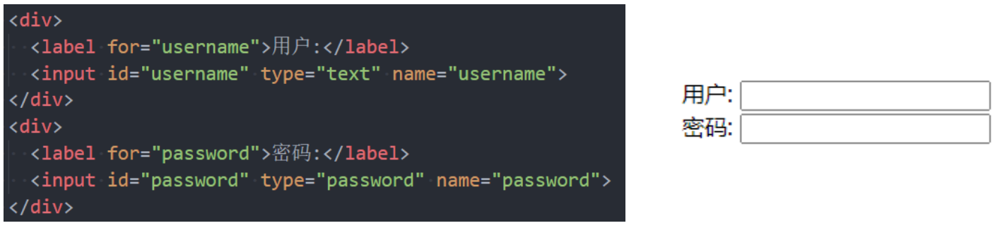
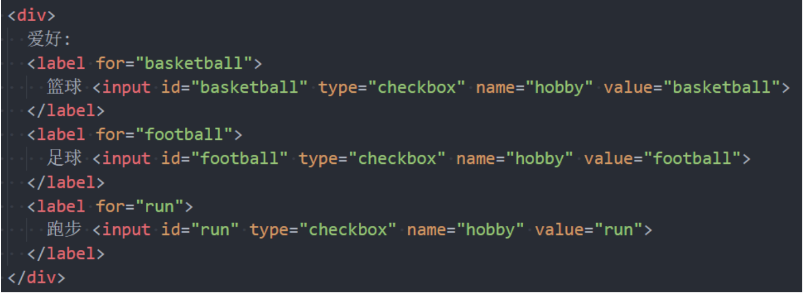

## 列表元素

HTML 提供了 3 组常用的用来展示列表的元素

- 有序列表：ol、li
- 无序列表：ul、li
- 定义列表：dl、dt、dd

## 有序列表 – ol – li

ol（ordered list），有序列表，直接子元素只能是 li

li（list item），列表中的每一项

## 无序列表 – ul - li

ul（unordered list），无序列表，直接子元素只能是 li

li（list item），列表中的每一项

## 定义列表 – dl – dt - dd

dl（definition list）

- 定义列表，直接子元素只能是 dt、dd

dt（definition term）

- term 是项的意思, 列表中每一项的项目名

dd（definition description）

- 列表中每一项的具体描述，是对 dt 的描述、解释、补充
- 一个 dt 后面一般紧跟着 1 个或者多个 dd

```css
<dl>
	<dt>阶段一：</dt>
	<dd>HTML</dd>
	<dd>CSS</dd>
	<dd>JS</dd>
</dl>
```

## 表格常见的元素

table：表格

tr(table row)：表格中的行

td(table data)：行中的单元格

另外表格有很多相关的属性可以设置表格的样式, 但是已经不推荐使用了

## 表格的练习

border-collapse CSS 属性是用来决定表格的边框是分开的还是合并的

table { border-collapse: collapse; }，合并单元格的边框

## 表格的其他元素

thead：表格的表头

tbody：表格的主体

tfoot：表格的页脚

caption：表格的标题

th：表格的表头单元格

```css
<table>
	<caption>表格标题</caption>
	<thead>
		<tr>
			<th>单元格1</th>
			<th>单元格2</th>
		</tr>
	</thead>
	<tbody></tbody>
</table>
```

## 单元格合并

在某些特殊的情况下, 每个单元格占据的大小可能并不是固定的

一个单元格可能会跨多行或者多列来使用;

这个时候我们就要使用单元格合并来完成;

如何使用单元格合并呢?

单元格合并分成两种情况:

跨列合并: 使用 colspan

- 在最左边的单元格写上 colspan 属性, 并且省略掉合并的 td;

跨行合并: 使用 rowspan

- 在最上面的单元格写上 rowspan 属性, 并且省略掉后面 tr 中的 td;

## 常见的表单元素

form：表单, 一般情况下，其他表单相关元素都是它的后代元素

input：单行文本输入框、单选框、复选框、按钮等元素

textarea：多行文本框

select、option：下拉选择框

button：按钮

label：表单元素的标题

## input 元素的使用

表单元素使用最多的是 input 元素

input 元素有如下常见的属性:

- type：input 的类型
  - text：文本输入框（明文输入）
  - password：文本输入框（密文输入）
  - radio：单选框
  - checkbox：复选框
  - button：按钮
  - reset：重置
  - submit：提交表单数据给服务器
  - file：文件上传
- readonly：只读
- disabled：禁用
- checked：默认被选中
  - 只有当 type 为 radio 或 checkbox 时可用
- autofocus：当页面加载时，自动聚焦
- name：名字
  - 在提交数据给服务器时，可用于区分数据类型
- value：取值

type 类型的其他取值和 input 的其他属性, 查看文档:

https://developer.mozilla.org/zhCN/docs/Web/HTML/Element/Input

## 布尔属性（boolean attributes）

常见的布尔属性有 disabled、checked、readonly、multiple、autofocus、selected

布尔属性可以没有属性值，写上属性名就代表使用这个属性

如果要给布尔属性设值，值就是属性名本身

```css
<input type="text" disabled autofocus readonly>
<!--等价于-->
<input type="text" disabled="disabled" autofocus="autofocus" readonly="readonly" />
```

## 表单按钮

表单可以实现按钮效果:

- 普通按钮（type=button）：使用 value 属性设置按钮文字
- 重置按钮（type=reset）：重置它所属 form 的所有表单元素（包括 input、textarea、select）
- 提交按钮（type=submit）：提交它所属 form 的表单数据给服务器（包括 input、textarea、select）



我们也可以通过按钮来实现:


## input 和 label 的关系

label 元素一般跟 input 配合使用，用来表示 input 的标题

labe 可以跟某个 input 绑定，点击 label 就可以激活对应的 input 变成选中



## radio 的使用

我们可以将 type 类型设置为 radio 变成单选框:

name 值相同的 radio 才具备单选功能


## checkbox 的使用

我们可以将 type 类型设置为 checkbox 变成多选框:

属于同一种类型的 checkbox，name 值要保持一致



## textarea 的使用

textarea 的常用属性:

- cols：列数

- rows：行数

```html
<textarea name="textarea" rows="10" cols="50">Write something here</textarea>
```

缩放的 CSS 设置：

- 禁止缩放：resize: none;
- 水平缩放：resize: horizontal;
- 垂直缩放：resize: vertical;
- 水平垂直缩放：resize: both;

```css
textarea {
  resize: none;
}
```

## select 和 option 的使用

option 是 select 的子元素，一个 option 代表一个选项

select 常用属性

- multiple：可以多选
- size：显示多少项

option 常用属性

- selected：默认被选中

## form 常见的属性

form 通常作为表单元素的父元素:

- form 可以将整个表单作为一个整体来进行操作;
- 比如对整个表单进行重置;
- 比如对整个表单的数据进行提交;

form 常见的属性如下:

- action：用于提交表单数据的请求 URL
- method：请求方法（get 和 post），默认是 get
- target：在什么地方打开 URL（参考 a 元素的 target）

```html
<form action="" method="get" class="form-example">
  <div class="form-example">
    <label for="name">Enter your name: </label>
    <input type="text" name="name" id="name" required />
  </div>
  <div class="form-example">
    <label for="email">Enter your email: </label>
    <input type="email" name="email" id="email" required />
  </div>
  <div class="form-example">
    <input type="submit" value="Subscribe!" />
  </div>
</form>
```
