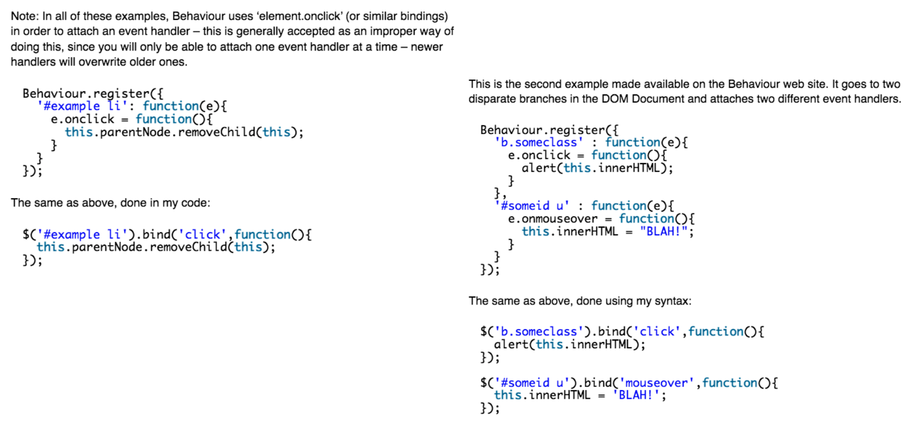
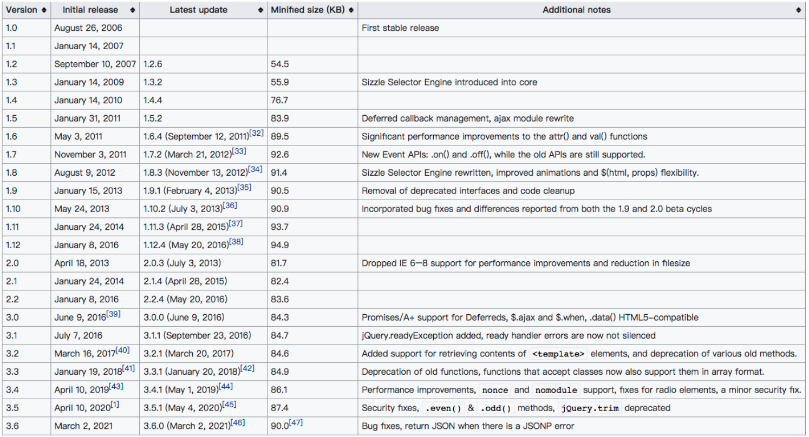
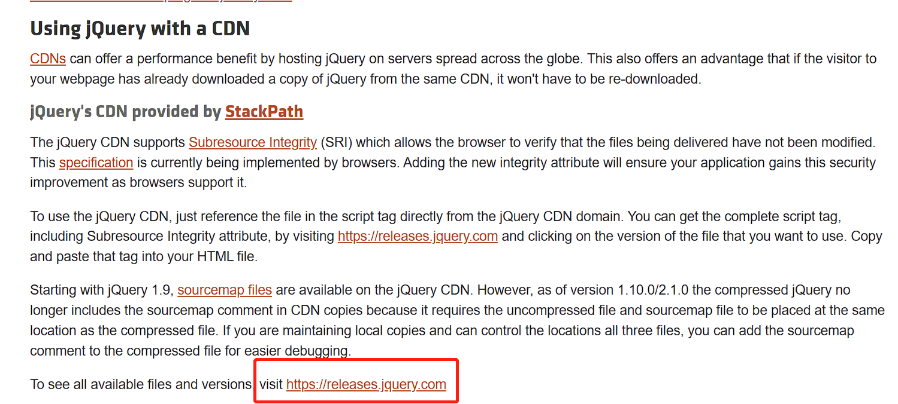
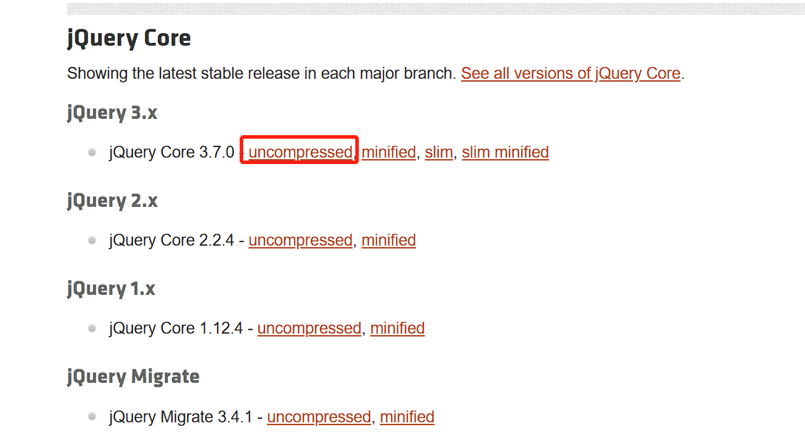
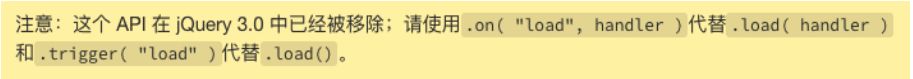
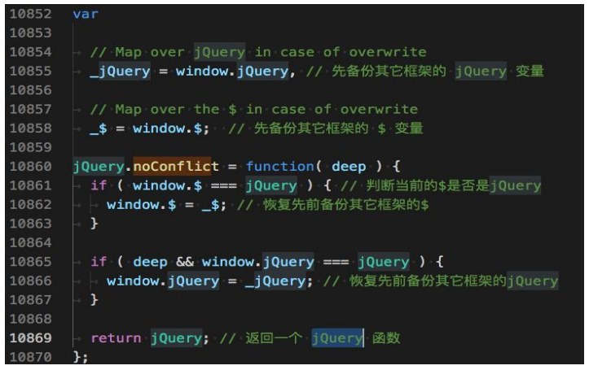
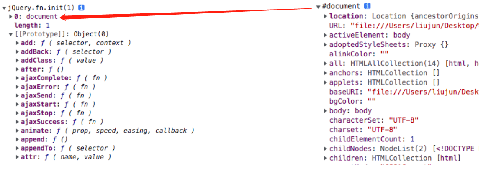
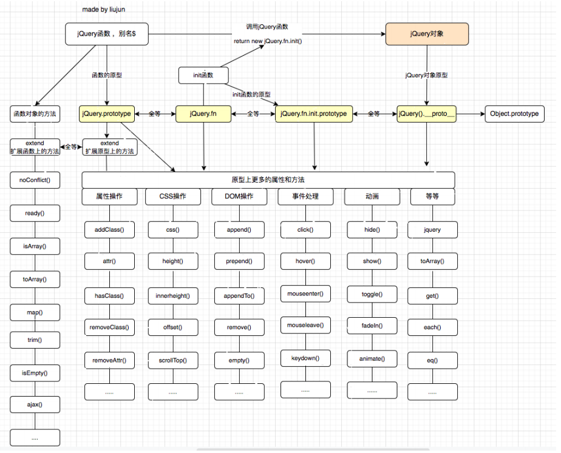

## **认识 jQuery**

**jQuery 读音为：/dʒeɪkwɪəri/ （ 简称：jQ），是一个快速、小型且功能丰富的 JavaScript 库，官网对 jQuery 的描述：**

使 HTML 文档遍历、操作、事件处理、动画和 Ajax 之类的事情变得更加简单。

具有易于使用的 API，可在多种浏览器中使用。

jQuery 结合多功能性和可扩展性，改变了数百万人编写 JavaScript 的方式。

**jQuery 官网：https://jquery.com/**

## **库(library)和框架(framework)的概念**

**随着 JavaScript 的普及，以及越来越多人使用 JavaScript 来构建网站和应用程序**

JavaScript 社区认识到代码中存在非常多相同的逻辑是可复用的。

因此社区就开始对这些相同的逻辑的代码封装到一个 JavaScript 文件中。

这个封装好的 JavaScript 文件就可称为 JavaScript 库或 JavaScript 框架。

**库(library)**

JavaScript 库是一个预先编写好并实现了一些特定功能的代码片段的集合。

一个库中会包含许多的函数、变量等，可根据需求引入到项目中使用。

一些常见的库有 jQuery、Day.js、Lodash 和 React 等

**框架（framework）**

JavaScript 框架是一个完整的工具集，可帮助塑造和组织您的网站或应用程序。

提供一个结构来构建整个应用程序，开发人员可以在结构的规则内更安全、更高效地工作。

一些更常见的框架有：Bootstrap、Angular、Vue、Next.js 等。

## **jQuery 优点与缺点**

**jQuery 的优点**

易于学习：相对于其它的前端框架，jQuery 更易于学习，它支持 JavaScript 的编码风格。

少写多做（Write less, do more）

- jQuery 提供了丰富的功能(DOM 操作、过滤器、事件、动画、Ajax 等)。
- 可以编写更少可读的代码来提高开发人员的工作效率。

优秀的 API 文档：jQuery 提供了优秀的在线 API 文档。

跨浏览器支持：提供出色的跨浏览器支持 (IE9+)，无需编写额外代码。

**jQuery 的缺点：**

jQuery 代码库一直在增长（自 jQuery 1.5 起超过 200KB）

不支持组件化开发

jQuery 更适合 DOM 操作，当涉及到开发复杂的项目时，jQuery 能力有限。

## **jQuery 起源和历史**

**早在 2005 年 8 月 22 日，**John Resig 首次提出支持 CSS 选择器的 JavaScript 库，其语法比现有库（例如：Behaviour ）更简洁。

**在 2006 年之前，John Resig（一名从事自己项目的 Web 开发人员）对编写跨浏览器的 JavaScript 感到非常繁琐。**

2006 年 1 月 16 日，John Resig 在 BarCamp 的演讲中介绍了他的新库( jQuery )。

最后，我宣布了今晚发布的第二个新版本:jQuery: New Wave Javascript。简而言之，

这段代码彻底改变了 Javascript 与 HTML 交互的方式——它确实是一组令人惊叹的代码，

我已经投入了大量的时间和精力来实现它。我现在正在为网站编写文档，应该会在接下来的几天内准备好。

之后 John Resig 又花了 8 个月的时间完善 jQuery 库，直到 2006-8-26 才发布了 1.0 版本。

原本打算使用 JSelect（JavaScript Selectors）命名该库，但域名都已被占用。

## **Behaviour vs** **Selectors in JavaScript**



## **jQuery 历史版本**



## **为什么学习 jQuery**

jQuery 是一个非常受欢迎的 JavaScript 库，被全球约 7000 万个网站使用。它优秀的设计和架构思想非常值得我们去学习。

jQuery 的座右铭是“Write less , do more”，它易于学习， 非常适合 JavaScript 开发人员学习的第一个库。

前端 JavaScript 库非常多，学习 jQuery 有利于我们学习和理解其它的 JavaScript 库（例如：Day.js、Lodash.js 等）

许多大型科技公司，虽然他们现在不会直接使用 jQuery 来做项目，但在项目中仍然会借鉴很多 jQuery 设计思想。

因此，了解 jQuery 依然是一个好主意。

## **jQuery 的安装**

**jQuery 本质是一个 JavaScript 库。**

该库包含了：DOM 操作、选择器、事件处理、动画和 Ajax 等核心功能。

现在我们可以简单的理解它就是一个 JavaScript 文件。

执行该文件中会给 window 对象添加一个 jQuery 函数（例如：window.jQuery）。

接着我们就可以调用 jQuery 函数，或者使用该函数上的类方法。

下面我们来看看 jQuery 安装方式有哪些？

方式一：在页面中，直接通过 CDN 的方式引入。

方式二：下载 jQuery 的源文件，并在页面中手动引入。

方式三：使用 npm 包管理工具安装到项目中（npm 在 Node 基础阶段会讲解）

## **认识 CDN**

**什么是 CDN 呢？CDN 称之为内容分发网络（Content Delivery Network 或 Content Distribution Network，缩写：CDN）**

CDN 它是一组分布在不同地理位置的服务器相互连接形成的网络系统。

通过这个网络系统，将 Web 内容存放在距离用户最近的服务器。

可以更快、更可靠地将 Web 内容(文件、图片、音乐、视频等)发送给用户。

CDN 不但可以提高资源的访问速度，还可以分担源站的压力。

**更简单的理解 CDN：**

CDN 会将资源缓存到遍布全球的网站，用户请求获取资源时；

可就近获取 CDN 上缓存的资源，提高资源访问速度，同时分担源站压力。

**常用的 CDN 服务可以大致分为两种：**

自己购买的 CDN 服务：需要购买开通 CDN 服务（会分配一个域名）。

目前阿里、腾讯、亚马逊、Google 等都可以购买 CDN 服务。

开源的 CDN 服务

国际上使用比较多的是 unpkg、JSDelivr、cdnjs、BootCDN 等。

## **方式一：CDN**

**jQuery 使用 CDN 方式引入**

```javascript
<script src="https://code.jquery.com/jquery-3.6.0.js"></script>
```

这个地址在哪里找呢？





**下面实现一个 Hello jQuery 的案例：**

```html
<!DOCTYPE html>
<html lang="en">
  <head>
    <meta charset="UTF-8" />
    <meta http-equiv="X-UA-Compatible" content="IE=edge" />
    <meta name="viewport" content="width=device-width, initial-scale=1.0" />
    <title>Document</title>
  </head>
  <body>
    <!-- 
    integrity: 防止资源被篡改,如果浏览器发现资源被篡改 就不会加载该资源
    crossorigin: 加载不同源的资源时,浏览器是否需要携带用户凭证信息( cookie, ssl 证书 等 )
      anonymous: 不需要携带用户凭证信息
      user-credentail: 需要携带用户凭证信息
   -->
    <!-- <script src="https://code.jquery.com/jquery-3.6.0.js" integrity="sha256-H+K7U5CnXl1h5ywQfKtSj8PCmoN9aaq30gDh27Xc0jk=" crossorigin="anonymous"></script> -->

    <!-- 
    1.使用CDN的方式引入
    执行下面的js文件
      1.window.jQuery 函数 -> 工厂函数
      2.window.$ 函数
   -->
    <script src="https://code.jquery.com/jquery-3.6.0.js"></script>
    <script>
      // console.log("%O", jQuery)
      // console.log($ === jQuery)

      // 需求:在页面上显示 Hello World
      // document.querySelector('body').textContent = 'Hello World'

      // var $body = jQuery('body')
      // $body.text('hello jQuery')

      $("body").text("hello jQuery");
    </script>
  </body>
</html>
```

## **方式二：下载源码引入**

**下载 jQuery 的源码**

**官网下载：https://jquery.com/download/**

**CDN 连接地址下载： https://releases.jquery.com/jquery/**

**GitHub 仓库中下载：https://github.com/jquery/jquery**

**下面使用源码的方式引入 jQuery：**

```html
<!DOCTYPE html>
<html lang="en">
  <head>
    <meta charset="UTF-8" />
    <meta http-equiv="X-UA-Compatible" content="IE=edge" />
    <meta name="viewport" content="width=device-width, initial-scale=1.0" />
    <title>Document</title>
  </head>
  <body>
    <script src="../libs/jquery-3.6.0.js"></script>

    <script>
      $("body").text("hello jquery"); // textContent
    </script>
  </body>
</html>
```

## **方式三：npm 安装（了解）**

**使用 npm 安装 jquery 到项目中（npm 在 Node 基础阶段会讲解）**

## **jQuery 初体验-计数器案例**

使用原生实现

```html
<!DOCTYPE html>
<html lang="en">
  <head>
    <meta charset="UTF-8" />
    <meta http-equiv="X-UA-Compatible" content="IE=edge" />
    <meta name="viewport" content="width=device-width, initial-scale=1.0" />
    <title>Document</title>
  </head>
  <body>
    <button class="sub">-</button>
    <span class="counter">0</span>
    <button class="add">+</button>

    <script>
      var subEl = document.querySelector(".sub");
      var spanEl = document.querySelector(".counter");
      var addEl = document.querySelector(".add");
      var counter = 0;
      subEl.addEventListener("click", function () {
        spanEl.innerText = --counter;
      });
      addEl.addEventListener("click", function () {
        spanEl.innerText = ++counter;
      });
    </script>
  </body>
</html>
```

使用 jQuery 实现

```html
<!DOCTYPE html>
<html lang="en">
  <head>
    <meta charset="UTF-8" />
    <meta http-equiv="X-UA-Compatible" content="IE=edge" />
    <meta name="viewport" content="width=device-width, initial-scale=1.0" />
    <title>Document</title>
  </head>
  <body>
    <button class="sub">-</button>
    <span class="counter">0</span>
    <button class="add">+</button>

    <script src="../libs/jquery-3.6.0.js"></script>
    <script>
      var $sub = jQuery(".sub");
      var $span = jQuery(".counter");
      var $add = jQuery(".add");
      var counter = 0;
      $sub.on("click", function () {
        $span.text(--counter);
      });
      $add.on("click", function () {
        $span.text(++counter);
      });
    </script>
  </body>
</html>
```

原生实现计数器存在的问题，假如我们把 DOM 元素放在 script 标签后面，代码就会报错，因为代码是从上往下执行的，此时 DOM 还没有解析，那么我们就需要等文档完全解析完成

```html
<!DOCTYPE html>
<html lang="en">
  <head>
    <meta charset="UTF-8" />
    <meta http-equiv="X-UA-Compatible" content="IE=edge" />
    <meta name="viewport" content="width=device-width, initial-scale=1.0" />
    <title>Document</title>
  </head>
  <body>
    <script>
      // 1.监听文档完全解析完成
      document.addEventListener("DOMContentLoaded", function () {
        var subEl = document.querySelector(".sub");
        var spanEl = document.querySelector(".counter");
        var addEl = document.querySelector(".add");
        var counter = 0;
        subEl.addEventListener("click", function () {
          spanEl.innerText = --counter;
        });
        addEl.addEventListener("click", function () {
          spanEl.innerText = ++counter;
        });
      });
    </script>

    <button class="sub">-</button>
    <span class="counter">0</span>
    <button class="add">+</button>
  </body>
</html>
```

## **jQuery 监听文档加载**

**jQuery 监听 document 的 DOMContentLoaded 事件的四种方案**

- **$( document ).ready( handler ) ：** deprecated
- **$( "document" ).ready( handler ) ：** deprecated
- **$().ready( handler ) ：**deprecated
- **$( handler ) ：推荐用这种写法，其它可以使用但是不推荐**

```html
<!DOCTYPE html>
<html lang="en">
  <head>
    <meta charset="UTF-8" />
    <meta http-equiv="X-UA-Compatible" content="IE=edge" />
    <meta name="viewport" content="width=device-width, initial-scale=1.0" />
    <title>Document</title>
  </head>
  <body>
    <script src="../libs/jquery-3.6.0.js"></script>
    <script>
      //  var $doc =  $(document)
      //  // 方式 1:监听文档完全解析完成
      //  $doc.ready(function() {
      //   console.log('doc ready')
      //  })

      // 方式 2:监听文档完全解析完成
      // jQuery('document').ready(function(){
      //   console.log('doc ready')
      // })

      // 方式 3:监听文档完全解析完成
      // $().ready(function(){
      //   console.log('doc ready')
      // })

      // 方式 4:监听文档完全解析完成
      $(function () {
        console.log("doc ready");
      });
    </script>
  </body>
</html>
```

我们用 jQuery 对上面的计数器进行一下优化

```html
<!DOCTYPE html>
<html lang="en">
  <head>
    <meta charset="UTF-8" />
    <meta http-equiv="X-UA-Compatible" content="IE=edge" />
    <meta name="viewport" content="width=device-width, initial-scale=1.0" />
    <title>Document</title>
  </head>
  <body>
    <script src="../libs/jquery-3.6.0.js"></script>
    <script>
      // 监听文档完全解析完成
      jQuery(function () {
        var $sub = jQuery(".sub");
        var $span = jQuery(".counter");
        var $add = jQuery(".add");

        var counter = 0;
        $sub.on("click", function () {
          $span.text(--counter);
        });
        $add.on("click", function () {
          $span.text(++counter);
        });
      });
    </script>

    <button class="sub">-</button>
    <span class="counter">0</span>
    <button class="add">+</button>
  </body>
</html>
```

**监听 window 的 load 事件，即网页所有资源（外部连接，图片等）加载完**

.load( handler ) ： This API has been removed in jQuery 3.0

$(window).on('load', handler) : 推荐写法



```html
<!DOCTYPE html>
<html lang="en">
  <head>
    <meta charset="UTF-8" />
    <meta http-equiv="X-UA-Compatible" content="IE=edge" />
    <meta name="viewport" content="width=device-width, initial-scale=1.0" />
    <title>Document</title>
  </head>
  <body>
    

    <script src="../libs/jquery-3.6.0.js"></script>
    <script>
      // $(window).load(function() {} ) // 3.0 remove

      // 1.监听整个HTML页面加载完成( 外部链接 和 图片资源.. )
      $(window).on("load", function () {
        console.log("图片加载完成");
      });
    </script>
  </body>
</html>
```

## **jQuery 与其它库的变量名冲突**

**和 jQuery 库一样，许多 JavaScript 库也会使用 $ 作为函数名或变量名。**

在 jQuery 中，$ 是 jQuery 的别名。

如果我们在使用 jQuery 库之前，其它库已经使用了 $ 函数或者变量，这时就会出现冲突的情况。

这时我们可以通过调用 jQuery 中的 noConflict 函数来解决冲突问题。

jQuery 在初始化前会先备份一下全局其它库的 jQuery 和$变量，调用noConflict函数只是恢复之前备份的jQuery和$变量。



自己封装的工具定义了一个变量$，和jQuery的$冲突，只要执行 jQuery.noConflict()，就能使用自己封装的$

```html
<!DOCTYPE html>
<html lang="en">
  <head>
    <meta charset="UTF-8" />
    <meta http-equiv="X-UA-Compatible" content="IE=edge" />
    <meta name="viewport" content="width=device-width, initial-scale=1.0" />
    <title>Document</title>
  </head>
  <body>
    <!-- 
    给window 添加了 $ 变量
    window.$ = '我是hy-utils'
   -->
    <script src="./utils/hy-utils.js"></script>

    <!-- 
    给window 添加了 $ 变量
    window.$ = func 函数
    var _$ =
    var _jQuery =
   -->
    <script src="../libs/jquery-3.6.0.js"></script>
    <script>
      // console.log('%O', $)  // func 还是  '我是hy-utils'

      // 1.解决变量的冲突
      jQuery.noConflict(); // window.$ =  _$
      console.log($); // 我是hy-utils
    </script>
  </body>
</html>
```

/utils/hy-utils.js

```javascript
var $ = "我是hy-utils";
```

自己封装的工具定义了一个变量 jQuery，和 jQuery 的 jQuery 冲突，只要执行 jQuery.noConflict(true)，就能使用自己封装的 jQuery 变量

```html
<!DOCTYPE html>
<html lang="en">
  <head>
    <meta charset="UTF-8" />
    <meta http-equiv="X-UA-Compatible" content="IE=edge" />
    <meta name="viewport" content="width=device-width, initial-scale=1.0" />
    <title>Document</title>
  </head>
  <body>
    <!-- 
    给window 添加了 $ 变量
    window.$ = '我是hy-utils'
    window.jQuery = '我是hy-utils jQuery'
   -->
    <script src="./utils/hy-utils.js"></script>

    <!-- 
    给window 添加了 $ 变量
     var _$ = window.$
    var _jQuery = window.jQuery

    window.$ = func 函数
    window.jQuery = func 函数

   -->
    <script src="../libs/jquery-3.6.0.js"></script>
    <script>
      // console.log('%O', $)  // func 还是  '我是hy-utils'

      // 1.解决变量的冲突
      var newjQuery = jQuery.noConflict(true); // window.$ =  _$ ;  window.jQuery =  _jQuery
      console.log($); // 我是hy-utils
      console.log(jQuery); // 我是hy-utils

      console.log(newjQuery);
    </script>
  </body>
</html>
```

/utils/hy-utils.js

```javascript
var jQuery = "我是hy-utils jQuery";
```

如果想要使用 jQuery，怎么办呢？用一个变量接收

```javascript
var newjQuery = jQuery.noConflict(true);

console.log(newjQuery);
```

## **认识 jQuery 函数**

**jQuery 是一个工厂函数( 别名$ )，调用该函数，会根据传入参数类型来返回匹配到元素的集合，一般把该集合称为 jQuery 对象。**

如果传入假值：返回一个空的集合。

如果传入选择器：返回在在 document 中所匹配到元素的集合。

如果传入元素：返回包含该元素的集合。

如果传入 HTML 字符串，返回包含新创建元素的集合。

如果传入回调函数：返回的是包含 document 元素集合, 并且当文档加载完成会回调该函数。

因为函数也是对象，所以该函数还包含了很多已封装好的方法。如：jQuery.noConflict、jQuery.ready 等

jQuery 函数的参数：

jQuery( selector [, context ] ) ：selector 是字符串选择器；context 是匹配元素时的上下文，默认值为 document

- jQuery( selector [, context ] )
- jQuery( element )
- jQuery( elementArray )
- jQuery()

jQuery( html [, ownerDocument ] )

- jQuery( html [, ownerDocument ] )
- jQuery( html )

jQuery( callback )

```html
<!DOCTYPE html>
<html lang="en">
  <head>
    <meta charset="UTF-8" />
    <meta http-equiv="X-UA-Compatible" content="IE=edge" />
    <meta name="viewport" content="width=device-width, initial-scale=1.0" />
    <title>Document</title>
  </head>
  <body>
    <ul>
      <li class="li-1">li-1</li>
      <li class="li-2">li-2</li>
      <li class="li-3">li-3</li>
      <li class="li-4">li-4</li>
      <li class="li-5">li-5</li>
    </ul>
    <script src="../libs/jquery-3.6.0.js"></script>
    <script>
      // 1.假值： ''  false  null undefined NAN....
      // console.log( jQuery('') )

      // 2.字符串（选择器）
      // console.log( jQuery('ul li') )

      // 3.字符串（ html string）
      // console.log( jQuery('<div>') ) // 创建了一个div元素
      // document.createElement('div')

      // var $els = jQuery(`
      //   <div>我是div</div><p>我是一个p</p>
      // `)
      // $els.appendTo('body')
      // console.log($els)

      // 4.元素类型
      // var bodyEl = document.querySelector('body')
      // console.log(jQuery(bodyEl))

      // 5.监听文档的解析完成
      // var $doc =jQuery(function() {

      // })
      // console.log(jQuery($doc))
    </script>
  </body>
</html>
```

## **认识 jQuery 对象**

**jQuery 对象是一个包含所匹配到元素的集合，该集合是类数组(array-like)对象。**

jQuery 对象是通过调用 jQuery 函数来创建的。

jQuery 对象中会包含 N（>=0）个匹配到的元素。

jQuery 对象原型中包含了很多已封装好的方法。例如：DOM 操作、事件处理、动画等方法。

下面我们通过调用 jQuery 函数来新建一个 jQuery 对象，例如：

- $() 新建一个空的 jQuery 对象
- $(document) 新建一个包含 document 元素的 jQuery 对象
- $('选择器') 新建一个包含所选中 DOM 元素的 jQuery 对象

```html
<!DOCTYPE html>
<html lang="en">
  <head>
    <meta charset="UTF-8" />
    <meta http-equiv="X-UA-Compatible" content="IE=edge" />
    <meta name="viewport" content="width=device-width, initial-scale=1.0" />
    <title>Document</title>
  </head>
  <body>
    <ul>
      <li class="li-1">li-1</li>
      <li class="li-2">li-2</li>
      <li class="li-3">li-3</li>
      <li class="li-4">li-4</li>
      <li class="li-5">li-5</li>
    </ul>

    <div>
      <ul>
        <li class="div-li"></li>
      </ul>
    </div>

    <script src="../libs/jquery-3.6.0.js"></script>
    <script>
      // 1.创建一个空的jQuery对象
      // console.log(jQuery())

      // 2.创建一个匹配到document元素的集合 -> jQuery对象
      // console.log(jQuery(document))

      // 3.创建匹配到多个li元素的集合 -> jQuery对象
      // 第二个参数表示上下文，默认是document，表示从document里面查找ul li
      // document.querySelector('div')表示从div里面查找ul li
      // console.log(jQuery('ul li'))
      // console.log(jQuery('ul li', document.querySelector('div')))
    </script>
  </body>
</html>
```

## **jQuery 对象 与 DOM Element 的区别**

**jQuery 对象与 DOM Element 的区别**

获取的方式不同

- DOM Element 是通过原生方式获取，例如：document.querySelector()
- jQuery 对象是通过调用 jQuery 函数获取，例如：jQuery(' ')

jQuery 对象是一个类数组对象，该对象中会包含所选中的 DOM Element 的集合。

jQuery 对象的原型上扩展非常多实用的方法，DOM Element 则是 W3C 规范中定义的属性和方法。



```html
<!DOCTYPE html>
<html lang="en">
  <head>
    <meta charset="UTF-8" />
    <meta http-equiv="X-UA-Compatible" content="IE=edge" />
    <meta name="viewport" content="width=device-width, initial-scale=1.0" />
    <title>Document</title>
  </head>
  <body>
    <script src="../libs/jquery-3.6.0.js"></script>
    <script>
      // 1.获取jQuery对象
      // console.log(jQuery('body'))

      // 2.获取DOM Element对象
      console.log("%O", document.querySelector("body"));
    </script>
  </body>
</html>
```

## **jQuery 对象 与 DOM Element 的转换**

**jQuery 对象转成 DOM Element**

.get(index)： 获取 jQuery 对象中某个索引中的 DOM 元素。

- index 一个从零开始的整数，指示要检索的元素。
- 如果 index 超出范围（小于负数元素或等于或大于元素数），则返回 undefined。

.get() : 没有参数，将返回 jQuery 对象中所有 DOM 元素的数组。

**DOM Element 转成 jQuery 对象**

调用 jQuery 函数或者$函数

例如：$(元素)

```html
<!DOCTYPE html>
<html lang="en">
  <head>
    <meta charset="UTF-8" />
    <meta http-equiv="X-UA-Compatible" content="IE=edge" />
    <meta name="viewport" content="width=device-width, initial-scale=1.0" />
    <title>Document</title>
  </head>
  <body>
    <ul>
      <li class="li-1">li-1</li>
      <li class="li-2">li-2</li>
      <li class="li-3">li-3</li>
      <li class="li-4">li-4</li>
      <li class="li-5">li-5</li>
    </ul>

    <script src="../libs/jquery-3.6.0.js"></script>
    <script>
      // 1.jQuery对象 转成 DOM Element
      var $ul = jQuery("ul");
      // console.log($ul)
      // 方式一
      // var ulEl = $ul[0]  // 将jQuery对象转成DOM Element
      // console.log('%O', ulEl)
      // 方式二
      // console.log($ul.get()) // 获取到匹配元素集合中所有的元素 [ul]
      // console.log($ul.get(0)) // 获取到匹配元素集合中某一个元素 ul

      // 2.DOM Element 转成  jQuery对象
      // var ulEL = document.querySelector('ul')
      // console.log(ulEL)
      // console.log(jQuery(ulEL)) // 目的：想调用jQuery对象中的方法
    </script>
  </body>
</html>
```

## **jQuery 架构设计图**

**在开始学习 jQuery 语法之前，我们先来了解一下 jQuery 的架构设计图。**

**jQuery 架构设计图如下：**



HyJquery.js

```javascript
// 立即执行函数（避免与全局变量冲突）
(function (global, factory) {
  factory(global);
})(window, function (window) {
  function HYjQuery(selector) {
    return new HYjQuery.fn.init(selector);
  }

  // 原型方法
  HYjQuery.prototype = {
    constructor: HYjQuery,
    extend: function () {},
    text: function () {},
    ready: function () {},
    // 学习这里的的方法
  };
  // 类方法
  HYjQuery.noConflict = function () {};
  HYjQuery.isArray = function () {};
  HYjQuery.map = function () {};
  // 学习这里的类方法

  HYjQuery.fn = HYjQuery.prototype;

  // 构造函数（创建jQuery对象）
  HYjQuery.fn.init = function (selector) {
    // css selector

    if (!selector) {
      return this;
    }
    // 拿到DOM Element源码
    var el = document.querySelector(selector);
    this[0] = el;
    this.length = 1;
    return this;
  };

  HYjQuery.fn.init.prototype = HYjQuery.fn;

  window.HYjQuery = window.$ = HYjQuery;
});
```

```html
<!DOCTYPE html>
<html lang="en">
  <head>
    <meta charset="UTF-8" />
    <meta http-equiv="X-UA-Compatible" content="IE=edge" />
    <meta name="viewport" content="width=device-width, initial-scale=1.0" />
    <title>Document</title>
  </head>
  <body>
    <script src="./HYjQuery.js"></script>
    <script>
      // console.log("%O", HYjQuery)
      console.log("%O", HYjQuery("body"));
      console.log("%O", HYjQuery);
    </script>
  </body>
</html>
```

## **jQuery 的选择器(Selectors)**

**jQuery 函数支持大部分的 CSS 选择器，语法：jQuery（'字符串格式的选择器'）**

- 1.通用选择器（\*）
- **2.基本选择器（id, class, 元素）**
- 3.属性选择器（ [attr] , [atrr=”value ”] ）
- 4.后代选择器（div > span, div span）
- 5.兄弟选择器（div + span , div ~ span）
- 6.交集选择器（div.container）
- **7.伪类选择器（:nth-child()，:nth-of-type()，:not()， 但不支持状态伪类 :hover, :focus...）**
- 8.内容选择器（:empty，:has(selector)）, empty 指选中的元素没有子元素或文本； has 指选中的元素是否存在某个子元素
- 9.可见选择器（:visible, :hidden）
- **10.jQuery 扩展选择器：（:eq(), :odd, :even, :first, :last ）**
- ...

```html
<!DOCTYPE html>
<html lang="en">
  <head>
    <meta charset="UTF-8" />
    <meta http-equiv="X-UA-Compatible" content="IE=edge" />
    <meta name="viewport" content="width=device-width, initial-scale=1.0" />
    <title>Document</title>
    <style>
      /* ul li:nth-child(2){

    } */
    </style>
  </head>
  <body>
    <ul id="list">
      <li class="li-1">li-1</li>
      <li class="li-2">li-2</li>
      <li class="li-3">li-3</li>
      <li class="li-4">li-4</li>
      <li class="li-5">li-5</li>
    </ul>

    <script src="../libs/jquery-3.6.0.js"></script>
    <script>
      // 1.基本的选择器
      // console.log( $('.li-1') )
      // console.log( $('#list') )

      // 2.伪元素选择器
      // console.log($('ul li:nth-child(2)'))

      // 3.jQuery额外扩展的选择器
      // document.querySelector('ul li:eq(1)') // 不会生效
      // console.log($('ul li:eq(1)'))
      // console.log($('ul li:first') )
      // console.log($('ul li:last') )

      // console.log($('ul li:odd') )
      // console.log($('ul li:even') )
    </script>
  </body>
</html>
```

## **VSCode 生成代码片段**

在线生成代码片段地址：https://snippet-generator.app/

文件=>首选项=>配置用户代码片段，选择 html.json 就可以快速配置一个 html 的模板，如果是 js，需要选择 javascript

## **jQuery 过滤器(Filtering) API**

**jQuery 过滤器 API ( 即 jQuery 原型上的方法 )**

1.eq(index): 从匹配元素的集合中，取索引处的元素， eq 全称(equal 等于)，返回 jQuery 对象。

2.first() : 从匹配元素的集合中，取第一个元素，返回 jQuery 对象。

3.last(): 从匹配元素的集合中，取最后一个元素，返回 jQuery 对象。

4.not(selector): 从匹配元素的集合中，删除匹配的元素，返回 jQuery 对象。

5.filter(selector): 从匹配元素的集合中，过滤出匹配的元素，返回 jQuery 对象。

6.find(selector): 从匹配元素集合中，找到匹配的后代元素，返回 jQuery 对象。

7.is(selector|element| . ): 根据选择器、元素等检查当前匹配到元素的集合。集合中至少有一个与给定参数匹配则返回 true。

8.odd() :将匹配到元素的集合减少为集合中的奇数，从零开始编号，返回 jQuery 对象。

9.even()：将匹配到元素的集合减少到集合中的偶数，从零开始编号，返回 jQuery 对象。

10.支持链式调用

...

```html
<!DOCTYPE html>
<html lang="en">
  <head>
    <meta charset="UTF-8" />
    <meta http-equiv="X-UA-Compatible" content="IE=edge" />
    <meta name="viewport" content="width=device-width, initial-scale=1.0" />
    <title>Document</title>
  </head>
  <body>
    <ul id="list" class="panel">
      <li class="li-1">li-1</li>
      <li class="li-2">li-2</li>
      <li class="li-3">li-3</li>
      <li class="li-4">li-4</li>
      <li class="li-5">li-5</li>
    </ul>

    <script src="../libs/jquery-3.6.0.js"></script>
    <script>
      // 1.监听文档完全解析完成
      $(function () {
        // 1.eq()
        // console.log($('ul li:eq(2)') ) // selector
        // console.log( $('ul li').eq(2) ) // API -> 原型上的方法

        // 2.first()  last()
        // console.log( $('ul li').first() )
        // console.log( $('ul li').last() )

        // 3.not()
        // console.log($('ul li').not('.li-1') )
        // console.log($('ul li').not('.li-1, .li-2') )

        // 4. odd()  even()
        // console.log($('ul li').odd() )
        // console.log($('ul li').even() )

        // 5.filter()
        // console.log($('ul li').filter('.li-4') )
        // console.log($('ul li').filter('.li-4, .li-3') )

        // 6.jQuery原型上的方法，大部分支持链式调用
        var $el = $("ul li").filter(".li-2, .li-3, .li-4").eq(1);

        console.log($el);

        // new Promise()
        //   .then()
        //   .then()
        //   .then()
      });
    </script>
  </body>
</html>
```

## **jQuery 对文本的操作**

**.text()、.text(text)**

获取匹配到元素集合中每个元素组合的文本内容，包括它们的后代，或设置匹配到元素的文本内容。

相当于原生元素的 textContent 属性。

**.html()、html(htmlString)**

获取匹配到元素集合中第一个元素的 HTML 内容，包括它们的后代，或设置每个匹配元素的 HTML 内容。

相当于原生元素的 innerHTML 属性。

.**val()、.val(value)**

获取匹配到元素集合中第一个元素的当前值 或 设置每个匹配到元素的值。

该.val()方法主要用于获取 input,select 和等表单元素的值。

相当于获取原生元素的 value 属性。

```html
<!DOCTYPE html>
<html lang="en">
  <head>
    <meta charset="UTF-8" />
    <meta http-equiv="X-UA-Compatible" content="IE=edge" />
    <meta name="viewport" content="width=device-width, initial-scale=1.0" />
    <title>Document</title>
  </head>
  <body>
    <ul id="list" class="panel">
      <li class="li-1">li-1</li>
      <li class="li-2">li-2</li>
      <li class="li-3">li-3</li>
      <li class="li-4">li-4</li>
      <li class="li-5">
        li-5
        <span>我是span</span>
      </li>
    </ul>

    <script src="../libs/jquery-3.6.0.js"></script>
    <script>
      // 1.监听文档完全解析完成
      $(function () {
        // 1.拿到 ul 中所有的文本
        // console.log( $('ul').text() )
        console.log($("ul li").text()); //

        // 2.设置 li 中的文本
        $("ul li").text("我是li"); // 会给匹配元素集合中所有的元素添加文本 （ 设置值：一般是给选中所有元素设置）
      });
    </script>
  </body>
</html>
```

```html
<!DOCTYPE html>
<html lang="en">
  <head>
    <meta charset="UTF-8" />
    <meta http-equiv="X-UA-Compatible" content="IE=edge" />
    <meta name="viewport" content="width=device-width, initial-scale=1.0" />
    <title>Document</title>
  </head>
  <body>
    <ul id="list" class="panel">
      <li class="li-1">li-1</li>
      <li class="li-2">li-2</li>
      <li class="li-3">li-3</li>
      <li class="li-4">li-4</li>
      <li class="li-5">li-5</li>
    </ul>

    <script src="../libs/jquery-3.6.0.js"></script>
    <script>
      // 1.监听文档完全解析完成
      $(function () {
        // 1.获取ul元素中的所有 html 内容
        console.log($("ul li").html()); // 拿到匹配元素集合中的第一个元素（获取的时候 一般是拿到匹配元素集合中的第一个元素的数据 ）

        // 2.给设置 li 元素设置 html的内容（ 设置 ）
        $("ul li").html(`
        <p>我是p元素</p>
        <span>我是一个span</span>
      `);
      });
    </script>
  </body>
</html>
```

```html
<!DOCTYPE html>
<html lang="en">
  <head>
    <meta charset="UTF-8" />
    <meta http-equiv="X-UA-Compatible" content="IE=edge" />
    <meta name="viewport" content="width=device-width, initial-scale=1.0" />
    <title>Document</title>
  </head>
  <body>
    <ul id="list" class="panel">
      <li class="li-1">li-1</li>
      <li class="li-2">li-2</li>
      <li class="li-3">li-3</li>
      <li class="li-4">li-4</li>
      <li class="li-5">li-5</li>
    </ul>

    <input class="user" type="text" placeholder="请求输入用户名" />
    <input class="password" type="text" placeholder="请求输入密码" />

    <button class="login">登录</button>
    <button class="setUserPas">设置用户名密码</button>

    <script src="../libs/jquery-3.6.0.js"></script>
    <script>
      // 1.监听文档完全解析完成
      $(function () {
        // 1.获取表单数据
        // $('.login').on('click', function() {})

        // 简写
        $(".login").click(function () {
          console.log($(".user").val());
          console.log($(".password").val());
        });

        // 2.给表单元素设置值
        $(".setUserPas").click(function () {
          $(".user").val("coder");
          $(".password").val("admin");
        });
      });
    </script>
  </body>
</html>
```

## **jQuery 对 CSS 的操作**

**.width()、.width(value)**

获取匹配到元素集合中第一个元素的宽度或设置每个匹配到元素的宽度。

**.height()、height(value)**

获取匹配到元素集合中第一个元素的高度或设置每个匹配到元素的高度。

```html
<!DOCTYPE html>
<html lang="en">
  <head>
    <meta charset="UTF-8" />
    <meta http-equiv="X-UA-Compatible" content="IE=edge" />
    <meta name="viewport" content="width=device-width, initial-scale=1.0" />
    <title>Document</title>
  </head>
  <body>
    <ul id="list" class="panel">
      <li class="li-1">li-1</li>
      <li class="li-2">li-2</li>
      <li class="li-3">li-3</li>
      <li class="li-4">li-4</li>
      <li class="li-5">li-5</li>
    </ul>

    <script src="../libs/jquery-3.6.0.js"></script>
    <script>
      // 1.监听文档完全解析完成
      $(function () {
        // 1.获取到元素的width
        // width: content ;  innerWidth:padding + content; outerWidth: border + padding + content
        console.log($("ul").width()); // 返回的结果是 number

        // 2.设置ul元素的width
        // $('ul').width(300)  // 直接给style设置一个width
        // $('ul').width('500px')  // 直接给style设置一个width

        // 3. width height  innerWidth innerHeight ......
      });
    </script>
  </body>
</html>
```

**.css(propertyName)、.css(propertyNames)**

获取匹配到元素集中第一个元素样式属性的值，底层是调用 getComputedStyle 函数获取。

.css( "width" )和.width()之间的区别:

width()返回一个无单位的像素值（例如，400），而 css()返回一个具有完整单位的值（例如，400px）

.**css(propertyName, value)、.css(properties)**

为每个匹配到元素设置一个 或 多个 CSS 属性**。**

调用 css 方法添加样式会直接把样式添加到元素的 style 属性上。

```html
<!DOCTYPE html>
<html lang="en">
  <head>
    <meta charset="UTF-8" />
    <meta http-equiv="X-UA-Compatible" content="IE=edge" />
    <meta name="viewport" content="width=device-width, initial-scale=1.0" />
    <title>Document</title>
  </head>
  <body>
    <ul id="list" class="panel">
      <li class="li-1">li-1</li>
      <li class="li-2">li-2</li>
      <li class="li-3">li-3</li>
      <li class="li-4">li-4</li>
      <li class="li-5">li-5</li>
    </ul>

    <script src="../libs/jquery-3.6.0.js"></script>
    <script>
      // 1.监听文档完全解析完成
      $(function () {
        // 1.获取ul元素的width
        // console.log( $('ul').css('width') )  // 返回的结果是 string 带单位 px
        // console.log( $('ul').css(['width', 'height']) )  // 返回的结果是 string 带单位 px 。 {width: '223px', height: '105px'}

        // 2.给ul元元素设置width
        // $('ul').css('width', '450px') // 设置的是一个属性

        // $('ul').css({  // 设置的是多个属性
        //   width: 100,
        //   height: 100,
        //   color: 'red'
        // })

        $("ul li").css("color", "green").odd().css({
          color: "red",
        });
      });
    </script>
  </body>
</html>
```

## **Class 属性的操作**

**.addClass(className)、.addClass(classNames)、.addClass(funcntion)**

将指定的类添加到匹配元素集合中的每个元素，每次都是追加 class。

底层调用的是 setAttribute( "class", finalValue )方法添加 class。

**.hasClass(className)**

是否给任意匹配到的元素分配了该类。

底层是通过 getAttribute( "class" ).indexOf()来判断是否存在。

.removeClass()、.removeClass(className)、.removeClass(classNames)、.removeClass(function)

给匹配元素集中的每个元素删除单个类、多个类或所有类。

底层调用的是 setAttribute( "class", finalValue )方法。

.toggleClass()、.toggleClass(className[,state])、.toggleClass(classNames[,state])

根据类的存在或状态参数的值，在匹配到元素的集合中，给每个元素添加或删除一个或多个类。

```html
<!DOCTYPE html>
<html lang="en">
  <head>
    <meta charset="UTF-8" />
    <meta http-equiv="X-UA-Compatible" content="IE=edge" />
    <meta name="viewport" content="width=device-width, initial-scale=1.0" />
    <title>Document</title>
  </head>
  <body>
    <ul class="active list">
      <li class="li-1">li-1</li>
      <li class="li-2">li-2</li>
      <li class="li-3">li-3</li>
      <li class="li-4">li-4</li>
      <li class="li-5">li-5</li>
    </ul>

    <button class="toggle">切换class</button>
    <script src="../libs/jquery-3.6.0.js"></script>
    <script>
      // 1.监听文档完全解析完成
      $(function () {
        // 1.添加class
        // $('ul').addClass('list1 list2')
        // $('ul li').addClass(['list1', 'list2'])

        // 2.判断是否存在某个class
        // console.log($('ul').hasClass('active list') )

        // 3.删除class
        // $('ul').removeClass() // 删除全部
        // $('ul').removeClass('list') // 删除指定的某一个

        // 4.class的切换
        $(".toggle").click(function () {
          // $('ul').toggleClass()
          $("ul").toggleClass("active");
        });
      });
    </script>
  </body>
</html>
```

## **attributes 和 property 属性的操作**

**.attr(attributeName)**

获取匹配元素集和中第一个元素的属性值，底层调用了原生的 getAttribute() API

**.attr(attributeName, value)、.attr(attributes)**

为每个匹配元素设置一个或多个属性，底层调用了原生的 setAttribute() API

**.removeAttr(attributeName)**

在匹配到元素的集中，给每个元素删除一个属性。

底层调用了原生的 removeAttribute() API

```html
<!DOCTYPE html>
<html lang="en">
  <head>
    <meta charset="UTF-8" />
    <meta http-equiv="X-UA-Compatible" content="IE=edge" />
    <meta name="viewport" content="width=device-width, initial-scale=1.0" />
    <title>Document</title>
  </head>
  <body>
    <ul id="list" name="liujun" age="17">
      <li class="li-1">li-1</li>
      <li class="li-2">li-2</li>
      <li class="li-3">li-3</li>
      <li class="li-4">li-4</li>
      <li class="li-5">li-5</li>
    </ul>

    <script src="../libs/jquery-3.6.0.js"></script>
    <script>
      // 1.监听文档完全解析完成
      $(function () {
        // 1.获取attribute属性  ul
        // console.log($('ul').attr('id'))
        // console.log($('ul').attr('name'))
        // 2.设置 attribute属性 ul
        // $('ul').attr('id', 'box')
        // $('ul').attr({   // 设置多个属性
        //   id: 'container',
        //   class: "panel",
        //   name: 'coder'
        // })
        // 3.删除 attribute属性 ul
        // $('ul').removeAttr('id')
        // $('ul').removeAttr('name')
      });
    </script>
  </body>
</html>
```

**.prop(propertyName)**

获取匹配到元素集合中第一个元素的属性值

**.prop(propertyName，value)、.prop(propertys)**

为每个匹配元素设置一个或多个属性。

removeProp(**propertyName**)

删除匹配元素集的属性,( 只能删除用户自定义添加的 prop，不能删除元素本身的属性 )。

```html
<!DOCTYPE html>
<html lang="en">
  <head>
    <meta charset="UTF-8" />
    <meta http-equiv="X-UA-Compatible" content="IE=edge" />
    <meta name="viewport" content="width=device-width, initial-scale=1.0" />
    <title>Document</title>
  </head>
  <body>
    <ul id="list" class="panel" name="liujun">
      <li class="li-1">li-1</li>
      <li class="li-2">li-2</li>
      <li class="li-3">li-3</li>
      <li class="li-4">li-4</li>
      <li class="li-5">li-5</li>
    </ul>

    <input type="text" />

    <script src="../libs/jquery-3.6.0.js"></script>
    <script>
      // 1.监听文档完全解析完成
      $(function () {
        // 1.获取property属性  ul
        console.log("%O", document.querySelector("input"));

        // console.log($('ul').prop('id') )
        // console.log($('ul').prop('name') )

        // console.log($('ul').prop('nodeName') )
        // console.log($('ul').prop('nodeType') )

        // 2.设置property属性  input
        // $('input').prop('disabled', true)

        $("input").prop({
          disabled: true,
          placeholder: "请输入用户名",
          jQuery_liujun_123: "自定义的属性", // 缓存 click  data
        });

        // 3.删除property属性 input
        $("input").removeProp("jQuery_liujun_123"); // 只能删除 自定义的属性
      });
    </script>
  </body>
</html>
```

## **自定义 data-xx 属性的操作**

**.data()、.data(key)**

获取匹配元素集中第一个元素的自定义属性的值

**.data(key, value) 、.data(obj)**

为每个匹配元素设置一个或多个自定义属性

**.removeData([name])**

会删除 data()函数给匹配元素属性添加的数据 和 data()函数绑定的自定义属性。

data 函数添加的属性会被移除，但是如果属性同时在签上定义了就不会被移除。

```html
<!DOCTYPE html>
<html lang="en">
  <head>
    <meta charset="UTF-8" />
    <meta http-equiv="X-UA-Compatible" content="IE=edge" />
    <meta name="viewport" content="width=device-width, initial-scale=1.0" />
    <title>Document</title>
  </head>
  <body>
    <ul id="list" class="panel" data-name="liujun" data-age="17">
      <li class="li-1">li-1</li>
      <li class="li-2">li-2</li>
      <li class="li-3">li-3</li>
      <li class="li-4">li-4</li>
      <li class="li-5">li-5</li>
    </ul>

    <script src="../libs/jquery-3.6.0.js"></script>
    <script>
      // 1.监听文档完全解析完成
      $(function () {
        // 1.获取data属性 ul
        console.log($("ul").data()); //  {age: 17, name: 'liujun'}
        // console.log($('ul').data('age') )

        // 2.设置data属性 ul
        // $('ul').data('name', 'coder')
        $("ul").data({
          // 调用data()函数只能修改 缓存中的数据
          name: "coder",
          age: "18",
          height: "1.66", // 动态添加的data-xx属性
        });

        // 3.删除data属性
        // $('ul').removeData('name')  // 只能删除 缓存中的数据
        $("ul").removeData(["name", "age", "height"]); // 只能删除 缓存中的数据

        console.log($("ul").data("name"));
        console.log("%O", $("ul").get(0));
      });
    </script>
  </body>
</html>
```

## **jQuery 的 DOM 操作-插入内容**

**.append(content [, content] ) 、append( function )**

将参数的内容插入到匹配元素集中每个元素的末尾。

content 的类型: DOM element, text node, array of elements and text nodes, HTML string, or jQuery object

.**prepend(content [, content] ) 、prepend( function )**

将参数的内容插入到匹配元素集中每个元素的开头。

**.after(content [, content] ) 、after( function )**

在匹配元素集中的每个元素之后，插入由参数指定的内容。

**.before(content [, content])、before( function )**

在匹配元素集中的每个元素之前，插入由参数指定的内容。

```html
<!DOCTYPE html>
<html lang="en">
  <head>
    <meta charset="UTF-8" />
    <meta http-equiv="X-UA-Compatible" content="IE=edge" />
    <meta name="viewport" content="width=device-width, initial-scale=1.0" />
    <title>Document</title>
  </head>
  <body>
    <ul id="list" class="panel">
      <li class="li-1">li-1</li>
      <li class="li-2">li-2</li>
      <li class="li-3">li-3</li>
      <li class="li-4">li-4</li>
      <li class="li-5">li-5</li>
    </ul>

    <script src="../libs/jquery-3.6.0.js"></script>
    <script>
      // 1.监听文档完全解析完成
      $(function () {
        // 1.在ul的尾部插入文本
        // $('ul').append('文本')
        // $('ul').prepend('文本')
        // $('ul').before('文本')
        // $('ul').after('文本')
      });
    </script>
  </body>
</html>
```

```html
<!DOCTYPE html>
<html lang="en">
  <head>
    <meta charset="UTF-8" />
    <meta http-equiv="X-UA-Compatible" content="IE=edge" />
    <meta name="viewport" content="width=device-width, initial-scale=1.0" />
    <title>Document</title>
  </head>
  <body>
    <ul id="list" class="panel">
      <li class="li-1">li-1</li>
      <li class="li-2">li-2</li>
      <li class="li-3">li-3</li>
      <li class="li-4">li-4</li>
      <li class="li-5">li-5</li>
    </ul>

    <li class="li-6">我是li-6</li>

    <script src="../libs/jquery-3.6.0.js"></script>
    <script>
      // 1.监听文档完全解析完成
      $(function () {
        // 方式一: 在ul的尾部插入文本
        // $('ul').append('文本')

        // 方式二: 插入html字符串
        // $('ul').append(`
        //   <li class="li-6">我是li-6</li>
        //   <li class="li-7">我是li-7</li>
        // `)

        // 方式三: 插入的是jQuery对象
        // var liEl = document.createElement('li')
        // var $li = $('<li>').addClass('li-6').text('我是li-6')
        // $('ul').append($li)

        // 方式四: 插入的是元素对象
        // var liEl = document.createElement('li')
        // liEl.className = 'li-6'
        // liEl.innerText = '我是li-6'
        // $('ul').append(liEl)

        //  方式五: 选中页面上的元素插入到ul中
        $("ul").append($(".li-6")); // move, 不是clone
      });
    </script>
  </body>
</html>
```

## **jQuery 的 DOM 操作-插入内容**

**.appendTo(target)**

将匹配元素集中的每个元素插入到目标元素的末尾。

target 的类型：A selector, element, HTML string, array of elements, or jQuery object。

.**prependTo(target)**

将匹配元素集中的每个元素插入到目标元素的开头。

**.insertAfter(target)**

在目标元素之后，插入匹配元素集中的每个元素。

.**insertBefore(target)**

在目标元素之前，插入匹配元素集中的每个元素。

```html
<!DOCTYPE html>
<html lang="en">
  <head>
    <meta charset="UTF-8" />
    <meta http-equiv="X-UA-Compatible" content="IE=edge" />
    <meta name="viewport" content="width=device-width, initial-scale=1.0" />
    <title>Document</title>
  </head>
  <body>
    <ul id="list" class="panel">
      <li class="li-1">li-1</li>
      <li class="li-2">li-2</li>
      <li class="li-3">li-3</li>
      <li class="li-4">li-4</li>
      <li class="li-5">li-5</li>
    </ul>

    <script src="../libs/jquery-3.6.0.js"></script>
    <script>
      // 1.监听文档完全解析完成
      $(function () {
        // 1.给ul的尾部插入内容
        $("<li>")
          .addClass("li-6")
          .text("我是li-6") // 创建一个li元素

          // .appendTo( $('ul') )
          // .prependTo( $('ul') )
          // .insertBefore( $('ul') )
          .insertAfter($("ul"));
      });
    </script>
  </body>
</html>
```

```html
<!DOCTYPE html>
<html lang="en">
  <head>
    <meta charset="UTF-8" />
    <meta http-equiv="X-UA-Compatible" content="IE=edge" />
    <meta name="viewport" content="width=device-width, initial-scale=1.0" />
    <title>Document</title>
  </head>
  <body>
    <ul id="list" class="panel">
      <li class="li-1">li-1</li>
      <li class="li-2">li-2</li>
      <li class="li-3">li-3</li>
      <li class="li-4">li-4</li>
      <li class="li-5">li-5</li>
    </ul>

    <li class="li-7">我是li-7</li>

    <script src="../libs/jquery-3.6.0.js"></script>
    <script>
      // 1.监听文档完全解析完成
      $(function () {
        // 1.给ul的尾部插入内容
        $("<li>")
          .addClass("li-6")
          .css("color", "red")
          .text("我是li-6") // 创建一个li元素(必须是一个jQuery对象)

          // 方式一: 支持 jQuery对象
          // .appendTo( $('ul') )

          // 方式二: 支持 字符串类型的选择器
          // .appendTo( 'ul' )

          // 方式三: 支持 元素对象
          .appendTo(document.querySelector("ul"));

        $(".li-7").appendTo("ul"); // append
      });
    </script>
  </body>
</html>
```

## **jQuery 的 DOM 操作-移除/替换/克隆**

**.empty(): 删除匹配元素集的所有子节点，自身不会删除。**

**.remove( ) 、.remove( [selector] )**

删除匹配的元素集，自身也会删除。

selector 参数：字符串类型选择器。筛选匹配元素集的元素来删除

```html
<!DOCTYPE html>
<html lang="en">
  <head>
    <meta charset="UTF-8" />
    <meta http-equiv="X-UA-Compatible" content="IE=edge" />
    <meta name="viewport" content="width=device-width, initial-scale=1.0" />
    <title>Document</title>
  </head>
  <body>
    <ul id="list" class="panel">
      <li class="li-1">li-1</li>
      <li class="li-2">li-2</li>
      <li class="li-3">li-3</li>
      <li class="li-4">li-4</li>
      <li class="li-5">li-5</li>
    </ul>

    <script src="../libs/jquery-3.6.0.js"></script>
    <script>
      // 1.监听文档完全解析完成
      $(function () {
        // 1.删除ul中的后代元素
        // $('ul').empty()
        // 2.删除ul 以及后代元素
        // $('ul').remove()
        // $('ul li').remove('字符串选择器')
        // $('ul li').remove('.li-1, .li-2') // 支持
        // $('ul li').remove(['.li-1', '.li-2'])  // 不支持
      });
    </script>
  </body>
</html>
```

**.replaceAll(target):** 用匹配到的元素集替换每个目标元素。

**.replaceWidth(newContent)、.replaceWidth( function )**

用新内容替换匹配元素集中的每个元素，并返回被移除的元素集。

newConten 参数的类型： HTML string, DOM element, array of DOM elements, or jQuery object

```html
<!DOCTYPE html>
<html lang="en">
  <head>
    <meta charset="UTF-8" />
    <meta http-equiv="X-UA-Compatible" content="IE=edge" />
    <meta name="viewport" content="width=device-width, initial-scale=1.0" />
    <title>Document</title>
  </head>
  <body>
    <ul id="list" class="panel">
      <li class="li-1">li-1</li>
      <li class="li-2">li-2</li>
      <li class="li-3">li-3</li>
      <li class="li-4">li-4</li>
      <li class="li-5">li-5</li>
    </ul>

    <li class="li-6">li-6</li>
    <script src="../libs/jquery-3.6.0.js"></script>
    <script>
      // 1.监听文档完全解析完成
      $(function () {
        // 1.将li替换为 span元素 .replaceAll(target)
        // $('<span>')
        //   .addClass('content')
        //   .text('我是span')
        //   .css('color', 'red') // 创建一个span元素( jQuery对象 )

        //   .replaceAll( 'ul li' ) // 将li元素替换为span
        //   replaceAll参数: 1.字符串类型的选择器  2. $('ul li') jQuery对象  3. 元素对象

        // 2.将li替换为 span元素 .replaceWidh( content )
        var $span = $("<span>").text("我是span");
        // $('ul li').replaceWith( $span )
        $("ul li").replaceWith("<span>我是span</span>");
        //   replaceWith 参数: 1.字符串文本/html字符串  2. $('ul li') jQuery对象  3. 元素对象
      });
    </script>
  </body>
</html>
```

**.clone()、.clone( withDataAndEvents )**

对匹配的元素集执行深度复制，底层是调用了 elem.cloneNode( true )来复制元素。

withDataAndEvents 参数 **:** 布尔值，是否复制该元素的事件处理程序和数据，默认值为 false。

```html
<!DOCTYPE html>
<html lang="en">
  <head>
    <meta charset="UTF-8" />
    <meta http-equiv="X-UA-Compatible" content="IE=edge" />
    <meta name="viewport" content="width=device-width, initial-scale=1.0" />
    <title>Document</title>
  </head>
  <body>
    <ul id="list" class="panel">
      <li class="li-1">li-1</li>
      <li class="li-2">li-2</li>
      <li class="li-3">li-3</li>
      <li class="li-4">li-4</li>
      <li class="li-5">li-5</li>
    </ul>

    <li class="li-6">li-6</li>

    <script src="../libs/jquery-3.6.0.js"></script>
    <script>
      // 1.监听文档完全解析完成
      $(function () {
        // 1.将li-6克隆到ul元素的尾部
        // var $newLi = $('.li-6').clone() // 属于克隆一个li元素
        // $newLi.appendTo('ul')

        // 简写
        // $('.li-6').clone().appendTo('ul')

        // 2.将li-6克隆到 ul元素的尾部( 将li-6的事件处理函数和data自定义属性一起拷贝过去 )
        $(".li-6")
          .data({
            name: "liujun",
            age: "17",
          })
          .click(function () {
            console.log("li-6");
          })
          // 开始克隆
          .clone(true)
          .appendTo("ul");

        console.log("%O", $(".li-6").get(0));
      });
    </script>
  </body>
</html>
```
