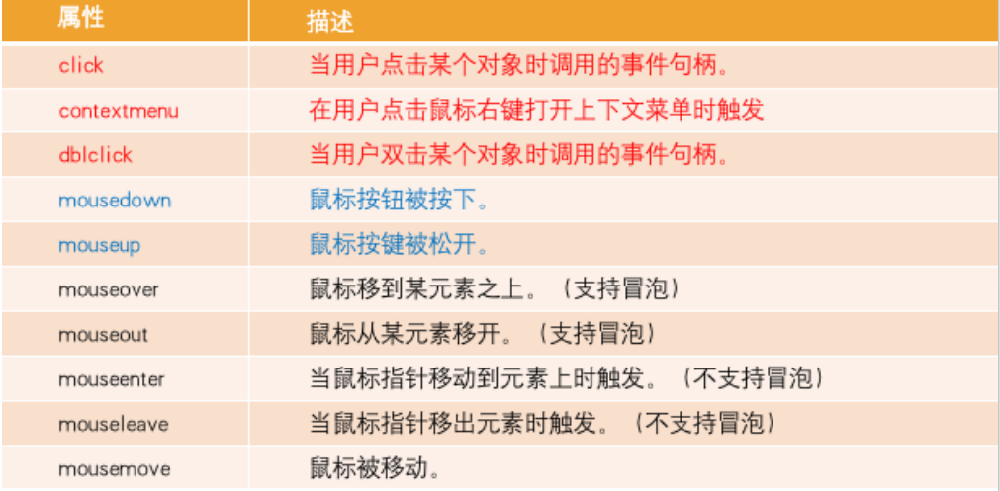
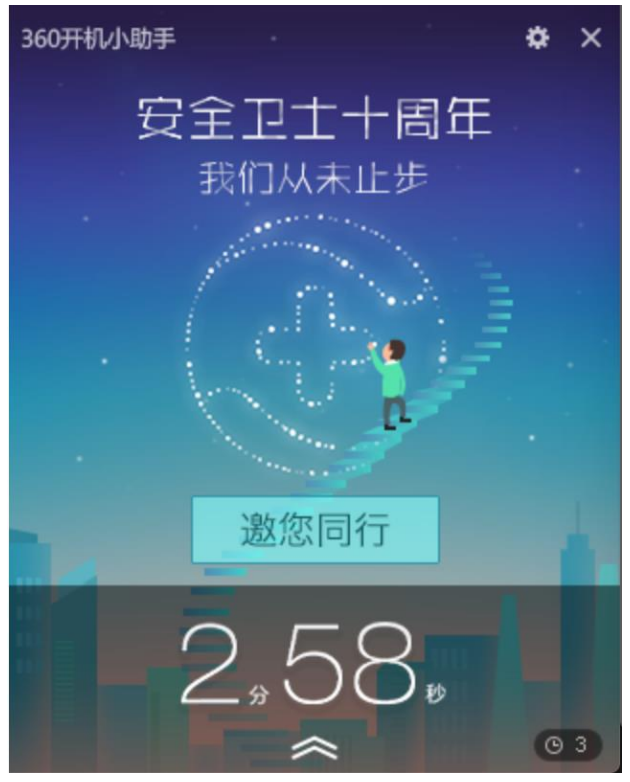

## **认识事件（Event）**

**Web 页面经常需要和用户之间进行交互，而交互的过程中我们可能想要捕捉这个交互的过程：**

比如用户点击了某个按钮、用户在输入框里面输入了某个文本、用户鼠标经过了某个位置；

浏览器需要搭建一条 JavaScript 代码和事件之间的桥梁；

当某个事件发生时，让 JavaScript 执行某个函数，所以我们需要针对事件编写处理程序（handler）；

**原生事件监听方法：**

事件监听方式一：在 script 中直接监听（很少使用）。

事件监听方式二：DOM 属性，通过元素的 on 来监听事件。

事件监听方式三：通过 EventTarget 中的 addEventListener 来监听。

**jQuery 事件监听方法：**

事件监听方式一：直接调用 jQuery 对象中的事件处理函数来监听，例如：click，mouseenter....。

事件监听方式二：调用 jQuery 对象中的 on 函数来监听，使用 off 函数来取消监听。

```html
<!DOCTYPE html>
<html lang="en">
  <head>
    <meta charset="UTF-8" />
    <meta http-equiv="X-UA-Compatible" content="IE=edge" />
    <meta name="viewport" content="width=device-width, initial-scale=1.0" />
    <title>Document</title>
  </head>
  <body>
    <ul id="list" class="panel">
      <li class="li-1">li-1</li>
      <li class="li-2">li-2</li>
      <li class="li-3">li-3</li>
      <li class="li-4">li-4</li>
      <li class="li-5">li-5</li>
    </ul>

    <button class="cancel">取消事件的监听</button>

    <script src="../libs/jquery-3.6.0.js"></script>
    <script>
      // 1.监听文档完全解析完成
      $(function () {
        // 监听事件
        // 1.使用on来监听事件
        $("ul").on("click", function () {
          console.log("click1");
        });

        // 2.使用click来监听事件
        $("ul").click(function () {
          console.log("click2");
        });

        // 3.使用mouseenter来监听事件
        $("ul").mouseenter(function () {
          console.log("mouseenter");
        });

        // 取消监听事件
        $(".cancel").click(function () {
          // $('ul').off() // 取消ul元素上所有的事件
          // $('ul').off('mouseenter')
          $("ul").off("click"); // 两个click都会取消
        });

        // 使用程序-自动触发事件
        // $('ul').trigger('click')  // 模拟用户点击了ul元素
        $("ul").trigger("mouseenter");
      });
    </script>
  </body>
</html>
```

## **click 和 on 的区别**

**click 和 on 的区别：**

click 是 on 的简写。它们重复监听，不会出现覆盖情况，都支持事件委托，底层用的是 addEventListener。

如果 on 没有使用 selector 的话，那么和使用 click 是一样的。

on 函数可以接受一个 selector 参数，用于筛选 可触发事件 的后代元素。

on 函数支持给事件添加命名空间。

```html
<!DOCTYPE html>
<html lang="en">
  <head>
    <meta charset="UTF-8" />
    <meta http-equiv="X-UA-Compatible" content="IE=edge" />
    <meta name="viewport" content="width=device-width, initial-scale=1.0" />
    <title>Document</title>
  </head>
  <body>
    <ul id="list" class="panel">
      <li class="li-1">li-1</li>
      <li class="li-2">li-2</li>
      <li class="li-3">li-3</li>
      <li class="li-4">li-4</li>
      <li class="li-5">li-5</li>
    </ul>

    <button class="cancel">取消事件的监听</button>

    <script src="../libs/jquery-3.6.0.js"></script>
    <script>
      // 1.监听文档完全解析完成
      $(function () {
        // 监听事件
        // 1.使用on来监听事件 ( 支持给事件添加命名空间: liujun )
        $("ul").on("click.liujun", function () {
          console.log("click1");
        });

        // 2.使用click来监听事件
        $("ul").click(function () {
          console.log("click2");
        });

        // 取消监听事件
        $(".cancel").click(function () {
          $("ul").off("click.liujun"); // 只取消了click1
        });

        /*
        1.on 监听的事件支持使用 命名空间
        2.on 函数支持一个 selector 的参数
      */
        //  $('ul').on('click', '字符串类型的选择器', function() {
        // 后面讲事件委托的时候再讲
        //  })
      });
    </script>
  </body>
</html>
```

## **click 和 on 中 this 指向**

**click 和 on 的 this 指向：**

this 都是指向原生的 DOM Element

```html
<!DOCTYPE html>
<html lang="en">
  <head>
    <meta charset="UTF-8" />
    <meta http-equiv="X-UA-Compatible" content="IE=edge" />
    <meta name="viewport" content="width=device-width, initial-scale=1.0" />
    <title>Document</title>
  </head>
  <body>
    <ul id="list" class="panel">
      <li class="li-1">li-1</li>
      <li class="li-2">li-2</li>
      <li class="li-3">li-3</li>
      <li class="li-4">li-4</li>
      <li class="li-5">li-5</li>
    </ul>

    <script src="../libs/jquery-3.6.0.js"></script>
    <script>
      // 1.监听文档完全解析完成
      $(function () {
        // $('ul').click(function() {
        //   console.log("%O", this) // DOM Element -> UL
        // })

        // $('ul').on('click', function() {
        //   console.log(this) // DOM Element -> UL
        // })

        // $('ul li').click(function() {
        //   console.log(this) // DOM Element -> UL
        // })

        // 底层实现的原理
        // var lisEl = $('ul li').get() // [li, li, li]
        // for(var liEL of lisEl ){
        //   liEL.addEventListener('click', function() {
        //     console.log(this)
        //   })
        // }

        // 如果this想使用jQuery里面的方法，可以转成$(this)
        // $('ul li').click(function() {
        //   console.log( $(this) ) // DOM Element 转成 jQuery 对象
        // })

        $("ul li").click(() => {
          console.log(this);
        });
      });
    </script>
  </body>
</html>
```

## **jQuery 的事件冒泡**

**我们会发现默认情况下事件是从最内层（如下图 span）向外依次传递的顺序，这个顺序我们称之为事件冒泡（Event Bubble）;**

**事实上，还有另外一种监听事件流的方式就是从外层到内层（如：body -> span），这种称之为事件捕获（Event Capture）；**

**为什么会产生两种不同的处理流呢？**

这是因为早期在浏览器开发时，不管是 IE 还是 Netscape 公司都发现了这个问题;

但是他们采用了完全相反的事件流来对事件进行了传递；

IE<9 仅采用了事件冒泡的方式，Netscape 采用了事件捕获的方式；

IE9+和现在所有主流浏览器都已支持这两种方式。

**jQuery 为了更好的兼容 IE 浏览器，底层并没有实现事件捕获。**

```html
<!DOCTYPE html>
<html lang="en">
  <head>
    <meta charset="UTF-8" />
    <meta http-equiv="X-UA-Compatible" content="IE=edge" />
    <meta name="viewport" content="width=device-width, initial-scale=1.0" />
    <title>Document</title>
    <style>
      .box {
        width: 200px;
        height: 200px;
        background-color: pink;
      }
      .content {
        display: inline-block;
        width: 50px;
        height: 50px;
        background-color: green;
      }
    </style>
  </head>
  <body>
    <div class="box">
      div
      <span class="content">span</span>
    </div>

    <script src="../libs/jquery-3.6.0.js"></script>
    <script>
      // 1.监听文档完全解析完成
      $(function () {
        // 1.事件冒泡
        // $('.content').click(function() {
        //   console.log('span')
        // })
        // $('.box').click(function() {
        //   console.log('div')
        // })
        // $('body').click(function() {
        //   console.log('body')
        // })

        // 2.事件冒泡
        $(".content").on("click", function () {
          console.log("span");
        });
        $(".box").on("click", function () {
          console.log("div");
        });
        $("body").on("click", function () {
          console.log("body");
        });
      });
    </script>
  </body>
</html>
```

## **jQuery 的事件对象( Event Object)**

jQuery 事件系统的规范是根据 W3C 的标准来制定 jQuery 事件对象。原生事件对象的大多数属性都被复制到新的 jQuery 事件

对象上。如，以下原生的事件属性被复制到 jQuery 事件对象中：

altKey, clientX, clientY, currentTarget, data, detail, key, keyCode, offsetX, offsetY, originalTarget, pageX, pageY,

relatedTarget, screenX, screenY, target, ......

jQuery 事件对象通用的属性（以下属性已实现跨浏览器的兼容）：

target、relatedTarget、pageX、pageY、which、metaKey

jQuery 事件对象常用的方法：

- preventDefault() : 取消事件的默认行为（例如，a 标签、表单事件等）。

- stopPropagation() : 阻止事件的进一步传递（例如，事件冒泡）。

要访问其它事件的属性，可以使用 event.originalEvent 获取原生对象。

```html
<!DOCTYPE html>
<html lang="en">
  <head>
    <meta charset="UTF-8" />
    <meta http-equiv="X-UA-Compatible" content="IE=edge" />
    <meta name="viewport" content="width=device-width, initial-scale=1.0" />
    <title>Document</title>
    <style>
      .box {
        width: 200px;
        height: 200px;
        background-color: pink;
      }
      .content {
        display: inline-block;
        width: 50px;
        height: 50px;
        background-color: green;
      }
    </style>
  </head>
  <body>
    <div class="box">
      div
      <span class="content">span</span>
    </div>

    <script src="../libs/jquery-3.6.0.js"></script>
    <script>
      // 1.监听文档完全解析完成
      $(function () {
        // 1.获取原生的事件对象
        // var divEl = document.querySelector('.box')
        // divEl.addEventListener('click', function(event) {
        //   console.log(event)
        // })

        // 2.获取jQuery的事件对象
        $(".box").click(function ($event) {
          console.log($event); // 是jQuery的事件对象
          console.log($event.originalEvent); // 拿到原生的事件对象
        });
      });
    </script>
  </body>
</html>
```

```html
<!DOCTYPE html>
<html lang="en">
  <head>
    <meta charset="UTF-8" />
    <meta http-equiv="X-UA-Compatible" content="IE=edge" />
    <meta name="viewport" content="width=device-width, initial-scale=1.0" />
    <title>Document</title>
    <style>
      .box {
        width: 200px;
        height: 200px;
        background-color: pink;
      }
      .content {
        display: inline-block;
        width: 50px;
        height: 50px;
        background-color: green;
      }
    </style>
  </head>
  <body>
    <div class="box">
      div
      <span class="content">span</span>
    </div>

    <a href="https://www.jd.com">京东商城</a>

    <script src="../libs/jquery-3.6.0.js"></script>
    <script>
      // 1.监听文档完全解析完成
      $(function () {
        $("a").click(function ($event) {
          $event.preventDefault(); // 阻止a元素的默认行为
          console.log("点击a元素");
        });

        $(".content").click(function ($event) {
          $event.stopPropagation(); // 阻止事件的冒泡
          console.log("span");
        });

        $(".box").on("click", function () {
          console.log("div");
        });
        $("body").on("click", function () {
          console.log("body");
        });
      });
    </script>
  </body>
</html>
```

## **jQuery 的事件委托（event delegation）**

**事件冒泡在某种情况下可以帮助我们实现强大的事件处理模式 –事件委托模式（也是一种设计模式）**

**那么这个模式是怎么样的呢？**

因为当子元素被点击时，父元素可以通过冒泡监听到子元素的点击；

并且可以通过 event.target 获取到当前监听事件的元素（event.currentTarget 获取到的是处理事件的元素）；

```html
<!DOCTYPE html>
<html lang="en">
  <head>
    <meta charset="UTF-8" />
    <meta http-equiv="X-UA-Compatible" content="IE=edge" />
    <meta name="viewport" content="width=device-width, initial-scale=1.0" />
    <title>Document</title>
  </head>
  <body>
    <ul id="list" class="panel">
      <li class="li-1">
        li-1
        <p class="p1">我是p元素</p>
      </li>
      <li class="li-2">
        li-2
        <p class="p2">我是p元素</p>
      </li>
      <li class="li-3">
        li-3
        <p class="p3">我是p元素</p>
      </li>
      <li class="li-4">
        li-4
        <p class="p4">我是p元素</p>
      </li>
      <li class="li-5">
        li-5
        <p class="p5">我是p元素</p>
      </li>
    </ul>

    <script src="../libs/jquery-3.6.0.js"></script>
    <script>
      // 1.监听文档完全解析完成
      $(function () {
        // 事件的委托
        // $('ul').on('click', function(event) {
        //   console.log(event.target)  // DOM Element : ul li  p
        // })

        // 仅仅监听li中元素的点击事件( 筛选出 可触发事件的 后代元素 )
        // 只有点击p元素才会触发点击事件
        $("ul").on("click", "li p", function (event) {
          console.log(event.target); // DOM Element : ul li  p
        });

        // on vs click
      });
    </script>
  </body>
</html>
```

## **jQuery 常见的事件**

**鼠标事件（Mouse Events）**

- .click() 、.dblclick()、.hover()、.mousedown() 、.mouseup()
- .mouseenter()、.mouseleave()、.mousemove()
- .mouseover()、.mouseout() 、.contextmenu()、.toggle()

**键盘事件（Keyboard Events）**

- .keydown() 、.keypress()、.keyup()

**文档事件（Document Loading Events）**

- load、ready()、.unload

**表单事件（Form Events）**

- .blur() 、.focus()、.change()、.submit()、.select()

**浏览器事件（Browser Events）**

- .resize()、.scroll()



```html
<!DOCTYPE html>
<html lang="en">
  <head>
    <meta charset="UTF-8" />
    <meta http-equiv="X-UA-Compatible" content="IE=edge" />
    <meta name="viewport" content="width=device-width, initial-scale=1.0" />
    <title>Document</title>
  </head>
  <body>
    <ul id="list" class="panel">
      <li class="li-1">li-1</li>
      <li class="li-2">li-2</li>
      <li class="li-3">li-3</li>
      <li class="li-4">li-4</li>
      <li class="li-5">li-5</li>
    </ul>

    <input type="text" />

    <script src="../libs/jquery-3.6.0.js"></script>
    <script>
      // 1.监听文档完全解析完成
      $(function () {
        // on('hover', func)

        // 1.hover 底层使用的是: mouseenter or mouseleave
        // $('ul').hover(function() {
        //   console.log('鼠标悬浮在ul')
        // }, function() {
        //   console.log('鼠标离开在ul')
        // })

        // 2.监听浏览器resize事件 ( throttle 节流 )
        // on('resize', func)
        $(window).resize(function () {
          console.log("resize");
        });

        // 3.表单事件
        $("input").focus(function () {
          console.log("input focus事件");
        });
        $("input").blur(function () {
          console.log("input blur事件");
        });

        // input ( debounce 防抖操作 )
        $("input").on("input", function () {
          //  console.log( $('input').val() )
          console.log($(this).val());
        });
      });
    </script>
  </body>
</html>
```

## **mouseover 和 mouseenter 的区别**

**mouseenter()和 mouseleave()**

不支持冒泡

进入子元素依然属于在该元素内，没有任何反应

**mouseover()和 mouseout()**

支持冒泡

进入元素的子元素时

- 先调用父元素的 mouseout
- 再调用子元素的 mouseover
- 因为支持冒泡，所以会将 mouseover 传递到父元素中；

## **jQuery 的键盘事件**

**事件的执行顺序是 keydown()、keypress()、keyup()**

keydown 事件先发生；

keypress 发生在文本被输入；

keyup 发生在文本输入完成（抬起、松开）；

**我们可以通过 key 和 code 来区分按下的键：**

code：“按键代码”（"KeyA"，"ArrowLeft" 等），特定于键盘上按键的物理位置。

key：字符（"A"，"a" 等），对于非字符（non-character）的按键，通常具有与 code 相同的值。）

## **jQuery 的表单事件**

**表单事件（Form Events）**

.blur() - 元素失去焦点时触发

.focus() - 元素获取焦点时触发

change() - 该事件在表单元素的内容改变时触发( \<input>, \<keygen>, \<select>, 和 \<textarea>)

.submit() - 表单提交时触发

...

## **jQuery-选项卡切换**


```html
<!DOCTYPE html>
<html lang="en">
  <head>
    <meta charset="UTF-8" />
    <meta http-equiv="X-UA-Compatible" content="IE=edge" />
    <meta name="viewport" content="width=device-width, initial-scale=1.0" />
    <title>Document</title>
    <style>
      .nav {
        background-color: #43240c;
        color: white;
      }

      .nav-bar {
        display: flex;
        width: 1200px;
        height: 46px;
        line-height: 46px;
        margin: 0 auto;
      }

      .item {
        width: 160px;
        text-align: center;
        cursor: pointer;
      }
      .item.active {
        background-color: #fee44e;
        color: #43200c;
      }
    </style>
  </head>
  <body>
    <div class="nav">
      <div class="nav-bar">
        <div class="item active">首页</div>
        <div class="item">9块9包邮</div>
        <div class="item">超值大额券</div>
        <div class="item">降温急救穿搭</div>
      </div>
    </div>

    <script src="../libs/jquery-3.6.0.js"></script>
    <script>
      // 1.监听文档完全解析完成
      $(function () {
        // siblings找到所有兄弟元素
        $(".item").on("click", function () {
          $(this).addClass("active").siblings().removeClass("active");
        });

        // console.log($('.item:eq(1)').siblings())
      });
    </script>
  </body>
</html>
```

## **jQuery 动画操作-animate**

**.animate()： 执行一组 CSS 属性的自定义动画，允许支持数字的 CSS 属性上创建动画。**

.animate( properties [, duration ] [, easing ] [, complete ] )

.animate( properties, options )

propertys 参数的支持：

- 数值：number 、string
- 关键字：'show'、'hide'和'toggle'
- 相对值：+= 、 -=
- 支持 em 、% 单位（可能会进行单位转换）

```html
<!DOCTYPE html>
<html lang="en">
  <head>
    <meta charset="UTF-8" />
    <meta http-equiv="X-UA-Compatible" content="IE=edge" />
    <meta name="viewport" content="width=device-width, initial-scale=1.0" />
    <title>Document</title>
    <style>
      .box {
        width: 200px;
        height: 100px;
        background-color: pink;
      }
    </style>
  </head>
  <body>
    <button class="hide">隐藏</button>
    <button class="show">显示</button>

    <div class="box">box</div>

    <script src="../libs/jquery-3.6.0.js"></script>
    <script>
      // 1.监听文档完全解析完成
      $(function () {
        $(".hide").click(function () {
          // 需要一个隐藏的动画
          $(".box").animate(
            {
              height: 0, // 100px -> 0px
              width: 0, // 200px -> 0px
              opacity: 0, // 1 -> 0
            },
            2000,
            "swing",
            function () {
              console.log("动画执行完毕之后会回调");
            }
          );
        });

        $(".show").click(function () {
          $(".box").animate(
            {
              height: 100,
              width: 200,
              opacity: 1,
            },
            function () {
              console.log("动画执行完毕之后会回调");
            }
          );

          // $('.box').animate({
          //   height: 100,
          //   width: 200,
          //   opacity: 1
          // }, 2000, 'swing', function() {
          //   console.log('动画执行完毕之后会回调')
          // })

          // $('.box').animate({
          //   height: 100,
          //   width: 200,
          //   opacity: 1
          // }, {
          //   duration: 'slow',
          //   complete: function() {
          //     console.log('动画执行完毕之后会回调')
          //   }
          // })
        });
      });
    </script>
  </body>
</html>
```

```html
<!DOCTYPE html>
<html lang="en">
  <head>
    <meta charset="UTF-8" />
    <meta http-equiv="X-UA-Compatible" content="IE=edge" />
    <meta name="viewport" content="width=device-width, initial-scale=1.0" />
    <title>Document</title>
    <style>
      body {
        height: 200px;
      }
      .box {
        width: 200px;
        height: 100px;
        background-color: pink;
      }
    </style>
  </head>
  <body>
    <button class="hide">隐藏</button>
    <button class="show">显示</button>
    <button class="toggle">切换</button>

    <div class="box">box</div>

    <script src="../libs/jquery-3.6.0.js"></script>
    <script>
      // 1.监听文档完全解析完成
      $(function () {
        // $('.hide').click(function() {
        //   // 需要一个隐藏的动画
        //   $('.box').animate({
        //     opacity: 'toggle',
        //     // height: 0,  // number
        //     // height: '0',  // string
        //     // height: '100%',  // 百分比  50% -> 100% ; 100px -> 200px
        //     // height: 'toggle' // 关键字: show  hide  toggle(切换)
        //     // height: '-=40px' // 100px -> 60px
        //   }, 4000, 'swing' , function() {
        //     console.log('动画执行完毕之后会回调')
        //   })
        // })

        $(".hide").click(function () {
          $(".box").animate(
            {
              opacity: 0,
              height: 0,
              width: 0,
            },
            "slow",
            function () {
              // number | 关键之: slow->600 fast->200
              console.log("动画执行完成");
            }
          );
        });
        $(".show").click(function () {
          $(".box").animate(
            {
              opacity: 1,
              height: 100,
              width: 200,
            },
            "fast",
            function () {
              console.log("动画执行完成");
            }
          );
        });
        $(".toggle").click(function () {
          $(".box").animate(
            {
              opacity: "toggle",
              height: "toggle",
              width: "toggle",
            },
            400,
            function () {
              console.log("动画执行完成");
            }
          );
        });
      });
    </script>
  </body>
</html>
```

## **jQuery 常见动画函数**

**显示和隐藏**匹配的元素

.hide() 、.hide( [duration ] [, complete ] )、.hide( options ) - 隐藏元素

.show() 、.show( [duration ] [, complete ] )、.show( options ) - 显示元素

.toggle() 、.toggle( [duration ] [, complete ] )、.toggle( options ) -显示或者隐藏元素

```html
<!DOCTYPE html>
<html lang="en">
  <head>
    <meta charset="UTF-8" />
    <meta http-equiv="X-UA-Compatible" content="IE=edge" />
    <meta name="viewport" content="width=device-width, initial-scale=1.0" />
    <title>Document</title>
    <style>
      body {
        height: 200px;
      }
      .box {
        width: 200px;
        height: 100px;
        background-color: pink;
      }
    </style>
  </head>
  <body>
    <button class="hide">隐藏</button>
    <button class="show">显示</button>
    <button class="toggle">切换</button>

    <div class="box">box</div>

    <script src="../libs/jquery-3.6.0.js"></script>
    <script>
      // 1.监听文档完全解析完成
      $(function () {
        $(".hide").click(function () {
          $(".box").hide("slow", function () {
            console.log("动画执行完成");
          });
        });

        $(".show").click(function () {
          $(".box").show("fast", function () {
            console.log("动画执行完成");
          });
        });

        $(".toggle").click(function () {
          // $('.box').toggle(2000)

          $(".box").toggle({
            duration: 3000,
            complete: function () {
              console.log("动画执行完成");
            },
          });
        });
      });
    </script>
  </body>
</html>
```

**淡入淡出**

.fadeIn()、.fadeIn( [duration ] [, complete ] )、.fadeIn( options ) - 淡入动画

.fadeOut()、.fadeOut( [duration ] [, complete ] )、.fadeOut( options ) -淡出动画

.fadeToggle()、.fadeToggle( [duration ] [, complete ] )、.fadeToggle( options ) - 淡入淡出的切换

.fadeTo( duration, opacity [, complete ] ) - 渐变到

## **jQuery 元素中的动画队列**

**jQuery 匹配元素中的 animate 和 delay 动画是通过一个动画队列(queue)来维护的。例如执行下面的动画都会添加到动画队列中：**

- .hide() 、 .show()
- .fadeIn() 、.fadeOut()
- .animate()、delay()
- ...

**.queue()：查看当前选中元素中的动画队列。**

**.stop( [clearQueue ] [, jumpToEnd ] )：停止匹配元素上当前正在运行的动画。**

clearQueue ：一个布尔值，指是否也删除排队中的动画。默认为 false

jumpToEnd ：一个布尔值，指是否立即完成当前动画。默认为 false

```html
<!DOCTYPE html>
<html lang="en">
  <head>
    <meta charset="UTF-8" />
    <meta http-equiv="X-UA-Compatible" content="IE=edge" />
    <meta name="viewport" content="width=device-width, initial-scale=1.0" />
    <title>Document</title>
    <style>
      .box {
        position: relative;
        width: 100px;
        height: 100px;
        background-color: pink;
      }
    </style>
  </head>
  <body>
    <button class="start">开始动画</button>
    <button class="stop">停止动画</button>
    <button class="queue">查看动画队列</button>

    <div class="box">box</div>

    <script src="../libs/jquery-3.6.0.js"></script>
    <script>
      // 1.监听文档完全解析完成
      $(function () {
        var $box = $(".box");
        $(".start").click(function () {
          $box.animate(
            {
              top: 100,
            },
            5000
          );

          $box.animate(
            {
              left: 100,
            },
            5000
          );

          $box.animate(
            {
              top: 0,
            },
            5000
          );

          $box.animate(
            {
              left: 0,
            },
            5000
          );
        });

        $(".queue").click(function () {
          console.log($box.queue()); // 查看动画队列 fx
        });

        $(".stop").click(function () {
          // $box.stop()  // 停止 fx 动画队列( 停止当前执行的动画,还会继续执行动画队列中其它的动画 )
          // stop(false, false) 默认值
          // $box.stop(true) // 停止所有的动画, 清空了动画队列
          //  $box.stop(true, true) // 清空了动画队列, 立即执行完当前的动画
        });
      });
    </script>
  </body>
</html>
```

## **jQuery 实现-隐藏侧边栏广告**



先把下面的阴影向下隐藏，再把上面的部分向右隐藏

```html
<!DOCTYPE html>
<html lang="en">
  <head>
    <meta charset="UTF-8" />
    <meta http-equiv="X-UA-Compatible" content="IE=edge" />
    <meta name="viewport" content="width=device-width, initial-scale=1.0" />
    <title>Document</title>

    <style>
      .box {
        position: fixed;
        bottom: 0;
        right: 0;
      }
      img {
        vertical-align: bottom;
      }

      .close {
        position: absolute;
        top: 0;
        right: 0;
        width: 25px;
        height: 25px;
        cursor: pointer;
        /* border: 1px solid red; */
      }
    </style>
  </head>
  <body>
    <div class="box">
      <span class="close"></span>
      <div class="top">
        
      </div>
      <div class="bottom">
        
      </div>
    </div>
    <script src="../libs/jquery-3.6.0.js"></script>
    <script>
      // 1.监听文档完全解析完成
      $(function () {
        $(".close").click(function () {
          $(".bottom").animate({ height: 0 }, 600, function () {
            $(".box").animate({ width: 0 }, 600, function () {
              $(".box").css("display", "none");
            });
          });
        });
      });
    </script>
  </body>
</html>
```

## **jQuery 中的遍历**

**.each( function )： 遍历一个 jQuery 对象，为每个匹配的元素执行一个回调函数。**

function 参数:

Function( Integer index, Element element )， 函数中返回 false 会终止循环。

**jQuery.each( array | object , callback ) : 一个通用的迭代器函数，可以用来无缝地迭代对象和数组。**

array 参数：支持数组（array）或者类数组（array-like）,底层使用 for 循环 。

object 参数: 支持普通的对象 object 和 JSON 对象等，底层用 for in 循环。

function 参数:

Function( Integer index, Element element )， 函数中返回 false 会终止循环。

**.each() 和 jQuery.each(）函数的区别：**

.each()是 jQuery 对象上的方法，用于遍历 jQuery 对象。

jQuery.each( ) 是 jQuery 函数上的方法，可以遍历对象、数组、类数组等，它是一个通用的工具函数。

```html
<!DOCTYPE html>
<html lang="en">
  <head>
    <meta charset="UTF-8" />
    <meta http-equiv="X-UA-Compatible" content="IE=edge" />
    <meta name="viewport" content="width=device-width, initial-scale=1.0" />
    <title>Document</title>
  </head>
  <body>
    <ul id="list" class="panel">
      <li class="li-1">li-1</li>
      <li class="li-2">li-2</li>
      <li class="li-3">li-3</li>
      <li class="li-4">li-4</li>
      <li class="li-5">li-5</li>
    </ul>

    <script src="../libs/jquery-3.6.0.js"></script>
    <script>
      // 1.监听文档完全解析完成
      $(function () {
        // 1.遍历jQuery对象 ( 已经实现了迭代器协议 for of )
        // 对象中的 each 底层调用的 jQuery函数上的each方法
        $("ul li").each(function (index, element) {
          // [].forEach( func(element, index, array ))
          console.log(index, element);
        });

        console.log("%O", $("ul"));
        // 2.使用 for of
      });
    </script>
  </body>
</html>
```

```html
<!DOCTYPE html>
<html lang="en">
  <head>
    <meta charset="UTF-8" />
    <meta http-equiv="X-UA-Compatible" content="IE=edge" />
    <meta name="viewport" content="width=device-width, initial-scale=1.0" />
    <title>Document</title>
  </head>
  <body>
    <ul id="list" class="panel">
      <li class="li-1">li-1</li>
      <li class="li-2">li-2</li>
      <li class="li-3">li-3</li>
      <li class="li-4">li-4</li>
      <li class="li-5">li-5</li>
    </ul>

    <script src="../libs/jquery-3.6.0.js"></script>
    <script>
      // 1.监听文档完全解析完成
      $(function () {
        // 1.遍历jQuery对象 ( 已经实现了迭代器协议 for of )
        jQuery.each($("ul li"), function (index, element) {
          console.log(index, element);
          return false;
        });
      });
    </script>
  </body>
</html>
```

## **jQuery 的 AJAX**

**在前端页面开发中，如果页面中的数据是需要动态获取或者更新的，这时我们需要向服务器发送异步的请求来获取数据，然后在无需刷新页面的情况来更新页面。那么这个发起异步请求获取数据来更新页面的技术叫做 AJAX。**

**AJAX 全称（Asynchronous JavaScript And XML），是异步的 JavaScript 和 XML，它描述了一组用于构建网站和 Web 应用程序的开发技术。**

简单点说，就是使用 XMLHttpRequest 对象与服务器通信。它可以使用 JSON，XML，HTML 和 text 文本等格式发送和接收数据。

AJAX 最吸引人的就是它的“异步”特性。也就是说它可以在不重新刷新页面的情况下与服务器通信，交换数据，或更新页面。

**AJAX 请求方法（Method）**

GET、POST、PUT、PACTH、DELETE 等

**jQuery 中也有 AJAX 模块，该模块是在\*XMLHttpRequest 的基础上进行了封装，语法（Syntax）如下：**

$.ajax( [settings ] ) - 默认用 GET 请求从服务器加载数据， 会返回 jQXHR 对象，可以利用该对象的 abort 方法来取消请求。

$.get( url [, data ] [, success ] [, dataType ] ) - 发起GET请求，底层调用的还是$ajax()

$.post( url [, data ] [, success ] [, dataType ] ) - 发起POST请求，底层调用的还是$ajax()

**初体验 jQuery 中的 AJAX**

https://httpbin.org (是一个专门提供：免费测试 http 服务的网站)

```html
<!DOCTYPE html>
<html lang="en">
  <head>
    <meta charset="UTF-8" />
    <meta http-equiv="X-UA-Compatible" content="IE=edge" />
    <meta name="viewport" content="width=device-width, initial-scale=1.0" />
    <title>Document</title>
  </head>
  <body>
    <ul id="list" class="panel">
      <li class="li-1">li-1</li>
      <li class="li-2">li-2</li>
      <li class="li-3">li-3</li>
      <li class="li-4">li-4</li>
      <li class="li-5">li-5</li>
    </ul>

    <script src="../libs/jquery-3.6.0.js"></script>
    <script>
      // 1.监听文档完全解析完成
      $(function () {
        // 1.get  $.ajax  => hyAjax( {url, method, success} )
        // $.ajax({
        //   url: 'http://httpbin.org/get',
        //   type: "GET", // GET  get
        //   // dataType: 'json', // 自动推断(content-type)
        //   success: function(res) {
        //     console.log(res)
        //   },
        //   error: function(error) {
        //     console.log('error=>', error)
        //   }
        // })
        // 2.post
        // $.ajax({
        //   url: 'http://httpbin.org/post',
        //   method: 'POST',
        //   // dataType: 'json'
        //   success: function(res) {
        //     console.log(res)
        //   }
        // })
        // 3.put (更新内容)
        // jQuery.ajax({
        //   url: "http://httpbin.org/put",
        //   method: "PUT",
        //   success: function(res) {
        //     console.log(res)
        //   }
        // })
        // 4.delete (删除)
        // jQuery.ajax({
        //   url: "http://httpbin.org/delete",
        //   method: "DELETE",
        //   success: function(res) {
        //     console.log(res)
        //   }
        // })
      });
    </script>
  </body>
</html>
```

## **AJAX 请求参数(Parameters)**

**请求参数（Parameters）**

- url - 指定发送请求的 URL。
- method / type - 用于指定请求的类型 (e.g. "POST", "GET", "PUT")，默认为 GET
- data - 指定要发送到服务器的数据（PlainObject or String or Array）
- processData：当 data 是一个对象时，jQuery 从对象的键/值对生成数据字符串，除非该 processData 选项设置为 false. 例如，{ a: "bc", d: "e,f" }被转换为字符串"a=bc&d=e%2Cf"，默认为 true。
- header - 请求头的内容（PlainObject）
- contentType - 默认值：application/x-www-form-urlencoded; charset=UTF-8，向服务器发送数据时指定内容类型。
  - application/x-www-form-urlencoded; charset=UTF-8： 请求体的数据以查询字符串形式提交，如：a=bc&d=e%2Cf。
  - application/json; charset=UTF-8 指定为 json 字符串类型
  - 为时 false， 代表是 multipart/form-data 。表单类型，一般用于上传文件
- dataType - 期望服务器端发回的数据类型（json、xml、text...），默认会根据响应的类型来自动推断类型。
- timeout - 请求超时时间。它以毫秒为单位。
- beforeSend - 这是一个在发送请求之前运行的函数，返回 false 会取消网络请求。
- success - 请求成功回调的函数
- error - 请求失败回调的函数

请求发生错误

```html
<!DOCTYPE html>
<html lang="en">
  <head>
    <meta charset="UTF-8" />
    <meta http-equiv="X-UA-Compatible" content="IE=edge" />
    <meta name="viewport" content="width=device-width, initial-scale=1.0" />
    <title>Document</title>
  </head>
  <body>
    <ul id="list" class="panel">
      <li class="li-1">li-1</li>
      <li class="li-2">li-2</li>
      <li class="li-3">li-3</li>
      <li class="li-4">li-4</li>
      <li class="li-5">li-5</li>
    </ul>

    <script src="../libs/jquery-3.6.0.js"></script>
    <script>
      // 1.监听文档完全解析完成
      $(function () {
        // 500 (后台代码异常)
        // $.ajax({
        //   url: 'http://httpbin.org/status/500',
        //   method: "POST",
        //   success: function() {
        //     console.log('success')
        //   },
        //   error: function(error) {
        //     console.log("error=>", error)
        //   }
        // })
        // 503 (服务器维护)
        // $.ajax({
        //   url: 'http://httpbin.org/status/503',
        //   method: "POST",
        //   success: function() {
        //     console.log('success')
        //   },
        //   error: function(error) {
        //     console.log("error=>", error)
        //   }
        // })
        // 403(没有权限获取该资源)
        // $.ajax({
        //   url: 'http://httpbin.org/status/403',
        //   method: "POST",
        //   success: function() {
        //     console.log('success')
        //   },
        //   error: function(error) {
        //     console.log("error=>", error)
        //   }
        // })
        // 404(资源路劲rul没有写对: 前端)
        // $.ajax({
        //   url: 'http://httpbin.org/status/404',
        //   method: "POST",
        //   success: function() {
        //     console.log('success')
        //   },
        //   error: function(error) {
        //     console.log("error=>", error)
        //   }
        // })
        // $.ajax({
        //   url: 'http://httpbin.org/sdfxsdfs/sdfsdfsdf/sdfsdf',
        //   method: "POST",
        //   success: function() {
        //     console.log('success')
        //   },
        //   error: function(error) {
        //     console.log("error=>", error)
        //   }
        // })
      });
    </script>
  </body>
</html>
```

请求超时和取消请求

```html
<!DOCTYPE html>
<html lang="en">
  <head>
    <meta charset="UTF-8" />
    <meta http-equiv="X-UA-Compatible" content="IE=edge" />
    <meta name="viewport" content="width=device-width, initial-scale=1.0" />
    <title>Document</title>
  </head>
  <body>
    <ul id="list" class="panel">
      <li class="li-1">li-1</li>
      <li class="li-2">li-2</li>
      <li class="li-3">li-3</li>
      <li class="li-4">li-4</li>
      <li class="li-5">li-5</li>
    </ul>

    <button>取消这个请求</button>

    <script src="../libs/jquery-3.6.0.js"></script>
    <script>
      // 1.监听文档完全解析完成
      $(function () {
        // 1.timeout
        var jqXHR = $.ajax({
          url: "http://httpbin.org/delay/7", // 后台需要在7秒后才会返回数据给我们
          method: "POST",
          timeout: 5000, // 配置超时时间
          success: function (res) {
            console.log(res);
          },
          error: function (error) {
            console.log(error); // 超时就会报错，服务端需要7秒返回数据，但是这边配置了5秒没有返回数据就会报错
          },
        });

        // 取消这个请求
        $("button").click(function () {
          // abort()
          jqXHR.abort(); // 手动取消请求
        });
      });
    </script>
  </body>
</html>
```

get 请求参数和简写

```html
<!DOCTYPE html>
<html lang="en">
  <head>
    <meta charset="UTF-8" />
    <meta http-equiv="X-UA-Compatible" content="IE=edge" />
    <meta name="viewport" content="width=device-width, initial-scale=1.0" />
    <title>Document</title>
  </head>
  <body>
    <ul id="list" class="panel">
      <li class="li-1">li-1</li>
      <li class="li-2">li-2</li>
      <li class="li-3">li-3</li>
      <li class="li-4">li-4</li>
      <li class="li-5">li-5</li>
    </ul>

    <script src="../libs/jquery-3.6.0.js"></script>
    <script>
      // 1.监听文档完全解析完成
      $(function () {
        // console.log(encodeURIComponent('天河公园'))
        // 1.url 添加查询字符串
        // $.ajax({
        //   url: 'http://httpbin.org/get?cityId=404100&keyWord=天河公园',
        //   method: "GET",
        //   success: function(res) {
        //     console.log(res)
        //   }
        // })

        // 2.支持在data中提交参数
        // $.ajax({
        //   url: 'http://httpbin.org/get',
        //   method: "GET",
        //   data: {
        //     cityId: '504100',
        //     keyWord: '小蛮腰'
        //   },
        //   success: function(res) {
        //     console.log(res)
        //   }
        // })

        // 3.给 get请求添加请求头
        // $.ajax({
        //   url: 'http://httpbin.org/get',
        //   method: "GET",
        //   data: {
        //     cityId: '504100',
        //     keyWord: '小蛮腰'
        //   },
        //   headers: {  // 比如你登录成功之后,后台会返回一个 token
        //      accessToken: 'aaaaabbbbbcccccc'
        //   },
        //   success: function(res) {
        //     console.log(res)
        //   }
        // })

        // 4.get简写 jQuery 1.8之后才有then和catch，1.8之前叫done和fail
        $.get("http://httpbin.org/get")
          .then(function (res) {
            // jQuery 1.8  ; done
            console.log(res);
          })
          .catch(function () {
            //  fail
            console.log("catch");
          })
          .always(function () {
            // finally
            console.log("always");
          });
      });
    </script>
  </body>
</html>
```

post 请求参数和简写

```html
<!DOCTYPE html>
<html lang="en">
  <head>
    <meta charset="UTF-8" />
    <meta http-equiv="X-UA-Compatible" content="IE=edge" />
    <meta name="viewport" content="width=device-width, initial-scale=1.0" />
    <title>Document</title>
  </head>
  <body>
    <ul id="list" class="panel">
      <li class="li-1">li-1</li>
      <li class="li-2">li-2</li>
      <li class="li-3">li-3</li>
      <li class="li-4">li-4</li>
      <li class="li-5">li-5</li>
    </ul>

    <script src="../libs/jquery-3.6.0.js"></script>
    <script>
      // 1.监听文档完全解析完成
      $(function () {
        // 1. 在url中提交查询字符串(比较少见)
        // $.ajax({
        //   url: 'http://httpbin.org/post?cityId=404100&keyWord=天河公园',
        //   method: "POST",
        //   success: function(res) {
        //     console.log(res)
        //   }
        // })

        // 2. 在data中提交查询字符串
        // $.ajax({
        //   url: 'http://httpbin.org/post',
        //   method: "POST",
        //   data: {
        //     cityId: '504100',
        //     keyWord: '小蛮腰'
        //   },
        //   // contentType: 'application/x-www-form-urlencoded; charset=UTF-8',
        //   // dataType: 'json', // 自动推断, response content-type
        //   success: function(res) {
        //     console.log(res)
        //   }
        // })

        // 3. 在data中 JSON 字符串
        // $.ajax({
        //   url: 'http://httpbin.org/post',
        //   method: "POST",
        //   data: JSON.stringify({
        //     cityId: '504100',
        //     keyWord: '小蛮腰'
        //   }),
        //   contentType: 'application/json; charset=UTF-8',
        //   success: function(res) {
        //     console.log(res)
        //   }
        // })

        // 4. 在data中 FormData
        // var formData = new FormData()  // <form> <input name="cityId" value="404100"/> <input name="keyWord" value="小蛮腰"/>   </form>
        // formData.append('cityId', 404100)
        // formData.append('keyWord', '小蛮腰')
        // // formData.append('file', 文件)
        // $.ajax({
        //   url: 'http://httpbin.org/post',
        //   method: "POST",
        //   data: formData,
        //   processData: false, // processData:true, 会将data为对象的转成查询字符串
        //   contentType: false, // 使用 原生 XHR 默认的 contentType
        //   success: function(res) {
        //     console.log(res)
        //   }
        // })

        // 5. 在添加请求头
        // var formData = new FormData()
        // formData.append('cityId', 404100)
        // formData.append('keyWord', '小蛮腰')
        // $.ajax({
        //   url: 'http://httpbin.org/post',
        //   method: "POST",
        //   data: formData,
        //   processData: false, // processData:true, 会将data为对象的转成查询字符串
        //   contentType: false, // 使用 原生 XHR 默认的 contentType
        //   headers: {
        //     liujunToken: 'xxxxxxxsssssssssssd'
        //   },
        //   success: function(res) {
        //     console.log(res)
        //   }
        // })

        // 6. POST简写
        $.post("http://httpbin.org/post", {
          cityId: "504100",
          keyWord: "小蛮腰",
        }).then(function (res) {
          console.log(res);
        });
      });
    </script>
  </body>
</html>
```

## **jQuery 插件（plugins）开发**

**在我们开发时，有时候 jQuery 提供的方法并不能满足我们的需求。如果我们想给 jQuery 扩展一些其它的方法，那这种情况下，**

**可能需要编写一个插件。**

jQuery 插件其实就是：编写一些新增的方法，并将这些方法添加到 jQuery 的原型对象上。

**编写 jQuery 插件的步骤：**

- 新建一个插件对应的 JS 文件（命名规范：jquery.插件名.js）
- 在立即执行函数中编写插件，这样可以避免插件中的变量与全局变量冲突。
- 在 jQuery 的原型对象上新增一些的方法。
- 最后在 html 中导入就可以像使用其他 jQuery 对象方法一样使用了
- 到此就开发完一个 jQuery 的插件了。

**案例：开发一个 jquery.showlinklocation.js 的插件。**

功能：让网页上所有的 a 标签文本的后面追加对应的域名地址。

```html
<!DOCTYPE html>
<html lang="en">
  <head>
    <meta charset="UTF-8" />
    <meta http-equiv="X-UA-Compatible" content="IE=edge" />
    <meta name="viewport" content="width=device-width, initial-scale=1.0" />
    <title>Document</title>
  </head>
  <body>
    <ul id="list" class="panel">
      <li class="li-1">li-1</li>
      <li class="li-2">li-2</li>
      <li class="li-3">li-3</li>
      <li class="li-4">li-4</li>
      <li class="li-5">li-5</li>
    </ul>

    <a href="https://www.jd.com">京东商城</a>
    <a href="https://www.taobao.com">淘宝商城</a>
    <a href="https://www.biyao.com">必要商城</a>

    <script src="../libs/jquery-3.6.0.js"></script>
    <script src="./utils/jquery.showlinklocation.js"></script>
    <script>
      // 1.监听文档完全解析完成
      $(function () {
        $("a").showlinklocation().css("color", "red");
      });
    </script>
  </body>
</html>
```

utils/jquery.showlinklocation.js

```javascript
(function (window, $) {
  // 1.在jquery的原型上添加了一个 showlinklocation
  // $.fn.showlinklocation = function() {
  //   console.log(this) // jQuery对象
  //   this.append('(http://www.liujun.com)')
  // }

  // 2.需要过滤出a元素
  // $.fn.showlinklocation = function() {
  //   console.log(this) // jQuery对象
  //   this.filter('a').append('(http://www.liujun.com)')
  // }

  // 3.需要遍历a元素
  $.fn.showlinklocation = function () {
    console.log(this); // jQuery对象
    this.filter("a").each(function () {
      var $a = $(this); // DOM Element
      var link = $a.attr("href");
      $a.append(`(${link})`);
    });
    return this;
  };

  //
})(window, jQuery);
```

## 封装网络请求

```javascript
(function (window, $) {
  // 这个是公共的请求  HYReq.request -> $.ajax
  function request(config = {}) {
    return $.ajax({
      ...config,
      url: config.url || "", // 跨越处理: node cors  / nginx 反向代理
      method: config.method || "GET",
      timeout: config.timeout || 5000,
      data: config.data || {},
      headers: config.headers || {},
    });
  }

  // HYReq.get -> $.get
  function get(url, data) {
    return request({
      url,
      method: "GET",
      data,
    });
  }

  // HYReq.post -> $.post
  function post(url, data) {
    return request({
      url,
      method: "POST",
      data,
    });
  }

  window.HYReq = {
    request,
    get,
    post,
  };
})(window, jQuery);
```
