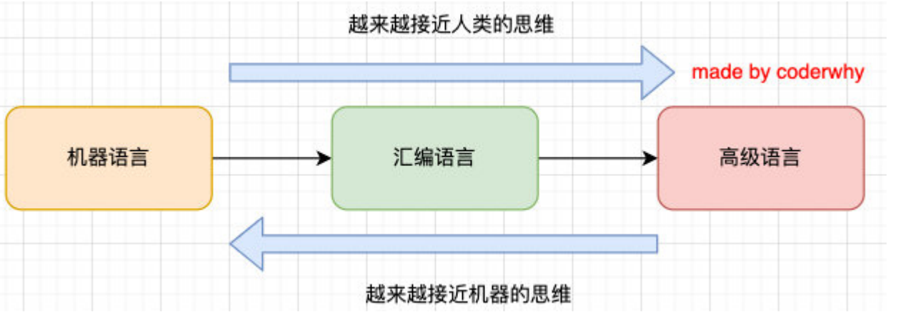
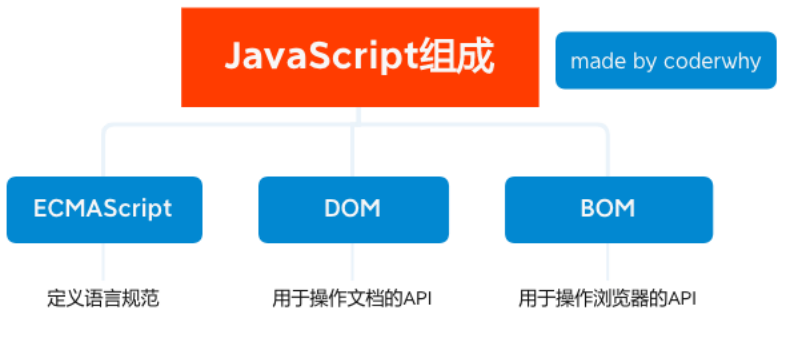

## 编程语言

事实上, JavaScript 我们可以对其有更加精准的说法：一种编程语言

我们先搞清楚计算机语言和编程语言的关系和区别:

- 计算机语言：计算机语言（computer language）指用于人与计算机之间通讯的语言，是人与计算机之间传递信息的介质。但 是其概念比通用的编程语言要更广泛。例如，HTML 是标记语言，也是计算机语言，但并不是编程语言。
- 编程语言：编程语言（英语：programming language），是用来定义计算机程序的形式语言。它是一种被标准化的交流技巧， 用来向计算机发出指令，一种能够让程序员准确地定义计算机所需要使用数据的计算机语言，并精确地定义在不同情况下所 应当采取的行动。

很抽象, 我们来说明一下编程语言的特点：

- 数据和数据结构
- 指令及流程控制
- 引用机制和重用机制
- 设计哲学

## 编程语言的发展历史 – 机器语言

阶段一: 机器语言

- 计算机的存储单元只有 0 和 1 两种状态，因此一串代码要让计算机“读懂”，这串代码只能由数字 0 和 1 组成。
- 像这种由数字 0 和 1 按照一定的规律组成的代码就叫机器码，也叫二进制编码。
- 一定长度的机器码组成了机器指令，用这些机器指令所编写的程序就称为机器语言。

优点:

- 代码能被计算机直接识别，不需要经过编译解析；
- 直接对硬件产生作用，程序的执行效率非常高；

缺点:

- 程序全是些 0 和 1 的指令代码，可读性差，还容易出错；
- 不易编写(目前没有人这样开发)；

## 编程语言的发展历史 – 汇编语言

阶段二: 汇编语言

- 为了解决机器语言的缺陷，人们发明了另外一种语言——汇编语言。
- 这种语言用符号来代替冗长的、难以记忆的 0、1 代码。(mov/push 指令，经过汇编器，汇编代码再进一步转成 0101)

优点:

- 像机器语言一样，可以直接访问、控制计算机的各种硬件设备；
- 占用内存少，执行速度快；

缺点:

- 第一，不同的机器有不同的汇编语言语法和编译器，代码缺乏可移植性
- 也就是说，一个程序只能在一种机器上运行，换到其他机器上可能就不能运行；
- 第二，符号非常多、难记
  - 即使是完成简单的功能也需要大量的汇编语言代码，很容易产生 BUG，难于调试；

应用场景

操作系统内核、驱动程序、单片机程序；

## 编程语言的发展历史 – 高级语言

阶段三: 高级语言

- 最好的编程语言应该是什么? 自然语言；
- 而高级语言, 就是接近自然语言, 更符合人类的思维方式
- 跟和人交流的方式很相似, 但是大多数编程语言都是国外发明的, 因为都是接近于英文的交流方式

优点:

- 简单、易用、易于理解，语法和结构类似于普通英文；
- 远离对硬件的直接操作，使得一般人经过学习之后都可以编程，而不用熟悉硬件知识；
- 一个程序还可以在不同的机器上运行，具有可移植性；

缺点:

- 程序不能直接被计算机识别，需要经编译器翻译成二进制指令后，才能运行到计算机上；
- 种类繁多：JavaScript 、 C 语言、C++、C#、Java、Objective-C 、Python 等；

## 机器语言和高级语言

在前端，我们需要学好的只有一门高级语言：JavaScript。

## 认识 JavaScript

维基百科对 JavaScript 的定义:

- JavaScript（通常缩写为 JS）是一种高级的、解释型的编程语言；
- JavaScript 是一门基于原型、头等函数的语言，是一门多范式的语言，它支持面向对象程序设计，指令式编程，以及函数式编 程；

从上面的定义中, 我们会发现很多关键词：

解释型语言? 原型? 头等函数? 多范式? 面向对象程序设计? 指令式编程? 函数式编程?

这些改变往往会让人不知所云，需要我们完全掌握 JavaScript 再来回头看，每一个词语描述的都非常准确；

现在只需要知道，通俗的说法:

JavaScript 是一门高级编程语言, 是前端开发的重要组成部分!

HTML 和 CSS 也是前端开发的重要组成部分, 而 JavaScript 是前端开发的灵魂。

## JavaScript 的起源（一）

1994 年，网景公司（Netscape）发布了 Navigator 浏览器 0.9 版。

- 这是历史上第一个比较成熟的网络浏览器，轰动一时。
- 但是，这个版本的浏览器只能用来浏览，不具备与访问者互动的能力。
- 网景公司急需一种网页脚本语言，使得浏览器可以与网页互动。

## JavaScript 的起源（二）

网景公司当时想要选择一种语言来嵌入到浏览器中：

- 采用现有的语言，比如`Perl、Python、Tcl、Scheme`等等, 允许它们直接嵌入网页;
- 1995 年网景公司招募了程序员`Brendan Eich`，希望将 Scheme 语言作为网页脚本语言的可能性；

就在这时，发生了另外一件大事：1995 年 Sun 公司将 Oak 语言改名为 Java，正式向市场推出；

- Java 推出之后立马在市场上引起了轰动，Java 当初有一个口号：“write once run anywhere”；
- 网景公司动了心，决定与 Sun 公司结成联盟，希望将 Java 嵌入到网页中来运行；
- `Brendan Eich`本人非常热衷于 Scheme，但是管理层那个时候有点倾向于 Java，希望可以简化 Java 来适应网页脚本的需求

## JavaScript 的起源（三）

但是`Brendan Eich`对此并不感兴趣，他用 10 天时间设计出来了 JavaScript；

- 最初这门语言的名字是 Mocha（摩卡）；
- 在`Navigator2.0 `beta 版本更名为`LiveScript`；
- 在`Navigator2.0 beta 3`版本正式重命名为 JavaScript，当时是为了给这门语言搭上 Java 这个热词；

当然 10 天设计出来语言足够说明`Brendan Eich`是天才，但是这门语言当时更像是一个多种语言的大杂烩;

- 借鉴 C 语言的基本语法；
- 借鉴 Java 语言的数据类型和内存管理；
- 借鉴 Scheme 语言，将函数提升到"第一等公民"（first class）的地位；
- 借鉴 Self 语言，使用基于原型（prototype）的继承机制。

## JavaScript 的起源（四）

微软公司于 1995 年首次推出 Internet Explorer，从而引发了与 Netscape 的浏览器大战。

- 微软对 Netscape Navigator 解释器进行了逆向工程，创建了`JScript`，以与处于市场领导地位的网景产品同台竞争；
- 这个时候对于开发者来说是一场噩耗，因为需要针对不同的浏览器进行不同的适配；

1996 年 11 月，网景正式向`ECMA`（欧洲计算机制造商协会）提交语言标准。

- 1997 年 6 月，`ECMA`以 JavaScript 语言为基础制定了`ECMAScript`标准规范`ECMA-262`;
- `ECMA-262`是一份标准，定义了`ECMAScript`;
- JavaScript 成为了`ECMAScript`最著名的实现之一;
- 除此之外，`ActionScript`和`JScript`也都是`ECMAScript`规范的实现语言；

所以说，`ECMAScript`是一种规范，而 JavaScript 是这种规范的一种实现。

## JavaScript 的组成

`ECMAScript`是 JavaScript 的标准，描述了该语言的语法和基本对象。

- JavaScript 是`ECMAScript`的语言层面的实现;
- 因为除了语言规范之外，JavaScript 还需要对页面和浏览器进行各种操作;
- 除了基本实现之外，还包括 DOM 操作和`BOM`操作;

目前我们会针对性的学习`ECMAScript`，也就是语言层面的内容，特别是`ES5`之前的语法。

## JavaScript 由谁来运行？

我们经常会说：不同的浏览器有不同的内核组成

- Gecko：早期被 Netscape 和 Mozilla Firefox 浏览器浏览器使用；
- Trident：微软开发，被`IE4~IE11`浏览器使用，但是 Edge 浏览器已经转向 Blink；
- `Webkit`：苹果基于`KHTML`开发、开源的，用于 Safari，Google Chrome 之前也在使用；
- Blink：是 Webkit 的一个分支，Google 开发，目前应用于 Google Chrome、Edge、Opera 等；

事实上，我们经常说的浏览器内核指的是浏览器的排版引擎：

排版引擎（layout engine），也称为浏览器引擎（browser engine）、页面渲染引擎（rendering engine）或样版引擎。

那么，JavaScript 代码由谁来执行呢？

JavaScript 引擎

## 认识 JavaScript 引擎

为什么需要 JavaScript 引擎呢？

- 我们前面说过，高级的编程语言都是需要转成最终的机器指令来执行的；
- 事实上我们编写的 JavaScript 无论你交给浏览器或者 Node 执行，最后都是需要被 CPU 执行的；
- 但是 CPU 只认识自己的指令集，实际上是机器语言，才能被 CPU 所执行；
- 所以我们需要 JavaScript 引擎帮助我们将 JavaScript 代码翻译成 CPU 指令来执行；

比较常见的 JavaScript 引擎有哪些呢？

- `SpiderMonkey`：第一款 JavaScript 引擎，由`Brendan Eich`开发（也就是 JavaScript 作者）；
- `Chakra`：微软开发，用于 IT 浏览器；
- `JavaScriptCore`：`WebKit`中的 JavaScript 引擎，Apple 公司开发；
- `V8`：Google 开发的强大 JavaScript 引擎，也帮助 Chrome 从众多浏览器中脱颖而出

## 浏览器内核和`JS引擎`的关系

这里我们先以`WebKit`（浏览器内核）为例，`WebKit`事实上由两部分组成的：

- `WebCore`：负责 HTML 解析、布局、渲染等等相关的工作；
- `JavaScriptCore`（`JS引擎`）：解析、执行 JavaScript 代码；

小程序中也是这样的划分：

在小程序中编写的 JavaScript 代码就是被`JSCore`执行的；

## 著名的 Atwood 定律

Stack Overflow 的创立者之一的 Jeff Atwood 在 2007 年提出了著名的 Atwood 定律：

- Any application that can be written in JavaScript, will eventually be written in JavaScript.
- 任何可以使用 JavaScript 来实现的应用都最终都会使用 JavaScript 实现。
