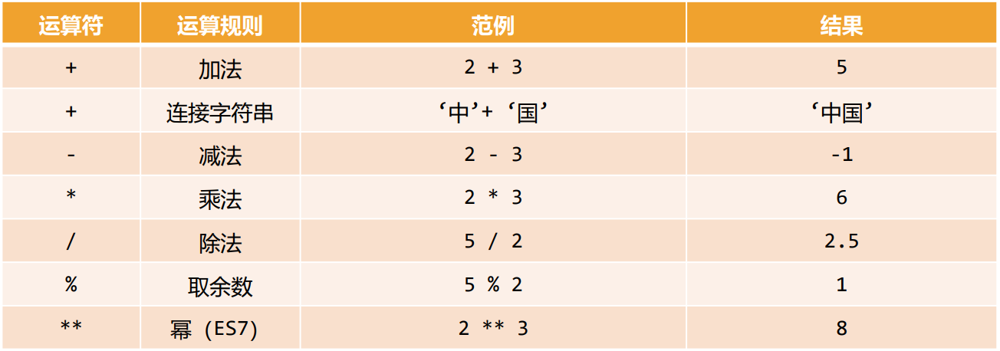
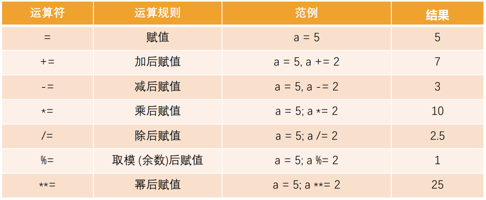
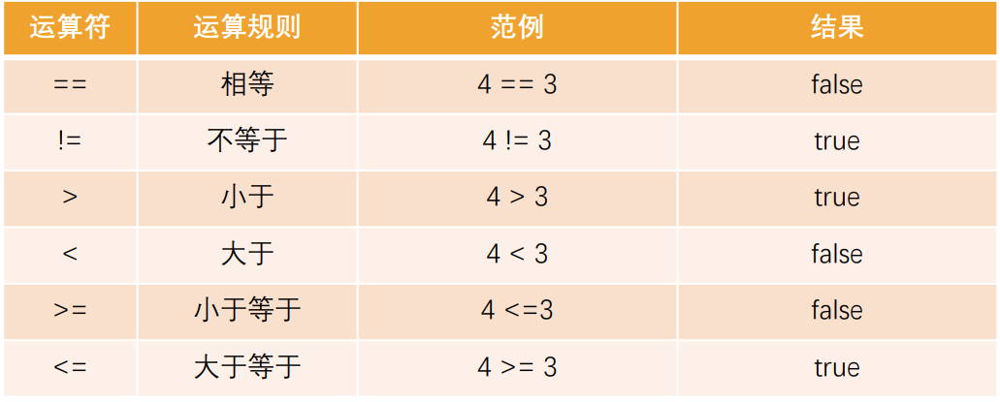

## 认识运算符

在小学的时候我们就学习了各种运算符，比如加号 +、乘号 \*、减号 - 、除号/

计算机最基本的操作就是执行运算，执行运算时就需要使用运算符来操作

JavaScript 按照使用场景的不同将运算符分成了很多种类型：

算术运算符/赋值运算符/关系(比较)运算符/逻辑运算符

## 认识运算元

在正式开始运算之前，我们先学习一下常见的术语：

运算元 —— 运算符应用的对象

- 比如说乘法运算 5 \* 2，有两个运算元
- 左运算元 5 和右运算元 2
- 有时候人们也称其为“参数”

如果一个运算符对应的只有一个运算元，那么它是 一元运算符

- 比如说一元负号运算符（unary negation）-，它的作用是对数字进行正负转换

如果一个运算符拥有两个运算元，那么它是 二元运算符

- 比如 2 + 3

一元运算符通常我们是使用 – 和 +，-号使用的会较多一些

## JavaScript 中的运算

算术运算符

算术运算符用在数学表达式中, 它的使用方式和数学中也是一致的

算术运算符是对数据进行计算的符号



```js
// + - * /
var num1 = 5;
var num2 = 8;
var result1 = num1 * num2;
console.log(result1); // 40

// %: 取余操作
var num = 20;
var result2 = num % 8;
console.log(result2); // 4

// **: 2**3 2的三次方
console.log(2 ** 4); // 16
console.log(Math.pow(2, 4)); // 16
```

# 取余 % 和 求幂

取余运算符是 %，尽管它看起来很像百分数，但实际并无关联

a % b 的结果是 a 整除 b 的 余数

求幂运算 a \*\* b 将 a 提升至 a 的 b 次幂。（ES7 中的语法，也叫做 ES2016）

在数学中我们将其表示为 a 的 b 次方

## 赋值运算符

前面我们使用的 = 其实也是一个运算符，被称之为 赋值（ assignments ）运算符

= 是一个运算符，而不是一个有着“魔法”作用的语言结构

- 语句 x = value 将值 value 写入 x 然后返回 x

```js
// =赋值运算符
var num = 123;
```

链式赋值（Chaining assignments）

```js
// 链式赋值
var num1 = (num2 = num3 = 2 + 2);
console.log(num1, num2, num3);
```

- 链式赋值从右到左进行计算
- 首先，对最右边的表达式 2 + 2 求值，然后将其赋给左边的变量：num3、num2 和 num1
- 最后，所有的变量共享一个值

但是从代码的可读性的角度来说，不推荐这种写法

## 原地修改（Modify-in-place）

什么是原地修改呢？

我们经常需要对一个变量做运算，并将新的结果存储在同一个变量中

```js
var num = 100;
num = num + 10;
num = num * 10;
```

可以使用运算符 += 和 \*= 来缩写这种表示

```js
var num = 100;
num += 10;
num *= 10;
```



所有算术和位运算符都有简短的“修改并赋值”运算符：/= 和 -= 等

## 自增、自减

对一个数进行加一、减一是最常见的数学运算符之一

所以，对此有一些专门的运算符：

- 自增 ++ 将变量加 1；
- 自减 -- 将变量减 1；

自增/自减只能应用于变量，将其应用于数值（比如 5++）则会报错

```js
var currentIndex = 5;

// 方法一:
currentIndex = currentIndex + 1;

// // 方法二:
currentIndex += 1;

// 方法三: 自增
currentIndex++;
console.log(currentIndex);

// 自减
// currentIndex -= 1
currentIndex--;
console.log(currentIndex);
```

## ++和—的位置

运算符 ++ 和 -- 可以置于变量前，也可以置于变量后

- 当运算符置于变量后，被称为“后置形式”（postfix form）：counter++
- 当运算符置于变量前，被称为“前置形式”（prefix form）：++counter
- 两者都做同一件事：将变量 counter 与 1 相加

它们有什么区别吗？

- 有，但只有当我们使用 ++/-- 的返回值时才能看到区别
- 如果自增/自减的值不会被使用，那么两者形式没有区别
- 如果我们想要对变量进行自增操作，并且 需要立刻使用自增后的值，那么我们需要使用前置形式
- 前置形式返回一个新的值，但后置返回原来的值

```js
var currentIndex = 5;
// 自己自增或者自减是没有区别
++currentIndex;
console.log(currentIndex); // 6
--currentIndex;
console.log(currentIndex); // 5
```

```js
// 自增和自减表达式本身又在其他的表达式中, 那就有区别
var currentIndex = 5;
var result1 = 100 + currentIndex++;
console.log(currentIndex); // 6
console.log("result1:" + result1); // 105
```

```js
var currentIndex = 5;
var result2 = 100 + ++currentIndex;
console.log(currentIndex); // 6
console.log("result2:" + result2); // 106
```

# 运算符的优先级

运算符放到一起使用时会有一定的优先级：

在 MDN 上给出了所有运算符的优先级（不用去记）

https://developer.mozilla.org/zh-CN/docs/Web/JavaScript/Reference/Operators/Operator_Precedence

## 比较运算符

我们知道，在数学中有很多用于比较大小的运算符，在 JavaScript 中也有相似的比较：

- 大于 / 小于：a > b，a < b
- 大于等于 / 小于等于：a >= b，a <= b
- 检查两个值的相等：a == b，请注意双等号 == 表示相等性检查，而单等号 a = b 表示赋值
- 检查两个值不相等：不相等在数学中的符号是 ≠，但在 JavaScript 中写成 a != b

比较运算符的结果都是 Boolean 类型的



```js
var num1 = 20;
var num2 = 30;

// 1.比较运算符
var isResult = num1 > num2;
console.log(isResult); // false

// 2.==判断
console.log(num1 == num2); // false
console.log(num1 != num2); // true

// 需求: 获取到比较大的那个值
var result = 0;
if (num1 > num2) {
  result = num1;
} else {
  result = num2;
}
```

## === 和 == 的区别

普通的相等性检查 == 存在一个问题，它不能区分出 0 和 false，或者空字符串和 false 这类运算：

- 这是因为在比较不同类型的值时，处于判断符号 == 两侧的值会先被转化为数字
- 空字符串和 false 也是如此，转化后它们都为数字 0

如果我们需要区分 0 和 false，该怎么办？

- 严格相等运算符 === 在进行比较时不会做任何的类型转换
- 换句话说，如果 a 和 b 属于不同的数据类型，那么 a === b 不会做任何的类型转换而立刻返回 false

同样的，“不相等”符号 != 类似，“严格不相等”表示为 !==

严格相等的运算符虽然写起来稍微长一些，但是它能够很清楚地显示代码意图，降低你犯错的可能性

```js
var foo1 = 0;
var foo2 = "";

// ==运算符, 在类型不相同的情况下, 会将运算元先转成Number的值, 再进行比较(隐式转换)
// null比较特殊: null在进行比较的时候, 应该是会被当成一个对象和原生类型进行比较的
console.log(Number(foo1)); // 0
console.log(Number(foo2)); // 0
console.log(foo1 == foo2); // true

// ===运算符, 在类型不相同的情况, 直接返回false
console.log(foo1 === foo2); // false
```
