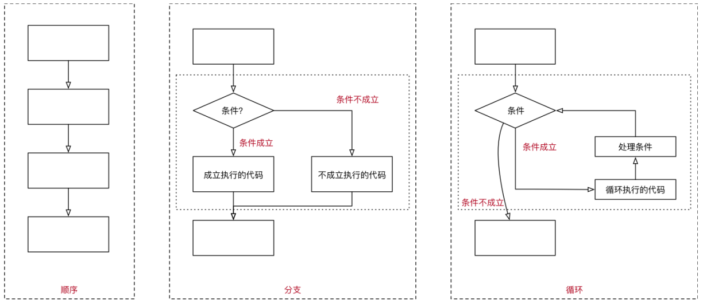
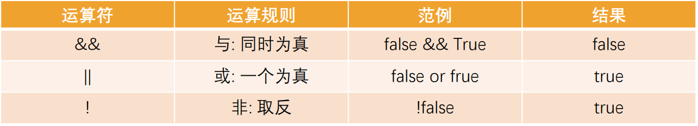

## 程序的执行顺序

在程序开发中，程序有三种不同的执行方式：

- 顺序 —— 从上向下，顺序执行代码
- 分支 —— 根据条件判断，决定执行代码的 分支
- 循环 —— 让 特定代码 重复 执行



```js
// 1.顺序执行
var num1 = 10;
var num2 = 20;

var result = num1 + num2;
var result2 = num1 * num2;

// 2.分支语句
var isLogin = true;
if (isLogin) {
  console.log("访问购物车");
  console.log("访问个人中心");
} else {
  console.log("跳转到登录页面");
}

// 3.循环语句
var i = 0;
while (i < 10) {
  console.log("执行循环语句");
  i++;
}
```

## 代码块的理解

代码块是多行执行代码的集合，通过一个花括号{}放到了一起

在开发中，一行代码很难完成某一个特定的功能，我们就会将这些代码放到一个代码块中

```js
// 一个代码块
{
  var num1 = 10;
  var num2 = 20;
  var result = num1 + num2;
}

// 一个对象
var info = {
  name: "why",
  age: 18,
};
```

在 JavaScript 中，我们可以通过流程控制语句来决定如何执行一个代码块：

- 通常会通过一些关键字来告知 js 引擎代码要如何被执行
- 比如分支语句、循环语句对应的关键字等

## 什么是分支结构？

程序是生活的一种抽象, 只是我们用代码表示了出来

- 在开发中, 我们经常需要根据一定的条件, 来决定代码的执行方向
- 如果 条件满足，才能做某件事情
- 如果 条件不满足，就做另外一件事情

分支结构

- 分支结构的代码就是让我们根据条件来决定代码的执行
- 分支结构的语句被称为判断结构或者选择结构
- 几乎所有的编程语言都有分支结构（C、C++、OC、JavaScript 等等）

JavaScript 中常见的分支结构有：

- if 分支结构
- switch 分支结构

## if 分支语句

if 分支结构有三种：

单分支结构

- if..

多分支结构

- if..else..
- if..else if..else..

## 单分支结构

单分支语句：if

if(...) 语句计算括号里的条件表达式，如果计算结果是 true，就会执行对应的代码块

```js
// 案例一: 如果小明考试超过90分, 就可以去游乐场
// 1.定义一个变量来保存小明的分数
var score = 99;

// 2.如果分数超过90分, 去游乐场
if (score > 90) {
  console.log("去游乐场玩~");
}

// 案例二: 苹果单价5元/斤, 如果购买的数量超过5斤, 那么立减8元
// 1.定义一些变量保存数据
var price = 5;
var weight = 7;
var totalPrice = price * weight;

// 2.根据购买的重量, 决定是否 -8
if (weight > 5) {
  totalPrice -= 8;
}

console.log("总价格:", totalPrice);

// 案例三: 播放列表中 currentIndex
// ["鼓楼", "理想", "阿刁"]
var currentIndex = 2;

// 对currentIndex++完操作之后
currentIndex++;
if (currentIndex === 3) {
  currentIndex = 0;
}
```

## if 语句的细节补充

补充一：如果代码块中只有一行代码，那么{}可以省略

补充二：if (…) 语句会计算圆括号内的表达式，并将计算结果转换为布尔型（Boolean）

- 转换规则和 Boolean 函数的规则一致
- 数字 0、空字符串 “”、null、undefined 和 NaN 都会被转换成 false，因为它们被称为“假值（falsy）”
- 其他值被转换为 true，所以它们被称为“真值（truthy）”

```js
// 补充一: 如果if语句对应的代码块, 只有一行代码, 那么{}可以省略
// 案例二: 苹果单价5元/斤, 如果购买的数量超过5斤, 那么立减8元
// 定义一些变量保存数据
var price = 5;
var weight = 7;
var totalPrice = price * weight;

// 2.根据购买的重量, 决定是否 -8
if (weight > 5) totalPrice -= 8;

console.log("总价格:", totalPrice);

// 补充二: if (条件判断)
var num = 123; // true
if (num) {
  console.log("num判断的代码执行");
}
```

## 多分支语句：if.. else..

多分支语句一： if.. else..

- if 语句有时会包含一个可选的 “else” 块
- 如果判断条件不成立，就会执行它内部的代码

```js
// 案例一: 小明超过90分去游乐场, 否则去上补习班
if (score > 90) {
  console.log("去游乐场玩~");
} else {
  console.log("去上补习班~");
}

// 案例二: 有两个数字, 进行比较, 获取较大的数字
var num1 = 12 * 6 + 7 * 8 + 7 ** 4;
var num2 = 67 * 5 + 24 ** 2;
console.log(num1, num2);

var result = 0;
if (num1 > num2) {
  result = num1;
} else {
  result = num2;
}
console.log(result);
```

## 多分支结构： if.. else if.. else..

多分支结构： if.. else if.. else..

- 有时我们需要判断多个条件；
- 我们可以通过使用 else if 子句实现

```js
var score = prompt("请输入您的分数:");
score = Number(score);

if (score > 90) {
  alert("您的评级是优秀!");
} else if (score > 80) {
  alert("您的评级是良好!");
} else if (score >= 60) {
  alert("您的评级是合格!");
} else {
  alert("不及格!!!");
}
```

## 三元运算符

有时我们需要根据一个条件去赋值一个变量

- 比如比较数字大小的时候，获取较大的数字
- 这个时候 if else 语句就会显得过于臃肿，有没有更加简介的方法呢？

条件运算符：？

- 这个运算符通过问号 ? 表示
- 有时它被称为三元运算符，被称为“三元”是因为该运算符中有三个操作数（运算元）
- 实际上它是 JavaScript 中唯一一个有这么多操作数的运算符

使用格式如下:

```js
var result = condition ? value1 : value2;
```

计算条件结果，如果结果为真，则返回 value1，否则返回 value2

```js
// 案例一: 比较两个数字
var num1 = 12 * 6 + 7 * 8 + 7 ** 4;
var num2 = 67 * 5 + 24 ** 2;

// 三元运算符
var result = num1 > num2 ? num1 : num2;
console.log(result);

// 案例二: 给变量赋值一个默认值(了解)
var info = {
  name: "why",
};
var obj = info ? info : {};
console.log(obj);

// 案例三: 让用户输入一个年龄, 判断是否成年人
var age = prompt("请输入您的年龄:");
age = Number(age);
// if (age >= 18) {
//   alert("成年人")
// } else {
//   alert("未成年人")
// }
var message = age >= 18 ? "成年人" : "未成年人";
alert(message);
```

## 认识逻辑运算符

逻辑运算符，主要是由三个：

- ||（或），&&（与），!（非）
- 它可以将多个表达式或者值放到一起来获取到一个最终的结果



有了逻辑运算符，我们就可以在判断语句中编写多个条件

```js
var chineseScore = 88;
var mathScore = 99;

// 1.逻辑与: &&, 并且
// 条件1 && 条件2 && 条件3.....
// 所有的条件都为true的时候, 最终结果才为true
// 案例: 小明语文考试90分以上, 并且数学考试90分以上, 才能去游乐场
if (chineseScore > 90 && mathScore > 90) {
  console.log("去游乐场玩~");
}

// 2.逻辑或: ||, 或者
// 条件1 || 条件2 || 条件3....
// 只要有一个条件为true, 最终结果就为true
// 案例: 如果有一门成绩大于90, 那么可以吃打1小时游戏
if (chineseScore > 90 || mathScore > 90) {
  console.log("打1个小时游戏~");
}

// 3.逻辑非: !, 取反
var isLogin = true;
if (!isLogin) {
  console.log("跳转到登录页面");
  console.log("进行登录~");
}

console.log("正常的访问页面");
```

## 逻辑或的本质

||（或）两个竖线符号表示“或”运算符（也称为短路或）

- 从左到右依次计算操作数
- 处理每一个操作数时，都将其转化为布尔值（Boolean）
- 如果结果是 true，就停止计算，返回这个操作数的初始值
- 如果所有的操作数都被计算过（也就是，转换结果都是 false），则返回最后一个操作数

注意：返回的值是操作数的初始形式，不会转换为 Boolean 类型

换句话说，一个或运算 || 的链，将返回第一个真值，如果不存在真值，就返回该链的最后一个值

```js
// 脱离分支语句, 单独使用逻辑或
/*
      1.先将运算元转成Boolean类型
      2.对转成的boolean类型进行判断
        * 如果为true, 直接将结果(原始值)返回
        * 如果为false, 进行第二个运算元的判断
        * 以此类推
      3.如果找到最后, 也没有找到, 那么返回最后一个运算元
*/
// var name = "why"
// name || 运算元2 || 运算元3

// 本质推导一: 之前的多条件是如何进行判断的
var chineseScore = 95;
var mathScore = 99;
// chineseScore > 90为true, 那么后续的条件都不会进行判断
if (chineseScore > 90 || mathScore > 90) {
}

// 本质推导二: 获取第一个有值的结果
var info = "abc";
var obj = { name: "why" };
var message = info || obj || "我是默认值";
console.log(message.length);
```

## 逻辑与的本质

&&（或）两个竖线符号表示“与”运算符（也称为短路与）

- 从左到右依次计算操作数
- 在处理每一个操作数时，都将其转化为布尔值（Boolean）
- 如果结果是 false，就停止计算，并返回这个操作数的初始值（一般不需要获取到初始值）
- 如果所有的操作数都被计算过（例如都是真值），则返回最后一个操作数

换句话说，与运算 返回第一个假值，如果没有假值就返回最后一个值

```js
// 运算元1 && 运算元2 && 运算元3
/*
      也可以脱离条件判断来使用
      逻辑与的本质
       1.拿到第一个运算元, 将运算元转成Boolean类型
       2.对运算元的Boolean类型进行判断
         * 如果false, 返回运算元(原始值)
         * 如果true, 查找下一个继续来运算
         * 以此类推
       3.如果查找了所有的都为true, 那么返回最后一个运算元(原始值)
*/

// 本质推导一: 逻辑与, 称之为短路与
var chineseScore = 80;
var mathScore = 99;
if (chineseScore > 90 && mathScore > 90) {
}

// 本质推导二: 对一些对象中的方法进行有值判断
var obj = {
  name: "why",
  friend: {
    name: "kobe",
    eating: function () {
      console.log("eat something");
    },
  },
};

// 调用eating函数
// obj.friend.eating()
obj && obj.friend && obj.friend.eating && obj.friend.eating();
```

## !（非）

逻辑非运算符接受一个参数，并按如下运算

- 步骤一：将操作数转化为布尔类型：true/false

- 步骤二：返回相反的值

两个非运算 !! 有时候用来将某个值转化为布尔类型

- 也就是，第一个非运算将该值转化为布尔类型并取反，第二个非运算再次取反
- 最后我们就得到了一个任意值到布尔值的转化

```js
var message = "Hello World";
console.log(Boolean(message)); // true
console.log(!!message); // true

var obj = null;
console.log(Boolean(obj)); // false
console.log(!!obj); // false
```

## switch 语句

switch 是分支结构的一种语句:

它是通过判断表达式的结果（或者变量）是否等于 case 语句的常量，来执行相应的分支体的

与 if 语句不同的是，switch 语句只能做值的相等判断（使用全等运算符 ===），而 if 语句可以做值的范围判断

switch 的语法：

- switch 语句有至少一个 case 代码块和一个可选的 default 代码块

```js
// 案例:
// 上一首的按钮: 0
// 播放/暂停的按钮: 1
// 下一首的按钮: 2
var btnIndex = 100;
if (btnIndex === 0) {
  console.log("点击了上一首");
} else if (btnIndex === 1) {
  console.log("点击了播放/暂停");
} else if (btnIndex === 2) {
  console.log("点击了下一首");
} else {
  console.log("当前按钮的索引有问题~");
}
```

使用 switch 改进

```js
var btnIndex = 0;
switch (btnIndex) {
  case 0:
    console.log("点击了上一首");
    break;
  case 1:
    console.log("点击了播放/暂停");
    // 默认情况下是有case穿透
    break;
  case 2:
    console.log("点击了下一首停");
    break;
  default:
    console.log("当前按钮的索引有问题~");
    break;
}
```

## switch 语句的补充

case 穿透问题：

- 一条 case 语句结束后，会自动执行下一个 case 的语句
- 这种现象被称之为 case 穿透

break 关键字

- 通过在每个 case 的代码块后添加 break 关键字来解决这个问题

注意事项：这里的相等是严格相等

被比较的值必须是相同的类型才能进行匹

​
