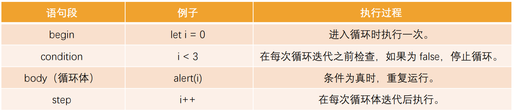
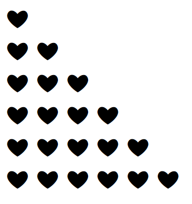
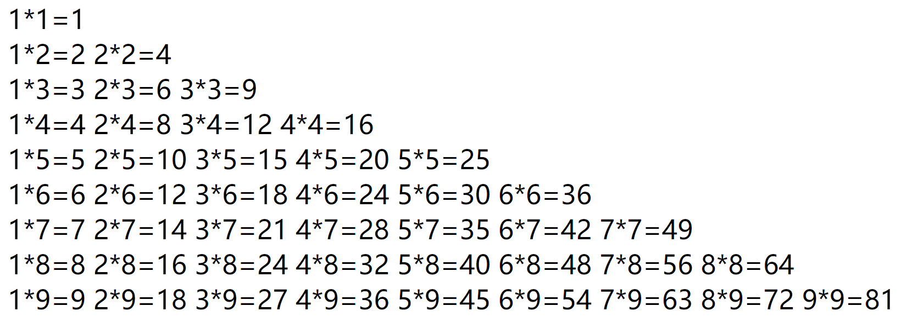

## 认识循环

在开发中我们经常需要做各种各样的循环操作：

- 比如把一个列表中的商品、歌曲、视频依次输出进行展示
- 比如对一个列表进行累加计算
- 比如运行相同的代码将数字 1 到 10 逐个输出

循环 是一种重复运行同一代码的方法

如果是对某一个列表进行循环操作，我们通常也会称之为 遍历（traversal）或者迭代（iteration）

在 JavaScript 中支持三种循环方式：

- while 循环
- do..while 循环
- for 循环

## while 循环

while 循环的语法如下：

- 当条件成立时，执行代码块；
- 当条件不成立时，跳出代码块；

如果条件一直成立（为 true），那么会产生死循环

- 这个时候必须通过关闭页面来停止死循环
- 开发中一定要避免死循环的产生

```js
// 死循环
while (true) {
  console.log("Hello World");
  console.log("Hello Coderwhy");
}
```

## while 循环的练习

练习一：打印 10 次 Hello World

```js
var count = 0;
while (count < 10) {
  console.log("Hello World:", count);
  count++; // 10
}
```

练习二：打印 0~99 的数字

```js
var count = 0;
while (count < 100) {
  console.log(count);
  count++;
}
```

练习三：计算 0~99 的数字和

```js
var count = 0;
var totalCount = 0;
while (count < 100) {
  totalCount += count;
  count++;
}
console.log("totalCount:", totalCount);
```

练习四：计算 0~99 所有奇数的和

```js
var count = 0;
var totalCount = 0;
while (count < 100) {
  if (count % 2 !== 0) {
    totalCount += count;
  }
  count++;
}

console.log("所有的奇数和:", totalCount);
```

练习五：计算 0~99 所有偶数的和

```js
var count = 0;
var totalCount = 0;
while (count < 100) {
  if (count % 2 === 0) {
    totalCount += count;
  }
  count++;
}

console.log("所有的偶数和:", totalCount);
```

```js
// 算法优化
var count = 0;
var totalCount = 0;
while (count < 100) {
  totalCount += count;
  count += 2;
}

console.log("所有的偶数和:", totalCount);
```

## do..while 循环

do..while 循环和 while 循环非常像，二者经常可以相互替代(不常用)

```js
// do..while语法结构
do {
  // 循环代码块
} while (条件);
```

但是 do..while 的特点是不管条件成不成立，do 循环体都会先执行一次

通常我们更倾向于使用 while 循环

```js
// 练习一: 打印10次Hello World
var count = 0;
do {
  console.log("Hello World");
  count++;
} while (count < 10);

// 练习二: 计算0~99的数字和
var count = 0;
var totalCount = 0;
do {
  totalCount += count;
  count++;
} while (count < 100);
console.log("totalCount:", totalCount);
```

## for 循环

for 循环更加复杂，但它是最常使用的循环形式

```js
for (begin; condition; step) {
  // 循环代码快
}
```



begin 执行一次，然后进行迭代：每次检查 condition 后，执行 body 和 step

```js
/*
      1.首先, 会先执行var count = 0;
      2.根据条件执行代码
        * count < 3
        * alert(count) // 0 1 2
        * count++
*/
for (var count = 0; count < 3; count++) {
  alert(count);
}
```

## for 循环的练习

练习一：打印 10 次 Hello World

```js
for (var i = 0; i < 10; i++) {
  console.log("Hello World");
}
```

练习二：打印 0~99 的数字

```js
for (var i = 0; i < 100; i++) {
  console.log(i);
}
```

练习三：计算 0~99 的数字和

```js
var totalCount = 0;
for (var i = 0; i < 100; i++) {
  totalCount += i;
}
console.log("totalCount:", totalCount);
```

练习四：计算 0~99 所有奇数的和

```js
var totalCount = 0;
for (var i = 0; i < 100; i++) {
  if (i % 2 !== 0) {
    totalCount += i;
  }
}
console.log("totalCount:", totalCount);
```

练习五：计算 0~99 所有偶数的和

```js
var totalCount = 0;
for (var i = 1; i < 100; i += 2) {
  totalCount += i;
}
console.log("totalCount:", totalCount);
```

## for 循环的嵌套

什么是循环的嵌套呢？（日常开发使用不算多，在一些算法中比较常见）

在开发中，某些情况下一次循环是无法达到目的的，我们需要循环中嵌套循环

```js
<style>
    div {
        color: red;
    }
</style>

// for循环的嵌套: 循环中执行体, 里面又嵌套了循环
for (var i = 0; i < 10; i++) {

    console.log("i开始执行:", i)

    for (var j = 0; j < 3; j++) {
        console.log("执行j循环")
    }

    console.log("i结束执行:", i)
}
```

我们通过 for 循环的嵌套来完成一些案例：

案例一：在屏幕上显示包含很多 ❤ 的矩形

```js
// 案例一:
for (var i = 0; i < 9; i++) {
  document.write("<div>");

  for (var m = 0; m < 10; m++) {
    document.write("❤ ");
  }

  document.write("</div>");
}
// 会生成一个9行10列的爱心
```


案例二：在屏幕上显示一个三角的 ❤ 图像

```js
for (var i = 0; i < 6; i++) {
  document.write("<div>");

  for (var m = 0; m < i + 1; m++) {
    document.write("❤ ");
  }

  document.write("</div>");
}
```



案例三：在屏幕上显示一个九九乘法表

```js
for (var i = 0; i < 9; i++) {
  document.write("<div>");

  for (var m = 0; m < i + 1; m++) {
    var a = m + 1;
    var b = i + 1;
    var result = (m + 1) * (i + 1);
    // document.write(`${a}*${b}=${result} `)
    document.write(a + "*" + b + "=" + result + " ");
  }

  document.write("</div>");
}
```



## 循环控制

循环的跳转（控制）：

- 在执行循环过程中, 遇到某一个条件时, 我们可能想要做一些事情
- 比如循环体不再执行(即使没有执行完), 跳出循环
- 比如本次循环体不再执行, 执行下一次的循环体

循环的跳转控制

break: 直接跳出循环, 循环结束

- break 某一条件满足时，退出循环，不再执行后续重复的代码

```js
var names = ["abc", "cba", "nba", "mba", "bba", "aaa", "bbb"];

// 循环遍历数组
// break关键字的使用
// 需求: 遇到nba时, 不再执行后续的迭代
for (var i = 0; i < 4; i++) {
  console.log(names[i]); // abc cba nba
  if (names[i] === "nba") {
    break;
  }
}
```

continue: 跳过本次循环次, 执行下一次循环体

- continue 指令是 break 的“轻量版”
- continue 某一条件满足时，不执行后续重复的代码

```js
var names = ["abc", "cba", "nba", "mba", "bba", "aaa", "bbb"];

// continue关键字的使用: 立刻结束本次循环, 执行下一次循环(step)
// 需求: 不打印nba
for (var i = 0; i < 7; i++) {
  if (names[i] === "nba" || names[i] === "cba") {
    continue;
  }
  console.log(names[i]); // 除了nba和cba，其他都打印了
}
```

## 猜数字游戏

随机生成数字

```js
// Math.random(): [0, 1)
for (var i = 0; i < 1000; i++) {
  var randomNum = Math.random() * 100; // 99
  randomNum = Math.floor(randomNum); // 向下取整
  console.log(randomNum);
}

// 生成一个0~99的随机数
var randomNum = Math.floor(Math.random() * 100);
```

玩家有 3 次机会猜测数字

```js
// 1.随机生成一个0~99的数字
var randomNum = Math.floor(Math.random() * 100);
// 2.玩家有3次机会猜测数字
var count = 3;
for (var i = 0; i < count; i++) {
  // 获取用户的输入
  var inputNum = Number(prompt("请输入您猜测的数字:"));

  // 和randomNum进行比较
  if (inputNum === randomNum) {
    alert("恭喜您, 猜对了");
  } else if (inputNum > randomNum) {
    alert("您猜大了");
  } else {
    alert("您猜小了");
  }

  if (i === count - 1) {
    alert("您的次数已经用完了");
  }
}
```

## 循环的总结

我们学习了三种循环：

- while —— 每次迭代之前都要检查条件
- do..while —— 每次迭代后都要检查条件
- for (;;) —— 每次迭代之前都要检查条件，可以使用其他设置

break/continue 可以对循环进行控制
