## 程序中的 foo、bar、baz

在学习编程的过程中，你可能会经常看到 foo、bar、baz 这些名词：

- 它们通常被用来作为函数、变量、文件的名词
- 目前已经变成了计算机编程的术语一部分
- 但是它们本身并没有特别的用途和意义
- 常被称之为 “伪变量”

那么它们有什么由来吗？

- 事实上，foo、bar 这些名词最早从什么时候、地方流行起来的一直是有争论的
- 一种说法是通过 Digital（迪吉多，数字设备公司，成立于 1957 年的美国电脑公司）的手册说明流行起来的
- 一种说法是说源自于电子学中的反转 foo 信号
- 也有一种说法是 foo 因为出现在了一个漫画中，漫画中 foo 代表“好运”，与中文的福读音类似

总之，foo、bar、baz 已经是编程领域非常常用的名词

## 认识函数

什么是函数呢?

目前, 我们已经接触过几个函数了

- alert 函数：浏览器弹出一个弹窗
- prompt 函数：在浏览器弹窗中接收用户的输入
- console.log 函数：在控制台输入内容
- String/Number/Boolean 函数等

当我们在谈函数时, 到底在谈些什么?

- 函数其实就是某段代码的封装，这段代码帮助我们完成某一个功能
- 默认情况下 JavaScript 引擎或者浏览器会给我们提供一些已经实现好的函数
- 我们也可以编写属于自己的函数

## 函数使用的步骤

函数的使用包含两个步骤：

- 声明函数 —— 封装 独立的功能
- 调用函数 —— 享受 封装 的成果

声明函数，在 JavaScript 中也可以称为定义函数：

- 声明函数的过程是对某些功能的封装过程
- 在之后的开发中，我们会根据自己的需求定义很多自己的函数

调用函数，也可以称为函数调用：

- 调用函数是让已存在的函数为我们所用
- 这些函数可以是刚刚自己封装好的某个功能函数
- 当然, 我们也可以去使用默认提供的或者其他三方库定义好的函数

函数的作用：

- 在开发程序时，使用函数可以提高编写的效率以及代码的重用

## 声明和调用函数

声明函数使用 function 关键字：这种写法称之为函数的定义

```js
function 函数名(){
    函数封装的代码
    ……
}
```

注意：

- 函数名的命名规则和前面变量名的命名规则是相同的
- 函数要尽量做到见名知意（并且函数通常是一些行为（action），所以使用动词会更多一些）
- 函数定义完后里面的代码是不会执行的，函数必须调用才会执行

调用函数通过函数名()即可：比如 test()

```js
// 声明一个函数
// 制作好一个工具, 但是这个工具默认情况下是没有被使用
function sayHello() {
  console.log("Hello!");
  console.log("My name is Coderwhy!");
  console.log("how do you do!");
}

// 调用一个函数
sayHello();
// 函数可以在任何你想要使用的时候, 进行调用
sayHello();
```

函数练习：

```js
// 练习一: 定义一个函数, 打印自己的个人信息
function printInfo() {
  console.log("my name is why");
  console.log("age is 18");
  console.log("height is 1.88");
}

printInfo();
printInfo();

// 练习二: 定义一个函数, 在内部计算10和20的和
function sum() {
  var num1 = 10;
  var num2 = 20;
  var result = num1 + num2;
  console.log("result:", result);
}
sum();
```

## 函数的参数

函数的参数:

- 函数，把 具有独立功能的代码块 组织为一个小模块，在需要的时候 调用
- 函数的参数，增加函数的 通用性，针对 相同的数据处理逻辑，能够 适应更多的数据
  - 在函数 内部，把参数当做 变量 使用，进行需要的数据处理
  - 函数调用时，按照函数定义的参数顺序，把 希望在函数内部处理的数据，通过参数 传递

形参和实参

- 形参（参数 parameter）：定义 函数时，小括号中的参数，是用来接收参数用的，在函数内部 作为变量使用
- 实参（参数 argument）：调用 函数时，小括号中的参数，是用来把数据传递到 函数内部 用的

```js
// name/age/height称之为函数的参数(形参, 形式参数, parmaters)
function printInfo(name, age, height) {
  console.log(`my name is ${name}`);
  console.log(`age is ${age}`);
  console.log(`height is ${height}`);
}

// why/18/1.88称之为函数的参数(实参, 实际参数, arguments)
printInfo("why", 18, 1.88);
printInfo("kobe", 30, 1.98);
```

## 有参数的函数练习

一个参数的函数练习：

练习一：传入一个名字，对这个人 say Hello

```js
function sayHello(name) {
  console.log(`Hello ${name}`);
}

sayHello("Kobe");
sayHello("James");
sayHello("Curry");
```

练习二：为某个朋友唱生日快乐歌

```js
// 练习二: 给某人唱生日歌
function singBirthdaySong(name) {
  console.log("happy birthday to you");
  console.log("happy birthday to you");
  console.log(`happy birthday to ${name}`);
  console.log("happy birthday to you");
}

singBirthdaySong("Kobe");
singBirthdaySong("Why");
```

两个参数的函数练习：

练习三：传入两个数字，计算两个数字的和，并且打印结果

```js
function sum(num1, num2) {
  var result = num1 + num2;
  console.log("result:", result);
}

sum(20, 30);
sum(123, 321);
```

## 函数的返回值

回想我们之前使用的 prompt 函数，函数需要接受参数，并且会返回用户的输入

所以说, 函数不仅仅可以有参数, 也可以有返回值

- 使用 return 关键字来返回结果
- 一旦在函数中执行 return 操作，那么当前函数会终止
- 如果函数中没有使用 return 语句 ，那么函数有默认的返回值：undefined
- 如果函数使用 return 语句，但是 return 后面没有任何值，那么函数的返回值也是：undefined

```js
// 1.理解函数的返回值
function sayHello(name) {
  console.log(`Hi ${name}`);
}

var foo = sayHello("Kobe");
console.log("foo:", foo); // undefined

// 2.返回值的注意事项
// 注意事项一: 所有的函数, 如果没有写返回值, 那么默认返回undefined
function foo() {
  console.log("foo函数被执行~");
}

var result = foo();
console.log("foo的返回值:", result); // undefined

// 注意事项二: 我们也可以明确的写上return
// 写上return关键字, 但是后面什么内容都没有的时候, 也是返回undefined
function bar() {
  console.log("bar函数被执行~");
  return;
}
var result = bar();
console.log("bar的返回值:", result); // undefined

// 注意事项三: 如果在函数执行到return关键字时, 函数会立即停止执行, 退出函数
function baz() {
  console.log("Hello Baz");
  return;
  console.log("Hello World");
  console.log("Hello Why");
}

baz(); // Hello Baz

// 函数的具体返回值
function sum(num1, num2) {
  var result = num1 + num2;
  return result;
}

var total = sum(20, 30);
console.log("total:", total); // 50
```

## 函数的练习

练习一：实现一个加法计算器

参考上面

练习二：定义一个函数，传入宽高，计算矩形区域的面积

```js
// 练习二: 传入宽高, 返回面积
function getRectangleArea(width, height) {
  // var area = width * height
  // return area
  return width * height;
}

var area1 = getRectangleArea(20, 30);
var area2 = getRectangleArea(50, 66);
console.log("area1:", area1);
console.log("area2:", area2);
```

练习三：定义一个函数，传入半径，计算圆形的面积

```js
// 练习三: 传入半径radius, 计算圆形的面积
function getCircleArea(radius) {
  return Math.PI * radius * radius;
}
var area3 = getCircleArea(10);
var area4 = getCircleArea(25);
console.log("area3:", area3);
console.log("area4:", area4);
```

练习四：定义一个函数，传入 n（n 为正整数），计算 1~n 数字的和

```js
function sumN(n) {
  // 1.加对n的判断
  if (n <= 0) {
    console.log(`您传入的${n}是有问题的`);
    return;
  }

  // 2.真正对1~n的数字进行计算
  // 1~n的数字和
  // 1~5 1 2 3 4 5
  var total = 0;
  for (var i = 1; i <= n; i++) {
    total += i;
  }
  return total;
}

var result1 = sumN(5);
var result2 = sumN(10);
console.log(`result1: ${result1}, result2: ${result2}`);

var result3 = sumN(-10);
console.log("result3:", result3);
```

实战函数练习：

- 传入一个数字，可以根据数字转化成显示为 亿、万文字显示的文本

```js
// 从服务器拿到很多的数字
var playCount1 = 13687; // 13687
var playCount2 = 5433322; // 543万
var playCount3 = 8766633333; // 87亿

// 封装一个工具函数: 对数字进行格式化
// 10_0000_0000就是1000000000语法糖
// 语法糖的概念: 一种简写或者特殊的写法, 这种写法相对于原有的写法更加的方便或者阅读性更强
// 相比于原来的写法, 有一点点的甜头, 称之为语法糖
function formatCount(count) {
  var result = 0;
  if (count >= 10_0000_0000) {
    // 超过10_0000_0000值进行转换
    result = Math.floor(count / 1_0000_0000) + "亿";
  } else if (count >= 10_0000) {
    result = Math.floor(count / 1_0000) + "万";
  } else {
    result = count;
  }

  return result;
}

console.log(formatCount(playCount1));
console.log(formatCount(playCount2));
console.log(formatCount(playCount3));
```

## arguments 参数（JS 高级再学习）

事实上在函数有一个特别的对象：arguments 对象

- 默认情况下，arguments 对象是所有（非箭头）函数中都可用的局部变量
- 该对象中存放着所有的调用者传入的参数，从 0 位置开始，依次存放
- arguments 变量的类型是一个 object 类型（ array-like ），不是一个数组，但是和数组的用法看起来很相似
- 如果调用者传入的参数多于函数接收的参数，可以通过 arguments 去获取所有的参数

因为这里涉及到数组、对象等概念，目前大家了解有这么一个参数即可

后续我们会对其专门进行学习，包括和数组之间的转化

```js
// 1.arguments的认识
function foo(name, age) {
  console.log("传入的参数", name, age); // why 18

  // 在函数中都存在一个变量, 叫arguments
  console.log(arguments); // Arguments(4)
  // arguments是一个对象
  console.log(typeof arguments); // object
  // 对象内部包含了所有传入的参数
  // console.log(arguments[0])
  // console.log(arguments[1])
  // console.log(arguments[2])
  // console.log(arguments[3])

  // 对arguments来进行遍历
  for (var i = 0; i < arguments.length; i++) {
    console.log(arguments[i]); // why 18 1.88 广州市
  }
}

foo("why", 18, 1.88, "广州市");

// 2.arguments的案例
function sum() {
  var total = 0;
  for (var i = 0; i < arguments.length; i++) {
    var num = arguments[i];
    total += num;
  }
  return total;
}

console.log(sum(10, 20)); // 30
console.log(sum(10, 20, 30)); // 60
console.log(sum(10, 20, 30, 40)); // 100
```

## 函数中调用函数

在开发中，函数内部是可以调用另外一个函数的

```js
function bar() {
  console.log("bar函数被执行了~");
  console.log("----------");
}

function foo() {
  // 浏览器默认提供给我们的其他函数
  console.log("foo函数执行");
  console.log("Hello World");
  // alert("Hello Coderwhy")

  // 调用自己定义的函数
  bar();

  // 其他代码
  console.log("other coding");
}

foo();
```

既然函数中可以调用另外一个函数，那么函数是否可以调用自己呢？

- 当然是可以的
- 但是函数调用自己必须有结束条件，否则会产生无限调用，造成报错

```js
var count = 0;
function bar() {
  console.log(count++);
  bar();
}
bar();
```

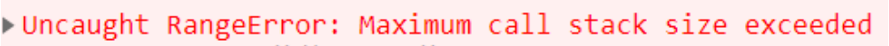

## 函数的递归

事实上，函数调用自己还有一个专业的名词，叫做递归（Recursion）

递归是一种重要的编程思想：

将一个复杂的任务，转化成可以重复执行的相同任务

案例：实现一个自己的幂函数 pow（pow 单词可以表示指数的意思）

```js
function pow1(x, n) {
  return x ** n;
}

console.log(pow1(2, 3)); // 8
console.log(pow1(3, 3)); // 27

console.log(Math.pow(2, 3)); // 8
console.log(Math.pow(3, 3)); // 27
```

```js
// 一. for循环实现方式
// x² = x * x
// x³ = x * x * x
function pow2(x, n) {
  var result = 1;
  for (var i = 0; i < n; i++) {
    result *= x;
  }
  return result;
}

console.log(pow2(2, 3));
console.log(pow2(3, 3));
```

## 递归的实现思路

另一种实现思路是递归实现：

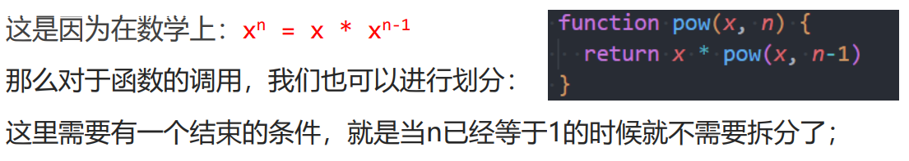

所以最终的代码如下：

```js
function pow(x, n) {
  if (n === 1) return x;
  return x * pow(n - 1);
}
```

斐波那契数列（了解即可）

```js
// 什么是斐波那契数列
// 数列: 1 1 2 3 5 8 13 21 34 55  ... x
// 位置: 1 2 3 4 5 6 7  8  9  10  ... n

// 1.斐波那契的递归实现
function fibonacci(n) {
  if (n === 1 || n === 2) return 1;
  return fibonacci(n - 1) + fibonacci(n - 2);
}

// 2.斐波那契的for循环实现
function fibonacci(n) {
  // 特殊的情况(前两个数字)
  if (n === 1 || n === 2) return 1;

  // for循环的实现
  var n1 = 1;
  var n2 = 1;
  var result = 0;
  for (var i = 3; i <= n; i++) {
    result = n1 + n2;
    n1 = n2;
    n2 = result;
  }
  return result;
}

console.log(fibonacci(5));
console.log(fibonacci(10));
console.log(fibonacci(20));
```

## 局部变量和外部变量

在 JavaScript（ES5 之前）中没有块级作用域的概念，但是函数可以定义自己的作用域

作用域（Scope）表示一些标识符的作用有效范围（所以也有被翻译为有效范围的）

函数的作用域表示在函数内部定义的变量，只有在函数内部可以被访问到

外部变量和局部变量的概念：

- 定义在函数内部的变量，被称之为局部变量（Local Variables）
- 定义在函数外部的变量，被称之为外部变量（Outer Variables）

什么是全局变量？

- 在函数之外声明的变量（在 script 中声明的），称之为全局变量
- 全局变量在任何函数中都是可见的
- 通过 var 声明的全局变量会在 window 对象上添加一个属性（了解）

在函数中，访问变量的顺序是什么呢？

优先访问自己函数中的变量，没有找到时，在外部中访问

关于块级作用域、作用域链、变量提升、AO、VO、GO 等概念我们后续将进行学习

```js
// 1.作用域的理解:message在哪一个范围内可以被使用, 称之为message的作用域(scope)
// 全局变量: 全局作用域
var message = "Hello World";
if (true) {
  console.log(message);
}
function foo() {
  console.log("在foo中访问", message);
}
foo();

// 2.ES5之前是没有块级作用域(var定义的变量是没有块级作用域)
{
  var count = 100;
  console.log("在代码块中访问count:", count);
}
console.log("在代码块外面访问count:", count);
// for循环的代码块也是没有自己的作用域
for (var i = 0; i < 3; i++) {
  var foo = "foo";
}
console.log("for循环外面访问foo:", foo);
console.log("for循环外面访问i:", i); // 3

// 3.ES5之前函数代码块是会形成自己的作用域
// 意味着在函数内部定义的变量外面是访问不到的
function test() {
  var bar = "bar";
}

test();
// console.log("test函数外面访问bar:", bar)

// 函数有自己的作用域: 函数内部定义的变量只有函数内部能访问到
function sayHello() {
  var nickname = "kobe";
  console.log("sayHello函数的内部:", nickname);

  function hi() {
    console.log("hi function~");
    console.log("在hi函数中访问nickname:", nickname);
  }
  hi();
}
sayHello();
// console.log("sayHello外面访问nickname:", nickname)
```

```js
// 1.全局变量(global variable): 在全局(script元素中)定义一个变量, 那么这个变量是可以在定义之后的任何范围内被访问到的, 那么这个变量就称之为是一个全局变量.
var message = "Hello World";

// 在函数中访问message
function sayHello() {
  // 外部变量(outer variable): 在函数内部去访问函数之外的变量, 访问的变量称之为外部变量
  console.log("sayHello中访问message:", message);

  // 2.局部变量(local variable): 在函数内部定义的变量, 只有在函数内部才能进行访问, 称之为局部变量
  var nickname = "coderwhy";

  function hi() {
    console.log("hi function~");
    // message也是一个外部变量
    console.log("hi中访问message:", message);
    // nickname也是一个外部变量
    console.log("hi中访问nickname:", nickname);
  }
  hi();
}

sayHello();
```

```js
// 变量的访问顺序
var message = "Hello World";

function sayHello() {
  var message = "Hello Coderwhy";

  function hi() {
    var message = "Hi Kobe";
    console.log(message); // Hi Kobe
  }
  hi();
}

sayHello();
```

## 函数表达式（Function Expressions）

在 JavaScript 中，函数并不是一种神奇的语法结构，而是一种特殊的值

前面定义函数的方式，我们称之为函数的声明（Function Declaration）

还有另外一种写法是函数表达式（Function Expressions）：

```js
var bar = function () {
  console.log("bar函数被执行了~");
};
```

注意，function 关键字后面没有函数名

函数表达式允许省略函数名

无论函数是如何创建的，函数都是一个值（这个值的类型是一个对象，对象的概念后面会讲到）

在 JavaScript 开发中，我们可以将函数作为头等公民

## 函数声明 vs 函数表达式

在开发中，函数的声明和函数表达式有什么区别，以及如何选择呢？

首先，语法不同：

- 函数声明：在主代码流中声明为单独的语句的函数
- 函数表达式：在一个表达式中或另一个语法结构中创建的函数

其次，JavaScript 创建函数的时机是不同的：

- 函数表达式是在代码执行到达时被创建，并且仅从那一刻起可用
- 在函数声明被定义之前，它就可以被调用
  - 这是内部算法的原故
  - 当 JavaScript 准备 运行脚本时，首先会在脚本中寻找全局函数声明，并创建这些函数

开发中如何选择呢？

- 当我们需要声明一个函数时，首先考虑函数声明语法
- 它能够为组织代码提供更多的灵活性，因为我们可以在声明这些函数之前调用这些函数

## JavaScript 头等函数

头等函数（first-class function；第一级函数）是指在程序设计语言中，函数被当作头等公民

- 这意味着，函数可以作为别的函数的参数、函数的返回值，赋值给变量或存储在数据结构中
- 有人主张也应包括支持匿名函数（待会儿会讲到）

通常我们对作为头等公民的编程方式，称之为函数式编程

JavaScript 就是符合函数式编程的语言，这个也是 JavaScript 的一大特点

比如：函数可以在变量和变量之间相互进行赋值

```js
// 函数作为一等(头等)公民
// 1.函数可以被赋值给变量(函数表达式写法)
var foo1 = function () {
  console.log("foo1函数被执行~");
};
// foo1()

// 2.让函数在变量之间来回传递
var foo2 = foo1;
foo2();

// 3.函数可以作为另外一个函数的参数
function bar(fn) {
  console.log("fn:", fn);
  fn();
}
bar(foo1);

// 4.函数作为另外一个函数的返回值
function sayHello() {
  function hi() {
    console.log("hi kobe");
  }
  return hi;
}

var fn = sayHello();
fn();

// 5.将函数存储在另外一个数据结构中
var obj = {
  name: "why",
  eating: function () {
    console.log("eating");
  },
};
obj.eating();
function bar1() {
  console.log("bar1函数被执行~");
}
function bar2() {
  console.log("bar2函数被执行~");
}
function bar3() {
  console.log("bar3函数被执行~");
}
// 事件总线的封装
var fns = [bar1, bar2, bar3];

// 函数式编程: 使用函数来作为头等公民使用函数, 这种编程方式(范式).
// JavaScript支持函数式编程
```

## 回调函数（Callback Function）

既然函数可以作为一个值相互赋值，那么也可以传递给另外一个函数

```js
function foo(fn) {
  // 通过fn去调用bar函数的过程, 称之为函数的回调
  fn();
}
function bar() {
  console.log("bar函数被执行了~");
}
foo(bar);
```

foo 这种函数我们也可以称之为高阶函数（Higher-order function）

高阶函数必须至少满足两个条件之一：

- 接受一个或多个函数作为输入
- 输出一个函数

匿名（anonymous）函数的理解：

如果在传入一个函数时，我们没有指定这个函数的名词或者通过函数表达式指定函数对应的变量，那么这个函数称之为匿名 函数

```js
function request(url, callback) {
  console.log("根据URL向服务器发送网络请求");
  console.log("需要花费比较长的时间拿到对应的结果");
  var list = ["javascript", "javascript学习", "JavaScript高级编程"];
  callback(list);
}

function handleResult(res) {
  console.log("在handleResult中拿到结果:", res);
}
request("url", handleResult);
```

```js
// 3.函数回调的案例重构
function request(url, callback) {
  console.log("根据URL向服务器发送网络请求");
  console.log("需要花费比较长的时间拿到对应的结果");
  var list = ["javascript", "javascript学习", "JavaScript高级编程"];
  callback(list);
}

// 传入的函数是没有名字, 匿名函数
request("url", function (res) {
  console.log("在handleResult中拿到结果:", res);
});
```

## 立即执行函数

什么是立即执行函数?

专业名字：Immediately-Invoked Function Expression（IIFE 立即调用函数表达式）

表达的含义是一个函数定义完后被立即执行

- 第一部分是定义了一个匿名函数，这个函数有自己独立的作用域
- 第二部分是后面的（），表示这个函数被执行了

这个东西有什么用？

会创建一个独立的执行上下文环境，可以避免外界访问或修改内部的变量，也避免了对内部变量的修改

```js
// 1.普通函数的使用过程
function foo() {
  console.log("foo函数被执行~");
}
foo();
foo(); // ()[]{}

// 2.定义函数, 定义完这个函数之后, 会要求这个函数立即被执行
// {} 代码块/对象类型
// () 控制优先级(2+3)*5/函数的调用/函数的参数
// [] 定义数组/从数组-对象中取值/对象的计算属性
// 立即执行函数(常用的写法)
(function () {
  console.log("立即执行函数被调用~");
})();

// 3.立即执行函数的参数和返回值
var result = (function (name) {
  console.log("函数立刻被执行~", name); // why
  return "Hello World";
})("why");
console.log(result); // Hello World
```

立即执行函数的应用一：防止全局变量的命名冲突

```js
<script src="./js/xiaoming.js"></script>
<script src="./js/lilei.js"></script>
<script src="./js/xm_util.js"></script>

<script>
    // 应用场景一: 防止全局变量的命名冲突

    // 立即执行函数和普通的代码有什么区别?
    // 在立即执行函数中定义的变量是有自己的作用域的
    (function() {
        var message = "Hello World"
        console.log(message) // Hello World
    })()
    console.log(message) // undefined
    var message = "Hello World"
    console.log(message) // Hello World
</script>
```

js/xiaoming.js

```js
var xmModule = (function () {
  var xmModule = {};

  var message = "Hello XiaoMing";
  console.log(message); // Hello XiaoMing
  console.log(message.length); // 14

  xmModule.message = message;
  return xmModule;
})();
```

js/lilei.js

```js
(function () {
  var message = "Hello LiLei";
  console.log(message); // Hello LiLei
})();
```

js/xm_util.js

```js
(function () {
  console.log(xmModule.message); // Hello XiaoMing
})();
```

立即执行函数的应用二：

```js
<button class="btn">按钮1</button>
<button class="btn">按钮2</button>
<button class="btn">按钮3</button>
<button class="btn">按钮4</button>

// 1.获取一个按钮监听点击
// 1.拿到html元素
var btnEl = document.querySelector(".btn")
console.log(btnEl)
// 2.监听对应按钮的点击
btnEl.onclick = function() {
    console.log("点击了按钮1")
}

// 2.获取所有的按钮监听点击
// 没有使用立即执行函数
var btnEls = document.querySelectorAll(".btn")
for (var i = 0; i < btnEls.length; i++) {
    var btn = btnEls[i];
    // 只有当点击按钮才会触发，但是在此之前i已经循环遍历结束变成了4
    btn.onclick = function() {
        console.log(`按钮${i+1}发生了点击`) // 最终4个按钮都是，按钮5发送了点击
    }
}

// 使用立即执行函数
var btnEls = document.querySelectorAll(".btn")
// var i 这里的i是全局变量
for (var i = 0; i < btnEls.length; i++) {
    var btn = btnEls[i];
    (function(m) { // i传给m，形成自己的作用域
        btn.onclick = function() {
            // 会打印按钮1发生了点击 按钮2发生了点击 按钮3发生了点击 按钮4发生了点击
            console.log(`按钮${m+1}发生了点击`)
        }
    })(i)
}

console.log(i) // 4
```

## 立即执行函数的其他写法

立即执行函数必须是一个表达式（整体），不能是函数声明（了解即可）

下面的这种写法会报错，因为是一个函数声明，不是一个函数表达式

当圆括号出现在匿名函数的末尾想要调用函数时，它会默认将函数当成是函数声明

```js
// 会报错
function foo() {
}()
```

当圆括号包裹函数时，它会默认将函数作为表达式去解析，而不是函数声明

下面是一个函数表达式，所以可以执行

```js
(function (fn) {
  console.log("立即执行函数被调用");
})();
```

## Chrome 的 debug 调试技巧

终极技巧：debug

代码出问题的时候，产生 bug，debug 找出 bug

首先，在浏览器运行以下代码

```js
<script>

    function foo(name) {
    console.log("foo函数执行：",name)
}

function bar(){
    console.log("bar函数执行~");
    foo()
}

bar()

for (var i = 0; i < 10; i++){
    console.log(i);
}

</script>
```

如果希望运行到某一行代码停住，打开控制台，找到 Sources，比如想在 22 行停住，点击 22，就会在这个地方打断点，代码就不会继续往下执行，此时控制台不会打印任何东西，再点击一下 22 可以删掉断点

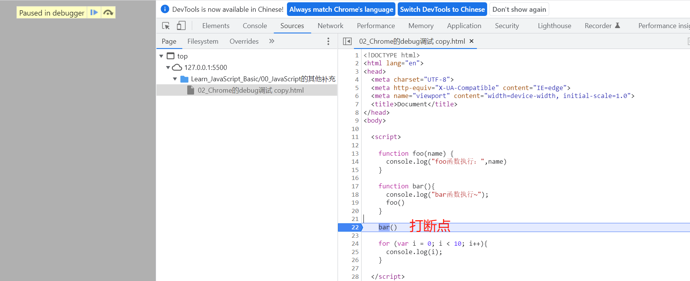

如果在浏览器这边不是很好找某行代码，也可以在编译器中给需要打断点的地方的上一行，加一个 debugger

```js
function foo(name) {
  console.log("foo函数执行：", name);
}

function bar() {
  console.log("bar函数执行~");
  foo();
}
// 这里加个断点，效果和上面是一样的
debugger;
bar();

for (var i = 0; i < 10; i++) {
  console.log(i);
}
```

接下来，介绍下右边区域

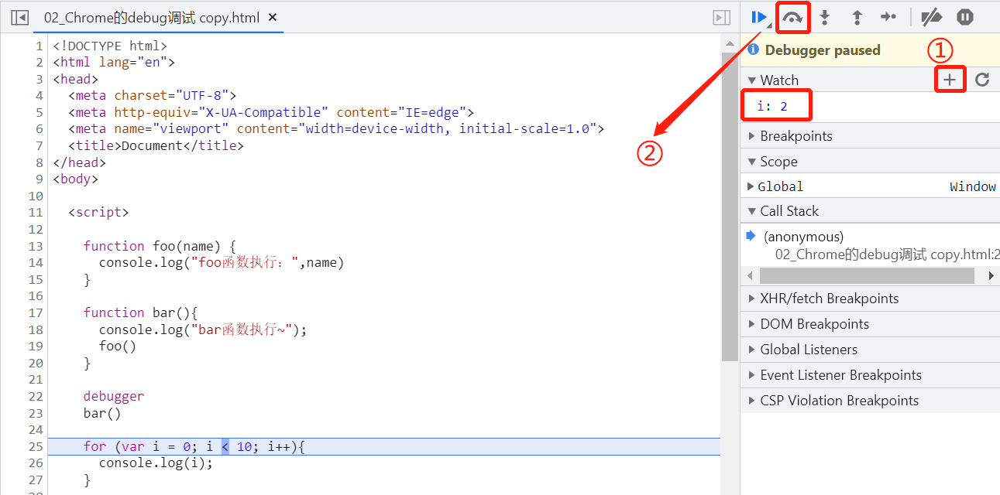

Watch 是用来监听变量的变化过程，可以点击 ① 按钮添加一个变量，然后点击 ② 按钮，执行下一行代码，就可以监听 i 的变化过程

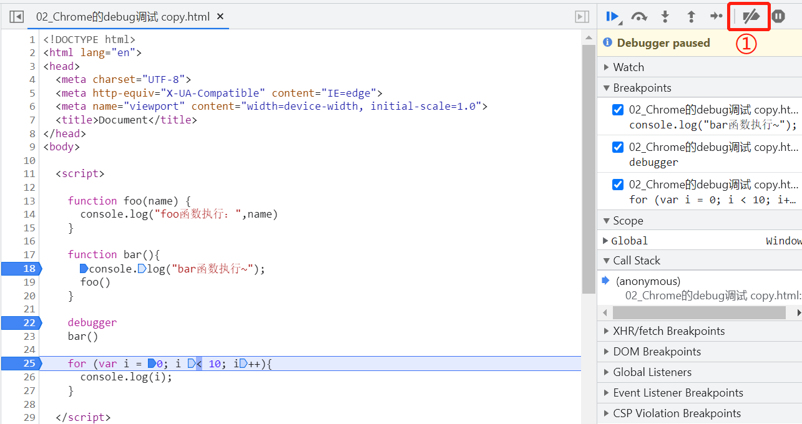

Breakpoints 是可以看到所有的断点，去掉勾选可以删除断点，也可以在左边直接点掉，点击按钮 ① 可以删除所有断点

第 3 个 Scope 是作用域，为了看到效果，将代码改造一下

```js
function foo(name) {
  console.log("foo函数执行：", name);
}

function bar() {
  console.log("bar函数执行~");

  var name = "kobe";
  // 增加了这个函数，并返回
  function hi() {
    console.log("hi ", name);
  }
  foo();
  return hi;
}

debugger;
var fn = bar();
fn();

for (var i = 0; i < 10; i++) {
  console.log(i);
}
```

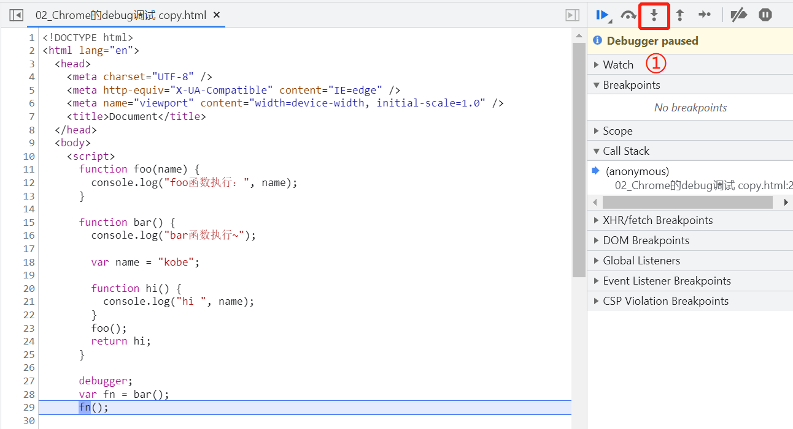

一直点击执行下一行代码，来到 fn()，点击上面的按钮 ① 可以进去查看这个函数，在右边就可以看到作用域

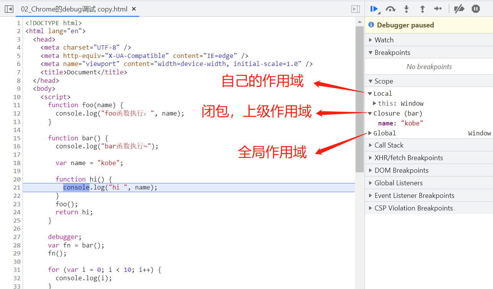

Call Stack 是函数调用栈，会显示函数在哪里被调用以及什么时候调用，后面再讲

再来看下右边区域上面的几个按钮

首先，左边的两个按钮和右边是一样的

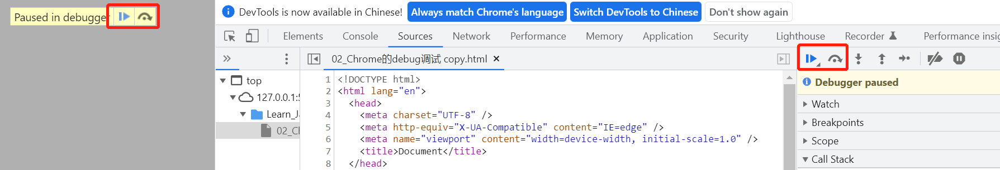

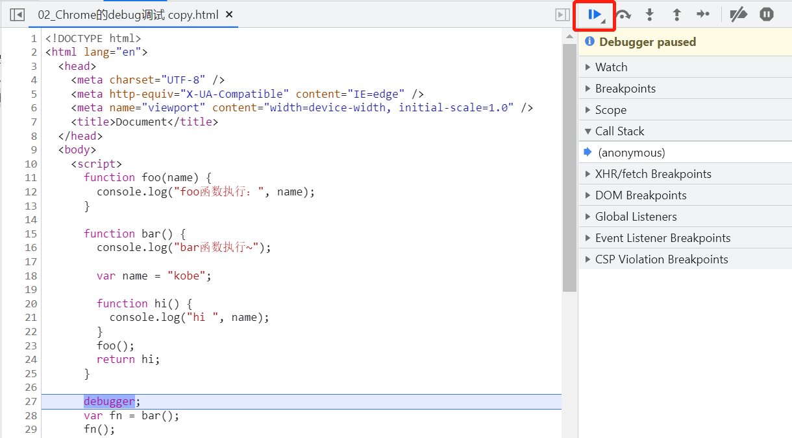

上面这个断点是恢复当前的断点，如果还有其他断点，会继续其他的断点，比如下面这种情况还有 2 个断点，点击恢复，会去下一个断点

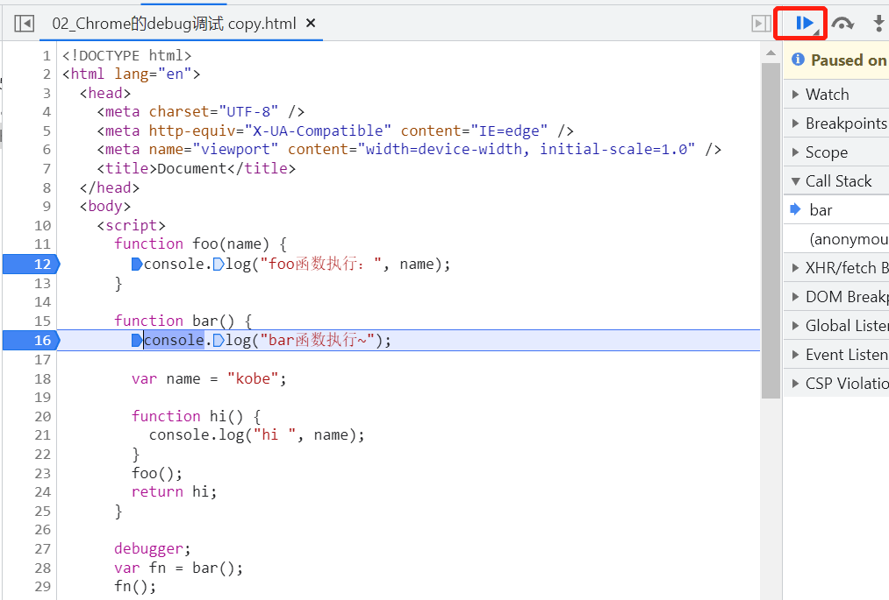

后面的几个按钮，第 2 个表示执行下一步代码，第 3 个表示进入到函数，第 4 个表示退出函数

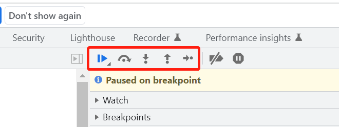

第 5 个按钮和第 3 个按钮差不多，不过有点区别，就是当遇到异步函数的时候，比如 setTimeout，第 5 个按钮会直接跳过去，因为 setTimeout 是浏览器内置的函数无法访问，但是第 3 个按钮，会等异步时间结束会跳到异步函数里面的代码

```js
function foo(name) {
  console.log("foo函数执行:", name);
}

function bar() {
  console.log("bar函数执行~");
  var name = "kobe";

  function hi() {
    console.log("hi " + name);
  }

  foo();
  return hi;
}

// debugger标识符就是在代码中打断点方式
debugger;
var fn = bar();
fn();

// setTimeout(fn, duration)
// fn可以传入一个匿名函数
// setTimeout 高阶函数
// 浏览器内部会在duration时间之后, 主动的调用传入fn, fn的回调
setTimeout(function () {
  console.log("匿名函数2秒后执行~");
}, 2000);

for (var i = 0; i < 10; i++) {
  console.log(i);
}
```

为了看到效果，加个 setTimeout，可以看到第三个按钮，等待 2 秒之后会进入 setTimeout 中的代码

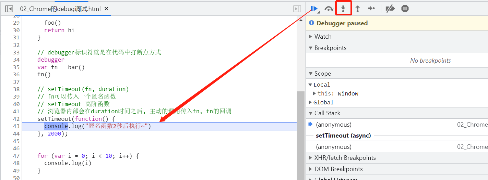

而点击第五个按钮会直接跳过 setTimeout

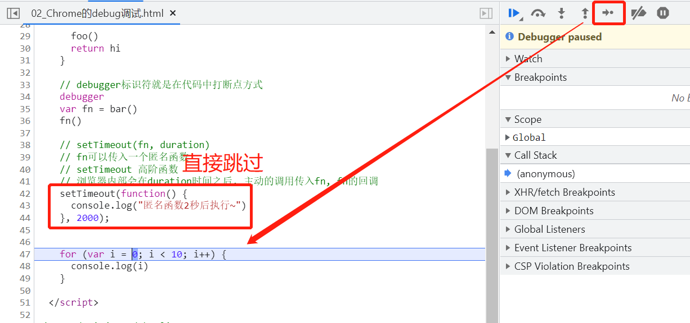

使用场景：

如果代码一眼就能看到错误或者可以通过 console.log 找到 bug，那么就不需要用到断点调试

如果想看到完整的执行流程，并且每个变量是如何变化的，就可以用到断点调试
