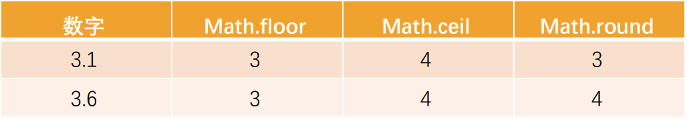
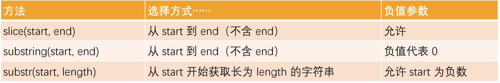

## 原始类型的包装类

JavaScript 的原始类型并非对象类型，所以从理论上来说，它们是没有办法获取属性或者调用方法的

但是，在开发中会看到，我们会经常这样操作：

```js
var message = "Hello World";
var words = message.split(" ");
var length = message.length;

var num = 2.54432;
num = num.toFixed(2);
```

那么，为什么会出现这样奇怪的现象呢？（悖论）

- 原始类型是简单的值，默认并不能调用属性和方法
- 这是因为 JavaScript 为了可以使其可以获取属性和调用方法，对其封装了对应的包装类型

常见的包装类型有：String、Number、Boolean、Symbol、BigInt 类型

```js
var name = "Hello World";
var height = 1.8888888;

// 在调用原始类型的属性或者方法时, 内部的操作 name = new String(name)
console.log(name.length);
console.log(name.split(" "));
console.log(height.toFixed(2));

// 原始类型默认也是可以手动的创建对象(没有必要这样来做)
var name1 = new String("Hello World");
console.log(typeof name, typeof name1);
```

## 包装类型的使用过程

默认情况，当我们调用一个原始类型的属性或者方法时，会进行如下操作：

- 根据原始值，创建一个原始类型对应的包装类型对象
- 调用对应的属性或者方法，返回一个新的值
- 创建的包装类对象被销毁
- 通常 JavaScript 引擎会进行很多的优化，它可以跳过创建包装类的过程在内部直接完成属性的获取或者方法的调用

我们也可以自己来创建一个包装类的对象：

name1 是字面量（literal）的创建方式，name2 是 new 创建对象的方式

```js
var name1 = "why";
var name2 = new String("why");
console.log(typeof name1); // string
console.log(typeof name2); // object
console.log(name1 === name2); // false
```

注意事项：null、undefined 没有任何的方法，也没有对应的“对象包装类”

## Number 类的补充

前面我们已经学习了 Number 类型，它有一个对应的数字包装类型 Number，我们来对它的方法做一些补充

Number 属性补充：

- Number.MAX_SAFE_INTEGER：JavaScript 中最大的安全整数 (2^53 - 1)
- Number.MIN_SAFE_INTEGER：JavaScript 中最小的安全整数 -(2^53 - 1)

Number 实例方法补充：

- 方法一：toString(base)，将数字转成字符串，并且按照 base 进制进行转化
  - base 的范围可以从 2 到 36，默认情况下是 10
  - 注意：如果是直接对一个数字操作，需要使用..运算符
- 方法二：toFixed(digits)，格式化一个数字，保留 digits 位的小数
- digits 的范围是 0 到 20（包含）之间

Number 类方法补充：

- 方法一：Number.parseInt(string[, radix])，将字符串解析成整数，也有对应的全局方法 parseInt
- 方法二：Number. parseFloat(string)，将字符串解析成浮点数，也有对应的全局方法 parseFloat

更多 Number 的知识，可以查看 MDN 文档：

https://developer.mozilla.org/zh-CN/docs/Web/JavaScript/Reference/Global_Objects/Number

```js
// 类属性
// Number中本身是有自己的属性
console.log(Number.MAX_VALUE); // 1.7976931348623157e+308
console.log(Number.MIN_VALUE); // 5e-324
// integer: 整数
console.log(Number.MAX_SAFE_INTEGER); // 9007199254740991
console.log(Number.MIN_SAFE_INTEGER); // -9007199254740991

// 对象的方法
// toString(base)
var num = 1000;
console.log(num.toString(), typeof num.toString()); // 1000 string
console.log(num.toString(2)); // 1111101000
console.log(num.toString(8)); // 1750
console.log(num.toString(16)); // 3e8

console.log((123).toString(2)); // 1111011

// toFixed的使用(重要)
var pi = 3.1415926;
console.log(pi.toFixed(3)); // 3.142

// 类的方法
// parseInt
// parseFloat
// 整数: 123
// 浮点数: 小数 123.321
var num1 = "123.521";
console.log(Number(num1).toFixed(0)); // 124
console.log(Number.parseInt(num1)); // 123
console.log(Number.parseFloat(num1)); // 123.521

// window对象上面
console.log(parseInt(num1)); // 123
console.log(parseFloat(num1)); // 123.521

console.log(parseInt === Number.parseInt); // true
```

## Math 对象

在除了 Number 类可以对数字进行处理之外，JavaScript 还提供了一个 Math 对象

- Math 是一个内置对象（不是一个构造函数），它拥有一些数学常数属性和数学函数方法

Math 常见的属性：

- Math.PI：圆周率，约等于 3.14159

Math 常见的方法：

- Math.floor：向下舍入取整
- Math.ceil：向上舍入取整
- Math.round：四舍五入取整
- Math.random：生成 0~1 的随机数（包含 0，不包含 1）
- Math.pow(x, y)：返回 x 的 y 次幂



Math 中还有很多其他数学相关的方法，可以查看 MDN 文档：

https://developer.mozilla.org/zh-CN/docs/Web/JavaScript/Reference/Global_Objects/Math

```js
console.log(typeof Number); // function
var num = new Number();

// Math -> 对象
// window/obj/console
console.log(typeof Math); // object
var math = new Math();

// Math对象的属性
console.log(Math.PI);

// Math对象的方法
var num = 3.55;
console.log(Math.floor(num)); // 3
console.log(Math.ceil(num)); // 4
console.log(Math.round(num)); // 4

// 另外方法
// random: 随机生成 [0, 1)
console.log(Math.random());
// 需求: [5~50)的随机数
// [a, b)
// y = a
// x = b - a
// Math.floor(Math.random() * x) + y
for (var i = 0; i < 1000; i++) {
  var randomNum = Math.floor(Math.random() * 45) + 5;
  console.log(randomNum);
}

// Math.pow(x, y)
console.log(Math.pow(2, 4));
```

## String 类的补充（一）- 基本使用

在开发中，我们经常需要对字符串进行各种各样的操作，String 类提供给了我们对应的属性和方法

String 常见的属性：

- length：获取字符串的长度

String 也有很多常见的方法和操作，我们来进行学习

操作一：访问字符串的字符

- 使用方法一：通过字符串的索引 str[0]
- 使用方法二：通过 str.charAt(pos)方法
- 它们的区别是索引的方式没有找到会返回 undefined，而 charAt 没有找到会返回空字符串

练习：字符串的遍历

- 方式一：普通 for 循环
- 方式二：for..of 遍历

```js
var message = "Hello World";
// 1.属性: length
console.log(message.length);

// 2.访问字符串中某个位置的字符
console.log(message[4]); // o
console.log(message.charAt(4)); // o
console.log(message[20]); // undefined
console.log(message.charAt(20)); // ""

// 3.字符串的遍历
// for普通遍历
for (var i = 0; i < message.length; i++) {
  console.log(message[i]);
}

// for..of的遍历 -> 迭代器
// 目前可迭代对象: 字符串/数组
// 对象是不支持for..of
// String对象内部是将字符串变成了一个可迭代对象
for (var char of message) {
  console.log(char);
}
```

## String 类的补充（二） - 修改字符串

字符串的不可变性：

字符串在定义后是不可以修改的，所以下面的操作是没有任何意义的

```js
var message = "Hello World";
message[1] = "A";
console.log(message);
```

所以，在我们改变很多字符串的操作中，都是生成了一个新的字符串

- 比如改变字符串大小的两个方法
- toLowerCase()：将所有的字符转成小写
- toUpperCase() ：将所有的字符转成大写

```js
var message = "Hello World";

// 1.严格的修改字符串, 之前的字符串内部修改掉
message[2] = "a";
console.log(message); // Hello World

// String两个方法:(重要)
// toUpperCase: 将所有的字符变成大写
// toLowerCase: 将所有的字符变成小写

var message1 = message.toUpperCase();
console.log("message1:", message1);

var message2 = message.toLowerCase();
console.log(message2);
```

## String 类的补充（三） - 查找字符串

在开发中我们经常会在一个字符串中查找或者获取另外一个字符串，String 提供了如下方法：

方法一：查找字符串位置`str.indexOf(searchValue [,fromIndex])`

- 从 fromIndex 开始，查找 searchValue 的索引
- 如果没有找到，那么返回-1
- 有一个相似的方法，叫 lastIndexOf，从最后开始查找（用的较少）

方法二：是否包含字符串`str.includes(searchString [,position])`

- 从 position 位置开始查找 searchString， 根据情况返回 true 或 false
- 这是 ES6 新增的方法

```js
var message = "my name is why.";
var name = "why";

// 判断一个字符串中是否有另外一个字符串
// 1.indexOf(searchString, fromIndex)
/*
      index:
        情况一: 搜索到, 搜索字符串所在索引位置
        情况二: 没有搜索到, 返回-1
*/
var index = message.indexOf(name);
if (message.indexOf(name) !== -1) {
  console.log("message中包含name");
} else {
  console.log("message不包含name");
}

// 2.includes: ES6中新增一个方法, 就是用来判断包含关系
if (message.includes(name)) {
  console.log("message中包含name");
}
```

## String 类的补充（四）- 开头和结尾

方法三：以 xxx 开头`str.startsWith(searchString [,position])`

- 从 position 位置开始，判断字符串是否以 searchString 开头
- 这是 ES6 新增的方法，下面的方法也一样

方法四：以 xxx 结尾`str.endsWith(searchString [,position])`

- 在 length 长度内，判断字符串是否以 searchString 结尾

方法五：替换字符串`str.replace(regexp|substr, newSubStr|function)`

- 查找到对应的字符串，并且使用新的字符串进行替代
- 这里也可以传入一个正则表达式来查找，也可以传入一个函数来替换

```js
var message = "my name is why.";

// 3.startsWith: 是否以xxx开头
if (message.startsWith("my")) {
  console.log("message以my开头"); // 会打印
}

// 4.endsWith: 是否以xxx结束
if (message.endsWith("why")) {
  console.log("message以why结尾"); // 不会打印
}

// 5.replace 替换字符串
var newMessage = message.replace("why", "kobe");
console.log(message); // my name is why.
console.log(newMessage); // my name is kobe.
var newName = "kobe";
var newMessage = message.replace("why", function () {
  return newName.toUpperCase();
});
console.log(newMessage); // my name is KOBE.
```

## String 类的补充（五） - 获取子字符串

方法八：获取子字符串



开发中推荐使用 slice 方法

```js
var message = "Hello World";

// 获取子字符串
console.log(message.slice(3, 7));
console.log(message.slice(3, -1));
console.log(message.slice(3));

// substr
console.log(message.substr(3, 7));
```

## String 类的补充（六） - 其他方法

方法六：拼接字符串 `str.concat(str2, [, ...strN])`

方法七：删除首位空格 `str.trim()`

方法八：字符串分割 `str.split([separator[, limit]])`

- separator：以什么字符串进行分割，也可以是一个正则表达式
- limit：限制返回片段的数量

更多的字符串的补充内容，可以查看 MDN 的文档：

https://developer.mozilla.org/zh-CN/docs/Web/JavaScript/Reference/Global_Objects/String

```js
var str1 = "Hello";
var str2 = "World";
var str3 = "kobe";

// 1.字符串拼接
// +
// var newString = str1 + str2 + str3
// console.log(newString)
// concat方法: 链式调用
var newString2 = str1.concat(str2).concat(str3);
var newString3 = str1.concat(str2, str3, "abc", "cba");
console.log(newString2); // HelloWorldkobe
console.log(newString3); // HelloWorldkobeabccba

// 2.删除首尾的空格
console.log("    why      abc   ".trim()); // why      abc

// 3.字符串切割split
var message = "abc-cba-nba-mba";
var items = message.split("-");
var newMessage = items.join("*");
console.log(newMessage); // abc*cba*nba*mba
```

## 认识数组（Array）

什么是数组（Array）呢？

- 对象允许存储键值集合，但是在某些情况下使用键值对来访问并不方便
- 比如说一系列的商品、用户、英雄，包括 HTML 元素，我们如何将它们存储在一起呢？
- 这个时候我们需要一种有序的集合，里面的元素是按照某一个顺序来排列的
- 这个有序的集合，我们可以通过索引来获取到它
- 这个结构就是数组（Array）

数组和对象都是一种保存多个数据的数据结构，在后续的数据结构中我们还会学习其他结构

我们可以通过[]来创建一个数组，数组是一种特殊的对象类型

## 数组的创建方式

创建一个数组有两种语法：

```js
var arr1 = [];
var arr2 = new Array();
var arr3 = ["why", "kobe", "james"];
var arr4 = new Array("abc", "cba", "nba");
```

下面的方法是在创建一个数组时，设置数组的长度（很少用）

```js
var arr5 = new Array(5);
```

数组元素从 0 开始编号（索引 index）

- 一些编程语言允许我们使用负数索引来实现这一点，例如 fruits[-1]
- JavaScript 并不支持这种写法

我们先来学习一下数组的基本操作：

- 访问数组中的元素
- 修改数组中的元素
- 增加数组中的元素
- 删除数组中的元素

```js
// 1.创建数组的方式
var names = ["why", "kobe", "james", "curry"];

var product1 = { name: "苹果", price: 10 };
var products = [
  { name: "鼠标", price: 98 },
  { name: "键盘", price: 100 },
  { name: "西瓜", price: 20 },
  product1,
];

// 2.创建方式二: 类Array
var arr1 = new Array(); // []
var arr2 = new Array("abc", "cba", "nba"); // ["abc", "cba", "nba"]
console.log(arr1, arr2);

// 传入了一个数字, 它默认会当成我们要创建一个对应长度的数组
var arr3 = new Array(5);
console.log(arr3, arr3[0]); // [empty*5] undefined
var arr4 = [5];

// 3.通过索引访问元素
console.log(names[0]); // 第一个元素 why
console.log(names[names.length - 1]); // 最后一个元素 curry
```

## 数组的基本操作

访问数组中的元素：

- 通过中括号[]访问
- arr.at(i)：
  - 如果 i >= 0，则与 arr[i] 完全相同
  - 对于 i 为负数的情况，它则从数组的尾部向前数

修改数组中的元素：

```js
arr[0] = "coderwhy";
```

删除和添加元素虽然也可以通过索引来直接操作，但是开发中很少这样操作

```js
// 对于某一个结构的操作: 增删改查(数据库)

var names = ["abc", "cba", "nba"];

// 1.访问数组中的元素
console.log(names[0]);
console.log(names.at(0));

console.log(names[-1]); // undefined
console.log(names.at(-1));

// 2.修改数组中的元素
names[0] = "why";
console.log(names);

// 3.新增数组中的元素(了解)
names[3] = "kobe";
names[10] = "james";
console.log(names);

// // 4.删除数组中的元素(了解)
delete names[1];
console.log(names);
console.log(names[1]);
```

## 数组的添加、删除方法（一）

在数组的尾端添加或删除元素：

- push 在末端添加元素
- pop 从末端取出一个元素

在数组的首端添加或删除元素

- shift 取出队列首端的一个元素，整个数组元素向前前移动
- unshift 在首端添加元素，整个其他数组元素向后移动

push/pop 方法运行的比较快，而 shift/unshift 比较慢

```js
var names = ["abc", "cba", "nba", "mba", "abcd"];

// 1.在数组的尾部添加和删除元素
// push方法
names.push("why", "kobe");
console.log(names);
// pop方法
names.pop();
names.pop();
console.log(names);

// 2.在数组的头部添加和删除元素
// unshift方法
names.unshift("why", "kobe");
console.log(names);
// shift方法
names.shift();
console.log(names);
```

## 数组的添加、删除方法（二）

如果我们希望在中间某个位置添加或者删除元素应该如何操作呢？

arr.splice 方法可以说是处理数组的利器，它可以做所有事情：添加，删除和替换元素

arr.splice 的语法结构如下：

```js
arr.splice(start[,deleteCount[,item1[,item2[,...]]]])
```

- 从 start 位置开始，处理数组中的元素
- deleteCount：要删除元素的个数，如果为 0 或者负数表示不删除
- item1, item2, ...：在添加元素时，需要添加的元素

注意：这个方法会修改原数组

```js
// 3. 在任意位置添加/删除/替换元素
var names = ["abc", "cba", "nba", "mba", "abcd"];
// 参数一: start, 从什么位置开始操作元素
// 参数二: deleteCount, 删除元素的个数

// 3.1.删除元素
names.splice(1, 2);
console.log(names);

// 3.2.新增元素
// deleteCount: 0, 后面可以添加新的元素
names.splice(1, 0, "why", "kobe");
console.log(names);

// 3.3.替换元素
names.splice(1, 2, "why", "kobe", "james");
console.log(names);
```

## length 属性

length 属性用于获取数组的长度：

当我们修改数组的时候，length 属性会自动更新

length 属性的另一个有意思的点是它是可写的

- 如果我们手动增加一个大于默认 length 的数值，那么会增加数组的长度
- 但是如果我们减少它，数组就会被截断

所以，清空数组最简单的方法就是：arr.length = 0

```js
var names = ["abc", "cba", "nba", "mba"];

// 1.属性length
// 获取数组的长度length
console.log(names.length); // 4

// // length属性可写的(扩容)
names.length = 10;
console.log(names);

// // 设置的length小于原来的元素个数
names.length = 0;
console.log(names);
```

## 数组的遍历

普通 for 循环遍历：

```js
for (var i = 0; i < names.length; i++) {
  console.log(names[i]);
}
```

for..in 遍历，获取到索引值：

```js
for (var index in names) {
  console.log(index, names[index]);
}
```

for..of 遍历，获取到每一个元素：

```js
for (var item of names) {
  console.log(item);
}
```

## 数组方法 – slice、cancat、 join

arr.slice 方法：用于对数组进行截取（类似于字符串的 slice 方法）

包含 bigin 元素，但是不包含 end 元素

arr.concat 方法：创建一个新数组，其中包含来自于其他数组和其他项的值

arr.join 方法： 将一个数组的所有元素连接成一个字符串并返回这个字符串

```js
var names = ["abc", "cba", "nba", "mba", "why", "kobe"];

// 1.slice方法: 不会修改原数组
// splice有区别: splice修改原有的数组
// start 从什么位置开始
// end 结束位置, 不包含end本身
var newNames = names.slice(2, 4);
console.log(newNames);

// 2.concat方法: 将多个数组拼接在一起
var names1 = ["abc", "cba"];
var names2 = ["nba", "mba"];
var names3 = ["why", "kobe"];
var newNames2 = names1.concat(names2, names3);
console.log(newNames2);

// 3.join方法: 字符串split
console.log(names.join("-"));
```

## 数组方法 – 查找元素

arr.indexOf 方法： 查找某个元素的索引

arr.includes 方法：判断数组是否包含某个元素

find 和 findIndex 直接查找元素或者元素的索引（ES6 之后新增的语法）

```js
/*
      indexOf方式.
      手动for循环
      数组的find方法
    */

// 1.数组中存放的是原始类型
var names = ["abc", "cba", "nba", "mba"];

// 1.1. indexOf
// 可以找到, 返回对应的索引
// 没有找到, 返回-1
console.log(names.indexOf("nbb"));

// 2.数组中存放的是对象类型
var students = [
  { id: 100, name: "why", age: 18 },
  { id: 101, name: "kobe", age: 30 },
  { id: 102, name: "james", age: 25 },
  { id: 103, name: "why", age: 22 },
];

// 查找的是id为101的学生信息
// 2.1. 自己写一个for循环
var stu = null;
for (var i = 0; i < students.length; i++) {
  if (students[i].id === 101) {
    stu = students[i];
    break;
  }
}

// // 判断上面的算法有没有找到对应的学生
if (stu) {
  console.log("找到了对应的101学生", stu);
} else {
  console.log("没有找到对应的101学生");
}

// 2.2. find方法: 高阶函数
var students = [
  { id: 100, name: "why", age: 18 },
  { id: 101, name: "kobe", age: 30 },
  { id: 102, name: "james", age: 25 },
  { id: 103, name: "why", age: 22 },
];

var stu = students.find(function (item) {
  if (item.id === 101) return true;
});
console.log(stu);
```

```js
var names = ["abc", "cba", "nba"];

// indexOf/lastIndexOf
// find: 查找元素

// includes
console.log(names.includes("nba"));

// findIndex: 查找元素的索引
var findIndex = names.findIndex(function (item, index, arr) {
  return item === "nba";
});
// var findIndex = names.findIndex(item => item === "nba")
console.log(findIndex);
```

## 手动实现高阶函数 forEach

```js
var names = ["abc", "cba", "nba"];
```

1.hyForEach 版本一

```js
function hyForEach(fn) {
  for (var i = 0; i < names.length; i++) {
    fn(names[i], i, names);
  }
}

hyForEach(function (item, index, names) {
  console.log("-------", item, index, names);
});
```

2.hyForEach 版本二

```js
function hyForEach(fn, arr) {
  for (var i = 0; i < arr.length; i++) {
    fn(arr[i], i, arr);
  }
}

hyForEach(function (item, index, names) {
  console.log("-------", item, index, names);
}, names);

hyForEach(
  function (item, index, names) {
    console.log("-------", item, index, names);
  },
  [123, 321, 111, 222]
);
```

3.hyForEach 版本三

```js
names.hyForEach = function (fn) {
  for (var i = 0; i < this.length; i++) {
    fn(this[i], i, this);
  }
};

names.hyForEach(function (item, index, names) {
  console.log("-------", item, index, names);
});

names.forEach(function (item, index, names) {
  console.log("-------", item, index, names);
});
```

4.hyForEach 版本四

```js
Array.prototype.hyForEach = function (fn) {
  for (var i = 0; i < this.length; i++) {
    fn(this[i], i, this);
  }
};

names.hyForEach(function (item, index, names) {
  console.log("------", item, index, names);
});

var students = [
  { id: 100, name: "why", age: 18 },
  { id: 101, name: "kobe", age: 30 },
  { id: 102, name: "james", age: 25 },
  { id: 103, name: "why", age: 22 },
];

students.hyForEach(function (item, index, stus) {
  console.log("++++++", item, index, stus);
});
```

## 手动实现高阶函数 find

```js
var students = [
  { id: 100, name: "why", age: 18 },
  { id: 101, name: "kobe", age: 30 },
  { id: 102, name: "james", age: 25 },
  { id: 103, name: "why", age: 22 },
];

Array.prototype.hyFind = function (fn) {
  // var item = undefined
  for (var i = 0; i < this.length; i++) {
    var isFlag = fn(this[i], i, this);
    if (isFlag) {
      // item = this[i]
      // break
      return this[i];
    }
  }
  // return item
};

var findStu = students.hyFind(function (item, index, arr) {
  console.log(item);
  return item.id === 101;
});
console.log(findStu);
```

## 数组的排序 – sort/reverse

sort 方法也是一个高阶函数，用于对数组进行排序，并且生成一个排序后的新数组

```js
arr.sort([compareFunction]);
```

- 如果 compareFunction(a, b) 小于 0 ，那么 a 会被排列到 b 前面
- 如果 compareFunction(a, b) 等于 0 ， a 和 b 的相对位置不变
- 如果 compareFunction(a, b) 大于 0 ， b 会被排列到 a 前面
- 也就是说，谁小谁排在前面

reverse() 方法将数组中元素的位置颠倒，并返回该数组

```js
var nums = [20, 4, 10, 15, 100, 88];

// sort: 排序
nums.sort(function (item1, item2) {
  // item1和item2进行比较
  // 返回是 整数
  // 谁小谁在前
  // return item1 - item2 升序
  return item2 - item1; // 降序
});

console.log(nums);
console.log(nums.reverse());

// 复杂类型的排序
var students = [
  { id: 100, name: "why", age: 18 },
  { id: 101, name: "kobe", age: 30 },
  { id: 102, name: "james", age: 25 },
  { id: 103, name: "curry", age: 22 },
];

students.sort(function (item1, item2) {
  return item1.age - item2.age;
});
console.log(students);
```

## 数组的其他高阶方法

arr.forEach

遍历数组，并且让数组中每一个元素都执行一次对应的方法

arr.map

- map() 方法创建一个新数组
- 这个新数组由原数组中的每个元素都调用一次提供的函数后的返回值组成

arr.filter

- filter() 方法创建一个新数组
- 新数组中只包含每个元素调用函数返回为 true 的元素

arr.reduce

- 用于计算数组中所有元素的总和
- 对数组中的每个元素按序执行一个由您提供的 reducer 函数
- 每一次运行 reducer 会将先前元素的计算结果作为参数传入，最后将其结果汇总为单个返回值

```js
// 1.forEach函数
var names = ["abc", "cba", "nba", "mba"];

// 三种方式, 新增一种方式
names.forEach(
  function (item) {
    console.log(item, this);
  },
  { name: "why" }
);

// 2.filter函数: 过滤
var nums = [11, 20, 55, 100, 88, 32];
// 2.1. for循环实现
var newNums = [];
for (var item of nums) {
  if (item % 2 === 0) {
    newNums.push(item);
  }
}
// 2.2. filter实现
var newNums = nums.filter(function (item) {
  return item % 2 === 0;
});
console.log(newNums);

// 3.map函数: 映射
var nums = [11, 20, 55, 100, 88, 32];
var newNums = nums.map(function (item) {
  return item * item;
});
console.log(newNums);

// 4.reduce
var nums = [11, 20, 55, 100, 88, 32];
var result = 0;
for (var item of nums) {
  result += item;
}
console.log(result);
// 第一次执行: preValue->0 item->11
// 第二次执行: preValue->11 item->20
// 第三次执行: preValue->31 item->55
// 第四次执行: preValue->86 item->100
// 第五次执行: preValue->186 item->88
// 第六次执行: preValue->274 item->32
// 最后一次执行的时候 preValue + item, 它会作为reduce的返回值

// initialValue: 初始化值, 第一次执行的时候, 对应的preValue
// 如果initialValue没有传呢?
var result = nums.reduce(function (preValue, item) {
  console.log(`preValue:${preValue} item:${item}`);
  return preValue + item;
}, 0);
console.log(result);

// reduce练习
var products = [
  { name: "鼠标", price: 88, count: 3 },
  { name: "键盘", price: 200, count: 2 },
  { name: "耳机", price: 9.9, count: 10 },
];
var totalPrice = products.reduce(function (preValue, item) {
  return preValue + item.price * item.count;
}, 0);
console.log(totalPrice);

// 综合练习:
var nums = [11, 20, 55, 100, 88, 32];

// 过滤所有的偶数, 映射所有偶数的平方, 并且计算他们的和
var total = nums
  .filter(function (item) {
    return item % 2 === 0;
  })
  .map(function (item) {
    return item * item;
  })
  .reduce(function (preValue, item) {
    return preValue + item;
  }, 0);
console.log(total);

var total = nums
  .filter((item) => item % 2 === 0)
  .map((item) => item * item)
  .reduce((preValue, item) => preValue + item, 0);
console.log(total);
```

## 时间的表示方式

关于《时间》，有很多话题可以讨论：

- 比如物理学有《时间简史：从大爆炸到黑洞》，讲述的是关于宇宙的起源、命运
- 比如文学上有《记念刘和珍君》：时间永是流驶，街市依旧太平
- 比如音乐上有《时间都去哪儿了》：时间都去哪儿了，还没好好感受年轻就老了

我们先来了解一下时间表示的基本概念：

最初，人们是通过观察太阳的位置来决定时间的，但是这种方式有一个最大的弊端就是不同区域位置大家使用的时间是不一致的

相互之间没有办法通过一个统一的时间来沟通、交流

之后，人们开始制定的标准时间是英国伦敦的皇家格林威治（ Greenwich ）天文台的标准时间（刚好在本初子午线经过的地方），这个时 间也称之为 GMT（Greenwich Mean Time）

其他时区根据标准时间来确定自己的时间，往东的时区（GMT+hh:mm），往西的时区（GMT+hh:mm）

但是，根据公转有一定的误差，也会造成 GMT 的时间会造成一定的误差，于是就提出了根据原子钟计算的标准时间 UTC（Coordinated Universal Time）

目前 GMT 依然在使用，主要表示的是某个时区中的时间，而 UTC 是标准的时间

## 创建 Date 对象

在 JavaScript 中我们使用 Date 来表示和处理时间

Date 的构造函数有如下用法：

```js
// 创建Date对象的方式
// 1.没有传入任何的参数, 获取到当前时间
var date1 = new Date();
console.log(date1);

// 2.传入参数: 时间字符串
var date2 = new Date("2022-08-08");
console.log(date2);

// 3.传入具体的年月日时分秒毫秒
var date3 = new Date(2033, 10, 10, 09, 08, 07, 333); // 333是毫秒
console.log(date3);

// 4.传入一个Unix时间戳
// 1s -> 1000ms
var date4 = new Date(10004343433);
console.log(date4);
```

## dateString 时间的表示方式

日期的表示方式有两种：RFC 2822 标准 或者 ISO 8601 标准

默认打印的时间格式是 RFC 2822 标准的：

```js
var date = new Date();
console.log(date); // Mon Nov 28 2022 22:27:15 GMT+0800
```

我们也可以将其转化成 ISO 8601 标准的：

```js
var date = new Date();
console.log(date.toISOString()); // 2022-11-28T14:27:15.094Z
```

- YYYY：年份，0000 ~ 9999
- MM：月份，01 ~ 12
- DD：日，01 ~ 31
- T：分隔日期和时间，没有特殊含义，可以省略
- HH：小时，00 ~ 24
- mm：分钟，00 ~ 59
- ss：秒，00 ~ 59
- .sss：毫秒
- Z：时区

```js
var date = new Date();
console.log(date.toDateString()); // Mon Nov 28 2022
```

## Date 获取信息的方法

我们可以从 Date 对象中获取各种详细的信息：

- getFullYear()：获取年份（4 位数）
- getMonth()：获取月份，从 0 到 11
- getDate()：获取当月的具体日期，从 1 到 31（方法名字有点迷）
- getHours()：获取小时
- getMinutes()：获取分钟
- getSeconds()：获取秒钟
- getMilliseconds()：获取毫秒

获取某周中的星期几：

getDay()：获取一周中的第几天，从 0（星期日）到 6（星期六）

```js
var date = new Date();

console.log(date);
console.log(date.toISOString());

// 1.获取想要的时间信息
var year = date.getFullYear();
var month = date.getMonth() + 1;
var day = date.getDate();
var hour = date.getHours();
var minute = date.getMinutes();
var second = date.getSeconds();
console.log(year, month, day, hour, minute, second);
console.log(`${year}/${month}/${day} ${hour}:${minute}:${second}`);

var weekday = date.getDay(); // 一周中的第几天
console.log(weekday);
```

## Date 设置信息的方法

Date 也有对应的设置方法：

- setFullYear(year, [month], [date])
- setMonth(month, [date])
- setDate(date)
- setHours(hour, [min], [sec], [ms])
- setMinutes(min, [sec], [ms])
- setSeconds(sec, [ms])
- setMilliseconds(ms)
- setTime(milliseconds)

了解：我们可以设置超范围的数值，它会自动校准

```js
// 2.也可以给date设置时间(了解)
date.setFullYear(2033);
// 自动校验
date.setDate(32);
console.log(date);
```

## Date 获取 Unix 时间戳

Unix 时间戳：它是一个整数值，表示自 1970 年 1 月 1 日 00:00:00 UTC 以来的毫秒数

在 JavaScript 中，我们有多种方法可以获取这个时间戳：

- 方式一：new Date().getTime()
- 方式二：new Date().valueOf()
- 方式三：+new Date()
- 方式四：Date.now()

获取到 Unix 时间戳之后，我们可以利用它来测试代码的性能：

```js
// var date = new Date(1132324234242)
// console.log(date)

// Date对象, 转成时间戳
var date = new Date();
var date2 = new Date("2033-03-03");

// 方法一: 当前时间的时间戳
var timestamp1 = Date.now();
console.log(timestamp1);

// 方法二/三将一个date对象转成时间戳
var timestamp2 = date.getTime();
var timestamp3 = date2.valueOf();
console.log(timestamp2, timestamp3);

// 方法四: 了解
console.log(+date);

// 计算这个操作所花费的时间
var startTime = Date.now();
for (var i = 0; i < 100000; i++) {
  console.log(i);
}
var endTime = Date.now();
console.log("执行100000次for循环的打印所消耗的时间:", endTime - startTime);

// 封装一个简单函数
function testPerformance(fn) {
  var startTime = Date.now();
  fn();
  var endTime = Date.now();
}
```

## Date.parse 方法

Date.parse(str) 方法可以从一个字符串中读取日期，并且输出对应的 Unix 时间戳

Date.parse(str) ：

- 作用等同于 new Date(dateString).getTime() 操作
- 需要符合 RFC2822 或 ISO 8601 日期格式的字符串
  - 比如 YYYY-MM-DDTHH:mm:ss.sssZ
- 其他格式也许也支持，但结果不能保证一定正常
- 如果输入的格式不能被解析，那么会返回 NaN

```js
var timeString = "03/23/2033";

// 1.方式一:
var date = new Date(timeString);
var timestamp = date.getTime();

// 2.方式二:
var timestamp = Date.parse(timeString);
console.log(timestamp); // 1995120000000
```
