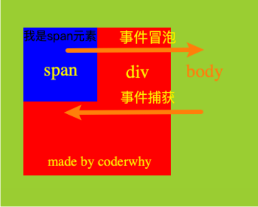
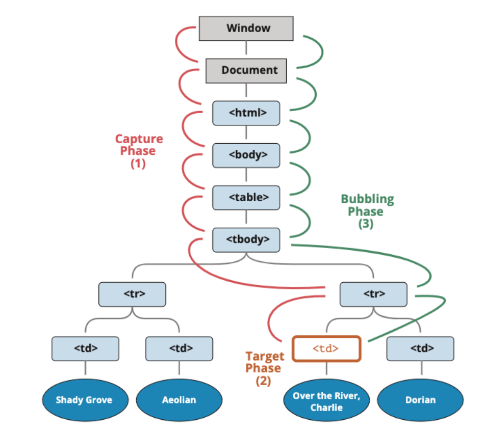
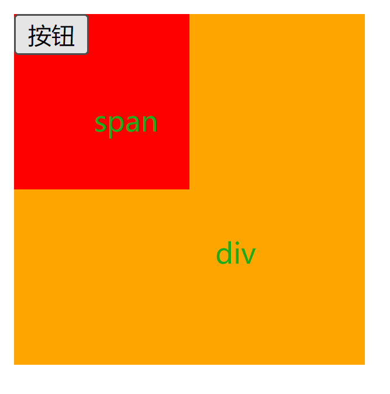
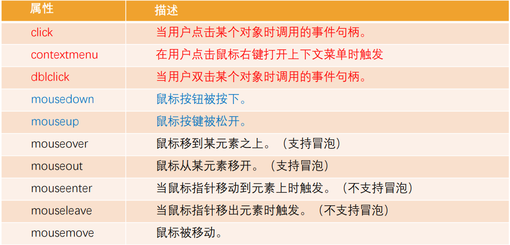
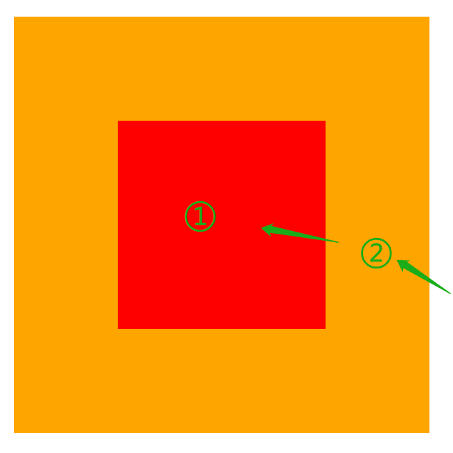
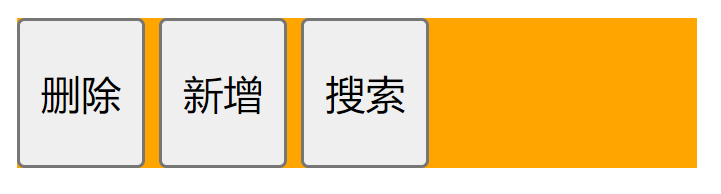
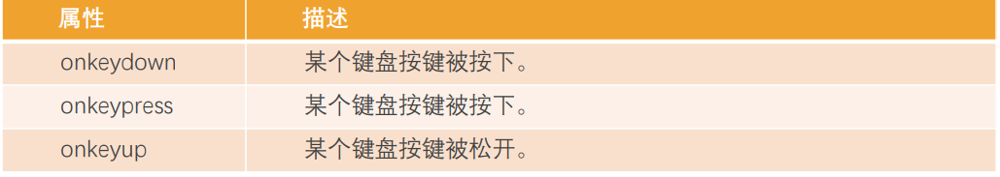
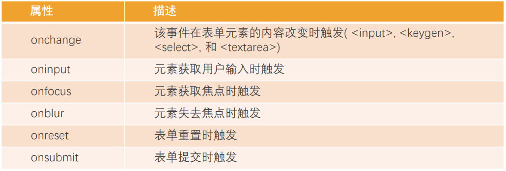

## 认识事件（Event）

Web 页面需要经常和用户之间进行交互，而交互的过程中我们可能想要捕捉这个交互的过程：

- 比如用户点击了某个按钮、用户在输入框里面输入了某个文本、用户鼠标经过了某个位置；
- 浏览器需要搭建一条 JavaScript 代码和事件之间的桥梁；
- 当某个事件发生时，让 JavaScript 可以响应（执行某个函数），所以我们需要针对事件编写处理程序（handler）；

如何进行事件监听呢？

- 事件监听方式一：在 script 中直接监听（很少使用）；

```html
<!-- 直接在html中编写JavaScript代码(了解) -->
<button onclick="console.log('按钮1发生了点击~');">按钮1</button>
```

- 事件监听方式二：DOM 属性，通过元素的 on 来监听事件；

这种方式只会执行一个函数

```html
<button class="btn2">按钮2</button>
```

```javascript
// 1.获取元素对象
var btn2El = document.querySelector(".btn2");

// 2.onclick属性
function handleClick01() {
  console.log("按钮2发生了点击~");
}
function handleClick02() {
  console.log("按钮2的第二个处理函数");
}
btn2El.onclick = handleClick01;
btn2El.onclick = handleClick02; // 后面函数会把前面的覆盖掉，只会执行handleClick02
```

- 事件监听方式三：通过 EventTarget 中的 addEventListener 来监听；

```html
<button class="btn3">按钮3</button>
```

```javascript
// 1.获取元素对象
var btn3El = document.querySelector(".btn3");

// 3.addEventListener(推荐) 三个函数都会执行
btn3El.addEventListener("click", function () {
  console.log("第一个btn3的事件监听~");
});
btn3El.addEventListener("click", function () {
  console.log("第二个btn3的事件监听~");
});
btn3El.addEventListener("click", function () {
  console.log("第三个btn3的事件监听~");
});
```

## 认识事件流

事实上对于事件有一个概念叫做事件流，为什么会产生事件流呢？

我们可以想到一个问题：当我们在浏览器上对着一个元素点击时，你点击的不仅仅是这个元素本身；

这是因为我们的 HTML 元素是存在父子元素叠加层级的；

比如一个 span 元素是放在 div 元素上的，div 元素是放在 body 元素上的，body 元素是放在 html 元素上的；

## 事件冒泡和事件捕获

我们会发现默认情况下事件是从最内层的 span 向外依次传递的顺序，这个顺序我们称之为事件冒泡（Event Bubble）;

事实上，还有另外一种监听事件流的方式就是从外层到内层（body -> span），这种称之为事件捕获（Event Capture）；

为什么会产生两种不同的处理流呢？

- 这是因为早期浏览器开发时，不管是 IE 还是 Netscape 公司都发现了这个问题;
- 但是他们采用了完全相反的事件流来对事件进行了传递；
- IE 采用了事件冒泡的方式，Netscape 采用了事件捕获的方式；

那么我们如何去监听事件捕获的过程呢？



```css
.box {
  display: flex;
  justify-content: center;
  align-items: center;
  width: 200px;
  height: 200px;
  background-color: orange;
}

.box span {
  width: 100px;
  height: 100px;
  background-color: red;
}
```

```html
<div class="box">
  <span></span>
</div>
```

```javascript
// 1.获取元素
var spanEl = document.querySelector("span");
var divEl = document.querySelector("div");
var bodyEl = document.body;

// 2.绑定点击事件
// spanEl.onclick = function() {
//   console.log("span元素发生了点击~")
// }
// divEl.onclick = function() {
//   console.log("div元素发生了点击~")
// }
// bodyEl.onclick = function() {
//   console.log("body元素发生了点击~")
// }

// 默认情况下是事件冒泡
spanEl.addEventListener("click", function () {
  console.log("span元素发生了点击~冒泡");
});
divEl.addEventListener("click", function () {
  console.log("div元素发生了点击~冒泡");
});
bodyEl.addEventListener("click", function () {
  console.log("body元素发生了点击~冒泡");
});

// 设置希望监听事件捕获的过程，第三个参数为true表示捕获
spanEl.addEventListener(
  "click",
  function () {
    console.log("span元素发生了点击~捕获");
  },
  true
);
divEl.addEventListener(
  "click",
  function () {
    console.log("div元素发生了点击~捕获");
  },
  true
);
bodyEl.addEventListener(
  "click",
  function () {
    console.log("body元素发生了点击~捕获");
  },
  true
);
```

## 事件捕获和冒泡的过程

如果我们都监听，那么会按照如下顺序来执行：

- 捕获阶段（Capturing phase）：事件（从 Window）向下走近元素。

- 目标阶段（Target phase）：事件到达目标元素。

- 冒泡阶段（Bubbling phase）：事件从元素上开始冒泡。

事实上，我们可以通过 event 对象来获取当前的阶段：eventPhase

开发中通常会使用事件冒泡，所以事件捕获了解即可。



## 事件对象

当一个事件发生时，就会有和这个事件相关的很多信息：

- 比如事件的类型是什么，你点击的是哪一个元素，点击的位置是哪里等等相关的信息；
- 那么这些信息会被封装到一个 Event 对象中，这个对象由浏览器创建，称之为 event 对象；
- 该对象给我们提供了想要的一些属性，以及可以通过该对象进行某些操作；

如何获取这个 event 对象呢？

- event 对象会在传入的事件处理（event handler）函数回调时，被系统传入；
- 我们可以在回调函数中拿到这个 event 对象；

```javascript
spanEl.onClick = function (event) {
  console.log("事件对象：", event);
};
spanEl.addEventListener("click", function (event) {
  console.log("事件对象：", event);
});
```

这个对象中都有哪些常见的属性和操作呢？

## event 常见的属性和方法

常见的属性：

- type：事件的类型；
- target：当前事件发生的元素；
- currentTarget：当前处理事件的元素；
- eventPhase：事件所处的阶段；
- offsetX、offsetY：事件发生在元素内的位置；
- clientX、clientY：事件发生在客户端内的位置；
- pageX、pageY：事件发生在客户端相对于 document 的位置；
- screenX、screenY：事件发生相对于屏幕的位置；

```html
<div class="box">
  <span class="btn">
    <button>按钮</button>
  </span>
</div>

<br /><br /><br /><br /><br /><br /><br /><br /><br /><br /><br /><br /><br /><br /><br /><br />
<br /><br /><br /><br /><br /><br /><br /><br /><br /><br /><br /><br /><br /><br /><br /><br />
<br /><br /><br /><br /><br /><br /><br /><br /><br /><br /><br /><br /><br /><br /><br /><br />
```

```css
.box {
  display: flex;
  width: 200px;
  height: 200px;
  background-color: orange;
}

span {
  width: 100px;
  height: 100px;
  background-color: #f00;
}
```

```javascript
var divEl = document.querySelector("div");
var btnEl = document.querySelector(".btn");

// btnEl.onclick = function() {
//   console.log("按钮发生了点击~")
// }

divEl.onclick = function (event) {
  // 1.偶尔会使用
  console.log("事件类型:", event.type); // click
  console.log("事件阶段:", event.eventPhase); // 点击按钮或span会冒泡，此时是3，如果直接点击div是2，捕获是1

  // 2.比较少使用
  console.log("事件元素中位置", event.offsetX, event.offsetY);
  console.log("事件客户端中位置", event.clientX, event.clientY);
  console.log("事件页面中位置", event.pageX, event.pageY);
  console.log("事件在屏幕中位置", event.screenX, event.screenY);

  // 3.target/currentTarget
  console.log(event.target); // 当前事件发生的元素，比如点击按钮，那么就是按钮；点击span就是span
  console.log(event.currentTarget); // 当前处理事件的元素，当前是divEl，所以是div
  console.log(event.currentTarget === event.target); // 只有当点击div时两者才相等
};
```



常见的方法：

- preventDefault：取消事件的默认行为；

```html
<a href="http://www.baidu.com">百度一下</a>
```

```javascript
// 1.阻止默认行为
var aEl = document.querySelector("a");
aEl.onclick = function (event) {
  console.log("a元素发生了点击~");
  event.preventDefault(); // 正常情况下点击会跳转到百度，加了这句就会阻止掉
};
```

- stopPropagation：阻止事件的进一步传递（冒泡或者捕获都可以阻止）；

```html
<div class="box">
  <span>
    <button>按钮</button>
  </span>
</div>
```

```css
.box {
  display: flex;
  width: 200px;
  height: 200px;
  background-color: orange;
}

.box span {
  width: 100px;
  height: 100px;
  background-color: #f00;
}
```

```javascript
// 2.阻止事件进一步传递
var btnEl = document.querySelector("button");
var spanEl = document.querySelector("span");
var divEl = document.querySelector("div");

divEl.addEventListener(
  "click",
  function (event) {
    console.log("div的事件捕获监听~");
    // event.stopPropagation() 只会打印 div的事件捕获监听~
  },
  true
);
spanEl.addEventListener(
  "click",
  function () {
    console.log("span的事件捕获监听~");
  },
  true
);
btnEl.addEventListener(
  "click",
  function (event) {
    console.log("button的事件捕获监听~");
    // event.stopPropagation() 只会打印前两个
  },
  true
);

divEl.addEventListener("click", function () {
  console.log("div的事件冒泡监听~");
});
spanEl.addEventListener("click", function (event) {
  console.log("span的事件冒泡监听~");
  event.stopPropagation(); // 除了 div的事件冒泡监听~ 这个不会打印，其他都会打印，顺序是先捕获再冒泡
});
btnEl.addEventListener("click", function () {
  console.log("button的事件冒泡监听~");
});
```

## 事件处理中的 this

在函数中，我们也可以通过 this 来获取当前的发生元素：

这是因为在浏览器内部，调用 event handler 是绑定到当前的 currentTarget 上的

```html
<div>
  <button>按钮</button>
</div>
```

```javascript
var btnEl = document.querySelector("button");
var divEl = document.querySelector("div");

divEl.onclick = function (event) {
  console.log(this);
  console.log(event.currentTarget);
  console.log(divEl);
  console.log(this === divEl); // true
};
// divEl.addEventListener("click", function() {
//   console.log(this) // divEl
// })
```

## EventTarget 类

我们会发现，所有的节点、元素都继承自 EventTarget

事实上 Window 也继承自 EventTarget；

那么这个 EventTarget 是什么呢？

EventTarget 是一个 DOM 接口，主要用于添加、删除、派发 Event 事件；

EventTarget 常见的方法：

- addEventListener：注册某个事件类型以及事件处理函数；
- removeEventListener：移除某个事件类型以及事件处理函数；

```html
<button>按钮</button>
```

```javascript
// 1.将监听函数移除的过程
var foo = function () {
  console.log("监听到按钮的点击");
};
btnEl.addEventListener("click", foo);

// 需求: 过5s钟后, 将这个事件监听移除掉
setTimeout(function () {
  btnEl.removeEventListener("click", foo);
}, 5000);

// 这种做法是无法移除的
btnEl.addEventListener("click", function () {
  console.log("btn监听的处理函数~");
});

setTimeout(function () {
  btnEl.removeEventListener("click", function () {});
}, 5000);
```

- dispatchEvent：派发某个事件类型到 EventTarget 上；

```javascript
// eventtarget就可以实现类似于事件总线的效果
window.addEventListener("coderwhy", function () {
  console.log("监听到coderwhy的呼唤~");
});

setTimeout(function () {
  window.dispatchEvent(new Event("coderwhy"));
}, 5000);
```

## 事件委托（event delegation）

事件冒泡在某种情况下可以帮助我们实现强大的事件处理模式 – 事件委托模式（也是一种设计模式）

那么这个模式是怎么样的呢？

- 因为当子元素被点击时，父元素可以通过冒泡可以监听到子元素的点击；
- 并且可以通过 event.target 获取到当前监听的元素；

案例：一个 ul 中存放多个 li，点击某一个 li 会变成红色

方案一：监听每一个 li 的点击，并且做出相应；

```html
<ul>
  <li>1</li>
  <li>2</li>
  <li>3</li>
  <li>4</li>
  <li>5</li>
  <li>6</li>
  <li>7</li>
  <li>8</li>
  <li>9</li>
  <li>10</li>
</ul>
```

```css
.active {
  color: red;
  font-size: 20px;
  background-color: orange;
}
```

```javascript
// 1.每一个li都监听自己的点击, 并且有自己的处理函数(自己的函数)
var liEls = document.querySelectorAll("li");
for (var liEl of liEls) {
  // 监听点击
  liEl.onclick = function (event) {
    event.currentTarget.classList.add("active");
  };
}
```

方案二：在 ul 中监听点击，并且通过 event.target 拿到对应的 li 进行处理；

```javascript
// 2.统一在ul中监听
var ulEl = document.querySelector("ul");
ulEl.onclick = function (event) {
  console.log("点击了某一个li", event.target);
  event.target.classList.add("active");
};
```

因为这种方案并不需要遍历后给每一个 li 上添加事件监听，所以它更加高效；

新需求： 点击 li 变成 active, 其他的取消 active

方法一：

```javascript
var ulEl = document.querySelector("ul");
ulEl.onclick = function (event) {
  // 1.将之前的active移除掉
  for (var i = 0; i < ulEl.children.length; i++) {
    var liEl = ulEl.children[i];
    if (liEl.classList.contains("active")) {
      liEl.classList.remove("active");
    }
  }
};
```

方法二：

```javascript
ulEl.onclick = function (event) {
  // 1.找到active的li, 移除掉active
  var activeLiEl = ulEl.querySelector(".active");
  if (activeLiEl) {
    activeLiEl.classList.remove("active");
  }
};
```

方法三：

```javascript
var activeLiEl = null;
ulEl.onclick = function (event) {
  // 1.变量记录的方式
  // edge case
  if (activeLiEl && event.target !== ulEl) {
    activeLiEl.classList.remove("active");
  }

  // 2.给点击的元素添加active
  if (event.target !== ulEl) {
    event.target.classList.add("active");
  }

  // 3.记录最新的active对应的li
  activeLiEl = event.target;
};
```

## 事件委托的标记

某些事件委托可能需要对具体的子组件进行区分，这个时候我们可以使用 data-\*对其进行标记：

比如多个按钮的点击，区分点击了哪一个按钮：

```html
<div class="box">
  <button data-action="search">搜索~</button>
  <button data-action="new">新建~</button>
  <button data-action="remove">移除~</button>
  <button>1111</button>
</div>
```

```javascript
var boxEl = document.querySelector(".box");
boxEl.onclick = function (event) {
  var btnEl = event.target;
  var action = btnEl.dataset.action;
  switch (action) {
    case "remove":
      console.log("点击了移除按钮");
      break;
    case "new":
      console.log("点击了新建按钮");
      break;
    case "search":
      console.log("点击了搜索按钮");
      break;
    default:
      console.log("点击了其他");
  }
};
```

## 常见的鼠标事件

接下来我们来看一下常见的鼠标事件（不仅仅是鼠标设备，也包括模拟鼠标的设备，比如手机、平板电脑）

常见的鼠标事件：



```html
<div class="box"></div>
```

```css
.box {
  width: 200px;
  height: 200px;
  background-color: orange;
}
```

```javascript
// 鼠标事件
var boxEl = document.querySelector(".box");

boxEl.onclick = function () {
  console.log("click");
};

boxEl.oncontextmenu = function (event) {
  console.log("点击了右键");
  event.preventDefault();
};

// 变量记录鼠标是否是点下去的
var isDown = false;
boxEl.onmousedown = function () {
  console.log("鼠标按下去");
  isDown = true;
};

boxEl.onmouseup = function () {
  console.log("鼠标抬起来");
  isDown = false;
};

boxEl.onmousemove = function () {
  if (isDown) {
    console.log("鼠标在div上面移动");
  }
};
```

当鼠标按下去才可以移动，鼠标抬起来触发点击事件。

## mouseover 和 mouseenter 的区别

mouseenter 和 mouseleave

- 不支持冒泡
- 进入子元素依然属于在该元素内，没有任何反应

mouseover 和 mouseout

- 支持冒泡
- 进入元素的子元素时
- 先调用父元素的 mouseout
- 再调用子元素的 mouseover
- 因为支持冒泡，所以会将 mouseover 传递到父元素中；

```html
<div class="box">
  <span></span>
</div>
```

```css
.box {
  display: flex;
  justify-content: center;
  align-items: center;
  width: 200px;
  height: 200px;
  background-color: orange;
}

.box span {
  width: 100px;
  height: 100px;
  background-color: red;
}
```

```javascript
var boxEl = document.querySelector(".box");
var spanEl = document.querySelector("span");

// 1.第一组
boxEl.onmouseenter = function () {
  console.log("box onmouseenter");
};
boxEl.onmouseleave = function () {
  console.log("box onmouseleave");
};

spanEl.onmouseenter = function () {
  console.log("span onmouseenter");
};
spanEl.onmouseleave = function () {
  console.log("span onmouseleave");
};
```



鼠标进入 ② 会打印 box onmouseenter，从 ② 进入 ① 会打印 span onmouseenter，从 ① 到 ② 会打印 span onmouseleave，

从 ② 移到外面会打印 box onmouseleave，整个过程不会冒泡。

```javascript
// 第二组
boxEl.onmouseover = function () {
  console.log("box onmouseover");
};
boxEl.onmouseout = function () {
  console.log("box onmouseout");
};
```

鼠标进入 ② 会打印 box onmouseover，不一样的地方来了，从 ② 进入 ① 会先打印 box onmouseout，然后由于 span 的冒泡再打印

box onmouseover，从 ② 到 ① 由于 span 的冒泡会先打印 box onmouseout，然后再打印 box onmouseover，最后从 ② 离开打印

box onmouseout。

## mouseenter 和 mouseover 的应用

来完成一个需求，鼠标移入下面的三个按钮，分别打印按钮对应的文字。



```html
<div class="box">
  <button>删除</button>
  <button>新增</button>
  <button>搜索</button>
</div>
```

```css
.box {
  background-color: orange;
}

.box button {
  flex: 1;
  height: 50px;
}
```

```javascript
// 方案一: 监听的本身就是button元素
var btnEls = document.querySelectorAll("button");
for (var i = 0; i < btnEls.length; i++) {
  btnEls[i].onmouseover = function (event) {
    console.log(event.target.textContent);
  };
}
```

```javascript
// 方案二: 事件委托 只能用onmouseover
var boxEl = document.querySelector(".box");
boxEl.onmouseover = function (event) {
  if (event.target.tageName === "BUTTON") {
    console.log(event.target.textContent);
  }
};
```

## 常见的键盘事件

常见的键盘事件：



事件的执行顺序是 onkeydown、onkeypress、onkeyup

- down 事件先发生；
- press 发生在文本被输入；
- up 发生在文本输入完成；

我们可以通过 key 和 code 来区分按下的键：

- code：“按键代码”（"KeyA"，"ArrowLeft" 等），特定于键盘上按键的物理位置。
- key：字符（"A"，"a" 等），对于非字符（non-character）的按键，通常具有与 code 相同的值。）

```html
<input type="text" /> <button>搜索</button>
```

```javascript
var inputEl = document.querySelector("input");
var btnEl = document.querySelector("button");

inputEl.onkeydown = function () {
  console.log("onkeydown");
};
inputEl.onkeypress = function () {
  console.log("onkeypress");
};
inputEl.onkeyup = function (event) {
  console.log(event.key, event.code);
};
```

实现搜索功能：

```javascript
// 1.搜索功能 按钮点击
btnEl.onclick = function () {
  console.log("进行搜索功能", inputEl.value);
};

// 按回车搜索
inputEl.onkeyup = function (event) {
  if (event.code === "Enter") {
    console.log("进行搜索功能", inputEl.value);
  }
};
```

在空白处按 s 键，输入框会自动获取焦点

```javascript
// 2.按下s的时候, 搜索自动获取焦点
document.onkeyup = function (event) {
  if (event.code === "KeyS") {
    inputEl.focus();
  }
};
```

## 常见的表单事件

针对表单也有常见的事件：



```html
<input type="text" />
```

```javascript
var inputEl = document.querySelector("input");

// 1.获取焦点和失去焦点
inputEl.onfocus = function () {
  console.log("input获取到了焦点");
};
inputEl.onblur = function () {
  console.log("input失去到了焦点");
};
```

```javascript
// 2.内容发生改变/输入内容
// 输入的过程: input
// 内容确定发生改变(离开): change
inputEl.oninput = function () {
  console.log("input事件正在输入内容", inputEl.value);
};
inputEl.onchange = function () {
  // 失去焦点触发
  console.log("change事件内容发生改变", inputEl.value);
};
```

监听重置和提交

```html
<form action="/abc">
  <input type="text" />
  <textarea name="" id="" cols="30" rows="10"></textarea>

  <button type="reset">重置</button>
  <button type="submit">提交</button>
</form>
```

```javascript
// 3.监听重置和提交
var formEl = document.querySelector("form");
formEl.onreset = function (event) {
  // 会把整个表单重置
  console.log("发生了重置事件");
  event.preventDefault();
};

formEl.onsubmit = function (event) {
  console.log("发生了提交事件");
  // axios库提交
  event.preventDefault(); // 会阻止默认提交，后面拼上/abc，开发中一般都是自定义提交
};
```

## 文档加载事件

DOMContentLoaded：浏览器已完全加载 HTML，并构建了 DOM 树，但像 \和样式表之类的外部资源可能尚未加载完成。

load：浏览器不仅加载完成了 HTML，还加载完成了所有外部资源：图片，样式等。

正常情况下，下面这样写是可以给 box 设置背景色

```html
<div class="box"></div>

<script>
  var boxEl = document.querySelector(".box");
  boxEl.style.backgroundColor = "orange";
</script>
```

但假如将它们的顺序对调一下会怎么样呢？

```html
<script>
  var boxEl = document.querySelector(".box");
  boxEl.style.backgroundColor = "orange";
</script>

<div class="box"></div>
```

运行到浏览器就会报错，因为此时还没有加载 box，也就是 boxEl 是 null。

那么有没有办法拿到 boxEl 呢？我们可以在 DOMContentLoaded 或 onload 事件中拿到 boxEl

```javascript
window.addEventListener("DOMContentLoaded", function () {
  // 1.这里可以操作box, box已经加载完毕
  var boxEl = document.querySelector(".box");
  boxEl.style.backgroundColor = "orange";
  console.log("HTML内容加载完毕");
});

window.onload = function () {
  // 这里也可以操作box
  var boxEl = document.querySelector(".box");
  boxEl.style.backgroundColor = "orange";
  console.log("文档中所有资源都加载完毕");
};
```

既然这两个事件中都能操作 box，那么它们的区别是什么？

DOMContentLoaded 中是无法获取图片的一些信息，因为此时图片还没有加载完成，所以 offsetWidth 和 offsetHeight 都是 0。

```javascript
// 注册事件监听
window.addEventListener("DOMContentLoaded", function () {
  // 2.获取img对应的图片的宽度和高度
  var imgEl = document.querySelector("img");
  console.log("图片的宽度和高度:", imgEl.offsetWidth, imgEl.offsetHeight); // 0 0
});
```

而 onload 事件中却可以获取到真实的图片信息

```javascript
window.onload = function () {
  console.log("文档中所有资源都加载完毕");
  var imgEl = document.querySelector("img");
  console.log("图片的宽度和高度:", imgEl.offsetWidth, imgEl.offsetHeight);
};
```

其他更多的事件类型：https://developer.mozilla.org/zh-CN/docs/Web/Events

```javascript
window.onresize = function () {
  console.log("创建大小发生改变时");
};
```
