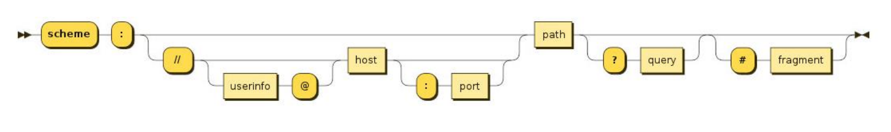
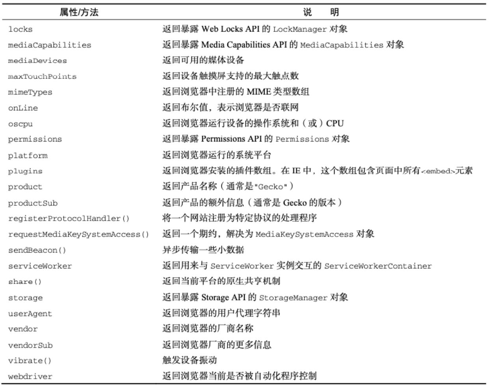
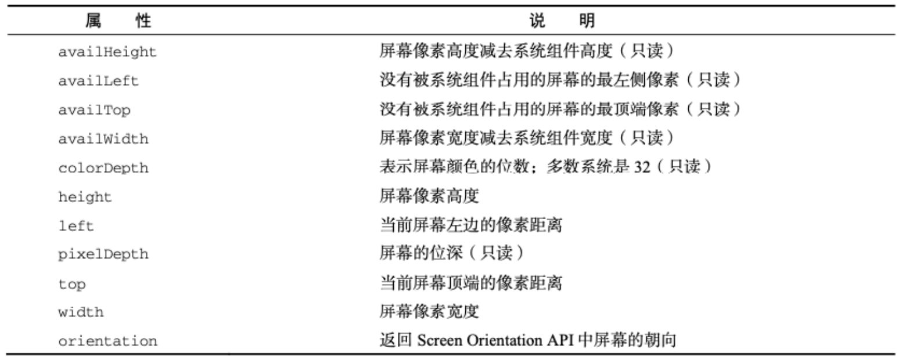
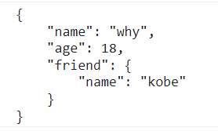

## 认识 BOM

BOM：浏览器对象模型（Browser Object Model）

简称 BOM，由浏览器提供的用于处理文档（document）之外的所有内容的其他对象；

比如 navigator、location、history 等对象；

JavaScript 有一个非常重要的运行环境就是浏览器

而且浏览器本身又作为一个应用程序需要对其本身进行操作；

所以通常浏览器会有对应的对象模型（BOM，Browser Object Model）；

我们可以将 BOM 看成是连接 JavaScript 脚本与浏览器窗口的桥梁；

BOM 主要包括以下的对象模型：

- window：包括全局属性、方法，控制浏览器窗口相关的属性、方法；
- location：浏览器连接到的对象的位置（URL）；
- history：操作浏览器的历史；
- navigator：用户代理（浏览器）的状态和标识（很少用到）；
- screen：屏幕窗口信息（很少用到）；

## window 对象

window 对象在浏览器中可以从两个视角来看待：

视角一：全局对象。

- 我们知道 ECMAScript 其实是有一个全局对象的，这个全局对象在 Node 中是 global；
- 在浏览器中就是 window 对象；

视角二：浏览器窗口对象。

- 作为浏览器窗口时，提供了对浏览器操作的相关的 API；

当然，这两个视角存在大量重叠的地方，所以不需要刻意去区分它们：

- 事实上对于浏览器和 Node 中全局对象名称不一样的情况，目前已经指定了对应的标准，称之为 globalThis，并且大多数现代 浏览器都支持它；

- 放在 window 对象上的所有属性都可以被访问；
- 使用 var 定义的变量会被添加到 window 对象中；
- window 默认给我们提供了全局的函数和类：setTimeout、Math、Date、Object 等；

```javascript
// 1.window的查看角度
// ECMAScript规范: 全局对象 -> globalThis
// 对于浏览器 -> window
// 对于Node -> global
console.log(window);
console.log(globalThis === window);
```

## window 对象的作用

事实上 window 对象上肩负的重担是非常大的：

- 第一：包含大量的属性，localStorage、console、location、history、screenX、scrollX 等等（大概 60+个属性）；
- 第二：包含大量的方法，alert、close、scrollTo、open 等等（大概 40+个方法）；
- 第三：包含大量的事件，focus、blur、load、hashchange 等等（大概 30+个事件）；
- 第四：包含从 EventTarget 继承过来的方法，addEventListener、removeEventListener、dispatchEvent 方法；

那么这些大量的属性、方法、事件在哪里查看呢？

MDN 文档：https://developer.mozilla.org/zh-CN/docs/Web/API/Window

查看 MDN 文档时，我们会发现有很多不同的符号，这里我解释一下是什么意思：

- 删除符号：表示这个 API 已经废弃，不推荐继续使用了；
- 感叹号符号：表示这个 API 不属于 W3C 规范，某些浏览器有实现（所以兼容性的问题）；
- 实验符号：该 API 是实验性特性，以后可能会修改，并且存在兼容性问题；

## window 常见的属性

```javascript
// 浏览器窗口
console.log(window.outerHeight);

console.log(window.scrollX);
console.log(window.scrollY);
```

## window 常见的方法

```html
<button>百度一下</button>
```

```javascript
var openBtnEl = document.querySelector("button");

openBtnEl.onclick = function () {
  window.open("./page/new.html", "_blank");
};
```

window.close 只能关闭通过 window.open 打开的窗口。

page/new.html

```html
<body>
  <h1>新窗口</h1>
  <button>关闭窗口</button>

  <script>
    document.querySelector("button").onclick = function () {
      window.close();
    };
  </script>
</body>
```

## window 常见的事件

```javascript
// 3.常见的事件
window.onfocus = function () {
  console.log("窗口获取到焦点"); // 点击浏览器的document区域可以触发
};
window.onblur = function () {
  console.log("窗口失去了焦点"); // 点击控制台就会触发
};

window.onhashchange = function () {
  console.log("hash值发生改变"); // 当地址栏#后面的内容发生变化会触发
};
```

## location 对象常见的属性

location 对象用于表示 window 上当前链接到的 URL 信息。

常见的属性有哪些呢？

- href: 当前 window 对应的超链接 URL, 整个 URL；
- protocol: 当前的协议；
- host: 主机地址；
- hostname: 主机地址(不带端口)；
- port: 端口；
- pathname: 路径；
- search: 查询字符串；
- hash: 哈希值；
- username：URL 中的 username（很多浏览器已经禁用）；
- password：URL 中的 password（很多浏览器已经禁用）；

```javascript
// 1.完整的URL
console.log(location.href);
// 2.获取URL信息
console.log(location.hostname);
console.log(location.host);
console.log(location.protocol);
console.log(location.port);
console.log(location.pathname);
console.log(location.search);
console.log(location.hash);
```

## location 对象常见的方法

我们会发现 location 其实是 URL 的一个抽象实现：



location 有如下常用的方法：

- assign：赋值一个新的 URL，并且跳转到该 URL 中；
- replace：打开一个新的 URL，并且跳转到该 URL 中（不同的是不会在浏览记录中留下之前的记录）；
- reload：重新加载页面，可以传入一个 Boolean 类型；

```html
<button>打开新的网页</button>
<button>替换新的网页</button>
<button>网页重新加载</button>
```

```javascript
// 3.location方法
var btns = document.querySelectorAll("button");
btns[0].onclick = function () {
  location.assign("http://www.baidu.com"); // 浏览器可以前进后退
};
btns[1].onclick = function () {
  location.replace("http://www.baidu.com"); // 替换成一个新的网页，没法前进和后退
};
btns[2].onclick = function () {
  location.reload(); // 刷新当前页面
};
```

## URLSearchParams

URLSearchParams 定义了一些实用的方法来处理 URL 的查询字符串。

- 可以将一个字符串转化成 URLSearchParams 类型；
- 也可以将一个 URLSearchParams 类型转成字符串；

```javascript
var urlsearch = new URLSearchParams("name=why&age=18&height=1.88");
console.log(urlsearch.get("name")); // why
console.log(urlsearch.toString()); // name=why&age=18&height=1.88
```

URLSearchParams 常见的方法有如下：

- get：获取搜索参数的值；
- set：设置一个搜索参数和值；
- append：追加一个搜索参数和值；
- has：判断是否有某个搜索参数；
- https://developer.mozilla.org/zh-CN/docs/Web/API/URLSearchParams

中文会使用 encodeURIComponent 和 decodeURIComponent 进行编码和解码

```javascript
// 4.URLSearchParams
var urlSearchString = "?name=why&age=18&height=1.88";
var searchParams = new URLSearchParams(urlSearchString);
console.log(searchParams.get("name"));
console.log(searchParams.get("age"));
console.log(searchParams.get("height"));

searchParams.append("address", "广州市");
console.log(searchParams.get("address"));
console.log(searchParams.toString()); // name=why&age=18&height=1.88&address=%E5%B9%BF%E5%B7%9E%E5%B8%82
```

## history 对象常见属性和方法

history 对象允许我们访问浏览器曾经的会话历史记录。

有两个属性：

- length：会话中的记录条数；
- state：当前保留的状态值；

有五个方法：

- back()：返回上一页，等价于 history.go(-1)；
- forward()：前进下一页，等价于 history.go(1)；
- go()：加载历史中的某一页；
- pushState()：打开一个指定的地址；
- replaceState()：打开一个新的地址，并且使用 replace；

history 和 hash 目前是 vue、react 等框架实现路由的底层原理，具体的实现方式我会在后续讲解。

```html
<button>修改history</button> <button class="back">返回上一级</button>
```

```javascript
// 前端路由核心: 修改了URL, 但是页面不刷新
// 1> 修改hash值
// 2> 修改history

// 1.history对应的属性
console.log(history.length);
console.log(history.state);

// 2.修改history
var btnEl = document.querySelector("button");
btnEl.onclick = function () {
  // history.pushState({ name: "why", age: 18 }, "", "/why")
  history.replaceState({ name: "why", age: 18 }, "", "/why");
};

var backBtnEl = document.querySelector(".back");
backBtnEl.onclick = function () {
  // history.back()
  // history.forward()
  // 类似于上面的两个方法, 只是可以传入层级
  // history.go(-2)
};
```

## navigator 对象（很少使用）

navigator 对象表示用户代理的状态和标识等信息。



```javascript
console.log(navigator.userAgent);
console.log(navigator.vendor);
console.log(navigator.platform);
console.log(navigator.oscpu);
```

## screen 对象（很少使用）

screen 主要记录的是浏览器窗口外面的客户端显示器的信息：

比如屏幕的逻辑像素 screen.width、screen.height；



## JSON 的由来

在目前的开发中，JSON 是一种非常重要的数据格式，它并不是编程语言，而是一种可以在服务器和客户端之间传输的数据格式。

JSON 的全称是 JavaScript Object Notation（JavaScript 对象符号）：

- JSON 是由 Douglas Crockford 构想和设计的一种轻量级资料交换格式，算是 JavaScript 的一个子集；
- 但是虽然 JSON 被提出来的时候是主要应用 JavaScript 中，但是目前已经独立于编程语言，可以在各个编程语言中使用；
- 很多编程语言都实现了将 JSON 转成对应模型的方式；

其他的传输格式：

- XML：在早期的网络传输中主要是使用 XML 来进行数据交换的，但是这种格式在解析、传输等各方面都弱于 JSON，所以目前已经很 少在被使用了；
- Protobuf：另外一个在网络传输中目前已经越来越多使用的传输格式是 protobuf，但是直到 2021 年的 3.x 版本才支持 JavaScript，所 以目前在前端使用的较少；

目前 JSON 被使用的场景也越来越多：

- 网络数据的传输 JSON 数据；
- 项目的某些配置文件；
- 非关系型数据库（NoSQL）将 json 作为存储格式；

## JSON 基本语法

JSON 的顶层支持三种类型的值：

创建一个 json 文件，json 文件里面不能写注释，而且最后一个值后面不能有逗号

- 简单值：数字（Number）、字符串（String，不支持单引号）、布尔类型（Boolean）、null 类型；

```json
123
```

- 对象值：由 key、value 组成，key 是字符串类型，并且必须添加双引号，值可以是简单值、对象值、数组值；

```json
{
  "name": "why",
  "age": 123,
  "friend": {
    "name": "kobe",
    "age": null
  }
}
```

- 数组值：数组的值可以是简单值、对象值、数组值；

```json
["123", 123]
```

## JSON 序列化

某些情况下我们希望将 JavaScript 中的复杂类型转化成 JSON 格式的字符串，这样方便对其进行处理：

- 比如我们希望将一个对象保存到 localStorage 中；
- 但是如果我们直接存放一个对象，这个对象会被转化成 [object Object] 格式的字符串，并不是我们想要的结果；

## JSON 序列化方法

在 ES5 中引用了 JSON 全局对象，该对象有两个常用的方法：

- stringify 方法：将 JavaScript 类型转成对应的 JSON 字符串；
- parse 方法：解析 JSON 字符串，转回对应的 JavaScript 类型；

```javascript
var obj = {
  name: "why",
  age: 18,
  friend: {
    name: "kobe",
  },
};

console.log(obj.name, obj.age);

// 1.将obj对象进行序列化
var objJSONString = JSON.stringify(obj);
console.log(objJSONString);

// 2.将对象存储到localStorage
localStorage.setItem("info", objJSONString);

var item = localStorage.getItem("info");
console.log(item, typeof item);

// 3.将字符串转回到对象(反序列化)
var newObj = JSON.parse(item);
console.log(newObj);
```

## Stringify 的参数 replace

JSON.stringify() 方法将一个 JavaScript 对象或值转换为 JSON 字符串：

- 如果指定了一个 replacer 函数，则可以选择性地替换值；
- 如果指定的 replacer 是数组，则可选择性地仅包含数组指定的属性；

```javascript
var obj = {
  name: "why",
  age: 18,
  friend: {
    name: "kobe",
  },
};
```

当 key 等于 name 的时候全部替换成 coderwhy

```javascript
// 1.replacer参数
var objJSONString = JSON.stringify(obj, function (key, value) {
  if (key === "name") {
    return "coderwhy";
  }
  return value;
});
console.log(objJSONString); // {"name":"coderwhy","age":18,"friend":{"name":"coderwhy"}}
```

## Stringify 的参数 space

```javascript
// 2.space参数
var objJSONString = JSON.stringify(obj, null, 4);
console.log(objJSONString);
```

会将对象展开，更加清楚的看清结构



如果对象本身有显示 toJSON 方法, 那么直接调用 toJSON 方法

```javascript
var obj = {
  name: "why",
  age: 18,
  friend: {
    name: "kobe",
  },
  toJSON: function () {
    return "123";
  },
};

var objJSONString = JSON.stringify(obj);
console.log(objJSONString); // 123
```

## parse 方法

JSON.parse() 方法用来解析 JSON 字符串，构造由字符串描述的 JavaScript 值或对象。

提供可选的 reviver 函数用以在返回之前对所得到的对象执行变换(操作)。

```javascript
var obj = {
  name: "why",
  age: 18,
};

var objJSONString = JSON.stringify(obj);
console.log(objJSONString);

var newObj = JSON.parse(objJSONString, function (key, value) {
  if (key === "age") {
    return value + 2;
  }
  return value;
});
console.log(newObj); // { name: 'why', age: 20 }
```

JSON 的方法可以帮我们实现对象的深拷贝：

- 但是目前我们还没有了解什么是对象的拷贝、浅拷贝、深拷贝的概念；
- 我们会在 JavaScript 高级中学习；
