## 认识内存管理

不管什么样的编程语言，在代码的执行过程中都是需要给它分配内存的，不同的是某些编程语言需要我们自己手动的管理内存， 某些编程语言会可以自动帮助我们管理内存：

不管以什么样的方式来管理内存，内存的管理都会有如下的生命周期：

- 第一步：分配申请你需要的内存（申请）；
- 第二步：使用分配的内存（存放一些东西，比如对象等）；
- 第三步：不需要使用时，对其进行释放；

不同的编程语言对于第一步和第三步会有不同的实现：

- 手动管理内存：比如 C、C++，包括早期的 OC，都是需要手动来管理内存的申请和释放的（malloc 和 free 函数）；
- 自动管理内存：比如 Java、JavaScript、Python、Swift、Dart 等，它们有自动帮助我们管理内存；

对于开发者来说，JavaScript 的内存管理是自动的、无形的。

- 我们创建的原始值、对象、函数……这一切都会占用内存；
- 但是我们并不需要手动来对它们进行管理，JavaScript 引擎会帮助我们处理好它。

## JavaScript 的内存管理

JavaScript 会在定义数据时为我们分配内存。

但是内存分配方式是一样的吗？

JS 对于原始数据类型内存的分配会在执行时， 直接在栈空间进行分配；

JS 对于复杂数据类型内存的分配会在堆内存中 开辟一块空间，并且将这块空间的指针返回值 变量引用；

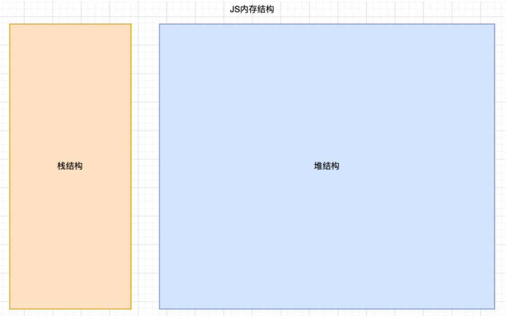

## JavaScript 的垃圾回收

因为内存的大小是有限的，所以当内存不再需要的时候，我们需要对其进行释放，以便腾出更多的内存空间。

在手动管理内存的语言中，我们需要通过一些方式自己来释放不再需要的内存，比如 free 函数：

- 但是这种管理的方式其实非常的低效，影响我们编写逻辑的代码的效率；
- 并且这种方式对开发者的要求也很高，并且一不小心就会产生内存泄露；

所以大部分现代的编程语言都是有自己的垃圾回收机制：

- 垃圾回收的英文是 Garbage Collection，简称 GC；
- 对于那些不再使用的对象，我们都称之为是垃圾，它需要被回收，以释放更多的内存空间；
- 而我们的语言运行环境，比如 Java 的运行环境 JVM，JavaScript 的运行环境 js 引擎都会内存 垃圾回收器；
- 垃圾回收器我们也会简称为 GC，所以在很多地方你看到 GC 其实指的是垃圾回收器；

但是这里又出现了另外一个很关键的问题：GC 怎么知道哪些对象是不再使用的呢？

- 这里就要用到 GC 的实现以及对应的算法；

## 常见的 GC 算法 – 引用计数（Reference counting）

引用计数：

- 当一个对象有一个引用指向它时，那么这个对象的引用就+1；
- 当一个对象的引用为 0 时，这个对象就可以被销毁掉；

这个算法有一个很大的弊端就是会产生循环引用；

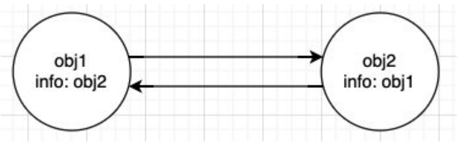

## 常见的 GC 算法 – 标记清除（mark-Sweep）

标记清除：

标记清除的核心思路是可达性（Reachability）

这个算法是设置一个根对象（root object），垃圾回收器会定期从这个根开始，找所有从根开始有引用到的对象，对于哪些 没有引用到的对象，就认为是不可用的对象；

这个算法可以很好的解决循环引用的问题；

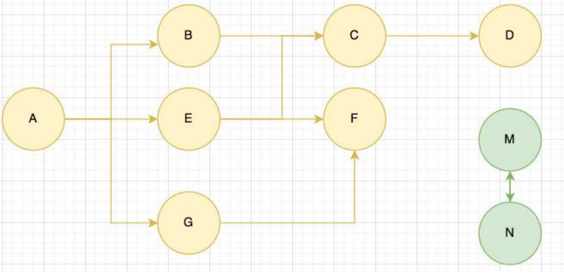

## 常见的 GC 算法 – 其他算法优化补充

JS 引擎比较广泛的采用的就是可达性中的标记清除算法，当然类似于 V8 引擎为了进行更好的优化，它在算法的实现细节上也会 结合一些其他的算法。

**标记整理**（Mark-Compact） 和“标记－清除”相似；

不同的是，回收期间同时会将保留的存储对象搬运汇集到连续的内存空间，从而整合空闲空间，避免内存碎片化；

**分代收集**（Generational collection）—— 对象被分成两组：“新的”和“旧的”。

许多对象出现，完成它们的工作并很快死去，它们可以很快被清理；

那些长期存活的对象会变得“老旧”，而且被检查的频次也会减少；

**增量收集**（Incremental collection）

如果有许多对象，并且我们试图一次遍历并标记整个对象集，则可能需要一些时间，并在执行过程中带来明显的延迟。

所以引擎试图将垃圾收集工作分成几部分来做，然后将这几部分会逐一进行处理，这样会有许多微小的延迟而不是一个大的 延迟；

**闲时收集**（Idle-time collection）

垃圾收集器只会在 CPU 空闲时尝试运行，以减少可能对代码执行的影响。

## V8 引擎详细的内存图

事实上，V8 引擎为了提供内存的管理效率，对内存进行非常详细的划分：

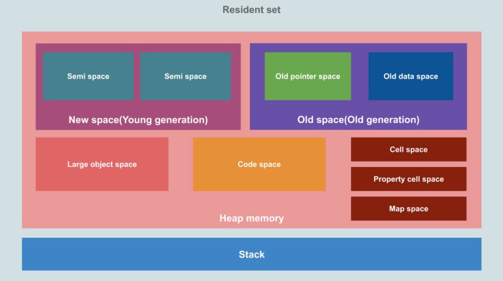

## JavaScript 的函数式编程

在前面我们说过，JavaScript 是支持函数式编程的

在 JavaScript 中，函数是非常重要的，并且是一等公民：

- 那么就意味着函数的使用是非常灵活的；
- 函数可以作为另外一个函数的参数，也可以作为另外一个函数的返回值来使用；

所以 JavaScript 存在很多的高阶函数：

- 自己编写高阶函数
- 使用内置的高阶函数

目前在 vue3+react 开发中，也都在趋向于函数式编程：

- vue3 composition api: setup 函数 -> 代码（函数 hook，定义函数）；

- react：class -> function -> hooks

## 闭包的定义

这里先来看一下闭包的定义，分成两个：在计算机科学中和在 JavaScript 中。

在计算机科学中对闭包的定义（维基百科）：

闭包（英语：Closure），又称词法闭包（Lexical Closure）或函数闭包（function closures）；

是在支持 头等函数 的编程语言中，实现词法绑定的一种技术；

闭包在实现上是一个结构体，它存储了一个函数和一个关联的环境（相当于一个符号查找表）；

闭包跟函数最大的区别在于，当捕捉闭包的时候，它的 自由变量 会在捕捉时被确定，这样即使脱离了捕捉时的上下文，它也能照常运行；

闭包的概念出现于 60 年代，最早实现闭包的程序是 Scheme，那么我们就可以理解为什么 JavaScript 中有闭包：

因为 JavaScript 中有大量的设计是来源于 Scheme 的；

我们再来看一下 MDN 对 JavaScript 闭包的解释：

一个函数和对其周围状态（lexical environment，词法环境）的引用捆绑在一起（或者说函数被引用包围），这样的组合就是闭包（closure）；

也就是说，闭包让你可以在一个内层函数中访问到其外层函数的作用域；

也就是说，闭包让你可以在一个内层函数中访问到其外层函数的作用域；

那么我的理解和总结：

一个普通的函数 function，如果它可以访问外层作用域的自由变量，那么这个函数和周围环境就是一个闭包；

**从广义的角度来说：JavaScript 中的函数都是闭包；**

**从狭义的角度来说：JavaScript 中一个函数，如果访问了外层作用域的变量，那么它是一个闭包；**

没有闭包的局限性：

```javascript
var name = "why";
var age = 18;
var height = 1.88;
var address = "广州市";
var intro = "了解真相, 你才能获得真正自由!";

function foo(name, age, height, address, intro, num1, num2) {
  var message = "Hello World";
  // 这些变量在函数之所以可以直接访问，正是因为闭包的存在，假如没有闭包，那么就需要通过参数进行传递，非常麻烦
  console.log(message, name, age, height, address, intro);

  function bar() {
    console.log(name);
  }

  bar();
}

foo(name, age, height, address, intro, 20, 30);
```

## 闭包的访问过程

目前有个需求，实现一个数加 5，那么可以像下面这样实现

```javascript
function add(num, count) {
  return num + count;
}
```

有一天，又想加 8 呢，也可以按照上面那样，但是使用起来就比较麻烦，需要传递 2 个参数

```javascript
add(100, 5);
add(55, 5);
add(12, 5);
add(22, 8);
add(35, 8);
add(7, 8);
```

那么有没有办法可以实现只需要传递一个参数的函数呢？答案就是使用闭包

```javascript
function createAdder(count) {
  function adder(num) {
    return count + num;
  }

  return adder;
}

var adder5 = createAdder(5);
adder5(100);
adder5(55);
adder5(12);

var adder8 = createAdder(8);
adder8(22);
adder8(35);
adder8(7);

console.log(adder5(24));
console.log(adder8(30));
```

上面代码在内存是怎样的表现呢？

第一次调用 createAdder

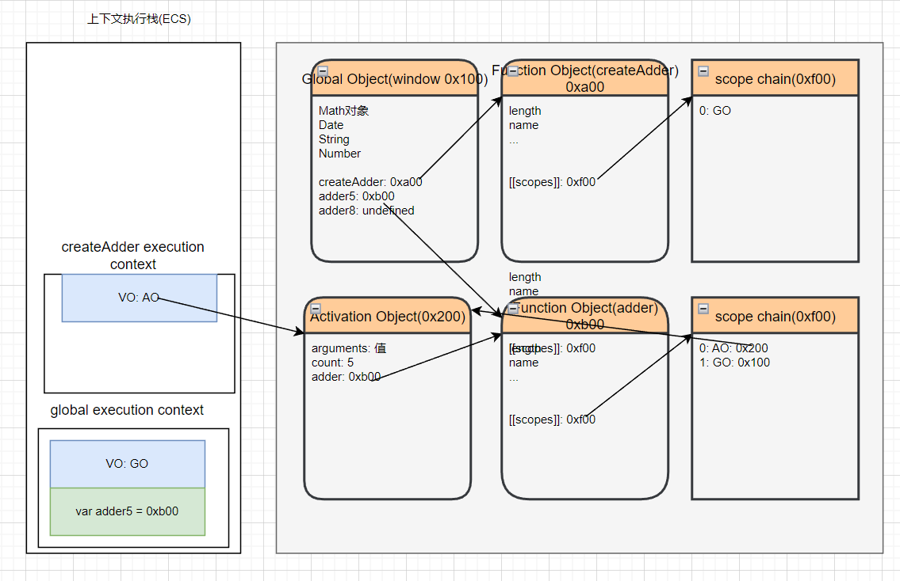

调用 createAdder 完成

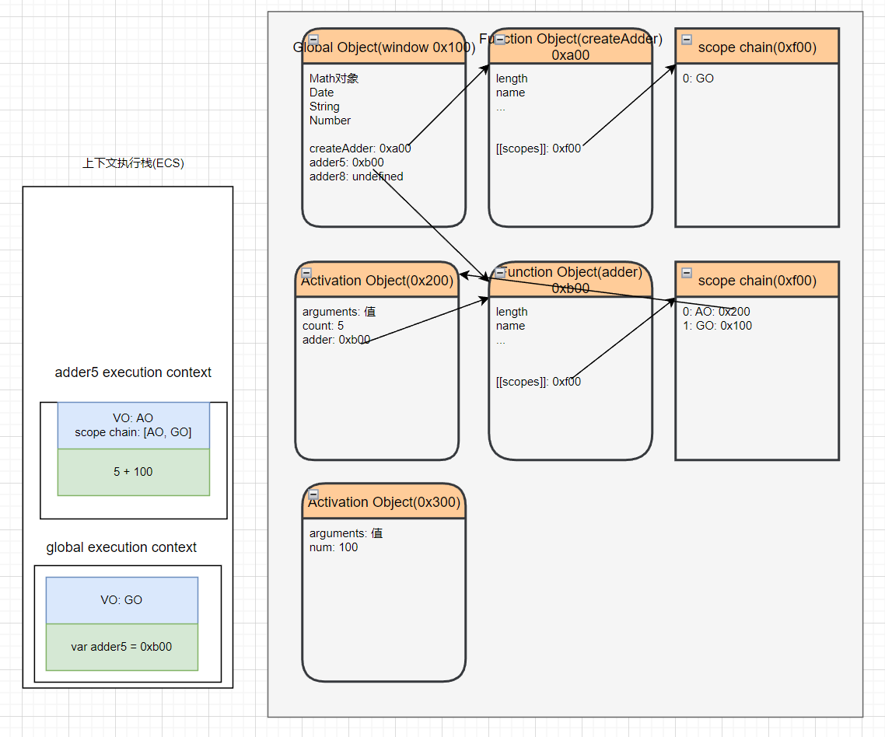

内部 adder 执行完成

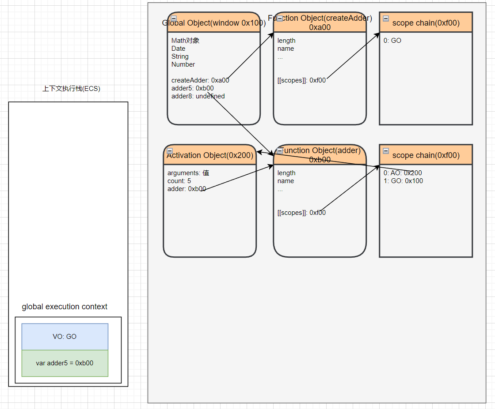

第二次执行 createAdder

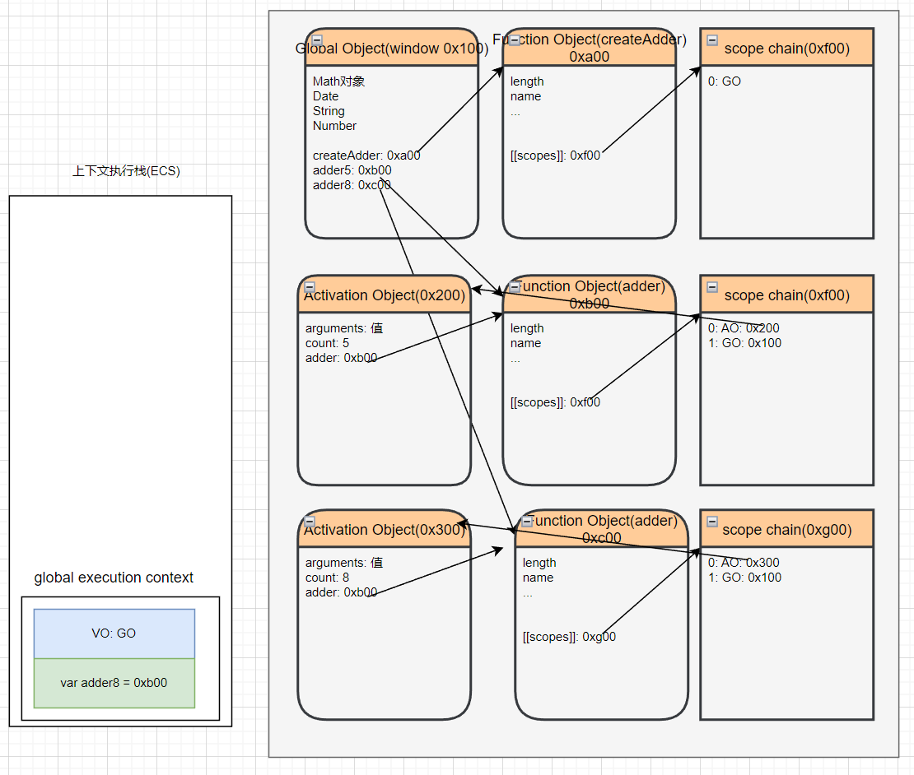

## 闭包的内存泄漏

那么我们为什么经常会说闭包是有内存泄露的呢？

在上面的案例中，如果后续我们不再使用 add8 函数了，那么该函数对象应该要被销毁掉，并且其引用着的父作用域 AO 也应该被销毁掉；

但是目前因为在全局作用域下 add8 变量对 0xb00 的函数对象有引用，而 0xb00 的作用域中 AO（0x200）有引用，所以最终 会造成这些内存都是无法被释放的；

所以我们经常说的闭包会造成内存泄露，其实就是刚才的引用链中的所有对象都是无法释放的；

那么，怎么解决这个问题呢？

因为当将 add8 设置为 null 时，就不再对函数对象 0xb00 有引用，那么对应的 AO 对象 0x200 也就不可达了；

在 GC 的下一次检测中，它们就会被销毁掉；

```javascript
function createAdder(count) {
  function adder(num) {
    return count + num;
  }

  return adder;
}

var adder5 = createAdder(5);
adder5(100);
adder5(55);
adder5(12);

var adder8 = createAdder(8);
adder8(22);
adder8(35);
adder8(7);

console.log(adder5(24));
console.log(adder8(30));

// 永远不会再使用adder8
// 内存泄漏: 对于那些我们永远不会再使用的对象, 但是对于GC来说, 它不知道要进行释放的对应内存会依然保留着
adder8 = null;
```

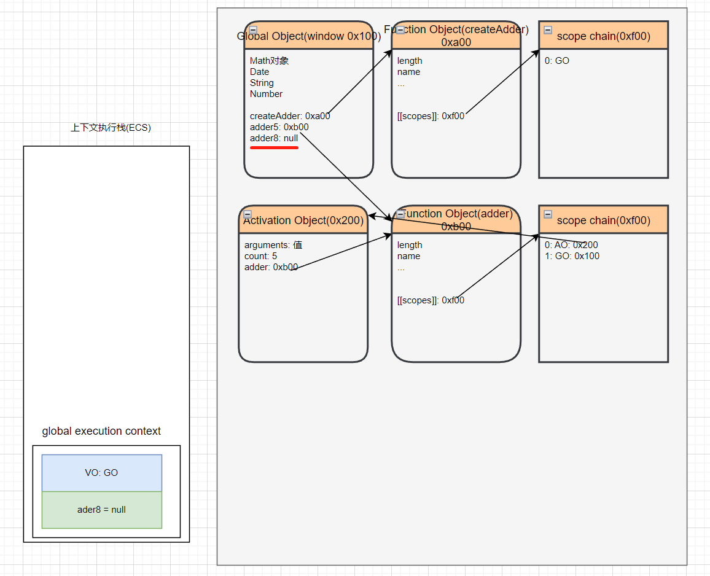

## 闭包的内存泄漏测试

```html
<button class="create">创建一系列的数组对象</button>
<button class="destroy">销毁一系列的数组对象</button>
```

```javascript
function createArray() {
  // 4 1024 -> 4kb * 1024 -> 4M
  var arr = new Array(1024 * 1024).fill(1);

  function test() {
    console.log(arr);
  }

  return test;
}

// 点击按钮
var totalArr = [];

var createBtnEl = document.querySelector(".create");
var destroyBtnEl = document.querySelector(".destroy");
createBtnEl.onclick = function () {
  for (var i = 0; i < 100; i++) {
    totalArr.push(createArray());
  }
  console.log(totalArr.length);
};
destroyBtnEl.onclick = function () {
  totalArr = [];
};
```

我们可以在浏览器的 Memory 观察内存的变化，一开始为 1.2M

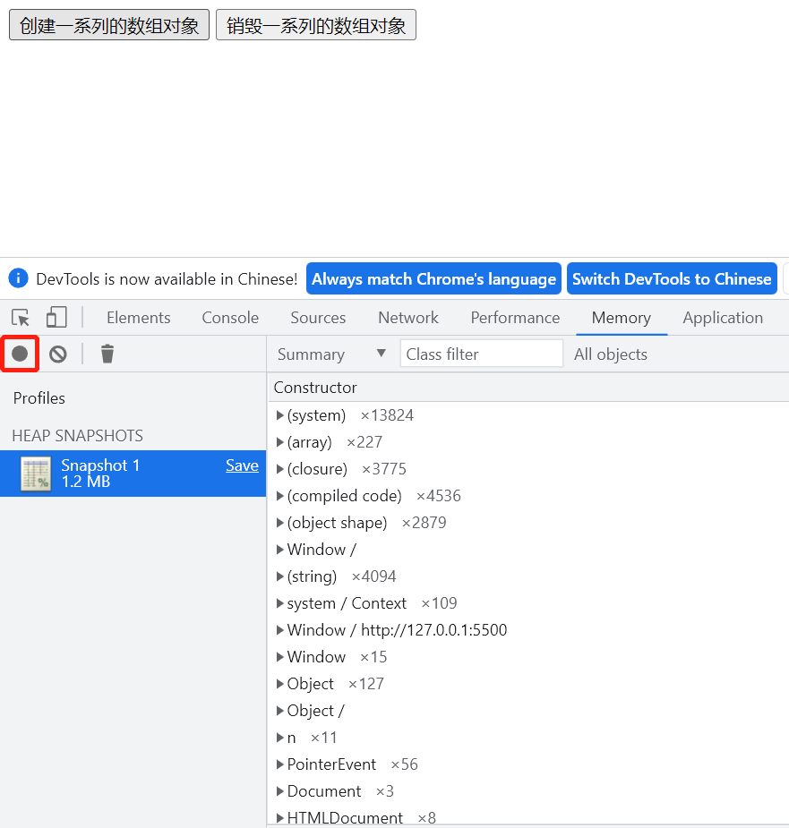

然后点击创建一系列的数组对象，内存就增加了，变成 420M

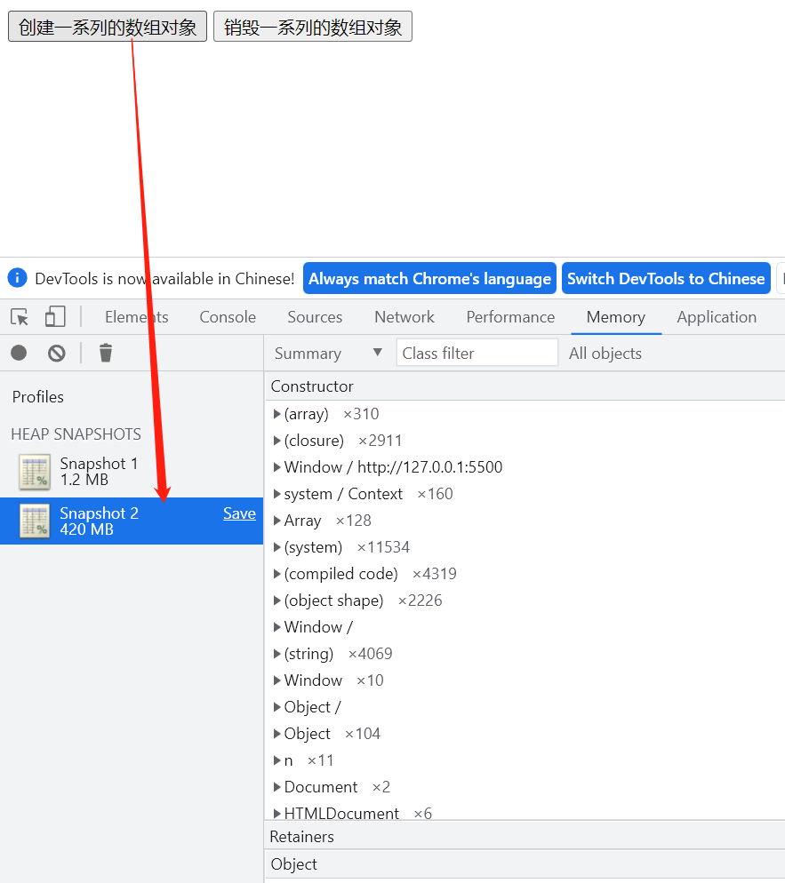

当点击销毁一系列的数组对象，内存又变成和原来差不多大


## AO 不使用的属性优化

我们来研究一个问题：AO 对象不会被销毁时，是否里面的所有属性都不会被释放？

下面这段代码，在 bar 函数内部只使用到了 name，age 和 height 并没有用到，那么形成闭包之后，age 和 height 是否会被销毁呢？

```javascript
function foo() {
  var name = "foo";
  var age = 18;
  var height = 1.88;

  function bar() {
    debugger;
    console.log(name);
  }

  return bar;
}

var fn = foo();
fn();
```

我们在 bar 函数内部打个断点，bar 函数的作用域只能看到 name 属性

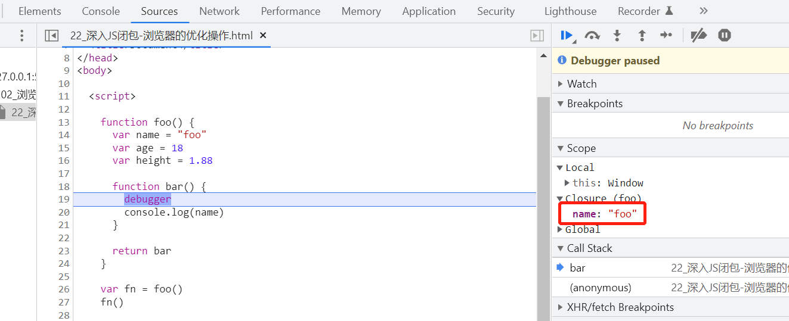

在控制台输入 name 可以找到，但是输入 age 和 height 却报 undefined 的错误

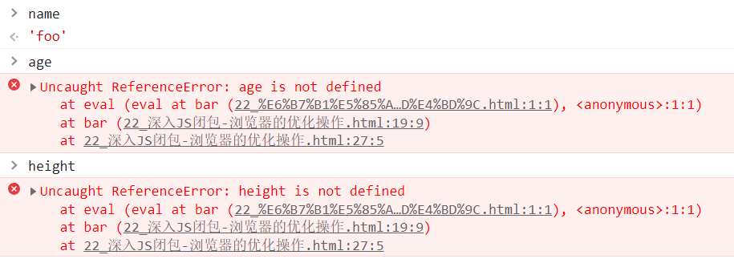
