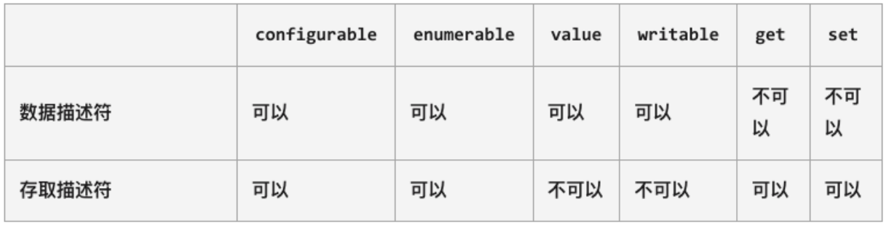

## 对属性操作的控制

在前面我们的属性都是直接定义在对象内部，或者直接添加到对象内部的：

但是这样来做的时候我们就不能对这个属性进行一些限制：比如这个属性是否是可以通过 delete 删除的？这个属性是否在 for-in 遍历的时候被遍历出来呢？

如果我们想要对一个属性进行比较精准的操作控制，那么我们就可以使用属性描述符。

通过属性描述符可以精准的添加或修改对象的属性；

属性描述符需要使用 Object.defineProperty 来对属性进行添加或者修改；

## Object.defineProperty

Object.defineProperty() 方法会直接在一个对象上定义一个新属性，或者修改一个对象的现有属性，并返回此对象。

```javascript
Object.defineProperty(obj, prop, descrptor);
```

可接收三个参数：

obj 要定义属性的对象；

prop 要定义或修改的属性的名称或 Symbol；

descriptor 要定义或修改的属性描述符；

返回值：

被传递给函数的对象。

## 属性描述符分类

属性描述符的类型有两种：

数据属性（Data Properties）描述符（Descriptor）；

存取属性（Accessor 访问器 Properties）描述符（Descriptor）；



## 数据属性描述符

数据数据描述符有如下四个特性：

[[Configurable]]：表示属性是否可以通过 delete 删除属性，是否可以修改它的特性，或者是否可以将它修改为存取属性描述符；

当我们直接在一个对象上定义某个属性时，这个属性的[[Configurable]]为 true；

当我们通过属性描述符定义一个属性时，这个属性的[[Configurable]]默认为 false；

[[Enumerable]]：表示属性是否可以通过 for-in 或者 Object.keys()返回该属性；

当我们直接在一个对象上定义某个属性时，这个属性的[[Enumerable]]为 true；

当我们通过属性描述符定义一个属性时，这个属性的[[Enumerable]]默认为 false；

[[Writable]]：表示是否可以修改属性的值；

当我们直接在一个对象上定义某个属性时，这个属性的[[Writable]]为 true；

当我们通过属性描述符定义一个属性时，这个属性的[[Writable]]默认为 false；

[[value]]：属性的 value 值，读取属性时会返回该值，修改属性时，会对其进行修改；

默认情况下这个值是 undefined；

```javascript
var obj = {
  name: "why", // configurable: true
  age: 18,
};

Object.defineProperty(obj, "name", {
  configurable: false, // 告诉js引擎, obj对象的name属性不可以被删除
  enumerable: false, // 告诉js引擎, obj对象的name属性不可枚举(for in/Object.keys)
  writable: false, // 告诉js引擎, obj对象的name属性不写入(只读属性 readonly)
  value: "coderwhy", // 告诉js引擎, 返回这个value
});

delete obj.name;
console.log(obj);

// 通过Object.defineProperty添加一个新的属性
Object.defineProperty(obj, "address", {});
delete obj.address;
console.log(obj);

console.log(Object.keys(obj));

obj.name = "kobe";
console.log(obj.name);
```

## 存取属性描述符

数据数据描述符有如下四个特性：

[[Configurable]]：表示属性是否可以通过 delete 删除属性，是否可以修改它的特性，或者是否可以将它修改为存取属性描述符；  和数据属性描述符是一致的；

当我们直接在一个对象上定义某个属性时，这个属性的[[Configurable]]为 true；

当我们通过属性描述符定义一个属性时，这个属性的[[Configurable]]默认为 false；

[[Enumerable]]：表示属性是否可以通过 for-in 或者 Object.keys()返回该属性；

和数据属性描述符是一致的；

当我们直接在一个对象上定义某个属性时，这个属性的[[Enumerable]]为 true；

当我们通过属性描述符定义一个属性时，这个属性的[[Enumerable]]默认为 false；

[[get]]：获取属性时会执行的函数。默认为 undefined

[[set]]：设置属性时会执行的函数。默认为 undefined

```javascript
// vue2响应式原理
var obj = {
  name: "why",
};

// 对obj对象中的name添加描述符(存取属性描述符)
var _name = "";
Object.defineProperty(obj, "name", {
  configurable: true,
  enumerable: false,
  set: function (value) {
    console.log("set方法被调用了", value);
    _name = value;
  },
  get: function () {
    console.log("get方法被调用了");
    return _name;
  },
});

obj.name = "kobe";
obj.name = "jame";
obj.name = "curry";
obj.name = "coderwhy";

// 获取值
console.log(obj.name);
```

## 同时定义多个属性

Object.defineProperties() 方法直接在一个对象上定义 多个 新的属性或修改现有属性，并且返回该对象。

```javascript
var obj = {
  name: "why",
  age: 18,
  height: 1.88,
};

// Object.defineProperty(obj, "name", {})
// Object.defineProperty(obj, "age", {})
// Object.defineProperty(obj, "height", {})

// 新增的方法
Object.defineProperties(obj, {
  name: {
    configurable: true,
    enumerable: true,
    writable: false,
  },
  age: {},
  height: {},
});
```

## 对象方法补充

获取对象的属性描述符：

getOwnPropertyDescriptor

getOwnPropertyDescriptors

禁止对象扩展新属性：preventExtensions

给一个对象添加新的属性会失败（在严格模式下会报错）；

密封对象，不允许配置和删除属性：seal

实际是调用 preventExtensions

并且将现有属性的 configurable:false

冻结对象，不允许修改现有属性： freeze

实际上是调用 seal

并且将现有属性的 writable: false

```javascript
var obj = {
  name: "why",
  age: 18,
};

// 1.获取属性描述符
console.log(Object.getOwnPropertyDescriptor(obj, "name"));
console.log(Object.getOwnPropertyDescriptors(obj));

// 2.阻止对象的扩展
Object.preventExtensions(obj);
obj.address = "广州市";
console.log(obj);

// 3.密封对象(不能进行配置)
Object.seal(obj);
delete obj.name;
console.log(obj);

// 4.冻结对象(不能进行写入)
Object.freeze(obj);
obj.name = "kobe";
console.log(obj);
```
