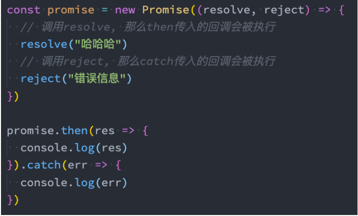

## 异步代码的困境

**在 ES6 出来之后，有很多关于 Promise 的讲解、文章，也有很多经典的书籍讲解 Promise**

虽然等你学会 Promise 之后，会觉得 Promise 不过如此；

但是在初次接触的时候都会觉得这个东西不好理解；

**那么这里我从一个实际的例子来作为切入点：**

我们调用一个函数，这个函数中发送网络请求（我们可以用定时器来模拟）；

如果发送网络请求成功了，那么告知调用者发送成功，并且将相关数据返回过去；

如果发送网络请求失败了，那么告知调用者发送失败，并且告知错误信息；

```javascript
// 1.设计这样的一个函数
function execCode(counter, successCallback, failureCallback) {
  // 异步任务
  setTimeout(() => {
    if (counter > 0) {
      // counter可以计算的情况
      let total = 0;
      for (let i = 0; i < counter; i++) {
        total += i;
      }
      // 在某一个时刻只需要回调传入的函数
      successCallback(total);
    } else {
      // 失败情况, counter有问题
      failureCallback(`${counter}值有问题`);
    }
  }, 3000);
}

// 2.ES5之前,处理异步的代码都是这样封装
execCode(
  100,
  (value) => {
    console.log("本次执行成功了:", value);
  },
  (err) => {
    console.log("本次执行失败了:", err);
  }
);
```

设计这样一个函数并不好设计，很难形成一个统一规范；调用者也不好调用，需要知道是怎么设计才能调用。比如把 counter 参数放在中间，就不一样。

## Promise 解决异步处理

```javascript
function execCode(counter) {
  const promise = new Promise((resolve, reject) => {
    // 异步任务
    setTimeout(() => {
      if (counter > 0) {
        // counter可以计算的情况
        let total = 0;
        for (let i = 0; i < counter; i++) {
          total += i;
        }
        // 成功的回调
        resolve(total);
      } else {
        // 失败情况, counter有问题
        // 失败的回调
        reject(`${counter}有问题`);
      }
    }, 3000);
  });

  return promise;
}

const promise = execCode(100);
promise.then((value) => {
  console.log("成功有了结果: ", value);
});
promise.catch((err) => {
  console.log("失败有了错误: ", err);
});

const promise2 = execCode(-100);
promise2.then((value) => {
  console.log("成功:", value);
});
promise2.catch((err) => {
  console.log("失败:", err);
});

// 执行一次
execCode(255)
  .then((value) => {
    console.log("成功:", value);
  })
  .catch((err) => {
    console.log("失败:", err);
  });
```

## **Promise 的代码结构**

**我们来看一下 Promise 代码结构：**



**上面 Promise 使用过程，我们可以将它划分成三个状态：**

_待定（pending）_: 初始状态，既没有被兑现，也没有被拒绝；

当执行 executor 中的代码时，处于该状态；

_已兑现（fulfilled）_: 意味着操作成功完成；

执行了 resolve 时，处于该状态，Promise 已经被兑现；

_已拒绝（rejected）_: 意味着操作失败；

执行了 reject 时，处于该状态，Promise 已经被拒绝；

```javascript
// 1.创建一个Promise对象
const promise = new Promise((resolve, reject) => {
  // 注意: Promise的状态一旦被确定下来, 就不会再更改, 也不能再执行某一个回调函数来改变状态
  // 1.待定状态 pending
  console.log("111111");
  console.log("222222");
  console.log("333333");

  // 2.兑现状态 fulfilled
  resolve();

  // 3.拒绝状态 rejected
  reject(); // 这里不会触发catch的回调函数，因为状态已经确定了
});

promise
  .then((value) => {
    console.log("成功的回调");
  })
  .catch((err) => {
    console.log("失败的回调");
  });
```

## **Executor**

**Executor 是在创建 Promise 时需要传入的一个回调函数，这个回调函数会被立即执行，并且传入两个参数：**

```javascript
// executor
const promise2 = new Promise((resolve, reject) => {});
```

**通常我们会在 Executor 中确定我们的 Promise 状态：**

通过 resolve，可以兑现（fulfilled）Promise 的状态，我们也可以称之为已决议（resolved）；

通过 reject，可以拒绝（reject）Promise 的状态；

**这里需要注意：一旦状态被确定下来，Promise 的状态会被 锁死，该 Promise 的状态是不可更改的**

在我们调用 resolve 的时候，如果 resolve 传入的值本身不是一个 Promise，那么会将该 Promise 的状态变成 兑现（fulfilled）；

在之后我们去调用 reject 时，已经不会有任何的响应了（并不是这行代码不会执行，而是无法改变 Promise 状态）；

## **resolve 不同值的区别**

**情况一：如果 resolve 传入一个普通的值或者对象，那么这个值会作为 then 回调的参数；**

```javascript
const promise = new Promise((resolve, reject) => {
  // 1.普通值
  resolve([
    { name: "macbook", price: 9998, intro: "有点贵" },
    { name: "iPhone", price: 9.9, intro: "有点便宜" },
  ]);
});

promise.then((res) => {
  console.log("then中拿到结果:", res);
});
```

**情况二：如果 resolve 中传入的是另外一个 Promise，那么这个新 Promise 会决定原 Promise 的状态：**

```javascript
const p = new Promise((resolve) => {
  // setTimeout(resolve, 2000)
  setTimeout(() => {
    resolve("p的resolve");
  }, 2000);
});

const promise = new Promise((resolve, reject) => {
  // 2.resolve(promise)
  // 如果resolve的值本身Promise对象, 那么当前的Promise的状态会有传入的Promise来决定
  resolve(p);
});

promise.then((res) => {
  console.log("then中拿到结果:", res);
});
```

**情况三：如果 resolve 中传入的是一个对象，并且这个对象有实现 then 方法，那么会执行该 then 方法，并且根据 then 方法的结果来决定 Promise 的状态：**

```javascript
const promise = new Promise((resolve, reject) => {
  // 3.resolve(thenable对象)
  resolve({
    name: "kobe",
    then: function (resolve) {
      resolve(11111);
    },
  });
});

promise.then((res) => {
  console.log("then中拿到结果:", res);
});
```

## **then 方法 – 接受两个参数**

**then 方法是 Promise 对象上的一个方法（实例方法）：**

它其实是放在 Promise 的原型上的 Promise.prototype.then

**then 方法接受两个参数：**

fulfilled 的回调函数：当状态变成 fulfilled 时会回调的函数；

reject 的回调函数：当状态变成 reject 时会回调的函数；

```javascript
const promise = new Promise((resolve, reject) => {
  resolve("success");
  // reject("failure")
});

// 推荐这种写法
promise.then((res) => {}).catch((err) => {});

// 1.then参数的传递方法: 可以传递两个参数
// 这种写法也是可以的
promise.then(
  (res) => {
    console.log("成功回调~", res);
  },
  (err) => {
    console.log("失败回调~", err);
  }
);
```

## **then 方法 – 多次调用**

**一个 Promise 的 then 方法是可以被多次调用的：**

每次调用我们都可以传入对应的 fulfilled 回调；

当 Promise 的状态变成 fulfilled 的时候，这些回调函数都会被执行；

```javascript
const promise = new Promise((resolve, reject) => {
  resolve("success");
  // reject("failure")
});

promise.then((res) => {
  console.log("成功回调~", res);
});
promise.then((res) => {
  console.log("成功回调~", res);
});
promise.then((res) => {
  console.log("成功回调~", res);
});
promise.then((res) => {
  console.log("成功回调~", res);
});
```

## **catch 方法 – 多次调用**

**catch 方法也是 Promise 对象上的一个方法（实例方法）：**

它也是放在 Promise 的原型上的 Promise.prototype.catch

**一个 Promise 的 catch 方法是可以被多次调用的：**

每次调用我们都可以传入对应的 reject 回调；

当 Promise 的状态变成 reject 的时候，这些回调函数都会被执行；

```javascript
const promise = new Promise((resolve, reject) => {
  reject("failure");
});

promise
  .then((res) => {
    console.log("成功的回调:", res);
  })
  .catch((err) => {
    console.log("失败的回调:", err);
  });

promise.catch((err) => {
  console.log("失败的回调:", err);
});
promise.catch((err) => {
  console.log("失败的回调:", err);
});
promise.catch((err) => {
  console.log("失败的回调:", err);
});
promise.catch((err) => {
  console.log("失败的回调:", err);
});
```

## **then 方法 – 返回值**

**then 方法本身是有返回值的，它的返回值是一个 Promise，所以我们可以进行如下的链式调用：**

但是 then 方法返回的 Promise 到底处于什么样的状态呢？

**Promise 有三种状态，那么这个 Promise 处于什么状态呢？**

当 then 方法中的回调函数本身在执行的时候，那么它处于 pending 状态；

当 then 方法中的回调函数返回一个结果时；

情况一：返回一个普通的值，那么它处于 fulfilled 状态，并且会将结果作为 resolve 的参数；

情况二：返回一个 Promise；

情况三：返回一个 thenable 值；

当 then 方法抛出一个异常时，那么它处于 reject 状态；

```javascript
const promise = new Promise((resolve, reject) => {
  resolve("aaaaaaa");
  // reject()
});

// 1.then方法是返回一个新的Promise, 这个新Promise的决议是等到then方法传入的回调函数有返回值时, 进行决议
// Promise本身就是支持链式调用
// then方法是返回一个新的Promise, 链式中的then是在等待这个新的Promise有决议之后执行的
promise
  .then((res) => {
    console.log("第一个then方法:", res); // aaaaaaa
    return "bbbbbbbb"; // 本质上是resolve("bbbbbbbb")
  })
  .then((res) => {
    console.log("第二个then方法:", res); // bbbbbbbb
    return "cccccccc";
  })
  .then((res) => {
    console.log("第三个then方法:", res); // cccccccc
  });

promise.then((res) => {
  console.log("添加第二个then方法:", res);
});

// 2.then方法传入回调函数的返回值类型
const newPromise = new Promise((resolve, reject) => {
  setTimeout(() => {
    resolve("why");
  }, 3000);
});

promise
  .then((res) => {
    console.log("第一个Promise的then方法:", res);
    // 1.普通值
    // return "bbbbbbb" 相当于resolve("bbbbbbb")
    // 2.新的Promise
    // return newPromise 相当于resolve(newPromise)
    // 3.thenable的对象
    return {
      then: function (resolve) {
        resolve("thenable");
      },
    };
  })
  .then((res) => {
    console.log("第二个Promise的then方法:", res); // thenable
  });
```

## **catch 方法 – 返回值**

**事实上 catch 方法也是会返回一个 Promise 对象的，所以 catch 方法后面我们可以继续调用 then 方法或者 catch 方法：**

```javascript
const promise = new Promise((resolve, reject) => {
  // reject("error: aaaaa")
  resolve("aaaaaa");
});

// 1.catch方法也会返回一个新的Promise
promise
  .catch((err) => {
    console.log("catch回调:", err);
    return "bbbbb";
  })
  .then((res) => {
    console.log("then第一个回调:", res); // bbbbb
    return "ccccc";
  })
  .then((res) => {
    console.log("then第二个回调:", res); // ccccc
  });
```

下面代码在 promise 里面 reject 了，那么 then 方法都不会触发，会调用 catch，所以会打印 catch 回调被执行: error: aaaaa，在 catch 之前有 4 个 promise，它会捕获最近的一个 reject，但是在 then 方法里面没有办法写 reject，我们可以使用 throw 抛出一个错误。

```javascript
const promise = new Promise((resolve, reject) => {
  reject("error: aaaaa");
});

// 2.catch方法的执行时机
promise
  .then((res) => {
    console.log("then第一次回调:", res);
    throw new Error("第二个Promise的异常error");
    return "bbbbbb";
  })
  .then((res) => {
    console.log("then第二次回调:", res);
    throw new Error("第三个Promise的异常error");
  })
  .then((res) => {
    console.log("then第三次回调:", res);
  })
  .catch((err) => {
    console.log("catch回调被执行:", err); // "error: aaaaa" 刚开始就reject了
  });
```

```javascript
const promise = new Promise((resolve, reject) => {
  // reject("error: aaaaa")
  resolve("aaaaaa");
});

// 2.catch方法的执行时机
promise
  .then((res) => {
    console.log("then第一次回调:", res); // 这里会打印
    // throw new Error("第二个Promise的异常error")
    return "bbbbbb";
  })
  .then((res) => {
    console.log("then第二次回调:", res); // 这里也会打印
    throw new Error("第三个Promise的异常error");
  })
  .then((res) => {
    console.log("then第三次回调:", res); // 这里不会打印，上一个then返回的promise抛出错误了，相当于reject
  })
  .catch((err) => {
    console.log("catch回调被执行:", err); // 这里第一个reject了就打印 第三个Promise的异常error
  });
```

## **finally 方法**

**finally 是在 ES9（ES2018）中新增的一个特性：表示无论 Promise 对象无论变成 fulfilled 还是 rejected 状态，最终都会被执行**

**的代码。**

**finally 方法是不接收参数的，因为无论前面是 fulfilled 状态，还是 rejected 状态，它都会执行。**

```javascript
const promise = new Promise((resolve, reject) => {
  // pending

  // fulfilled
  resolve("aaaa");

  // rejected
  // reject("bbbb")
});

promise
  .then((res) => {
    console.log("then:", res);
    // foo()
  })
  .catch((err) => {
    console.log("catch:", err);
    // foo()
  })
  .finally(() => {
    console.log("哈哈哈哈");
    console.log("呵呵呵呵");
  });

function foo() {
  console.log("哈哈哈哈");
  console.log("呵呵呵呵");
}
```

## Promise 类方法 - resolve 方法

**前面我们学习的 then、catch、finally 方法都属于 Promise 的实例方法，都是存放在 Promise 的 prototype 上的。**

下面我们再来学习一下 Promise 的类方法。

**有时候我们已经有一个现成的内容了，希望将其转成 Promise 来使用，这个时候我们可以使用 Promise.resolve 方法来完成。**

Promise.resolve 的用法相当于 new Promise，并且执行 resolve 操作：

```javascript
// 实例方法
// const promise = new Promise((resolve) => {
//   // 进行一系列的操作
//   resolve("result")
// })
// promise.catch

// 类方法
const studentList = [];
const promise = Promise.resolve(studentList);

promise.then((res) => {
  console.log("then结果:", res);
});
// Promise.resolve("Hello World")
// 相当于
// new Promise((resolve) => {
//   resolve("Hello World")
// })
```

**resolve 参数的形态：**

情况一：参数是一个普通的值或者对象

情况二：参数本身是 Promise

情况三：参数是一个 thenable

## Promise 类方法 - **reject 方法**

**reject 方法类似于 resolve 方法，只是会将 Promise 对象的状态设置为 reject 状态。**

**Promise.reject 的用法相当于 new Promise，只是会调用 reject：**

```javascript
// 类方法
const promise = Promise.reject("rejected error");
promise.catch((err) => {
  console.log("err:", err);
});
// 相当于
// new Promise((_, reject) => {
//   reject("rejected error")
// })
```

**Promise.reject 传入的参数无论是什么形态，都会直接作为 reject 状态的参数传递到 catch 的。**

## Promise 类方法 - **all 方法**

**另外一个类方法是 Promise.all：**

它的作用是将多个 Promise 包裹在一起形成一个新的 Promise；

新的 Promise 状态由包裹的所有 Promise 共同决定：

当所有的 Promise 状态变成 fulfilled 状态时，新的 Promise 状态为 fulfilled，并且会将所有 Promise 的返回值组成一个数组；

当有一个 Promise 状态为 reject 时，新的 Promise 状态为 reject，并且会将第一个 reject 的返回值作为参数；

```javascript
// 创建三个Promise
const p1 = new Promise((resolve, reject) => {
  setTimeout(() => {
    // resolve("p1 resolve")
    reject("p1 reject error");
  }, 3000);
});

const p2 = new Promise((resolve, reject) => {
  setTimeout(() => {
    resolve("p2 resolve");
  }, 2000);
});

const p3 = new Promise((resolve, reject) => {
  setTimeout(() => {
    resolve("p3 resolve");
  }, 5000);
});

// all:全部/所有
Promise.all([p1, p2, p3])
  .then((res) => {
    console.log("all promise res:", res); // 三个都是resolve的情况下会返回一个数组
  })
  .catch((err) => {
    console.log("all promise err:", err); // 中间只要有一个reject，最终会变成reject
  });
```

## Promise 类方法 - allSettled 方法

**all 方法有一个缺陷：当有其中一个 Promise 变成 reject 状态时，新 Promise 就会立即变成对应的 reject 状态。**

那么对于 resolved 的，以及依然处于 pending 状态的 Promise，我们是获取不到对应的结果的；

**在 ES11（ES2020）中，添加了新的 API Promise.allSettled：**

该方法会在所有的 Promise 都有结果（settled），无论是 fulfilled，还是 rejected 时，才会有最终的状态；

并且这个 Promise 的结果一定是 fulfilled 的；

```javascript
// 创建三个Promise
const p1 = new Promise((resolve, reject) => {
  setTimeout(() => {
    // resolve("p1 resolve")
    reject("p1 reject error");
  }, 3000);
});

const p2 = new Promise((resolve, reject) => {
  setTimeout(() => {
    resolve("p2 resolve");
  }, 2000);
});

const p3 = new Promise((resolve, reject) => {
  setTimeout(() => {
    resolve("p3 resolve");
  }, 5000);
});

// 类方法: allSettled
Promise.allSettled([p1, p2, p3]).then((res) => {
  console.log("all settled:", res);
})[
  // 最终会打印
  ({ status: "rejected", reason: "p1 reject error" },
  { status: "fulfilled", value: "p2 resolve" },
  { status: "fulfilled", value: "p3 resolve" })
];
```

## **race 方法**

**如果有一个 Promise 有了结果，我们就希望决定最终新 Promise 的状态，那么可以使用 race 方法：**

race 是竞技、竞赛的意思，表示多个 Promise 相互竞争，谁先有结果，那么就使用谁的结果；

```javascript
// 创建三个Promise
const p1 = new Promise((resolve, reject) => {
  setTimeout(() => {
    resolve("p1 resolve");
    // reject("p1 reject error")
  }, 3000);
});

const p2 = new Promise((resolve, reject) => {
  setTimeout(() => {
    // resolve("p2 resolve")
    reject("p2 reject error");
  }, 2000);
});

const p3 = new Promise((resolve, reject) => {
  setTimeout(() => {
    resolve("p3 resolve");
  }, 5000);
});

// 类方法: race方法
// 特点: 会等到一个Promise有结果(无论这个结果是fulfilled还是rejected)
Promise.race([p1, p2, p3])
  .then((res) => {
    console.log("race promise:", res);
  })
  .catch((err) => {
    console.log("race promise err:", err); // p2 reject error 最先有结果
  });
```

## **any 方法**

**any 方法是 ES12 中新增的方法，和 race 方法是类似的：**

any 方法会等到一个 fulfilled 状态，才会决定新 Promise 的状态；

```javascript
// 创建三个Promise
const p1 = new Promise((resolve, reject) => {
  setTimeout(() => {
    resolve("p1 resolve");
  }, 3000);
});

const p2 = new Promise((resolve, reject) => {
  setTimeout(() => {
    reject("p2 reject error");
  }, 2000);
});

const p3 = new Promise((resolve, reject) => {
  setTimeout(() => {
    resolve("p3 resolve");
  }, 5000);
});

// 类方法: any方法
Promise.any([p1, p2, p3]).then((res) => {
  console.log("any promise res:", res); // p1 resolve 返回第一个resolve
});
```

如果所有的 Promise 都是 reject 的，那么也会等到所有的 Promise 都变成 rejected 状态；

**如果所有的 Promise 都是 reject 的，那么会报一个 AggregateError 的错误。**

```javascript
// 创建三个Promise
const p1 = new Promise((resolve, reject) => {
  setTimeout(() => {
    // resolve("p1 resolve")
    reject("p1 reject error");
  }, 3000);
});

const p2 = new Promise((resolve, reject) => {
  setTimeout(() => {
    // resolve("p2 resolve")
    reject("p2 reject error");
  }, 2000);
});

const p3 = new Promise((resolve, reject) => {
  setTimeout(() => {
    // resolve("p3 resolve")
    reject("p3 reject error");
  }, 5000);
});

// 类方法: any方法
Promise.any([p1, p2, p3])
  .then((res) => {
    console.log("any promise res:", res);
  })
  .catch((err) => {
    console.log("any promise err:", err); // any promise err: AggregateError: All promises were rejected
  });
```

## 手写 Promise

### 结构的设计

```javascript
const PROMISE_STATUS_PENDING = "pending";
const PROMISE_STATUS_FULFILLED = "fulfilled";
const PROMISE_STATUS_REJECTED = "rejected";

class HYPromise {
  constructor(executor) {
    this.status = PROMISE_STATUS_PENDING;
    this.value = undefined;
    this.reason = undefined;

    const resolve = (value) => {
      if (this.status === PROMISE_STATUS_PENDING) {
        this.status = PROMISE_STATUS_FULFILLED;
        this.value = value; // 保留传进来的参数1111
        console.log("resolve被调用");
      }
    };

    const reject = (reason) => {
      if (this.status === PROMISE_STATUS_PENDING) {
        this.status = PROMISE_STATUS_REJECTED;
        this.reason = reason; // 保留传进来的参数2222
        console.log("reject被调用");
      }
    };

    executor(resolve, reject);
  }
}

const promise = new HYPromise((resolve, reject) => {
  console.log("状态pending");
  resolve(1111); // 状态设计是为了保证resolve调用，后面的reject就不生效了；反之，如果reject先调用，resolve就不生效
  reject(2222);
});
```

先调用 resolve 状态就变成了 fulfilled，执行 reject，状态不是 pending，代码不会执行。

### then 方法设计

```javascript
const PROMISE_STATUS_PENDING = "pending";
const PROMISE_STATUS_FULFILLED = "fulfilled";
const PROMISE_STATUS_REJECTED = "rejected";

class HYPromise {
  constructor(executor) {
    this.status = PROMISE_STATUS_PENDING;
    this.value = undefined;
    this.reason = undefined;

    const resolve = (value) => {
      if (this.status === PROMISE_STATUS_PENDING) {
        this.status = PROMISE_STATUS_FULFILLED;
        queueMicrotask(() => {
          this.value = value;
          this.onFulfilled(this.value);
        });
      }
    };

    const reject = (reason) => {
      if (this.status === PROMISE_STATUS_PENDING) {
        this.status = PROMISE_STATUS_REJECTED;
        queueMicrotask(() => {
          this.reason = reason;
          this.onRejected(this.reason);
        });
      }
    };

    executor(resolve, reject);
  }

  then(onFulfilled, onRejected) {
    this.onFulfilled = onFulfilled;
    this.onRejected = onRejected;
  }
}

const promise = new HYPromise((resolve, reject) => {
  console.log("状态pending");
  // reject(2222)
  resolve(1111);
});

// 调用then方法
promise.then(
  (res) => {
    console.log("res:", res);
  },
  (err) => {
    console.log("err:", err);
  }
);
```

这里使用了 queueMicrotask 这个让要执行的代码变成微任务，就会延后执行。为什么要延后执行呢？

假如说不用 queueMicrotask，代码执行顺序是什么呢？

```javascript
class HYPromise {
  constructor(executor) {
    this.status = PROMISE_STATUS_PENDING;
    this.value = undefined;
    this.reason = undefined;

    const resolve = (value) => {
      if (this.status === PROMISE_STATUS_PENDING) {
        this.status = PROMISE_STATUS_FULFILLED;
        this.value = value;
        this.onFulfilled(this.value);
      }
    };

    const reject = (reason) => {
      if (this.status === PROMISE_STATUS_PENDING) {
        this.status = PROMISE_STATUS_REJECTED;
        this.reason = reason;
        this.onRejected(this.reason);
      }
    };

    executor(resolve, reject);
  }

  then(onFulfilled, onRejected) {
    this.onFulfilled = onFulfilled;
    this.onRejected = onRejected;
  }
}

const promise = new HYPromise((resolve, reject) => {
  console.log("状态pending");
  // reject(2222)
  resolve(1111);
});

// 调用then方法
promise.then(
  (res) => {
    console.log("res:", res);
  },
  (err) => {
    console.log("err:", err);
  }
);
```

执行 new HYPromise 会执行 resolve 方法，那么就会执行 this.onFulfilled 方法，但是这会根本没有这个方法，直接报错；所以需要保证执行 this.onFulfilled 方法的时候，promise.then 方法已经执行了才行。

### then 方法优化一

当前的 then 方法如果只调用一次是没有问题，但是如果调用多次，那么只会执行最后一次的调用。因为下一次的执行会把上一次的覆盖掉。

```javascript
// 调用then方法
promise.then(
  (res) => {
    console.log("res:", res);
  },
  (err) => {
    console.log("err:", err);
  }
);

promise.then(
  (res) => {
    console.log("res2:", res);
  },
  (err) => {
    console.log("err2:", err);
  }
);
```

如果调用多次，是应该将调用的函数存到数组里面，然后执行 resolve 或 reject 方法的时候，遍历数组执行里面的每个函数。

还有个问题，当 promise 状态确定之后，使用定时器延迟执行，那么这个时候是不会执行的。因为 resolve 或 reject 方法是要状态为 pending 的情况下才会执行。

那么就需要在 then 方法根据状态来进行调用。

```javascript
// 在确定Promise状态之后, 再次调用then
setTimeout(() => {
  promise.then(
    (res) => {
      console.log("res3:", res);
    },
    (err) => {
      console.log("err3:", err);
    }
  );
}, 1000);
```

针对上面两个问题，对代码进行优化。

```javascript
const PROMISE_STATUS_PENDING = "pending";
const PROMISE_STATUS_FULFILLED = "fulfilled";
const PROMISE_STATUS_REJECTED = "rejected";

class HYPromise {
  constructor(executor) {
    this.status = PROMISE_STATUS_PENDING;
    this.value = undefined;
    this.reason = undefined;
    this.onFulfilledFns = [];
    this.onRejectedFns = [];

    const resolve = (value) => {
      if (this.status === PROMISE_STATUS_PENDING) {
        // 添加微任务
        queueMicrotask(() => {
          if (this.status !== PROMISE_STATUS_PENDING) return; // 状态不是pending就返回，延迟执行的在then方法中执行
          this.status = PROMISE_STATUS_FULFILLED;
          this.value = value;
          this.onFulfilledFns.forEach((fn) => {
            // 这个是针对多次调用的优化
            fn(this.value);
          });
        });
      }
    };

    const reject = (reason) => {
      if (this.status === PROMISE_STATUS_PENDING) {
        // 添加微任务
        queueMicrotask(() => {
          if (this.status !== PROMISE_STATUS_PENDING) return;
          this.status = PROMISE_STATUS_REJECTED;
          this.reason = reason;
          this.onRejectedFns.forEach((fn) => {
            fn(this.reason);
          });
        });
      }
    };

    executor(resolve, reject);
  }

  then(onFulfilled, onRejected) {
    // 1.如果在then调用的时候, 状态已经确定下来 这个是针对状态确定下来的优化
    if (this.status === PROMISE_STATUS_FULFILLED && onFulfilled) {
      onFulfilled(this.value);
    }
    if (this.status === PROMISE_STATUS_REJECTED && onRejected) {
      onRejected(this.reason);
    }

    // 2.将成功回调和失败的回调放到数组中
    if (this.status === PROMISE_STATUS_PENDING) {
      this.onFulfilledFns.push(onFulfilled);
      this.onRejectedFns.push(onRejected);
    }
  }
}

const promise = new HYPromise((resolve, reject) => {
  console.log("状态pending");
  resolve(1111); // resolved/fulfilled
  reject(2222);
});

// 调用then方法多次调用
promise.then(
  (res) => {
    console.log("res1:", res);
  },
  (err) => {
    console.log("err:", err);
  }
);

promise.then(
  (res) => {
    console.log("res2:", res);
  },
  (err) => {
    console.log("err2:", err);
  }
);

// const promise = new Promise((resolve, reject) => {
//   resolve("aaaaa")
// })

// 在确定Promise状态之后, 再次调用then
setTimeout(() => {
  promise.then(
    (res) => {
      console.log("res3:", res);
    },
    (err) => {
      console.log("err3:", err);
    }
  );
}, 1000);
```

### then 方法优化二

需要支持 then 的链式调用，根据上一次 then 方法的返回结果决定下一个 then。

```javascript
const PROMISE_STATUS_PENDING = "pending";
const PROMISE_STATUS_FULFILLED = "fulfilled";
const PROMISE_STATUS_REJECTED = "rejected";

// 工具函数
function execFunctionWithCatchError(execFn, value, resolve, reject) {
  try {
    const result = execFn(value);
    resolve(result);
  } catch (err) {
    reject(err);
  }
}

class HYPromise {
  constructor(executor) {
    this.status = PROMISE_STATUS_PENDING;
    this.value = undefined;
    this.reason = undefined;
    this.onFulfilledFns = [];
    this.onRejectedFns = [];

    const resolve = (value) => {
      if (this.status === PROMISE_STATUS_PENDING) {
        // 添加微任务
        queueMicrotask(() => {
          if (this.status !== PROMISE_STATUS_PENDING) return;
          this.status = PROMISE_STATUS_FULFILLED;
          this.value = value;
          this.onFulfilledFns.forEach((fn) => {
            fn(this.value);
          });
        });
      }
    };

    const reject = (reason) => {
      if (this.status === PROMISE_STATUS_PENDING) {
        // 添加微任务
        queueMicrotask(() => {
          if (this.status !== PROMISE_STATUS_PENDING) return;
          this.status = PROMISE_STATUS_REJECTED;
          this.reason = reason;
          this.onRejectedFns.forEach((fn) => {
            fn(this.reason);
          });
        });
      }
    };

    try {
      executor(resolve, reject);
    } catch (err) {
      reject(err);
    }
  }

  then(onFulfilled, onRejected) {
    // 返回一个新的promise
    return new HYPromise((resolve, reject) => {
      // 1.如果在then调用的时候, 状态已经确定下来
      if (this.status === PROMISE_STATUS_FULFILLED && onFulfilled) {
        // try {
        //   const value = onFulfilled(this.value)
        //   resolve(value)
        // } catch(err) {
        //   reject(err)
        // }
        execFunctionWithCatchError(onFulfilled, this.value, resolve, reject);
      }
      if (this.status === PROMISE_STATUS_REJECTED && onRejected) {
        // try {
        //   const reason = onRejected(this.reason)
        //   resolve(reason)
        // } catch(err) {
        //   reject(err)
        // }
        execFunctionWithCatchError(onRejected, this.reason, resolve, reject);
      }

      // 2.将成功回调和失败的回调放到数组中
      if (this.status === PROMISE_STATUS_PENDING) {
        this.onFulfilledFns.push(() => {
          // 这里改造成回调函数，拿到上面返回的this.value
          // try {
          //   const value = onFulfilled(this.value)
          //   resolve(value)
          // } catch(err) {
          //   reject(err)
          // }
          execFunctionWithCatchError(onFulfilled, this.value, resolve, reject);
        });
        this.onRejectedFns.push(() => {
          // try {
          //   const reason = onRejected(this.reason)
          //   resolve(reason)
          // } catch(err) {
          //   reject(err)
          // }
          execFunctionWithCatchError(onRejected, this.reason, resolve, reject);
        });
      }
    });
  }
}

const promise = new HYPromise((resolve, reject) => {
  console.log("状态pending");
  // resolve(1111) // resolved/fulfilled
  reject(2222);
  // throw new Error("executor error message")
});

// 调用then方法多次调用
promise
  .then(
    (res) => {
      console.log("res1:", res);
      return "aaaa";
      // throw new Error("err message")
    },
    (err) => {
      console.log("err1:", err);
      return "bbbbb";
      // throw new Error("err message")
    }
  )
  .then(
    (res) => {
      console.log("res2:", res);
    },
    (err) => {
      console.log("err2:", err);
    }
  );
```

### catch 方法设计

```javascript
const PROMISE_STATUS_PENDING = "pending";
const PROMISE_STATUS_FULFILLED = "fulfilled";
const PROMISE_STATUS_REJECTED = "rejected";

// 工具函数
function execFunctionWithCatchError(execFn, value, resolve, reject) {
  try {
    const result = execFn(value);
    resolve(result);
  } catch (err) {
    reject(err);
  }
}

class HYPromise {
  constructor(executor) {
    this.status = PROMISE_STATUS_PENDING;
    this.value = undefined;
    this.reason = undefined;
    this.onFulfilledFns = [];
    this.onRejectedFns = [];

    const resolve = (value) => {
      if (this.status === PROMISE_STATUS_PENDING) {
        // 添加微任务
        queueMicrotask(() => {
          if (this.status !== PROMISE_STATUS_PENDING) return;
          this.status = PROMISE_STATUS_FULFILLED;
          this.value = value;
          this.onFulfilledFns.forEach((fn) => {
            fn(this.value);
          });
        });
      }
    };

    const reject = (reason) => {
      if (this.status === PROMISE_STATUS_PENDING) {
        // 添加微任务
        queueMicrotask(() => {
          if (this.status !== PROMISE_STATUS_PENDING) return;
          this.status = PROMISE_STATUS_REJECTED;
          this.reason = reason;
          this.onRejectedFns.forEach((fn) => {
            fn(this.reason);
          });
        });
      }
    };

    try {
      executor(resolve, reject);
    } catch (err) {
      reject(err);
    }
  }

  then(onFulfilled, onRejected) {
    // 默认函数抛出异常
    const defaultOnRejected = (err) => {
      throw err;
    };
    onRejected = onRejected || defaultOnRejected;

    return new HYPromise((resolve, reject) => {
      // 1.如果在then调用的时候, 状态已经确定下来
      if (this.status === PROMISE_STATUS_FULFILLED && onFulfilled) {
        execFunctionWithCatchError(onFulfilled, this.value, resolve, reject);
      }
      if (this.status === PROMISE_STATUS_REJECTED && onRejected) {
        execFunctionWithCatchError(onRejected, this.reason, resolve, reject);
      }

      // 2.将成功回调和失败的回调放到数组中
      if (this.status === PROMISE_STATUS_PENDING) {
        if (onFulfilled)
          this.onFulfilledFns.push(() => {
            // 这里需要判空
            execFunctionWithCatchError(
              onFulfilled,
              this.value,
              resolve,
              reject
            );
          });
        if (onRejected)
          this.onRejectedFns.push(() => {
            execFunctionWithCatchError(
              onRejected,
              this.reason,
              resolve,
              reject
            );
          });
      }
    });
  }

  catch(onRejected) {
    this.then(undefined, onRejected); // 可以直接调用then方法，第一个参数传undefined
  }
}

const promise = new HYPromise((resolve, reject) => {
  console.log("状态pending");
  // resolve(1111) // resolved/fulfilled
  reject(2222);
});

// 调用then方法多次调用
promise
  .then((res) => {
    console.log("res:", res);
  })
  .catch((err) => {
    console.log("err:", err);
  });
```

```javascript
promise.then(res => {
  console.log("res:", res)
})
这里没有传第2个参数，相当于undefined, 需要给一个默认函数，抛出一个异常，调用catch方法的时候才会触发reject
```

### finally 方法设计

```javascript
const PROMISE_STATUS_PENDING = "pending";
const PROMISE_STATUS_FULFILLED = "fulfilled";
const PROMISE_STATUS_REJECTED = "rejected";

// 工具函数
function execFunctionWithCatchError(execFn, value, resolve, reject) {
  try {
    const result = execFn(value);
    resolve(result);
  } catch (err) {
    reject(err);
  }
}

class HYPromise {
  constructor(executor) {
    this.status = PROMISE_STATUS_PENDING;
    this.value = undefined;
    this.reason = undefined;
    this.onFulfilledFns = [];
    this.onRejectedFns = [];

    const resolve = (value) => {
      if (this.status === PROMISE_STATUS_PENDING) {
        // 添加微任务
        queueMicrotask(() => {
          if (this.status !== PROMISE_STATUS_PENDING) return;
          this.status = PROMISE_STATUS_FULFILLED;
          this.value = value;
          this.onFulfilledFns.forEach((fn) => {
            fn(this.value);
          });
        });
      }
    };

    const reject = (reason) => {
      if (this.status === PROMISE_STATUS_PENDING) {
        // 添加微任务
        queueMicrotask(() => {
          if (this.status !== PROMISE_STATUS_PENDING) return;
          this.status = PROMISE_STATUS_REJECTED;
          this.reason = reason;
          this.onRejectedFns.forEach((fn) => {
            fn(this.reason);
          });
        });
      }
    };

    try {
      executor(resolve, reject);
    } catch (err) {
      reject(err);
    }
  }

  then(onFulfilled, onRejected) {
    const defaultOnRejected = (err) => {
      throw err;
    };
    onRejected = onRejected || defaultOnRejected;

    // 当调用catch方法时，onFulfilled为undefined，需要将值返回出去，才能执行finally
    const defaultOnFulfilled = (value) => {
      return value;
    };
    onFulfilled = onFulfilled || defaultOnFulfilled;

    return new HYPromise((resolve, reject) => {
      // 1.如果在then调用的时候, 状态已经确定下来
      if (this.status === PROMISE_STATUS_FULFILLED && onFulfilled) {
        execFunctionWithCatchError(onFulfilled, this.value, resolve, reject);
      }
      if (this.status === PROMISE_STATUS_REJECTED && onRejected) {
        execFunctionWithCatchError(onRejected, this.reason, resolve, reject);
      }

      // 2.将成功回调和失败的回调放到数组中
      if (this.status === PROMISE_STATUS_PENDING) {
        if (onFulfilled)
          this.onFulfilledFns.push(() => {
            execFunctionWithCatchError(
              onFulfilled,
              this.value,
              resolve,
              reject
            );
          });
        if (onRejected)
          this.onRejectedFns.push(() => {
            execFunctionWithCatchError(
              onRejected,
              this.reason,
              resolve,
              reject
            );
          });
      }
    });
  }

  catch(onRejected) {
    // 需要将catch方法的返回值传递出去
    return this.then(undefined, onRejected);
  }

  finally(onFinally) {
    this.then(
      () => {
        onFinally();
      },
      () => {
        onFinally();
      }
    );
  }
}

const promise = new HYPromise((resolve, reject) => {
  console.log("状态pending");
  resolve(1111); // resolved/fulfilled
  // reject(2222)
});

// 调用then方法多次调用
promise
  .then((res) => {
    console.log("res1:", res);
    return "aaaaa";
  })
  .then((res) => {
    console.log("res2:", res);
  })
  .catch((err) => {
    console.log("err:", err);
  })
  .finally(() => {
    console.log("finally");
  });
```

### resolve 和 reject 方法

```javascript
const PROMISE_STATUS_PENDING = "pending";
const PROMISE_STATUS_FULFILLED = "fulfilled";
const PROMISE_STATUS_REJECTED = "rejected";

// 工具函数
function execFunctionWithCatchError(execFn, value, resolve, reject) {
  try {
    const result = execFn(value);
    resolve(result);
  } catch (err) {
    reject(err);
  }
}

class HYPromise {
  constructor(executor) {
    this.status = PROMISE_STATUS_PENDING;
    this.value = undefined;
    this.reason = undefined;
    this.onFulfilledFns = [];
    this.onRejectedFns = [];

    const resolve = (value) => {
      if (this.status === PROMISE_STATUS_PENDING) {
        // 添加微任务
        queueMicrotask(() => {
          if (this.status !== PROMISE_STATUS_PENDING) return;
          this.status = PROMISE_STATUS_FULFILLED;
          this.value = value;
          this.onFulfilledFns.forEach((fn) => {
            fn(this.value);
          });
        });
      }
    };

    const reject = (reason) => {
      if (this.status === PROMISE_STATUS_PENDING) {
        // 添加微任务
        queueMicrotask(() => {
          if (this.status !== PROMISE_STATUS_PENDING) return;
          this.status = PROMISE_STATUS_REJECTED;
          this.reason = reason;
          this.onRejectedFns.forEach((fn) => {
            fn(this.reason);
          });
        });
      }
    };

    try {
      executor(resolve, reject);
    } catch (err) {
      reject(err);
    }
  }

  then(onFulfilled, onRejected) {
    const defaultOnRejected = (err) => {
      throw err;
    };
    onRejected = onRejected || defaultOnRejected;

    const defaultOnFulfilled = (value) => {
      return value;
    };
    onFulfilled = onFulfilled || defaultOnFulfilled;

    return new HYPromise((resolve, reject) => {
      // 1.如果在then调用的时候, 状态已经确定下来
      if (this.status === PROMISE_STATUS_FULFILLED && onFulfilled) {
        execFunctionWithCatchError(onFulfilled, this.value, resolve, reject);
      }
      if (this.status === PROMISE_STATUS_REJECTED && onRejected) {
        execFunctionWithCatchError(onRejected, this.reason, resolve, reject);
      }

      // 2.将成功回调和失败的回调放到数组中
      if (this.status === PROMISE_STATUS_PENDING) {
        if (onFulfilled)
          this.onFulfilledFns.push(() => {
            execFunctionWithCatchError(
              onFulfilled,
              this.value,
              resolve,
              reject
            );
          });
        if (onRejected)
          this.onRejectedFns.push(() => {
            execFunctionWithCatchError(
              onRejected,
              this.reason,
              resolve,
              reject
            );
          });
      }
    });
  }

  catch(onRejected) {
    return this.then(undefined, onRejected);
  }

  finally(onFinally) {
    this.then(
      () => {
        onFinally();
      },
      () => {
        onFinally();
      }
    );
  }

  // 直接调用HYPromise即可
  static resolve(value) {
    return new HYPromise((resolve) => resolve(value));
  }

  static reject(reason) {
    return new HYPromise((resolve, reject) => reject(reason));
  }
}

HYPromise.resolve("Hello World").then((res) => {
  console.log("res:", res);
});

HYPromise.reject("Error Message").catch((err) => {
  console.log("err:", err);
});
```

### all 和 allSettled 方法

```javascript
const PROMISE_STATUS_PENDING = "pending";
const PROMISE_STATUS_FULFILLED = "fulfilled";
const PROMISE_STATUS_REJECTED = "rejected";

// 工具函数
function execFunctionWithCatchError(execFn, value, resolve, reject) {
  try {
    const result = execFn(value);
    resolve(result);
  } catch (err) {
    reject(err);
  }
}

class HYPromise {
  constructor(executor) {
    this.status = PROMISE_STATUS_PENDING;
    this.value = undefined;
    this.reason = undefined;
    this.onFulfilledFns = [];
    this.onRejectedFns = [];

    const resolve = (value) => {
      if (this.status === PROMISE_STATUS_PENDING) {
        // 添加微任务
        queueMicrotask(() => {
          if (this.status !== PROMISE_STATUS_PENDING) return;
          this.status = PROMISE_STATUS_FULFILLED;
          this.value = value;
          this.onFulfilledFns.forEach((fn) => {
            fn(this.value);
          });
        });
      }
    };

    const reject = (reason) => {
      if (this.status === PROMISE_STATUS_PENDING) {
        // 添加微任务
        queueMicrotask(() => {
          if (this.status !== PROMISE_STATUS_PENDING) return;
          this.status = PROMISE_STATUS_REJECTED;
          this.reason = reason;
          this.onRejectedFns.forEach((fn) => {
            fn(this.reason);
          });
        });
      }
    };

    try {
      executor(resolve, reject);
    } catch (err) {
      reject(err);
    }
  }

  then(onFulfilled, onRejected) {
    const defaultOnRejected = (err) => {
      throw err;
    };
    onRejected = onRejected || defaultOnRejected;

    const defaultOnFulfilled = (value) => {
      return value;
    };
    onFulfilled = onFulfilled || defaultOnFulfilled;

    return new HYPromise((resolve, reject) => {
      // 1.如果在then调用的时候, 状态已经确定下来
      if (this.status === PROMISE_STATUS_FULFILLED && onFulfilled) {
        execFunctionWithCatchError(onFulfilled, this.value, resolve, reject);
      }
      if (this.status === PROMISE_STATUS_REJECTED && onRejected) {
        execFunctionWithCatchError(onRejected, this.reason, resolve, reject);
      }

      // 2.将成功回调和失败的回调放到数组中
      if (this.status === PROMISE_STATUS_PENDING) {
        if (onFulfilled)
          this.onFulfilledFns.push(() => {
            execFunctionWithCatchError(
              onFulfilled,
              this.value,
              resolve,
              reject
            );
          });
        if (onRejected)
          this.onRejectedFns.push(() => {
            execFunctionWithCatchError(
              onRejected,
              this.reason,
              resolve,
              reject
            );
          });
      }
    });
  }

  catch(onRejected) {
    return this.then(undefined, onRejected);
  }

  finally(onFinally) {
    this.then(
      () => {
        onFinally();
      },
      () => {
        onFinally();
      }
    );
  }

  static resolve(value) {
    return new HYPromise((resolve) => resolve(value));
  }

  static reject(reason) {
    return new HYPromise((resolve, reject) => reject(reason));
  }

  static all(promises) {
    // 问题关键: 什么时候要执行resolve, 什么时候要执行reject
    // 只要有一个reject就会reject，只有所有都是resolve才会resolve
    return new HYPromise((resolve, reject) => {
      const values = [];
      promises.forEach((promise) => {
        promise.then(
          (res) => {
            values.push(res);
            if (values.length === promises.length) {
              resolve(values);
            }
          },
          (err) => {
            reject(err);
          }
        );
      });
    });
  }

  // 不管成功失败，都是resolve，但是要等到每个promise都有结果
  static allSettled(promises) {
    return new HYPromise((resolve) => {
      const results = [];
      promises.forEach((promise) => {
        promise.then(
          (res) => {
            results.push({ status: PROMISE_STATUS_FULFILLED, value: res });
            if (results.length === promises.length) {
              resolve(results);
            }
          },
          (err) => {
            results.push({ status: PROMISE_STATUS_REJECTED, reason: err });
            if (results.length === promises.length) {
              resolve(results);
            }
          }
        );
      });
    });
  }
}

const p1 = new Promise((resolve) => {
  setTimeout(() => {
    resolve(1111);
  }, 1000);
});
const p2 = new Promise((resolve, reject) => {
  setTimeout(() => {
    reject(2222);
  }, 2000);
});
const p3 = new Promise((resolve) => {
  setTimeout(() => {
    resolve(3333);
  }, 3000);
});
// HYPromise.all([p1, p2, p3]).then(res => {
//   console.log(res)
// }).catch(err => {
//   console.log(err)
// })

HYPromise.allSettled([p1, p2, p3]).then((res) => {
  console.log(res);
});
```

### race 和 any 方法

```javascript
const PROMISE_STATUS_PENDING = "pending";
const PROMISE_STATUS_FULFILLED = "fulfilled";
const PROMISE_STATUS_REJECTED = "rejected";

// 工具函数
function execFunctionWithCatchError(execFn, value, resolve, reject) {
  try {
    const result = execFn(value);
    resolve(result);
  } catch (err) {
    reject(err);
  }
}

class HYPromise {
  constructor(executor) {
    this.status = PROMISE_STATUS_PENDING;
    this.value = undefined;
    this.reason = undefined;
    this.onFulfilledFns = [];
    this.onRejectedFns = [];

    const resolve = (value) => {
      if (this.status === PROMISE_STATUS_PENDING) {
        // 添加微任务
        queueMicrotask(() => {
          if (this.status !== PROMISE_STATUS_PENDING) return;
          this.status = PROMISE_STATUS_FULFILLED;
          this.value = value;
          this.onFulfilledFns.forEach((fn) => {
            fn(this.value);
          });
        });
      }
    };

    const reject = (reason) => {
      if (this.status === PROMISE_STATUS_PENDING) {
        // 添加微任务
        queueMicrotask(() => {
          if (this.status !== PROMISE_STATUS_PENDING) return;
          this.status = PROMISE_STATUS_REJECTED;
          this.reason = reason;
          this.onRejectedFns.forEach((fn) => {
            fn(this.reason);
          });
        });
      }
    };

    try {
      executor(resolve, reject);
    } catch (err) {
      reject(err);
    }
  }

  then(onFulfilled, onRejected) {
    const defaultOnRejected = (err) => {
      throw err;
    };
    onRejected = onRejected || defaultOnRejected;

    const defaultOnFulfilled = (value) => {
      return value;
    };
    onFulfilled = onFulfilled || defaultOnFulfilled;

    return new HYPromise((resolve, reject) => {
      // 1.如果在then调用的时候, 状态已经确定下来
      if (this.status === PROMISE_STATUS_FULFILLED && onFulfilled) {
        execFunctionWithCatchError(onFulfilled, this.value, resolve, reject);
      }
      if (this.status === PROMISE_STATUS_REJECTED && onRejected) {
        execFunctionWithCatchError(onRejected, this.reason, resolve, reject);
      }

      // 2.将成功回调和失败的回调放到数组中
      if (this.status === PROMISE_STATUS_PENDING) {
        if (onFulfilled)
          this.onFulfilledFns.push(() => {
            execFunctionWithCatchError(
              onFulfilled,
              this.value,
              resolve,
              reject
            );
          });
        if (onRejected)
          this.onRejectedFns.push(() => {
            execFunctionWithCatchError(
              onRejected,
              this.reason,
              resolve,
              reject
            );
          });
      }
    });
  }

  catch(onRejected) {
    return this.then(undefined, onRejected);
  }

  finally(onFinally) {
    this.then(
      () => {
        onFinally();
      },
      () => {
        onFinally();
      }
    );
  }

  static resolve(value) {
    return new HYPromise((resolve) => resolve(value));
  }

  static reject(reason) {
    return new HYPromise((resolve, reject) => reject(reason));
  }

  static all(promises) {
    // 问题关键: 什么时候要执行resolve, 什么时候要执行reject
    return new HYPromise((resolve, reject) => {
      const values = [];
      promises.forEach((promise) => {
        promise.then(
          (res) => {
            values.push(res);
            if (values.length === promises.length) {
              resolve(values);
            }
          },
          (err) => {
            reject(err);
          }
        );
      });
    });
  }

  static allSettled(promises) {
    return new HYPromise((resolve) => {
      const results = [];
      promises.forEach((promise) => {
        promise.then(
          (res) => {
            results.push({ status: PROMISE_STATUS_FULFILLED, value: res });
            if (results.length === promises.length) {
              resolve(results);
            }
          },
          (err) => {
            results.push({ status: PROMISE_STATUS_REJECTED, value: err });
            if (results.length === promises.length) {
              resolve(results);
            }
          }
        );
      });
    });
  }

  static race(promises) {
    return new HYPromise((resolve, reject) => {
      promises.forEach((promise) => {
        // promise.then(res => {
        //   resolve(res)
        // }, err => {
        //   reject(err)
        // })
        promise.then(resolve, reject);
      });
    });
  }

  static any(promises) {
    // resolve必须等到有一个成功的结果
    // reject所有的都失败才执行reject
    const reasons = [];
    return new HYPromise((resolve, reject) => {
      promises.forEach((promise) => {
        promise.then(resolve, (err) => {
          reasons.push(err);
          if (reasons.length === promises.length) {
            reject(new AggregateError(reasons));
          }
        });
      });
    });
  }
}

const p1 = new Promise((resolve, reject) => {
  setTimeout(() => {
    reject(1111);
  }, 3000);
});
const p2 = new Promise((resolve, reject) => {
  setTimeout(() => {
    reject(2222);
  }, 2000);
});
const p3 = new Promise((resolve, reject) => {
  setTimeout(() => {
    reject(3333);
  }, 3000);
});

// HYPromise.race([p1, p2, p3]).then(res => {
//   console.log("res:", res)
// }).catch(err => {
//   console.log("err:", err)
// })

HYPromise.any([p1, p2, p3])
  .then((res) => {
    console.log("res:", res);
  })
  .catch((err) => {
    console.log("err:", err.errors);
  });
```
