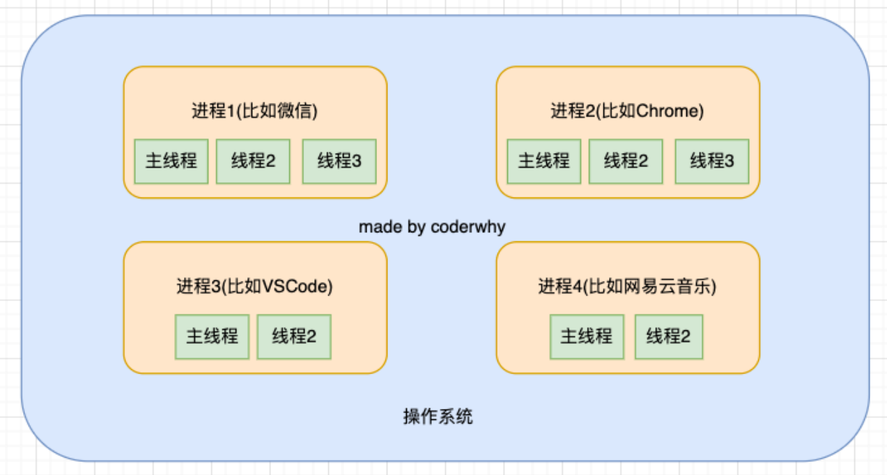

## **异步函数 async function**

**async 关键字用于声明一个异步函数：**

async 是 asynchronous 单词的缩写，异步、非同步；

sync 是 synchronous 单词的缩写，同步、同时；

**async 异步函数可以有很多中写法：**

```javascript
// 普通函数
// function foo() {}
// const bar = function() {}
// const baz = () => {}

// 生成器函数
// function* foo() {}

// 异步函数
async function foo() {
  console.log("foo function1");
  console.log("foo function2");
  console.log("foo function3");
}
foo();

const bar = async function () {};
const baz = async () => {};
class Person {
  async running() {}
}
```

## **异步函数的执行流程**

**异步函数的内部代码执行过程和普通的函数是一致的，默认情况下也是会被同步执行。**

**异步函数有返回值时，和普通函数会有区别：**

情况一：异步函数也可以有返回值，但是异步函数的返回值相当于被包裹到 Promise.resolve 中；

情况二：如果我们的异步函数的返回值是 Promise，状态由会由 Promise 决定；

情况三：如果我们的异步函数的返回值是一个对象并且实现了 thenable，那么会由对象的 then 方法来决定；

```javascript
// 返回值的区别
// 1.普通函数
// function foo1() {
//   return 123
// }
// foo1()

// 2.异步函数
async function foo2() {
  // 1.返回一个普通的值
  // -> 相当于Promise.resolve(321)
  return 321;

  // 2.返回一个Promise
  // return new Promise((resolve, reject) => {
  //   setTimeout(() => {
  //     resolve("aaa")
  //   }, 3000)
  // })

  // 3.返回一个thenable对象
  // return {
  //   then: function(resolve, reject) {
  //     resolve("bbb")
  //   }
  // }
}

foo2().then((res) => {
  console.log("res:", res);
});
```

**如果我们在 async 中抛出了异常，那么程序它并不会像普通函数一样报错，而是会作为 Promise 的 reject 来传递；**

```javascript
// 什么情况下异步函数的结果是rejected

// 如果异步函数中有抛出异常(产生了错误), 这个异常不会被立即浏览器处理
// 进行如下处理: Promise.reject(error)
async function foo() {
  console.log("---------1");
  console.log("---------2");
  // "abc".filter()
  throw new Error("coderwhy async function error");
  console.log("---------3");

  // return new Promise((resolve, reject) => {
  //   reject("err rejected")
  // })

  return 123;
}

// promise -> pending -> fulfilled/rejected
foo()
  .then((res) => {
    console.log("res:", res);
  })
  .catch((err) => {
    console.log("coderwhy err:", err);
    console.log("继续执行其他的逻辑代码");
  });
```

在异步函数内部的异常，不管是"abc".filter()还是 throw new Error("coderwhy async function error") ，或者 return 一个 Promise，里面 reject，都会被 catch 捕获到，并不会报错。

## **await 关键字**

**async 函数另外一个特殊之处就是可以在它内部使用 await 关键字，而普通函数中是不可以的。**

**await 关键字有什么特点呢？**

通常使用 await 是后面会跟上一个表达式，这个表达式会返回一个 Promise；

那么 await 会等到 Promise 的状态变成 fulfilled 状态，之后继续执行异步函数；

```javascript
// await条件: 必须在异步函数中使用
function bar() {
  console.log("bar function");
  return new Promise((resolve) => {
    setTimeout(() => {
      resolve(123);
    }, 100000);
  });
}

async function foo() {
  console.log("-------");
  // await后续返回一个Promise, 那么会等待Promise有结果之后, 才会继续执行后续的代码
  const res1 = await bar();
  console.log("await后面的代码:", res1);
  const res2 = await bar();
  console.log("await后面的代码:", res2);

  console.log("+++++++");
}

foo();
```

**如果 await 后面是一个普通的值，那么会直接返回这个值；**

**如果 await 后面是一个 thenable 的对象，那么会根据对象的 then 方法调用来决定后续的值；**

**如果 await 后面的表达式，返回的 Promise 是 reject 的状态，那么会将这个 reject 结果直接作为函数的 Promise 的 reject 值；**

```javascript
function requestData(url) {
  return new Promise((resolve, reject) => {
    setTimeout(() => {
      resolve(url);
      // reject("error message")
    }, 2000);
  });
}

async function getData() {
  const res1 = await requestData("why");
  console.log("res1:", res1);

  const res2 = await requestData(res1 + "kobe");
  console.log("res2:", res2);
}

getData().catch((err) => {
  // 如果requestData()方法返回的是reject，可以在catch中捕获异常；或者在getData里面写try catch
  console.log("err:", err);
});
```

## await 和 async 结合使用

异步函数返回一个 Promise

```javascript
// 1.定义一些其他的异步函数
function requestData(url) {
  console.log("request data");
  return new Promise((resolve) => {
    setTimeout(() => {
      resolve(url);
    }, 3000);
  });
}

async function test() {
  console.log("test function");
  return "test";
}

async function bar() {
  console.log("bar function");

  return new Promise((resolve) => {
    setTimeout(() => {
      resolve("bar");
    }, 2000);
  });
}

async function demo() {
  console.log("demo function");
  return {
    then: function (resolve) {
      resolve("demo");
    },
  };
}

// 2.调用的入口async函数
async function foo() {
  console.log("foo function");

  const res1 = await requestData("why");
  console.log("res1:", res1);

  const res2 = await test();
  console.log("res2:", res2);

  const res3 = await bar();
  console.log("res3:", res3);

  const res4 = await demo();
  console.log("res4:", res4);
}

foo();
```

## **进程和线程**

**线程和进程是操作系统中的两个概念：**

进程（process）：计算机已经运行的程序，是操作系统管理程序的一种方式；

线程（thread）：操作系统能够运行运算调度的最小单位，通常情况下它被包含在进程中；

**听起来很抽象，这里还是给出我的解释：**

进程：我们可以认为，启动一个应用程序，就会默认启动一个进程（也可能是多个进程）；

线程：每一个进程中，都会启动至少一个线程用来执行程序中的代码，这个线程被称之为主线程；

所以我们也可以说进程是线程的容器；

**再用一个形象的例子解释：**

操作系统类似于一个大工厂；

工厂中里有很多车间，这个车间就是进程；

每个车间可能有一个以上的工人在工厂，这个工人就是线程；

## **操作系统 – 进程 – 线程**



## **操作系统的工作方式**

**操作系统是如何做到同时让多个进程（边听歌、边写代码、边查阅资料）同时工作**呢？

这是因为 CPU 的运算速度非常快，它可以快速的在多个进程之间迅速的切换；

当我们进程中的线程获取到时间片时，就可以快速执行我们编写的代码；

对于用户来说是感受不到这种快速的切换的；

你可以在 Mac 的活动监视器或者 Windows 的资源管理器中查看到很多进程：

## **浏览器中的 JavaScript 线程**

我们经常会说**JavaScript 是单线程（可以开启 workers）**的，但是**JavaScript 的线程应该有自己的容器进程**：浏览器或者 Node。

**浏览器是一个进程吗，它里面只有一个线程吗？**

目前多数的浏览器其实都是多进程的，当我们打开一个 tab 页面时就会开启一个新的进程，这是为了防止一个页面卡死而造成

所有页面无法响应，整个浏览器需要强制退出；

每个进程中又有很多的线程，其中包括执行 JavaScript 代码的线程；

**JavaScript 的代码执行是在一个单独的线程中执行的：**

这就意味着 JavaScript 的代码，在同一个时刻只能做一件事；

如果这件事是非常耗时的，就意味着当前的线程就会被阻塞；

**所以真正耗时的操作，实际上并不是由 JavaScript 线程在执行的：**

浏览器的每个进程是多线程的，那么其他线程可以来完成这个耗时的操作；

比如网络请求、定时器，我们只需要在特性的时候执行应该有的回调即可；

## **浏览器的事件循环**

**如果在执行 JavaScript 代码的过程中，有异步操作呢？**

中间我们插入了一个 setTimeout 的函数调用；

这个函数被放到入调用栈中，执行会立即结束，并不会阻塞后续代码的执行；

```javascript
const btn = document.querySelector("button");
btn.onclick = function () {
  console.log("btn click event"); // 只有当点击的时候才会触发
};

console.log("Hello World");
let message = "aaaa";
message = "bbbb";

setTimeout(() => {
  console.log("10s后的setTimeout");
}, 0);

console.log("Hello JavaScript");
console.log("代码继续执行~~~");
console.log("-------------");
```

上面代码的执行顺序是

```javascript
console.log("Hello World");

console.log("Hello JavaScript");
console.log("代码继续执行~~~");
console.log("-------------");

console.log("10s后的setTimeout");
```

## **宏任务和微任务**

**但是事件循环中并非只维护着一个队列，事实上是有两个队列：**

宏任务队列（macrotask queue）：ajax、setTimeout、setInterval、DOM 监听、UI Rendering 等

微任务队列（microtask queue）：Promise 的 then 回调、 Mutation Observer API、queueMicrotask()等

**那么事件循环对于两个队列的优先级是怎么样的呢？**

1.main script 中的代码优先执行（编写的顶层 script 代码）；

2.在执行任何一个宏任务之前（不是队列，是一个宏任务），都会先查看微任务队列中是否有任务需要执行

也就是宏任务执行之前，必须保证微任务队列是空的；

如果不为空，那么就优先执行微任务队列中的任务（回调）；

```javascript
console.log("script start");

// 定时器
setTimeout(() => {
  console.log("setTimeout0");
}, 0);
setTimeout(() => {
  console.log("setTimeout1");
}, 0);

// Promise中的then的回调也会被添加到队列中
console.log("1111111");
new Promise((resolve, reject) => {
  console.log("2222222");
  console.log("-------1");
  console.log("-------2");
  resolve();
  console.log("-------3");
}).then((res) => {
  console.log("then传入的回调: res", res);
});
console.log("3333333");

console.log("script end");
```

执行顺序

```javascript
console.log("script start");
console.log("1111111");
console.log("2222222");
console.log("-------1");
console.log("-------2");
console.log("-------3");
console.log("3333333");
console.log("script end");
// 微任务
console.log("then传入的回调: res", undefined);
// 宏任务
console.log("setTimeout0");
console.log("setTimeout1");
```

**下面我们通过几到面试题来练习一下。**

## 代码执行顺序-面试题一

```javascript
console.log("script start");

setTimeout(function () {
  console.log("setTimeout1");
  new Promise(function (resolve) {
    resolve();
  }).then(function () {
    new Promise(function (resolve) {
      resolve();
    }).then(function () {
      console.log("then4");
    });
    console.log("then2");
  });
});

new Promise(function (resolve) {
  console.log("promise1");
  resolve();
}).then(function () {
  console.log("then1");
});

setTimeout(function () {
  console.log("setTimeout2");
});

console.log(2);

queueMicrotask(() => {
  console.log("queueMicrotask1");
});

new Promise(function (resolve) {
  resolve();
}).then(function () {
  console.log("then3");
});

console.log("script end");
```

第一步：

```javascript
主任务 script start promise1 2 script end
微任务 then1 queueMicrotask1 then3
宏任务 setTimeout1 setTimeout2
```

第二步：

```javascript
主任务 script start promise1 2 script end then1 queueMicrotask1 then3
宏任务 setTimeout1 setTimeout2
```

第三步：

```javascript
主任务 script start promise1 2 script end then1 queueMicrotask1 then3 setTimeout1 then2
微任务 then4
宏任务 setTimeout2
```

第四步：

```javascript
主任务 script start promise1 2 script end then1 queueMicrotask1 then3 setTimeout1 then2 then4 setTimeout2
```

## 代码执行顺序-await 代码

```javascript
console.log("script start");

function requestData(url) {
  console.log("requestData");
  return new Promise((resolve) => {
    setTimeout(() => {
      console.log("setTimeout");
      resolve(url);
    }, 2000);
  });
}

// 2.await/async
async function getData() {
  console.log("getData start");
  const res = await requestData("why");

  console.log("then1-res:", res);
  console.log("getData end");
}

getData();

console.log("script end");
```

```javascript
console.log("getData start");
requestData("why");
```

上面两行代码都是在 await 之前执行

await 后面返回一个 Pomise，必须等待这个 Promise.reslove 才会继续执行后面的代码，相当于

```javascript
const res
console.log("then1-res:", res)
console.log("getData end")
```

这些代码，放入到 Promise 中的 then 方法执行

```javascript
script start getData start requestData script end setTimeout then1-res:why getData end
```

## 代码执行顺序-面试题二

```javascript
async function async1() {
  console.log("async1 start");
  await async2();
  console.log("async1 end");
}

async function async2() {
  console.log("async2");
}

console.log("script start");

setTimeout(function () {
  console.log("setTimeout");
}, 0);

async1();

new Promise(function (resolve) {
  console.log("promise1");
  resolve();
}).then(function () {
  console.log("promise2");
});

console.log("script end");
```

```javascript
主任务 script start async1 start async2 promise1 script end
微任务 async1 end promise2
宏任务 setTimeout
```

顺序

```javascript
script start async1 start async2 promise1 script end async1 end promise2 setTimeout
```

## **错误处理方案**

**开发中我们会封装一些工具函数，封装之后给别人使用：**

在其他人使用的过程中，可能会传递一些参数；

对于函数来说，需要对这些参数进行验证，否则可能得到的是我们不想要的结果；

**很多时候我们可能验证到不是希望得到的参数时，就会直接 return：**

但是 return 存在很大的弊端：调用者不知道是因为函数内部没有正常执行，还是执行结果就是一个 undefined；

事实上，正确的做法应该是如果没有通过某些验证，那么应该让外界知道函数内部报错了；

**如何可以让一个函数告知外界自己内部出现了错误呢？**

通过 throw 关键字，抛出一个异常；

**throw 语句：**

throw 语句用于抛出一个用户自定义的异常；

当遇到 throw 语句时，当前的函数执行会被停止（throw 后面的语句不会执行）；

**如果我们执行代码，就会报错，拿到错误信息的时候我们可以及时的去修正代码。**

```javascript
function sum(num1, num2) {
  if (typeof num1 !== "number") {
    throw "type error: num1传入的类型有问题, 必须是number类型";
  }

  if (typeof num2 !== "number") {
    throw "type error: num2传入的类型有问题, 必须是number类型";
  }

  return num1 + num2;
}

// 李四调用
const result = sum(123, 321);
```

## **throw 关键字**

**throw 表达式就是在 throw 后面可以跟上一个表达式来表示具体的异常信息：**

**throw 关键字可以跟上哪些类型呢？**

基本数据类型：比如 number、string、Boolean

对象类型：对象类型可以包含更多的信息

**但是每次写这么长的对象又有点麻烦，所以我们可以创建一个类：**

```javascript
class HYError {
  constructor(message, code) {
    this.errMessage = message;
    this.errCode = code;
  }
}

// throw抛出一个异常
// 1.函数中的代码遇到throw之后, 后续的代码都不会执行
// 2.throw抛出一个具体的错误信息
function foo() {
  console.log("foo function1");
  // 1.number/string/boolean
  // throw "反正就是一个错误"

  // 2.抛出一个对象
  // throw { errMessage: "我是错误信息", errCode: -1001 }
  // throw new HYError("错误信息", -1001)

  // 3.Error类: 错误函数的调用栈以及位置信息
  throw new Error("我是错误信息");

  console.log("foo function2");
  console.log("foo function3");
  console.log("foo function4");
}

function bar() {
  foo();
}

bar();
```

## **Error 类型**

**事实上，JavaScript 已经给我们提供了一个 Error 类，我们可以直接创建这个类的对象：**

**Error 包含三个属性：**

messsage：创建 Error 对象时传入的 message；

name：Error 的名称，通常和类的名称一致；

stack：整个 Error 的错误信息，包括函数的调用栈，当我们直接打印 Error 对象时，打印的就是 stack；

**Error 有一些自己的子类：**

RangeError：下标值越界时使用的错误类型；

SyntaxError：解析语法错误时使用的错误类型；

TypeError：出现类型错误时，使用的错误类型；

## **异常的处理**

**我们会发现在之前的代码中，一个函数抛出了异常，调用它的时候程序会被强制终止：**

这是因为如果我们在调用一个函数时，这个函数抛出了异常，但是我们并没有对这个异常进行处理，那么这个异常会继续传

递到上一个函数调用中；

而如果到了最顶层（全局）的代码中依然没有对这个异常的处理代码，这个时候就会报错并且终止程序的运行；

**我们先来看一下这段代码的异常传递过程：**

foo 函数在被执行时会抛出异常，也就是我们的 test 函数会拿到这个异常；

但是 test 函数并没有对这个异常进行处理，那么这个异常就会被继续传递到调用 test 函数的函数，也就是 bar 函数；

但是 bar 函数依然没有处理，就会继续传递到我们的全局代码逻辑中；

依然没有被处理，这个时候程序会终止执行，后续代码都不会再执行了；

```javascript
function foo() {
  console.log("foo function1");
  throw new Error("我是错误信息");
  console.log("foo function2");
  console.log("foo function3");
  console.log("foo function4");
}

function test() {
  foo();
}

function bar() {
  test();
}

bar();

console.log("--------");
```

## **异常的捕获**

**但是很多情况下当出现异常时，我们并不希望程序直接推出，而是希望可以正确的处理异常：**

这个时候我们就可以使用 try catch

在 ES10（ES2019）中，catch 后面绑定的 error 可以省略。

**当然，如果有一些必须要执行的代码，我们可以使用 finally 来执行：**

finally 表示最终一定会被执行的代码结构；

注意：如果 try 和 finally 中都有返回值，那么会使用 finally 当中的返回值；

```javascript
function foo() {
  console.log("foo function1");
  throw new Error("我是错误信息");
  console.log("foo function2");
  console.log("foo function3");
  console.log("foo function4");
}

function test() {
  // 自己捕获了异常的话, 那么异常就不会传递给浏览器, 那么后续的代码可以正常执行
  try {
    foo();
    console.log("try后续的代码");
  } catch (error) {
    console.log("catch中的代码");
    // console.log(error)
  } finally {
    console.log("finally代码");
  }
}

function bar() {
  test();
}

bar();

console.log("--------");
```
