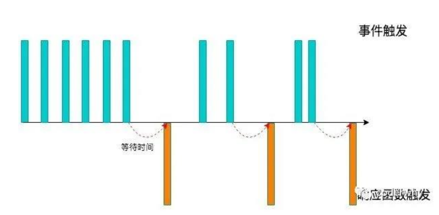
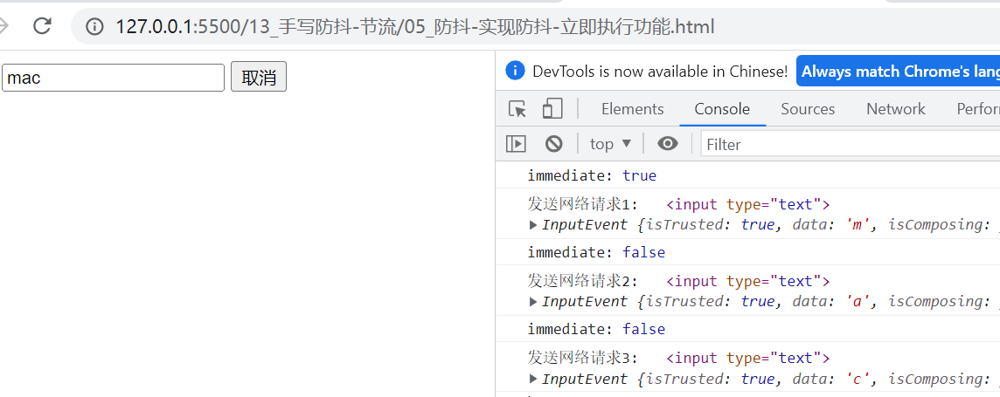
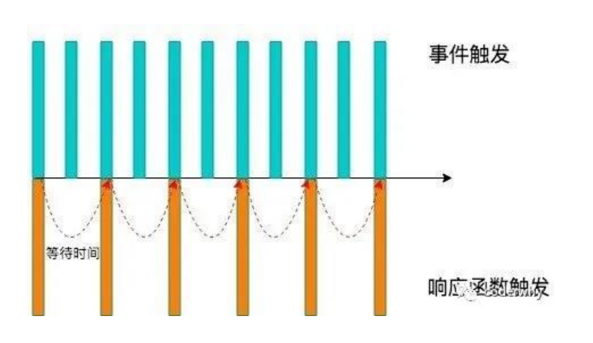

## **认识防抖和节流函数**

**防抖和节流的概念其实最早并不是出现在软件工程中，防抖是出现在电子元件中，节流出现在流体流动中**

而 JavaScript 是事件驱动的，大量的操作会触发事件，加入到事件队列中处理。

而对于某些频繁的事件处理会造成性能的损耗，我们就可以通过防抖和节流来限制事件频繁的发生；

防抖和节流函数目前已经是前端实际开发中两个非常重要的函数，也是**面试经常被问到的面试题**。

**但是很多前端开发者面对这两个功能，有点摸不着头脑：**

某些开发者根本无法区分防抖和节流有什么区别（面试经常会被问到）；

某些开发者可以区分，但是不知道如何应用；

某些开发者会通过一些第三方库来使用，但是不知道内部原理，更不会编写；

**接下来我们会一起来学习防抖和节流函数：**

我们不仅仅要区分清楚防抖和节流两者的区别，也要明白在实际工作中哪些场景会用到；

并且我会带着大家一点点来编写一个自己的防抖和节流的函数，不仅理解原理，也学会自己来编写；

## **案例准备**

我们通过一个搜索框来延迟防抖函数的实现过程：

监听 input 的输入，通过打印模拟网络请求

测试发现快速输入一个 macbook 共发送了 8 次请求，显示我们需要对它进行防抖操作：

```html
<input type="text" />

<script>
  // 1.获取input元素
  const inputEl = document.querySelector("input");

  // 2.监听input元素的输入
  let counter = 1;
  inputEl.oninput = function () {
    console.log(`发送网络请求${counter++}:`, this.value);
  };
</script>
```

## **Underscore 库的介绍**

**事实上我们可以通过一些第三方库来实现防抖操作：**

lodash

underscore

**这里使用 underscore**

我们可以理解成 lodash 是 underscore 的升级版，它更重量级，功能也更多；

但是目前我看到 underscore 还在维护，lodash 已经很久没有更新了；

Underscore 的官网： https://underscorejs.org/

Underscore 的安装有很多种方式：

下载 Underscore，本地引入；

打开https://cdn.jsdelivr.net/npm/underscore@1.13.4/underscore-umd-min.js，复制里面的代码。

通过 CDN 直接引入；

通过包管理工具（npm）管理安装；

这里我们直接通过 CDN：

```javascript
<button>按钮</button>

<input type="text">

    <!-- CDN引入: 网络的js文件 -->
    <!-- <script src="https://cdn.jsdelivr.net/npm/underscore@1.13.4/underscore-umd-min.js"></script> -->
    <!-- 本地引入: 下载js文件, 并且本地引入 -->
    <script src="./js/underscore.js"></script>
<script>
        // 1.获取input元素
        const inputEl = document.querySelector("input")

// 2.监听input元素的输入
// let counter = 1
// inputEl.oninput = function() {
//   console.log(`发送网络请求${counter++}:`, this.value)
// }

// 3.防抖处理代码
let counter = 1
inputEl.oninput = _.debounce(function() {
    console.log(`发送网络请求${counter++}:`, this.value)
}, 3000)

</script>
```

## **认识防抖 debounce 函数**

**我们用一副图来理解一下它的过程：**

当事件触发时，响应的函数并不会立即触发，而是会等待一定的时间；

当事件密集触发时，函数的触发会被频繁的推迟；

只有等待了一段时间也没有事件触发，才会真正的执行响应函数；



防抖的应用场景很多：

输入框中频繁的输入内容，搜索或者提交信息；

频繁的点击按钮，触发某个事件；

监听浏览器滚动事件，完成某些特定操作；

用户缩放浏览器的 resize 事件；

## **防抖函数的案例**

我们都遇到过这样的场景，**在某个搜索框中输入自己想要搜索的内容**：

**比如想要搜索一个 MacBook：**

当我输入 m 时，为了更好的用户体验，通常会出现对应的联想内容，这些联想内容通常是保存在服务器的，所以需要一次网

络请求；

当继续输入 ma 时，再次发送网络请求；

那么 macbook 一共需要发送 7 次网络请求；

这大大损耗我们整个系统的性能，无论是前端的事件处理，还是对于服务器的压力;

**但是我们需要这么多次的网络请求吗？**

不需要，正确的做法应该是在合适的情况下再发送网络请求；

比如如果用户快速的输入一个 macbook，那么只是发送一次网络请求；

比如如果用户是输入一个 m 想了一会儿，这个时候 m 确实应该发送一次网络请求；

也就是我们应该监听用户在某个时间，比如 500ms 内，没有再次触发事件时，再发送网络请求；

这就是防抖的操作：只有在某个时间内，没有再次触发某个函数时，才真正的调用这个函数；

## 自定义防抖函数

### 基本实现

```javascript
function hydebounce(fn, delay) {
  // 1.用于记录上一次事件触发的timer
  let timer = null;

  // 2.触发事件时执行的函数
  const _debounce = () => {
    // 2.1.如果有再次触发(更多次触发)事件, 那么取消上一次的事件
    if (timer) clearTimeout(timer);

    // 2.2.延迟去执行对应的fn函数(传入的回调函数)
    timer = setTimeout(() => {
      fn();
      timer = null; // 执行过函数之后, 将timer重新置null
    }, delay);
  };

  // 返回一个新的函数
  return _debounce;
}
```

### this 和参数绑定

上面已经实现了防抖功能，但是如果打印 this 和传进去的参数是拿不到的，可以进行优化。

```javascript
<input type="text">

function hydebounce(fn, delay) {
    // 1.用于记录上一次事件触发的timer
    let timer = null

    // 2.触发事件时执行的函数
    const _debounce = function(...args) { // _debounce绑定的this就是inputEl
        // 2.1.如果有再次触发(更多次触发)事件, 那么取消上一次的事件
        if (timer) clearTimeout(timer)

        // 2.2.延迟去执行对应的fn函数(传入的回调函数)
        timer = setTimeout(() => {
            fn.apply(this, args) // args有可能多个，别的地方用的时候可能不止传递一个参数
            timer = null // 执行过函数之后, 将timer重新置null
        }, delay);
    }

    // 返回一个新的函数
    return _debounce
}

// 1.获取input元素
const inputEl = document.querySelector("input")

// 2.自己实现的防抖
let counter = 1
inputEl.oninput = hydebounce(function(event) {
    console.log(`发送网络请求${counter++}:`, this, event)
}, 1000)
```

### 取消功能

实际开发中，比如输入框输入到一半，点了浏览器的返回，或者是跳转到了别的页面，那么这个时候不应该再发送网络请求。

本来延迟 5 秒发送网络请求，但是点击取消按钮中断掉，怎么中断呢？清除定时器。

```javascript
<input type="text">
<button class="cancel">取消</button>

function hydebounce(fn, delay) {
    // 1.用于记录上一次事件触发的timer
    let timer = null

    // 2.触发事件时执行的函数
    const _debounce = function(...args) {
        // 2.1.如果有再次触发(更多次触发)事件, 那么取消上一次的事件
        if (timer) clearTimeout(timer)

        // 2.2.延迟去执行对应的fn函数(传入的回调函数)
        timer = setTimeout(() => {
            fn.apply(this, args)
            timer = null // 执行过函数之后, 将timer重新置null
        }, delay);
    }

    // 3.给_debounce绑定一个取消的函数，函数也是一个对象
    _debounce.cancel = function() {
        if (timer) clearTimeout(timer)
    }

    // 返回一个新的函数
    return _debounce
}

// 1.获取input元素
const inputEl = document.querySelector("input")
const cancelBtn = document.querySelector(".cancel")

// 3.自己实现的防抖
let counter = 1
const debounceFn = hydebounce(function(event) {
    console.log(`发送网络请求${counter++}:`, this, event)
}, 5000)
inputEl.oninput = debounceFn

// 4.实现取消的功能
cancelBtn.onclick = function() {
    debounceFn.cancel()
}
```

### 立即执行功能

有的时候，我们想要一开始（比如输入 m）就发送网络请求，后面的操作再防抖，怎么实现呢？

```javascript
<input type="text">
    <button class="cancel">取消</button>

// 原则: 一个函数进行做一件事情, 一个变量也用于记录一种状态

function hydebounce(fn, delay, immediate = false) { // 大部分场景是不需要立即执行
    // 1.用于记录上一次事件触发的timer
    let timer = null
    let isInvoke = false // 记录有没有执行过，默认没有

    // 2.触发事件时执行的函数
    const _debounce = function(...args) {
        // 2.1.如果有再次触发(更多次触发)事件, 那么取消上一次的事件
        if (timer) clearTimeout(timer)

        // 第一次操作是不需要延迟
        if (immediate && !isInvoke) {
            fn.apply(this, args)
            isInvoke = true
            return
        }

        // 2.2.延迟去执行对应的fn函数(传入的回调函数)
        timer = setTimeout(() => {
            fn.apply(this, args)
            timer = null // 执行过函数之后, 将timer重新置null
            isInvoke = false
        }, delay);
    }

    // 3.给_debounce绑定一个取消的函数
    _debounce.cancel = function() {
        if (timer) clearTimeout(timer)
        timer = null
        isInvoke = false
    }

    // 返回一个新的函数
    return _debounce
}

// 1.获取input元素
const inputEl = document.querySelector("input")
const cancelBtn = document.querySelector(".cancel")

// 3.自己实现的防抖
let counter = 1
const debounceFn = hydebounce(function(event) {
    console.log(`发送网络请求${counter++}:`, this, event)
}, 5000)
inputEl.oninput = debounceFn

// 4.实现取消的功能
cancelBtn.onclick = function() {
    debounceFn.cancel()
}
```

这里为什么要使用 isInvoke 这个变量来记录有没有执行过，一个是遵循一个变量用于记录一种状态。另外，如果像下面这样

```javascript
if (immediate) {
  fn.apply(this, args);
  immediate = false;
  return;
}
```

这样写会有什么问题呢？假如是立即执行，也就是 immediate 为 true。

这样，当下次需要再次立即执行时就会失效



输入 m，立即执行，立马发送网络请求，接着输入 a，延迟 5 秒执行。过了 5 秒之后，正常按 c 是需要立即执行，但是没有，因为 immediate 变成 false 了。这种写法就会有问题，不能拿到正确的 immediate，所以需要额外的一个变量记录有没有执行过。

### 获取返回值

如果想拿到需要进行防抖处理函数的返回值该怎么拿呢？两种方法：

第一种，传入一个回调函数

```javascript
function hydebounce(fn, delay, immediate = false, resultCallback) {
  // 1.用于记录上一次事件触发的timer
  let timer = null;
  let isInvoke = false;

  // 2.触发事件时执行的函数
  const _debounce = function (...args) {
    // 2.1.如果有再次触发(更多次触发)事件, 那么取消上一次的事件
    if (timer) clearTimeout(timer);

    // 第一次操作是不需要延迟
    let res = undefined;
    if (immediate && !isInvoke) {
      res = fn.apply(this, args);
      if (resultCallback) resultCallback(res);
      isInvoke = true;
      return;
    }

    // 2.2.延迟去执行对应的fn函数(传入的回调函数)
    timer = setTimeout(() => {
      res = fn.apply(this, args);
      if (resultCallback) resultCallback(res);
      timer = null; // 执行过函数之后, 将timer重新置null
      isInvoke = false;
    }, delay);
  };

  // 3.给_debounce绑定一个取消的函数
  _debounce.cancel = function () {
    if (timer) clearTimeout(timer);
    timer = null;
    isInvoke = false;
  };

  // 返回一个新的函数
  return _debounce;
}

// 1.获取input元素
const inputEl = document.querySelector("input");
const cancelBtn = document.querySelector(".cancel");

// 2.手动绑定函数和执行
const myDebounceFn = hydebounce(
  function (name, age, height) {
    console.log("----------", name, age, height);
    return "coderwhy 哈哈哈哈";
  },
  1000,
  false,
  (res) => {
    console.log("res:", res);
  }
);

myDebounceFn("why", 18, 1.88);
```

第二种方法，使用 Promise

```javascript
function hydebounce(fn, delay, immediate = false, resultCallback) {
  // 1.用于记录上一次事件触发的timer
  let timer = null;
  let isInvoke = false;

  // 2.触发事件时执行的函数
  const _debounce = function (...args) {
    return new Promise((resolve, reject) => {
      try {
        // 2.1.如果有再次触发(更多次触发)事件, 那么取消上一次的事件
        if (timer) clearTimeout(timer);

        // 第一次操作是不需要延迟
        let res = undefined;
        if (immediate && !isInvoke) {
          res = fn.apply(this, args);
          if (resultCallback) resultCallback(res);
          resolve(res);
          isInvoke = true;
          return;
        }

        // 2.2.延迟去执行对应的fn函数(传入的回调函数)
        timer = setTimeout(() => {
          res = fn.apply(this, args);
          if (resultCallback) resultCallback(res);
          resolve(res);
          timer = null; // 执行过函数之后, 将timer重新置null
          isInvoke = false;
        }, delay);
      } catch (error) {
        reject(error);
      }
    });
  };

  // 3.给_debounce绑定一个取消的函数
  _debounce.cancel = function () {
    if (timer) clearTimeout(timer);
    timer = null;
    isInvoke = false;
  };

  // 返回一个新的函数
  return _debounce;
}
```

```javascript
// 1.获取input元素
const inputEl = document.querySelector("input");
const cancelBtn = document.querySelector(".cancel");

// 2.手动绑定函数和执行
const myDebounceFn = hydebounce(
  function (name, age, height) {
    console.log("----------", name, age, height);
    return "coderwhy 哈哈哈哈";
  },
  1000,
  false
);

myDebounceFn("why", 18, 1.88).then((res) => {
  console.log("拿到执行结果:", res);
});
```

## **认识节流 throttle 函数**

**我们用一副图来理解一下节流的过程**

当事件触发时，会执行这个事件的响应函数；

如果这个事件会被频繁触发，那么节流函数会按照一定的频率来执行函数；

不管在这个中间有多少次触发这个事件，执行函数的频繁总是固定的



节流的应用场景：

监听页面的滚动事件；

鼠标移动事件；

用户频繁点击按钮操作；

游戏中的一些设计；

## **节流函数的应用场景**

**很多人都玩过类似于飞机大战的游戏**

**在飞机大战的游戏中，我们按下空格会发射一个子弹：**

很多飞机大战的游戏中会有这样的设定，即使按下的频率非常快，子弹也会保持一定的频率来发射；

比如 1 秒钟只能发射一次，即使用户在这 1 秒钟按下了 10 次，子弹会保持发射一颗的频率来发射；

但是事件是触发了 10 次的，响应的函数只触发了一次；

## **生活中的例子：防抖和节流**

**生活中防抖的例子：**

比如说有一天我上完课，我说大家有什么问题来问我，我会等待五分钟的时间。

如果在五分钟的时间内，没有同学问我问题，那么我就下课了；

在此期间，a 同学过来问问题，并且帮他解答，解答完后，我会再次等待五分钟的时间看有没有其他同学问问题；

如果我等待超过了 5 分钟，就点击了下课（才真正执行这个时间）；

**生活中节流的例子：**

比如说有一天我上完课，我说大家有什么问题来问我，但是在一个 5 分钟之内，不管有多少同学来问问题，我只会解答一个问题；

如果在解答完一个问题后，5 分钟之后还没有同学问问题，那么就下课；

## Undescore 实现节流

```javascript
<input type="text">

<script src="./js/underscore.js"></script>
<script>
        // 1.获取input元素
        const inputEl = document.querySelector("input")

// 2.监听input元素的输入
// let counter = 1
// inputEl.oninput = function() {
//   console.log(`发送网络请求${counter++}:`, this.value)
// }

// 3.防抖处理代码
// let counter = 1
// inputEl.oninput = _.debounce(function() {
//   console.log(`发送网络请求${counter++}:`, this.value)
// }, 3000)

// 4.节流处理代码
let counter = 1
inputEl.oninput = _.throttle(function() {
    console.log(`发送网络请求${counter++}:`, this.value)
}, 1000) // 保持一直输入，1秒钟只会执行一次

</script>
```

## 自定义节流函数

### 基本实现

```html
<input type="text" />
<script>
  function hythrottle(fn, interval) {
    let startTime = 0;

    const _throttle = function () {
      const nowTime = new Date().getTime();
      const waitTime = interval - (nowTime - startTime);
      if (waitTime <= 0) {
        fn();
        startTime = nowTime;
      }
    };

    return _throttle;
  }
</script>

<script>
  // 1.获取input元素
  const inputEl = document.querySelector("input");

  // 2.underscore节流处理代码
  // let counter = 1
  // inputEl.oninput = _.throttle(function() {
  //   console.log(`发送网络请求${counter++}:`, this.value)
  // }, 1000)

  // 3.自己实现的节流函数
  let counter = 1;
  inputEl.oninput = hythrottle(function () {
    console.log(`发送网络请求${counter++}:`, this.value);
  }, 3000);
</script>
```

来分析下 waitTime

```javascript
interval - (nowTime - startTime);
```

interval 是传入的时间，假如是 3000，也就是 3 秒

nowTime，是一个很大的数字，比如：1677764219252，startTime 是 0

3000 - （1677764219252 - 0）= 一个很大的负数，满足条件，执行函数，然后将 nowTime 赋值给 startTime，

假如过了 1 秒，也就是 1000 毫秒，

nowTime 变成 1677764219252 +1000，startTime 是 1677764219252

3000 - （1677764219252 +1000 - 1677764219252 ）= 3000 - 1000 = 2000 > 0，不满足条件，这个时候不会触发函数

等到过了 3 秒，也就是 3000 毫秒，nowTime - startTime 刚好等于 3000，3000 - 3000 = 0，此时满足条件，执行函数

startTime 为 1677764219252 +3000，之后每 3 秒执行一次直到不再输入为止，后面的 waitTime 都刚好是 0

### this 和参数绑定

```javascript
function hythrottle(fn, interval) {
  let startTime = 0;

  const _throttle = function (...args) {
    const nowTime = new Date().getTime();
    const waitTime = interval - (nowTime - startTime);
    if (waitTime <= 0) {
      fn.apply(this, args);
      startTime = nowTime;
    }
  };

  return _throttle;
}
```

### 立即执行控制

防抖默认不会立即执行，节流默认会立即执行。

```javascript
function hythrottle(fn, interval, leading = true) {
  let startTime = 0;

  const _throttle = function (...args) {
    // 1.获取当前时间
    const nowTime = new Date().getTime();

    // 对立即执行进行控制
    if (!leading && startTime === 0) {
      startTime = nowTime; // 这个时候waitTime一定大于0
    }

    // 2.计算需要等待的时间执行函数
    const waitTime = interval - (nowTime - startTime);
    if (waitTime <= 0) {
      fn.apply(this, args);
      startTime = nowTime;
    }
  };

  return _throttle;
}
```

### 尾部执行控制（了解）

默认是尾部不执行，也就是松手之后不会再执行。

```javascript
function hythrottle(fn, interval, { leading = true, trailing = false } = {}) {
  let startTime = 0;
  let timer = null;

  const _throttle = function (...args) {
    // 1.获取当前时间
    const nowTime = new Date().getTime();

    // 对立即执行进行控制
    if (!leading && startTime === 0) {
      startTime = nowTime;
    }

    // 2.计算需要等待的时间执行函数
    const waitTime = interval - (nowTime - startTime);
    if (waitTime <= 0) {
      // console.log("执行操作fn")
      if (timer) clearTimeout(timer);
      fn.apply(this, args);
      startTime = nowTime;
      timer = null;
      return;
    }

    // 3.判断是否需要执行尾部
    if (trailing && !timer) {
      timer = setTimeout(() => {
        // console.log("执行timer")
        fn.apply(this, args);
        startTime = new Date().getTime();
        timer = null;
      }, waitTime);
    }
  };

  return _throttle;
}
```

比如，第 11 秒的时候，nowTime=11，startTime=10，waitTime=10-（11-10）=9，此时需要尾部执行，并且没有定时器，那么就会开启一个定时器，等待 9 秒之后执行。但是在第 11 秒之后，我们不知道用户有没有可能继续执行函数，假如没有，那么就等待 9 秒之后执行；如果有，比如在第 15 秒，但是已经有定时器了，不会再创建定时器；到了第 20 秒时（这种情况是在第 20 秒没有保持 输入），执行，然后清空定时器，将 startTime 设置为当前时间。但是，如果用户一直保持输入，waitTime=0，那么在第 20 秒会执行，此时要清空定时器，不清空的话，会执行两次，一次是 waitTime=0 的时候执行，一次是第 11 秒创建的定时器执行。

### 取消功能

为什么取消功能要放这里呢？和尾部执行有关，因为取消的是最后一次的执行。防抖是最后一次必须执行的，所以没有尾部的控制。

```javascript

<script>
    function hythrottle(fn, interval, { leading = true, trailing = false } = {}) {
    let startTime = 0
    let timer = null

    const _throttle = function(...args) {
        // 1.获取当前时间
        const nowTime = new Date().getTime()

        // 对立即执行进行控制
        if (!leading && startTime === 0) {
            startTime = nowTime
        }

        // 2.计算需要等待的时间执行函数
        const waitTime = interval - (nowTime - startTime)
        if (waitTime <= 0) {
            // console.log("执行操作fn")
            if (timer) clearTimeout(timer)
            fn.apply(this, args)
            startTime = nowTime
            timer = null
            return
        }

        // 3.判断是否需要执行尾部
        if (trailing && !timer) {
            timer = setTimeout(() => {
                // console.log("执行timer")
                fn.apply(this, args)
                startTime = new Date().getTime()
                timer = null
            }, waitTime);
        }
    }
	// 取消
    _throttle.cancel = function() {
        if (timer) clearTimeout(timer)
        startTime = 0
        timer = null
    }

    return _throttle
}
```

### 获取返回值

```javascript
<script>
    function hythrottle(fn, interval, { leading = true, trailing = false } = {}) {
    let startTime = 0
    let timer = null

    const _throttle = function(...args) {
        return new Promise((resolve, reject) => {
            try {
                // 1.获取当前时间
                const nowTime = new Date().getTime()

                // 对立即执行进行控制
                if (!leading && startTime === 0) {
                    startTime = nowTime
                }

                // 2.计算需要等待的时间执行函数
                const waitTime = interval - (nowTime - startTime)
                if (waitTime <= 0) {
                    // console.log("执行操作fn")
                    if (timer) clearTimeout(timer)
                    const res = fn.apply(this, args)
                    resolve(res)
                    startTime = nowTime
                    timer = null
                    return
                }

                // 3.判断是否需要执行尾部
                if (trailing && !timer) {
                    timer = setTimeout(() => {
                        // console.log("执行timer")
                        const res = fn.apply(this, args)
                        resolve(res)
                        startTime = new Date().getTime()
                        timer = null
                    }, waitTime);
                }
            } catch (error) {
                reject(error)
            }
        })
    }

    _throttle.cancel = function() {
        if (timer) clearTimeout(timer)
        startTime = 0
        timer = null
    }

    return _throttle
}
</script>

<script>
    // 1.获取input元素
    const inputEl = document.querySelector("input")
const cancelBtn = document.querySelector(".cancel")

// 2.underscore节流处理代码
// let counter = 1
// inputEl.oninput = _.throttle(function() {
//   console.log(`发送网络请求${counter++}:`, this.value)
// }, 1000)

// 3.自己实现的节流函数
let counter = 1

const throttleFn = hythrottle(function(event) {
    console.log(`发送网络请求${counter++}:`, this.value, event)
    return "throttle return value"
}, 3000, { trailing: true })

throttleFn("aaaa").then(res => {
    console.log("res:", res)
})

</script>
```

## **自定义深拷贝函数**

前面我们已经学习了对象相互赋值的一些关系，分别包括：

```javascript
const info = {
  name: "why",
  age: 18,
  friend: {
    name: "kobe",
  },
};
```

引用的赋值：指向同一个对象，相互之间会影响；

```javascript
// 1.操作一: 引用赋值
const obj1 = info;
```

对象的浅拷贝：只是浅层的拷贝，内部引入对象时，依然会相互影响；

下面是两种方式的浅拷贝

```javascript
// 2.操作二: 浅拷贝
const obj2 = { ...info };
obj2.name = "james";
obj2.friend.name = "james";
console.log(info.friend.name); // james kobe变成了james
```

```javascript
const obj3 = Object.assign({}, info);
obj3.name = "curry";
obj3.friend.name = "curry";
console.log(info.friend.name); // curry kobe变成了curry
```

对象的深拷贝：两个对象不再有任何关系，不会相互影响；

```javascript
const info = {
  name: "why",
  age: 18,
  friend: {
    name: "kobe",
  },
  running: function () {},
  [Symbol()]: "abc",
};
```

```javascript
// 3.操作三: 深拷贝
// 3.1.JSON方法
const obj4 = JSON.parse(JSON.stringify(info));
info.friend.name = "curry";
console.log(obj4.friend.name); // kobe 还是kobe不会受到影响
console.log(obj4); // running和Symbol无法处理，相当于被删了，看不到
```

前面我们已经可以通过一种方法来实现深拷贝了：

这种深拷贝的方式其实对于函数、Symbol 等是无法处理的；

并且如果存在对象的循环引用，也会报错的；

```javascript
info.obj = info; // 这个就是循环引用，自己引用自己，使用JSON.parse直接报错
```

### 基本实现

```html
<script src="./js/is_object.js"></script>
<script>
  // 深拷贝函数
  function deepCopy(originValue) {
    // 1.如果是原始类型, 直接返回
    if (!isObject(originValue)) {
      return originValue;
    }

    // 2.如果是对象类型, 才需要创建对象
    const newObj = {};
    for (const key in originValue) {
      newObj[key] = deepCopy(originValue[key]);
    }
    return newObj;
  }

  const info = {
    name: "why",
    age: 18,
    friend: {
      name: "kobe",
      address: {
        name: "洛杉矶",
        detail: "斯坦普斯中心",
      },
    },
  };

  const newObj = deepCopy(info);
  info.friend.address.name = "北京市";
  console.log(newObj.friend.address.name);
</script>
```

js/is_object.js

```javascript
// 需求: 判断一个标识符是否是对象类型
function isObject(value) {
  // null,object,function,array
  // null -> object
  // function -> function -> true
  // object/array -> object -> true
  const valueType = typeof value;
  return value !== null && (valueType === "object" || valueType === "function");
}

// const name = "why"
// const age = 18
// const foo = {}
// const bar = function() {}
// const arr = []

// console.log(isObject(null)) // false
// console.log(isObject(bar)) // true
// console.log(isObject(name)) // false
// console.log(isObject(foo)) // true
// console.log(isObject(arr)) // true
```

### 数组拷贝

```javascript
// 深拷贝函数
function deepCopy(originValue) {
  // 1.如果是原始类型, 直接返回
  if (!isObject(originValue)) {
    return originValue;
  }

  // 2.如果是对象类型, 才需要创建对象
  const newObj = Array.isArray(originValue) ? [] : {}; // 判断是否是数组
  for (const key in originValue) {
    newObj[key] = deepCopy(originValue[key]);
  }
  return newObj;
}

const books = [
  {
    name: "黄金时代",
    price: 28,
    desc: { intro: "这本书不错", info: "这本书讲了一个很有意思的故事" },
  },
  { name: "你不知道JavaScript", price: 99 },
];

// const newBooks = [...books]
// newBooks[0].price = 88
// console.log(books[0].price)

const newBooks = deepCopy(books);
console.log(newBooks);
```

### 其他数据类型

```javascript
// 深拷贝函数
function deepCopy(originValue) {
  // 0.如果值是Symbol的类型
  if (typeof originValue === "symbol") {
    return Symbol(originValue.description);
  }

  // 1.如果是原始类型, 直接返回
  if (!isObject(originValue)) {
    return originValue;
  }

  // 2.如果是set类型,set和map都不支持for...in进行遍历，只支持for...of遍历
  if (originValue instanceof Set) {
    const newSet = new Set();
    for (const setItem of originValue) {
      newSet.add(deepCopy(setItem)); // set里面也有可能放对象
    }
    return newSet;
  }

  // 如果是map类型
  if (originValue instanceof Map) {
    const newMap = new Map();
    for (const mapItem of originValue) {
      const [key, value] = mapItem;
      newMap.set(key, deepCopy(value));
    }
    return newMap;
  }

  // 3.如果是函数function类型, 不需要进行深拷贝
  if (typeof originValue === "function") {
    return originValue;
  }

  // 2.如果是对象类型, 才需要创建对象
  const newObj = Array.isArray(originValue) ? [] : {};
  // 遍历普通的key
  for (const key in originValue) {
    newObj[key] = deepCopy(originValue[key]);
  }
  // 单独遍历symbol，使用for...in遍历，如果key是symbol是拿不到的
  const symbolKeys = Object.getOwnPropertySymbols(originValue);
  for (const symbolKey of symbolKeys) {
    newObj[Symbol(symbolKey.description)] = deepCopy(originValue[symbolKey]);
  }

  return newObj;
}

const set = new Set(["abc", "cba", "nba"]);
const map = new Map();
const obj = { name: "why" };
const obj2 = { age: 18 };
map.set(obj, "aaaa");
map.set(obj2, "bbbb");
const s1 = Symbol("s1");
const s2 = Symbol("s2");
const info = {
  name: "why",
  age: 18,
  friend: {
    name: "kobe",
    address: {
      name: "洛杉矶",
      detail: "斯坦普斯中心",
    },
  },

  // 1.特殊类型: Set
  set: set,
  // 特殊类型：Map
  map: map,

  // 2.特性类型: function
  running: function () {
    console.log("running~");
  },

  // 3.值的特殊类型: Symbol
  symbolKey: Symbol("abc"),

  // 4.key是symbol时
  [s1]: "aaaa",
  [s2]: "bbbb",
};

// for (let key in info) {
//   console.log(key)
// }

// const symbol = Symbol()
// console.log(typeof symbol)
// console.log(isObject(symbol))

const newObj = deepCopy(info);
console.log(newObj);
```

### 循环引用

```javascript
// 深拷贝函数
function deepCopy(originValue, weakMap = new WeakMap()) {
  // 0.如果值是Symbol的类型
  if (typeof originValue === "symbol") {
    return Symbol(originValue.description);
  }

  // 1.如果是原始类型, 直接返回
  if (!isObject(originValue)) {
    return originValue;
  }

  // 2.如果是set类型,set和map都不支持for...in进行遍历，只支持for...of遍历
  if (originValue instanceof Set) {
    const newSet = new Set();
    for (const setItem of originValue) {
      newSet.add(deepCopy(setItem)); // set里面也有可能放对象
    }
    return newSet;
  }

  // 如果是map类型
  if (originValue instanceof Map) {
    const newMap = new Map();
    for (const mapItem of originValue) {
      const [key, value] = mapItem;
      newMap.set(key, deepCopy(value));
    }
    return newMap;
  }

  // 3.如果是函数function类型, 不需要进行深拷贝
  if (typeof originValue === "function") {
    return originValue;
  }

  // 4.如果是对象类型, 才需要创建对象
  if (weakMap.get(originValue)) {
    return weakMap.get(originValue);
  }

  const newObj = Array.isArray(originValue) ? [] : {};
  weakMap.set(originValue, newObj);
  // 遍历普通的key
  for (const key in originValue) {
    newObj[key] = deepCopy(originValue[key], weakMap);
  }
  // 单独遍历symbol，使用for...in遍历，如果key是symbol是拿不到的
  const symbolKeys = Object.getOwnPropertySymbols(originValue);
  for (const symbolKey of symbolKeys) {
    newObj[Symbol(symbolKey.description)] = deepCopy(
      originValue[symbolKey],
      weakMap
    );
  }

  return newObj;
}

const set = new Set(["abc", "cba", "nba"]);
const map = new Map();
const obj = { name: "why" };
const obj2 = { age: 18 };
map.set(obj, "aaaa");
map.set(obj2, "bbbb");
const s1 = Symbol("s1");
const s2 = Symbol("s2");
const info = {
  name: "why",
  age: 18,
  friend: {
    name: "kobe",
    address: {
      name: "洛杉矶",
      detail: "斯坦普斯中心",
    },
  },

  // 1.特殊类型: Set
  set: set,
  // 特殊类型：Map
  map: map,

  // 2.特性类型: function
  running: function () {
    console.log("running~");
  },

  // 3.值的特殊类型: Symbol
  symbolKey: Symbol("abc"),

  // 4.key是symbol时
  [s1]: "aaaa",
  [s2]: "bbbb",
};

info.self = info; // 循环引用

let newObj = deepCopy(info);
console.log(newObj);
console.log(newObj.self === newObj);
```

## **自定义事件总线**

自定义事件总线属于一种观察者模式，其中包括三个角色：

发布者（Publisher）：发出事件（Event）；

订阅者（Subscriber）：订阅事件（Event），并且会进行响应（Handler）；

事件总线（EventBus）：无论是发布者还是订阅者都是通过事件总线作为中台的；

当然我们可以选择一些第三方的库：

Vue2 默认是带有事件总线的功能；

Vue3 中推荐一些第三方库，比如 mitt；

当然我们也可以实现自己的事件总线：

事件的监听方法 on；

事件的发射方法 emit；

事件的取消监听 off；

```html
<button class="nav-btn">nav button</button>

<script>
  // 类EventBus -> 事件总线对象
  class HYEventBus {
    constructor() {
      this.eventMap = {};
    }

    on(eventName, eventFn) {
      let eventFns = this.eventMap[eventName];
      if (!eventFns) {
        eventFns = [];
        this.eventMap[eventName] = eventFns;
      }
      eventFns.push(eventFn);
    }

    off(eventName, eventFn) {
      let eventFns = this.eventMap[eventName];
      if (!eventFns) return;
      for (let i = 0; i < eventFns.length; i++) {
        const fn = eventFns[i];
        if (fn === eventFn) {
          eventFns.splice(i, 1);
          break;
        }
      }

      // 如果eventFns已经清空了
      if (eventFns.length === 0) {
        delete this.eventMap[eventName];
      }
    }

    emit(eventName, ...args) {
      let eventFns = this.eventMap[eventName];
      if (!eventFns) return;
      eventFns.forEach((fn) => {
        fn(...args);
      });
    }
  }

  // 使用过程
  const eventBus = new HYEventBus();

  // aside.vue组件中监听事件
  eventBus.on("navclick", (name, age, height) => {
    console.log("navclick listener 01", name, age, height);
  });

  const click = () => {
    console.log("navclick listener 02");
  };
  eventBus.on("navclick", click);

  setTimeout(() => {
    eventBus.off("navclick", click);
  }, 5000);

  eventBus.on("asideclick", () => {
    console.log("asideclick listener");
  });

  // nav.vue
  const navBtnEl = document.querySelector(".nav-btn");
  navBtnEl.onclick = function () {
    console.log("自己监听到");
    eventBus.emit("navclick", "why", 18, 1.88);
  };
</script>
```
