## **Node.js 是什么**

**官方对 Node.js 的定义：**

Node.js 是一个基于 V8 JavaScript 引擎的 JavaScript 运行时环境。

**也就是说 Node.js 基于 V8 引擎来执行 JavaScript 的代码，但是不仅仅只有 V8 引擎：**

前面我们知道 V8 可以嵌入到任何 C ++应用程序中，无论是 Chrome 还是 Node.js，事实上都是嵌入了 V8 引擎来执行 JavaScript 代码；

但是在 Chrome 浏览器中，还需要解析、渲染 HTML、CSS 等相关渲染引擎，另外还需要提供支持浏览器操作的 API、浏览器自己的事件循环等；

另外，在 Node.js 中我们也需要进行一些额外的操作，比如文件系统读/写、网络 IO、加密、压缩解压文件等操作；

## **浏览器和 Node.js 架构区别**

**我们可以简单理解规划出 Node.js 和浏览器的差异：**

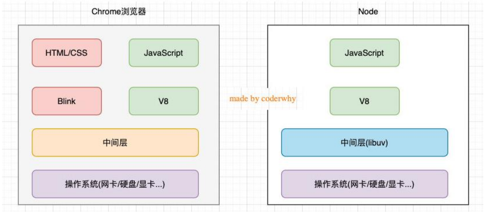

## **Node.js 架构**

**我们来看一个单独的 Node.js 的架构图：**

我们编写的 JavaScript 代码会经过 V8 引擎，再通过 Node.js 的 Bindings，将任务放到 Libuv 的事件循环中；

**libuv**（Unicorn Velociraptor—独角伶盗龙）是使用 C 语言编写的库；

libuv 提供了事件循环、文件系统读写、网络 IO、线程池等等内容；

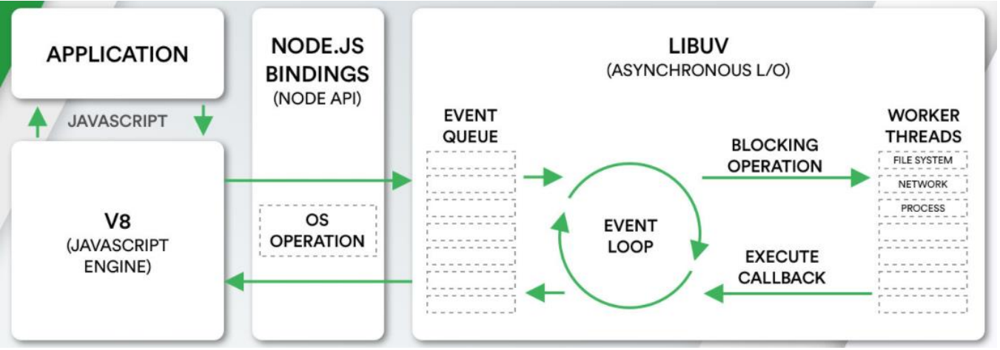

## **Node.js 的应用场景**

**Node.js 的快速发展也让企业对 Node.js 技术越来越重视，在前端招聘中通常会对 Node.js 有一定的要求，特别对于高级前端开发工程师，Node.js 更是必不可少的技能：**

应用一：目前前端开发的库都是以 node 包的形式进行管理；

应用二：npm、yarn、pnpm 工具成为前端开发使用最多的工具；

应用三：越来越多的公司使用 Node.js 作为 web 服务器开发、中间件、代理服务器；

应用四：大量项目需要借助 Node.js 完成前后端渲染的同构应用；

应用五：资深前端工程师需要为项目编写脚本工具（前端工程师编写脚本通常会使用 JavaScript，而不是 Python 或者 shell）；

应用六：很多企业在使用 Electron 来开发桌面应用程序；

## **Node 的安装**

**Node.js 是在 2009 年诞生的，目前最新的版本是分别是 LTS 16.15.1 以及 Current 18.4.0：**

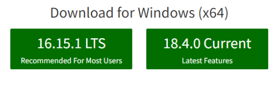

LTS 版本：（Long-term support, 长期支持）相对稳定一些，推荐线上环境使用该版本；

Current 版本：最新的 Node 版本，包含很多新特性；

**这些我们选择什么版本呢？**

如果你是学习使用，可以选择 current 版本；

如果你是公司开发，建议选择 LTS 版本（面向工作，选择 LTS 版本）；

**Node 的安装方式有很多：**

可以借助于一些操作系统上的软件管理工具，比如 Mac 上的 homebrew，Linux 上的 yum、dnf 等；

也可以直接下载对应的安装包下载安装；

**我们选择下载安装，下载自己操作系统的安装包直接安装就可以了：**

window 选择.msi 安装包，Mac 选择.pkg 安装包，Linux 会在后续部署中讲解；

安装过程中会配置环境变量（让我们可以在命令行使用）；

并且会安装 npm（_Node Package Manager_）工具；

node 安装完成查看版本，装完 node 之后 npm 也会跟着安装

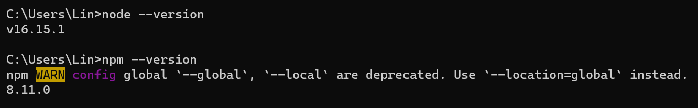

node 执行 js 代码，找到 01_JavaScript 代码-abc.js 所在目录，敲下 01，然后按下 tab 键会自动补全

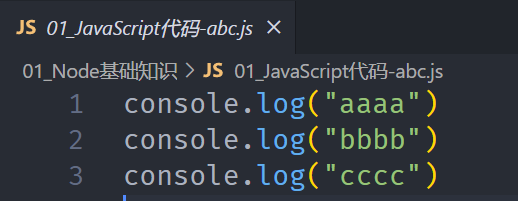

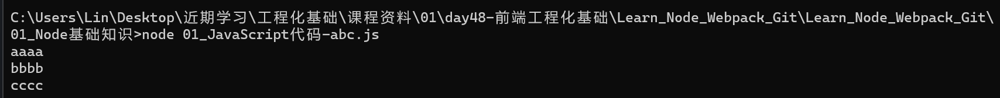

## **Node 的版本工具**

**在实际开发学习中，我们只需要使用一个 Node 版本来开发或者学习即可。**

**但是，如果你希望通过可以快速更新或切换多个版本时，可以借助于一些工具：**

nvm：Node Version Manager；

n：Interactively Manage Your Node.js Versions（交互式管理你的 Node.js 版本）

**问题：这两个工具都不支持 window**

n：n is not supported natively on Windows.

nvm：nvm does not support Windows

**Window 的同学怎么办？**

针对 nvm，在 GitHub 上有提供对应的 window 版本：https://github.com/coreybutler/nvm-windows

通过 nvm install latest 安装最新的 node 版本，也可以 nvm install xx.xx.xx 指定 node 版本安装

通过 nvm list 展示目前安装的所有版本

通过 nvm use 切换版本，必须以管理员身份运行命令行，才能切换 node 版本

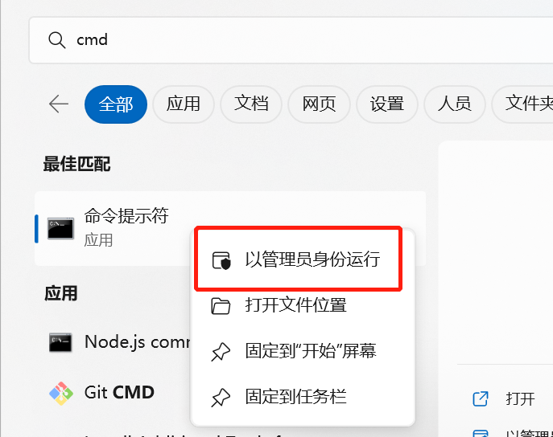

## **版本管理工具：n**

**安装 n：直接使用 npm 安装即可**

```javascript
安装工具n
npm install -g n
查看安装版本
n --version
```

**安装最新的 lts 版本：**

前面添加的 sudo 是权限问题；

可以两个版本都安装，之后我们可以通过 n 快速在两个版本间切换；

```javascript
安装最新的lts版本
n lts
安装最新的版本
n latest
查看所有的版本
n
```

## vscode 中使用终端

快捷键 Ctrl+J，选择 cmd 就可以在 vscode 中使用终端，设置之后重启 vscode 生效

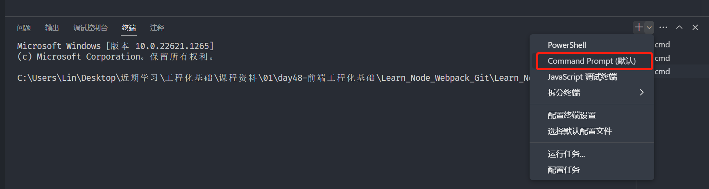

## **JavaScript 代码执行**

**如果我们编写一个 js 文件，里面存放 JavaScript 代码，如何来执行它呢？**

**目前我们知道有两种方式可以执行：**

将代码交给浏览器执行；

将代码载入到 node 环境中执行；

**如果我们希望把代码交给浏览器执行：**

需要通过让浏览器加载、解析 html 代码，所以我们需要创建一个 html 文件；

在 html 中通过 script 标签，引入 js 文件；

当浏览器遇到 script 标签时，就会根据 src 加载、执行 JavaScript 代码；

**如果我们希望把 js 文件交给 node 执行：**

首先电脑上需要安装 Node.js 环境，安装过程中会自动配置环境变量；

可以通过终端命令 node js 文件的方式来载入和执行对应的 js 文件；

## **Node 的 REPL**

**什么是 REPL 呢？感觉挺高大上**

**REPL**是**Read-Eval-Print Loop**的简称，翻译为**“读取-求值-输出”循环**；

REPL 是一个简单的、交互式的编程环境；

**事实上，我们浏览器的 console 就可以看成一个 REPL。**

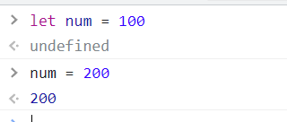

**Node 也给我们提供了一个 REPL 环境，我们可以在其中演练简单的代码。**

如何使用？

直接输入 node 即可，然后就可以和浏览器的 console 一样，按两次 Ctrl+C 退出，在 cmd 终端中按 cls 清屏

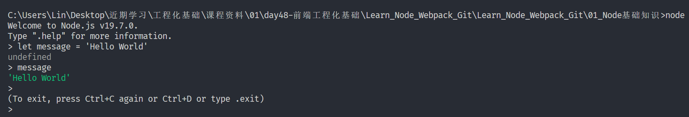

## **Node 程序传递参数**

**正常情况下执行一个 node 程序，直接跟上我们对应的文件即可：**

node 02_Node 的输入和输出.js

**但是，在某些情况下执行 node 程序的过程中，我们可能希望给 node 传递一些参数：**

node 02_Node 的输入和输出.js a=20 b=30

**如果我们这样来使用程序，就意味着我们需要在程序中获取到传递的参数：**

获取参数其实是在 process 的内置对象中的；

如果我们直接打印这个内置对象，它里面包含特别的信息：

其他的一些信息，比如版本、操作系统等大家可以自行查看，后面用到一些其他的我们还会提到；

**现在，我们先找到其中的 argv 属性：**

我们发现它是一个数组，里面包含了我们需要的参数；

## **为什么叫 argv 呢？**

**你可能有个疑问，为什么叫 argv 呢？**

**在 C/C++程序中的 main 函数中，实际上可以获取到两个参数：**

argc：argument counter 的缩写，传递参数的个数；

argv：argument vector（向量、矢量）的缩写，传入的具体参数。

vector 翻译过来是矢量的意思，在程序中表示的是一种数据结构。

在 C++、Java 中都有这种数据结构，是一种数组结构；

在 JavaScript 中也是一个数组，里面存储一些参数信息；

**我们可以在代码中，将这些参数信息遍历出来，使用：**

## **Node 的输出**

**console.log**

最常用的输入内容的方式：console.log

**console.clear**

清空控制台：console.clear

**console.trace**

打印函数的调用栈：console.trace

**还有一些其他的方法，其他的一些 console 方法，可以自己在下面学习研究一下。**

https://nodejs.org/dist/latest-v16.x/docs/api/console.html

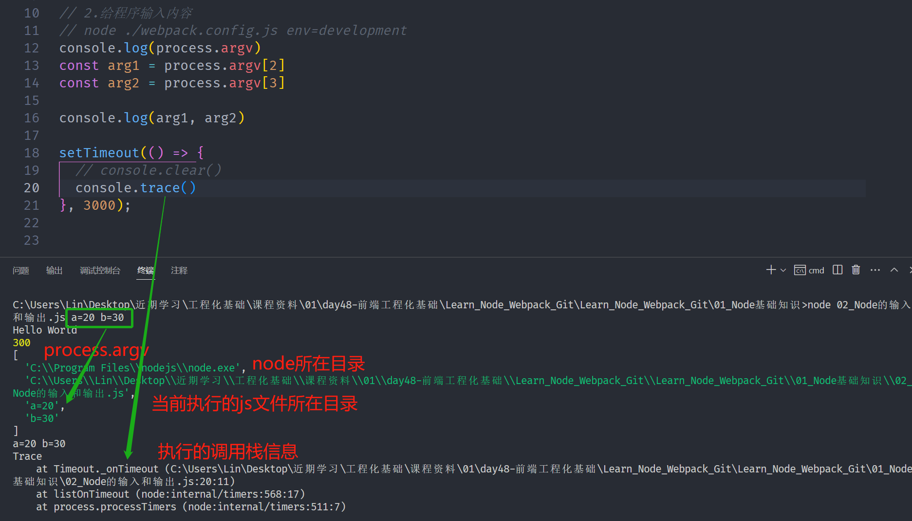

## **常见的全局对象**

**Node 中给我们提供了一些全局对象，方便我们进行一些操作：**

这些全局对象，我们并不需要从一开始全部一个个学习；

某些全局对象并不常用；

某些全局对象我们会在后续学习中讲到；

比如 module、exports、require()会在模块化中讲到；

比如 Buffer 后续会专门讲到；

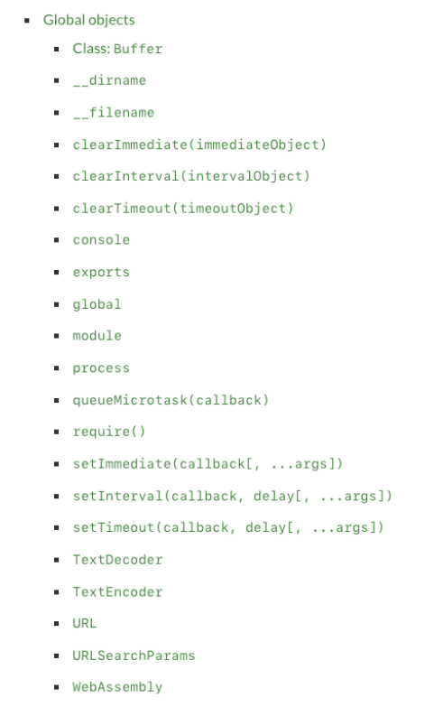

## **特殊的全局对象**

**为什么我称之为特殊的全局对象呢？**

这些全局对象实际上是模块中的变量，只是每个模块都有，看来像是全局变量；

在命令行交互中是不可以使用的；

包括：`__dirname`、`__filename`、exports、module、require()

**\_\_dirname：**获取当前文件所在的路径：

注意：不包括后面的文件名

**\_\_filename：**获取当前文件所在的路径和文件名称：

注意：包括后面的文件名称

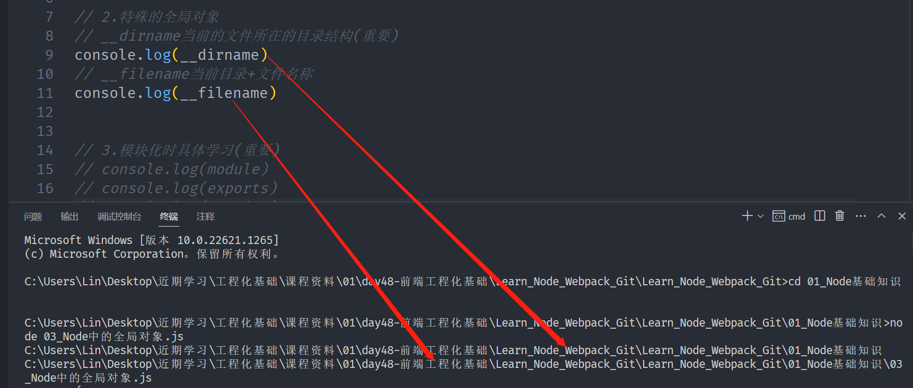

## **常见的全局对象**

**process 对象：**process 提供了 Node 进程中相关的信息：

比如 Node 的运行环境、参数信息等；

后面在项目中，我也会讲解，如何将一些环境变量读取到 process 的 env 中；

**console 对象：**提供了简单的调试控制台，在前面讲解输入内容时已经学习过了。

更加详细的查看官网文档：https://nodejs.org/api/console.html

**定时器函数：**在 Node 中使用定时器有好几种方式：

setTimeout(callback, delay[, ...args])：callback 在 delay 毫秒后执行一次；

setInterval(callback, delay[, ...args])：callback 每 delay 毫秒重复执行一次；

setImmediate(callback[, ...args])：callbackI / O 事件后的回调的“立即”执行；

这里先不展开讨论它和 setTimeout(callback, 0)之间的区别；

因为它涉及到事件循环的阶段问题，我会在后续详细讲解事件循环相关的知识；

process.nextTick(callback[, ...args])：添加到下一次 tick 队列中；

具体的讲解，也放到事件循环中说明；

## **global 对象**

**global 是一个全局对象，事实上前端我们提到的 process、console、setTimeout 等都有被放到 global 中：**

我们之前讲过：在新的标准中还有一个 globalThis，也是指向全局对象的；

类似于浏览器中的 window；

```javascript
console.log(global === globalThis); // true
```

## **global 和 window 的区别**

**在浏览器中，全局变量都是在 window 上的，比如有 document、setInterval、setTimeout、alert、console 等等**

**在 Node 中，我们也有一个 global 属性，并且看起来它里面有很多其他对象。**

**但是在浏览器中执行的 JavaScript 代码，如果我们在顶级范围内通过 var 定义的一个属性，默认会被添加到 window 对象上：**

```javascript
var name = "coderwhy";
console.log(window.name); // coderwhy
```

**但是在 node 中，我们通过 var 定义一个变量，它只是在当前模块中有一个变量，不会放到全局中：**

```javascript
var name = "coderwhy";
console.log(global.name); // undefined
```
