## **认识 Stream**

**什么是 Stream（小溪、小河，在编程中通常翻译为流）呢？**

我们的第一反应应该是流水，源源不断的流动；

程序中的流也是类似的含义，我们可以想象当我们从一个文件中读取数据时，文件的二进制（字节）数据会源源不断的被读取到我们程序中；

而这个一连串的字节，就是我们程序中的流；

**所以，我们可以这样理解流：**

是连续字节的一种表现形式和抽象概念；

流应该是可读的，也是可写的；

**在之前学习文件的读写时，我们可以直接通过 readFile 或者 writeFile 方式读写文件，为什么还需要流呢？**

直接读写文件的方式，虽然简单，但是无法控制一些细节的操作；

比如从什么位置开始读、读到什么位置、一次性读取多少个字节；

读到某个位置后，暂停读取，某个时刻恢复继续读取等等；

或者这个文件非常大，比如一个视频文件，一次性全部读取并不合适；

## **文件读写的 Stream**

**事实上 Node 中很多对象是基于流实现的：**

http 模块的 Request 和 Response 对象；

**官方文档：另外所有的流都是 EventEmitter 的实例。**

**那么在 Node 中都有哪些流呢？**

**Node.js 中有四种基本流类型：**

Writable：可以向其写入数据的流（例如 fs.createWriteStream()）。

Readable：可以从中读取数据的流（例如 fs.createReadStream()）。

Duplex：同时为 Readable 和 Writable（例如 net.Socket）。

Transform：Duplex 可以在写入和读取数据时修改或转换数据的流（例如 zlib.createDeflate()）。

**这里我们通过 fs 的操作，讲解一下 Writable、Readable，另外两个大家可以自行学习一下。**

## **Readable**

**之前我们读取一个文件的信息：**


**这种方式是一次性将一个文件中所有的内容都读取到程序（内存）中，但是这种读取方式就会出现我们之前提到的很多问题：**

文件过大、读取的位置、结束的位置、一次读取的大小；

**这个时候，我们可以使用 createReadStream，我们来看几个参数，更多参数可以参考官网：**

start：文件读取开始的位置；

end：文件读取结束的位置；

highWaterMark：一次性读取字节的长度，默认是 64kb；

```javascript
const fs = require("fs");

// 1.一次性读取
// 缺点一: 没有办法精准控制从哪里读取, 读取什么位置.
// 缺点二: 读取到某一个位置的, 暂停读取, 恢复读取.
// 缺点三: 文件非常大的时候, 多次读取.
// fs.readFile('./aaa.txt', (err, data) => {
//   console.log(data)
// })

// 2.通过流读取文件
// 2.1. 创建一个可读流
// start: 从什么位置开始读取
// end: 读取到什么位置后结束(包括end位置字节)
const readStream = fs.createReadStream("./aaa.txt", {
  start: 8,
  end: 22,
  highWaterMark: 3, // 每次读取3个字节
});
// 可以通过监听data事件，获取读取到的数据
readStream.on("data", (data) => {
  console.log(data.toString());

  readStream.pause(); // 暂停

  setTimeout(() => {
    readStream.resume(); // 恢复
  }, 2000);
});
```

## 可读流的其他事件

```javascript
const fs = require("fs");

// 1.通过流读取文件
const readStream = fs.createReadStream("./aaa.txt", {
  start: 8,
  end: 22,
  highWaterMark: 3,
});

// 2.监听读取到的数据
readStream.on("data", (data) => {
  console.log(data.toString());
});

// 3.补充其他的事件监听
readStream.on("open", (fd) => {
  console.log("通过流将文件打开~", fd);
});

readStream.on("end", () => {
  console.log("已经读取到end位置");
});

readStream.on("close", () => {
  console.log("文件读取结束, 并且被关闭");
});
```

## **Writable**

**之前我们写入一个文件的方式是这样的：**


**这种方式相当于一次性将所有的内容写入到文件中，但是这种方式也有很多问题：**

比如我们希望一点点写入内容，精确每次写入的位置等；

**这个时候，我们可以使用 createWriteStream，我们来看几个参数，更多参数可以参考官网：**

flags：默认是 w，如果我们希望是追加写入，可以使用 a 或者 a+；

start：写入的位置；

## **Writable 的使用**

**我们进行一次简单的写入**


**你可以监听 open 事件：**


## **close 的监听**

**我们会发现，我们并不能监听到 close 事件：**

这是因为写入流在打开后是不会自动关闭的；

我们必须手动关闭，来告诉 Node 已经写入结束了；

并且会发出一个 finish 事件的；

**另外一个非常常用的方法是 end：end 方法相当于做了两步操作： write 传入的数据和调用 close 方法；**


```javascript
const fs = require("fs");

// 1.一次性写入内容
// fs.writeFile('./bbb.txt', 'hello world', {
//   encoding: 'utf-8',
//   flag: 'a+'
// }, (err) => {
//   console.log('写入文件结果:', err)
// })

// 2.创建一个写入流
const writeStream = fs.createWriteStream("./ccc.txt", {
  flags: "a",
});

writeStream.on("open", (fd) => {
  console.log("文件被打开", fd);
});

writeStream.write("coderwhy");
writeStream.write("aaaa");
writeStream.write("bbbb", (err) => {
  console.log("写入完成:", err);
});

writeStream.on("finish", () => {
  console.log("写入完成了");
});

writeStream.on("close", () => {
  console.log("文件被关闭~");
});

// 3.写入完成时, 需要手动去掉用close方法
// writeStream.close()

// 4.end方法:
// 操作一: 将最后的内容写入到文件中, 并且关闭文件
// 操作二: 关闭文件
writeStream.end("哈哈哈哈");
```

## 可写流的 start 属性

```javascript
const fs = require("fs");

const writeStream = fs.createWriteStream("./ddd.txt", {
  // mac上面是没有问题
  // flags: 'a+',
  // window上面是需要使用r+
  flags: "r+",
  start: 5, // 如果想在第5个位置写入，window上必须使用r+
});

writeStream.write("my name is why");
writeStream.close();
```

## **pipe 方法**

**正常情况下，我们可以将读取到的 输入流，手动的放到 输出流中进行写入：**


**我们也可以通过 pipe 来完成这样的操作：**


文件的拷贝流操作

```javascript
const fs = require("fs");

// 1.方式一: 一次性读取和写入文件
// fs.readFile('./foo.txt', (err, data) => {
//   console.log(data)
//   fs.writeFile('./foo_copy01.txt', data, (err) => {
//     console.log('写入文件完成', err)
//   })
// })

// 2.方式二: 创建可读流和可写流
// const readStream = fs.createReadStream('./foo.txt')
// const writeStream = fs.createWriteStream('./foo_copy02.txt')

// readStream.on('data', (data) => {
//   writeStream.write(data)
// })

// readStream.on('end', () => [
//   writeStream.close()
// ])

// 3.在可读流和可写流之间建立一个管道 将foo.txt拷贝一份到foo_copy03.txt
const readStream = fs.createReadStream("./foo.txt");
const writeStream = fs.createWriteStream("./foo_copy03.txt");

readStream.pipe(writeStream);
```

## **Web 服务器**

**什么是 Web 服务器？**

当应用程序（客户端）需要某一个资源时，可以向一台服务器，通过 Http 请求获取到这个资源；

提供资源的这个服务器，就是一个 Web 服务器；

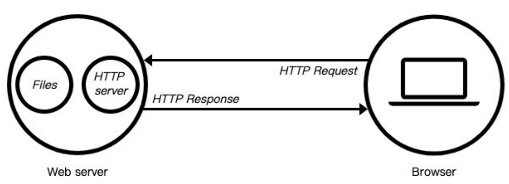

**目前有很多开源的 Web 服务器：Nginx、Apache（静态）、Apache Tomcat（静态、动态）、Node.js**

## **http 模块**

**在 Node 中，提供 web 服务器的资源返回给浏览器，主要是通过 http 模块。**

**我们先简单对它做一个使用：**


```javascript
const http = require("http");

// 创建一个http对应的服务器
const server = http.createServer((request, response) => {
  // request对象中包含本次客户端请求的所有信息
  // 请求的url
  // 请求的method
  // 请求的headers
  // 请求携带的数据

  // response对象用于给客户端返回结果的
  response.end("Hello World");
});

// 开启对应的服务器, 并且告知需要监听的端口
// 监听端口时, 监听1024以上的端口, 65535以下的端口
// 1025~65535之间的端口
// 2个字节 => 256*256 => 65536 => 0~65535
server.listen(8000, () => {
  console.log("服务器已经开启成功了~");
});
```

## **创建服务器**

**创建服务器对象，我们是通过 createServer 来完成的**

http.createServer 会返回服务器的对象；

底层其实使用直接 new Server 对象。


**那么，当然，我们也可以自己来创建这个对象：**


**上面我们已经看到，创建 Server 时会传入一个回调函数，这个回调函数在被调用时会传入两个参数：**

req：request 请求对象，包含请求相关的信息；

res：response 响应对象，包含我们要发送给客户端的信息；

```javascript
const http = require("http");

// 1.创建一个服务器
const server1 = http.createServer((req, res) => {
  res.end("2000端口服务器返回的结果~");
});
server1.listen(2000, () => {
  console.log("2000端口对应的服务器启动成功~");
});

// 2.创建第二个服务器
const server2 = http.createServer((req, res) => {
  res.end("3000端口服务器返回的结果~");
});
server2.listen(3000, () => {
  console.log("3000端口对应的服务器启动成功~");
});

// 3.创建第三个服务器
// const server3 = new http.Server()
```

## **监听主机和端口号**

**Server**通过 listen 方法来开启服务器，并且在某一个主机和端口上监听网络请求：

也就是当我们通过 ip:port 的方式发送到我们监听的 Web 服务器上时；

我们就可以对其进行相关的处理；

**listen 函数有三个参数：**

端口 port: 可以不传, 系统会默认分配端, 后续项目中我们会写入到环境变量中；

主机 host: 通常可以传入 localhost、ip 地址 127.0.0.1、或者 ip 地址 0.0.0.0，默认是 0.0.0.0；

- localhost：本质上是一个域名，通常情况下会被解析成 127.0.0.1；
- 127.0.0.1：回环地址（Loop Back Address），表达的意思其实是我们主机自己发出去的包，直接被自己接收；
  - 正常的数据库包进出 应用层 - 传输层 - 网络层 - 数据链路层 - 物理层 ；
  - 而回环地址，是在网络层直接就被获取到了，是不会进出数据链路层和物理层的；
  - 比如我们监听 127.0.0.1 时，在同一个网段下的主机中，通过 ip 地址是不能访问的；
- 0.0.0.0：
  - 监听 IPV4 上所有的地址，再根据端口找到不同的应用程序；
  - 比如我们监听 0.0.0.0 时，在同一个网段下的主机中，通过 ip 地址是可以访问的；

回调函数：服务器启动成功时的回调函数；

## 额外知识点补充

```javascript
const http = require("http");

// 1.创建server服务器
const server = http.createServer((req, res) => {
  console.log("服务器被访问~");

  res.end("hello world aaaa");
});

// 2.开启server服务器
server.listen(8000, () => {
  console.log("服务器开启成功~");
});
```

我们在开启一个 sever 服务器的时候，发现上面的服务器被访问打印了 2 次，这是因为在浏览器除了访问`localhost:8000/`，还会访问`localhost:8000/favicon`，而且浏览器只能测试 get 请求，没法测试 post 请求。

基于以上两点，我们推荐使用 postman 这个工具。

首先，我们执行

```json
node 03_额外小知识点的补充.js
```

开启服务器，然后在 postman 工具中发送请求，输入地址，点击 send 即可。

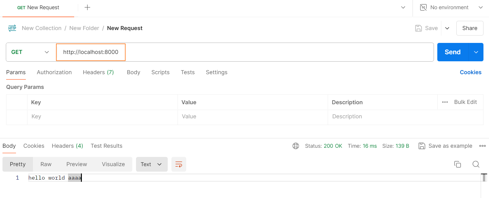

我们发现，每次改一个东西都要重新执行 node 03\_额外小知识点的补充.js 来重启服务器，比较麻烦，我们可以通过全局安装 nodemon 这个工具，就可以自动重启 node 服务器。

## **http 服务器-request 对象**

**在向服务器发送请求时，我们会携带很多信息，比如：**

本次请求的 URL，服务器需要根据不同的 URL 进行不同的处理；

本次请求的请求方式，比如 GET、POST 请求传入的参数和处理的方式是不同的；

本次请求的 headers 中也会携带一些信息，比如客户端信息、接受数据的格式、支持的编码格式等；

等等...

**这些信息，Node 会帮助我们封装到一个 request 的对象中，我们可以直接来处理这个 request 对象：**

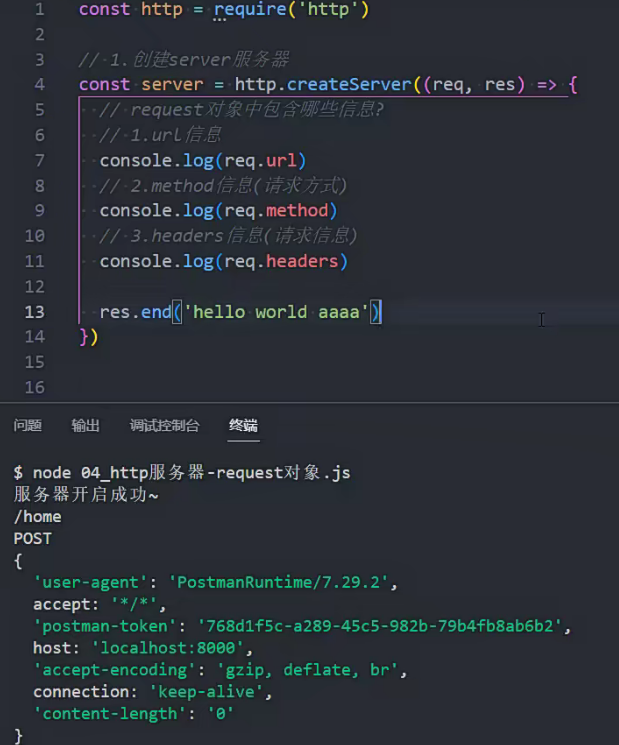

```javascript
const http = require("http");

// 1.创建server服务器
const server = http.createServer((req, res) => {
  // request对象中包含哪些信息?
  // 1.url信息
  console.log(req.url);
  // 2.method信息(请求方式)
  console.log(req.method);
  // 3.headers信息(请求信息)
  console.log(req.headers);

  res.end("hello world aaaa");
});

// 2.开启server服务器
server.listen(8000, () => {
  console.log("服务器开启成功~");
});
```

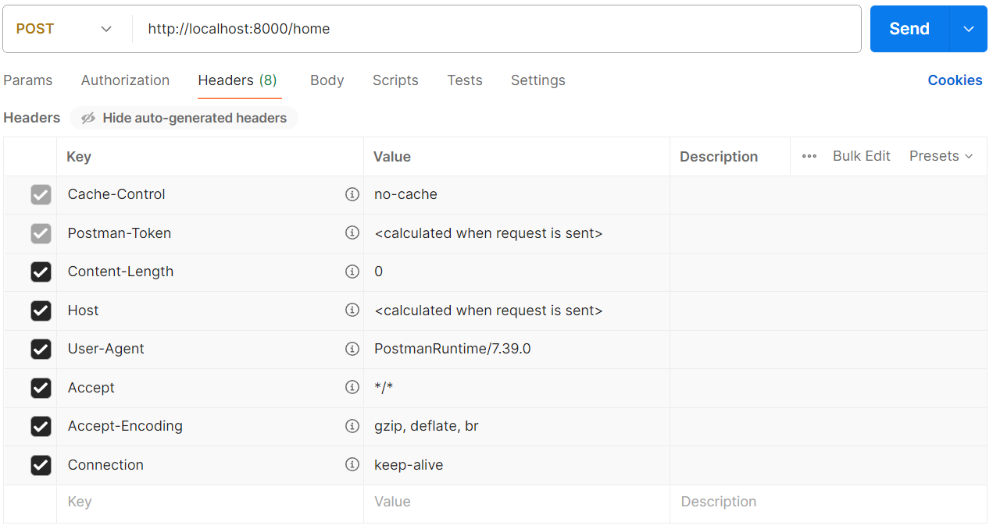

## http 服务器-区分不同 url

**客户端在发送请求时，会请求不同的数据，那么会传入不同的请求地址：**

比如 `http://localhost:8000/login`；

比如 `http://localhost:8000/products`;

**服务器端需要根据不同的请求地址，作出不同的响应：**

```javascript
const http = require("http");

// 1.创建server服务器
const server = http.createServer((req, res) => {
  const url = req.url;

  if (url === "/login") {
    res.end("登录成功~");
  } else if (url === "/products") {
    res.end("商品列表~");
  } else if (url === "/lyric") {
    res.end("天空好想下雨, 我好想住你隔壁!");
  }
});

// 2.开启server服务器
server.listen(8000, () => {
  console.log("服务器开启成功~");
});
```

## http 服务器-区分不同 method

**在 Restful 规范（设计风格）中，我们对于数据的增删改查应该通过不同的请求方式：**

- GET：查询数据；
- POST：新建数据；
- PATCH：更新数据；
- DELETE：删除数据；

**所以，我们可以通过判断不同的请求方式进行不同的处理。**

比如创建一个用户；

请求接口为 /users；

请求方式为 POST 请求；

携带数据 username 和 password；

```javascript
const http = require("http");

// 1.创建server服务器
const server = http.createServer((req, res) => {
  const url = req.url;
  const method = req.method;

  if (url === "/login") {
    if (method === "POST") {
      // 只有当请求地址为/login并且请求方式为POST才能登录成功
      res.end("登录成功~");
    } else {
      res.end("不支持的请求方式, 请检测你的请求方式~");
    }
  } else if (url === "/products") {
    res.end("商品列表~");
  } else if (url === "/lyric") {
    res.end("天空好想下雨, 我好想住你隔壁!");
  }
});

// 2.开启server服务器
server.listen(8000, () => {
  console.log("服务器开启成功~");
});
```

## nodemon 工具

前面每次开启服务我们都需要执行比如

```json
node 06_http服务器-区分不同method.js
```

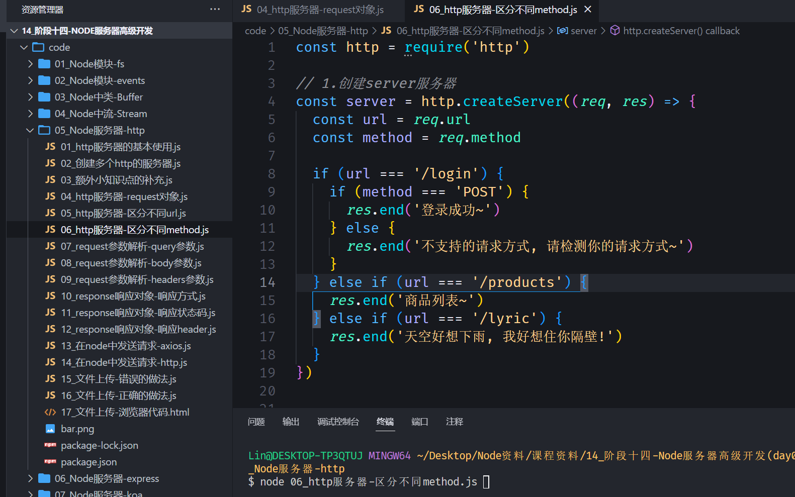

但是这样会有个弊端，假如 06_http 服务器-区分不同 method.js 这个文件发生了修改，那么就又要重新执行命令非常麻烦。

有没有办法可以自动监听到 06_http 服务器-区分不同 method.js 这个文件的变化，自动开启服务呢？

答案是使用 nodemon，我们使用 npm 安装即可

```json
npm install nodemon -g
```

接着，就执行

```json
nodemon 06_http服务器-区分不同method.js
```

这样一旦文件发生变化，就会自动执行。

## request 参数解析-query 参数

**那么如果用户发送的地址中还携带一些额外的参数呢？**

**我们如何对它进行解析呢？使用内置模块 url：**

**但是 query 信息如何可以获取呢？**

```javascript
const http = require("http");
const url = require("url");
const qs = require("querystring");

// 1.创建server服务器
const server = http.createServer((req, res) => {
  // 1.参数一: query类型参数
  // /home/list?offset=100&size=20
  // 1.1.解析url
  const urlString = req.url;
  const urlInfo = url.parse(urlString);

  // 1.2.解析query: offset=100&size=20
  const queryString = urlInfo.query;
  const queryInfo = qs.parse(queryString);
  console.log(queryInfo.offset, queryInfo.size); // 100 20

  res.end("hello world aaaa bbb");
});

// 2.开启server服务器
server.listen(8000, () => {
  console.log("服务器开启成功~");
});
```

## request 参数解析-body 参数

在 postman 工具中，选择 body，选择 raw，选择 JSON 格式，输入以下内容

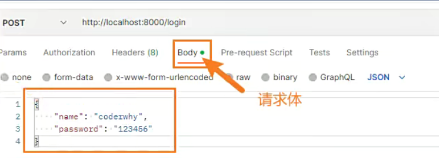

```javascript
const http = require("http");
const url = require("url");
const qs = require("querystring");

// 1.创建server服务器
const server = http.createServer((req, res) => {
  // 获取参数: body参数
  req.setEncoding("utf-8");

  // request对象本质是上一个readable可读流
  let isLogin = false;
  req.on("data", (data) => {
    const dataString = data;
    const loginInfo = JSON.parse(dataString);
    // 判断用户名和密码都正确才登录成功
    if (loginInfo.name === "coderwhy" && loginInfo.password === "123456") {
      isLogin = true;
    } else {
      isLogin = false;
    }
  });

  req.on("end", () => {
    if (isLogin) {
      res.end("登录成功, 欢迎回来~");
    } else {
      res.end("账号或者密码错误, 请检测登录信息~");
    }
  });
});

// 2.开启server服务器
server.listen(8000, () => {
  console.log("服务器开启成功~");
});
```

## request 参数解析-headers 参数

**在 request 对象的 header 中也包含很多有用的信息，客户端会默认传递过来一些信息：**

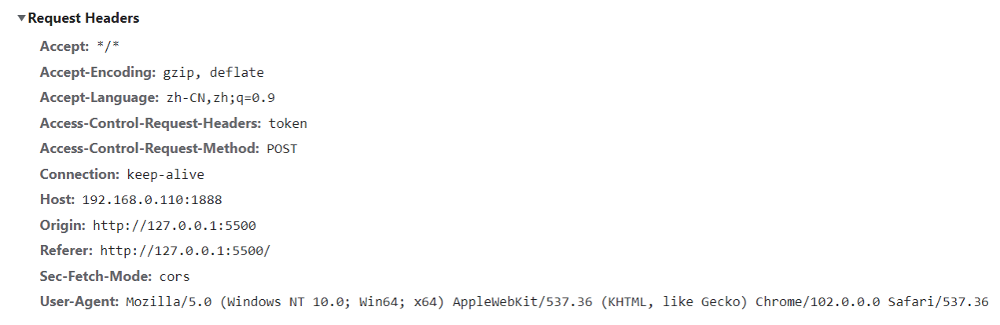

**content-type 是这次请求携带的数据的类型：**

- application/x-www-form-urlencoded：表示数据被编码成以 '&' 分隔的键 - 值对，同时以 '=' 分隔键和值
- application/json：表示是一个 json 类型；
- text/plain：表示是文本类型；
- application/xml：表示是 xml 类型；
- multipart/form-data：表示是上传文件；

**content-length：文件的大小长度**

**keep-alive：**

http 是基于 TCP 协议的，但是通常在进行一次请求和响应结束后会立刻中断；

在 http1.0 中，如果想要继续保持连接：

- 浏览器需要在请求头中添加 connection: keep-alive；
- 服务器需要在响应头中添加 connection:keey-alive；
- 当客户端再次放请求时，就会使用同一个连接，直接一方中断连接；

在 http1.1 中，所有连接默认是 connection: keep-alive 的；

- 不同的 Web 服务器会有不同的保持 keep-alive 的时间；
- Node 中默认是 5s 中；

**accept-encoding**：告知服务器，客户端支持的文件压缩格式，比如 js 文件可以使用 gzip 编码，对应 .gz 文件；

**accept**：告知服务器，客户端可接受文件的格式类型；

**user-agent**：客户端相关的信息；

```javascript
const http = require("http");
const url = require("url");
const qs = require("querystring");

// 1.创建server服务器
const server = http.createServer((req, res) => {
  console.log(req.headers);
  console.log(req.headers["content-type"]);

  // cookie/session/token
  const token = req.headers["authorization"];
  console.log(token);

  res.end("查看header的信息~");
});

// 2.开启server服务器
server.listen(8000, () => {
  console.log("服务器开启成功~");
});
```

如果这里选择的是 raw 和 JSON，那么请求头的 content-type 就是 application/json

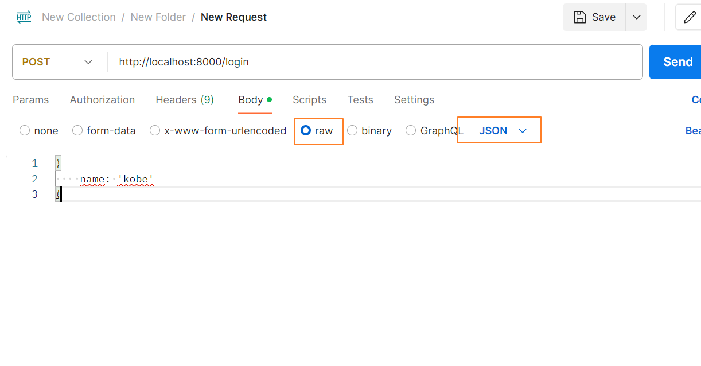


如果选择的是 x-www-form-urlencoded，那么 content-type 就是 application/x-www-form-urlencoded

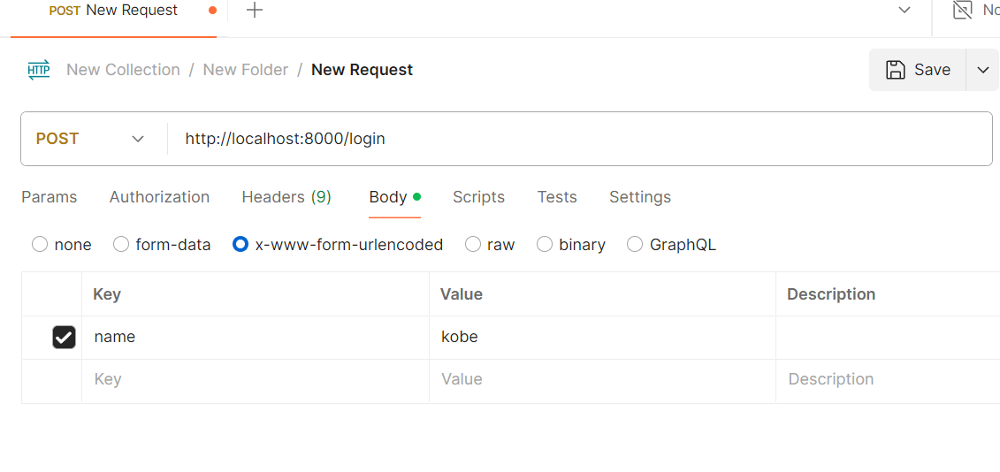


如果 token 这里选择的是 Bear Token，那么就能打印 token

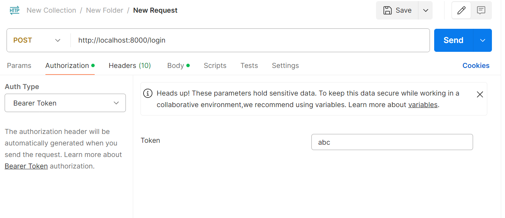


## **返回响应结果**

**如果我们希望给客户端响应的结果数据，可以通过两种方式：**

Write 方法：这种方式是直接写出数据，但是并没有关闭流；

end 方法：这种方式是写出最后的数据，并且写出后会关闭流；

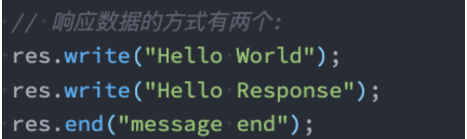

**如果我们没有调用 end，客户端将会一直等待结果：**

所以客户端在发送网络请求时，都会设置超时时间。

```javascript
const http = require("http");

// 1.创建server服务器
const server = http.createServer((req, res) => {
  // res: response对象 => Writable可写流
  // 1.响应数据方式一: write
  res.write("Hello World");
  res.write("哈哈哈哈");

  // // 2.响应数据方式二: end
  res.end("本次写出已经结束");
});

// 2.开启server服务器
server.listen(8000, () => {
  console.log("服务器开启成功~");
});
```

## **返回状态码**

**Http 状态码（Http Status Code）是用来表示 Http 响应状态的数字代码：**

Http 状态码非常多，可以根据不同的情况，给客户端返回不同的状态码；

MDN 响应码解析地址：https://developer.mozilla.org/zh-CN/docs/web/http/status

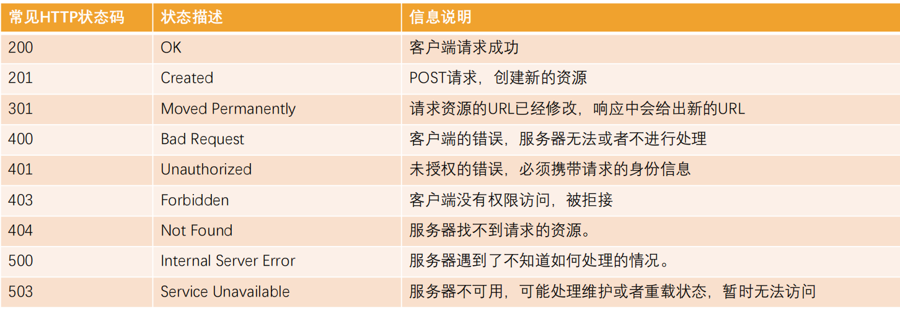

```javascript
const http = require("http");

// 1.创建server服务器
const server = http.createServer((req, res) => {
  // 响应状态码
  // 1.方式一: statusCode
  // res.statusCode = 403

  // 2.方式二: setHead 响应头
  res.writeHead(401);

  res.end("hello world aaaa");
});

// 2.开启server服务器
server.listen(8000, () => {
  console.log("服务器开启成功~");
});
```

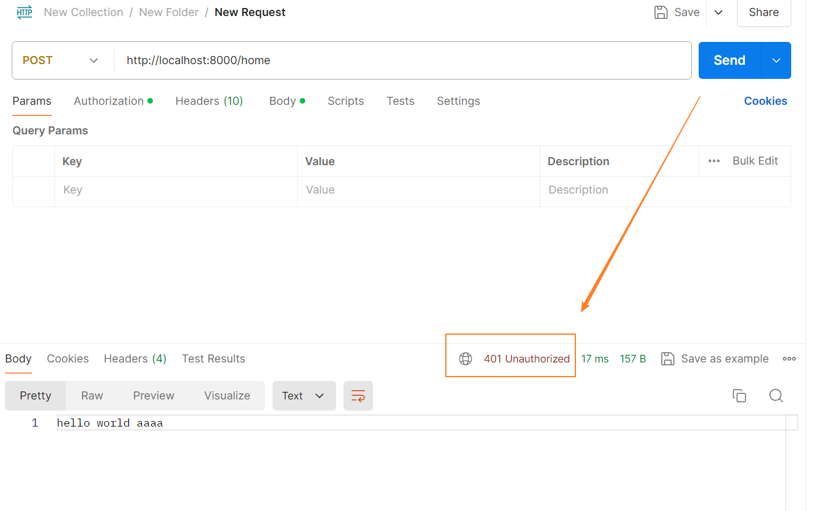

## **响应头文件**

**返回头部信息，主要有两种方式：**

res.setHeader：一次写入一个头部信息；

res.writeHead：同时写入 header 和 status；

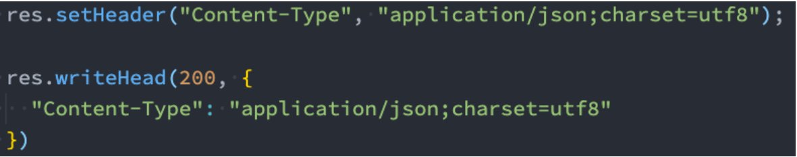

**Header 设置 Content-Type 有什么作用呢？**

默认客户端接收到的是字符串，客户端会按照自己默认的方式进行处理；

```javascript
const http = require("http");

// 1.创建server服务器
const server = http.createServer((req, res) => {
  // 设置header信息: 数据的类型以及数据的编码格式
  // 1.单独设置某一个header
  // res.setHeader('Content-Type', 'text/plain;charset=utf8;')

  // 2.和http status code一起设置
  res.writeHead(200, {
    "Content-Type": "application/json;charset=utf8;",
  });

  const list = [
    { name: "why", age: 18 },
    { name: "kobe", age: 30 },
  ];
  res.end(JSON.stringify(list));
});

// 2.开启server服务器
server.listen(8000, () => {
  console.log("服务器开启成功~");
});
```

如果没有设置 Content-Type，那么浏览器访问`localhost:8000`，就会是

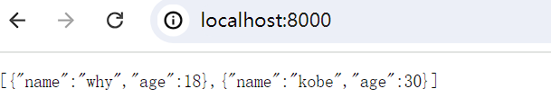

设置之后


## **http 请求**

axios 库可以在浏览器中使用，也可以在 Node 中使用：

在浏览器中，axios 使用的是封装 xhr；

在 Node 中，使用的是 http 内置模块；

下面是使用 http 模块发送网络请求，注意：如果是 post 请求要主动调用 end 结束

```javascript
const http = require("http");

// 1.使用http模块发送get请求
// http.get('http://localhost:8000', (res) => {
//   // 从可读流中获取数据
//   res.on('data', (data) => {
//     const dataString = data.toString()
//     const dataInfo = JSON.parse(dataString)
//     console.log(dataInfo)
//   })
// })

// 2.使用http模块发送post请求
const req = http.request(
  {
    method: "POST",
    hostname: "localhost",
    port: 8000,
  },
  (res) => {
    res.on("data", (data) => {
      const dataString = data.toString();
      const dataInfo = JSON.parse(dataString);
      console.log(dataInfo);
    });
  }
);

// 必须调用end, 表示写入内容完成
req.end();
```

在 Node 中使用 axios 发送网络请求的本质是使用 http 模块

```javascript
const axios = require("axios");

axios.get("http://localhost:8000").then((res) => {
  console.log(res.data);
});
```

## **文件上传 – 错误示范**

如果是一个很大的文件需要上传到服务器端，服务器端进行保存应该如何操作呢？

使用 postman 发送一个 post 请求，选择 form-data

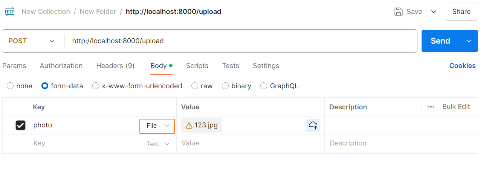

```javascript
const http = require("http");
const fs = require("fs");

// 1.创建server服务器
const server = http.createServer((req, res) => {
  // 创建writable的stream
  const writeStream = fs.createWriteStream("./foo.png", {
    flags: "a+",
  });

  // req.pipe(writeStream)

  // 客户端传递的数据是表单数据(请求体)
  req.on("data", (data) => {
    console.log(data);
    writeStream.write(data);
  });

  req.on("end", () => {
    // console.log("数据传输完成~");
    // writeStream.close()
    res.end("文件上传成功~");
  });
});

// 2.开启server服务器
server.listen(8000, () => {
  console.log("服务器开启成功~");
});
```

先开启服务，然后 postman 发送请求，就会把 123.jpg，写入到 foo.png，但是当打开 foo.png 的时候发现是打不开的。

这是因为 foo.png 包含了一些冗余的信息是我们不需要的，会返回 key 为 photo，value 为 123.jpg 相关的信息，我们只需要拿到图片即可。

## **文件上传 – 正确做法**

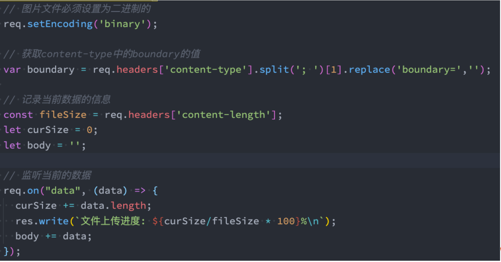


```javascript
const http = require("http");
const fs = require("fs");

// 1.创建server服务器
const server = http.createServer((req, res) => {
  req.setEncoding("binary");

  const boundary = req.headers["content-type"]
    .split("; ")[1]
    .replace("boundary=", "");
  console.log(boundary);

  // 客户端传递的数据是表单数据(请求体)
  let formData = "";
  req.on("data", (data) => {
    formData += data;
  });

  req.on("end", () => {
    console.log(formData);
    // 1.截图从image/jpeg位置开始后面所有的数据
    const imgType = "image/jpeg";
    const imageTypePosition = formData.indexOf(imgType) + imgType.length;
    let imageData = formData.substring(imageTypePosition);

    // 2.imageData开始位置会有两个空格
    imageData = imageData.replace(/^\s\s*/, "");

    // 3.替换最后的boundary
    imageData = imageData.substring(0, imageData.indexOf(`--${boundary}--`));

    // 4.将imageData的数据存储到文件中
    fs.writeFile("./bar.png", imageData, "binary", () => {
      console.log("文件存储成功");
      res.end("文件上传成功~");
    });
  });
});

// 2.开启server服务器
server.listen(8000, () => {
  console.log("服务器开启成功~");
});
```

我们最终截取的是下图括号的部分，但是需要把\r 和\n 这些去掉

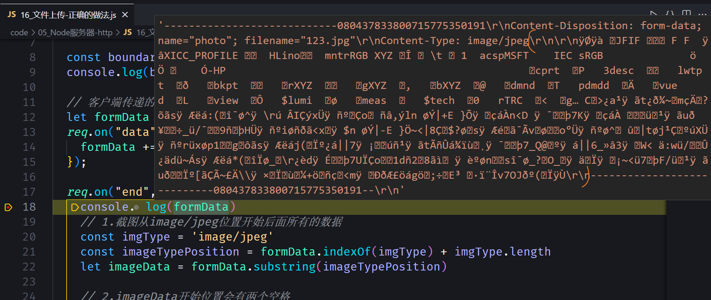

## 文件上传 - 浏览器

```html
<!DOCTYPE html>
<html lang="en">
  <head>
    <meta charset="UTF-8" />
    <meta http-equiv="X-UA-Compatible" content="IE=edge" />
    <meta name="viewport" content="width=device-width, initial-scale=1.0" />
    <title>Document</title>
  </head>
  <body>
    <input type="file" />
    <button>上传</button>

    <script src="https://cdn.jsdelivr.net/npm/axios/dist/axios.min.js"></script>
    <script>
      // 文件上传的逻辑
      const btnEl = document.querySelector("button");
      btnEl.onclick = function () {
        // 1.创建表单对象
        const formData = new FormData();

        // 2.将选中的图标文件放入表单
        const inputEl = document.querySelector("input");
        formData.set("photo", inputEl.files[0]);

        // 3.发送post请求, 将表单数据携带到服务器(axios)
        axios({
          method: "post",
          url: "http://localhost:8000",
          data: formData,
          headers: {
            "Content-Type": "multipart/form-data",
          },
        });
      };
    </script>
  </body>
</html>
```
