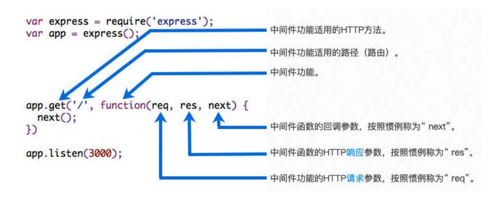
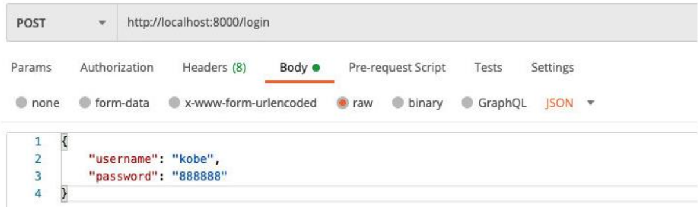
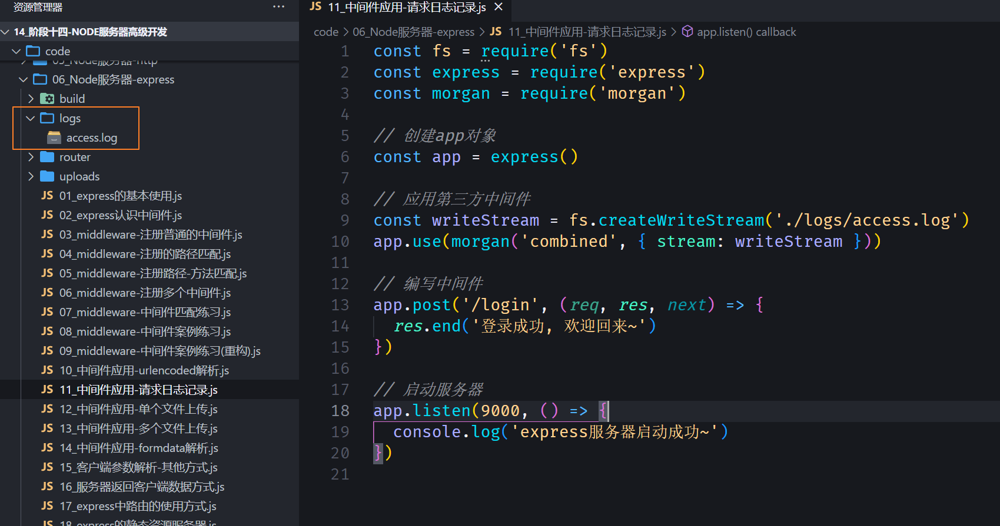
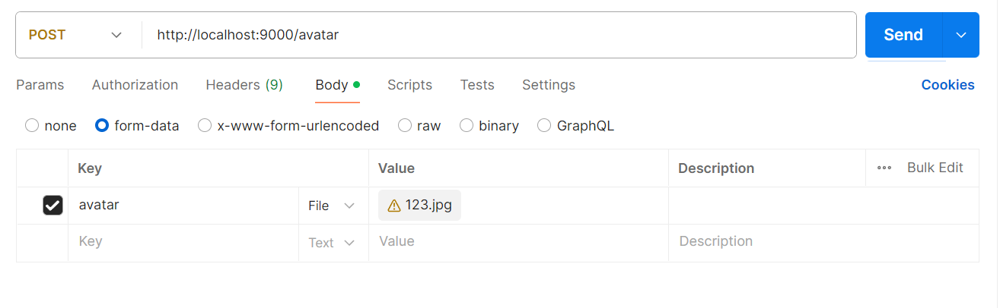
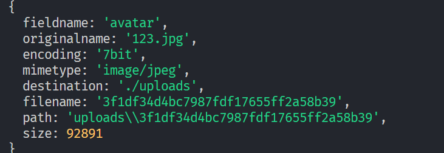
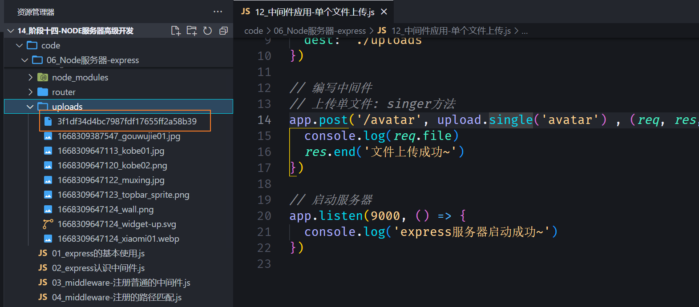
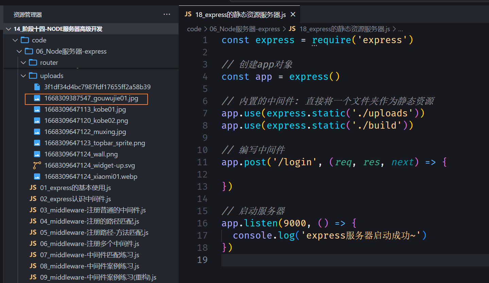
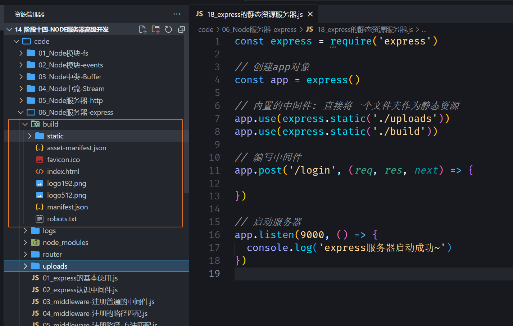

## **认识 Web 框架**

**前面我们已经学习了使用 http 内置模块来搭建 Web 服务器，为什么还要使用框架？**

原生 http 在进行很多处理时，会较为复杂；

有 URL 判断、Method 判断、参数处理、逻辑代码处理等，都需要我们自己来处理和封装；

并且所有的内容都放在一起，会非常的混乱；

**目前在 Node 中比较流行的 Web 服务器框架是 express、koa；**

我们先来学习 express，后面再学习 koa，并且对他们进行对比；

**express 早于 koa 出现，并且在 Node 社区中迅速流行起来：**

我们可以基于 express 快速、方便的开发自己的 Web 服务器；

并且可以通过一些实用工具和中间件来扩展自己功能；

**Express 整个框架的核心就是中间件，理解了中间件其他一切都非常简单！**

## **Express 安装**

**express 的使用过程有两种方式：**

方式一：通过 express 提供的脚手架，直接创建一个应用的骨架；

方式二：从零搭建自己的 express 应用结构；

**方式一：安装 express-generator**

安装脚手架

```json
npm install -g express-generator
```

创建项目

```json
express express-demo
```

安装依赖

```json
npm install
```

启动项目

```json
node bin/www
```

**方式二：从零搭建自己的 express 应用结构；**

```json
npm init -y
```

## **Express 的基本使用**

**Express 的基本使用**

我们会发现，之后的开发过程中，可以方便的将请求进行分离：

无论是不同的 URL，还是 get、post 等请求方式；

这样的方式非常方便我们已经进行维护、扩展；

当然，这只是初体验，接下来我们来探索更多的用法；

**请求的路径中如果有一些参数，可以这样表达：**

/users/:userId；

在 request 对象中药获取可以通过 req.params.userId;

**返回数据，我们可以方便的使用 json：**

res.json(数据)方式；

可以支持其他的方式，可以自行查看文档；

https://www.expressjs.com.cn/guide/routing.html

```javascript
const express = require("express");

// 1.创建express的服务器
const app = express();

// 客户端访问URL: /login和/home
app.post("/login", (req, res) => {
  // 处理login请求
  res.end("登录成功, 欢迎回来~");
});

app.get("/home", (req, res) => {
  res.end("首页的轮播图/推荐数据列表~");
});

// 2.启动服务器, 并且监听端口
app.listen(9000, () => {
  console.log("express服务器启动成功~");
});
```

## **认识中间件**

**Express 是一个路由和中间件的 Web 框架，它本身的功能非常少：**

Express 应用程序本质上是一系列中间件函数的调用；

**中间件是什么呢？**

中间件的本质是传递给 express 的一个回调函数；

这个回调函数接受三个参数：

- 请求对象（request 对象）；
- 响应对象（response 对象）；
- next 函数（在 express 中定义的用于执行下一个中间件的函数）；

**中间件中可以执行哪些任务呢？**

执行任何代码；

更改请求（request）和响应（response）对象；

结束请求-响应周期（返回数据）；

调用栈中的下一个中间件；

**如果当前中间件功能没有结束请求-响应周期，则必须调用 next()将控制权传递给下一个中间件功能，否则，请求将被挂起。**



```javascript
const express = require("express");

const app = express();

// 给express创建的app传入一个回调函数
// 传入的这个回调函数就称之为是中间件(middleware)
// app.post('/login', 回调函数 => 中间件)
app.post("/login", (req, res, next) => {
  // 1.中间件中可以执行任意代码
  console.log("first middleware exec~");
  // 打印
  // 查询数据
  // 判断逻辑

  // 2.在中间件中修改req/res对象
  req.age = 99;

  // 3.可以在中间件中结束响应周期
  // res.json({ message: "登录成功, 欢迎回来", code: 0 })

  // 4.执行下一个中间件
  next();
});

app.use((req, res, next) => {
  console.log("second middleware exec~");
});

app.listen(9000, () => {
  console.log("express服务器启动成功~");
});
```

执行 next()，就会 app.use，因为 app.use 是一个中间件。

## **应用中间件 – 自己编写**

**那么，如何将一个中间件应用到我们的应用程序中呢？**

express 主要提供了两种方式：

- app/router.use；
- app/router.methods；

可以是 app，也可以是 router，router 我们后续再学习:

methods 指的是常用的请求方式，比如： app.get 或 app.post 等；

**我们先来学习 use 的用法，因为 methods 的方式本质是 use 的特殊情况；**

**案例一：最普通的中间件**

**案例二：path 匹配中间件**

**案例三：path 和 method 匹配中间件**

**案例四：注册多个中间件**

### 最普通的中间件

```javascript
const express = require("express");

const app = express();

// 总结: 当express接收到客户端发送的网络请求时, 在所有中间中开始进行匹配
// 当匹配到第一个符合要求的中间件时, 那么就会执行这个中间件
// 后续的中间件是否会执行呢? 取决于上一个中间件有没有执行next

// 通过use方法注册的中间件是最普通的/简单的中间件
// 通过use注册的中间件, 无论是什么请求方式都可以匹配上
// login/get
// login/post
// abc/patch
app.use((req, res, next) => {
  console.log("normal middleware 01");
  // res.end('返回结果了, 不要等了')
  next();
});

app.use((req, res, next) => {
  console.log("normal middleware 02");
});

// 开启服务器
app.listen(9000, () => {
  console.log("express服务器启动成功~");
});
```

### path 匹配中间件

```javascript
const express = require("express");

const app = express();

// 注册普通的中间件
// app.use((req, res, next) => {
//   console.log('match normal middleware')
//   res.end('--------')
// })

// 注册路径匹配的中间件
// 路径匹配的中间件是不会对请求方式(method)进行限制
app.use("/home", (req, res, next) => {
  console.log("match /home middleware");
  res.end("home data");
});

app.listen(9000, () => {
  console.log("express服务器启动成功~");
});
```

### path 和 method 匹配中间件

```javascript
const express = require("express");

const app = express();

// 注册中间件: 对path/method都有限制
// app.method(path, middleware)
app.get("/home", (req, res, next) => {
  console.log("match /home get method middleware");
  res.end("home data");
});

app.post("/users", (req, res, next) => {
  console.log("match /users post method middleware");
  res.end("create user success");
});

app.listen(9000, () => {
  console.log("express服务器启动成功~");
});
```

### 注册多个中间件

```javascript
const express = require("express");

const app = express();

// app.get(路径, 中间件1, 中间件2, 中间件3)
app.get(
  "/home",
  (req, res, next) => {
    console.log("match /home get middleware01");
    next();
  },
  (req, res, next) => {
    console.log("match /home get middleware02");
    next();
  },
  (req, res, next) => {
    console.log("match /home get middleware03");
    next();
  },
  (req, res, next) => {
    console.log("match /home get middleware04");
  }
);

app.listen(9000, () => {
  console.log("express服务器启动成功~");
});
```

## 中间件匹配练习

```javascript
const express = require("express");

const app = express();

// 1.注册两个普通的中间件
app.use((req, res, next) => {
  console.log("normal middleware01");
  next();
});

app.use((req, res, next) => {
  console.log("normal middleware02");
  next();
});

// 2.注册路径path/method的中间件
app.get(
  "/home",
  (req, res, next) => {
    console.log("/home get middleware01");
    next();
  },
  (req, res, next) => {
    console.log("/home get middleware02");
    next();
  }
);

app.post("/login", (req, res, next) => {
  console.log("/login post middleware");
  next();
});

// 3.注册普通的中间件
app.use((req, res, next) => {
  console.log("normal middleware03");
  next();
});

app.use((req, res, next) => {
  console.log("normal middleware04");
});

app.listen(9000, () => {
  console.log("express服务器启动成功~");
});
```

如果发送的是`http://localhost:9000/abc`，那么匹配的中间件顺序是

```json
normal middleware01
normal middleware02
normal middleware03
normal middleware04
```

如果发送的是`http://localhost:9000/home`，那么匹配的中间件顺序是

app.use 可以匹配任意中间件，尽管这里可以匹配到/home，但是 middleware01 会先匹配

```json
normal middleware01
normal middleware02
/home get middleware01
/home get middleware02
normal middleware03
normal middleware04
```

## **应用中间件 – body 解析**

**并非所有的中间件都需要我们从零去编写：**

express 有内置一些帮助我们完成对 request 解析的中间件；

registry 仓库中也有很多可以辅助我们开发的中间件；

**在客户端发送 post 请求时，会将数据放到 body 中：**

客户端可以通过 json 的方式传递；

也可以通过 form 表单的方式传递；



## **编写解析 request body 中间件**


## **应用中间件 – express 提供**

**但是，事实上我们可以使用 expres 内置的中间件或者使用 body-parser 来完成：**


**如果我们解析的是 application/x-www-form-urlencoded：**


```javascript
const express = require("express");

const app = express();

// 注册两个实际请求的中间件
// 案例一: 用户登录的请求处理 /login post => username/password
app.post("/login", (req, res, next) => {
  // 1.获取本次请求过程中传递过来的json数据
  let isLogin = false;
  req.on("data", (data) => {
    const dataString = data.toString();
    const dataInfo = JSON.parse(dataString);
    if (dataInfo.username === "coderwhy" && dataInfo.password === "123456") {
      isLogin = true;
    }
  });

  req.on("end", () => {
    if (isLogin) {
      res.end("登录成功, 欢迎回来~");
    } else {
      res.end("登录失败, 请检测账号和密码是否正确~");
    }
  });
});

// 案例二: 注册用户的请求处理 /register post => username/password
app.post("/register", (req, res, next) => {
  // 1.获取本次请求过程中传递过来的json数据
  let isRegister = false;
  req.on("data", (data) => {
    const dataString = data.toString();
    const dataInfo = JSON.parse(dataString);
    // 查询数据库中该用户是否已经注册过
    isRegister = false;
  });

  req.on("end", () => {
    if (isRegister) {
      res.end("注册成功, 开始你的旅程~");
    } else {
      res.end("注册失败, 您输入的用户名被注册~");
    }
  });
});

app.listen(9000, () => {
  console.log("express服务器启动成功~");
});
```

对面上面代码进行重构

```javascript
const express = require("express");

const app = express();

// 这个中间件可以用express内置的json方法代替
// app.use((req, res, next) => {
//   if (req.headers['content-type'] === 'application/json') {
//     req.on('data', (data) => {
//       const jsonInfo = JSON.parse(data.toString())
//       req.body = jsonInfo
//     })

//     req.on('end', () => {
//       next()
//     })
//   } else {
//     next()
//   }
// })

// 直接使用express提供给我们的中间件
app.use(express.json()); // 这行代码相当于上面的中间件

// 注册两个实际请求的中间件
// 案例一: 用户登录的请求处理 /login post => username/password
app.post("/login", (req, res, next) => {
  console.log(req.body);
});

// 案例二: 注册用户的请求处理 /register post => username/password
app.post("/register", (req, res, next) => {
  console.log(req.body);
});

app.listen(9000, () => {
  console.log("express服务器启动成功~");
});
```

如果我们解析的是 application/x-www-form-urlencoded


```javascript
const express = require("express");

// 创建app对象
const app = express();

// 应用一些中间件
app.use(express.json()); // 解析客户端传递过来的json
// 解析传递过来urlencoded的时候, 默认使用的node内置querystring模块
// { extended: true }: 不再使用内置的querystring, 而是使用qs第三方库，可以消除警告
app.use(express.urlencoded({ extended: true })); // 解析客户端传递过来的urlencoded

// 编写中间件
app.post("/login", (req, res, next) => {
  console.log(req.body);
  res.end("登录成功, 欢迎回来~");
});

// 启动服务器
app.listen(9000, () => {
  console.log("express服务器启动成功~");
});
```

## **应用中间件 – 第三方中间件**

**如果我们希望将请求日志记录下来，那么可以使用 express 官网开发的第三方库：morgan**

注意：需要单独安装


```javascript
const fs = require("fs");
const express = require("express");
const morgan = require("morgan");

// 创建app对象
const app = express();

// 应用第三方中间件
const writeStream = fs.createWriteStream("./logs/access.log");
app.use(morgan("combined", { stream: writeStream }));

// 编写中间件
app.post("/login", (req, res, next) => {
  res.end("登录成功, 欢迎回来~");
});

// 启动服务器
app.listen(9000, () => {
  console.log("express服务器启动成功~");
});
```

这样每次请求的日志就会被记录到 logs/access.log 中



**上传文件，我们可以使用 express 提供的 multer 来完成：**


## 应用中间件 – 单个文件上传



```javascript
const express = require("express");
const multer = require("multer");

// 创建app对象
const app = express();

// 应用一个express编写第三方的中间件
const upload = multer({
  dest: "./uploads", // 上传到uploads这个文件夹
});

// 编写中间件
// 上传单文件: singer方法
app.post("/avatar", upload.single("avatar"), (req, res, next) => {
  console.log(req.file); // 可以查看文件上传成功的一些信息
  res.end("文件上传成功~");
});

// 启动服务器
app.listen(9000, () => {
  console.log("express服务器启动成功~");
});
```



但是当我们想查看 uploads 文件夹里面的图片文件时发现是打不开的，因为没有后缀名，需要自己补上.jpg 才能显示。



## **上传文件中间件 – 添加后缀名**

**上传文件，我们可以使用 express 提供的 multer 来完成：**


```javascript
const express = require("express");
const multer = require("multer");

// 创建app对象
const app = express();

// 应用一个express编写第三方的中间件
const upload = multer({
  // dest: './uploads'
  storage: multer.diskStorage({
    destination(req, file, callback) {
      callback(null, "./uploads");
    },
    filename(req, file, callback) {
      callback(null, Date.now() + "_" + file.originalname);
    },
  }),
});

// 编写中间件
// 上传单文件: single方法
app.post("/avatar", upload.single("avatar"), (req, res, next) => {
  console.log(req.file);
  res.end("文件上传成功~");
});

// 启动服务器
app.listen(9000, () => {
  console.log("express服务器启动成功~");
});
```

上面配置文件还是上传到 uploads 文件夹中，只不过多了自定义文件的名字，并且也有了后缀。

## 应用中间件 – 多个文件上传


使用的是 upload.array 方法

```javascript
const express = require("express");
const multer = require("multer");

// 创建app对象
const app = express();

// 应用一个express编写第三方的中间件
const upload = multer({
  // dest: './uploads'
  storage: multer.diskStorage({
    destination(req, file, callback) {
      callback(null, "./uploads");
    },
    filename(req, file, callback) {
      callback(null, Date.now() + "_" + file.originalname);
    },
  }),
});

// 上传多文件:
app.post("/photos", upload.array("photos"), (req, res, next) => {
  console.log(req.files);
  res.end("上传多张照片成功~");
});

// 启动服务器
app.listen(9000, () => {
  console.log("express服务器启动成功~");
});
```

## **multer 解析 form-data**

**如果我们希望借助于 multer 帮助我们解析一些 form-data 中的普通数据，那么我们可以使用 any：**


```javascript
const express = require("express");
const multer = require("multer");

// 创建app对象
const app = express();

// express内置的插件
app.use(express.json());
app.use(express.urlencoded({ extended: true }));

// 编写中间件
const formdata = multer();

app.post("/login", formdata.any(), (req, res, next) => {
  console.log(req.body);
  res.end("登录成功, 欢迎回来~");
});

// 启动服务器
app.listen(9000, () => {
  console.log("express服务器启动成功~");
});
```

不过一般还是不推荐使用 form-data，除了上传文件。

## **客户端发送请求的方式**

**客户端传递到服务器参数的方法常见的是 5 种**

方式一：通过 get 请求中的 URL 的 params；

方式二：通过 get 请求中的 URL 的 query；

方式三：通过 post 请求中的 body 的 json 格式（中间件中已经使用过）；

方式四：通过 post 请求中的 body 的 x-www-form-urlencoded 格式（中间件使用过）；

方式五：通过 post 请求中的 form-data 格式（中间件中使用过）；

**目前我们主要有两种方式没有讲，下面我进行一个演练。**

## **传递参数 params 和 query**

**请求地址：`http://localhost:8000/login/abc/why`**

**获取参数：**


**请求地址：`http://localhost:8000/login?username=why&password=123`**

**获取参数：**


```javascript
const express = require("express");

// 创建app对象
const app = express();

// 编写中间件
// 1.解析queryString
app.get("/home/list", (req, res, next) => {
  // offset/size
  const queryInfo = req.query;
  console.log(queryInfo);

  res.end("data list数据");
});

// 2.解析params参数
app.get("/users/:id", (req, res, next) => {
  const id = req.params.id;

  res.end(`获取到${id}的数据~`);
});

// 启动服务器
app.listen(9000, () => {
  console.log("express服务器启动成功~");
});
```

## **响应数据**

**end 方法**

类似于 http 中的 response.end 方法，用法是一致的

**json 方法**

json 方法中可以传入很多的类型：object、array、string、boolean、number、null 等，它们会被转换成 json 格式返回；

**status 方法**

用于设置状态码；

注意：这里是一个函数，而不是属性赋值；

更多响应的方式：https://www.expressjs.com.cn/4x/api.html#res

```javascript
const express = require("express");

// 创建app对象
const app = express();

// 编写中间件
app.post("/login", (req, res, next) => {
  // 1.res.end方法(比较少)
  // res.end('登录成功, 欢迎回来~')

  // 2.res.json方法(最多)
  // res.json({
  //   code: 0,
  //   message: '欢迎回来~',
  //   list: [
  //     { name: 'iPhone', price: 111 },
  //     { name: 'iPad', price: 111 },
  //     { name: 'iMac', price: 111 },
  //     { name: 'Mac', price: 111 },
  //   ]
  // })

  // 3.res.status方法: 设置http状态码
  res.status(201);
  res.json("创建用户成功~");
});

// 启动服务器
app.listen(9000, () => {
  console.log("express服务器启动成功~");
});
```

## **Express 的路由**

**如果我们将所有的代码逻辑都写在 app 中，那么 app 会变得越来越复杂：**

一方面完整的 Web 服务器包含非常多的处理逻辑；

另一方面有些处理逻辑其实是一个整体，我们应该将它们放在一起：比如对 users 相关的处理

- 获取用户列表；
- 获取某一个用户信息；
- 创建一个新的用户；
- 删除一个用户；
- 更新一个用户；

**我们可以使用 express.Router 来创建一个路由处理程序：**

一个 Router 实例拥有完整的中间件和路由系统；

因此，它也被称为 迷你应用程序（mini-app）；


```javascript
const express = require("express");
const userRouter = require("./router/userRouter");

// 创建app对象
const app = express();

// 编写中间件
app.post("/login", (req, res, next) => {});

app.get("/home", (req, res, next) => {});

/** 用户的接口 */
// 1.将用户的接口直接定义在app中
// app.get('/users', (req, res, next) => {})
// app.get('/users/:id', (req, res, next) => {})
// app.post('/users', (req, res, next) => {})
// app.delete('/users/:id', (req, res, next) => {})
// app.patch('/users/:id', (req, res, next) => {})

// 2.将用户的接口定义在单独的路由对象中
// const userRouter = express.Router()
// userRouter.get('/', (req, res, next) => {
//   res.json('用户列表数据')
// })
// userRouter.get('/:id', (req, res, next) => {
//   const id = req.params.id
//   res.json('某一个用户的数据:' + id)
// })
// userRouter.post('/', (req, res, next) => {
//   res.json('创建用户成功')
// })
// userRouter.delete('/:id', (req, res, next) => {
//   const id = req.params.id
//   res.json('删除某一个用户的数据:' + id)
// })
// userRouter.patch('/:id', (req, res, next) => {
//   const id = req.params.id
//   res.json('修改某一个用户的数据:' + id)
// })

// 让路由生效
app.use("/users", userRouter);

// 启动服务器
app.listen(9000, () => {
  console.log("express服务器启动成功~");
});
```

单独抽取到 userRouter.js 中

router/useRouter.js

```javascript
const express = require("express");

// 1.创建路由对象
const userRouter = express.Router();

// 2.定义路由对象中的映射接口
userRouter.get("/", (req, res, next) => {
  res.json("用户列表数据");
});
userRouter.get("/:id", (req, res, next) => {
  const id = req.params.id;
  res.json("某一个用户的数据:" + id);
});
userRouter.post("/", (req, res, next) => {
  res.json("创建用户成功");
});
userRouter.delete("/:id", (req, res, next) => {
  const id = req.params.id;
  res.json("删除某一个用户的数据:" + id);
});
userRouter.patch("/:id", (req, res, next) => {
  const id = req.params.id;
  res.json("修改某一个用户的数据:" + id);
});

// 3.将路由导出
module.exports = userRouter;
```

## **静态资源服务器**

部署静态资源我们可以选择很多方式：

Node 也可以作为静态资源服务器，并且 express 给我们提供了方便部署静态资源的方法；


```javascript
const express = require("express");

// 创建app对象
const app = express();

// 内置的中间件: 直接将一个文件夹作为静态资源
app.use(express.static("./uploads"));
app.use(express.static("./build"));

// 编写中间件
app.post("/login", (req, res, next) => {});

// 启动服务器
app.listen(9000, () => {
  console.log("express服务器启动成功~");
});
```



那么我们在浏览器就可以直接访问


也可以将之前的 react 项目打包之后的 build 文件夹放进来进行部署



然后浏览器访问`http://localhost:9000/`,本质上访问的就是`http://localhost:9000/index.html`


## **服务端的错误处理**


后端还是正常返回 200，只不过会返回自定义的 code。

next 方法可以传参，传一个错误码进去，中间件可以有 4 个参数，第一个参数就是错误码，这样错误的处理和正确响应返回就区分开。

```javascript
const express = require("express");

// 创建app对象
const app = express();

app.use(express.json());

// 编写中间件
app.post("/login", (req, res, next) => {
  // 1.获取登录传入的用户名和密码
  const { username, password } = req.body;

  // 2.对用户名和密码进行判断
  if (!username || !password) {
    next(-1001);
  } else if (username !== "coderwhy" || password !== "123456") {
    next(-1002);
  } else {
    res.json({
      code: 0,
      message: "登录成功, 欢迎回来~",
      token: "323dfafadfa3222",
    });
  }
});

// 错误处理的中间件
app.use((errCode, req, res, next) => {
  const code = errCode;
  let message = "未知的错误信息";

  switch (code) {
    case -1001:
      message = "没有输入用户名和密码";
      break;
    case -1002:
      message = "输入用户名或密码错误";
      break;
  }

  res.json({ code, message });
});

// 启动服务器
app.listen(9000, () => {
  console.log("express服务器启动成功~");
});
```
