## **为什么需要数据库？**

**任何的软件系统都需要存放大量的数据，这些数据通常是非常复杂和庞大的：**

比如用户信息包括姓名、年龄、性别、地址、身份证号、出生日期等等；

比如商品信息包括商品的名称、描述、价格（原价）、分类标签、商品图片等等；

比如歌曲信息包括歌曲的名称、歌手、专辑、歌曲时长、歌词信息、封面图片等等；

**那么这些信息不能直接存储到文件中吗？可以，但是文件系统有很多的缺点：**

很难以合适的方式组织数据（多张表之前的关系合理组织）；

并且对数据进行增删改查中的复杂操作（虽然一些简单确实可以），并且保证单操作的原子性；

很难进行数据共享，比如一个数据库需要为多个程序服务，如何进行很好的数据共享；

需要考虑如何进行数据的高效备份、迁移、恢复；

等等...

**数据库通俗来讲就是一个存储数据的仓库，数据库本质上就是一个软件、一个程序。**

## **常见的数据库有哪些？**

**通常我们将数据划分成两类：关系型数据库和非关系型数据库；**

**关系型数据库：MySQL、Oracle、DB2、SQL Server、Postgre SQL 等；**

关系型数据库通常我们会创建很多个二维数据表；

数据表之间相互关联起来，形成一对一、一对多、多对多等关系；

之后可以利用 SQL 语句在多张表中查询我们所需的数据；

**非关系型数据库：MongoDB、Redis、Memcached、HBse 等；**

非关系型数据库的英文其实是 Not only SQL，也简称为 NoSQL；

相当而言非关系型数据库比较简单一些，存储数据也会更加自由（甚至我们可以直接将一个复杂的 json 对象直接塞入到数据

库中）；

NoSQL 是基于 Key-Value 的对应关系，并且查询的过程中不需要经过 SQL 解析；

**如何在开发中选择他们呢？具体的选择会根据不同的项目进行综合的分析，我这里给一点点建议：**

目前在公司进行后端开发（Node、Java、Go 等），还是以关系型数据库为主；

比较常用的用到非关系型数据库的，在爬取大量的数据进行存储时，会比较常见；

## **认识 MySQL**

**我们的课程是开发自己的后端项目，所以我们以关系型数据库 MySQL 作为主要内容。**

**MySQL 的介绍：**

MySQL 原本是一个开源的数据库，原开发者为瑞典的 MySQL AB 公司；

在 2008 年被 Sun 公司收购；在 2009 年，Sun 被 Oracle 收购；

所以目前 MySQL 归属于 Oracle；

**MySQL 是一个关系型数据库，其实本质上就是一款软件、一个程序：**

这个程序中管理着多个数据库；

每个数据库中可以有多张表；

每个表中可以有多条数据；

## **数据组织方式**

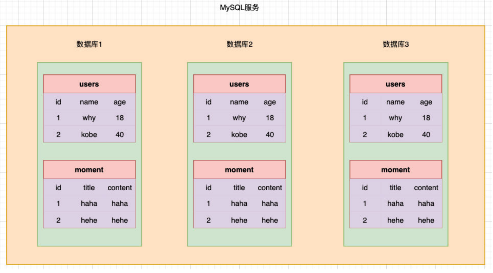

## **下载 MySQL 软件**

**下载地址：https://dev.mysql.com/downloads/mysql/**

**根据自己的操作系统下载即可；**

**推荐大家直接下载安装版本，在安装过程中会配置一些环境变量；**

Windows 推荐下载 MSI 的版本；

Mac 推荐下载 DMG 的版本；

**这里我安装的是 MySQL 最新的版本：8.0.31（不再使用旧的 MySQL5.x 的版本）**

## **启动 MySQL**

电脑，开始搜索服务，打开，找到 MySQL90

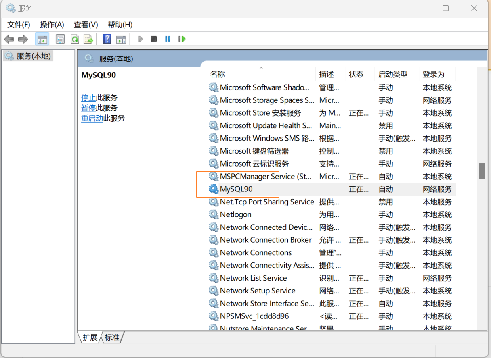

## **MySQL 的连接操作**

打开终端，查看 MySQL 的安装：

```json
mysql --version
```

如何打开终端，一种是没有配置环境变量，开始，搜索 MySQL，然后打开终端命令行

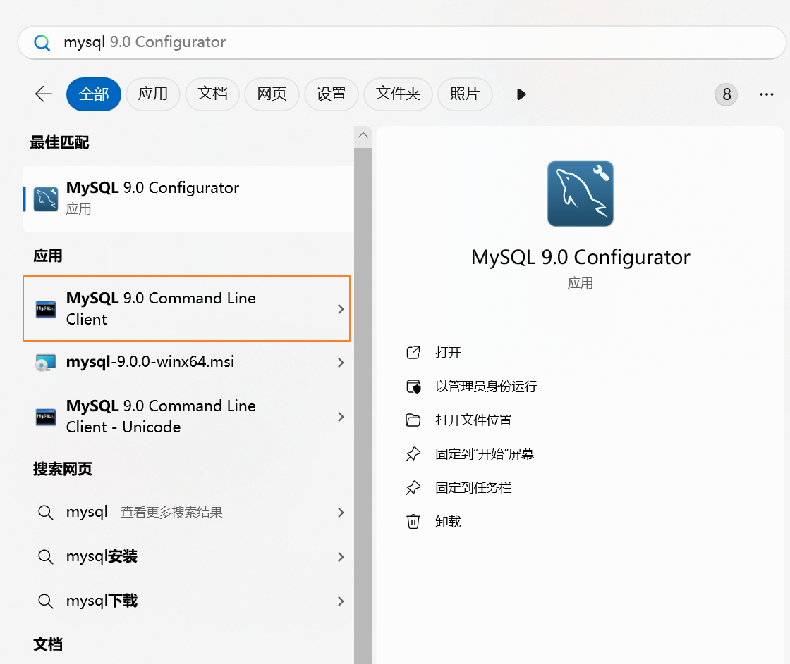

另一种是配置环境变量，直接电脑终端操作 mysql

我的电脑，右键，属性，然后搜索环境变量，编辑

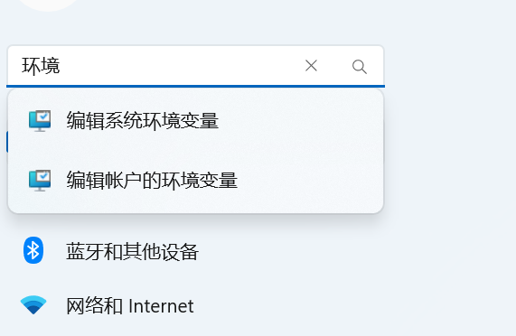

点击环境变量

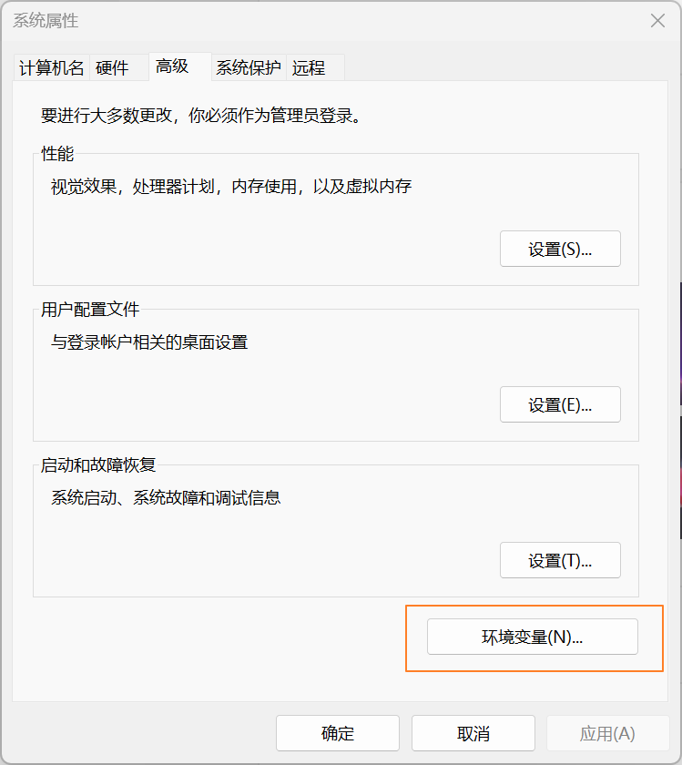

编辑系统环境变量的 Path

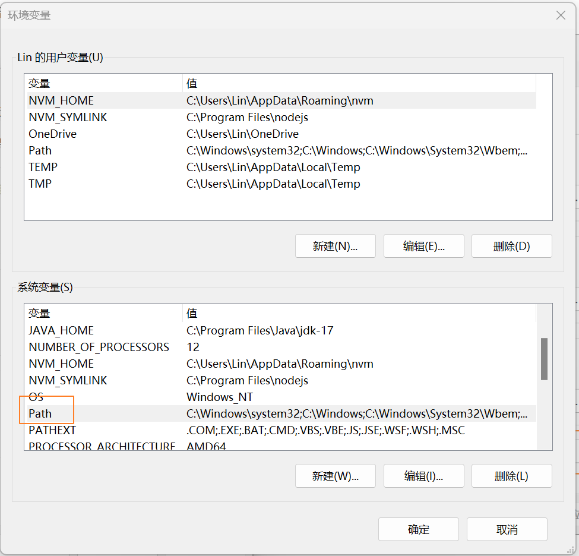

然后添加环境变量即可，这个路径是 mysql 的安装路径

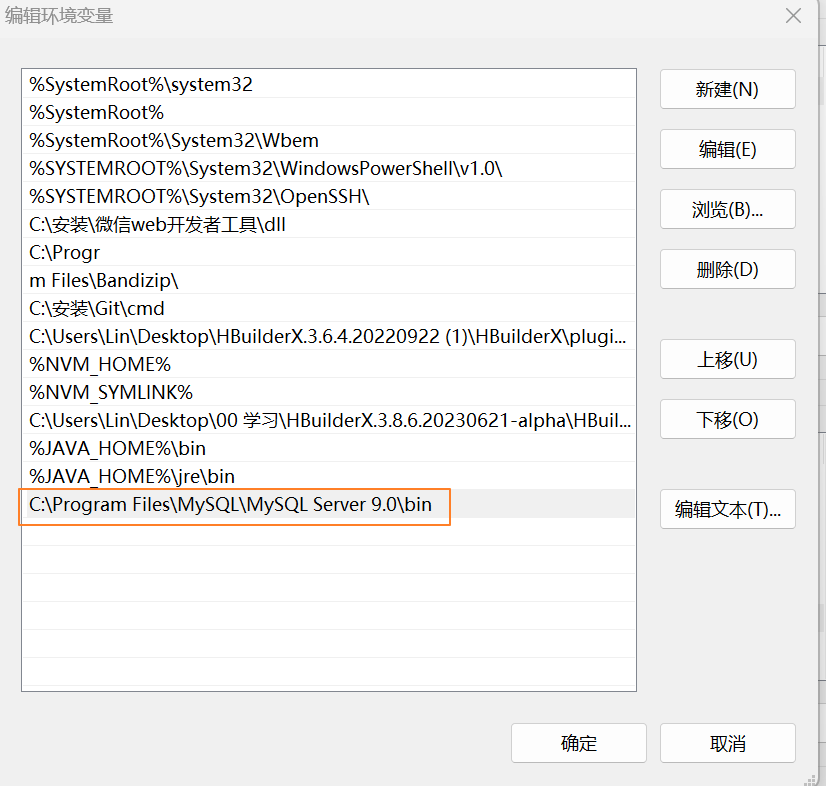

## **终端连接数据库**

**我们如果想要操作数据，需要先和数据建立一个连接，最直接的方式就是通过终端来连接；**

**有两种方式来连接：**

两种方式的区别在于输入密码是直接输入，还是另起一行以密文的形式输入；

```javascript
# 方式一：
mysql -uroot -pCh12
# 方式二：
mysql -uroot -p
Enter password: your password
```

## **终端操作数据库 – 显示数据库**

**我们说过，一个数据库软件中，可以包含很多个数据库，如何查看数据库？**

```javascript
show databases;
```

**MySQL 默认的数据库：**

infomation_schema：信息数据库，其中包括 MySQL 在维护的其他数据库、表、列、访问权限等信息；

performance_schema：性能数据库，记录着 MySQL Server 数据库引擎在运行过程中的一些资源消耗相关的信息；

mysql：用于存储数据库管理者的用户信息、权限信息以及一些日志信息等；

sys：相当于是一个简易版的 performance_schema，将性能数据库中的数据汇总成更容易理解的形式；

## **终端操作数据库 – 创建数据库-表**

**在终端直接创建一个属于自己的新的数据库 coderhub（一般情况下一个新的项目会对应一个新的数据库）。**

```javascript
create database coderhub;
```

**使用我们创建的数据库 coderhub：**

```javascript
use coderhub;
```

**在数据中，创建一张表：**

```javascript
create table user(
name varchar(20),
age int,
height double
);
# 插入数据
insert into user (name, age, height) values ('why', 18, 1.88);
insert into user (name, age, height) values ('kobe', 40, 1.98);
# 查询数据
select * from user;
```

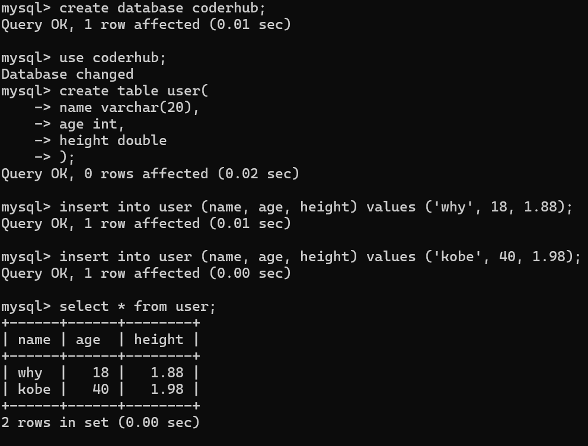

## **GUI 工具的介绍**

**我们会发现在终端操作数据库有很多不方便的地方：**

语句写出来没有高亮，并且不会有任何的提示；

复杂的语句分成多行，格式看起来并不美观，很容易出现错误；

终端中查看所有的数据库或者表非常的不直观和不方便；

等等...

**所以在开发中，我们可以借助于一些 GUI 工具来帮助我们连接上数据库，之后直接在 GUI 工具中操作就会非常方便。**

**常见的 MySQL 的 GUI 工具有很多，这里推荐几款：**

Navicat：个人最喜欢的一款工作，但是是收费的（有免费的试用时间）；

SQLYog：一款免费的 SQL 工具；

TablePlus：常用功能都可以使用，但是会多一些限制（比如只能开两个标签页）；

## **Navicat**

百度搜索 Navicat，然后下载试用版本。

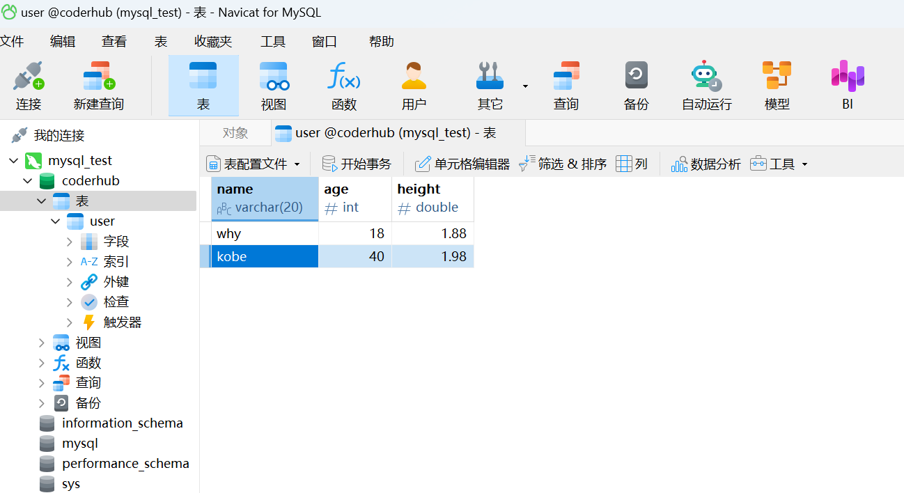

## **认识 SQL 语句**

**我们希望操作数据库（特别是在程序中），就需要有和数据库沟通的语言，这个语言就是 SQL：**

SQL 是 Structured Query Language，称之为结构化查询语言，简称 SQL；

使用 SQL 编写出来的语句，就称之为 SQL 语句；

SQL 语句可以用于对数据库进行操作；

**事实上，常见的关系型数据库 SQL 语句都是比较相似的，所以你学会了 MySQL 中的 SQL 语句，之后去操作比如 Oracle 或者其他**

**关系型数据库，也是非常方便的。**

**SQL 语句的常用规范：**

通常关键字使用大写的，比如 CREATE、TABLE、SHOW 等等；

一条语句结束后，需要以 ; 结尾；

如果遇到关键字作为表明或者字段名称，可以使用``包裹;

## **SQL 语句的分类**

**常见的 SQL 语句我们可以分成四类：**

DDL（Data Definition Language）：数据定义语言；

- 可以通过 DDL 语句对数据库或者表进行：创建、删除、修改等操作；

DML（Data Manipulation Language）：数据操作语言；

- 可以通过 DML 语句对表进行：添加、删除、修改等操作；

DQL（Data Query Language）：数据查询语言；

- 可以通过 DQL 从数据库中查询记录；（重点）

DCL（Data Control Language）：数据控制语言；

- 对数据库、表格的权限进行相关访问控制操作；

接下来我们对他们进行一个个的学习和掌握。

## **数据库的操作（一）**

**查看当前数据库：**

```javascript
# 查看所有的数据
SHOW DATABASES;
# 使用某一个数据
USE coderhub;
# 查看当前正在使用的数据库
SELECT DATABASE();
```

**创建新的数据库：**

```javascript
# 创建数据库语句
CREATE DATABASE bilibili;
CREATE DATABASE IF NOT EXISTS bilibili;
CREATE DATABASE IF NOT EXISTS bilibili
DEFAULT CHARACTER SET utf8mb4 COLLATE utf8mb4_0900_ai_ci;
```

## **数据库的操作（二）**

**删除数据库：**

```javascript
# 删除数据库
DROP DATABASE bilibili;
DROP DATABASE IF EXIT bilibili;
```

**修改数据库：**

```javascript
# 修改数据库的字符集和排序规则
ALTER DATABASE bilibili CHARACTER SET = utf8 COLLATE = utf8_unicode_ci;
```

首先，打开 Navicat 工具，然后新建查询

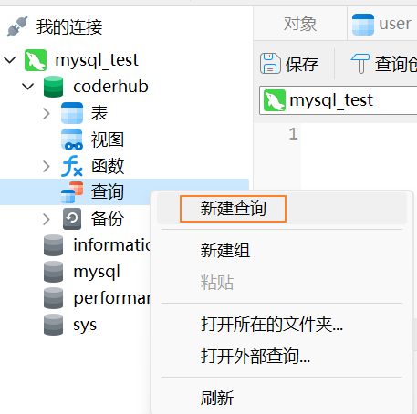

接着，选中要执行的语句，运行已选择的

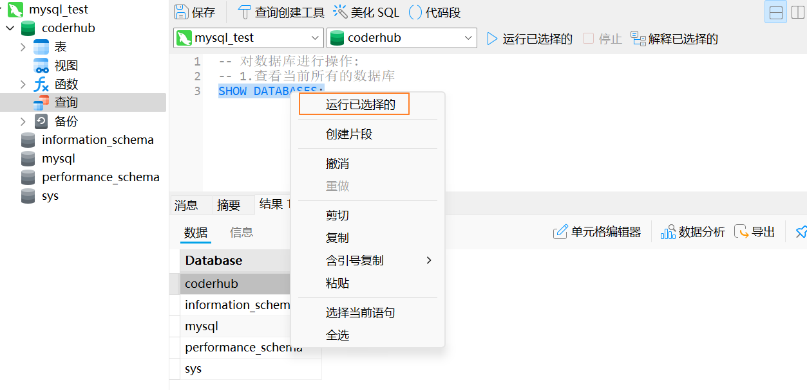

创建一个新的数据库或者删除一个数据库，右击刷新即可

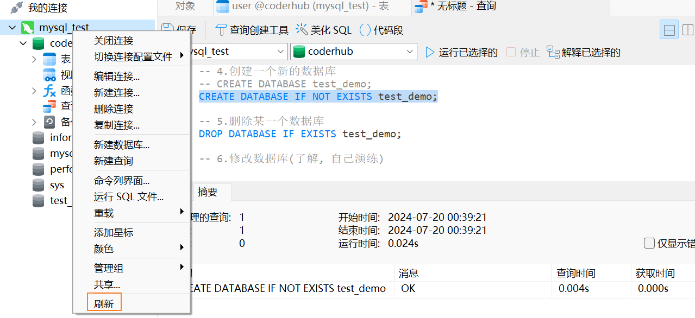

```javascript
-- 对数据库进行操作:
-- 1.查看当前所有的数据库
SHOW DATABASES;

-- 2.使用某一个数据库
USE music_db;


-- 3.查看目前哪一个数据是选中(正在使用的数据)
SELECT DATABASE();

-- 4.创建一个新的数据库
-- CREATE DATABASE test_demo;
CREATE DATABASE IF NOT EXISTS test_demo;

-- 5.删除某一个数据库
DROP DATABASE IF EXISTS test_demo;

-- 6.修改数据库(了解, 自己演练)
```

## **数据表的操作**

**查看数据表**

```javascript
# 查看所有的数据表
SHOW TABLES;
# 查看某一个表结构
DESC user;
```

**创建数据表**

```javascript
CREATE TABLE IF NOT EXISTS `users`(
name VARCHAR(20),
age INT,
height DOUBLE
);
```

## **SQL 的数据类型 – 数字类型**

**我们知道不同的数据会划分为不同的数据类型，在数据库中也是一样：**

MySQL 支持的数据类型有：数字类型，日期和时间类型，字符串（字符和字节）类型，空间类型和 JSON 数据类型。

**数字类型**

MySQL 的数字类型有很多：

整数数字类型：INTEGER，INT，SMALLINT，TINYINT，MEDIUMINT，BIGINT；

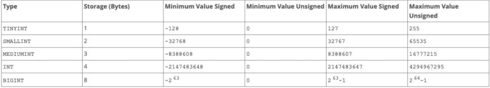

浮点数字类型：FLOAT，DOUBLE（FLOAT 是 4 个字节，DOUBLE 是 8 个字节）；

精确数字类型：DECIMAL，NUMERIC（DECIMAL 是 NUMERIC 的实现形式）；

## **SQL 的数据类型 – 日期类型**

**MySQL 的日期类型也很多：**

YEAR 以 YYYY 格式显示值

- 范围 1901 到 2155，和 0000。

DATE 类型用于具有日期部分但没有时间部分的值：

- DATE 以格式 YYYY-MM-DD 显示值 ；
- 支持的范围是 '1000-01-01' 到 '9999-12-31'；

DATETIME 类型用于包含日期和时间部分的值：

- DATETIME 以格式'YYYY-MM-DD hh:mm:ss'显示值；
- 支持的范围是 1000-01-01 00:00:00 到 9999-12-31 23:59:59;

TIMESTAMP 数据类型被用于同时包含日期和时间部分的值：

- TIMESTAMP 以格式'YYYY-MM-DD hh:mm:ss'显示值；
- 但是它的范围是 UTC 的时间范围：'1970-01-01 00:00:01'到'2038-01-19 03:14:07';

另外：DATETIME 或 TIMESTAMP 值可以包括在高达微秒（6 位）精度的后小数秒一部分（了解）

- 比如 DATETIME 表示的范围可以是'1000-01-01 00:00:00.000000'到'9999-12-31 23:59:59.999999';

## **SQL 的数据类型 – 字符串类型**

**MySQL 的字符串类型表示方式如下：**

CHAR 类型在创建表时为固定长度，长度可以是 0 到 255 之间的任何值；

- 在被查询时，会删除后面的空格；

VARCHAR 类型的值是可变长度的字符串，长度可以指定为 0 到 65535 之间的值；

- 在被查询时，不会删除后面的空格；

BINARY 和 VARBINARY 类型用于存储二进制字符串，存储的是字节字符串；

- https://dev.mysql.com/doc/refman/8.0/en/binary-varbinary.html

BLOB 用于存储大的二进制类型；

- 图片和音视频可以直接存储到数据库，但是一般不会这么做，体现不出数据库的优势，而是会保存一个本地文件的路径

TEXT 用于存储大的字符串类型；

## **表约束**

**主键：PRIMARY KEY**

**一张表中，我们为了区分每一条记录的唯一性，必须有一个字段是永远不会重复，并且不会为空的，这个字段我们通常会将它设**

**置为主键：**

- 主键是表中唯一的索引；
- 并且必须是 NOT NULL 的，如果没有设置 NOT NULL，那么 MySQL 也会隐式的设置为 NOT NULL；
- 主键也可以是多列索引，PRIMARY KEY(key_part, ...)**，我们一般称之为**联合主键；
- 建议：开发中主键字段应该是和业务无关的，尽量不要使用业务字段来作为主键；

**唯一：UNIQUE**

某些字段在开发中我们希望是唯一的，不会重复的，比如手机号码、身份证号码等，这个字段我们可以使用 UNIQUE 来约束：

使用 UNIQUE 约束的字段在表中必须是不同的；

UNIQUE 索引允许 NULL 包含的列具有多个值 NULL；

**不能为空：NOT NULL**

某些字段我们要求用户必须插入值，不可以为空，这个时候我们可以使用 NOT NULL 来约束；

**默认值：DEFAULT**

某些字段我们希望在没有设置值时给予一个默认值，这个时候我们可以使用 DEFAULT 来完成；

**自动递增：AUTO_INCREMENT**

某些字段我们希望不设置值时可以进行递增，比如用户的 id，这个时候可以使用 AUTO_INCREMENT 来完成；

**外键约束也是最常用的一种约束手段，我们再讲到多表关系时，再进行讲解；**

## **创建一个完整的表**

**创建数据表**

```javascript
# 创建一张表
CREATE TABLE IF NOT EXISTS `users`(
id INT PRIMARY KEY AUTO_INCREMENT,
name VARCHAR(20) NOT NULL,
age INT DEFAULT 0,
telPhone VARCHAR(20) DEFAULT '' UNIQUE NOT NULL
);
```

**删除数据表**

```javascript
# 删除数据表
DROP TABLE users;
DROP TABLE IF EXISTS users;
```

## **修改表**

**如果我们希望对表中某一个字段进行修改：**

```javascript
# 1.修改表名
ALTER TABLE `moments` RENAME TO `moment`;
# 2.添加一个新的列
ALTER TABLE `moment` ADD `publishTime` DATETIME;
ALTER TABLE `moment` ADD `updateTime` DATETIME;
# 3.删除一列数据
ALTER TABLE `moment` DROP `updateTime`;
# 4.修改列的名称
ALTER TABLE `moment` CHANGE `publishTime` `publishDate` DATE;
# 5.修改列的数据类型
ALTER TABLE `moment` MODIFY `id` INT;
```

DDL-表操作.sql

```javascript
-- 1.查看当前数据库中有哪些表
SHOW TABLES;

-- 2.查看某一张表的表结构
DESC t_singer;

-- 3.创建一张新的表
-- 3.1.创建基本表结构
CREATE TABLE IF NOT EXISTS `users`(
	name VARCHAR(10),
	age INT,
	height DOUBLE
);
DROP TABLE IF EXISTS `users`;

-- 3.2.创建完整的表结构
CREATE TABLE IF NOT EXISTS `users`(
	id INT PRIMARY KEY AUTO_INCREMENT,
	name VARCHAR(20) UNIQUE NOT NULL,
	level INT DEFAULT 0,
	telPhone VARCHAR(20) UNIQUE
);

-- 4.修改表结构
-- 4.1. 修改表名字
ALTER TABLE `users` RENAME TO `t_users`;
-- 4.2. 添加新的字段(field)
ALTER TABLE `t_users` ADD createTime TIMESTAMP;
ALTER TABLE `t_users` ADD updateTime TIMESTAMP;
-- 4.3. 修改字段的名称(field名称)
ALTER TABLE `t_users` CHANGE createTime createAt DATETIME;
-- 4.4. 删除某一个字段(field列)
ALTER TABLE `t_users` DROP createTime;
-- 4.5. 修改某一字段的类型(id int => bigint)
ALTER TABLE `t_users` MODIFY id BIGINT;
```

右键表，设计表，可以查看类型

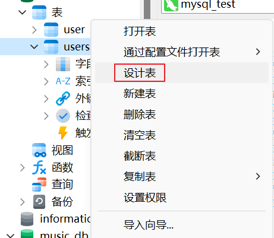

## **创建新表-删除操作**

**DML：Data Manipulation Language（数据操作语言）**

**创建一张新的表**

```javascript
CREATE TABLE IF NOT EXISTS `products`(
`id` INT PRIMARY KEY AUTO_INCREMENT,
`title` VARCHAR(20),
`description` VARCHAR(200),
`price` DOUBLE,
`publishTime` DATETIME
);
```

**插入数据：**

```javascript
INSERT INTO `products` (`title`, `description`, `price`, `publishTime`)
VALUES ('iPhone', 'iPhone12只要998', 998.88, '2020-10-10');
INSERT INTO `products` (`title`, `description`, `price`, `publishTime`)
VALUES ('huawei', 'iPhoneP40只要888', 888.88, '2020-11-11');
```

## **删除操作-更新操作**

删除数据：

```javascript
# 删除数据
# 会删除表中所有的数据
DELETE FROM `products`;
# 会删除符合条件的数据
DELETE FROM `products` WHERE `title` = 'iPhone';
```

修改数据：

```javascript
# 修改数据
# 会修改表中所有的数据
UPDATE `products` SET `title` = 'iPhone12', `price` = 1299.88;
# 会修改符合条件的数据
UPDATE `products` SET `title` = 'iPhone12', `price` = 1299.88 WHERE `title` = 'iPhone';
```

如果我们希望修改完数据后，直接可以显示最新的更新时间：

```javascript
ALTER TABLE `products` ADD `updateTime` TIMESTAMP
DEFAULT CURRENT_TIMESTAMP ON UPDATE CURRENT_TIMESTAMP;
```

DML-插入-删除-修改.sql

```javascript
-- 1.新建商品表
CREATE TABLE IF NOT EXISTS `t_products`(
	id INT PRIMARY KEY AUTO_INCREMENT,
	title VARCHAR(20) UNIQUE NOT NULL,
	description VARCHAR(200) DEFAULT '',
	price DOUBLE DEFAULT 0,
	publishTime DATETIME
);


-- 2.DML语句: 插入数据
INSERT INTO `t_products` (title, description, price, publishTime) VALUES ('iPhone100', 'iPhone100只要998', 998, '2122-09-10');
INSERT INTO `t_products` (title, description, price, publishTime) VALUES ('小米99', '小米99只要888', 888, '2123-10-10');
INSERT INTO `t_products` (title, description, price, publishTime) VALUES ('华为666', '华为666只要6666', 6666, '2166-06-06');

-- 3.DML语句: 删除数据
-- 3.1.删除表中所有的数据(慎重使用);
-- DELETE FROM `t_products`;
-- 3.2.根据条件, 比如id删除某一条
-- DELETE FROM `t_products` WHERE id = 4;


-- 4.DML语句: 修改数据
-- 4.1.修改表中的所有数据;
-- UPDATE `t_products` SET price = 8888;
-- 4.2. 根据条件修改某一条数据
-- UPDATE `t_products` SET price = 8888 WHERE id = 6;
UPDATE `t_products` SET price = 12998, title = '华为至尊版' WHERE id = 6;


-- 5.扩展: 当修改某一条数据时, 使用最新的时间记录
ALTER TABLE `t_products` ADD `updateTime` TIMESTAMP DEFAULT CURRENT_TIMESTAMP ON UPDATE CURRENT_TIMESTAMP;
```

## **DQL 语句**

**DQL：Data Query Language（数据查询语言）**

- SELECT 用于从一个或者多个表中检索选中的行（Record）。

**查询的格式如下：**

```javascript
SELECT select_expr [, select_expr]...
  [FROM table_references]
  [WHERE where_condition]
  [ORDER BY expr [ASC | DESC]]
  [LIMIT {[offset,] row_count | row_count OFFSET offset}]
  [GROUP BY expr]
  [HAVING where_condition]
```

## **准备数据**

**准备一张表：**

```javascript
CREATE TABLE IF NOT EXISTS `products` (
  id INT PRIMARY KEY AUTO_INCREMENT,
  brand VARCHAR(20),
  title VARCHAR(100) NOT NULL,
  price DOUBLE NOT NULL,
  score DECIMAL(2,1),
  voteCnt INT,
  url VARCHAR(100),
  pid INT
);
```

```json
yarn add mysql2
```

01\_查询语句-准备数据.js

```javascript
const mysql = require("mysql2");
const connection = mysql.createConnection({
  host: "localhost",
  port: 3306,
  user: "root",
  password: "Coderwhy888.",
  database: "coderhub",
});
const statement = `INSERT INTO products SET ?;`;
const phoneJson = require("./phone.json");
for (let phone of phoneJson) {
  connection.query(statement, phone);
}
```

然后执行

```javascript
node 01_查询语句-准备数据.js
```

这样数据库 coderhub 的 products 表就会插入很多条数据，数据来自 phone.json，是我们自己模拟的数据。

## **基本查询**

**查询所有的数据并且显示所有的字段：**

```javascript
SELECT * FROM`products`;
```

**查询 title、brand、price：**

```javascript
SELECT title, brand, price FROM `products`;
```

**我们也可以给字段起别名：**

**别名一般在多张表或者给客户端返回对应的 key 时会使用到；**

```javascript
SELECT title as t, brand as b, price as p FROM `products`;
```

## **where 查询条件（一）**

**在开发中，我们希望根据条件来筛选我们的数据，这个时候我们要使用条件查询：**

条件查询会使用 WEHRE 查询子句；

**WHERE 的比较运算符**

```javascript
# 查询价格小于1000的手机
SELECT * FROM `products` WHERE price < 1000;
# 查询价格大于等于2000的手机
SELECT * FROM `products` WHERE price >= 2000;
# 价格等于3399的手机
SELECT * FROM `products` WHERE price = 3399;
# 价格不等于3399的手机
SELECT * FROM `products` WHERE price != 3399;
# 查询华为品牌的手机
SELECT * FROM `products` WHERE `brand` = '华为';
```

## **where 查询条件（二）**

**WHERE 的逻辑运算符**

```javascript
# 查询品牌是华为，并且小于2000元的手机
SELECT * FROM `products` WHERE `brand` = '华为' and `price` < 2000;
SELECT * FROM `products` WHERE `brand` = '华为' && `price` < 2000;
# 查询1000到2000的手机（不包含1000和2000）
SELECT * FROM `products` WHERE price > 1000 and price < 2000;
# OR: 符合一个条件即可
# 查询所有的华为手机或者价格小于1000的手机
SELECT * FROM `products` WHERE brand = '华为' or price < 1000;
# 查询1000到2000的手机（包含1000和2000）
SELECT * FROM `products` WHERE price BETWEEN 1000 and 2000;
# 查看多个结果中的一个
SELECT * FROM `products` WHERE brand in ('华为', '小米');
```

## **where 查询条件（三）**

**模糊查询使用 LIKE 关键字，结合两个特殊的符号：**

%表示匹配任意个的任意字符；

\_表示匹配一个的任意字符；

```javascript
# 查询所有以v开头的title
SELECT * FROM `products` WHERE title LIKE 'v%';
# 查询带M的title
SELECT * FROM `products` WHERE title LIKE '%M%';
# 查询带M的title必须是第三个字符
SELECT * FROM `products` WHERE title LIKE '__M%';
```

## **查询结果排序**

**当我们查询到结果的时候，我们希望讲结果按照某种方式进行排序，这个时候使用的是 ORDER BY；**

**ORDER BY 有两个常用的值：**

ASC：升序排列；

DESC：降序排列；

```javascript
SELECT * FROM `products` WHERE brand = '华为' or price < 1000 ORDER BY price ASC;
```

## **分页查询**

**当数据库中的数据非常多时，一次性查询到所有的结果进行显示是不太现实的：**

在真实开发中，我们都会要求用户传入 offset、limit 或者 page 等字段；

它们的目的是让我们可以在数据库中进行分页查询；

它的用法有[LIMIT {[offset,] row_count | row_count OFFSET offset}]

```javascript
SELECT * FROM `products` LIMIT 30 OFFSET 0;
SELECT * FROM `products` LIMIT 30 OFFSET 30;
SELECT * FROM `products` LIMIT 30 OFFSET 60;
# 另外一种写法：offset, row_count
SELECT * FROM `products` LIMIT 90, 30;
```

offset 的意思是偏移，offset 30 就是偏移 30 条，从第 31 条开始查询。

DQL-查询数据演练.sql

```javascript
CREATE TABLE IF NOT EXISTS `products` (
	id INT PRIMARY KEY AUTO_INCREMENT,
	brand VARCHAR(20),
	title VARCHAR(100) NOT NULL,
	price DOUBLE NOT NULL,
	score DECIMAL(2,1),
	voteCnt INT,
	url VARCHAR(100),
	pid INT
);

-- 1.基本查询
-- 1.1. 查询所有的数据的所有字段
-- SELECT * FROM `products`;

-- 1.2. 查询所有的数据, 并且指定对应的字段
SELECT id, brand, title, price FROM `products`;

-- 1.3.查到字段之后, 给字段重命名(起一个别名, AS关键字可以省略)
SELECT id AS phoneId, brand phoneBrand, title, price FROM `products`;

-- 2.查询条件(比较运算符)
-- 2.1. 查询所有价格小于1000的手机
SELECT * FROM `products` WHERE price < 1000;
-- 2.2. 查询价格大于等于3000的手机
SELECT * FROM `products` WHERE price >= 3000;
-- 2.3. 查询价格等于8699的手机
SELECT * FROM `products` WHERE price = 8699;
-- 2.4. 查询所有的华为品牌的手机
SELECT * FROM `products` WHERE brand = '华为';
-- 2.5. 查询所有的不是苹果手机品牌的商品
SELECT * FROM `products` WHERE brand != '苹果';


-- 3.查询条件(逻辑运算符)
-- 3.1. 查询brand为华为, 并且价格小于2000的手机
SELECT * FROM `products` WHERE brand = '华为' && price < 2000;
SELECT * FROM `products` WHERE brand = '华为' AND price < 2000;
-- 3.2. 查询brand为华为, 或者价格大于5000的手机
SELECT * FROM `products` WHERE brand = '华为' || price > 5000;
SELECT * FROM `products` WHERE brand = '华为' OR price > 5000;

-- 3.3. 查询区间范围
SELECT * FROM `products` WHERE price >= 1000 && price <= 2000;
SELECT * FROM `products` WHERE price BETWEEN 1000 AND 2000;


-- 3.4.枚举出多个结果, 其中之一: 小米或者华为
SELECT * FROM `products` WHERE brand = '小米' OR brand = '华为';
SELECT * FROM `products` WHERE brand IN ('小米', '华为');


-- 4.查询条件(模糊查询LIKE)
-- 4.1.查询所有title以v开头的商品
SELECT * FROM `products` WHERE title LIKE 'v%';
-- 4.2.查询所有title带v的商品
SELECT * FROM `products` WHERE title LIKE '%v%';
-- 4.3.查询所有title带M, 并且M必须是第三个字符
SELECT * FROM `products` WHERE title LIKE '__M%'


-- 5.对结果进行排序(ORDER BY)
-- 5.1. 查询所有的价格小于1000的手机, 并且按照评分的降序获取结果
SELECT * FROM `products`
	WHERE price < 1000
	ORDER BY score DESC;

SELECT * FROM `products`
	WHERE price < 1000
	ORDER BY score ASC;


-- 6.对表进行分页查询
-- 6.1.默认不偏移(偏移0条数据)
SELECT * FROM `products` LIMIT 20;
-- 6.2.指定偏移多少条数据(size: 20, offset: 40)
SELECT * FROM `products` LIMIT 20 OFFSET 40;

-- 6.3.另外一种写法
SELECT * FROM `products` LIMIT 40, 20;
```
