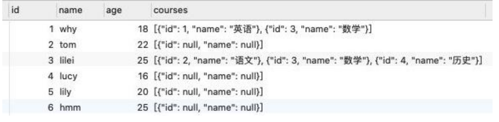
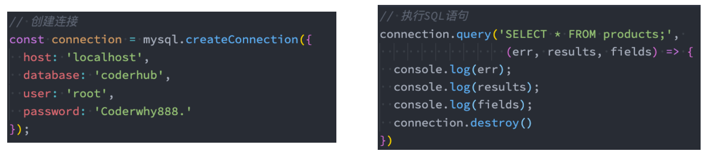
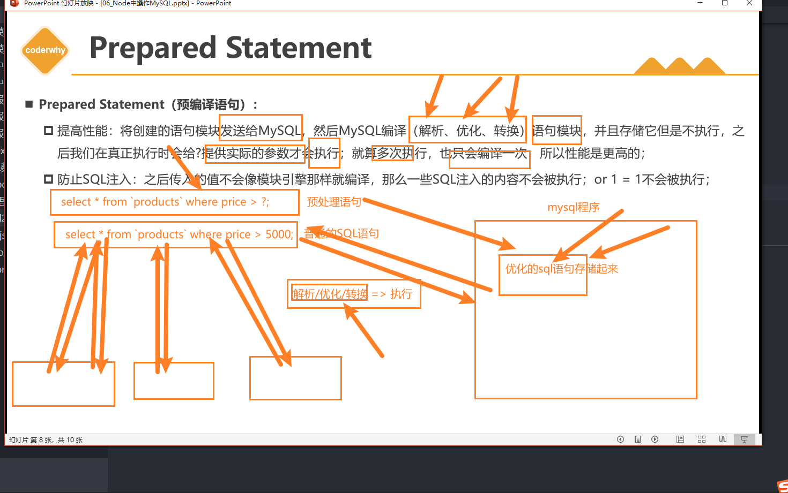
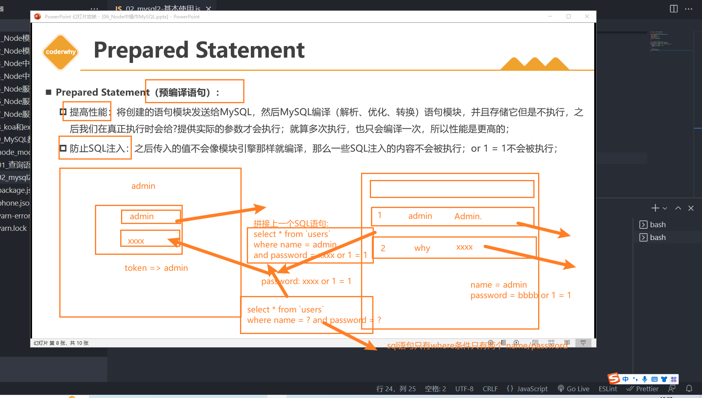
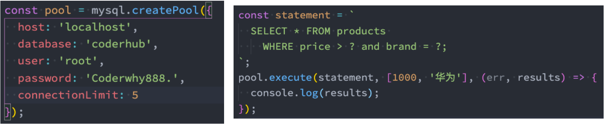

## **查询数据的问题**

前面我们学习的查询语句，查询到的结果通常是一张表，比如查询手机+品牌信息：

```javascript
SELECT * FROM products LEFT JOIN brand ON products.brand_id = brand.id;
```


## **将 brand 转成对象**


但是在真实开发中，实际上红色圈起来的部分应该放入到一个对象中，那么我们可以使用下面的查询方式：

这个时候我们要用 JSON_OBJECT;

```javascript
SELECT products.id as id, products.title as title, products.price as price, products.score as score,
	JSON_OBJECT('id', brand.id, 'name', brand.name, 'rank', brand.phoneRank, 'website', brand.website) as brand
FROM products LEFT JOIN brand ON products.brand_id = brand.id;
```


## **多对多转成数组**


在多对多关系中，我们希望查询到的是一个数组：

比如一个学生的多门课程信息，应该是放到一个数组中的；

数组中存放的是课程信息的一个个对象；

这个时候我们要 JSON_ARRAYAGG 和 JSON_OBJECT 结合来使用；

```javascript
SELECT stu.id, stu.name, stu.age,
JSON_ARRAYAGG(JSON_OBJECT('id', cs.id, 'name', cs.name)) as courses
FROM students stu
LEFT JOIN students_select_courses ssc ON stu.id = ssc.student_id
LEFT JOIN courses cs ON ssc.course_id = cs.id
GROUP BY stu.id;
```



## **认识 mysql2**

**前面我们所有的操作都是在 GUI 工具中，通过执行 SQL 语句来获取结果的，那真实开发中肯定是通过代码来完成所有的操作的。**

**那么如何可以在 Node 的代码中执行 SQL 语句来，这里我们可以借助于两个库：**

mysql：最早的 Node 连接 MySQL 的数据库驱动；

mysql2：在 mysql 的基础之上，进行了很多的优化、改进；

**目前相对来说，我更偏向于使用 mysql2，mysql2 兼容 mysql 的 API，并且提供了一些附加功能**

更快/更好的性能；

Prepared Statement（预编译语句）：

- 提高性能：将创建的语句模块发送给 MySQL，然后 MySQL 编译（解析、优化、转换）语句模块，并且存储它但是不执行，

  之后我们在真正执行时会给?提供实际的参数才会执行；就算多次执行，也只会编译一次，所以性能是更高的；

- 防止 SQL 注入：之后传入的值不会像模块引擎那样就编译，那么一些 SQL 注入的内容不会被执行；or 1 = 1 不会被执行；

支持 Promise，所以我们可以使用 async 和 await 语法

等等....

**所以后续的学习中我会选择 mysql2 在 node 中操作数据。**

## **使用 mysql2**

**安装 mysql2**

```javascript
npm install mysql2
```

**mysql2 的使用过程如下：**

第一步：创建连接（通过 createConnection），并且获取连接对象；

第二步：执行 SQL 语句即可（通过 query）；



```javascript
const mysql = require("mysql2");

// 1.创建一个连接(连接上数据库)
const connection = mysql.createConnection({
  host: "localhost",
  port: 3306,
  database: "music_db",
  user: "root",
  password: "Coderwhy123.",
});

// 2.执行操作语句, 操作数据库
const statement = "SELECT * FROM `students`;";
// structure query language: DDL/DML/DQL/DCL
connection.query(statement, (err, values, fields) => {
  if (err) {
    console.log("查询失败:", err);
    return;
  }

  // 查看结果
  console.log(values);
  // console.log(fields)
});
```

## **Prepared Statement**

**Prepared Statement（预编译语句）：**

提高性能：将创建的语句模块发送给 MySQL，然后 MySQL 编译（解析、优化、转换）语句模块，并且存储它但是不执行，之

后我们在真正执行时会给?提供实际的参数才会执行；就算多次执行，也只会编译一次，所以性能是更高的；



防止 SQL 注入：之后传入的值不会像模块引擎那样就编译，那么一些 SQL 注入的内容不会被执行；or 1 = 1 不会被执行；




```javascript
const mysql = require("mysql2");

// 1.创建一个连接
const connection = mysql.createConnection({
  host: "localhost",
  port: 3306,
  database: "music_db",
  user: "root",
  password: "Coderwhy123.",
});

// 2.执行一个SQL语句: 预处理语句 execute
const statement = "SELECT * FROM `products` WHERE price > ? AND score > ?;";
connection.execute(statement, [1000, 8], (err, values) => {
  console.log(values);
});

// connection.destroy()
```

## **Connection Pools**

**前面我们是创建了一个连接（connection），但是如果我们有多个请求的话，该连接很有可能正在被占用，那么我们是否需要**

**每次一个请求都去创建一个新的连接呢？**

事实上，mysql2 给我们提供了连接池（connection pools）；

连接池可以在需要的时候自动创建连接，并且创建的连接不会被销毁，会放到连接池中，后续可以继续使用；

我们可以在创建连接池的时候设置 LIMIT，也就是最大创建个数；



```javascript
const mysql = require("mysql2");

// 1.创建一个连接
const connectionPool = mysql.createPool({
  host: "localhost",
  port: 3306,
  database: "music_db",
  user: "root",
  password: "Coderwhy123.",
  connectionLimit: 5,
});

// 2.执行一个SQL语句: 预处理语句
const statement = "SELECT * FROM `products` WHERE price > ? AND score > ?;";
connectionPool.execute(statement, [1000, 8], (err, values) => {
  console.log(values);
});
```

## **Promise 方式**

**目前在 JavaScript 开发中我们更习惯 Promise 和 await、async 的方式，mysql2 同样是支持的：**


```javascript
const mysql = require("mysql2");

// 1.创建一个连接
const connectionPool = mysql.createPool({
  host: "localhost",
  port: 3306,
  database: "music_db",
  user: "root",
  password: "Coderwhy123.",
  connectionLimit: 5,
});

// 2.执行一个SQL语句: 预处理语句
const statement = "SELECT * FROM `products` WHERE price > ? AND score > ?;";

connectionPool
  .promise()
  .execute(statement, [1000, 9])
  .then((res) => {
    const [values, fields] = res;
    console.log("-------------------values------------------");
    console.log(values);
    console.log("-------------------fields------------------");
    console.log(fields);
  })
  .catch((err) => {
    console.log(err);
  });
```
