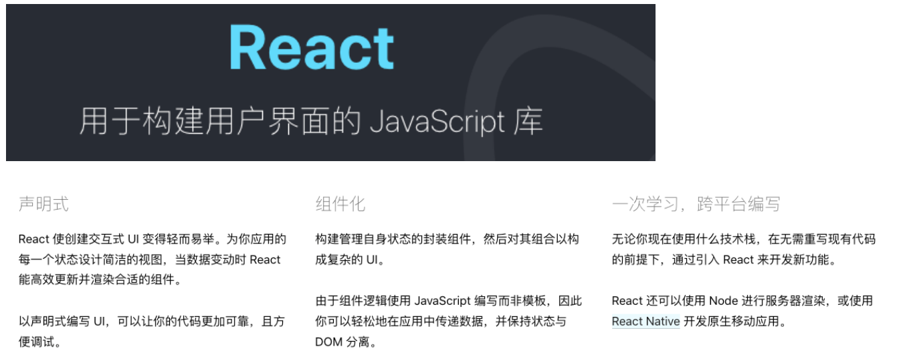
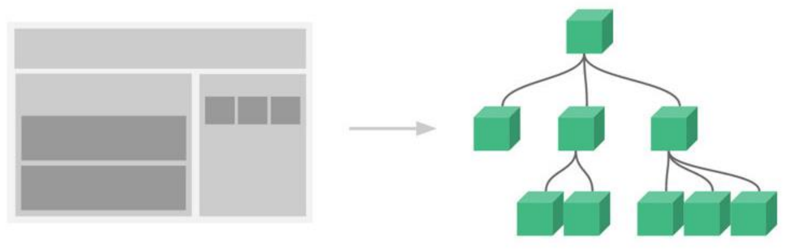
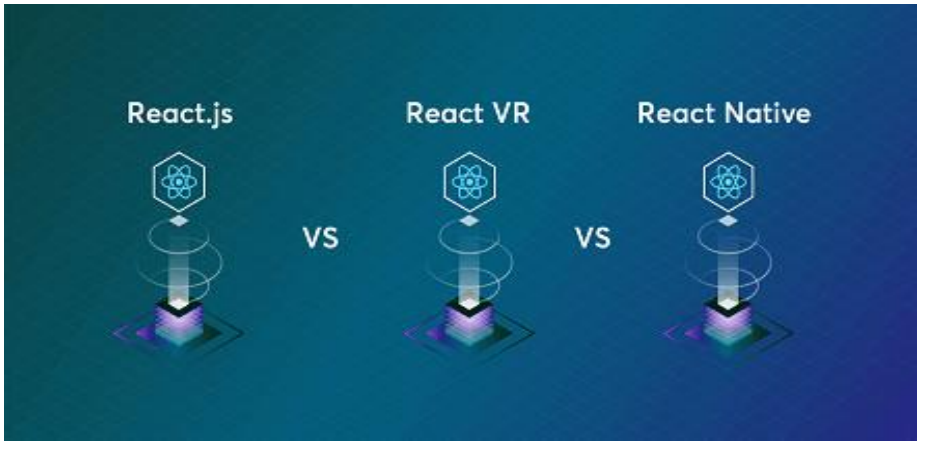
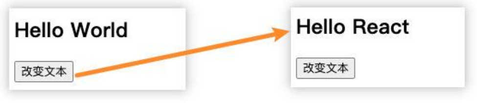
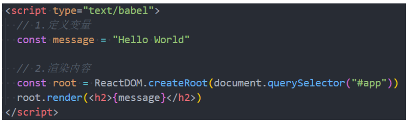
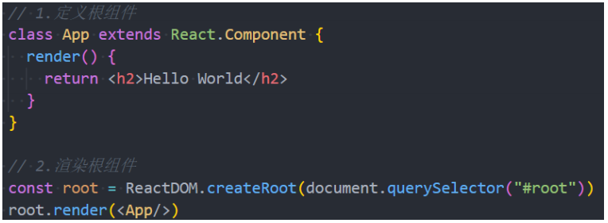
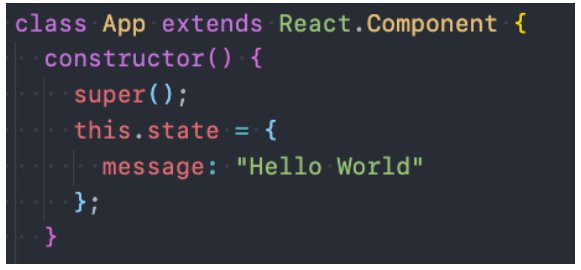
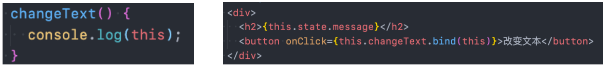

## **React 的介绍（技术角度）**

**React 是什么？**

React：用于构建用户界面的 JavaScript 库；

React 的官网文档：https://zh-hans.reactjs.org/



## **React 的特点 – 声明式编程**

**声明式编程：**

声明式编程是目前整个大前端开发的模式：Vue、React、Flutter、SwiftUI；

它允许我们只需要维护自己的状态，当状态改变时，React 可以根据最新的状态去渲染我们的 UI 界面；


## **React 特点 – 组件化开发**

**组件化开发：**

组件化开发页面目前前端的流行趋势，我们会将复杂的界面拆分成一个个小的组件；

如何合理的进行组件的划分和设计也是后面我会讲到的一个重点；



## **React 的特点 – 多平台适配**

**多平台适配：**

2013 年，React 发布之初主要是开发 Web 页面；

2015 年，Facebook 推出了 ReactNative，用于开发移动端跨平台；（虽然目前 Flutter 非常火爆，但是还是有很多公司在使用

ReactNative）；

2017 年，Facebook 推出 ReactVR，用于开发虚拟现实 Web 应用程序；（VR 也会是一个火爆的应用场景）；



## **Hello React 案例说明**

**为了演练 React，我们可以提出一个小的需求：**

在界面显示一个文本：Hello World

点击下方的一个按钮，点击后文本改变为 Hello React



**当然，你也可以使用 jQuery 和 Vue 来实现，甚至是原生方式来实现，对它们分别进行对比学习**

## **React 的开发依赖**

**开发 React 必须依赖三个库：**

react：包含 react 所必须的核心代码

react-dom：react 渲染在不同平台所需要的核心代码

babel：将 jsx 转换成 React 代码的工具

**第一次接触 React 会被它繁琐的依赖搞蒙，居然依赖这么多东西： （直接放弃？）**

对于 Vue 来说，我们只是依赖一个 vue.js 文件即可，但是 react 居然要依赖三个包。

其实呢，这三个库是各司其职的，目的就是让每一个库只单纯做自己的事情;

在 React 的 0.14 版本之前是没有 react-dom 这个概念的，所有功能都包含在 react 里；

**为什么要进行拆分呢？原因就是 react-native。**

react 包中包含了 react web 和 react-native 所共同拥有的核心代码。

react-dom 针对 web 和 native 所完成的事情不同：

- web 端：react-dom 会将 jsx 最终渲染成真实的 DOM，显示在浏览器中

- native 端：react-dom 会将 jsx 最终渲染成原生的控件（比如 Android 中的 Button，iOS 中的 UIButton）。

## **Babel 和 React 的关系**

**babel 是什么呢？**

**Babel** ，又名 **Babel.js**。

是目前前端使用非常广泛的编译器、转移器。

比如当下很多浏览器并不支持 ES6 的语法，但是确实 ES6 的语法非常的简洁和方便，我们**开发时**希望使用它。

那么编写源码时我们就可以使用 ES6 来编写，之后通过 Babel 工具，将 ES6 转成大多数浏览器都支持的 ES5 的语法。

**React 和 Babel 的关系：**

默认情况下开发 React 其实可以不使用 babel。

但是前提是我们自己使用 React.createElement 来编写源代码，它编写的代码非常的繁琐和可读性差。

那么我们就可以直接编写 jsx（JavaScript XML）的语法，并且让 babel 帮助我们转换成 React.createElement。

后续还会详细讲到；

## **React 的依赖引入**

**所以，我们在编写 React 代码时，这三个依赖都是必不可少的。**

**那么，如何添加这三个依赖：**

方式一：直接 CDN 引入

方式二：下载后，添加本地依赖

方式三：通过 npm 管理（后续脚手架再使用）

**暂时我们直接通过 CDN 引入，来演练下面的示例程序：**

这里有一个 crossorigin 的属性，这个属性的目的是为了拿到跨域脚本的错误信息

```javascript
<script src="https://unpkg.com/react@18/umd/react.development.js" crossorigin></script>
<script src="https://unpkg.com/react-dom@18/umd/react-dom.development.js" crossorigin></script>
<script src="https://unpkg.com/babel-standalone@6/babel.min.js"></script>
```

## **Hello World**

**第一步：在界面上通过 React 显示一个 Hello World**

注意：这里我们编写 React 的 script 代码中，必须添加 type="text/babel"，作用是可以让 babel 解析 jsx 的语法



**ReactDOM. createRoot 函数：用于创建一个 React 根，之后渲染的内容会包含在这个根中**

参数：将渲染的内容，挂载到哪一个 HTML 元素上

这里我们已经提定义一个 id 为 app 的 div

**root.render 函数:**

参数：要渲染的根组件

**我们可以通过{}语法来引入外部的变量或者表达式**

```html
<!DOCTYPE html>
<html lang="en">
  <head>
    <meta charset="UTF-8" />
    <meta http-equiv="X-UA-Compatible" content="IE=edge" />
    <meta name="viewport" content="width=device-width, initial-scale=1.0" />
    <title>Hello React</title>
  </head>
  <body>
    <div id="root"></div>
    <div id="app"></div>

    <!-- 添加依赖 -->
    <!-- 依赖三个包 -->
    <!-- CDN引入 -->
    <script
      crossorigin
      src="https://unpkg.com/react@18/umd/react.development.js"
    ></script>
    <script
      crossorigin
      src="https://unpkg.com/react-dom@18/umd/react-dom.development.js"
    ></script>
    <!-- babel -->
    <script src="https://unpkg.com/babel-standalone@6/babel.min.js"></script>

    <!-- 下载引入 -->

    <!-- npm下载引入(脚手架) -->

    <script type="text/babel">
      // 编写React代码(jsx语法)
      // jsx语法 -> 普通的JavaScript代码 -> babel

      // 渲染Hello World
      // React18之前: ReactDOM.render
      // ReactDOM.render(<h2>Hello World</h2>, document.querySelector("#root"))

      // React18之后: 可以有多个根，不过一般只用一个根
      const root = ReactDOM.createRoot(document.querySelector("#root"));
      root.render(<h2>Hello World</h2>);

      // const app = ReactDOM.createRoot(document.querySelector("#app"))
      // app.render(<h2>你好啊, 李银河</h2>)
    </script>
  </body>
</html>
```

## Hello React 案例实现

点击修改文本按钮，将 Hello World 改成 Hello React

```html
<!DOCTYPE html>
<html lang="en">
  <head>
    <meta charset="UTF-8" />
    <meta http-equiv="X-UA-Compatible" content="IE=edge" />
    <meta name="viewport" content="width=device-width, initial-scale=1.0" />
    <title>Document</title>
  </head>
  <body>
    <div id="root"></div>

    <!-- 引入依赖 -->
    <script
      crossorigin
      src="https://unpkg.com/react@18/umd/react.development.js"
    ></script>
    <script
      crossorigin
      src="https://unpkg.com/react-dom@18/umd/react-dom.development.js"
    ></script>
    <script src="https://unpkg.com/babel-standalone@6/babel.min.js"></script>

    <!-- 编写React代码 -->
    <script type="text/babel">
      const root = ReactDOM.createRoot(document.querySelector("#root"));

      // 1.将文本定义成变量
      let message = "Hello World";

      // 2.监听按钮的点击
      function btnClick() {
        // 1.1.修改数据
        message = "Hello React";

        // 2.重新渲染界面
        rootRender();
      }

      // 3.封装一个渲染函数
      function rootRender() {
        root.render(
          <div>
            <h2>{message}</h2>
            <button onClick={btnClick}>修改文本</button>
          </div>
        );
      }
      rootRender();
    </script>
  </body>
</html>
```

## 依赖本地引入

打开 CDN 的地址，将里面的代码复制，放到本地的 js 文件中引入即可。

```javascript
<script src="../lib/react.js"></script>
<script src="../lib/react-dom.js"></script>
<script src="../lib/babel.js"></script>
```

## **Hello React – 组件化开发**

**整个逻辑其实可以看做一个整体，那么我们就可以将其封装成一个组件：**

我们说过 root.render 参数是一个 HTML 元素或者一个组件；

所以我们可以先将之前的业务逻辑封装到一个组件中，然后传入到 ReactDOM.render 函数中的第一个参数；

**在 React 中，如何封装一个组件呢？**这里我们暂时使用类的方式封装组件：

1.定义一个类（类名大写，组件的名称是必须大写的，小写会被认为是 HTML 元素），继承自 React.Component

2.实现当前组件的 render 函数

render 当中返回的 jsx 内容，就是之后 React 会帮助我们渲染的内容



## **组件化 - 数据依赖**

**组件化问题一：数据在哪里定义？**

**在组件中的数据，我们可以分成两类：**

参与界面更新的数据：当数据变量时，需要更新组件渲染的内容；

不参与界面更新的数据：当数据变量时，不需要更新将组建渲染的内容；

**参与界面更新的数据我们也可以称之为是参与数据流，这个数据是定义在当前对象的 state 中**

我们可以通过在构造函数中 this.state = {定义的数据}

当我们的数据发生变化时，我们可以调用 this.setState 来更新数据，并且通知 React 进行 update 操作；

在进行 update 操作时，就会重新调用 render 函数，并且使用最新的数据，来渲染界面



## **组件化 – 事件绑定**

**组件化问题二：事件绑定中的 this**

在类中直接定义一个函数，并且将这个函数绑定到元素的 onClick 事件上，当前这个函数的 this 指向的是谁呢？

**默认情况下是 undefined**

很奇怪，居然是 undefined；

因为在正常的 DOM 操作中，监听点击，监听函数中的 this 其实是节点对象（比如说是 button 对象）；

这次因为 React 并不是直接渲染成真实的 DOM，我们所编写的 button 只是一个语法糖，它的本质 React 的 Element 对象；

那么在这里发生监听的时候，react 在执行函数时并没有绑定 this，默认情况下就是一个 undefined；

**我们在绑定的函数中，可能想要使用当前对象，比如执行 this.setState 函数，就必须拿到当前对象的 this**

我们就需要在传入函数时，给这个函数直接绑定 this

类似于下面的写法：



这里涉及到 this 绑定问题，也就是在严格模式下函数的调用 this 会指向 undefined。

```javascript
...
<script src="../lib/babel.js"></script>

<script type="text/babel">
    // 使用了babel对代码进行转换就会默认开启严格模式
    // this绑定的问题
    class App extends React.Component {
      btnClick() {
        console.log(this); // undefined 类里面的方法也是默认开启严格模式
      }
    }
    const app = new App()
    const foo = app.btnClick
    foo(); // 默认绑定 => window => 严格模式下 => undefined

	function bar() {
      console.log("bar:", this); // this是undefined
    }
    bar()
</script>
```

因此，在 onClick 方法中需要显示地绑定 this

```html
<!DOCTYPE html>
<html lang="en">
  <head>
    <meta charset="UTF-8" />
    <meta http-equiv="X-UA-Compatible" content="IE=edge" />
    <meta name="viewport" content="width=device-width, initial-scale=1.0" />
    <title>Document</title>
  </head>
  <body>
    <div id="root"></div>

    <script src="../lib/react.js"></script>
    <script src="../lib/react-dom.js"></script>
    <script src="../lib/babel.js"></script>

    <script type="text/babel">
      // 使用组件进行重构代码
      // 类组件和函数式组件
      class App extends React.Component {
        // 组件数据
        constructor() {
          super();
          this.state = {
            message: "Hello World",

            name: "why",
            age: 18,
          };
        }

        // 组件方法(实例方法)
        btnClick() {
          // 内部完成了两件事情:
          // 1.将state中message值修改掉 2.自动重新执行render函数函数
          this.setState({
            message: "Hello React",
          });
        }

        // 渲染内容 render方法
        render() {
          return (
            <div>
              <h2>{this.state.message}</h2>
              <button onClick={this.btnClick.bind(this)}>修改文本</button>
            </div>
          );
        }
      }

      // 将组件渲染到界面上
      const root = ReactDOM.createRoot(document.querySelector("#root"));
      // App根组件
      root.render(<App />);
    </script>
  </body>
</html>
```

当然，也可以将 this 绑定到 constructor 构造函数中，这样多次调用就不需要每次都绑定 this

```html
<!DOCTYPE html>
<html lang="en">
  <head>
    <meta charset="UTF-8" />
    <meta http-equiv="X-UA-Compatible" content="IE=edge" />
    <meta name="viewport" content="width=device-width, initial-scale=1.0" />
    <title>Document</title>
  </head>
  <body>
    <div id="root"></div>

    <script src="../lib/react.js"></script>
    <script src="../lib/react-dom.js"></script>
    <script src="../lib/babel.js"></script>

    <script type="text/babel">
      // 使用组件进行重构代码
      // 类组件和函数式组件
      class App extends React.Component {
        // 组件数据
        constructor() {
          super();
          this.state = {
            message: "Hello World",

            name: "why",
            age: 18,
          };

          // 对需要绑定的方法, 提前绑定好this
          this.btnClick = this.btnClick.bind(this);
        }

        // 组件方法(实例方法)
        btnClick() {
          // 内部完成了两件事情:
          // 1.将state中message值修改掉 2.自动重新执行render函数函数
          this.setState({
            message: "Hello React",
          });
        }

        // 渲染内容 render方法
        render() {
          return (
            <div>
              <h2>{this.state.message}</h2>
              // 这里btnClick后面能写()吗？不行，this.btnClick()会返回undefined，而是要把函数对象绑定给onClick
              <button onClick={this.btnClick}>修改文本</button>
            </div>
          );
        }
      }

      // 将组件渲染到界面上
      const root = ReactDOM.createRoot(document.querySelector("#root"));
      // App根组件
      root.render(<App />);
    </script>
  </body>
</html>
```

## **电影列表展示**

```html
<!DOCTYPE html>
<html lang="en">
  <head>
    <meta charset="UTF-8" />
    <meta http-equiv="X-UA-Compatible" content="IE=edge" />
    <meta name="viewport" content="width=device-width, initial-scale=1.0" />
    <title>Document</title>
  </head>
  <body>
    <div id="root"></div>

    <script src="../lib/react.js"></script>
    <script src="../lib/react-dom.js"></script>
    <script src="../lib/babel.js"></script>

    <script type="text/babel">
      // 1.创建root
      const root = ReactDOM.createRoot(document.querySelector("#root"));

      // 封装App组件
      class App extends React.Component {
        constructor() {
          super();

          this.state = {
            movies: [
              "星际穿越",
              "流浪地球",
              "独行月球",
              "大话西游",
              "火星救援",
            ],
          };
        }

        render() {
          // 1.对movies进行for循环
          // const liEls = []
          // for (let i = 0; i < this.state.movies.length; i++) {
          //   const movie = this.state.movies[i]
          //   const liEl = <li>{movie}</li>
          //   liEls.push(liEl)
          // }

          // 2.movies数组 => liEls数组
          // const liEls = this.state.movies.map(movie => <li>{movie}</li>)

          return (
            <div>
              <h2>电影列表</h2>
              <ul>
                {liEls}
                {this.state.movies.map((movie) => (
                  <li>{movie}</li>
                ))}
              </ul>
            </div>
          );
        }
      }

      // 2.渲染组件
      root.render(<App />);
    </script>
  </body>
</html>
```

## **计数器案例**

```html
<!DOCTYPE html>
<html lang="en">
  <head>
    <meta charset="UTF-8" />
    <meta http-equiv="X-UA-Compatible" content="IE=edge" />
    <meta name="viewport" content="width=device-width, initial-scale=1.0" />
    <title>计数器</title>
  </head>
  <body>
    <div id="root"></div>

    <script src="../lib/react.js"></script>
    <script src="../lib/react-dom.js"></script>
    <script src="../lib/babel.js"></script>

    <script type="text/babel">
      const root = ReactDOM.createRoot(document.querySelector("#root"));

      class App extends React.Component {
        constructor() {
          super();
          this.state = {
            message: "Hello World",
            counter: 100,
          };

          this.increment = this.increment.bind(this);
          this.decrement = this.decrement.bind(this);
        }

        render() {
          const { counter } = this.state;

          return (
            <div>
              <h2>当前计数: {counter}</h2>
              <button onClick={this.increment}>+1</button>
              <button onClick={this.decrement}>-1</button>
            </div>
          );
        }

        // 组件的方法
        increment() {
          this.setState({
            counter: this.state.counter + 1,
          });
        }

        decrement() {
          this.setState({
            counter: this.state.counter - 1,
          });
        }
      }

      root.render(<App />);
    </script>
  </body>
</html>
```
