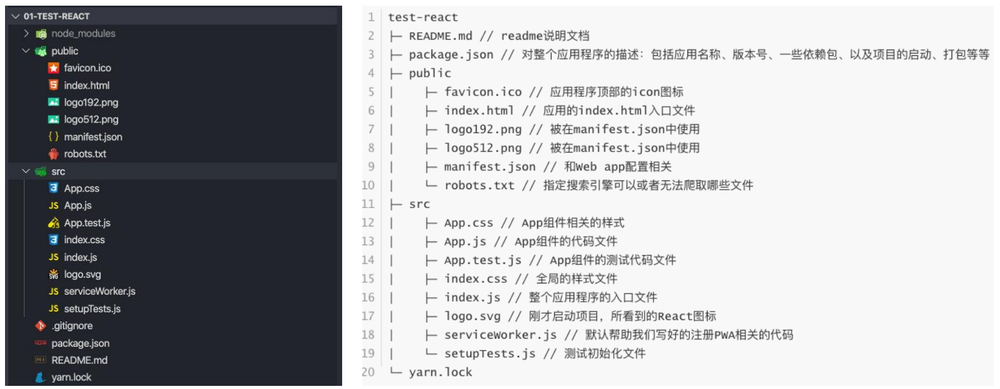
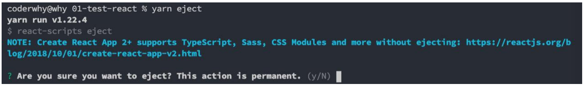
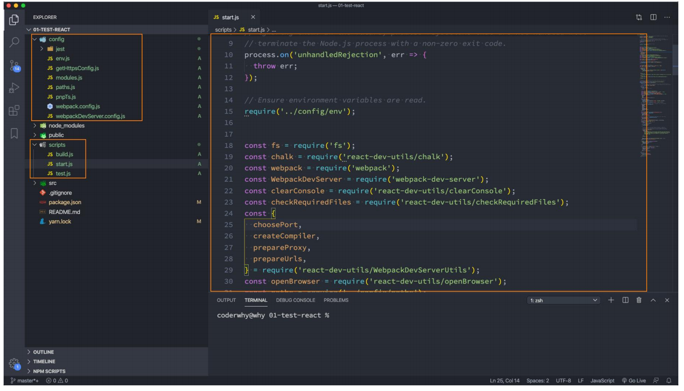

## **前端工程的复杂化**

**如果我们只是开发几个小的 demo 程序，那么永远不需要考虑一些复杂的问题：**

比如目录结构如何组织划分；

比如如何管理文件之间的相互依赖；

比如如何管理第三方模块的依赖；

比如项目发布前如何压缩、打包项目；

等等...

**现代的前端项目已经越来越复杂了：**

不会再是在 HTML 中引入几个 css 文件，引入几个编写的 js 文件或者第三方的 js 文件这么简单；

比如 css 可能是使用 less、sass 等预处理器进行编写，我们需要将它们转成普通的 css 才能被浏览器解析；

比如 JavaScript 代码不再只是编写在几个文件中，而是通过模块化的方式，被组成在**成百上千**个文件中，我们需要通过模块化的技术来管理它们之间的相互依赖；

比如项目需要依赖很多的第三方库，如何更好的管理它们（比如管理它们的依赖、版本升级等）；

**为了解决上面这些问题，我们需要再去学习一些工具：**

比如 babel、webpack、gulp，配置它们转换规则、打包依赖、热更新等等一些的内容；

脚手架的出现，就是帮助我们解决这一系列问题的；

## **脚手架是什么呢？**

**传统的脚手架指的是建筑学的一种结构：在搭建楼房、建筑物时，临时搭建出来的一个框架；**


**编程中提到的脚手架（Scaffold），其实是一种工具，帮我们可以快速生成项目的工程化结构；**

每个项目作出完成的效果不同，但是它们的基本工程化结构是相似的；

既然相似，就没有必要每次都从零开始搭建，完全可以使用一些工具，帮助我们生产基本的工程化模板；

不同的项目，在这个模板的基础之上进行项目开发或者进行一些配置的简单修改即可；

这样也可以间接保证项目的基本机构一致性，方便后期的维护；

总结：**脚手架让项目从搭建到开发，再到部署，整个流程变得快速和便捷；**

## **前端脚手架**

**对于现在比较流行的三大框架都有属于自己的脚手架：**

Vue 的脚手架：@vue/cli

Angular 的脚手架：@angular/cli

React 的脚手架：create-react-app

**它们的作用都是帮助我们生成一个通用的目录结构，并且已经将我们所需的工程环境配置好。**

**使用这些脚手架需要依赖什么呢？**

目前这些脚手架都是使用 node 编写的，并且都是基于 webpack 的；

所以我们必须在自己的电脑上安装 node 环境；

**这里我们主要是学习 React，所以我们以 React 的脚手架工具：create-react-app 作为讲解；**

## **安装 node**

**React 脚手架本身需要依赖 node，所以我们需要安装 node 环境：**

无论是 windows 还是 Mac OS，都可以通过 node 官网直接下载；

官网地址：https://nodejs.org/en/download/

注意：这里推荐大家下载 LTS（_Long-term support_ ）版本，是长期支持版本，会比较稳定；

**下载后，双击安装即可：**

1.安装过程中，会自动配置环境变量；

2.安装时，会同时帮助我们安装 npm 管理工具；

## **创建 React 项目**

**现在，我们就可以通过脚手架来创建 React 项目了。**

**创建 React 项目的命令如下：**

注意：项目名称不能包含大写字母

另外还有更多创建项目的方式，可以参考 GitHub 的 readme

```javascript
create-react-app 项目名称
```

创建完成后，进入对应的目录，就可以将项目跑起来：

```javascript
cd 01-test-react
yarn start
```

## **目录结构分析**

**我们可以通过 VSCode 打开项目：**



## **了解 PWA**

**整个目录结构都非常好理解，只是有一个 PWA 相关的概念：**

PWA 全称 Progressive Web App，即渐进式 WEB 应用；

一个 PWA 应用首先是一个网页, 可以通过 Web 技术编写出一个网页应用；

随后添加上 App Manifest 和 Service Worker 来实现 PWA 的安装和离线等功能；

这种 Web 存在的形式，我们也称之为是 Web App；

**PWA 解决了哪些问题呢？**

可以添加至主屏幕，点击主屏幕图标可以实现启动动画以及隐藏地址栏；

实现离线缓存功能，即使用户手机没有网络，依然可以使用一些离线功能；

实现了消息推送；

等等一系列类似于 Native App 相关的功能；

**更多 PWA 相关的知识，可以自行去学习更多；**

https://developer.mozilla.org/zh-CN/docs/Web/Progressive_web_apps

## **脚手架中的 webpack**

**React 脚手架默认是基于 Webpack 来开发的；**

原因是 React 脚手架将 webpack 相关的配置隐藏起来了（其实从 Vue CLI3 开始，也是进行了隐藏）；

**如果我们希望看到 webpack 的配置信息，应该怎么来做呢？**

我们可以执行一个 package.json 文件中的一个脚本："eject": "react-scripts eject"

这个操作是不可逆的，所以在执行过程中会给与我们提示；

```javascript
yarn eject
```



package.json

```javascript
"scripts": {
    "start": "react-scripts start", // 隐藏的webpack都在react-scripts这个包里面
    "build": "react-scripts build",
    "test": "react-scripts test",
    "eject": "react-scripts eject"
 }
```

如果后面想自己进行配置，可以借助 craco 这个工具。

## **脚手架中的 webpack**

执行 yarn eject 之后就可以看到 webpack 的配置信息了



## **文件结构删除**

**通过脚手架创建完项目，很多同学还是会感觉目录结构过于复杂，所以我打算从零带着大家来编写代码。**

**我们先将不需要的文件统统删掉：**

1.将 src 下的所有文件都删除

2.将 public 文件下出列 favicon.ico 和 index.html 之外的文件都删除掉


## **开始编写代码**

**在 src 目录下，创建一个 index.js 文件，因为这是 webpack 打包的入口。**

**在 index.js 中开始编写 React 代码：**

我们会发现和写的代码是逻辑是一致的；

只是在模块化开发中，我们需要手动的来导入 React、ReactDOM，因为它们都是在我们安装的模块中；

React18 之前和之后引入 ReactDOM 的包不一样

```javascript
import ReactDOM from "react-dom"; // React18之前
import ReactDOM from "react-dom/client"; // React18之后
```


**如果我们不希望直接在 root.render 中编写过多的代码，就可以单独抽取一个组件 App.js：**


src/index.js

```javascript
import ReactDOM from "react-dom/client";

import App from "./App";

// 编写React代码, 并且通过React渲染出来对应的内容
const root = ReactDOM.createRoot(document.querySelector("#root")); // 这里的#root和index.html对应
root.render(<App />);
```

App.jsx

```javascript
import React from "react";
import HelloWorld from "./Components/HellWorld";

// 编写一个组件
class App extends React.Component {
  constructor() {
    super();
    this.state = {
      message: "Hello React Scaffold",
    };
  }

  render() {
    const { message } = this.state;

    return (
      <div>
        <h2>{message}</h2>
        <HelloWorld />
      </div>
    );
  }
}

export default App;
```

Components/HelloWorld.jsx

```javascript
import React from "react";

class HelloWorld extends React.Component {
  render() {
    return (
      <div>
        <h2>Hello World</h2>
        <p>Hello World, 你好, 师姐!</p>
      </div>
    );
  }
}

export default HelloWorld;
```
