## 什么是组件化开发呢？

组件化是一种分而治之的思想：

如果我们将一个页面中所有的处理逻辑全部放在一起，处理起来就会变得非常复杂，而且不利于后续的管理以及扩展。

但如果，我们讲一个页面拆分成一个个小的功能块，每个功能块完成属于自己这部分独立的功能，那么之后整个页面的管理和维护就变得非常容易了。

我们需要通过组件化的思想来思考整个应用程序：

- 我们将一个完整的页面分成很多个组件；

- 每个组件都用于实现页面的一个功能块；

- 而每一个组件又可以进行细分；

- 而组件本身又可以在多个地方进行复用；

## React 的组件化

**组件化是 React 的核心思想，也是我们后续课程的重点，前面我们封装的 App 本身就是一个组件：**

组件化提供了一种抽象，让我们可以开发出一个个独立可复用的小组件来构造我们的应用。

任何的应用都会被抽象成一颗组件树。


组件化思想的应用：

有了组件化的思想，我们在之后的开发中就要充分的利用它。

尽可能的将页面拆分成一个个小的、可复用的组件。

这样让我们的代码更加方便组织和管理，并且扩展性也更强。

**React 的组件相对于 Vue 更加的灵活和多样，按照不同的方式可以分成很多类组件：**

- 根据组件的定义方式，可以分为：函数组件(Functional Component )和类组件(Class Component)；

- 根据组件内部是否有状态需要维护，可以分成：无状态组件(Stateless Component )和有状态组件(Stateful Component)；

- 根据组件的不同职责，可以分成：展示型组件(Presentational Component)和容器型组件(Container Component)；

**这些概念有很多重叠，但是他们最主要是关注数据逻辑和 UI 展示的分离：**

函数组件、无状态组件、展示型组件主要关注 UI 的展示；

类组件、有状态组件、容器型组件主要关注数据逻辑；

当然还有很多组件的其他概念：比如异步组件、高阶组件等，我们后续再学习。

## 类组件

**类组件的定义有如下要求：**

组件的名称是大写字符开头（无论类组件还是函数组件）

类组件需要继承自 React.Component

类组件必须实现 render 函数

**在 ES6 之前，可以通过 create-react-class 模块来定义类组件，但是目前官网建议我们使用 ES6 的 class 类定义。**

**使用 class 定义一个组件：**

constructor 是可选的，我们通常在 constructor 中初始化一些数据；

this.state 中维护的就是我们组件内部的数据；

render() 方法是 class 组件中唯一必须实现的方法；

## render 函数的返回值

当 render 被调用时，它会检查 this.props 和 this.state 的变化并返回以下类型之一：

React 元素：

通常通过 JSX 创建。

例如，`<div />` 会被 React 渲染为 DOM 节点，`<MyComponent />` 会被 React 渲染为自定义组件；

无论是 `<div />` 还是 `<MyComponent /> `均为 React 元素。

数组或 fragments：使得 render 方法可以返回多个元素。

Portals：可以渲染子节点到不同的 DOM 子树中。

字符串或数值类型：它们在 DOM 中会被渲染为文本节点

布尔类型或 null：什么都不渲染。

```javascript
import React from "react";

// 1.类组件
class App extends React.Component {
  constructor() {
    super();

    this.state = {
      message: "App Component",
    };
  }

  render() {
    // const { message } = this.state
    // 1.react元素: 通过jsx编写的代码就会被编译成React.createElement, 所以返回的就是一个React元素
    // return <h2>{message}</h2>

    // 2.组件或者fragments(后续学习)
    // return ["abc", "cba", "nba"]
    // return [
    //   <h1>h1元素</h1>,
    //   <h2>h2元素</h2>,
    //   <div>哈哈哈</div>
    // ]

    // 3.字符串/数字类型
    // return "Hello World"

    return true;
  }
}

export default App;
```

## 函数组件

函数组件是使用 function 来进行定义的函数，只是这个函数会返回和类组件中 render 函数返回一样的内容。

函数组件有自己的特点（当然，后面我们会讲 hooks，就不一样了）：

- 没有生命周期，也会被更新并挂载，但是没有生命周期函数；

- this 关键字不能指向组件实例（因为没有组件实例）；
- 没有内部状态（state）；

我们来定义一个函数组件：

```javascript
// 函数式组件
function App(props) {
  // 返回值: 和类组件中render函数返回的是一致
  return <h1>App Functional Component</h1>;
}

export default App;
```

在前面的学习中，我们主要讲解类组件，后面学习 Hooks 时，会针对函数式组件进行更多的学习。

## 认识生命周期

很多的事物都有从创建到销毁的整个过程，这个过程称之为是生命周期；

React 组件也有自己的生命周期，了解组件的生命周期可以让我们在最合适的地方完成自己想要的功能；

生命周期和生命周期函数的关系：

生命周期是一个抽象的概念，在生命周期的整个过程，分成了很多个阶段；

比如装载阶段（Mount），组件第一次在 DOM 树中被渲染的过程；

比如更新过程（Update），组件状态发生变化，重新更新渲染的过程；

比如卸载过程（Unmount），组件从 DOM 树中被移除的过程；

React 内部为了告诉我们当前处于哪些阶段，会对我们组件内部实现的某些函数进行回调，这些函数就是生命周期函数：

比如实现 componentDidMount 函数：组件已经挂载到 DOM 上时，就会回调；

比如实现 componentDidUpdate 函数：组件已经发生了更新时，就会回调；

比如实现 componentWillUnmount 函数：组件即将被移除时，就会回调；

我们可以在这些回调函数中编写自己的逻辑代码，来完成自己的需求功能；

我们谈 React 生命周期时，主要谈的类的生命周期，因为函数式组件是没有生命周期函数的；（后面我们可以通过 hooks 来模拟一些生命周期的回调）

## 生命周期解析

我们先来学习一下最基础、最常用的生命周期函数：

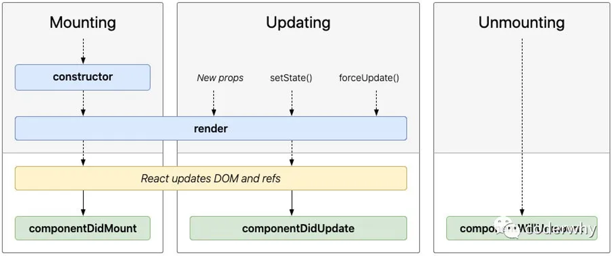

## 生命周期函数

Constructor

如果不初始化 state 或不进行方法绑定，则不需要为 React 组件实现构造函数。

constructor 中通常只做两件事情：

通过给 this.state 赋值对象来初始化内部的 state；

为事件绑定实例（this）；

componentDidMount

componentDidMount() 会在组件挂载后（插入 DOM 树中）立即调用。

componentDidMount 中通常进行哪里操作呢？

- 依赖于 DOM 的操作可以在这里进行；

- 在此处发送网络请求就最好的地方；（官方建议）

- 可以在此处添加一些订阅（会在 componentWillUnmount 取消订阅）；

componentDidUpdate

componentDidUpdate() 会在更新后会被立即调用，首次渲染不会执行此方法。

当组件更新后，可以在此处对 DOM 进行操作；

如果你对更新前后的 props 进行了比较，也可以选择在此处进行网络请求；（例如，当 props 未发生变化时，则不会执行网络请求）。

componentWillUnmount

componentWillUnmount() 会在组件卸载及销毁之前直接调用。

在此方法中执行必要的清理操作；

例如，清除 timer，取消网络请求或清除在 componentDidMount() 中创建的订阅等；

```javascript
import React from "react";

class HelloWorld extends React.Component {
  // 1.构造方法: constructor
  constructor() {
    console.log("HelloWorld constructor");
    super();

    this.state = {
      message: "Hello World",
    };
  }

  changeText() {
    this.setState({ message: "你好啊, 李银河" });
  }

  // 2.执行render函数
  render() {
    console.log("HelloWorld render");
    const { message } = this.state;

    return (
      <div>
        <h2>{message}</h2>
        <p>{message}是程序员的第一个代码!</p>
        <button onClick={(e) => this.changeText()}>修改文本</button>
      </div>
    );
  }

  // 3.组件被渲染到DOM: 被挂载到DOM
  componentDidMount() {
    console.log("HelloWorld componentDidMount");
  }

  // 4.组件的DOM被更新完成： DOM发生更新
  componentDidUpdate() {
    console.log("HelloWorld componentDidUpdate");
  }

  // 5.组件从DOM中卸载掉： 从DOM移除掉
  componentWillUnmount() {
    console.log("HelloWorld componentWillUnmount");
  }
}

export default HelloWorld;
```

刚开始渲染执行的生命周期顺序

```javascript
HelloWorld constructor
HelloWorld render
HelloWorld componentDidMount
```

点击修改文本按钮，就会触发更新，执行的生命周期顺序

```javascript
HelloWorld render
HelloWorld componentDidUpdate
```

App.jsx

```javascript
import React from "react";
import HelloWorld from "./HelloWorld";

class App extends React.Component {
  constructor() {
    super();

    this.state = {
      isShowHW: true,
    };
  }

  switchHWShow() {
    this.setState({ isShowHW: !this.state.isShowHW });
  }

  render() {
    const { isShowHW } = this.state;

    return (
      <div>
        哈哈哈
        <button onClick={(e) => this.switchHWShow()}>切换</button>
        {isShowHW && <HelloWorld />}
      </div>
    );
  }
}

export default App;
```

点击切换按钮，组件会被卸载，执行 componentWillUnmount 周期函数。

## 不常用生命周期函数

除了上面介绍的生命周期函数之外，还有一些不常用的生命周期函数：

getDerivedStateFromProps：state 的值在任何时候都依赖于 props 时使用；该方法返回一个对象来更新 state；

getSnapshotBeforeUpdate：在 React 更新 DOM 之前回调的一个函数，可以获取 DOM 更新前的一些信息（比如说滚动位置）；

shouldComponentUpdate：该生命周期函数很常用，但是我们等待讲性能优化时再来详细讲解；

另外，React 中还提供了一些过期的生命周期函数，这些函数已经不推荐使用。

更详细的生命周期相关的内容，可以参考官网：

https://zh-hans.reactjs.org/docs/react-component.html

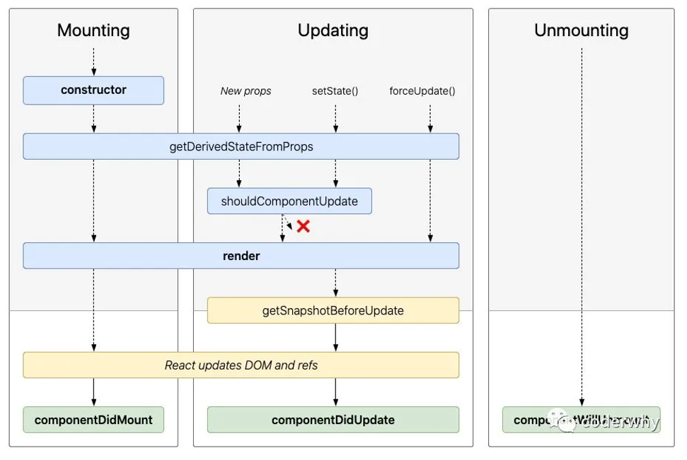

```javascript
import React from "react";

class HelloWorld extends React.Component {
  // 1.构造方法: constructor
  constructor() {
    console.log("HelloWorld constructor");
    super();

    this.state = {
      message: "Hello World",
    };
  }

  changeText() {
    this.setState({ message: "你好啊, 李银河" });
  }

  // 2.执行render函数
  render() {
    console.log("HelloWorld render");
    const { message } = this.state;

    return (
      <div>
        <h2>{message}</h2>
        <p>{message}是程序员的第一个代码!</p>
        <button onClick={(e) => this.changeText()}>修改文本</button>
      </div>
    );
  }

  // 3.组件被渲染到DOM: 被挂载到DOM
  componentDidMount() {
    console.log("HelloWorld componentDidMount");
  }

  // 4.组件的DOM被更新完成： DOM发生更新
  componentDidUpdate(prevProps, prevState, snapshot) {
    // snapshot拿到记录的数据
    console.log(
      "HelloWorld componentDidUpdate:",
      prevProps,
      prevState,
      snapshot
    );
  }

  // 5.组件从DOM中卸载掉： 从DOM移除掉
  componentWillUnmount() {
    console.log("HelloWorld componentWillUnmount");
  }

  // 不常用的生命周期补充
  shouldComponentUpdate() {
    return true;
  }

  getSnapshotBeforeUpdate() {
    console.log("getSnapshotBeforeUpdate");
    return {
      scrollPosition: 1000, // 这里记录数据
    };
  }
}

export default HelloWorld;
```

点击修改文本，在 render 方法执行之前，会先执行 shouldComponentUpdate 这个方法，默认是返回 true，如果改成返回 false，那么就不会执行 render 方法，也就不会触发更新。

在 componentDidUpdate 函数之前有个 getSnapshotBeforeUpdate 方法，可以用来记录一些数据，比如滚动的位置，那么在 componentDidUpdate 函数的第 3 个参数就可以拿到记录的数据。

## 认识组件的嵌套

组件之间存在嵌套关系：

在之前的案例中，我们只是创建了一个组件 App；

如果我们一个应用程序将所有的逻辑都放在一个组件中，那么这个组件就会变成非常的臃肿和难以维护；

所以组件化的核心思想应该是对组件进行拆分，拆分成一个个小的组件；

再将这些组件组合嵌套在一起，最终形成我们的应用程序；

上面的嵌套逻辑如下，它们存在如下关系：

App 组件是 Header、Main、Footer 组件的父组件；

Main 组件是 Banner、ProductList 组件的父组件；

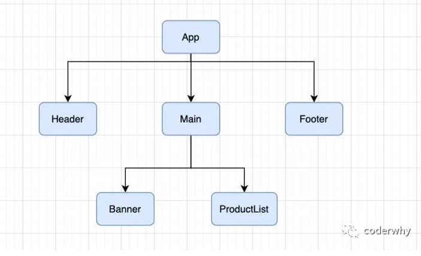

推荐插件安装

ES7+ React/Redux/React-Native snippets，插件搜索 react 就能找到

App.jsx

```javascript
import React, { Component } from "react";
import Header from "./c-cpns/Header";
import Footer from "./c-cpns/Footer";
import Main from "./c-cpns/Main";

export class App extends Component {
  render() {
    return (
      <div className="app">
        <Header />
        <Main />
        <Footer />
      </div>
    );
  }
}

export default App;
```

c-cpns/Header.jsx

```javascript
import React, { Component } from "react";

export class Header extends Component {
  render() {
    return <div>Header</div>;
  }
}

export default Header;
```

c-cpns/Main.jsx

```javascript
import React, { Component } from "react";
import MainBanner from "./MainBanner";
import MainProductList from "./MainProductList";

export class Main extends Component {
  render() {
    return (
      <div className="main">
        <div>Main</div>
        <MainBanner />
        <MainProductList />
      </div>
    );
  }
}

export default Main;
```

c-cpns/MainBanner.jsx

```javascript
import React, { Component } from "react";

export class MainBanner extends Component {
  render() {
    return (
      <div>
        <h2>封装一个轮播图</h2>
      </div>
    );
  }
}

export default MainBanner;
```

c-cpns/MainProduct.jsx

```javascript
import React, { Component } from "react";

export class MainProductList extends Component {
  render() {
    return (
      <div>
        <h2>商品列表</h2>
        <ul>
          <li>商品item01</li>
          <li>商品item02</li>
          <li>商品item03</li>
          <li>商品item04</li>
        </ul>
      </div>
    );
  }
}

export default MainProductList;
```

c-cpns/Footer.jsx

```javascript
import React, { Component } from "react";

export class Footer extends Component {
  render() {
    return <div>Footer</div>;
  }
}

export default Footer;
```

## 认识组件间的通信

在开发过程中，我们会经常遇到需要组件之间相互进行通信：

比如 App 可能使用了多个 Header，每个地方的 Header 展示的内容不同，那么我们就需要使用者传递给 Header 一些数据，让其进行展示；

又比如我们在 Main 中一次性请求了 Banner 数据和 ProductList 数据，那么就需要传递给他们来进行展示；

也可能是子组件中发生了事件，需要由父组件来完成某些操作，那就需要子组件向父组件传递事件；

总之，在一个 React 项目中，组件之间的通信是非常重要的环节；

父组件在展示子组件，可能会传递一些数据给子组件：

- 父组件通过 属性=值 的形式来传递给子组件数据；

- 子组件通过 props 参数获取父组件传递过来的数据；

Main.jsx

```javascript
import React, { Component } from "react";
import axios from "axios";

import MainBanner from "./MainBanner";
import MainProductList from "./MainProductList";

export class Main extends Component {
  constructor() {
    super();

    this.state = {
      banners: [],
      productList: [],
    };
  }

  componentDidMount() {
    axios.get("http://123.207.32.32:8000/home/multidata").then((res) => {
      const banners = res.data.data.banner.list;
      const recommend = res.data.data.recommend.list;
      this.setState({
        banners,
        productList: recommend,
      });
    });
  }

  render() {
    const { banners, productList } = this.state;

    return (
      <div className="main">
        <div>Main</div>
        <MainBanner banners={banners} title="轮播图" />
        <MainBanner />
        <MainProductList productList={productList} />
      </div>
    );
  }
}

export default Main;
```

MainBanner.jsx

```javascript
import React, { Component } from "react";

export class MainBanner extends Component {
  constructor(props) {
    // 整个constructor也可以不写
    super(props); // 内部相当于做了this.props = props的操作

    this.state = {};
  }

  render() {
    // console.log(this.props)
    const { title, banners } = this.props;

    return (
      <div className="banner">
        <h2>封装一个轮播图: {title}</h2>
        <ul>
          {banners.map((item) => {
            return <li key={item.acm}>{item.title}</li>;
          })}
        </ul>
      </div>
    );
  }
}

export default MainBanner;
```

## 参数 propTypes

对于传递给子组件的数据，有时候我们可能希望进行验证，特别是对于大型项目来说：

当然，如果你项目中默认继承了 Flow 或者 TypeScript，那么直接就可以进行类型验证；

但是，即使我们没有使用 Flow 或者 TypeScript，也可以通过 prop-types 库来进行参数验证；

从 React v15.5 开始，React.PropTypes 已移入另一个包中：prop-types 库

更多的验证方式，可以参考官网：https://zh-hans.reactjs.org/docs/typechecking-with-proptypes.html

比如验证数组，并且数组中包含哪些元素；

比如验证对象，并且对象中包含哪些 key 以及 value 是什么类型；

比如某个原生是必须的，使用 requiredFunc: PropTypes.func.isRequired

如果没有传递，我们希望有默认值呢？

我们使用 defaultProps 就可以了

```javascript
import React, { Component } from "react";
import PropTypes from "prop-types";

export class MainBanner extends Component {
  // 默认值也可以使用这种写法，比较新的写法
  // static defaultProps = {
  //   banners: [],
  //   title: "默认标题"
  // }

  constructor(props) {
    super(props);

    this.state = {};
  }

  render() {
    // console.log(this.props)
    const { title, banners } = this.props;

    return (
      <div className="banner">
        <h2>封装一个轮播图: {title}</h2>
        <ul>
          {banners.map((item) => {
            return <li key={item.acm}>{item.title}</li>;
          })}
        </ul>
      </div>
    );
  }
}

// MainBanner传入的props类型进行验证
MainBanner.propTypes = {
  banners: PropTypes.array,
  title: PropTypes.string,
};

// MainBanner传入的props的默认值
MainBanner.defaultProps = {
  banners: [],
  title: "默认标题",
};

export default MainBanner;
```

## 子组件传递父组件

某些情况，我们也需要子组件向父组件传递消息：

在 vue 中是通过自定义事件来完成的；

在 React 中同样是通过 props 传递消息，只是让父组件给子组件传递一个回调函数，在子组件中调用这个函数即可；

App.jsx

```javascript
import React, { Component } from "react";
import AddCounter from "./AddCounter";
import SubCounter from "./SubCounter";

export class App extends Component {
  constructor() {
    super();

    this.state = {
      counter: 100,
    };
  }

  changeCounter(count) {
    this.setState({ counter: this.state.counter + count });
  }

  render() {
    const { counter } = this.state;

    return (
      <div>
        <h2>当前计数: {counter}</h2>
        <AddCounter addClick={(count) => this.changeCounter(count)} />
        <SubCounter subClick={(count) => this.changeCounter(count)} />
      </div>
    );
  }
}

export default App;
```

AddCounter.jsx

```javascript
import React, { Component } from "react";
// import PropTypes from "prop-types"

export class AddCounter extends Component {
  addCount(count) {
    this.props.addClick(count);
  }

  render() {
    return (
      <div>
        <button onClick={(e) => this.addCount(1)}>+1</button>
        <button onClick={(e) => this.addCount(5)}>+5</button>
        <button onClick={(e) => this.addCount(10)}>+10</button>
      </div>
    );
  }
}

// AddCounter.propTypes = {
//   addClick: PropTypes.func
// }

export default AddCounter;
```

SubCounter.jsx

```javascript
import React, { Component } from "react";

export class SubCounter extends Component {
  subCount(count) {
    this.props.subClick(count);
  }

  render() {
    return (
      <div>
        <button onClick={(e) => this.subCount(-1)}>-1</button>
        <button onClick={(e) => this.subCount(-5)}>-5</button>
        <button onClick={(e) => this.subCount(-10)}>-10</button>
      </div>
    );
  }
}

export default SubCounter;
```

## 组件通信案例练习


App.jsx

```javascript
import React, { Component } from "react";
import TabControl from "./TabControl";

export class App extends Component {
  constructor() {
    super();

    this.state = {
      titles: ["流行", "新款", "精选"],
      tabIndex: 0,
    };
  }

  tabClick(tabIndex) {
    this.setState({ tabIndex });
  }

  render() {
    const { titles, tabIndex } = this.state;

    return (
      <div className="app">
        <TabControl titles={titles} tabClick={(i) => this.tabClick(i)} />
        <h1>{titles[tabIndex]}</h1>
      </div>
    );
  }
}

export default App;
```

TabControl/index.jsx

```javascript
import React, { Component } from "react";
import "./style.css";

export class TabControl extends Component {
  constructor() {
    super();

    this.state = {
      currentIndex: 0,
    };
  }

  itemClick(index) {
    // 1.自己保存最新的index
    this.setState({ currentIndex: index });

    // 2.让父组件执行对应的函数
    this.props.tabClick(index);
  }

  render() {
    const { titles } = this.props;
    const { currentIndex } = this.state;

    return (
      <div className="tab-control">
        {titles.map((item, index) => {
          return (
            <div
              className={`item ${index === currentIndex ? "active" : ""}`}
              key={item}
              onClick={(e) => this.itemClick(index)}
            >
              <span className="text">{item}</span>
            </div>
          );
        })}
      </div>
    );
  }
}

export default TabControl;
```

TabControl/style.css

```css
.tab-control {
  display: flex;
  align-items: center;
  height: 40px;
  text-align: center;
}

.tab-control .item {
  flex: 1;
}

.tab-control .item.active {
  color: red;
}

.tab-control .item.active .text {
  padding: 3px;
  border-bottom: 3px solid red;
}
```

## React 中的插槽（slot）

在开发中，我们抽取了一个组件，但是为了让这个组件具备更强的通用性，我们不能将组件中的内容限制为固定的 div、span 等等这些元素。

我们应该让使用者可以决定某一块区域到底存放什么内容。

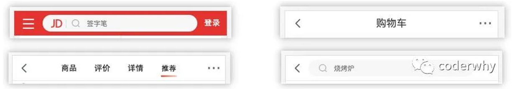

这种需求在 Vue 当中有一个固定的做法是通过 slot 来完成的，React 呢？

React 对于这种需要插槽的情况非常灵活，有两种方案可以实现：

- 组件的 children 子元素；
- props 属性传递 React 元素；

## children 实现插槽

每个组件都可以获取到 props.children：它包含组件的开始标签和结束标签之间的内容。

如果传入多个元素，那么 props.children 是一个数组，但是如果只传入一个元素，那么 props.children 就是一个元素

App.jsx

```javascript
import React, { Component } from "react";
import NavBar from "./nav-bar";

export class App extends Component {
  render() {
    return (
      <div>
        {/* 1.使用children实现插槽 */}
        <NavBar>
          <button>按钮</button>
          <h2>哈哈哈</h2>
          <i>斜体文本</i>
        </NavBar>
      </div>
    );
  }
}

export default App;
```

nav-bar/index.jsx

```javascript
import React, { Component } from "react";
// import PropTypes from "prop-types"
import "./style.css";

export class NavBar extends Component {
  render() {
    const { children } = this.props;
    console.log(children);

    return (
      <div className="nav-bar">
        <div className="left">{children[0]}</div>
        <div className="center">{children[1]}</div>
        <div className="right">{children[2]}</div>
      </div>
    );
  }
}

// NavBar.propTypes = {
//   children: PropTypes.array
// }

export default NavBar;
```

## props 实现插槽

通过 children 实现的方案虽然可行，但是有一个弊端：通过索引值获取传入的元素很容易出错，不能精准的获取传入的原生；

另外一种方案就是使用 props 实现：

通过具体的属性名，可以让我们在传入和获取时更加的精准；

App.jsx

```javascript
import React, { Component } from "react";
import NavBarTwo from "./nav-bar-two";

export class App extends Component {
  render() {
    const btn = <button>按钮2</button>;

    return (
      <div>
        {/* 2.使用props实现插槽 */}
        <NavBarTwo
          leftSlot={btn}
          centerSlot={<h2>呵呵呵</h2>}
          rightSlot={<i>斜体2</i>}
        />
      </div>
    );
  }
}

export default App;
```

nav-bar-two/index.jsx

```javascript
import React, { Component } from "react";

export class NavBarTwo extends Component {
  render() {
    const { leftSlot, centerSlot, rightSlot } = this.props;

    return (
      <div className="nav-bar">
        <div className="left">{leftSlot}</div>
        <div className="center">{centerSlot}</div>
        <div className="right">{rightSlot}</div>
      </div>
    );
  }
}

export default NavBarTwo;
```

## 作用域插槽的实现方案

还是使用上面的组件通信案例，只不过这次，切换点击的区域展示的内容不一样。

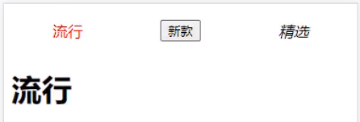

App.jsx

```javascript
import React, { Component } from "react";
import TabControl from "./TabControl";

export class App extends Component {
  constructor() {
    super();

    this.state = {
      titles: ["流行", "新款", "精选"],
      tabIndex: 0,
    };
  }

  tabClick(tabIndex) {
    this.setState({ tabIndex });
  }

  getTabItem(item) {
    if (item === "流行") {
      return <span>{item}</span>;
    } else if (item === "新款") {
      return <button>{item}</button>;
    } else {
      return <i>{item}</i>;
    }
  }

  render() {
    const { titles, tabIndex } = this.state;

    return (
      <div className="app">
        <TabControl
          titles={titles}
          tabClick={(i) => this.tabClick(i)}
          // itemType={item => <button>{item}</button>}
          itemType={(item) => this.getTabItem(item)}
        />
        <h1>{titles[tabIndex]}</h1>
      </div>
    );
  }
}

export default App;
```

TabControl/index.jsx

```javascript
import React, { Component } from "react";
import "./style.css";

export class TabControl extends Component {
  constructor() {
    super();

    this.state = {
      currentIndex: 0,
    };
  }

  itemClick(index) {
    // 1.自己保存最新的index
    this.setState({ currentIndex: index });

    // 2.让父组件执行对应的函数
    this.props.tabClick(index);
  }

  render() {
    const { titles, itemType } = this.props;
    const { currentIndex } = this.state;

    return (
      <div className="tab-control">
        {titles.map((item, index) => {
          return (
            <div
              className={`item ${index === currentIndex ? "active" : ""}`}
              key={item}
              onClick={(e) => this.itemClick(index)}
            >
              {/* <span className='text'>{item}</span> */}
              {/* 回调itemType函数，把item传出去 */}
              {itemType(item)}
            </div>
          );
        })}
      </div>
    );
  }
}

export default TabControl;
```

## Context 应用场景

非父子组件数据的共享：

在开发中，比较常见的数据传递方式是通过 props 属性自上而下（由父到子）进行传递。

但是对于有一些场景：比如一些数据需要在多个组件中进行共享（地区偏好、UI 主题、用户登录状态、用户信息等）。

如果我们在顶层的 App 中定义这些信息，之后一层层传递下去，那么对于一些中间层不需要数据的组件来说，是一种冗余的操作。

我们实现一个一层层传递的案例：

我这边顺便补充一个小的知识点：Spread Attributes

```javascript
import React, { Component } from "react";
import Home from "./Home";

export class App extends Component {
  constructor() {
    super();

    this.state = {
      info: { name: "kobe", age: 30 },
    };
  }

  render() {
    const { info } = this.state;

    return (
      <div>
        <h2>App</h2>
        {/* 1.给Home传递数据 */}
        <Home name="why" age={18} />
        <Home name={info.name} age={info.age} />
        <Home {...info} />
      </div>
    );
  }
}

export default App;
```

但是，如果层级更多的话，一层层传递是非常麻烦，并且代码是非常冗余的：

React 提供了一个 API：Context；类似于 Vue 的 Provide 和 Inject

Context 提供了一种在组件之间共享此类值的方式，而不必显式地通过组件树的逐层传递 props；

Context 设计目的是为了共享那些对于一个组件树而言是“全局”的数据，例如当前认证的用户、主题或首选语言；

## Context 相关 API

React.createContext

创建一个需要共享的 Context 对象：

如果一个组件订阅了 Context，那么这个组件会从离自身最近的那个匹配的 Provider 中读取到当前的 context 值；

defaultValue 是组件在顶层查找过程中没有找到对应的 Provider，那么就使用默认值

```javascript
const MyContext = React.createContext(defaultValue);
```

Context.Provider

每个 Context 对象都会返回一个 Provider React 组件，它允许消费组件订阅 context 的变化：

Provider 接收一个 value 属性，传递给消费组件；

一个 Provider 可以和多个消费组件有对应关系；

多个 Provider 也可以嵌套使用，里层的会覆盖外层的数据；

当 Provider 的 value 值发生变化时，它内部的所有消费组件都会重新渲染；

```javascript
<MyContext.Provider value={/*某个值*/}></MyContext.Provider>
```

Class.contextType

挂载在 class 上的 contextType 属性会被重赋值为一个由 React.createContext() 创建的 Context 对象：

这能让你使用 this.context 来消费最近 Context 上的那个值；

你可以在任何生命周期中访问到它，包括 render 函数中；

```javascript
MyContext.contextType = MyContext;
```

Context.Consumer

这里，React 组件也可以订阅到 context 变更。这能让你在 函数式组件 中完成订阅 context。

这里需要 函数作为子元素（function as child）这种做法；

这个函数接收当前的 context 值，返回一个 React 节点；

## Context 代码演练

Context 的基本使用

什么时候使用默认值 defaultValue 呢？

Home 组件没有包裹在 UserContext.Provider 中

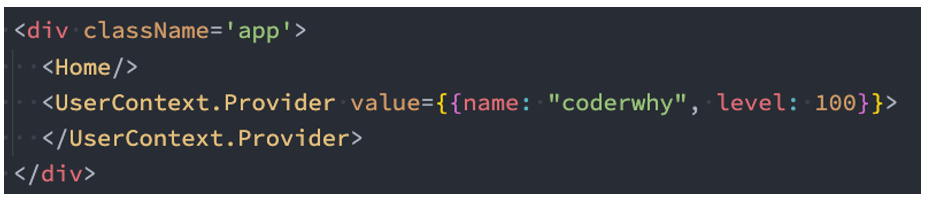

什么时候使用 Context.Consumer 呢？

1.当使用 value 的组件是一个函数式组件时；

2.当组件中需要使用多个 Context 时；

App.jsx

```javascript
import React, { Component } from "react";
import Home from "./Home";

import ThemeContext from "./context/theme-context";
import UserContext from "./context/user-context";
import Profile from "./Profile";

export class App extends Component {
  constructor() {
    super();

    this.state = {
      info: { name: "kobe", age: 30 },
    };
  }

  render() {
    const { info } = this.state;

    return (
      <div>
        <h2>App</h2>
        {/* 1.给Home传递数据 */}
        {/* <Home name="why" age={18}/>
        <Home name={info.name} age={info.age}/>
        <Home {...info}/> */}

        {/* 2.普通的Home */}
        {/* 第二步操作: 通过ThemeContext中Provider中value属性为后代提供数据 */}
        <UserContext.Provider value={{ nickname: "kobe", age: 30 }}>
          <ThemeContext.Provider value={{ color: "red", size: "30" }}>
            <Home {...info} />
          </ThemeContext.Provider>
        </UserContext.Provider>
        {/*使用context默认值，没有被context包裹*/}
        <Profile />
      </div>
    );
  }
}

export default App;
```

context/theme-context.js

```javascript
import React from "react";

// 1.创建一个Context
const ThemeContext = React.createContext({ color: "blue", size: 10 });

export default ThemeContext;
```

context/user-context.js

```javascript
import React from "react";

// 1.创建一个Context
const UserContext = React.createContext();

export default UserContext;
```

Home.jsx

```javascript
import React, { Component } from "react";
import HomeBanner from "./HomeBanner";
import HomeInfo from "./HomeInfo";

export class Home extends Component {
  render() {
    const { name, age } = this.props;

    return (
      <div>
        <h2>
          Home: {name}-{age}
        </h2>
        <HomeInfo />
        <HomeBanner />
      </div>
    );
  }
}

export default Home;
```

HomeBanner.jsx

```javascript
import ThemeContext from "./context/theme-context";

function HomeBanner() {
  return (
    <div>
      {/* 函数式组件中使用Context共享的数据 */}
      <ThemeContext.Consumer>
        {(value) => {
          return <h2> Banner theme:{value.color}</h2>;
        }}
      </ThemeContext.Consumer>
    </div>
  );
}

export default HomeBanner;
```

HomeInfo.jsx

```javascript
import React, { Component } from "react";
import ThemeContext from "./context/theme-context";
import UserContext from "./context/user-context";

export class HomeInfo extends Component {
  render() {
    // 4.第四步操作: 获取数据, 并且使用数据
    console.log(this.context);

    return (
      <div>
        <h2>HomeInfo: {this.context.color}</h2>
        {/*多个context使用Consumer*/}
        <UserContext.Consumer>
          {(value) => {
            return <h2>Info User: {value.nickname}</h2>;
          }}
        </UserContext.Consumer>
      </div>
    );
  }
}

// 3.第三步操作: 设置组件的contextType为某一个Context，只能设置一个context
HomeInfo.contextType = ThemeContext;

export default HomeInfo;
```

Profile.jsx

```javascript
import React, { Component } from "react";
import ThemeContext from "./context/theme-context";

export class Profile extends Component {
  render() {
    console.log(this.context);

    return <div>Profile</div>;
  }
}

Profile.contextType = ThemeContext;

export default Profile;
```

## 非父子组件通信-事件总线

utlis/event-bus.js

```javascript
import { HYEventBus } from "hy-event-store";

const eventBus = new HYEventBus();

export default eventBus;
```

App.jsx

```javascript
import React, { Component } from "react";
import Home from "./Home";
import eventBus from "./utils/event-bus";

export class App extends Component {
  constructor() {
    super();

    this.state = {
      name: "",
      age: 0,
      height: 0,
    };
  }

  componentDidMount() {
    // eventBus.on("bannerPrev", (name, age, height) => {
    //   console.log("app中监听到bannerPrev", name, age, height)
    //   this.setState({ name, age, height })
    // })

    eventBus.on("bannerPrev", this.bannerPrevClick, this); // 这里要绑定this
    eventBus.on("bannerNext", this.bannerNextClick, this);
  }

  bannerPrevClick(name, age, height) {
    console.log("app中监听到bannerPrev", name, age, height);
    this.setState({ name, age, height });
  }

  bannerNextClick(info) {
    console.log("app中监听到bannerNext", info);
  }

  componentWillUnmount() {
    eventBus.off("bannerPrev", this.bannerPrevClick, this);
    eventBus.off("bannerNext", this.bannerNextClick, this);
  }

  render() {
    const { name, age, height } = this.state;

    return (
      <div>
        <h2>
          App Component: {name}-{age}-{height}
        </h2>
        <Home />
      </div>
    );
  }
}

export default App;
```

上面事件总线监听函数的 this 绑定除了上面的写法还有下面 2 种方法：

```javascript
componentDidMount() {
    eventBus.on("bannerPrev", this.bannerPrevClick.bind(this))
}

bannerPrevClick() {
    ...
}
```

也可以使用箭头函数

```javascript
componentDidMount() {
    eventBus.on("bannerPrev", this.bannerPrevClick)
}

bannerPrevClick = () => {
    ...
}
```

HomeBanner.jsx

```javascript
import React, { Component } from "react";
import eventBus from "./utils/event-bus";

export class HomeBanner extends Component {
  prevClick() {
    console.log("上一个");

    eventBus.emit("bannerPrev", "why", 18, 1.88);
  }

  nextClick() {
    console.log("下一个");
    eventBus.emit("bannerNext", { nickname: "kobe", level: 99 });
  }

  render() {
    return (
      <div>
        <h2>HomeBanner</h2>
        <button onClick={(e) => this.prevClick()}>上一个</button>
        <button onClick={(e) => this.nextClick()}>下一个</button>
      </div>
    );
  }
}

export default HomeBanner;
```

## 为什么使用 setState

开发中我们并不能直接通过修改 state 的值来让界面发生更新：

因为我们修改了 state 之后，希望 React 根据最新的 State 来重新渲染界面，但是这种方式的修改 React 并不知道数据发生了变化；

React 并没有实现类似于 Vue2 中的 Object.defineProperty 或者 Vue3 中的 Proxy 的方式来监听数据的变化；

我们必须通过 setState 来告知 React 数据已经发生了变化；

疑惑：在组件中并没有实现 setState 的方法，为什么可以调用呢？

原因很简单，setState 方法是从 Component 中继承过来的。

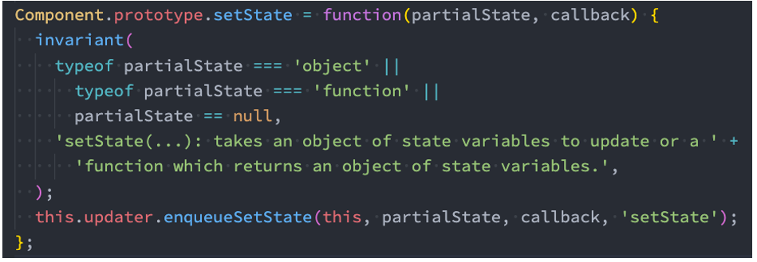

## setState 异步更新

setState 的更新是异步的？

```javascript
changeText() {
    this.setState({ message: "你好啊, 李银河" })
	console.log("------:", this.state.message)
}
```

最终打印结果是 Hello World；

可见 setState 是异步的操作，我们并不能在执行完 setState 之后立马拿到最新的 state 的结果

```javascript
const root = ReactDOM.createRoot(document.getElementById("root"));
root.render(<App name="why" />);
```

```javascript
import React, { Component } from "react";

export class App extends Component {
  constructor(props) {
    super(props);

    this.state = {
      message: "Hello World",
      counter: 0,
    };
  }

  changeText() {
    // 1.setState更多用法
    // 1.基本使用,setState内部做的事情是使用Object.assign覆盖掉原先的state的属性
    // this.setState({
    //   message: "你好啊, 李银河"
    // })

    // 2.setState可以传入一个回调函数
    // 好处一: 可以在回调函数中编写新的state的逻辑
    // 好处二: 当前的回调函数会将之前的state和props传递进来
    // this.setState((state, props) => {
    //   // 1.编写一些对新的state处理逻辑
    //   // 2.可以获取之前的state和props值
    //   console.log(this.state.message, this.props)

    //   return {
    //     message: "你好啊, 李银河"
    //   }
    // })

    // 3.setState在React的事件处理中是一个异步调用
    // 如果希望在数据更新之后(数据合并), 获取到对应的结果执行一些逻辑代码
    // 那么可以在setState中传入第二个参数: callback
    this.setState({ message: "你好啊, 李银河" }, () => {
      console.log("++++++:", this.state.message);
    });
    console.log("------:", this.state.message);
  }

  increment() {}

  render() {
    const { message, counter } = this.state;

    return (
      <div>
        <h2>message: {message}</h2>
        <button onClick={(e) => this.changeText()}>修改文本</button>
        <h2>当前计数: {counter}</h2>
        <button onClick={(e) => this.increment()}>counter+1</button>
      </div>
    );
  }
}

export default App;
```

为什么 setState 设计为异步呢？

setState 设计为异步其实之前在 GitHub 上也有很多的讨论；

React 核心成员（Redux 的作者）Dan Abramov 也有对应的回复，有兴趣的同学可以参考一下；

https://github.com/facebook/react/issues/11527#issuecomment-360199710；

我对其回答做一个简单的总结：

setState 设计为异步，可以显著的提升性能；

如果每次调用 setState 都进行一次更新，那么意味着 render 函数会被频繁调用，界面重新渲染，这样效率是很低的；

最好的办法应该是获取到多个更新，之后进行批量更新；

如果同步更新了 state，但是还没有执行 render 函数，那么 state 和 props 不能保持同步；

state 和 props 不能保持一致性，会在开发中产生很多的问题；

```javascript
import React, { Component } from "react";

function Hello(props) {
  return <h2>{props.message}</h2>;
}

export class App extends Component {
  constructor(props) {
    super(props);

    this.state = {
      message: "Hello World",
      counter: 0,
    };
  }

  componentDidMount() {
    // 1.网络请求一: banners
    // 2.网络请求二: recommends
    // 3.网络请求三: productlist
  }

  changeText() {
    this.setState({ message: "你好啊,李银河" });
    // 如果是同步的，message变成了 你好啊，李银河，但是还没来得及执行render，那么子组件获取的message还是原来的Hello World
    console.log(this.state.message);
  }

  increment() {
    console.log("------");
    // 这种写法会进行合并，执行了3次，counter还是1
    // this.setState({
    //   counter: this.state.counter + 1
    // })
    // this.setState({
    //   counter: this.state.counter + 1
    // })
    // this.setState({
    //   counter: this.state.counter + 1
    // })

    // 下面这种写法counter会变成3
    // this.setState((state) => { // 这里面的state拿到的是上一次的state
    //   return {
    //     counter: state.counter + 1
    //   }
    // })
    // this.setState((state) => {
    //   return {
    //     counter: state.counter + 1
    //   }
    // })
    // this.setState((state) => {
    //   return {
    //     counter: state.counter + 1
    //   }
    // })
  }

  render() {
    const { message, counter } = this.state;
    console.log("render被执行");

    return (
      <div>
        <h2>message: {message}</h2>
        <button onClick={(e) => this.changeText()}>修改文本</button>
        <h2>当前计数: {counter}</h2>
        <button onClick={(e) => this.increment()}>counter+1</button>

        <Hello message={message} />
      </div>
    );
  }
}

export default App;
```

## 如何获取异步的结果

那么如何可以获取到更新后的值呢？

方式一：setState 的回调

setState 接受两个参数：第二个参数是一个回调函数，这个回调函数会在更新后会执行；

格式如下：setState(partialState, callback)

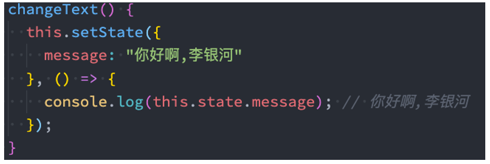

当然，我们也可以在生命周期函数：

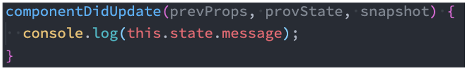

## setState 一定是异步吗？（React18 之前）

验证一：在 setTimeout 中的更新：

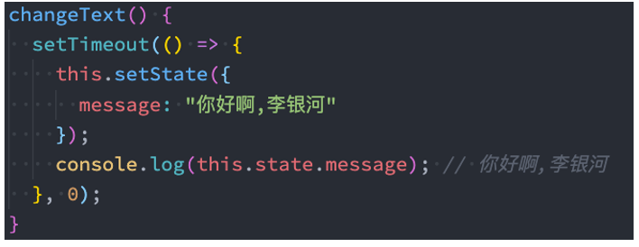

验证二：原生 DOM 事件：

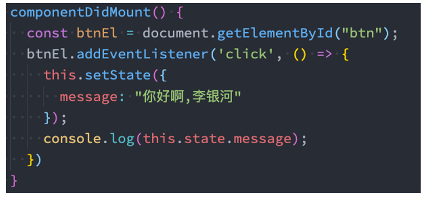

其实分成两种情况：

在组件生命周期或 React 合成事件（就是调用方法）中，setState 是异步；

在 setTimeout 或者原生 dom 事件中，setState 是同步；

## setState 默认是异步的（React18 之后）

在 React18 之后，默认所有的操作都被放到了批处理中（异步处理）。

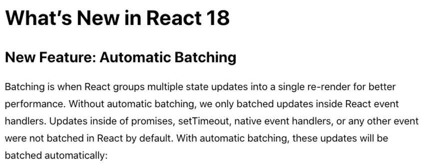

如果希望代码可以同步会拿到，则需要执行特殊的 flushSync 操作：

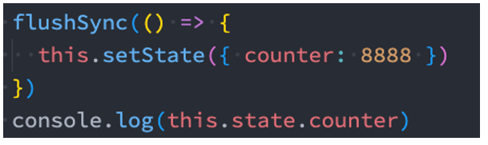

```javascript
import React, { Component } from "react";
import { flushSync } from "react-dom";

function Hello(props) {
  return <h2>{props.message}</h2>;
}

export class App extends Component {
  constructor(props) {
    super(props);

    this.state = {
      message: "Hello World",
      counter: 0,
    };
  }

  componentDidMount() {
    // 1.网络请求一: banners
    // 2.网络请求二: recommends
    // 3.网络请求三: productlist
  }

  changeText() {
    setTimeout(() => {
      // 在react18之前, setTimeout中setState操作, 是同步操作
      // 在react18之后, setTimeout中setState异步操作(批处理)
      flushSync(() => {
        this.setState({ message: "你好啊, 李银河" });
      });
      // react18之后，如果更新了state之后想立马获取到值，可以使用flushSync
      console.log(this.state.message);
    }, 0);
  }

  increment() {}

  render() {
    const { message, counter } = this.state;
    console.log("render被执行");

    return (
      <div>
        <h2>message: {message}</h2>
        <button onClick={(e) => this.changeText()}>修改文本</button>
        <h2>当前计数: {counter}</h2>
        <button onClick={(e) => this.increment()}>counter+1</button>

        <Hello message={message} />
      </div>
    );
  }
}

export default App;
```
