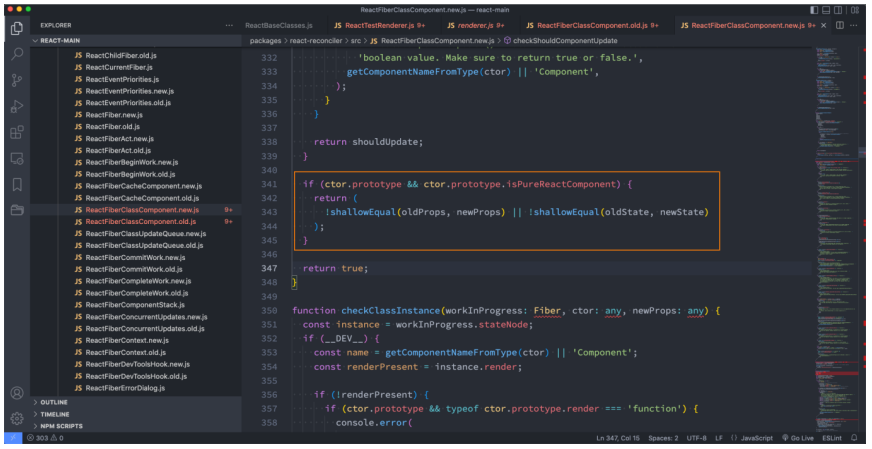
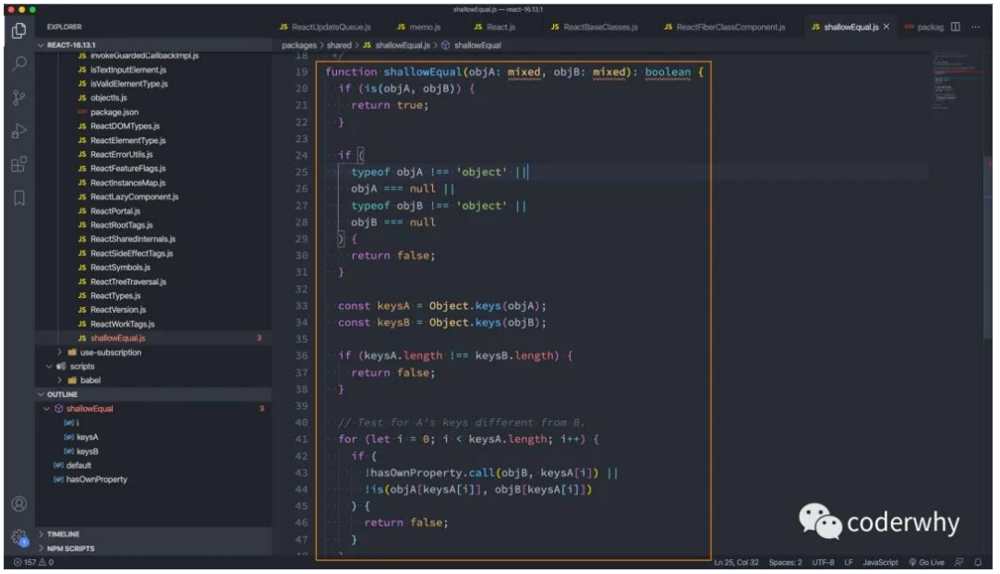

## React 更新机制

**我们在前面已经学习 React 的渲染流程：**


**那么 React 的更新流程呢？**


## **React 的更新流程**

**React 在 props 或 state 发生改变时，会调用 React 的 render 方法，会创建一颗不同的树。**

**React 需要基于这两颗不同的树之间的差别来判断如何有效的更新 UI：**

如果一棵树参考另外一棵树进行完全比较更新，那么即使是最先进的算法，该算法的复杂程度为 O(n^2)，其中 n 是树中元素的数量；

https://grfia.dlsi.ua.es/ml/algorithms/references/editsurvey_bille.pdf；

如果在 React 中使用了该算法，那么展示 1000 个元素所需要执行的计算量将在十亿的量级范围；

这个开销太过昂贵了，React 的更新性能会变得非常低效；

**于是，React 对这个算法进行了优化，将其优化成了 O(n)，如何优化的呢？**

同层节点之间相互比较，不会垮节点比较；

不同类型的节点，产生不同的树结构；

开发中，可以通过 key 来指定哪些节点在不同的渲染下保持稳定；

## **keys 的优化**

我们在前面遍历列表时，总是会提示一个警告，让我们加入一个 key 属性：


方式一：在最后位置插入数据

这种情况，有无 key 意义并不大

方式二：在前面插入数据

这种做法，在没有 key 的情况下，所有的 li 都需要进行修改；

当子元素(这里的 li)拥有 key 时，React 使用 key 来匹配原有树上的子元素以及最新树上的子元素：

在下面这种场景下，key 为 111 和 222 的元素仅仅进行位移，不需要进行任何的修改；

将 key 为 333 的元素插入到最前面的位置即可；

key 的注意事项：

key 应该是唯一的；

key 不要使用随机数（随机数在下一次 render 时，会重新生成一个数字）；

使用 index 作为 key，对性能是没有优化的；

## **render 函数被调用**

**我们使用之前的一个嵌套案例：**

在 App 中，我们增加了一个计数器的代码；

当点击+1 时，会重新调用 App 的 render 函数；

而当 App 的 render 函数被调用时，所有的子组件的 render 函数都会被重新调用；

**那么，我们可以思考一下，在以后的开发中，我们只要是修改了 App 中的数据，所有的组件都需要重新 render，进行 diff 算法，性能必然是很低的：**

事实上，很多的组件没有必须要重新 render；

它们调用 render 应该有一个前提，就是依赖的数据（state、props）发生改变时，再调用自己的 render 方法；

**如何来控制 render 方法是否被调用呢？**

通过 shouldComponentUpdate 方法即可；

## **shouldComponentUpdate**

**React 给我们提供了一个生命周期方法 shouldComponentUpdate（很多时候，我们简称为 SCU），这个方法接受参数，并且需要有**

**返回值：**

**该方法有两个参数：**

参数一：nextProps 修改之后，最新的 props 属性

参数一：nextProps 修改之后，最新的 props 属性

**该方法返回值是一个 boolean 类型：**

返回值为 true，那么就需要调用 render 方法；

返回值为 false，那么就不需要调用 render 方法；

默认返回的是 true，也就是只要 state 发生改变，就会调用 render 方法；

**比如我们在 App 中增加一个 message 属性：**

jsx 中并没有依赖这个 message，那么它的改变不应该引起重新渲染；

但是因为 render 监听到 state 的改变，就会重新 render，所以最后 render 方法还是被重新调用了；

App.jsx

```javascript
import React, { Component } from "react";
import Home from "./Home";
import Recommend from "./Recommend";
import Profile from "./Profile";

export class App extends Component {
  constructor() {
    super();

    this.state = {
      message: "Hello World",
      counter: 0,
    };
  }

  shouldComponentUpdate(nextProps, newState) {
    // App进行性能优化的点
    if (
      this.state.message !== newState.message ||
      this.state.counter !== newState.counter
    ) {
      return true;
    }
    return false;
  }

  changeText() {
    this.setState({ message: "你好啊,李银河!" });
    // this.setState({ message: "Hello World" })
  }

  increment() {
    this.setState({ counter: this.state.counter + 1 });
  }

  render() {
    console.log("App render");
    const { message, counter } = this.state;

    return (
      <div>
        <h2>
          App-{message}-{counter}
        </h2>
        <button onClick={(e) => this.changeText()}>修改文本</button>
        <button onClick={(e) => this.increment()}>counter+1</button>
        <Home message={message} />
        <Recommend counter={counter} />
      </div>
    );
  }
}

export default App;
```

Home.jsx

```javascript
import React, { Component } from "react";

export class Home extends Component {
  constructor(props) {
    super(props);

    this.state = {
      friends: [],
    };
  }

  shouldComponentUpdate(newProps, nextState) {
    // 自己对比state是否发生改变: this.state和nextState
    if (this.props.message !== newProps.message) {
      return true;
    }
    return false;
  }

  render() {
    console.log("Home render");
    return (
      <div>
        <h2>Home Page: {this.props.message}</h2>
      </div>
    );
  }
}

export default Home;
```

Recommend.jsx

```javascript
import React, { Component } from "react";

export class Recommend extends Component {
  shouldComponentUpdate(nextProps) {
    if (this.props.counter !== nextProps.counter) {
      return true;
    }
    return false;
  }

  render() {
    console.log("Recommend render");
    return (
      <div>
        <h2>Recommend Page: {this.props.counter}</h2>
      </div>
    );
  }
}

export default Recommend;
```

App 的 shouldComponentUpdate 判断只有当 message 或 counter 发生改变时才会重写渲染 App 组件，在 App 组件中将 message 传给了 Home 组件，将 counter 传给了 Recommend 组件，点击修改文本，改变 message，就会更新 Home 组件，Recommend 组件不会重新渲染；点击 counter+1 按钮，counter 发生改变，Recommend 组件会重新渲染，而 Home 组件不会。

## **PureComponent**

**如果所有的类，我们都需要手动来实现 shouldComponentUpdate，那么会给我们开发者增加非常多的工作量。**

我们来设想一下 shouldComponentUpdate 中的各种判断的目的是什么？

props 或者 state 中的数据是否发生了改变，来决定 shouldComponentUpdate 返回 true 或者 false；

**事实上 React 已经考虑到了这一点，所以 React 已经默认帮我们实现好了，如何实现呢？**

将 class 继承自 PureComponent。



## **shallowEqual 方法**

**在 checkShouldComponentUpdate 方法中，调用 !shallowEqual(oldProps, newProps) || !shallowEqual(oldState, newState)，这个 shallowEqual 就是进行浅层比较：**

如果前后的 props 或 state 一样，那么返回 true，取反变成 false，就不会重新渲染。

如果前后的 props 或 state 不是对象或者为 null，那么返回 false，取反变成 true，会重新渲染。

获取前后 props 或 state 的所有 key，进行遍历；如果长度不一样，说明发生了改变，返回 false，取反变成 true，会重新渲染。

遍历旧的 props 或 state，如果新的 props 或 state 没有旧的 props 或 state 的属性，或者旧的 props 或 state 和新的 props 或 state 不是同一个对象，那么返回 false，取反变成 true，会重新渲染。



## **高阶组件 memo**

**目前我们是针对类组件可以使用 PureComponent，那么函数式组件呢？**

事实上函数式组件我们在 props 没有改变时，也是不希望其重新渲染其 DOM 树结构的

**我们需要使用一个高阶组件 memo：**

当 counter 发生改变时，Profile 组件不会重新渲染。

App.jsx

```javascript
import React, { PureComponent } from "react";
import Home from "./Home";
import Recommend from "./Recommend";
import Profile from "./Profile";

export class App extends PureComponent {
  constructor() {
    super();

    this.state = {
      message: "Hello World",
      counter: 0,
    };
  }

  // shouldComponentUpdate(nextProps, newState) {
  //   // App进行性能优化的点
  //   if (this.state.message !== newState.message || this.state.counter !== newState.counter) {
  //     return true
  //   }
  //   return false
  // }

  changeText() {
    this.setState({ message: "你好啊,李银河!" });
    // this.setState({ message: "Hello World" })
  }

  increment() {
    this.setState({ counter: this.state.counter + 1 });
  }

  render() {
    console.log("App render");
    const { message, counter } = this.state;

    return (
      <div>
        <h2>
          App-{message}-{counter}
        </h2>
        <button onClick={(e) => this.changeText()}>修改文本</button>
        <button onClick={(e) => this.increment()}>counter+1</button>
        <Home message={message} />
        <Recommend counter={counter} />
        <Profile message={message} />
      </div>
    );
  }
}

export default App;
```

Home.jsx

```javascript
import React, { PureComponent } from "react";

export class Home extends PureComponent {
  constructor(props) {
    super(props);

    this.state = {
      friends: [],
    };
  }

  // shouldComponentUpdate(newProps, nextState) {
  //   // 自己对比state是否发生改变: this.state和nextState
  //   if (this.props.message !== newProps.message) {
  //     return true
  //   }
  //   return false
  // }

  render() {
    console.log("Home render");
    return (
      <div>
        <h2>Home Page: {this.props.message}</h2>
      </div>
    );
  }
}

export default Home;
```

Recommend.jsx

```javascript
import React, { PureComponent } from "react";

export class Recommend extends PureComponent {
  // shouldComponentUpdate(nextProps) {
  //   if (this.props.counter !== nextProps.counter) {
  //     return true
  //   }
  //   return false
  // }

  render() {
    console.log("Recommend render");
    return (
      <div>
        <h2>Recommend Page: {this.props.counter}</h2>
      </div>
    );
  }
}

export default Recommend;
```

Profile.jsx

```javascript
import { memo } from "react";

const Profile = memo(function (props) {
  console.log("profile render");
  return <h2>Profile: {props.message}</h2>;
});

export default Profile;
```

## **不可变数据的力量**

```javascript
import React, { PureComponent } from "react";

export class App extends PureComponent {
  constructor() {
    super();

    this.state = {
      books: [
        { name: "你不知道JS", price: 99, count: 1 },
        { name: "JS高级程序设计", price: 88, count: 1 },
        { name: "React高级设计", price: 78, count: 2 },
        { name: "Vue高级设计", price: 95, count: 3 },
      ],
      friend: {
        name: "kobe",
      },
      message: "Hello World",
    };
  }

  // shouldComponentUpdate(nextProps, nextState) {
  //   shallowEqual(nextProps, this.props)
  //   shallowEqual(nextState, this.state)
  // }

  addNewBook() {
    const newBook = { name: "Angular高级设计", price: 88, count: 1 };

    // 1.直接修改原有的state, 重新设置一遍
    // 在PureComponent是不能引起重新渲染(re-render)
    this.state.books.push(newBook);
    this.setState({ books: this.state.books });

    // 2.复制一份books, 在新的books中修改, 设置新的books
    const books = [...this.state.books];
    books.push(newBook);

    this.setState({ books: books });
  }

  addBookCount(index) {
    // this.state.books[index].count++ // 这种写法不会触发render
    const books = [...this.state.books];
    books[index].count++;
    this.setState({ books: books });
  }

  render() {
    const { books } = this.state;

    return (
      <div>
        <h2>数据列表</h2>
        <ul>
          {books.map((item, index) => {
            return (
              <li key={index}>
                <span>
                  name:{item.name}-price:{item.price}-count:{item.count}
                </span>
                <button onClick={(e) => this.addBookCount(index)}>+1</button>
              </li>
            );
          })}
        </ul>
        <button onClick={(e) => this.addNewBook()}>添加新书籍</button>
      </div>
    );
  }
}

export default App;
```

## **如何使用 ref**

**在 React 的开发模式中，通常情况下不需要、也不建议直接操作 DOM 元素，但是某些特殊的情况，确实需要获取到 DOM 进行某些操作：**

管理焦点，文本选择或媒体播放；

触发强制动画；

集成第三方 DOM 库；

我们可以通过 refs 获取 DOM；

**如何创建 refs 来获取对应的 DOM 呢？目前有三种方式：**

方式一：传入字符串

使用时通过 this.refs.传入的字符串格式获取对应的元素；

方式二：传入一个对象（推荐）

对象是通过 React.createRef() 方式创建出来的；

使用时获取到创建的对象其中有一个 current 属性就是对应的元素；

方式三：传入一个函数

该函数会在 DOM 被挂载时进行回调，这个函数会传入一个 元素对象，我们可以自己保存；

使用时，直接拿到之前保存的元素对象即可；

```javascript
import React, { PureComponent, createRef } from "react";

export class App extends PureComponent {
  constructor() {
    super();

    this.state = {};

    this.titleRef = createRef();
    this.titleEl = null;
  }

  getNativeDOM() {
    // 1.方式一: 在React元素上绑定一个ref字符串
    // console.log(this.refs.why)

    // 2.方式二: 提前创建好ref对象, createRef(), 将创建出来的对象绑定到元素
    // console.log(this.titleRef.current)

    // 3.方式三: 传入一个回调函数, 在对应的元素被渲染之后, 回调函数被执行, 并且将元素传入
    console.log(this.titleEl);
  }

  render() {
    return (
      <div>
        <h2 ref="why">Hello World</h2>
        <h2 ref={this.titleRef}>你好啊,李银河</h2>
        <h2 ref={(el) => (this.titleEl = el)}>你好啊, 师姐</h2>
        <button onClick={(e) => this.getNativeDOM()}>获取DOM</button>
      </div>
    );
  }
}

export default App;
```

## **ref 的类型**

**ref 的值根据节点的类型而有所不同：**

当 ref 属性用于 HTML 元素时，构造函数中使用 React.createRef() 创建的 ref 接收底层 DOM 元素作为其 current 属性；

当 ref 属性用于自定义 class 组件时，ref 对象接收组件的挂载实例作为其 current 属性；

**你不能在函数组件上使用 ref 属性**，因为他们没有实例；

**函数式组件是没有实例的，所以无法通过 ref 获取他们的实例：**

但是某些时候，我们可能想要获取函数式组件中的某个 DOM 元素；

这个时候我们可以通过 React.forwardRef ，后面我们也会学习 hooks 中如何使用 ref；

**ref 获取类组件的实例**

```javascript
import React, { PureComponent, createRef } from "react";

class HelloWorld extends PureComponent {
  test() {
    console.log("test------");
  }

  render() {
    return <h1>Hello World</h1>;
  }
}

export class App extends PureComponent {
  constructor() {
    super();

    this.hwRef = createRef();
  }

  getComponent() {
    console.log(this.hwRef.current);
    this.hwRef.current.test();
  }

  render() {
    return (
      <div>
        <HelloWorld ref={this.hwRef} />
        <button onClick={(e) => this.getComponent()}>获取组件实例</button>
      </div>
    );
  }
}

export default App;
```

## **ref 的转发**

**在前面我们学习 ref 时讲过，ref 不能应用于函数式组件：**

因为函数式组件没有实例，所以不能获取到对应的组件对象

**但是，在开发中我们可能想要获取函数式组件中某个元素的 DOM，这个时候我们应该如何操作呢？**

方式一：直接传入 ref 属性（错误的做法）

方式二：通过 forwardRef 高阶函数；

```javascript
import React, { PureComponent, createRef, forwardRef } from "react";

const HelloWorld = forwardRef(function (props, ref) {
  return (
    <div>
      <h1 ref={ref}>Hello World</h1>
      <p>哈哈哈</p>
    </div>
  );
});

export class App extends PureComponent {
  constructor() {
    super();

    this.hwRef = createRef();
  }

  getComponent() {
    console.log(this.hwRef.current); // <h1>Hello World</h1>
  }

  render() {
    return (
      <div>
        <HelloWorld ref={this.hwRef} />
        <button onClick={(e) => this.getComponent()}>获取组件实例</button>
      </div>
    );
  }
}

export default App;
```

## **认识受控组件**

**在 React 中，HTML 表单的处理方式和普通的 DOM 元素不太一样：表单元素通常会保存在一些内部的 state。**

**比如下面的 HTML 表单元素：**

这个处理方式是 DOM 默认处理 HTML 表单的行为，在用户点击提交时会提交到某个服务器中，并且刷新页面；

在 React 中，并没有禁止这个行为，它依然是有效的；

但是通常情况下会使用 JavaScript 函数来方便的处理表单提交，同时还可以访问用户填写的表单数据；

实现这种效果的标准方式是使用“受控组件”；

```javascript
import React, { PureComponent } from "react";

export class App extends PureComponent {
  constructor() {
    super();

    this.state = {
      username: "coderwhy",
    };
  }

  inputChange(event) {
    console.log("inputChange:", event.target.value);
    this.setState({ username: event.target.value });
  }

  render() {
    const { username } = this.state;

    return (
      <div>
        {/* 受控组件 */}
        <input
          type="checkbox"
          value={username}
          onChange={(e) => this.inputChange(e)}
        />

        {/* 非受控组件 */}
        <input type="text" />
        <h2>username: {username}</h2>
      </div>
    );
  }
}

export default App;
```

## **受控组件基本演练**

**在 HTML 中，表单元素（如`<input>`、 `<textarea>` 和 `<select>`）之类的表单元素通常自己维护 state，并根据用户输入进**

**行更新。**

**而在 React 中，可变状态（mutable state）通常保存在组件的 state 属性中，并且只能通过使用 setState()来更新。**

我们将两者结合起来，使 React 的 state 成为“唯一数据源”；

渲染表单的 React 组件还控制着用户输入过程中表单发生的操作；

被 React 以这种方式控制取值的表单输入元素就叫做“受控组件”；

**由于在表单元素上设置了 value 属性，因此显示的值将始终为 this.state.value，这使得 React 的 state 成为唯一数据源。**

**由于 handleUsernameChange 在每次按键时都会执行并更新 React 的 state，因此显示的值将随着用户输入而更新。**


自己提交 form 表单

```javascript
import React, { PureComponent } from "react";

export class App extends PureComponent {
  constructor() {
    super();

    this.state = {
      username: "",
    };
  }

  handleSubmitClick(event) {
    // 1.阻止默认的行为，就不会刷新浏览器
    event.preventDefault();

    // 2.获取到所有的表单数据, 对数据进行组织
    console.log("获取所有的输入内容");
    console.log(this.state.username);

    // 3.以网络请求的方式, 将数据传递给服务器(ajax/fetch/axios)
  }

  handleUsernameChange(event) {
    this.setState({ username: event.target.value });
  }

  render() {
    const { username } = this.state;

    return (
      <div>
        <form onSubmit={(e) => this.handleSubmitClick(e)}>
          {/* 1.用户名和密码，这里是htmlFor，for是个关键字，防止冲突，使用htmlFor，和className一样 */}
          <label htmlFor="username">
            用户:
            <input
              id="username"
              type="text"
              name="username"
              value={username}
              onChange={(e) => this.handleUsernameChange(e)}
            />
          </label>

          <button type="submit">注册</button>
        </form>
      </div>
    );
  }
}

export default App;
```

## 多个表单同一个函数

我们上面的表单中只有用户名，我们可以加入一个密码输入框

```javascript
import React, { PureComponent } from "react";

export class App extends PureComponent {
  constructor() {
    super();

    this.state = {
      username: "",
      password: "",
    };
  }

  handleSubmitClick(event) {
    // 1.阻止默认的行为
    event.preventDefault();

    // 2.获取到所有的表单数据, 对数据进行组件
    console.log("获取所有的输入内容");
    console.log(this.state.username, this.state.password);

    // 3.以网络请求的方式, 将数据传递给服务器(ajax/fetch/axios)
  }

  handleUsernameChange(event) {
    this.setState({ username: event.target.value });
  }

  handlePasswordChange(event) {
    this.setState({ password: event.target.value });
  }

  render() {
    const { username, password } = this.state;

    return (
      <div>
        <form onSubmit={(e) => this.handleSubmitClick(e)}>
          {/* 1.用户名和密码 */}
          <label htmlFor="username">
            用户:
            <input
              id="username"
              type="text"
              name="username"
              value={username}
              onChange={(e) => this.handleUsernameChange(e)}
            />
          </label>
          <label htmlFor="password">
            密码:
            <input
              id="password"
              type="password"
              name="password"
              value={password}
              onChange={(e) => this.handlePasswordChange(e)}
            />
          </label>

          <button type="submit">注册</button>
        </form>
      </div>
    );
  }
}

export default App;
```

但是，我们会发现 handleUsernameChange 和 handlePasswordChange 里面的处理逻辑有点相似，我们可以进一步进行优化。

```javascript
import React, { PureComponent } from "react";

export class App extends PureComponent {
  constructor() {
    super();

    this.state = {
      username: "",
      password: "",
    };
  }

  handleSubmitClick(event) {
    // 1.阻止默认的行为
    event.preventDefault();

    // 2.获取到所有的表单数据, 对数据进行组件
    console.log("获取所有的输入内容");
    console.log(this.state.username, this.state.password);

    // 3.以网络请求的方式, 将数据传递给服务器(ajax/fetch/axios)
  }

  // handleUsernameChange(event) {
  //   this.setState({ username: event.target.value })
  // }

  // handlePasswordChange(event) {
  //   this.setState({ password: event.target.value })
  // }

  // 使用计算属性名，前提是要给input绑定name
  handleInputChange(event) {
    this.setState({
      [event.target.name]: event.target.value,
    });
  }

  render() {
    const { username, password } = this.state;

    return (
      <div>
        <form onSubmit={(e) => this.handleSubmitClick(e)}>
          {/* 1.用户名和密码 */}
          <label htmlFor="username">
            用户:
            <input
              id="username"
              type="text"
              name="username"
              value={username}
              onChange={(e) => this.handleInputChange(e)}
            />
          </label>
          <label htmlFor="password">
            密码:
            <input
              id="password"
              type="password"
              name="password"
              value={password}
              onChange={(e) => this.handleInputChange(e)}
            />
          </label>

          <button type="submit">注册</button>
        </form>
      </div>
    );
  }
}

export default App;
```

## **受控组件的其他演练**

**textarea 标签**

texteare 标签和 input 比较相似：

**select 标签**

select 标签的使用也非常简单，只是它不需要通过 selected 属性来控制哪一个被选中，它可以匹配 state 的 value 来选中。

**处理多个输入**

多处理方式可以像单处理方式那样进行操作，但是需要多个监听方法：

这里我们可以使用 ES6 的一个语法：计算属性名（Computed property names）

checkbox 的单选和多选

```javascript
import React, { PureComponent } from "react";

export class App extends PureComponent {
  constructor() {
    super();

    this.state = {
      username: "",
      password: "",
      isAgree: false,
      hobbies: [
        { value: "sing", text: "唱", isChecked: false },
        { value: "dance", text: "跳", isChecked: false },
        { value: "rap", text: "rap", isChecked: false },
      ],
    };
  }

  handleSubmitClick(event) {
    // 1.阻止默认的行为
    event.preventDefault();

    // 2.获取到所有的表单数据, 对数据进行组件
    console.log("获取所有的输入内容");
    console.log(this.state.username, this.state.password);
    const hobbies = this.state.hobbies
      .filter((item) => item.isChecked)
      .map((item) => item.value);
    console.log("获取爱好: ", hobbies);

    // 3.以网络请求的方式, 将数据传递给服务器(ajax/fetch/axios)
  }

  handleInputChange(event) {
    this.setState({
      [event.target.name]: event.target.value,
    });
  }

  handleAgreeChange(event) {
    this.setState({ isAgree: event.target.checked });
  }

  handleHobbiesChange(event, index) {
    const hobbies = [...this.state.hobbies];
    hobbies[index].isChecked = event.target.checked;
    this.setState({ hobbies });
  }

  render() {
    const { username, password, isAgree, hobbies, fruit } = this.state;

    return (
      <div>
        <form onSubmit={(e) => this.handleSubmitClick(e)}>
          {/* 1.用户名和密码 */}
          <div>
            <label htmlFor="username">
              用户:
              <input
                id="username"
                type="text"
                name="username"
                value={username}
                onChange={(e) => this.handleInputChange(e)}
              />
            </label>
            <label htmlFor="password">
              密码:
              <input
                id="password"
                type="password"
                name="password"
                value={password}
                onChange={(e) => this.handleInputChange(e)}
              />
            </label>
          </div>

          {/* 2.checkbox单选 */}
          <label htmlFor="agree">
            <input
              id="agree"
              type="checkbox"
              checked={isAgree}
              onChange={(e) => this.handleAgreeChange(e)}
            />
            同意协议
          </label>

          {/* 3.checkbox多选 */}
          <div>
            您的爱好:
            {hobbies.map((item, index) => {
              return (
                <label htmlFor={item.value} key={item.value}>
                  <input
                    type="checkbox"
                    id={item.value}
                    checked={item.isChecked}
                    onChange={(e) => this.handleHobbiesChange(e, index)}
                  />
                  <span>{item.text}</span>
                </label>
              );
            })}
          </div>

          <div>
            <button type="submit">注册</button>
          </div>
        </form>
      </div>
    );
  }
}

export default App;
```

select 的单选和多选

```javascript
import React, { PureComponent } from "react";

export class App extends PureComponent {
  constructor() {
    super();

    this.state = {
      username: "",
      password: "",
      isAgree: false,
      hobbies: [
        { value: "sing", text: "唱", isChecked: false },
        { value: "dance", text: "跳", isChecked: false },
        { value: "rap", text: "rap", isChecked: false },
      ],
      fruit: "orange",
      fruit2: ["orange"],
    };
  }

  handleSubmitClick(event) {
    // 1.阻止默认的行为
    event.preventDefault();

    // 2.获取到所有的表单数据, 对数据进行组件
    console.log("获取所有的输入内容");
    console.log(this.state.username, this.state.password);
    const hobbies = this.state.hobbies
      .filter((item) => item.isChecked)
      .map((item) => item.value);
    console.log("获取爱好: ", hobbies);

    // 3.以网络请求的方式, 将数据传递给服务器(ajax/fetch/axios)
  }

  handleInputChange(event) {
    this.setState({
      [event.target.name]: event.target.value,
    });
  }

  handleAgreeChange(event) {
    this.setState({ isAgree: event.target.checked });
  }

  handleHobbiesChange(event, index) {
    const hobbies = [...this.state.hobbies];
    hobbies[index].isChecked = event.target.checked;
    this.setState({ hobbies });
  }

  handleFruitChange(event) {
    this.setState({ fruit: event.target.value });
  }

  handleFruitChange2(event) {
    const options = Array.from(event.target.selectedOptions);
    const values = options.map((item) => item.value);
    this.setState({ fruit2: values });

    // 额外补充: Array.from(可迭代对象)
    // Array.from(arguments) Array.from支持传入第2个参数，就是map高级函数，了解即可
    const values2 = Array.from(
      event.target.selectedOptions,
      (item) => item.value
    );
    console.log(values2);
  }

  render() {
    const { username, password, isAgree, hobbies, fruit } = this.state;

    return (
      <div>
        <form onSubmit={(e) => this.handleSubmitClick(e)}>
          {/* 1.用户名和密码 */}
          <div>
            <label htmlFor="username">
              用户:
              <input
                id="username"
                type="text"
                name="username"
                value={username}
                onChange={(e) => this.handleInputChange(e)}
              />
            </label>
            <label htmlFor="password">
              密码:
              <input
                id="password"
                type="password"
                name="password"
                value={password}
                onChange={(e) => this.handleInputChange(e)}
              />
            </label>
          </div>

          {/* 2.checkbox单选 */}
          <label htmlFor="agree">
            <input
              id="agree"
              type="checkbox"
              checked={isAgree}
              onChange={(e) => this.handleAgreeChange(e)}
            />
            同意协议
          </label>

          {/* 3.checkbox多选 */}
          <div>
            您的爱好:
            {hobbies.map((item, index) => {
              return (
                <label htmlFor={item.value} key={item.value}>
                  <input
                    type="checkbox"
                    id={item.value}
                    checked={item.isChecked}
                    onChange={(e) => this.handleHobbiesChange(e, index)}
                  />
                  <span>{item.text}</span>
                </label>
              );
            })}
          </div>

          {/* 4.select单选 */}
          <select
            value={fruit}
            onChange={(e) => this.handleFruitChange(e)}
            multiple
          >
            <option value="apple">苹果</option>
            <option value="orange">橘子</option>
            <option value="banana">香蕉</option>
          </select>

          {/* 4.select多选 */}
          <select
            value={fruit2}
            onChange={(e) => this.handleFruitChange2(e)}
            multiple
          >
            <option value="apple">苹果</option>
            <option value="orange">橘子</option>
            <option value="banana">香蕉</option>
          </select>

          <div>
            <button type="submit">注册</button>
          </div>
        </form>
      </div>
    );
  }
}

export default App;
```

## **非受控组件**

**React 推荐大多数情况下使用 受控组件 来处理表单数据：**

一个受控组件中，表单数据是由 React 组件来管理的；

另一种替代方案是使用非受控组件，这时表单数据将交由 DOM 节点来处理；

**如果要使用非受控组件中的数据，那么我们需要使用 ref 来从 DOM 节点中获取表单数据。**

我们来进行一个简单的演练：

使用 ref 来获取 input 元素；

**在非受控组件中通常使用 defaultValue 来设置默认值；**

**同样，`<input type="checkbox">` 和 `<input type="radio">` 支持 defaultChecked，`<select> `和 `<textarea>` 支**

**持 defaultValue。**

```javascript
import React, { createRef, PureComponent } from "react";

export class App extends PureComponent {
  constructor() {
    super();

    this.state = {
      username: "",
      password: "",
      isAgree: false,
      hobbies: [
        { value: "sing", text: "唱", isChecked: false },
        { value: "dance", text: "跳", isChecked: false },
        { value: "rap", text: "rap", isChecked: false },
      ],
      fruit: ["orange"],
      intro: "哈哈哈",
    };

    this.introRef = createRef();
  }

  componentDidMount() {
    // 非受控组件就是在操作DOM，开发中建议都使用受控组件
    // this.introRef.current.addEventListener
  }

  handleSubmitClick(event) {
    // 1.阻止默认的行为
    event.preventDefault();

    // 2.获取到所有的表单数据, 对数据进行组件
    console.log("获取所有的输入内容");
    console.log(this.state.username, this.state.password);
    const hobbies = this.state.hobbies
      .filter((item) => item.isChecked)
      .map((item) => item.value);
    console.log("获取爱好: ", hobbies);
    console.log("获取结果:", this.introRef.current.value);

    // 3.以网络请求的方式, 将数据传递给服务器(ajax/fetch/axios)
  }

  handleInputChange(event) {
    this.setState({
      [event.target.name]: event.target.value,
    });
  }

  handleAgreeChange(event) {
    this.setState({ isAgree: event.target.checked });
  }

  handleHobbiesChange(event, index) {
    const hobbies = [...this.state.hobbies];
    hobbies[index].isChecked = event.target.checked;
    this.setState({ hobbies });
  }

  handleFruitChange(event) {
    const options = Array.from(event.target.selectedOptions);
    const values = options.map((item) => item.value);
    this.setState({ fruit: values });

    // 额外补充: Array.from(可迭代对象)
    // Array.from(arguments)
    const values2 = Array.from(
      event.target.selectedOptions,
      (item) => item.value
    );
    console.log(values2);
  }

  render() {
    const { username, password, isAgree, hobbies, fruit, intro } = this.state;

    return (
      <div>
        <form onSubmit={(e) => this.handleSubmitClick(e)}>
          {/* 1.用户名和密码 */}
          <div>
            <label htmlFor="username">
              用户:
              <input
                id="username"
                type="text"
                name="username"
                value={username}
                onChange={(e) => this.handleInputChange(e)}
              />
            </label>
            <label htmlFor="password">
              密码:
              <input
                id="password"
                type="password"
                name="password"
                value={password}
                onChange={(e) => this.handleInputChange(e)}
              />
            </label>
          </div>

          {/* 2.checkbox单选 */}
          <label htmlFor="agree">
            <input
              id="agree"
              type="checkbox"
              checked={isAgree}
              onChange={(e) => this.handleAgreeChange(e)}
            />
            同意协议
          </label>

          {/* 3.checkbox多选 */}
          <div>
            您的爱好:
            {hobbies.map((item, index) => {
              return (
                <label htmlFor={item.value} key={item.value}>
                  <input
                    type="checkbox"
                    id={item.value}
                    checked={item.isChecked}
                    onChange={(e) => this.handleHobbiesChange(e, index)}
                  />
                  <span>{item.text}</span>
                </label>
              );
            })}
          </div>

          {/* 4.select */}
          <select
            value={fruit}
            onChange={(e) => this.handleFruitChange(e)}
            multiple
          >
            <option value="apple">苹果</option>
            <option value="orange">橘子</option>
            <option value="banana">香蕉</option>
          </select>

          {/* 5.非受控组件 */}
          <input type="text" defaultValue={intro} ref={this.introRef} />

          <div>
            <button type="submit">注册</button>
          </div>
        </form>
      </div>
    );
  }
}

export default App;
```

## **认识高阶函数**

**什么是高阶组件呢？**

相信很多同学都知道（听说过？），也用过 高阶函数

它们非常相似，所以我们可以先来回顾一下什么是 高阶函数。

**高阶函数的维基百科定义：至少满足以下条件之一：**

接受一个或多个函数作为输入；

输出一个函数；

**JavaScript 中比较常见的 filter、map、reduce 都是高阶函数。**

**那么什么是高阶组件呢？**

高阶组件的英文是 **Higher-Order Components**，简称为 HOC；

官方的定义：**高阶组件是参数为组件，返回值为新组件的函数**；

**我们可以进行如下的解析：**

首先， 高阶组件 本身不是一个组件，而是一个函数；

其次，这个函数的参数是一个组件，返回值也是一个组件；

## **高阶组件的定义**

**高阶组件的调用过程类似于这样：**


**高阶函数的编写过程类似于这样：**


**组件的名称问题：**

在 ES6 中，类表达式中类名是可以省略的；

组件的名称都可以通过 displayName 来修改；

**高阶组件并不是 React API 的一部分，它是基于 React 的组合特性而形成的设计模式；**

**高阶组件在一些 React 第三方库中非常常见：**

比如 redux 中的 connect；（后续会讲到）

比如 react-router 中的 withRouter；（后续会讲到）

```javascript
import React, { PureComponent } from "react";

// 定义一个高阶组件
function hoc(Cpn) {
  // 1.定义类组件
  class NewCpn extends PureComponent {
    render() {
      {
        /*返回的新组件都有一个name属性*/
      }
      return <Cpn name="why" />;
    }
  }
  return NewCpn;

  // 定义函数组件
  // function NewCpn2(props) {

  // }
  // return NewCpn2
}

class HelloWorld extends PureComponent {
  render() {
    return <h1>Hello World</h1>;
  }
}

const HelloWorldHOC = hoc(HelloWorld);

export class App extends PureComponent {
  render() {
    return (
      <div>
        <HelloWorldHOC />
      </div>
    );
  }
}

export default App;
```

## **应用一 – props 的增强**

**不修改原有代码的情况下，添加新的 props**

定义一个组件增强函数，参数为类组件或函数式组件，返回一个新的组件。

相当于做了拦截，给想要使用增强函数的组件加了 userInfo，但是我们自己也有可能会传入一些属性，比如 banners，那么也是需要传入到高阶组件中，用法是{...this.props}，那么返回的新组件也会有自己传入的 props。

App.jsx

```javascript
import React, { PureComponent } from "react";
import enhancedUserInfo from "./hoc/enhanced_props";
import About from "./pages/About";

const Home = enhancedUserInfo(function (props) {
  return (
    <h1>
      Home: {props.name}-{props.level}-{props.banners}
    </h1>
  );
});

const Profile = enhancedUserInfo(function (props) {
  return (
    <h1>
      Profile: {props.name}-{props.level}
    </h1>
  );
});

const HelloFriend = enhancedUserInfo(function (props) {
  return (
    <h1>
      HelloFriend: {props.name}-{props.level}
    </h1>
  );
});

export class App extends PureComponent {
  render() {
    return (
      <div>
        <Home banners={["轮播1", "轮播2"]} />
        <Profile />
        <HelloFriend />

        <About />
      </div>
    );
  }
}

export default App;
```

hoc/enhanced_props.js

```javascript
import { PureComponent } from "react";

// 定义组件: 给一些需要特殊数据的组件, 注入props
function enhancedUserInfo(OriginComponent) {
  class NewComponent extends PureComponent {
    constructor(props) {
      super(props);

      this.state = {
        userInfo: {
          name: "coderwhy",
          level: 99,
        },
      };
    }

    render() {
      return <OriginComponent {...this.props} {...this.state.userInfo} />;
    }
  }

  return NewComponent;
}

export default enhancedUserInfo;
```

pages/About.jsx

```javascript
import React, { PureComponent } from "react";
import enhancedUserInfo from "../hoc/enhanced_props";

export class About extends PureComponent {
  render() {
    return <div>About: {this.props.name}</div>;
  }
}

export default enhancedUserInfo(About);
```

**利用高阶组件来共享 Context**

App.jsx

```javascript
import React, { PureComponent } from "react";
import ThemeContext from "./context/theme_context";
import Product from "./pages/Product";

export class App extends PureComponent {
  render() {
    return (
      <div>
        <ThemeContext.Provider value={{ color: "red", size: 30 }}>
          <Product />
        </ThemeContext.Provider>
      </div>
    );
  }
}

export default App;
```

context/theme_context.js

```javascript
import { createContext } from "react";

const ThemeContext = createContext();

export default ThemeContext;
```

pages/Product.jsx

```javascript
import React, { PureComponent } from "react";
import ThemeContext from "../context/theme_context";
import withTheme from "../hoc/with_theme";

// export class Product extends PureComponent {
//   render() {
//     return (
//       <div>
//         Product:
//         <ThemeContext.Consumer>
//           {
//             value => {
//               return <h2>theme:{value.color}-{value.size}</h2>
//             }
//           }
//         </ThemeContext.Consumer>
//       </div>
//     )
//   }
// }

// export default Product

export class Product extends PureComponent {
  render() {
    const { color, size } = this.props;

    return (
      <div>
        <h2>
          Product: {color}-{size}
        </h2>
      </div>
    );
  }
}

export default withTheme(Product);
```

hoc/with_theme.js

```javascript
import ThemeContext from "../context/theme_context";

function withTheme(OriginComponment) {
  return (props) => {
    return (
      <ThemeContext.Consumer>
        {(value) => {
          return <OriginComponment {...value} {...props} />;
        }}
      </ThemeContext.Consumer>
    );
  };
}

export default withTheme;
```

## **应用二 – 渲染判断鉴权**

**在开发中，我们可能遇到这样的场景：**

某些页面是必须用户登录成功才能进行进入；

如果用户没有登录成功，那么直接跳转到登录页面；

**这个时候，我们就可以使用高阶组件来完成鉴权操作：**

App.jsx

```javascript
import React, { PureComponent } from "react";
import Cart from "./pages/Cart";

export class App extends PureComponent {
  constructor() {
    super();

    // this.state = {
    //   isLogin: false
    // }
  }

  loginClick() {
    localStorage.setItem("token", "coderwhy");

    // this.setState({ isLogin: true })
    this.forceUpdate(); // 强制刷新，开发中不推荐
  }

  render() {
    return (
      <div>
        App
        <button onClick={(e) => this.loginClick()}>登录</button>
        <Cart />
      </div>
    );
  }
}

export default App;
```

pages/Cart.jsx

```javascript
import React, { PureComponent } from "react";
import loginAuth from "../hoc/login_auth";

export class Cart extends PureComponent {
  render() {
    return <h2>Cart Page</h2>;
  }
}

export default loginAuth(Cart);
```

hoc/login_auth.js

```javascript
function loginAuth(OriginComponent) {
  return (props) => {
    // 从localStorage中获取token
    const token = localStorage.getItem("token");

    if (token) {
      return <OriginComponent {...props} />;
    } else {
      return <h2>请先登录, 再进行跳转到对应的页面中</h2>;
    }
  };
}

export default loginAuth;
```

## **应用三 – 生命周期劫持**

**我们也可以利用高阶函数来劫持生命周期，在生命周期中完成自己的逻辑：**

查看每个页面渲染花了多少时间。

App.sjx

```javascript
import React, { PureComponent } from "react";
import Detail from "./pages/Detail";

export class App extends PureComponent {
  render() {
    return (
      <div>
        <Detail />
      </div>
    );
  }
}

export default App;
```

pages/Detail.jsx

```javascript
import React, { PureComponent } from "react";
import logRenderTime from "../hoc/log_render_time";

export class Detail extends PureComponent {
  // UNSAFE_componentWillMount() {
  //   this.beginTime = new Date().getTime()
  // }

  // componentDidMount() {
  //   this.endTime = new Date().getTime()
  //   const interval = this.endTime - this.beginTime
  //   console.log(`当前页面花费了${interval}ms渲染完成!`)
  // }

  render() {
    return (
      <div>
        <h2>Detail Page</h2>
        <ul>
          <li>数据列表1</li>
          <li>数据列表2</li>
          <li>数据列表3</li>
          <li>数据列表4</li>
          <li>数据列表5</li>
          <li>数据列表6</li>
          <li>数据列表7</li>
          <li>数据列表8</li>
          <li>数据列表9</li>
          <li>数据列表10</li>
        </ul>
      </div>
    );
  }
}

export default logRenderTime(Detail);
```

hoc/log_render_time.js

```javascript
import { PureComponent } from "react";

function logRenderTime(OriginComponent) {
  return class extends PureComponent {
    // 匿名类
    UNSAFE_componentWillMount() {
      // 不推荐使用这个生命周期，这里只是为了测试
      this.beginTime = new Date().getTime();
    }

    componentDidMount() {
      this.endTime = new Date().getTime();
      const interval = this.endTime - this.beginTime;
      // OriginComponent.name可以获取传进来的组件的名字
      console.log(
        `当前${OriginComponent.name}页面花费了${interval}ms渲染完成!`
      );
    }

    render() {
      return <OriginComponent {...this.props} />;
    }
  };
}

export default logRenderTime;
```

## **高阶函数的意义**

**我们会发现利用高阶组件可以针对某些 React 代码进行更加优雅的处理。**

**其实早期的 React 有提供组件之间的一种复用方式是 mixin，目前已经不再建议使用：**

Mixin 可能会相互依赖，相互耦合，不利于代码维护；

不同的 Mixin 中的方法可能会相互冲突；

Mixin 非常多时，组件处理起来会比较麻烦，甚至还要为其做相关处理，这样会给代码造成滚雪球式的复杂性；

**当然，HOC 也有自己的一些缺陷：**

HOC 需要在原组件上进行包裹或者嵌套，如果大量使用 HOC，将会产生非常多的嵌套，这让调试变得非常困难；

HOC 可以劫持 props，在不遵守约定的情况下也可能造成冲突；

**Hooks 的出现，是开创性的，它解决了很多 React 之前的存在的问题**

比如 this 指向问题、比如 hoc 的嵌套复杂度问题等等；

后续我们还会专门来学习 hooks 相关的知识，敬请期待；

## **Portals 的使用**

**某些情况下，我们希望渲染的内容独立于父组件，甚至是独立于当前挂载到的 DOM 元素中（默认都是挂载到 id 为 root 的 DOM**

**元素上的）。**

**Portal 提供了一种将子节点渲染到存在于父组件以外的 DOM 节点的优秀的方案：**

第一个参数（child）是任何可渲染的 React 子元素，例如一个元素，字符串或 fragment；

第二个参数（container）是一个 DOM 元素；

**通常来讲，当你从组件的 render 方法返回一个元素时，该元素将被挂载到 DOM 节点中离其最近的父节点：**

**然而，有时候将子元素插入到 DOM 节点中的不同位置也是有好处的：**

## **Modal 组件案例**

**比如说，我们准备开发一个 Modal 组件，它可以将它的子组件渲染到屏幕的中间位置：**

步骤一：修改 index.html 添加新的节点

public/index.html

```html
<body>
  <div id="root"></div>
  <div id="modal"></div>
</body>
```

步骤二：编写这个节点的样式

```css
##modal {
  position: fixed;
  left: 50%;
  top: 50%;
  transform: translate(-50%, -50%);
}
```

步骤三：编写组件代码

App.jsx

```javascript
import React, { PureComponent } from "react";
import { createPortal } from "react-dom";
import Modal from "./Modal";

export class App extends PureComponent {
  render() {
    return (
      <div className="app">
        <h1>App H1</h1>
        {createPortal(<h2>App H2</h2>, document.querySelector("#why"))}

        {/* 2.Modal组件 */}
        <Modal>
          <h2>我是标题</h2>
          <p>我是内容, 哈哈哈</p>
        </Modal>
      </div>
    );
  }
}

export default App;
```

Modal.jsx

```javascript
import React, { PureComponent } from "react";
import { createPortal } from "react-dom";

export class Modal extends PureComponent {
  render() {
    return createPortal(this.props.children, document.querySelector("#modal"));
  }
}

export default Modal;
```

## **fragment**

**在之前的开发中，我们总是在一个组件中返回内容时包裹一个 div 元素：**


**我们又希望可以不渲染这样一个 div 应该如何操作呢？**

使用 Fragment

Fragment 允许你将子列表分组，而无需向 DOM 添加额外节点；

**React 还提供了 Fragment 的短语法：**

它看起来像空标签 <> </>；

但是，如果我们需要在 Fragment 中添加 key，那么就不能使用短语法

```javascript
import React, { PureComponent, Fragment } from 'react'

export class App extends PureComponent {
  constructor() {
    super()

    this.state = {
      sections: [
        { title: "哈哈哈", content: "我是内容, 哈哈哈" },
        { title: "呵呵呵", content: "我是内容, 呵呵呵" },
        { title: "嘿嘿嘿", content: "我是内容, 嘿嘿嘿" },
        { title: "嘻嘻嘻", content: "我是内容, 嘻嘻嘻" },
      ]
    }
  }

  render() {
    const { sections } = this.state

    return (
      <>
        <h2>我是App的标题</h2>
        <p>我是App的内容, 哈哈哈哈</p>
        <hr />

        {
          sections.map(item => {
            return (
              {/*有key的情况下Fragment不能省略*/}
              <Fragment key={item.title}>
                <h2>{item.title}</h2>
                <p>{item.content}</p>
              </Fragment>
            )
          })
        }
      </>
    )
  }
}

export default App
```

## **StrictMode**

**StrictMode 是一个用来突出显示应用程序中潜在问题的工具：**

与 Fragment 一样，StrictMode 不会渲染任何可见的 UI；

它为其后代元素触发额外的检查和警告；

严格模式检查仅在开发模式下运行；_它们不会影响生产构建_；

**可以为应用程序的任何部分启用严格模式：**

不会对 Header 和 Footer 组件运行严格模式检查；

但是，ComponentOne 和 ComponentTwo 以及它们的所有后代元素都将进行检查；


## **严格模式检查的是什么？**

**但是检测，到底检测什么呢？**

1.识别不安全的生命周期：

2.使用过时的 ref API

3.检查意外的副作用

这个组件的 constructor 会被调用两次；

这是严格模式下故意进行的操作，让你来查看在这里写的一些逻辑代码被调用多次时，是否会产生一些副作用；

在生产环境中，是不会被调用两次的；

4.使用废弃的 findDOMNode 方法

在之前的 React API 中，可以通过 findDOMNode 来获取 DOM，不过已经不推荐使用了，可以自行学习演练一下

5.检测过时的 context API

早期的 Context 是通过 static 属性声明 Context 对象属性，通过 getChildContext 返回 Context 对象等方式来使用 Context 的；

目前这种方式已经不推荐使用，大家可以自行学习了解一下它的用法；

App.jsx

```javascript
import React, { PureComponent, StrictMode } from "react";
// import { findDOMNode } from "react-dom"
import Home from "./pages/Home";
import Profile from "./pages/Profile";

export class App extends PureComponent {
  render() {
    return (
      <div>
        <StrictMode>
          <Home />
        </StrictMode>
        <Profile />
      </div>
    );
  }
}

export default App;
```

pages/Home.jsx

```javascript
import React, { PureComponent } from "react";

export class Home extends PureComponent {
  // UNSAFE_componentWillMount() {
  //   console.log("Home UNSAFE_componentWillMount")
  // }

  constructor(props) {
    super(props);

    console.log("Home Constructor");
  }

  componentDidMount() {
    console.log("Home componentDidMount");
  }

  render() {
    console.log("Home Render");

    return (
      <div>
        {/* <h2 ref="title">Home Title</h2> */}

        <h2>Home</h2>
      </div>
    );
  }
}

export default Home;
```

哪个组件想开启严格模式，就在哪个组件外面包裹 StrictMode 即可。如果给 App 开启严格模式，就意味着对所有组件都开启严格模式。

严格模式下，使用过期的生命周期，比如 UNSAFE_componentWillMount，还有使用过时的 ref API 在控制台都会有警告提示。

严格模式下，Home 组件的 constructor，componentDidMount 和 render 都会执行两次，是故意执行 2 次的，为了检查意外的副作用。

后面安装 devtools 的插件，就可以看到，第 2 次的打印会有灰色的显示进行区分。
