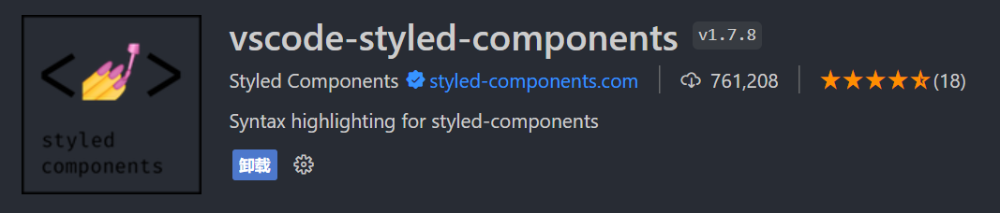
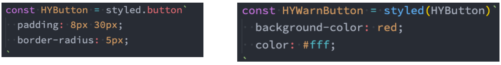
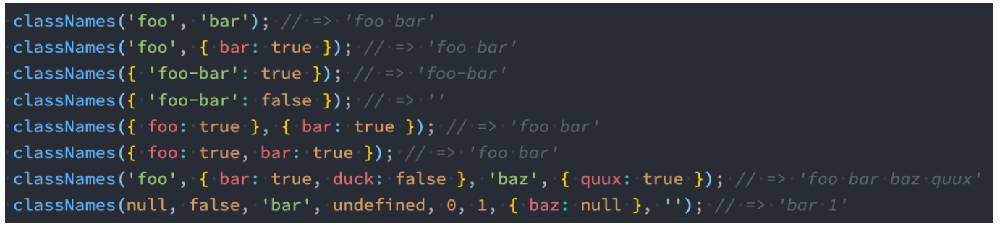

## **组件化天下的 CSS**

**前面说过，整个前端已经是组件化的天下：**

而 CSS 的设计就不是为组件化而生的，所以在目前组件化的框架中都在需要一种合适的 CSS 解决方案。

**在组件化中选择合适的 CSS 解决方案应该符合以下条件：**

可以编写局部 css：css 具备自己的局部作用域，不会随意污染其他组件内的元素；

可以编写动态的 css：可以获取当前组件的一些状态，根据状态的变化生成不同的 css 样式；

支持所有的 css 特性：伪类、动画、媒体查询等；

编写起来简洁方便、最好符合一贯的 css 风格特点；

等等...

## **React 中的 CSS**

**事实上，css 一直是 React 的痛点，也是被很多开发者吐槽、诟病的一个点。**

**在这一点上，Vue 做的要好于 React：**

Vue 通过在.vue 文件中编写 `<style><style> `标签来编写自己的样式；

通过是否添加 scoped 属性来决定编写的样式是全局有效还是局部有效；

通过 lang 属性来设置你喜欢的 less、sass 等预处理器；

通过内联样式风格的方式来根据最新状态设置和改变 css；

等等...

**Vue 在 CSS 上虽然不能称之为完美，但是已经足够简洁、自然、方便了，至少统一的样式风格不会出现多个开发人员、多个项目**

**采用不一样的样式风格。**

**相比而言，React 官方并没有给出在 React 中统一的样式风格：**

由此，从普通的 css，到 css modules，再到 css in js，有几十种不同的解决方案，上百个不同的库；

大家一致在寻找最好的或者说最适合自己的 CSS 方案，但是到目前为止也没有统一的方案；

## **内联样式**

**内联样式是官方推荐的一种 css 样式的写法：**

style 接受一个采用小驼峰命名属性的 JavaScript 对象，，而不是 CSS 字符串；

并且可以引用 state 中的状态来设置相关的样式；

**内联样式的优点:**

1.内联样式, 样式之间不会有冲突

2.可以动态获取当前 state 中的状态

**内联样式的缺点：**

1.写法上都需要使用驼峰标识

2.某些样式没有提示

3.大量的样式, 代码混乱

4.某些样式无法编写(比如伪类/伪元素)

**所以官方依然是希望内联合适和普通的 css 来结合编写；**

```javascript
import React, { PureComponent } from "react";

export class App extends PureComponent {
  constructor() {
    super();

    this.state = {
      titleSize: 30,
    };
  }

  addTitleSize() {
    this.setState({ titleSize: this.state.titleSize + 2 });
  }

  render() {
    const { titleSize } = this.state;

    return (
      <div>
        <button onClick={(e) => this.addTitleSize()}>增加titleSize</button>
        <h2 style={{ color: "red", fontSize: `${titleSize}px` }}>我是标题</h2>
        <p style={{ color: "blue", fontSize: "20px" }}>我是内容, 哈哈哈</p>
      </div>
    );
  }
}

export default App;
```

## **普通的 css**

**普通的 css 我们通常会编写到一个单独的文件，之后再进行引入。**

**这样的编写方式和普通的网页开发中编写方式是一致的：**

如果我们按照普通的网页标准去编写，那么也不会有太大的问题；

但是组件化开发中我们总是希望组件是一个独立的模块，即便是样式也只是在自己内部生效，不会相互影响；

但是普通的 css 都属于全局的 css，样式之间会相互影响；

**这种编写方式最大的问题是样式之间会相互层叠掉；**

App.jsx

```javascript
import React, { PureComponent } from "react";
import "./App.css";
import Home from "./home/Home";
import Profile from "./profile/Profile";

export class App extends PureComponent {
  render() {
    return (
      <div>
        <h2 className="title">我是标题</h2>
        <p className="content">我是内容, 哈哈哈哈</p>

        <Home />
        <Profile />
      </div>
    );
  }
}

export default App;
```

App.css

```css
.title {
  font-size: 32px;
  color: green;
}

.content {
  font-size: 22px;
  color: orange;
}
```

home/Home.jsx

```javascript
import React, { PureComponent } from "react";
import "./Home.css";

export class Home extends PureComponent {
  render() {
    return (
      <div className="section">
        <div className="title">Home的标题</div>
      </div>
    );
  }
}

export default Home;
```

home/Home.css

```css
.section {
  border: 1px solid skyblue;
}
```

profile/Profile.jsx

```javascript
import React, { PureComponent } from "react";
import "./Profle.css";

export class Profile extends PureComponent {
  render() {
    return (
      <div>
        <div className="section">Profile Section</div>
      </div>
    );
  }
}

export default Profile;
```

profile/Profile.css

```css
.section {
  border: none;
}
```

上面编写的 CSS 样式都是全局样式，会互相影响。

## **css modules**

**css modules 并不是 React 特有的解决方案，而是所有使用了类似于 webpack 配置的环境下都可以使用的。**

如果在其他项目中使用它，那么我们需要自己来进行配置，比如配置 webpack.config.js 中的 modules: true 等。

**React 的脚手架已经内置了 css modules 的配置：**

.css/.less/.scss 等样式文件都需要修改成 .module.css/.module.less/.module.scss 等；

之后就可以引用并且进行使用了；

**css modules 确实解决了局部作用域的问题，也是很多人喜欢在 React 中使用的一种方案。**

**但是这种方案也有自己的缺陷：**

引用的类名，不能使用连接符(.home-title)，在 JavaScript 中是不识别的；

所有的 className 都必须使用{style.className} 的形式来编写；

不方便动态来修改某些样式，依然需要使用内联样式的方式；

**如果你觉得上面的缺陷还算 OK，那么你在开发中完全可以选择使用 css modules 来编写，并且也是在 React 中很受欢迎的一种方式。**

App.jsx

```javascript
import React, { PureComponent } from "react";
import Home from "./home/Home";
import Profile from "./profile/Profile";

import appStyle from "./App.module.css";

export class App extends PureComponent {
  render() {
    return (
      <div>
        <h2 className={appStyle.title}>我是标题</h2>
        <p className={appStyle.content}>我是内容, 哈哈哈哈</p>

        <Home />
        <Profile />
      </div>
    );
  }
}

export default App;
```

App.module.css

```css
.title {
  font-size: 32px;
  color: green;
}

.content {
  font-size: 22px;
  color: orange;
}

.hy-title {
  // 不支持这种写法
}
```

home/Home.jsx

```javascript
import React, { PureComponent } from "react";
// import "./Home.css"
import homeStyle from "./Home.module.css";

export class Home extends PureComponent {
  render() {
    return (
      <div className={homeStyle.section}>
        <div className={homeStyle.title}>Home的标题</div>
      </div>
    );
  }
}

export default Home;
```

home/Home.module.css

```css
.section {
  border: 1px solid skyblue;
}

.title {
  color: purple;
}
```

profile/Profile.jsx

```javascript
import React, { PureComponent } from "react";
// import "./Profle.css"
import profileStyle from "./Profle.module.css";

export class Profile extends PureComponent {
  render() {
    return (
      <div>
        <div className={profileStyle.section}>Profile Section</div>
      </div>
    );
  }
}

export default Profile;
```

profile/Profile.module.css

```css
.section {
  border: none;
}
```

## less 的配置和编写方式

App.jsx

```javascript
import React, { PureComponent } from "react";
import "./App.less";

export class App extends PureComponent {
  render() {
    return (
      <div className="app">
        <div className="section">
          <h2 className="title">我是标题</h2>
          <p className="content">我是内容, 哈哈哈</p>
        </div>
      </div>
    );
  }
}

export default App;
```

App.less

```css
@primaryColor: red;

.section {
  border: 1px solid @primaryColor;

  .title {
    font-size: 30px;
    color: @primaryColor;
  }

  .content {
    font-size: 20px;
    color: @primaryColor;
  }
}
```

我们会发现引入 less 并不会生效，React 的脚手架是没有帮我们配置 less 的，我们可以配置 less 所需要的 loader，但是又面临了另外一个问题，怎么配置呢？要知道 React 脚手架默认是隐藏 webpack 的配置。

这里有两种方案，方案一，是执行 npm run eject 这个命令就会将 webpack 暴露出来，但是这个过程是不可逆的，并且暴露出来的 webpack 比较复杂，配置起来有点难度，很容易配错，导致项目跑不起来。但是如果你非常熟悉 webpack，就可以使用这种方案。开发当中还有第二种方案。

使用一个工具叫 craco，首先安装 caraco：

```javascript
npm install @craco/craco
```

我们会发现安装失败，因为目前脚手架的版本是 5.x，在 package.json 中看 react-scripts，这个就是 React 脚手架的版本。

遇到这种问题如何解决？

去 github 搜索 craco，在 issues 中找到解决方案，需要安装 alpha 版本

```javascript
npm install @craro/craco@alpha
```

装好之后，就可以进行配置了，在项目根目录下创建 craco.config.js，并进行如下配置，下面配置是从 Ant Design 官网复制的，里面有对 craco 的配置指南

```javascript
const CracoLessPlugin = require("craco-less");

module.exports = {
  plugins: [
    {
      plugin: CracoLessPlugin,
      options: {
        lessLoaderOptions: {
          lessOptions: {
            modifyVars: { "@primary-color": "#1DA57A" },
            javascriptEnabled: true,
          },
        },
      },
    },
  ],
};
```

同时也得修改 package.json 中的启动方式，改成使用 craco 启动

```json
"scripts": {
    "start": "craco start",
    "build": "craco build",
    "test": "craco test",
    "eject": "react-scripts eject"
 }
```

这里需要安装一个包 craco-less，同样安装需要安装 alpha 版本，因为脚手架版本是 5.x

```javascript
npm install craco-less@alpha
```

执行 npm run start 重启项目，会发现使用的 less 生效了。

## **认识 CSS in JS**

**官方文档也有提到过 CSS in JS 这种方案：**

“CSS-in-JS” 是指一种模式，其中 CSS 由 JavaScript 生成而不是在外部文件中定义；

注意此功能并不是 React 的一部分，而是由第三方库提供；

React 对样式如何定义并没有明确态度；

**在传统的前端开发中，我们通常会将结构（HTML）、样式（CSS）、逻辑（JavaScript）进行分离。**

但是在前面的学习中，我们就提到过，React 的思想中认为逻辑本身和 UI 是无法分离的，所以才会有了 JSX 的语法。

**样式呢？**样式也是属于 UI 的一部分；

事实上 CSS-in-JS 的模式就是一种将样式（CSS）也写入到 JavaScript 中的方式，并且可以方便的使用 JavaScript 的状态；

所以 React 被人称之为 All in JS；

**当然，这种开发的方式也受到了很多的批评：**

Stop using CSS in JavaScript for web development

https://hackernoon.com/stop-using-css-in-javascript-for-web-development-fa32fb873dcc

## **认识 styled-components**

**批评声音虽然有，但是在我们看来很多优秀的 CSS-in-JS 的库依然非常强大、方便：**

CSS-in-JS 通过 JavaScript 来为 CSS 赋予一些能力，包括类似于 CSS 预处理器一样的样式嵌套、函数定义、逻辑复用、动态修

改状态等等；

虽然 CSS 预处理器也具备某些能力，但是获取动态状态依然是一个不好处理的点；

所以，目前可以说 CSS-in-JS 是 React 编写 CSS 最为受欢迎的一种解决方案；

**目前比较流行的 CSS-in-JS 的库有哪些呢？**

styled-components

emotion

glamorous

**目前可以说 styled-components 依然是社区最流行的 CSS-in-JS 库，所以我们以 styled-components 的讲解为主；**

**安装 styled-components：**

```javascript
yarn add styled-components
```

## **ES6 标签模板字符串**

**ES6 中增加了模板字符串的语法，这个对于很多人来说都会使用。**

**但是模板字符串还有另外一种用法：标签模板字符串（Tagged Template Literals）**。

**我们一起来看一个普通的 JavaScript 的函数：**

正常情况下，我们都是通过 函数名() 方式来进行调用的，其实函数还有另外一种调用方式：

**如果我们在调用的时候插入其他的变量：**

模板字符串被拆分了；

第一个元素是数组，是被模块字符串拆分的字符串组合；

后面的元素是一个个模块字符串传入的内容；

**在 styled component 中，就是通过这种方式来解析模块字符串，最终生成我们想要的样式的**

## **styled 的基本使用**

**styled-components 的本质是通过函数的调用，最终创建出一个组件：**

这个组件会被自动添加上一个不重复的 class；

styled-components 会给该 class 添加相关的样式；

**另外，它支持类似于 CSS 预处理器一样的样式嵌套：**

支持直接子代选择器或后代选择器，并且直接编写样式；

可以通过&符号获取当前元素；

直接伪类选择器、伪元素等；


App.jsx

```javascript
import React, { PureComponent } from "react";
import { AppWrapper } from "./style";

export class App extends PureComponent {
  render() {
    return (
      <AppWrapper>
        <div className="section">
          <h2 className="title">我是标题</h2>
          <p className="content">我是内容, 哈哈哈</p>
        </div>

        <div className="footer">
          <p>免责声明</p>
          <p>版权声明</p>
        </div>
      </AppWrapper>
    );
  }
}

export default App;
```

style.js

```javascript
import styled from "styled-components";

export const AppWrapper = styled.div`
  .section {
    border: 1px solid red;

    .title {
      font-size: 30px;
      color: blue;

      &:hover {
        background-color: purple;
      }
    }

    .content {
      font-size: 20px;
      color: green;
    }
  }

  .footer {
    border: 1px solid orange;
  }
`;
```

这里在编写 CSS 代码时不会高亮显示，推荐使用一个 vscode 插件



## **props、attrs 属性**

**props 可以传递**

**props 可以被传递给 styled 组件**

获取 props 需要通过${}传入一个插值函数，props 会作为该函数的参数；

这种方式可以有效的解决动态样式的问题；

**添加 attrs 属性**

## **styled 高级特性**

**支持样式的继承**



**styled 设置主题**


App.jsx

```javascript
import React, { PureComponent } from "react";
import Home from "./home";
import { AppWrapper, SectionWrapper } from "./style";

export class App extends PureComponent {
  constructor() {
    super();

    this.state = {
      size: 30,
      color: "yellow",
    };
  }

  render() {
    const { size } = this.state;

    return (
      <AppWrapper>
        <SectionWrapper size={size}>
          <h2 className="title">我是标题</h2>
          <p className="content">我是内容, 哈哈哈</p>
          <button onClick={(e) => this.setState({ color: "skyblue" })}>
            修改颜色
          </button>
        </SectionWrapper>

        <Home />

        <div className="footer">
          <p>免责声明</p>
          <p>版权声明</p>
        </div>
      </AppWrapper>
    );
  }
}

export default App;
```

style.js

```javascript
import styled from "styled-components";
import { primaryColor, largeSize } from "./style/variables";

// 1.基本使用
export const AppWrapper = styled.div`
  .footer {
    border: 1px solid orange;
  }
`;

// 2.子元素单独抽取到一个样式组件
// 3.可以接受外部传入的props
// 4.可以通过attrs给标签模板字符串中提供的属性
// 5.从一个单独的文件中引入变量
export const SectionWrapper = styled.div.attrs((props) => ({
  // 注意：tColor和color名字不能一样，否则会递归，导致死循环
  tColor: props.color || "blue", // 使用SectionWrapper组件传进来的color，不传就使用"blue"，
}))`
  border: 1px solid red;

  .title {
    font-size: ${(props) => props.size}px; // 使用SectionWrapper传进来的size
    color: ${(props) =>
      props.tColor}; // 使用attrs中的tColor，attrs属性主要是为了设置默认值

    &:hover {
      background-color: purple;
    }
  }

  .content {
    font-size: ${largeSize}px; // 也可以使用自定义的一些公共变量
    color: ${primaryColor};
  }
`;
```

style/variable.js

```javascript
export const primaryColor = "#ff8822";
export const secondColor = "#ff7788";

export const smallSize = "12px";
export const middleSize = "14px";
export const largeSize = "18px";
```

home/index.jsx

```javascript
import React, { PureComponent } from "react";
import { HomeWrapper, HYButtonWrapper } from "./style";

export class Home extends PureComponent {
  render() {
    return (
      <HomeWrapper>
        <div className="top">
          <div className="banner">BannerContent</div>
        </div>
        <div className="bottom">
          <h2 className="header">商品列表</h2>
          <ul className="product-list">
            <li className="item">商品列表1</li>
            <li className="item">商品列表2</li>
            <li className="item">商品列表3</li>
          </ul>
        </div>

        <HYButtonWrapper>哈哈哈</HYButtonWrapper>
      </HomeWrapper>
    );
  }
}

export default Home;
```

src/index.js

```javascript
...

import React from 'react';
import ReactDOM from 'react-dom/client';
import { ThemeProvider } from "styled-components"

const root = ReactDOM.createRoot(document.getElementById('root'));
root.render(
  <React.StrictMode>
    <ThemeProvider theme={{ color: "purple", size: "50px" }}>
      <App />
    </ThemeProvider>
  </React.StrictMode>
);
```

home/style.js

```javascript
import styled from "styled-components";

const HYButton = styled.button`
  border: 1px solid red;
  border-radius: 5px;
`;

export const HYButtonWrapper = styled(HYButton)`
  // 继承HYButton组件的所有样式
  background-color: #0f0;
  color: #fff;
`;

export const HomeWrapper = styled.div`
  .top {
    .banner {
      color: red;
    }
  }

  .bottom {
    .header {
      color: ${(props) => props.theme.color}; // 使用styled设置的主题
      font-size: ${(props) => props.theme.size};
    }

    .product-list {
      .item {
        color: blue;
      }
    }
  }
`;
```

## **React 中添加 class**

**React 在 JSX 给了我们开发者足够多的灵活性，你可以像编写 JavaScript 代码一样，通过一些逻辑来决定是否添加某些 class：**

**这个时候我们可以借助于一个第三方的库：classnames**

很明显，这是一个用于动态添加 classnames 的一个库。

```ja
npm install classnames
```



```javascript
import React, { PureComponent } from "react";
import classNames from "classnames";

export class App extends PureComponent {
  constructor() {
    super();

    this.state = {
      isbbb: true,
      isccc: true,
    };
  }

  render() {
    const { isbbb, isccc } = this.state;

    const classList = ["aaa"];
    if (isbbb) classList.push("bbb");
    if (isccc) classList.push("ccc");
    const classname = classList.join(" ");

    return (
      <div>
        <h2 className={`aaa ${isbbb ? "bbb" : ""} ${isccc ? "ccc" : ""}`}>
          哈哈哈
        </h2>
        <h2 className={classname}>呵呵呵</h2>

        <h2 className={classNames("aaa", { bbb: isbbb, ccc: isccc })}>
          嘿嘿嘿
        </h2>
        <h2 className={classNames(["aaa", { bbb: isbbb, ccc: isccc }])}>
          嘻嘻嘻
        </h2>
      </div>
    );
  }
}

export default App;
```
