## **理解 JavaScript 纯函数**

**函数式编程**中有一个非常重要的概念叫**纯函数**，JavaScript 符合**函数式编程的范式**，所以也**有纯函数的概念**；

在**react 开发中纯函数是被多次提及**的；

比如**react 中组件就被要求像是一个纯函数**（为什么是像，因为还有 class 组件），**redux 中有一个 reducer 的概念**，也是要求

必须是一个纯函数；

所以**掌握纯函数对于理解很多框架的设计**是非常有帮助的；

**纯函数的维基百科定义：**

在程序设计中，若一个函数符合以下条件，那么这个函数被称为纯函数：

此函数在相同的输入值时，需产生相同的输出。

函数的输出和输入值以外的其他隐藏信息或状态无关，也和由 I/O 设备产生的外部输出无关。

该函数不能有语义上可观察的函数副作用，诸如“触发事件”，使输出设备输出，或更改输出值以外物件的内容等。

**当然上面的定义会过于的晦涩，所以我简单总结一下：**

确定的输入，一定会产生确定的输出；

函数在执行过程中，不能产生副作用；

## **副作用概念的理解**

**那么这里又有一个概念，叫做副作用**，什么又是**副作用**呢？

**副作用（side effect）**其实本身是医学的一个概念，比如我们经常说吃什么药本来是为了治病，可能会产生一些其他的副作

用；

在计算机科学中，也引用了副作用的概念，表示在执行一个函数时，除了返回函数值之外，还对调用函数产生了附加的影响，

比如修改了全局变量，修改参数或者改变外部的存储；

**纯函数在执行的过程中就是不能产生这样的副作用：**

副作用往往是产生 bug 的 “温床”。

## **纯函数的案例**

**我们来看一个对数组操作的两个函数：**

slice：slice 截取数组时不会对原数组进行任何操作,而是生成一个新的数组；

splice：splice 截取数组, 会返回一个新的数组, 也会对原数组进行修改；

**slice 就是一个纯函数，不会修改数组本身，而 splice 函数不是一个纯函数；**


## **判断下面函数是否是纯函数？**

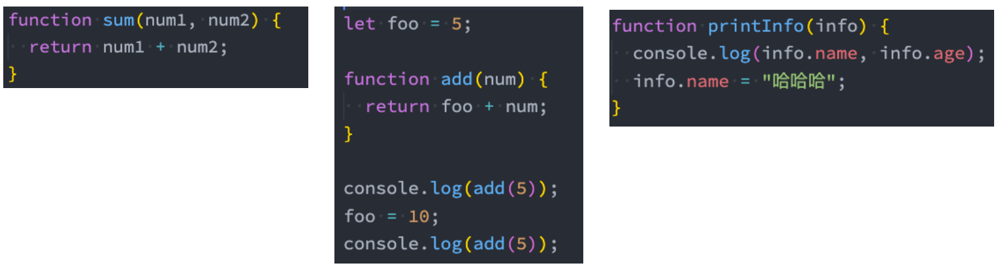

第一个是纯函数，第二和第三个不是纯函数。

## **纯函数的作用和优势**

**为什么纯函数在函数式编程中非常重要呢？**

因为你可以安心的编写和安心的使用；

你在**写的时候**保证了函数的纯度，只是单纯实现自己的业务逻辑即可，不需要关心传入的内容是如何获得的或者依赖其他的

外部变量是否已经发生了修改；

你在**用的时候**，你确定你的输入内容不会被任意篡改，并且自己确定的输入，一定会有确定的输出；

React 中就要求我们无论是**函数还是 class 声明一个组件**，这个组件都必须**像纯函数一样**，**保护它们的 props 不被修改：**

**在接下来学习 redux 中，reducer 也被要求是一个纯函数。**

## **为什么需要 redux**

**JavaScript 开发的应用程序，已经变得越来越复杂了：**

JavaScript 需要管理的状态越来越多，越来越复杂；

这些状态包括服务器返回的数据、缓存数据、用户操作产生的数据等等，也包括一些 UI 的状态，比如某些元素是否被选中，是否显示

加载动效，当前分页；

**管理不断变化的 state 是非常困难的：**

状态之间相互会存在依赖，一个状态的变化会引起另一个状态的变化，View 页面也有可能会引起状态的变化；

当应用程序复杂时，state 在什么时候，因为什么原因而发生了变化，发生了怎么样的变化，会变得非常难以控制和追踪；

**React 是在视图层帮助我们解决了 DOM 的渲染过程，但是 State 依然是留给我们自己来管理：**

无论是组件定义自己的 state，还是组件之间的通信通过 props 进行传递；也包括通过 Context 进行数据之间的共享；

React 主要负责帮助我们管理视图，state 如何维护最终还是我们自己来决定；


**Redux 就是一个帮助我们管理 State 的容器：Redux 是 JavaScript 的状态容器，提供了可预测的状态管理；**

**Redux 除了和 React 一起使用之外，它也可以和其他界面库一起来使用（比如 Vue），并且它非常小（包括依赖在内，只有 2kb）**

## **Redux 的核心理念 - Store**

**Redux 的核心理念非常简单。**

**比如我们有一个朋友列表需要管理：**

如果我们没有定义统一的规范来操作这段数据，那么整个数据的变化就是无法跟踪的；

比如页面的某处通过 products.push 的方式增加了一条数据；

比如另一个页面通过 products[0].age = 25 修改了一条数据；

**整个应用程序错综复杂，当出现 bug 时，很难跟踪到底哪里发生的变化；**


## **Redux 的核心理念 - action**

**Redux 要求我们通过 action 来更新数据：**

所有数据的变化，必须通过派发（dispatch）action 来更新；

action 是一个普通的 JavaScript 对象，用来描述这次更新的 type 和 content；

**比如下面就是几个更新 friends 的 action：**

强制使用 action 的好处是可以清晰的知道数据到底发生了什么样的变化，所有的数据变化都是可跟追、可预测的；

当然，目前我们的 action 是固定的对象；

真实应用中，我们会通过函数来定义，返回一个 action；

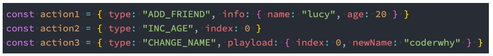

## **Redux 的核心理念 - reducer**

**但是如何将 state 和 action 联系在一起呢？答案就是 reducer**

reducer 是一个纯函数；

reducer 做的事情就是将传入的 state 和 action 结合起来生成一个新的 state；

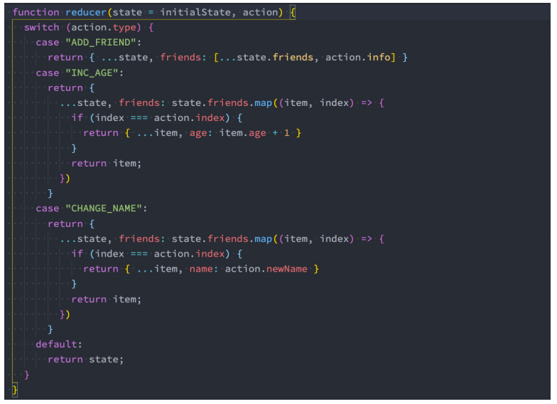

## **Redux 的三大原则**

**单一数据源**

整个应用程序的 state 被存储在一颗 object tree 中，并且这个 object tree 只存储在一个 store 中：

Redux 并没有强制让我们不能创建多个 Store，但是那样做并不利于数据的维护；

单一的数据源可以让整个应用程序的 state 变得方便维护、追踪、修改；

**State 是只读的**

唯一修改 State 的方法一定是触发 action，不要试图在其他地方通过任何的方式来修改 State：

这样就确保了 View 或网络请求都不能直接修改 state，它们只能通过 action 来描述自己想要如何修改 state；

这样可以保证所有的修改都被集中化处理，并且按照严格的顺序来执行，所以不需要担心 race condition（竟态）的问题；

**使用纯函数来执行修改**

通过 reducer 将 旧 state 和 actions 联系在一起，并且返回一个新的 State：

随着应用程序的复杂度增加，我们可以将 reducer 拆分成多个小的 reducers，分别操作不同 state tree 的一部分；

但是所有的 reducer 都应该是纯函数，不能产生任何的副作用；

## **Redux 测试项目搭建**

**安装 redux：**

```json
npm install redux --save
## 或
yarn add redux
```

**1.创建一个新的项目文件夹：learn-redux**

```json
## 执行初始化操作
yarn init
## 安装redux
yarn add redux
```

**2.创建 src 目录，并且创建 index.js 文件**

**3.修改 package.json 可以执行 index.js**

```json
"scripts": {
	"start": "node src/index.js"
}
```

## **Redux 的使用过程**

**1.创建一个对象，作为我们要保存的状态：**

**2.创建 Store 来存储这个 state**

创建 store 时必须创建 reducer；

我们可以通过 store.getState 来获取当前的 state；

**3.通过 action 来修改 state**

通过 dispatch 来派发 action；

通常 action 中都会有 type 属性，也可以携带其他的数据；

**4.修改 reducer 中的处理代码**

这里一定要记住，reducer 是一个纯函数，不需要直接修改 state；

后面我会讲到直接修改 state 带来的问题；

**5.可以在派发 action 之前，监听 store 的变化：**

## **Redux 结构划分**

**如果我们将所有的逻辑代码写到一起，那么当 redux 变得复杂时代码就难以维护。**

接下来，我会对代码进行拆分，将 store、reducer、action、constants 拆分成一个个文件。

创建 store/index.js 文件：

创建 store/reducer.js 文件：

创建 store/actionCreators.js 文件：

创建 store/constants.js 文件：

**注意：node 中对 ES6 模块化的支持**

目前我使用的 node 版本是 v12.16.1，从 node v13.2.0 开始，node 才对 ES6 模块化提供了支持：

node v13.2.0 之前，需要进行如下操作：

- 在 package.json 中添加属性： "type": "module"；
- 在执行命令中添加如下选项：node --experimental-modules src/index.js;

node v13.2.0 之后，只需要进行如下操作：

- 在 package.json 中添加属性： "type": "module"；

**注意：如果使用 ES6 模块化，导入文件时，需要跟上.js 后缀名；**

store/index.js

```javascript
const { createStore } = require("redux");
const reducer = require("./reducer.js");

// 创建的store
const store = createStore(reducer);

module.exports = store;
```

store/reducer.js

```javascript
const { ADD_NUMBER, CHANGE_NAME } = require("./constants");

// 初始化的数据
const initialState = {
  name: "why",
  counter: 100,
};

function reducer(state = initialState, action) {
  switch (action.type) {
    case CHANGE_NAME:
      return { ...state, name: action.name };
    case ADD_NUMBER:
      return { ...state, counter: state.counter + action.num };
    default:
      return state;
  }
}

module.exports = reducer;
```

store/actionCreators.js

```javascript
const { ADD_NUMBER, CHANGE_NAME } = require("./constants");

const changeNameAction = (name) => ({
  type: CHANGE_NAME,
  name,
});

const addNumberAction = (num) => ({
  type: ADD_NUMBER,
  num,
});

module.exports = {
  changeNameAction,
  addNumberAction,
};
```

store/constants.js

```javascript
const ADD_NUMBER = "add_number";
const CHANGE_NAME = "change_name";

module.exports = {
  ADD_NUMBER,
  CHANGE_NAME,
};
```

src/index.js

```javascript
/**
 * redux代码优化:
 *  1.将派发的action生成过程放到一个actionCreators函数中
 *  2.将定义的所有actionCreators的函数, 放到一个独立的文件中: actionCreators.js
 *  3.actionCreators和reducer函数中使用字符串常量是一致的, 所以将常量抽取到一个独立constants的文件中
 *  4.将reducer和默认值(initialState)放到一个独立的reducer.js文件中, 而不是在index.js
 */

const store = require("./store");
const { addNumberAction, changeNameAction } = require("./store/actionCreators");

const unsubscribe = store.subscribe(() => {
  console.log("订阅数据的变化:", store.getState());
});

// actionCreators: 帮助我们创建action
// const changeNameAction = (name) => ({
//   type: "change_name",
//   name
// })

// 修改store中的数据: 必须action
store.dispatch(changeNameAction("kobe"));
store.dispatch(changeNameAction("lilei"));
store.dispatch(changeNameAction("james"));

// 修改counter
// const addNumberAction = (num) => ({
//   type: "add_number",
//   num
// })

store.dispatch(addNumberAction(10));
store.dispatch(addNumberAction(20));
store.dispatch(addNumberAction(30));
store.dispatch(addNumberAction(100));
```

## **Redux 使用流程**

**我们已经知道了 redux 的基本使用过程，那么我们就更加清晰来认识一下 redux 在实际开发中的流程：**

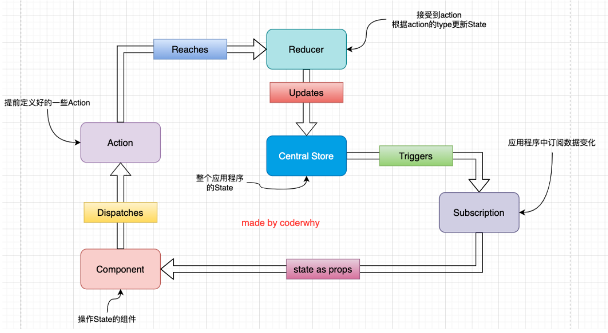

## **Redux 官方图**


## **redux 融入 react 代码**

**目前 redux 在 react 中使用是最多的，所以我们需要将之前编写的 redux 代码，融入到 react 当中去。**

**这里我创建了两个组件：**

Home 组件和 Profile 组件

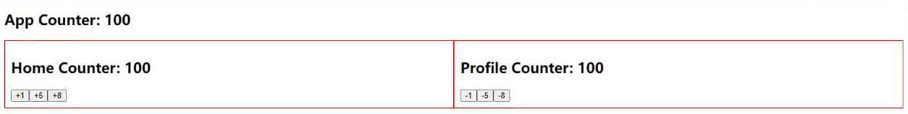

**核心代码主要是两个：**

在 componentDidMount 中订阅数据的变化，当数据发生变化时重新设置 counter;

在发生点击事件时，调用 store 的 dispatch 来派发对应的 action；

App.jsx

```javascript
import React, { PureComponent } from "react";
import Home from "./pages/home";
import Profile from "./pages/profile";
import "./style.css";
import store from "./store";

export class App extends PureComponent {
  constructor() {
    super();

    this.state = {
      counter: store.getState().counter,
    };
  }

  componentDidMount() {
    store.subscribe(() => {
      const state = store.getState();
      this.setState({ counter: state.counter });
    });
  }

  render() {
    const { counter } = this.state;

    return (
      <div>
        <h2>App Counter: {counter}</h2>

        <div className="pages">
          <Home />
          <Profile />
        </div>
      </div>
    );
  }
}

export default App;
```

store/index.js

```javascript
import { createStore } from "redux";
import reducer from "./reducer";

const store = createStore(reducer);

export default store;
```

store/reducer.js

```javascript
import * as actionTypes from "./constants";

const initialState = {
  counter: 200,
};

function reducer(state = initialState, action) {
  switch (action.type) {
    case actionTypes.ADD_NUMBER:
      return { ...state, counter: state.counter + action.num };
    case actionTypes.SUB_NUMBER:
      return { ...state, counter: state.counter - action.num };
    default:
      return state;
  }
}

export default reducer;
```

store/actionCreators.js

```javascript
import * as actionTypes from "./constants";

export const addNumberAction = (num) => ({
  type: actionTypes.ADD_NUMBER,
  num,
});

export const subNumberAction = (num) => ({
  type: actionTypes.SUB_NUMBER,
  num,
});
```

store/constants.js

```javascript
export const ADD_NUMBER = "add_number";
export const SUB_NUMBER = "sub_number";
```

pages/home.jsx

```javascript
import React, { PureComponent } from "react";
import store from "../store";
import { addNumberAction } from "../store/actionCreators";

export class Home extends PureComponent {
  constructor() {
    super();

    this.state = {
      counter: store.getState().counter,

      message: "Hello World",
      friends: [
        { id: 111, name: "why" },
        { id: 112, name: "kobe" },
        { id: 113, name: "james" },
      ],
    };
  }

  componentDidMount() {
    store.subscribe(() => {
      const state = store.getState();
      this.setState({ counter: state.counter });
    });
  }

  addNumber(num) {
    store.dispatch(addNumberAction(num));
  }

  render() {
    const { counter } = this.state;

    return (
      <div>
        <h2>Home Counter: {counter}</h2>
        <div>
          <button onClick={(e) => this.addNumber(1)}>+1</button>
          <button onClick={(e) => this.addNumber(5)}>+5</button>
          <button onClick={(e) => this.addNumber(8)}>+8</button>
        </div>
      </div>
    );
  }
}

export default Home;
```

pages/profile.jsx

```javascript
import React, { PureComponent } from "react";
import store from "../store";
import { subNumberAction } from "../store/actionCreators";

export class Profile extends PureComponent {
  constructor() {
    super();

    this.state = {
      counter: store.getState().counter,
    };
  }

  componentDidMount() {
    store.subscribe(() => {
      const state = store.getState();
      this.setState({ counter: state.counter });
    });
  }

  subNumber(num) {
    store.dispatch(subNumberAction(num));
  }

  render() {
    const { counter } = this.state;

    return (
      <div>
        <h2>Profile Counter: {counter}</h2>
        <div>
          <button onClick={(e) => this.subNumber(1)}>-1</button>
          <button onClick={(e) => this.subNumber(5)}>-5</button>
          <button onClick={(e) => this.subNumber(8)}>-8</button>
        </div>
      </div>
    );
  }
}

export default Profile;
```

## **react-redux 使用**

虽然我们实现了数据的共享，但是会发现 Home 组件和 Profile 组件存在着重复代码，那么有没有办法进行优化呢？

我们可以借助一个库，叫 react-redux。

**开始之前需要强调一下，redux 和 react 没有直接的关系，你完全可以在 React, Angular, Ember, jQuery, or vanilla**

**JavaScript 中使用 Redux。**

**尽管这样说，redux 依然是和 React 库结合的更好，因为他们是通过 state 函数来描述界面的状态，Redux 可以发射状态的更新，**

**让他们作出相应。**

安装 react-redux：

```javascript
yarn add react-redux
```

如何使用？

第一步，在 src/index.js 中使用 react-redux 提供的 Provider，在 Provider 中传入 store

```javascript
import React from "react";
import ReactDOM from "react-dom/client";
import App from "./App";

import { Provider } from "react-redux";
import store from "./store";

const root = ReactDOM.createRoot(document.getElementById("root"));
root.render(
  <React.StrictMode>
    <Provider store={store}>
      <App />
    </Provider>
  </React.StrictMode>
);
```

在 App.jsx 中引入 About 组件，这部分代码省略。

第二步，在 About.jsx 中使用，这里就不需要传入 store 了，只需要使用 connect 函数，它的返回值是一个高阶组件。connect 函数支持传入两个参数，第一个参数是告诉 connet()这个高阶组件需要把哪些 state 映射过去，因为 state 里面可能存放很多数据，我们这里只需要用到 counter，那么就只需要把 counter 映射过去即可，映射过去之后，就能在 About 组件的 props 属性获取到 counter 了。这个高阶组件内部相当于做了下面这个事情，把 fn1 返回的对象合并到了 About 组件当中，后面就可以从 props 取出映射的对象。


```javascript
import React, { PureComponent } from "react";
import { connect } from "react-redux";

export class About extends PureComponent {
  render() {
    const { counter } = this.props;

    return (
      <div>
        <h2>About Page: {counter}</h2>
      </div>
    );
  }
}

// connect()返回值是一个高阶组件

const mapStateToProps = (state) => ({
  counter: state.counter,
});

export default connect(mapStateToProps)(About);
```

如果我们想在 About 组件内增加按钮来改变 store 中的 counter 该怎么做呢？当然，我们可以引入 store，然后调用 dispath 方法派发 action，我们有没有办法不在 Aboout 组件引入 store 也可以派发 action？答案就是 connect 方法支持传入第二个参数，

About.jsx

```javascript
import React, { PureComponent } from "react";
import { connect } from "react-redux";
import { addNumberAction, subNumberAction } from "../store/counter";

export class About extends PureComponent {
  calcNumber(num, isAdd) {
    if (isAdd) {
      this.props.addNumber(num);
    } else {
      this.props.subNumber(num);
    }
  }

  render() {
    const { counter } = this.props;

    return (
      <div>
        <h2>About Page: {counter}</h2>
        <div>
          <button onClick={(e) => this.calcNumber(6, true)}>+6</button>
          <button onClick={(e) => this.calcNumber(88, true)}>+88</button>
          <button onClick={(e) => this.calcNumber(6, false)}>-6</button>
          <button onClick={(e) => this.calcNumber(88, false)}>-88</button>
        </div>
      </div>
    );
  }
}

// connect()返回值是一个高阶组件
// function mapStateToProps(state) {
//   return {
//     counter: state.counter
//   }
// }

// function fn2(dispatch) {
//   return {
//     addNumber(num) {
//       dispatch(addNumberAction(num))
//     },
//     subNumber(num) {
//       dispatch(subNumberAction(num))
//     }
//   }
// }

const mapStateToProps = (state) => ({
  counter: state.counter.counter,
});

const mapDispatchToProps = (dispatch) => ({
  addNumber(num) {
    dispatch(addNumberAction(num));
  },
  subNumber(num) {
    dispatch(subNumberAction(num));
  },
});

export default connect(mapStateToProps, mapDispatchToProps)(About);
```

## **组件中异步操作**

**在之前简单的案例中，redux 中保存的 counter 是一个本地定义的数据**

我们可以直接通过同步的操作来 dispatch action，state 就会被立即更新。

但是真实开发中，redux 中保存的很多数据可能来自服务器，我们需要进行异步的请求，再将数据保存到 redux 中。

**在之前学习网络请求的时候我们讲过，网络请求可以在 class 组件的 componentDidMount 中发送，所以我们可以有这样的结构：**

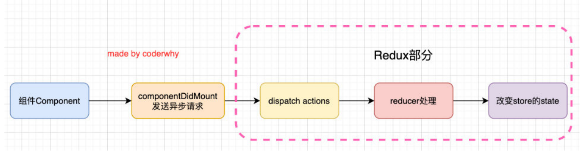

**我现在完成如下案例操作：**

在 Category 组件中请求 banners 和 recommends 的数据；

在 About 组件中展示 banners 和 recommends 的数据；

Category.jsx

```javascript
import React, { PureComponent } from "react";
import { connect } from "react-redux";
import {
  changeBannersAction,
  changeRecommendsAction,
} from "../store/actionCreators";
import axios from "axios";

export class Category extends PureComponent {
  componentDidMount() {
    axios.get("http://123.207.32.32:8000/home/multidata").then((res) => {
      const banners = res.data.data.banner.list;
      const recommends = res.data.data.recommend.list;

      this.props.changeBanners(banners);
      this.props.changeRecommends(recommends);
    });
  }

  render() {
    return (
      <div>
        <h2>Category Page: {this.props.counter}</h2>
      </div>
    );
  }
}

const mapStateToProps = (state) => ({
  counter: state.counter,
});

const mapDispatchToProps = (dispatch) => ({
  changeBanners(banners) {
    dispatch(changeBannersAction(banners));
  },
  changeRecommends(recommends) {
    dispatch(changeRecommendsAction(recommends));
  },
});

export default connect(mapStateToProps, mapDispatchToProps)(Category);
```

About.jsx

```javascript
import React, { PureComponent } from "react";
import { connect } from "react-redux";
import { addNumberAction, subNumberAction } from "../store/counter";

export class About extends PureComponent {
  calcNumber(num, isAdd) {
    if (isAdd) {
      this.props.addNumber(num);
    } else {
      this.props.subNumber(num);
    }
  }

  render() {
    const { counter, banners, recommends } = this.props;

    return (
      <div>
        <h2>About Page: {counter}</h2>
        <div>
          <button onClick={(e) => this.calcNumber(6, true)}>+6</button>
          <button onClick={(e) => this.calcNumber(88, true)}>+88</button>
          <button onClick={(e) => this.calcNumber(6, false)}>-6</button>
          <button onClick={(e) => this.calcNumber(88, false)}>-88</button>
        </div>
        <div className="banner">
          <h2>轮播图数据:</h2>
          <ul>
            {banners.map((item, index) => {
              return <li key={index}>{item.title}</li>;
            })}
          </ul>
        </div>
        <div className="recommend">
          <h2>推荐数据:</h2>
          <ul>
            {recommends.map((item, index) => {
              return <li key={index}>{item.title}</li>;
            })}
          </ul>
        </div>
      </div>
    );
  }
}

const mapStateToProps = (state) => ({
  counter: state.counter.counter,
  banners: state.home.banners,
  recommends: state.home.recommends,
});

const mapDispatchToProps = (dispatch) => ({
  addNumber(num) {
    dispatch(addNumberAction(num));
  },
  subNumber(num) {
    dispatch(subNumberAction(num));
  },
});

export default connect(mapStateToProps, mapDispatchToProps)(About);
```

## **redux 中异步操作**

**上面的代码有一个缺陷：**

我们必须将网络请求的异步代码放到组件的生命周期中来完成；

事实上，网络请求到的数据也属于我们状态管理的一部分，更好的一种方式应该是将其也交给 redux 来管理；

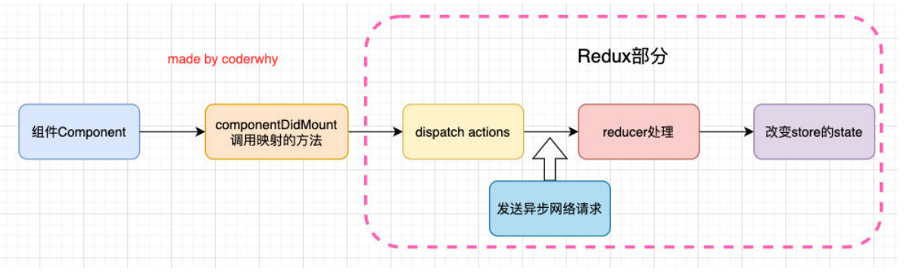

**但是在 redux 中如何可以进行异步的操作呢？**

答案就是使用**中间件（Middleware）**；

学习过 Express 或 Koa 框架的童鞋对中间件的概念一定不陌生；

在这类框架中，Middleware 可以帮助我们在请求和响应之间嵌入一些操作的代码，比如 cookie 解析、日志记录、文件压缩等操作；

## **理解中间件**

**redux 也引入了中间件（Middleware）的概念：**

这个中间件的目的是在 dispatch 的 action 和最终达到的 reducer 之间，扩展一些自己的代码；

比如日志记录、调用异步接口、添加代码调试功能等等；

**我们现在要做的事情就是发送异步的网络请求，所以我们可以添加对应的中间件：**

这里官网推荐的、包括演示的网络请求的中间件是使用 redux-thunk；

**redux-thunk 是如何做到让我们可以发送异步的请求呢？**

我们知道，默认情况下的 dispatch(action)，action 需要是一个 JavaScript 的对象；

redux-thunk 可以让 dispatch(action 函数)，action 可以是一个函数；

该函数会被调用，并且会传给这个函数一个 dispatch 函数和 getState 函数；

- dispatch 函数用于我们之后再次派发 action；
- getState 函数考虑到我们之后的一些操作需要依赖原来的状态，用于让我们可以获取之前的一些状态；

## **如何使用 redux-thunk**

**1.安装 redux-thunk**

```json
yarn add redux-thunk
```

**2.在创建 store 时传入应用了 middleware 的 enhance 函数**

通过 applyMiddleware 来结合多个 Middleware, 返回一个 enhancer；

将 enhancer 作为第二个参数传入到 createStore 中；


**3.定义返回一个函数的 action：**

注意：这里不是返回一个对象了，而是一个函数；

该函数在 dispatch 之后会被执行；


使用 redux-thunk 的代码变成下面这样，就可以在 redux 里面发送网络请求。

category.jsx

```javascript
import React, { PureComponent } from "react";
import { connect } from "react-redux";
import { fetchHomeMultidataAction } from "../store/home";

export class Category extends PureComponent {
  componentDidMount() {
    this.props.fetchHomeMultidata();
  }

  render() {
    return (
      <div>
        <h2>Category Page: {this.props.counter}</h2>
      </div>
    );
  }
}

const mapStateToProps = (state) => ({
  counter: state.counter.counter,
});

const mapDispatchToProps = (dispatch) => ({
  fetchHomeMultidata() {
    dispatch(fetchHomeMultidataAction());
  },
});

export default connect(mapStateToProps, mapDispatchToProps)(Category);
```

store/index.js

```javascript
import { createStore, applyMiddleware } from "redux";
import thunk from "redux-thunk";
import reducer from "./reducer";

const store = createStore(reducer, applyMiddleware(thunk));

export default store;
```

store/actionCreators.js

```javascript
import * as actionTypes from "./constants";
import axios from "axios";

export const addNumberAction = (num) => ({
  type: actionTypes.ADD_NUMBER,
  num,
});

export const subNumberAction = (num) => ({
  type: actionTypes.SUB_NUMBER,
  num,
});

export const changeBannersAction = (banners) => ({
  type: actionTypes.CHANGE_BANNERS,
  banners,
});

export const changeRecommendsAction = (recommends) => ({
  type: actionTypes.CHANGE_RECOMMENDS,
  recommends,
});

export const fetchHomeMultidataAction = () => {
  // 如果是一个普通的action, 那么我们这里需要返回action对象
  // 问题: 对象中是不能直接拿到从服务器请求的异步数据的
  // return {}

  return function (dispatch, getState) {
    // 异步操作: 网络请求
    // console.log("foo function execution-----", getState().counter)
    axios.get("http://123.207.32.32:8000/home/multidata").then((res) => {
      const banners = res.data.data.banner.list;
      const recommends = res.data.data.recommend.list;

      // dispatch({ type: actionTypes.CHANGE_BANNERS, banners })
      // dispatch({ type: actionTypes.CHANGE_RECOMMENDS, recommends })
      dispatch(changeBannersAction(banners));
      dispatch(changeRecommendsAction(recommends));
    });
  };

  // 如果返回的是一个函数, 那么redux是不支持的
  // return foo
};
```

## **redux-devtools**

**我们之前讲过，redux 可以方便的让我们对状态进行跟踪和调试，那么如何做到呢？**

redux 官网为我们提供了 redux-devtools 的工具；

利用这个工具，我们可以知道每次状态是如何被修改的，修改前后的状态变化等等；

**安装该工具需要两步：**

第一步：在对应的浏览器中安装相关的插件（比如 Chrome 浏览器扩展商店中搜索 Redux DevTools 即可）；

第二步：在 redux 中继承 devtools 的中间件；

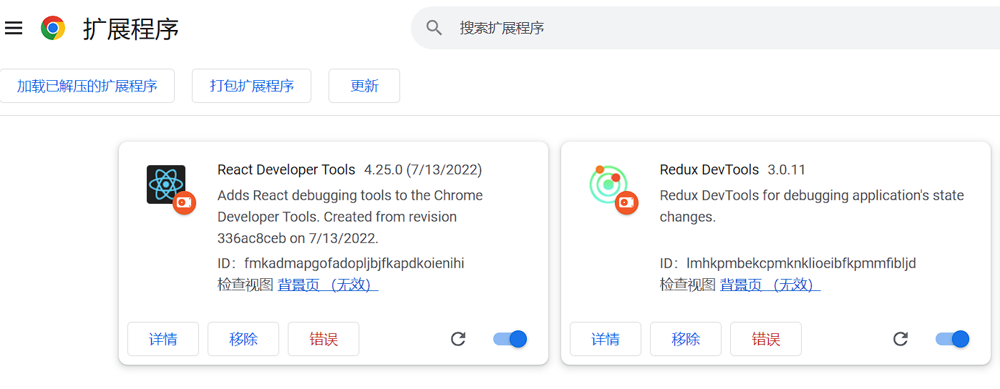

下面这个是 React Developer Tools

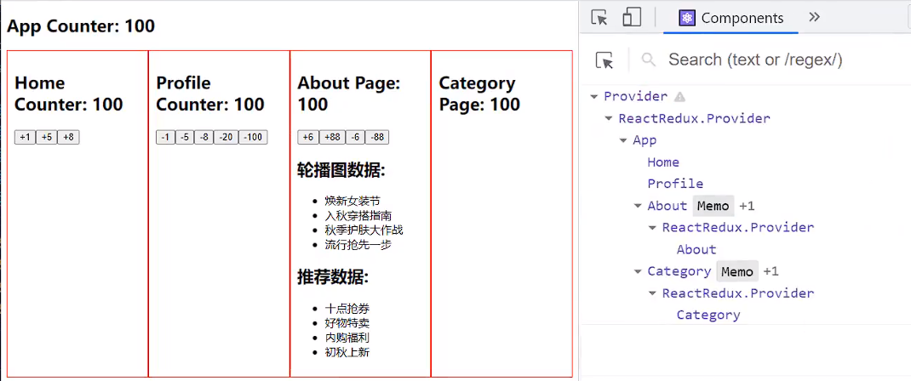

但是安装了 Redux DevTools 这个插件，默认是什么都看不见，因为它建议我们在开发环境把这个打开，生产环境关闭。

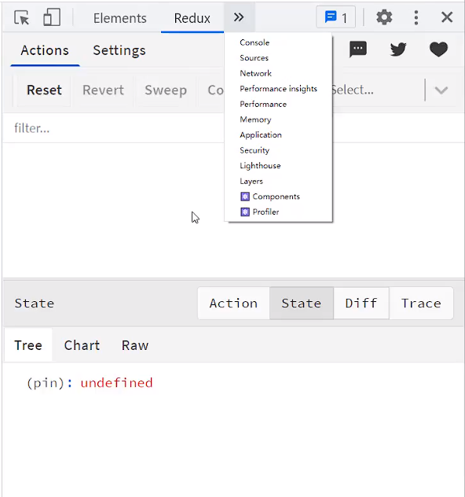

那么开发环境如何打开呢？需要修改 store/index.js 文件

```javascript
import { createStore, applyMiddleware, compose } from "redux";
import thunk from "redux-thunk";
import reducer from "./reducer";

// 正常情况下 store.dispatch(object)
// 想要派发函数 store.dispatch(function)

// redux-devtools
const composeEnhancers = window.__REDUX_DEVTOOLS_EXTENSION_COMPOSE__ || compose;
const store = createStore(reducer, composeEnhancers(applyMiddleware(thunk)));

export default store;
```

开启之后，就能看到了

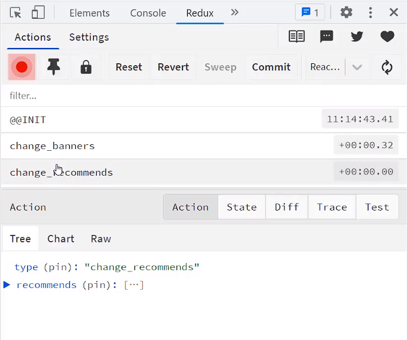

Action 是派发的 action，State 是所有的 state 数据，Diff 可以看数据的变化，比如 counter 从 100 变成 101，Test 是单元测试。

Trace 是跟踪代码执行，可以看代码在哪里执行，默认是没有开启，如果想要开启，需要进行下面配置：

store/index.js

```javascript
import { createStore, applyMiddleware, compose } from "redux";
import thunk from "redux-thunk";
import reducer from "./reducer";

// 正常情况下 store.dispatch(object)
// 想要派发函数 store.dispatch(function)

// redux-devtools
const composeEnhancers =
  window.__REDUX_DEVTOOLS_EXTENSION_COMPOSE__({ trace: true }) || compose; // 开启Trace
const store = createStore(reducer, composeEnhancers(applyMiddleware(thunk)));

export default store;
```

## **Reducer 代码拆分**

**我们先来理解一下，为什么这个函数叫 reducer？**

**我们来看一下目前我们的 reducer：**

当前这个 reducer 既有处理 counter 的代码，又有处理 home 页面的数据；

后续 counter 相关的状态或 home 相关的状态会进一步变得更加复杂；

我们也会继续添加其他的相关状态，比如购物车、分类、歌单等等；

如果将所有的状态都放到一个 reducer 中进行管理，随着项目的日趋庞大，必然会造成代码臃肿、难以维护。

**因此，我们可以对 reducer 进行拆分：**

我们先抽取一个对 counter 处理的 reducer；

再抽取一个对 home 处理的 reducer；

将它们合并起来；

## **Reducer 文件拆分**

**目前我们已经将不同的状态处理拆分到不同的 reducer 中，我们来思考：**

虽然已经放到不同的函数了，但是这些函数的处理依然是在同一个文件中，代码非常的混乱；

另外关于 reducer 中用到的 constant、action 等我们也依然是在同一个文件中；


## **combineReducers 函数**

**目前我们合并的方式是通过每次调用 reducer 函数自己来返回一个新的对象。**

**事实上，redux 给我们提供了一个 combineReducers 函数可以方便的让我们对多个 reducer 进行合并：**

**那么 combineReducers 是如何实现的呢？**

事实上，它也是将我们传入的 reducers 合并到一个对象中，最终返回一个 combination 的函数（相当于我们之前的 reducer 函数了）；

在执行 combination 函数的过程中，它会通过判断前后返回的数据是否相同来决定返回之前的 state 还是新的 state；

新的 state 会触发订阅者发生对应的刷新，而旧的 state 可以有效的组织订阅者发生刷新；

store/index.js

```javascript
import { createStore, applyMiddleware, compose } from "redux";
import thunk from "redux-thunk";
import reducer from "./reducer";

import counterReducer from "./counter";
import homeReducer from "./home";
import userReducer from "./user";

// 正常情况下 store.dispatch(object)
// 想要派发函数 store.dispatch(function)

// 将多个reducer合并在一起
const reducer = combineReducers({
  counter: counterReducer,
  home: homeReducer,
  user: userReducer,
});

// redux-devtools
const composeEnhancers =
  window.__REDUX_DEVTOOLS_EXTENSION_COMPOSE__({ trace: true }) || compose; // 开启Trace
const store = createStore(reducer, composeEnhancers(applyMiddleware(thunk)));

export default store;
```

下面是 counter 模块的代码

store/counter/index.js

```javascript
import reducer from "./reducer";

export default reducer;
export * from "./actionCreators";
```

store/counter/reducer.js

```javascript
import * as actionTypes from "./constants";

const initialState = {
  counter: 200,
};

function reducer(state = initialState, action) {
  switch (action.type) {
    case actionTypes.ADD_NUMBER:
      return { ...state, counter: state.counter + action.num };
    case actionTypes.SUB_NUMBER:
      return { ...state, counter: state.counter - action.num };
    default:
      return state;
  }
}

export default reducer;
```

store/counter/actionCreators.js

```javascript
import * as actionTypes from "./constants";

export const addNumberAction = (num) => ({
  type: actionTypes.ADD_NUMBER,
  num,
});

export const subNumberAction = (num) => ({
  type: actionTypes.SUB_NUMBER,
  num,
});
```

store/counter/constants.js

```javascript
export const ADD_NUMBER = "add_number";
export const SUB_NUMBER = "sub_number";
```

下面是 home 模块的代码

store/home/index.js

```javascript
import reducer from "./reducer";

export default reducer;
export * from "./actionCreators";
```

store/home/reducer.js

```javascript
import * as actionTypes from "./constants";

const initialState = {
  banners: [],
  recommends: [],
};

function reducer(state = initialState, action) {
  switch (action.type) {
    case actionTypes.CHANGE_BANNERS:
      return { ...state, banners: action.banners };
    case actionTypes.CHANGE_RECOMMENDS:
      return { ...state, recommends: action.recommends };
    default:
      return state;
  }
}

export default reducer;
```

store/home/actionCreators.js

```javascript
import * as actionTypes from "./constants";
import axios from "axios";

export const changeBannersAction = (banners) => ({
  type: actionTypes.CHANGE_BANNERS,
  banners,
});

export const changeRecommendsAction = (recommends) => ({
  type: actionTypes.CHANGE_RECOMMENDS,
  recommends,
});

export const fetchHomeMultidataAction = () => {
  return function (dispatch) {
    axios.get("http://123.207.32.32:8000/home/multidata").then((res) => {
      const banners = res.data.data.banner.list;
      const recommends = res.data.data.recommend.list;

      dispatch(changeBannersAction(banners));
      dispatch(changeRecommendsAction(recommends));
    });
  };
};
```

store/home/constants.js

```javascript
export const CHANGE_BANNERS = "change_banners";
export const CHANGE_RECOMMENDS = "change_recommends";
```

About.jsx

```javascript
import React, { PureComponent } from "react";
import { connect } from "react-redux";
import { addNumberAction, subNumberAction } from "../store/counter";

export class About extends PureComponent {
  calcNumber(num, isAdd) {
    if (isAdd) {
      this.props.addNumber(num);
    } else {
      this.props.subNumber(num);
    }
  }

  render() {
    const { counter, banners, recommends } = this.props;

    return (
      <div>
        <h2>About Page: {counter}</h2>
        <div>
          <button onClick={(e) => this.calcNumber(6, true)}>+6</button>
          <button onClick={(e) => this.calcNumber(88, true)}>+88</button>
          <button onClick={(e) => this.calcNumber(6, false)}>-6</button>
          <button onClick={(e) => this.calcNumber(88, false)}>-88</button>
        </div>
        <div className="banner">
          <h2>轮播图数据:</h2>
          <ul>
            {banners.map((item, index) => {
              return <li key={index}>{item.title}</li>;
            })}
          </ul>
        </div>
        <div className="recommend">
          <h2>推荐数据:</h2>
          <ul>
            {recommends.map((item, index) => {
              return <li key={index}>{item.title}</li>;
            })}
          </ul>
        </div>
      </div>
    );
  }
}

const mapStateToProps = (state) => ({
  counter: state.counter.counter, // 取值要先获取模块
  banners: state.home.banners,
  recommends: state.home.recommends,
});

const mapDispatchToProps = (dispatch) => ({
  addNumber(num) {
    dispatch(addNumberAction(num));
  },
  subNumber(num) {
    dispatch(subNumberAction(num));
  },
});

export default connect(mapStateToProps, mapDispatchToProps)(About);
```

combineReducers 实现原理(了解)

```javascript
import { createStore, applyMiddleware, compose } from "redux";
import thunk from "redux-thunk";
import reducer from "./reducer";

import counterReducer from "./counter";
import homeReducer from "./home";
import userReducer from "./user";

// 正常情况下 store.dispatch(object)
// 想要派发函数 store.dispatch(function)

// 将多个reducer合并在一起
// const reducer = combineReducers({
//   counter: counterReducer,
//   home: homeReducer,
//   user: userReducer
// })

// combineReducers实现原理(了解)
function reducer(state = {}, action) {
  // 源码内部是判断action有没有创建新的值，有的话才创建一个新的对象，我们这里是直接返回一个新对象
  // 返回一个对象, store的state
  return {
    counter: counterReducer(state.counter, action),
    home: homeReducer(state.home, action),
    user: userReducer(state.user, action),
  };
}

// redux-devtools
const composeEnhancers =
  window.__REDUX_DEVTOOLS_EXTENSION_COMPOSE__({ trace: true }) || compose; // 开启Trace
const store = createStore(reducer, composeEnhancers(applyMiddleware(thunk)));

export default store;
```
