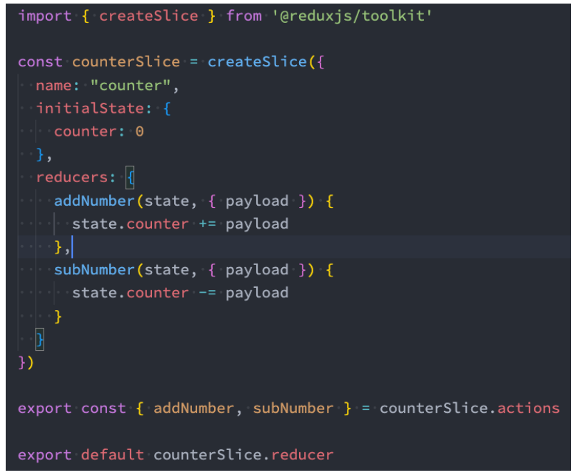
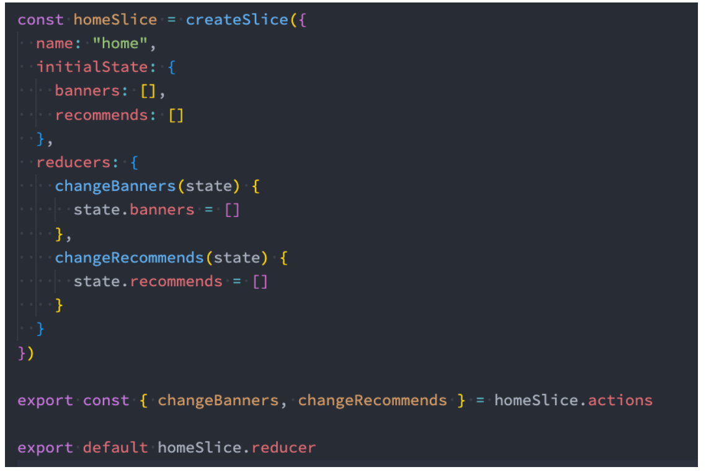
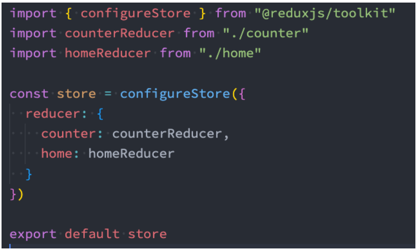
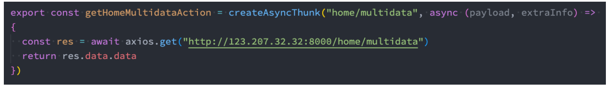
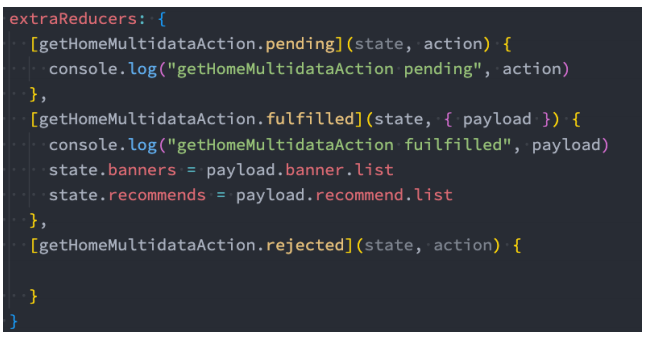
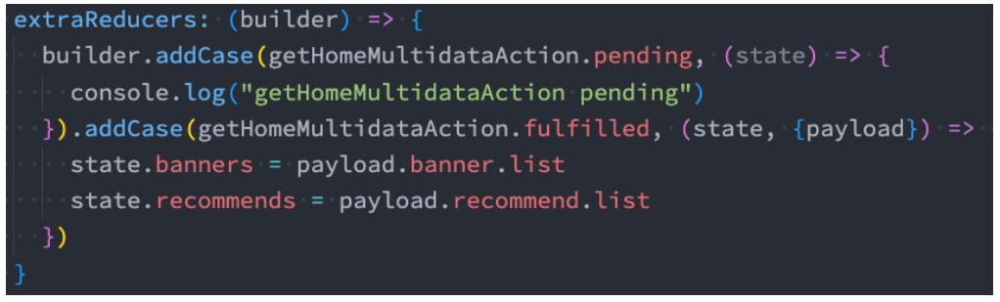
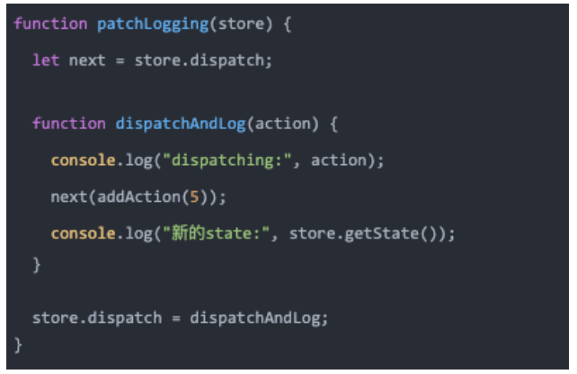
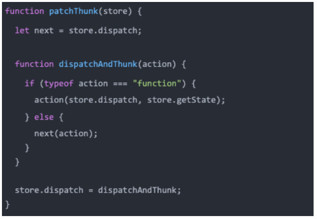
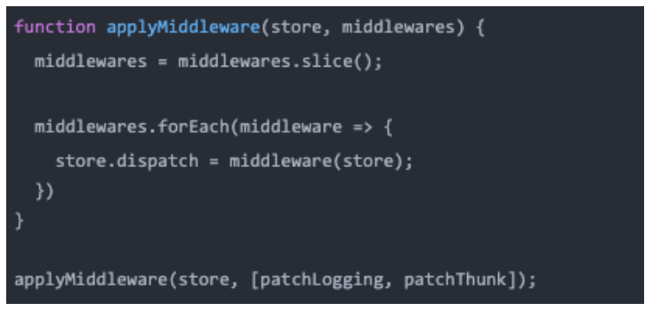
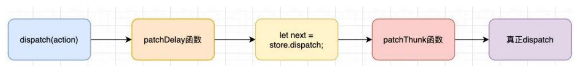

## **认识 Redux Toolkit**

**Redux Toolkit 是官方推荐的编写 Redux 逻辑的方法。**

在前面我们学习 Redux 的时候应该已经发现，redux 的编写逻辑过于的繁琐和麻烦。

并且代码通常分拆在多个文件中（虽然也可以放到一个文件管理，但是代码量过多，不利于管理）；

Redux Toolkit 包旨在成为编写 Redux 逻辑的标准方式，从而解决上面提到的问题；

在很多地方为了称呼方便，也将之称为“RTK”；

**安装 Redux Toolkit：**

```json
npm install @reduxjs/toolkit react-redux
```

**Redux Toolkit 的核心 API 主要是如下几个：**

configureStore：包装 createStore 以提供简化的配置选项和良好的默认值。它可以自动组合你的 slice reducer，添加你提供的任何 Redux 中间件，redux-thunk 默认包含，并启用 Redux DevTools Extension。

createSlice：接受 reducer 函数的对象、切片名称和初始状态值，并自动生成切片 reducer，并带有相应的 actions。

createAsyncThunk: 接受一个动作类型字符串和一个返回承诺的函数，并生成一个 pending/fulfilled/rejected 基于该承诺分派动作类型的 thunk

## **重构代码 – 创建 counter 的 reducer**

**我们先对 counter 的 reducer 进行重构：** **通过 createSlice 创建一个 slice。**

**createSlice 主要包含如下几个参数：**

name：用户标记 slice 的名词

在之后的 redux-devtool 中会显示对应的名词；

initialState：初始化值

第一次初始化时的值；

reducers：相当于之前的 reducer 函数

对象类型，并且可以添加很多的函数；

函数类似于 redux 原来 reducer 中的一个 case 语句；

函数的参数：

- 参数一：state

- 参数二：调用这个 action 时，传递的 action 参数；

**createSlice 返回值是一个对象，包含所有的 actions；**



## **重构代码 – 创建 home 的 reducer**



## **store 的创建**

**configureStore 用于创建 store 对象，常见参数如下：**

reducer，将 slice 中的 reducer 可以组成一个对象传入此处；

middleware：可以使用参数，传入其他的中间件（自行了解）；

devTools：是否配置 devTools 工具，默认为 true；



## **Redux Toolkit 的异步操作**

**在之前的开发中，我们通过 redux-thunk 中间件让 dispatch 中可以进行异步操作。**

**Redux Toolkit 默认已经给我们集成了 Thunk 相关的功能：createAsyncThunk**



**当 createAsyncThunk 创建出来的 action 被 dispatch 时，会存在三种状态：**

pending：action 被发出，但是还没有最终的结果；

fulfilled：获取到最终的结果（有返回值的结果）；

rejected：执行过程中有错误或者抛出了异常；

**我们可以在 createSlice 的 entraReducer 中监听这些结果：**



src/index.js

```javascript
import React from "react";
import ReactDOM from "react-dom/client";
import { Provider } from "react-redux";
import App from "./App";
import store from "./store";

const root = ReactDOM.createRoot(document.getElementById("root"));
root.render(
  <Provider store={store}>
    {" "}
    // 使用Provider
    <App />
  </Provider>
);
```

src/store/index.js

```javascript
import { configureStore } from "@reduxjs/toolkit";

import counterReducer from "./features/counter";
import homeReducer from "./features/home";

const store = configureStore({
  reducer: {
    counter: counterReducer,
    home: homeReducer,
  },
});

export default store;
```

store/features/counter.js

```javascript
import { createSlice } from "@reduxjs/toolkit";

const counterSlice = createSlice({
  name: "counter", // 这里的name主要是为了能在devtools工具看到
  initialState: {
    counter: 888,
  },
  reducers: {
    addNumber(state, { payload }) {
      // 第2个参数是个对象，里面有type和payload，type一般很少用到
      state.counter = state.counter + payload;
    },
    subNumber(state, { payload }) {
      state.counter = state.counter - payload;
    },
  },
});

export const { addNumber, subNumber } = counterSlice.actions;
export default counterSlice.reducer;
```

store/features/home.js

```javascript
import { createSlice, createAsyncThunk } from "@reduxjs/toolkit";
import axios from "axios";

export const fetchHomeMultidataAction = createAsyncThunk(
  "fetch/homemultidata", // 这里的这个参数也是为了能在devtools工具看到
  async () => {
    // 1.发送网络请求, 获取数据
    const res = await axios.get("http://123.207.32.32:8000/home/multidata");
    // 2.返回结果, 那么action状态会变成fulfilled状态
    return res.data;
  }
);

const homeSlice = createSlice({
  name: "home",
  initialState: {
    banners: [],
    recommends: [],
  },
  reducers: {
    changeBanners(state, { payload }) {
      state.banners = payload;
    },
    changeRecommends(state, { payload }) {
      state.recommends = payload;
    },
  },
  extraReducers: {
    [fetchHomeMultidataAction.pending](state, action) {
      console.log("fetchHomeMultidataAction pending");
    },
    [fetchHomeMultidataAction.fulfilled](state, { payload }) {
      state.banners = payload.data.banner.list;
      state.recommends = payload.data.recommend.list;
    },
    [fetchHomeMultidataAction.rejected](state, action) {
      console.log("fetchHomeMultidataAction rejected");
    },
  },
});

export const { changeBanners, changeRecommends } = homeSlice.actions;
export default homeSlice.reducer;
```

pages/Profile.jsx

```javascript
import React, { PureComponent } from "react";
import { connect } from "react-redux";
import { subNumber } from "../store/features/counter";

export class Profile extends PureComponent {
  subNumber(num) {
    this.props.subNumber(num);
  }

  render() {
    const { counter, banners, recommends } = this.props;

    return (
      <div>
        <h2>Page Counter: {counter}</h2>
        <button onClick={(e) => this.subNumber(5)}>-5</button>
        <button onClick={(e) => this.subNumber(8)}>-8</button>

        <div className="banner">
          <h2>轮播图展示</h2>
          <ul>
            {banners.map((item, index) => {
              return <li key={index}>{item.title}</li>;
            })}
          </ul>
        </div>
        <div className="recommend">
          <h2>推荐的展示</h2>
          <ul>
            {recommends.map((item, index) => {
              return <li key={index}>{item.title}</li>;
            })}
          </ul>
        </div>
      </div>
    );
  }
}

const mapStateToProps = (state) => ({
  counter: state.counter.counter,
  banners: state.home.banners,
  recommends: state.home.recommends,
});

const mapDispatchToProps = (dispatch) => ({
  subNumber(num) {
    dispatch(subNumber(num));
  },
});

export default connect(mapStateToProps, mapDispatchToProps)(Profile); // 使用connect
```

pages/Home.jsx

```javascript
import React, { PureComponent } from "react";
// import axios from "axios"
import { connect } from "react-redux";
import { addNumber } from "../store/features/counter";
import { fetchHomeMultidataAction } from "../store/features/home";

// import store from "../store"
// import { changeBanners, changeRecommends } from '../store/features/home'

export class Home extends PureComponent {
  componentDidMount() {
    this.props.fetchHomeMultidata();

    //   axios.get("http://123.207.32.32:8000/home/multidata").then(res => {
    //     const banners = res.data.data.banner.list
    //     const recommends = res.data.data.recommend.list

    //     store.dispatch(changeBanners(banners))
    //     store.dispatch(changeRecommends(recommends))
    //   })
  }

  addNumber(num) {
    this.props.addNumber(num);
  }

  render() {
    const { counter } = this.props;

    return (
      <div>
        <h2>Home Counter: {counter}</h2>
        <button onClick={(e) => this.addNumber(5)}>+5</button>
        <button onClick={(e) => this.addNumber(8)}>+8</button>
        <button onClick={(e) => this.addNumber(18)}>+18</button>
      </div>
    );
  }
}

const mapStateToProps = (state) => ({
  counter: state.counter.counter,
});

const mapDispatchToProps = (dispatch) => ({
  addNumber(num) {
    dispatch(addNumber(num));
  },
  fetchHomeMultidata() {
    dispatch(fetchHomeMultidataAction());
  },
});

export default connect(mapStateToProps, mapDispatchToProps)(Home);
```

## **extraReducer 的另外一种写法**

**extraReducer 还可以传入一个函数，函数接受一个 builder 参数。**

我们可以向 builder 中添加 case 来监听异步操作的结果：



这是另外一种写法

store/features/home.js

```javascript
import { createSlice, createAsyncThunk } from "@reduxjs/toolkit";
import axios from "axios";

export const fetchHomeMultidataAction = createAsyncThunk(
  "fetch/homemultidata",
  async () => {
    // console.log(extraInfo, dispatch, getState)
    // 1.发送网络请求, 获取数据
    const res = await axios.get("http://123.207.32.32:8000/home/multidata");

    // 3.返回结果, 那么action状态会变成fulfilled状态
    return res.data;
  }
);

const homeSlice = createSlice({
  name: "home",
  initialState: {
    banners: [],
    recommends: [],
  },
  reducers: {
    changeBanners(state, { payload }) {
      state.banners = payload;
    },
    changeRecommends(state, { payload }) {
      state.recommends = payload;
    },
  },
  // extraReducers: {
  //   [fetchHomeMultidataAction.pending](state, action) {
  //     console.log("fetchHomeMultidataAction pending")
  //   },
  //   [fetchHomeMultidataAction.fulfilled](state, { payload }) {
  //     state.banners = payload.data.banner.list
  //     state.recommends = payload.data.recommend.list
  //   },
  //   [fetchHomeMultidataAction.rejected](state, action) {
  //     console.log("fetchHomeMultidataAction rejected")
  //   }
  // }
  extraReducers: (builder) => {
    builder
      .addCase(fetchHomeMultidataAction.pending, (state, action) => {
        console.log("fetchHomeMultidataAction pending");
      })
      .addCase(fetchHomeMultidataAction.fulfilled, (state, { payload }) => {
        state.banners = payload.data.banner.list;
        state.recommends = payload.data.recommend.list;
      });
  },
});

export const { changeBanners, changeRecommends } = homeSlice.actions;
export default homeSlice.reducer;
```

除此之外还有第三种写法，这种写法可以传递参数，在派发 fetchHomeMultidataAction 的时候

pages/Home.jsx

```javascript
import React, { PureComponent } from "react";
// import axios from "axios"
import { connect } from "react-redux";
import { addNumber } from "../store/features/counter";
import { fetchHomeMultidataAction } from "../store/features/home";

// import store from "../store"
// import { changeBanners, changeRecommends } from '../store/features/home'

export class Home extends PureComponent {
  componentDidMount() {
    this.props.fetchHomeMultidata();

    //   axios.get("http://123.207.32.32:8000/home/multidata").then(res => {
    //     const banners = res.data.data.banner.list
    //     const recommends = res.data.data.recommend.list

    //     store.dispatch(changeBanners(banners))
    //     store.dispatch(changeRecommends(recommends))
    //   })
  }

  addNumber(num) {
    this.props.addNumber(num);
  }

  render() {
    const { counter } = this.props;

    return (
      <div>
        <h2>Home Counter: {counter}</h2>
        <button onClick={(e) => this.addNumber(5)}>+5</button>
        <button onClick={(e) => this.addNumber(8)}>+8</button>
        <button onClick={(e) => this.addNumber(18)}>+18</button>
      </div>
    );
  }
}

const mapStateToProps = (state) => ({
  counter: state.counter.counter,
});

const mapDispatchToProps = (dispatch) => ({
  addNumber(num) {
    dispatch(addNumber(num));
  },
  fetchHomeMultidata() {
    dispatch(fetchHomeMultidataAction({ name: "why", age: 18 })); // 这里传递参数
  },
});

export default connect(mapStateToProps, mapDispatchToProps)(Home);
```

store/features/home.js

```javascript
import { createSlice, createAsyncThunk } from "@reduxjs/toolkit";
import axios from "axios";

export const fetchHomeMultidataAction = createAsyncThunk(
  "fetch/homemultidata",
  async (extraInfo, { dispatch, getState }) => {
    // console.log(extraInfo, dispatch, getState) // extraInfo就是 {name: "why", age: 18}
    // 1.发送网络请求, 获取数据
    const res = await axios.get("http://123.207.32.32:8000/home/multidata");

    // 2.取出数据, 并且在此处直接dispatch操作(可以不做)
    const banners = res.data.data.banner.list;
    const recommends = res.data.data.recommend.list;
    dispatch(changeBanners(banners));
    dispatch(changeRecommends(recommends));

    // 3.返回结果, 那么action状态会变成fulfilled状态
    return res.data;
  }
);

const homeSlice = createSlice({
  name: "home",
  initialState: {
    banners: [],
    recommends: [],
  },
  reducers: {
    changeBanners(state, { payload }) {
      state.banners = payload;
    },
    changeRecommends(state, { payload }) {
      state.recommends = payload;
    },
  },
  // extraReducers: {
  //   [fetchHomeMultidataAction.pending](state, action) {
  //     console.log("fetchHomeMultidataAction pending")
  //   },
  //   [fetchHomeMultidataAction.fulfilled](state, { payload }) {
  //     state.banners = payload.data.banner.list
  //     state.recommends = payload.data.recommend.list
  //   },
  //   [fetchHomeMultidataAction.rejected](state, action) {
  //     console.log("fetchHomeMultidataAction rejected")
  //   }
  // }
  extraReducers: (builder) => {
    // builder.addCase(fetchHomeMultidataAction.pending, (state, action) => {
    //   console.log("fetchHomeMultidataAction pending")
    // }).addCase(fetchHomeMultidataAction.fulfilled, (state, { payload }) => {
    //   state.banners = payload.data.banner.list
    //   state.recommends = payload.data.recommend.list
    // })
  },
});

export const { changeBanners, changeRecommends } = homeSlice.actions;
export default homeSlice.reducer;
```

这三种写法开发中更推荐使用第一种写法，这也是官方推荐的写法。

## **Redux Toolkit 的数据不可变性（了解）**

**在 React 开发中，我们总是会强调数据的不可变性：**

无论是类组件中的 state，还是 redux 中管理的 state；

事实上在整个 JavaScript 编码过程中，数据的不可变性都是非常重要的；

**所以在前面我们经常会进行浅拷贝来完成某些操作，但是浅拷贝事实上也是存在问题的：**

比如过大的对象，进行浅拷贝也会造成性能的浪费；

比如浅拷贝后的对象，在深层改变时，依然会对之前的对象产生影响；

**事实上 Redux Toolkit 底层使用了 immerjs 的一个库来保证数据的不可变性。**

**在我们公众号的一片文章中也有专门讲解 immutable-js 库的底层原理和使用方法：**

https://mp.weixin.qq.com/s/hfeCDCcodBCGS5GpedxCGg

**为了节约内存，又出现了一个新的算法：Persistent Data Structure（持久化数据结构或一致性数据结构）；**

用一种数据结构来保存数据；

当数据被修改时，会返回一个对象，但是新的对象会尽可能的利用之前的数据结构而不会对内存造成浪费；

## **自定义 connect 函数**

hoc/connect.js

```javascript
// connect的参数:
// 参数一: 函数
// 参数二: 函数
// 返回值: 函数 => 高阶组件

import { PureComponent } from "react";
import store from "../store";

export function connect(mapStateToProps, mapDispatchToProps, store) {
  // 高阶组件: 函数
  return function (WrapperComponent) {
    class NewComponent extends PureComponent {
      constructor(props) {
        super(props);

        this.state = mapStateToProps(store.getState());
      }

      componentDidMount() {
        this.unsubscribe = store.subscribe(() => {
          // this.forceUpdate()
          this.setState(mapStateToProps(store.getState())); // 用到哪些数据变化了再重新render
        });
      }

      componentWillUnmount() {
        this.unsubscribe();
      }

      render() {
        const stateObj = mapStateToProps(store.getState());
        const dispatchObj = mapDispatchToProps(store.dispatch);
        return (
          <WrapperComponent {...this.props} {...stateObj} {...dispatchObj} />
        );
      }
    }

    NewComponent.contextType = StoreContext;

    return NewComponent;
  };
}
```

pages/About.jsx

```javascript
import React, { PureComponent } from "react";
import { connect } from "../hoc";
import { addNumber } from "../store/features/counter";

export class About extends PureComponent {
  render() {
    const { counter } = this.props;

    return (
      <div>
        <h2>About Counter: {counter}</h2>
      </div>
    );
  }
}

const mapStateToProps = (state) => ({
  counter: state.counter.counter,
});

const mapDispatchToProps = (dispatch) => ({
  addNumber(num) {
    dispatch(addNumber(num));
  },
});

export default connect(mapStateToProps, mapDispatchToProps)(About);
```

## **context 处理 store**

**但是上面的 connect 函数有一个很大的缺陷：依赖导入的 store**

如果我们将其封装成一个独立的库，需要依赖用于创建的 store，我们应该如何去获取呢？

难道让用户来修改我们的源码吗？不太现实；

**正确的做法是我们提供一个 Provider，Provider 来自于我们创建的 Context，让用户将 store 传入到 value 中即可；**

hoc/connect.js

```javascript
// connect的参数:
// 参数一: 函数
// 参数二: 函数
// 返回值: 函数 => 高阶组件

import { PureComponent } from "react";
import { StoreContext } from "./StoreContext";
// import store from "../store"

export function connect(mapStateToProps, mapDispatchToProps) {
  // 高阶组件: 函数
  return function (WrapperComponent) {
    class NewComponent extends PureComponent {
      constructor(props, context) {
        super(props);

        this.state = mapStateToProps(context.getState());
      }

      componentDidMount() {
        this.unsubscribe = this.context.subscribe(() => {
          // this.forceUpdate()
          this.setState(mapStateToProps(this.context.getState()));
        });
      }

      componentWillUnmount() {
        this.unsubscribe();
      }

      render() {
        const stateObj = mapStateToProps(this.context.getState());
        const dispatchObj = mapDispatchToProps(this.context.dispatch);
        return (
          <WrapperComponent {...this.props} {...stateObj} {...dispatchObj} />
        );
      }
    }

    NewComponent.contextType = StoreContext;

    return NewComponent;
  };
}
```

hoc/StoreContext.js

```javascript
import { createContext } from "react";

export const StoreContext = createContext();
```

hoc/index.js

```javascript
export { StoreContext } from "./StoreContext";
export { connect } from "./connect";
```

src/index.js

```javascript
import React from "react";
import ReactDOM from "react-dom/client";
import { Provider } from "react-redux";
import { StoreContext } from "./hoc";
import App from "./App";
import store from "./store";

const root = ReactDOM.createRoot(document.getElementById("root"));
root.render(
  // <React.StrictMode>
  <Provider store={store}>
    <StoreContext.Provider value={store}>
      {" "}
      // 把store传进去
      <App />
    </StoreContext.Provider>
  </Provider>
  // </React.StrictMode>
);
```

## **打印日志需求**

**前面我们已经提过，中间件的目的是在 redux 中插入一些自己的操作：**

比如我们现在有一个需求，在 dispatch 之前，打印一下本次的 action 对象，dispatch 完成之后可以打印一下最新的 store state；

也就是我们需要将对应的代码插入到 redux 的某部分，让之后所有的 dispatch 都可以包含这样的操作；

**如果没有中间件，我们是否可以实现类似的代码呢？ 可以在派发的前后进行相关的打印。**

**但是这种方式缺陷非常明显：**

首先，每一次的 dispatch 操作，我们都需要在前面加上这样的逻辑代码；

其次，存在大量重复的代码，会非常麻烦和臃肿；

**是否有一种更优雅的方式来处理这样的相同逻辑呢？**

我们可以将代码封装到一个独立的函数中

**但是这样的代码有一个非常大的缺陷：**

调用者（使用者）在使用我的 dispatch 时，必须使用我另外封装的一个函数 dispatchAndLog；

显然，对于调用者来说，很难记住这样的 API，更加习惯的方式是直接调用 dispatch；

## **修改 dispatch**

**事实上，我们可以利用一个 hack 一点的技术：Monkey Patching，利用它可以修改原有的程序逻辑；**

**我们对代码进行如下的修改：**

这样就意味着我们已经直接修改了 dispatch 的调用过程；

在调用 dispatch 的过程中，真正调用的函数其实是 dispatchAndLog；

**当然，我们可以将它封装到一个模块中，只要调用这个模块中的函数，就可以对 store 进行这样的处理：**



## **thunk 需求**

**redux-thunk 的作用：**

我们知道 redux 中利用一个中间件 redux-thunk 可以让我们的 dispatch 不再只是处理对象，并且可以处理函数；

那么 redux-thunk 中的基本实现过程是怎么样的呢？事实上非常的简单。

**我们来看下面的代码：**

我们又对 dispatch 进行转换，这个 dispatch 会判断传入的



## **合并中间件**

**单个调用某个函数来合并中间件并不是特别的方便，我们可以封装一个函数来实现所有的中间件合并：**



**我们来理解一下上面操作之后，代码的流程：**



**当然，真实的中间件实现起来会更加的灵活，这里我们仅仅做一个抛砖引玉，有兴趣可以参考 redux 合并中间件的源码流程。**

store/index.js

```javascript
import { createStore, combineReducers } from "redux";
import { log, thunk, applyMiddleware } from "./middleware";
// import thunk from "redux-thunk"

import counterReducer from "./counter";
import homeReducer from "./home";
import userReducer from "./user";

// 正常情况下 store.dispatch(object)
// 想要派发函数 store.dispatch(function)

// 将两个reducer合并在一起
const reducer = combineReducers({
  counter: counterReducer,
  home: homeReducer,
  user: userReducer,
});

// combineReducers实现原理(了解)
// function reducer(state = {}, action) {
//   // 返回一个对象, store的state
//   return {
//     counter: counterReducer(state.counter, action),
//     home: homeReducer(state.home, action),
//     user: userReducer(state.user, action)
//   }
// }

// redux-devtools
const store = createStore(reducer);

applyMiddleware(store, log, thunk); // 应用多个中间件

export default store;
```

store/middleware/index.js

```javascript
import log from "./log";
import thunk from "./thunk";
import applyMiddleware from "./applyMiddleware";

export { log, thunk, applyMiddleware };
```

store/middleware/log.js

实现打印日志的中间件

```javascript
function log(store) {
  const next = store.dispatch;

  function logAndDispatch(action) {
    console.log("当前派发的action:", action);
    // 真正派发的代码: 使用之前的dispatch进行派发
    next(action);
    console.log("派发之后的结果:", store.getState());
  }

  // monkey patch: 猴补丁 => 篡改现有的代码, 对整体的执行逻辑进行修改
  store.dispatch = logAndDispatch;
}

export default log;
```

store/middleware/thunk.js

实现类似于 redux-thunk 这样的中间件

```javascript
function thunk(store) {
  const next = store.dispatch;
  function dispatchThunk(action) {
    if (typeof action === "function") {
      action(store.dispatch, store.getState);
    } else {
      next(action);
    }
  }
  store.dispatch = dispatchThunk;
}

export default thunk;
```

store/middleware/applyMiddleware.js

实现应用多个中间件

```javascript
function applyMiddleware(store, ...fns) {
  fns.forEach((fn) => {
    fn(store);
  });
}

export default applyMiddleware;
```

## **React 中的 state 如何管理**

**我们学习了 Redux 用来管理我们的应用状态，并且非常好用（当然，你学会前提下，没有学会，好好回顾一下）。**

**目前我们已经主要学习了三种状态管理方式：**

方式一：组件中自己的 state 管理；

方式二：Context 数据的共享状态；

方式三：Redux 管理应用状态；

**在开发中如何选择呢？**

首先，这个没有一个标准的答案；

某些用户，选择将所有的状态放到 redux 中进行管理，因为这样方便追踪和共享；

有些用户，选择将某些组件自己的状态放到组件内部进行管理；

有些用户，将类似于主题、用户信息等数据放到 Context 中进行共享和管理；

做一个开发者，到底选择怎样的状态管理方式，是你的工作之一，可以一个最好的平衡方式（Find a balance that works for you, and go with it.）；

## **React 中的 state 如何管理**

**Redux 的作者有给出自己的建议：**


**目前项目中我采用的 state 管理方案：**

UI 相关的组件内部可以维护的状态，在组件内部自己来维护；

大部分需要共享的状态，都交给 redux 来管理和维护；

从服务器请求的数据（包括请求的操作），交给 redux 来维护；

**当然，根据不同的情况会进行适当的调整，在后续学习项目实战时，我也会再次讲解以实战的角度来设计数据的管理方案**。
