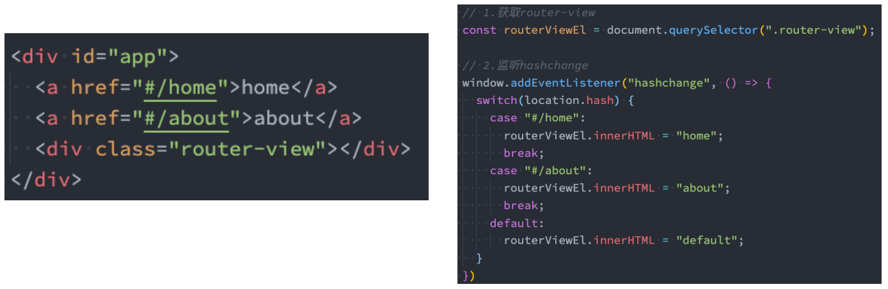
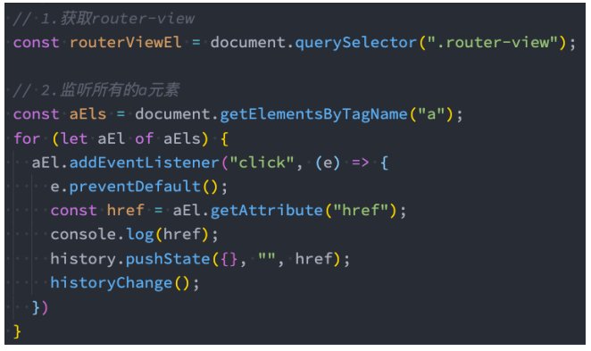
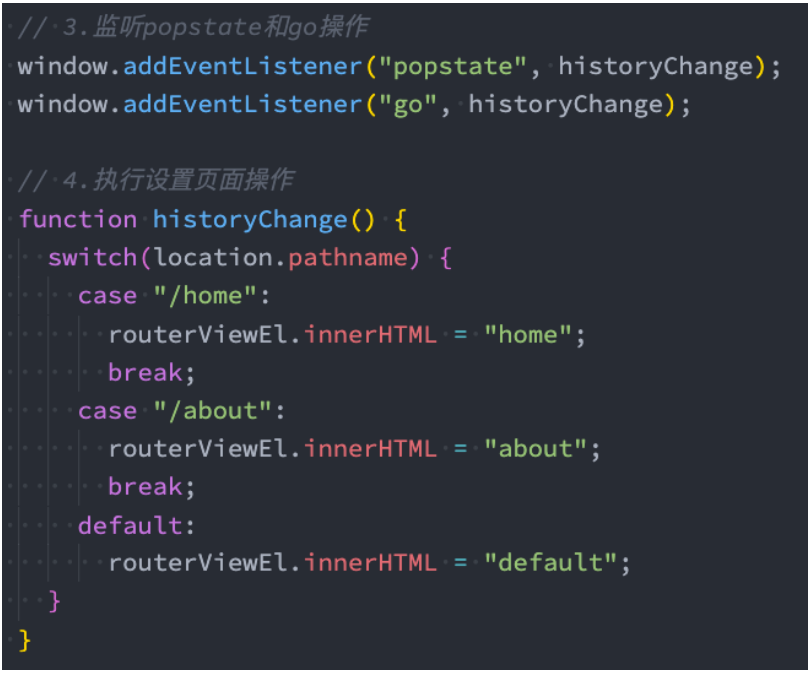

## **认识前端路由**

**路由其实是网络工程中的一个术语：**

在架构一个网络时，非常重要的两个设备就是路由器和交换机。

当然，目前在我们生活中路由器也是越来越被大家所熟知，因为我们生活中都会用到路由器：

事实上，路由器主要维护的是一个映射表；

映射表会决定数据的流向；

**路由的概念在软件工程中出现，最早是在后端路由中实现的，原因是 web 的发展主要经历了这样一些阶段：**

后端路由阶段；

前后端分离阶段；

单页面富应用（SPA）；

## **后端路由阶段**

早期的网站开发整个 HTML 页面是由**服务器来渲染**的

服务器直接生产渲染好对应的 HTML 页面, 返回给客户端进行展示

但是, 一个网站, **这么多页面服务器如何处理呢?**

一个页面有自己对应的网址, 也就是 URL；

URL 会发送到服务器, 服务器会通过正则对该 URL 进行匹配, 并且最后交给一个 Controller 进行处理；

Controller 进行各种处理, 最终生成 HTML 或者数据, 返回给前端.

上面的这种操作, 就是**后端路由**：

当我们页面中需要请求不同的**路径**内容时, 交给服务器来进行处理, 服务器渲染好整个页面, 并且将页面返回给客户端.

这种情况下渲染好的页面, 不需要单独加载任何的 js 和 css, 可以直接交给浏览器展示, 这样也有利于 SEO 的优化.

**后端路由的缺点:**

一种情况是整个页面的模块由后端人员来编写和维护的；

另一种情况是前端开发人员如果要开发页面, 需要通过 PHP 和 Java 等语言来编写页面代码；

而且通常情况下 HTML 代码和数据以及对应的逻辑会混在一起, 编写和维护都是非常糟糕的事情；

## **前后端分离阶段**

**前端渲染的理解：**

每次请求涉及到的静态资源都会从**静态资源服务器获取**，这些资源**包括 HTML+CSS+JS**，然后在前端对这些请求回来的资源进行渲染；

需要注意的是，客户端的每一次请求，都会从静态资源服务器请求文件；

同时可以看到，和之前的后端路由不同，这时后端只是负责提供 API 了；

**前后端分离阶段：**

随着 Ajax 的出现, 有了前后端分离的开发模式；

后端只提供 API 来返回数据，前端通过 Ajax 获取数据，并且可以通过 JavaScript 将数据渲染到页面中；

这样做最大的优点就是前后端责任的清晰，后端专注于数据上，前端专注于交互和可视化上；

并且当移动端(iOS/Android)出现后，后端不需要进行任何处理，依然使用之前的一套 API 即可；

目前比较少的网站采用这种模式开发；

**单页面富应用阶段:**

其实 SPA 最主要的特点就是在前后端分离的基础上加了一层前端路由.

也就是前端来维护一套路由规则.

**前端路由的核心是什么呢？改变 URL，但是页面不进行整体的刷新。**

## **URL 的 hash**

**前端路由是如何做到 URL 和内容进行映射呢？监听 URL 的改变。**

**URL 的 hash**

URL 的 hash 也就是锚点(#), 本质上是改变 window.location 的 href 属性；

我们可以通过直接赋值 location.hash 来改变 href, 但是页面不发生刷新；



**hash 的优势就是兼容性更好，在老版 IE 中都可以运行，但是缺陷是有一个#，显得不像一个真实的路径。**

## **HTML5 的 History**

**history 接口是 HTML5 新增的, 它有六种模式改变 URL 而不刷新页面：**

replaceState：替换原来的路径；

pushState：使用新的路径；

popState：路径的回退；

go：向前或向后改变路径；

forward：向前改变路径；

back：向后改变路径；





## **认识 react-router**

**目前前端流行的三大框架, 都有自己的路由实现:**

Angular 的 ngRouter

React 的 ReactRouter

Vue 的 vue-router

**React Router 在最近两年版本更新的较快，并且在最新的 React Router6.x 版本中发生了较大的变化。**

目前 React Router6.x 已经非常稳定，我们可以放心的使用；

**安装 React Router：**

安装时，我们选择 react-router-dom；

react-router 会包含一些 react-native 的内容，web 开发并不需要；

```json
npm install react-router-dom
```

## **Router 的基本使用**

**react-router 最主要的 API 是给我们提供的一些组件：**

**BrowserRouter 或 HashRouter**

Router 中包含了对路径改变的监听，并且会将相应的路径传递给子组件；

BrowserRouter 使用 history 模式；

HashRouter 使用 hash 模式；

src/index.js

```javascript
import { StrictMode } from "react";
import ReactDOM from "react-dom/client";
import App from "./App";
import { HashRouter } from "react-router-dom"; // 使用hash模式

const root = ReactDOM.createRoot(document.querySelector("#root"));
root.render(
  <StrictMode>
    <HashRouter>
      <App />
    </HashRouter>
  </StrictMode>
);
```

## **路由映射配置**

**Routes：包裹所有的 Route，在其中匹配一个路由**

Router5.x 使用的是 Switch 组件

**Route：Route 用于路径的匹配；**

path 属性：用于设置匹配到的路径；

element 属性：设置匹配到路径后，渲染的组件；

- Router5.x 使用的是 component 属性

exact：精准匹配，只有精准匹配到完全一致的路径，才会渲染对应的组件；

- Router6.x 不再支持该属性

## **路由配置和跳转**

**Link 和 NavLink：**

通常路径的跳转是使用 Link 组件，最终会被渲染成 a 元素；

NavLink 是在 Link 基础之上增加了一些样式属性（后续学习）；

to 属性：Link 中最重要的属性，用于设置跳转到的路径；

App.jsx

```javascript
import Home from './pages/Home'
import About from "./pages/About"
import { Link, Route, Routes } from 'react-router-dom'

export class App extends PureComponent {
    render() {
        return {
            <div className='app'>
            	<div className='header'>
            		<Link to="/home">首页</Link>
            		<Link to="/about">关于</Link>
            	</div>
            	<div className='content'>
            		<Routes>
            			<Route path='/home' element={<Home/>}>
            			<Route path='/about' element={<About/>}/>
            		</Routes>
            	</div>
        		<div className='footer'>
                  <hr />
                  Footer
                </div>
            </div>
        }
    }
}
```

## **NavLink 的使用**

**需求：路径选中时，对应的 a 元素变为红色**

**这个时候，我们要使用 NavLink 组件来替代 Link 组件：**

style：传入函数，函数接受一个对象，包含 isActive 属性

className：传入函数，函数接受一个对象，包含 isActive 属性

**默认的 activeClassName：**

事实上在默认匹配成功时，NavLink 就会添加上一个动态的 active class；

所以我们也可以直接编写样式

**当然，如果你担心这个 class 在其他地方被使用了，出现样式的层叠，也可以自定义 class**

App.jsx

当使用 NavLink 时，会给匹配的路由自动加上一个 active 的 class，如果担心这个样式和别的地方冲突，可以使用自定义样式，比如下面的

link-active，这些了解即可，写法有点繁琐

```javascript
import { NavLink } from 'react-router-dom'

...
<NavLink to="/home" style={({isActive}) => ({color: isActive ? "red": ""})}>首页</NavLink>
<NavLink to="/about" style={({isActive}) => ({color:  isActive ? "red": ""})}>关于</NavLink>

<NavLink to="/home" className={({isActive}) => isActive?"link-active":""}>首页</NavLink>
<NavLink to="/about" className={({isActive}) => isActive?"link-active":""}>关于</NavLink>
...
```

## **Navigate 导航**

**Navigate 用于路由的重定向，当这个组件出现时，就会执行跳转到对应的 to 路径中：**

**我们这里使用这个的一个案例：**

在登录页面，点击登录按钮，跳转到首页

pages/Login.jsx

```javascript
import React, { PureComponent } from "react";
import { Navigate } from "react-router-dom";

export class Login extends PureComponent {
  constructor(props) {
    super(props);

    this.state = {
      isLogin: false,
    };
  }

  login() {
    this.setState({ isLogin: true });
  }

  render() {
    const { isLogin } = this.state;

    return (
      <div>
        <h1>Login Page</h1>
        {!isLogin ? (
          <button onClick={(e) => this.login()}>登录</button>
        ) : (
          <Navigate to="/home" />
        )}
      </div>
    );
  }
}

export default Login;
```

**我们也可以在匹配到/的时候，直接跳转到/home 页面**

```javascript
<Route path="/" element={<Navigate to="/home" />} />
```

## **Not Found 页面配置**

**如果用户随意输入一个地址，该地址无法匹配，那么在路由匹配的位置将什么内容都不显示。**

**很多时候，我们希望在这种情况下，让用户看到一个 Not Found 的页面。**

**这个过程非常简单：**

开发一个 Not Found 页面；

配置对应的 Route，并且设置 path 为\*即可；

```javascript
<Route path="*" element={<NotFound />} />
```

## **路由的嵌套**

**在开发中，路由之间是存在嵌套关系的。**

**这里我们假设 Home 页面中有两个页面内容：**

推荐列表和排行榜列表；

点击不同的链接可以跳转到不同的地方，显示不同的内容；

\<Outlet>组件用于在父路由元素中作为子路由的占位元素。

App.jsx

```javascript
...
<div className='content'>
    {/* 映射关系: path => Component */}
    <Routes>
        <Route path='/' element={<Navigate to="/home"/>}/>
            <Route path='/home' element={<Home/>}>
                {/* 匹配到home的时候重定向到 HomeRecommend */}
                <Route path='/home' element={<Navigate to="/home/recommend"/>}/>
                <Route path='/home/recommend' element={<HomeRecommend/>}/>
                <Route path='/home/ranking' element={<HomeRanking/>}/>
            </Route>
    	<Route path='*' element={<NotFound/>}/>
    </Routes>
</div>
...
```

Home.jsx

```javascript
import React, { PureComponent } from "react";
import { Link, Outlet } from "react-router-dom";

export class Home extends PureComponent {
  render() {
    return (
      <div>
        <h1>Home Page</h1>
        <div className="home-nav">
          <Link to="/home/recommend">推荐</Link>
          <Link to="/home/ranking">排行榜</Link>
        </div>

        {/* 占位的组件 */}
        <Outlet />
      </div>
    );
  }
}

export default Home;
```

## **手动路由的跳转**

**目前我们实现的跳转主要是通过 Link 或者 NavLink 进行跳转的，实际上我们也可以通过 JavaScript 代码进行跳转。**

我们知道 Navigate 组件是可以进行路由的跳转的，但是依然是组件的方式。

如果我们希望通过 JavaScript 代码逻辑进行跳转（比如点击了一个 button），那么就需要获取到 navigate 对象。

**在 Router6.x 版本之后，代码类的 API 都迁移到了 hooks 的写法：**

如果我们希望进行代码跳转，需要通过 useNavigate 的 Hook 获取到 navigate 对象进行操作；

那么如果是一个函数式组件，我们可以直接调用，但是如果是一个类组件呢？就必须自己封装一个高阶组件。

App.jsx

```javascript
import { Link, useNavigate } from 'react-router-dom'

export function App(props) {
  	const navigate = useNavigate()

  	function navigateTo(path) {
    	navigate(path)
  	}

    return(
        ...
    	<button onClick={e => navigateTo("/category")}>分类</button>
        <span onClick={e => navigateTo("/order")}>订单</span>
		...
    )
}
```

类组件实现路由跳转

Home.jsx

```javascript
import React, { PureComponent } from "react";
import { Link, Outlet } from "react-router-dom";
import { withRouter } from "../hoc";

export class Home extends PureComponent {
  navigateTo(path) {
    const { navigate } = this.props.router;
    navigate(path);
  }

  render() {
    return (
      <div>
        <h1>Home Page</h1>
        <div className="home-nav">
          <Link to="/home/recommend">推荐</Link>
          <Link to="/home/ranking">排行榜</Link>
          <button onClick={(e) => this.navigateTo("/home/songmenu")}>
            歌单
          </button>
        </div>

        {/* 占位的组件 */}
        <Outlet />
      </div>
    );
  }
}

export default withRouter(Home);
```

hoc/index.js

```javascript
import withRouter from "./with_router";

export { withRouter };
```

hoc/with_router.js

```javascript
import { useNavigate } from "react-router-dom";

// 高阶组件: 函数
function withRouter(WrapperComponent) {
  return function (props) {
    // 1.导航
    const navigate = useNavigate();

    const router = { navigate };

    return <WrapperComponent {...props} router={router} />;
  };
}

export default withRouter;
```

## **路由参数传递**

**传递参数有二种方式：**

动态路由的方式；

search 传递参数；

**动态路由的概念指的是路由中的路径并不会固定：**

比如/detail 的 path 对应一个组件 Detail；

如果我们将 path 在 Route 匹配时写成/detail/:id，那么 /detail/abc、/detail/123 都可以匹配到该 Route，并且进行显示；

这个匹配规则，我们就称之为动态路由；

通常情况下，使用动态路由可以为路由传递参数。

pages/HomeSongMenu.jsx

从歌单列表跳转到详情页，带 id 过去

```javascript
import React, { PureComponent } from "react";
import { withRouter } from "../hoc";

export class HomeSongMenu extends PureComponent {
  constructor(props) {
    super(props);

    this.state = {
      songMenus: [
        { id: 111, name: "华语流行" },
        { id: 112, name: "古典音乐" },
        { id: 113, name: "民谣歌曲" },
      ],
    };
  }

  NavigateToDetail(id) {
    const { navigate } = this.props.router;
    navigate("/detail/" + id);
  }

  render() {
    const { songMenus } = this.state;

    return (
      <div>
        <h1>Home Song Menu</h1>
        <ul>
          {songMenus.map((item) => {
            return (
              <li key={item.id} onClick={(e) => this.NavigateToDetail(item.id)}>
                {item.name}
              </li>
            );
          })}
        </ul>
      </div>
    );
  }
}

export default withRouter(HomeSongMenu);
```

App.jsx

```javascript
...
<Routes>
    <Route path='/detail/:id' element={<Detail/>}/>
</Routes>
...
```

pages/Detail.jsx

```javascript
import React, { PureComponent } from "react";
import { withRouter } from "../hoc";

export class Detail extends PureComponent {
  render() {
    const { router } = this.props;
    const { params } = router;

    return (
      <div>
        <h1>Detail Page</h1>
        <h2>id: {params.id}</h2>
      </div>
    );
  }
}

export default withRouter(Detail);
```

那么在 Detail 页面如何拿到动态传递过来的参数？

hoc/with_router.js

```javascript
import { useNavigate, useParams } from "react-router-dom";

// 高阶组件: 函数
function withRouter(WrapperComponent) {
  return function (props) {
    // 1.导航
    const navigate = useNavigate();

    // 2.动态路由的参数: /detail/:id
    const params = useParams();

    const router = { navigate, params };

    return <WrapperComponent {...props} router={router} />;
  };
}

export default withRouter;
```

**search 传递参数**

App.jsx

```javascript
...
<Link to="/user?name=why&age=18">用户</Link>
...
```

pages/User.jsx

```javascript
import React, { PureComponent } from "react";
import { withRouter } from "../hoc";

export class User extends PureComponent {
  render() {
    const { router } = this.props;
    const { query } = router;

    return (
      <div>
        <h1>
          User: {query.name}-{query.age}
        </h1>
      </div>
    );
  }
}

export default withRouter(User);
```

User 页面如何拿到传递过来的参数？

hoc/with_router.js

一种是使用 useLocation，不过拿到的参数需要自己解析；另一种是使用 useSearchParams，可以直接拿到传递过去的参数

```javascript
import {
  useLocation,
  useNavigate,
  useParams,
  useSearchParams,
} from "react-router-dom";

// 高阶组件: 函数
function withRouter(WrapperComponent) {
  return function (props) {
    // 1.导航
    const navigate = useNavigate();

    // 2.动态路由的参数: /detail/:id
    const params = useParams();

    // 3.查询字符串的参数: /user?name=why&age=18
    const location = useLocation();
    const [searchParams] = useSearchParams();
    const query = Object.fromEntries(searchParams);

    const router = { navigate, params, location, query };

    return <WrapperComponent {...props} router={router} />;
  };
}

export default withRouter;
```

## **路由的配置文件**

**目前我们所有的路由定义都是直接使用 Route 组件，并且添加属性来完成的。**

**但是这样的方式会让路由变得非常混乱，我们希望将所有的路由配置放到一个地方进行集中管理：**

在早期的时候，Router 并且没有提供相关的 API，我们需要借助于 react-router-config 完成；

在 Router6.x 中，为我们提供了 useRoutes API 可以完成相关的配置；

router/index.js

```javascript
import Home from "../pages/Home";
import HomeRecommend from "../pages/HomeRecommend";
import HomeRanking from "../pages/HomeRanking";
import HomeSongMenu from "../pages/HomeSongMenu";
import Category from "../pages/Category";
import Order from "../pages/Order";
import NotFound from "../pages/NotFound";
import Detail from "../pages/Detail";
import User from "../pages/User";
import { Navigate } from "react-router-dom";
import React from "react";

const routes = [
  {
    path: "/",
    element: <Navigate to="/home" />,
  },
  {
    path: "/home",
    element: <Home />,
    children: [
      {
        path: "/home",
        element: <Navigate to="/home/recommend" />,
      },
      {
        path: "/home/recommend",
        element: <HomeRecommend />,
      },
      {
        path: "/home/ranking",
        element: <HomeRanking />,
      },
      {
        path: "/home/songmenu",
        element: <HomeSongMenu />,
      },
    ],
  },
  {
    path: "/about",
    element: <About />,
  },
  {
    path: "/login",
    element: <Login />,
  },
  {
    path: "/category",
    element: <Category />,
  },
  {
    path: "/order",
    element: <Order />,
  },
  {
    path: "/detail/:id",
    element: <Detail />,
  },
  {
    path: "/user",
    element: <User />,
  },
  {
    path: "*",
    element: <NotFound />,
  },
];

export default routes;
```

App.jsx

```javascript
import React from "react";
import { Link, useNavigate, useRoutes } from "react-router-dom";
// import Home from './pages/Home'
// import HomeRecommend from "./pages/HomeRecommend"
// import HomeRanking from "./pages/HomeRanking"
// import HomeSongMenu from './pages/HomeSongMenu'
// import About from "./pages/About"
// import Login from "./pages/Login"
// import Category from "./pages/Category"
// import Order from "./pages/Order"
// import NotFound from './pages/NotFound'
// import Detail from './pages/Detail'
// import User from './pages/User'

import routes from "./router";
import "./style.css";

export function App(props) {
  const navigate = useNavigate();

  function navigateTo(path) {
    navigate(path);
  }

  return (
    <div className="app">
      <div className="header">
        <span>header</span>
        <div className="nav">
          <Link to="/home">首页</Link>
          <Link to="/about">关于</Link>
          <Link to="/login">登录</Link>
          <button onClick={(e) => navigateTo("/category")}>分类</button>
          <span onClick={(e) => navigateTo("/order")}>订单</span>

          <Link to="/user?name=why&age=18">用户</Link>
        </div>
        <hr />
      </div>
      <div className="content">
        {/* 映射关系: path => Component */}
        {/* <Routes>
          <Route path='/' element={<Navigate to="/home"/>}/>
          <Route path='/home' element={<Home/>}>
            <Route path='/home' element={<Navigate to="/home/recommend"/>}/>
            <Route path='/home/recommend' element={<HomeRecommend/>}/>
            <Route path='/home/ranking' element={<HomeRanking/>}/>
            <Route path='/home/songmenu' element={<HomeSongMenu/>}/>
          </Route>
          <Route path='/about' element={<About/>}/>
          <Route path='/login' element={<Login/>}/>
          <Route path='/category' element={<Category/>}/>
          <Route path='/order' element={<Order/>}/>
          <Route path='/detail/:id' element={<Detail/>}/>
          <Route path='/user' element={<User/>}/>
          <Route path='*' element={<NotFound/>}/>
        </Routes> */}
        {useRoutes(routes)}
      </div>
      <div className="footer">
        <hr />
        Footer
      </div>
    </div>
  );
}

export default App;
```

**如果我们对某些组件进行了异步加载（懒加载），那么需要使用 Suspense 进行包裹：**

router/index.js

```javascript
...
import React from 'react'

const About = React.lazy(() => import("../pages/About"))
const Login = React.lazy(() => import("../pages/Login"))

...
```

src/index.js

当 About 或 Login 组件还没加载出来的时候显示 Loading...

```javascript
// import { StrictMode } from "react"
import ReactDOM from "react-dom/client";
import App from "./App";
import { HashRouter } from "react-router-dom";
import { Suspense } from "react";

const root = ReactDOM.createRoot(document.querySelector("#root"));
root.render(
  // <StrictMode>
  <HashRouter>
    <Suspense fallback={<h3>Loading...</h3>}>
      <App />
    </Suspense>
  </HashRouter>
  // </StrictMode>
);
```
