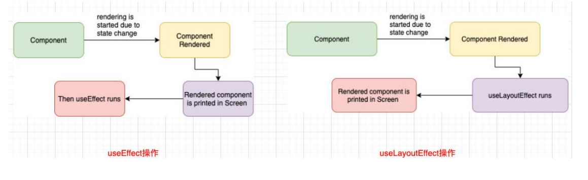
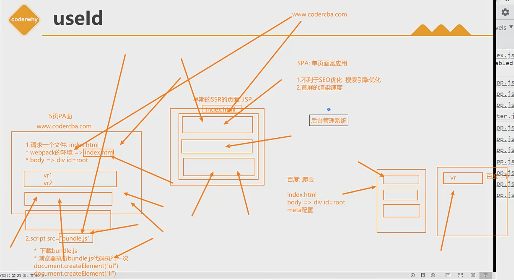
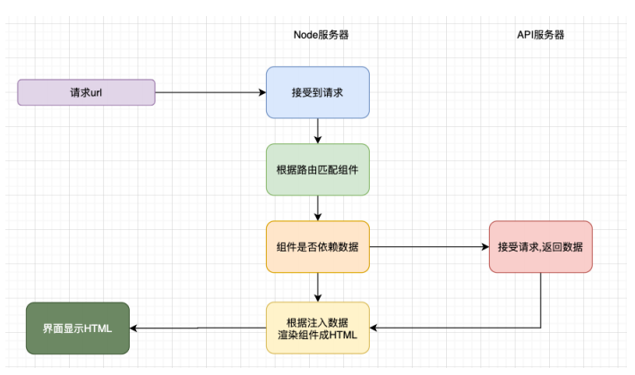
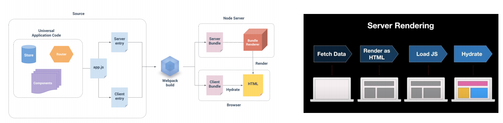
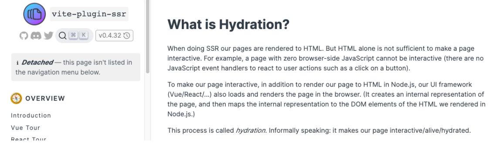

## **为什么需要 Hook?**

**Hook** **是 React 16.8 的新增特性，它可以让我们在不编写 class 的情况下使用 state 以及其他的 React 特性（比如生命周期）。**

**我们先来思考一下 class 组件相对于函数式组件有什么优势？比较常见的是下面的优势：**

class 组件可以定义自己的 state，用来保存组件自己内部的状态；

- 函数式组件不可以，因为函数每次调用都会产生新的临时变量；

class 组件有自己的生命周期，我们可以在对应的生命周期中完成自己的逻辑；

- 比如在 componentDidMount 中发送网络请求，并且该生命周期函数只会执行一次；
- 函数式组件在学习 hooks 之前，如果在函数中发送网络请求，意味着每次重新渲染都会重新发送一次网络请求；

class 组件可以在状态改变时只会重新执行 render 函数以及我们希望重新调用的生命周期函数 componentDidUpdate 等；

- 函数式组件在重新渲染时，整个函数都会被执行，似乎没有什么地方可以只让它们调用一次；

**所以，在 Hook 出现之前，对于上面这些情况我们通常都会编写 class 组件。**

App.jsx

```javascript
import React, { PureComponent } from "react";

class HelloWord extends PureComponent {
  constructor(props) {
    super(props);

    this.state = {
      message: "Hello World",
    };
  }

  changeText() {
    this.setState({ message: "你好啊, 李银河!" });
  }

  render() {
    const { message } = this.state;

    return (
      <div>
        <h2>内容: {message}</h2>
        <button onClick={(e) => this.changeText()}>修改文本</button>
      </div>
    );
  }
}

function HelloWorld2(props) {
  let message = "Hello World";

  // 函数式组件存在的最大的缺陷:
  // 1.组件不会被重新渲染: 修改message之后, 组件知道自己要重新进行渲染吗? 不知道
  // 2.如果页面重新渲染: 函数会被重新执行, 第二次重新执行时, 会重新给message赋值为hello world
  // 3.类似于生命周期的回调函数: 也是没有的

  return (
    <div>
      <h2>内容2: {message}</h2>
      <button onClick={(e) => (message = "你好啊, 李银河!")}>修改文本</button>
    </div>
  );
}

export class App extends PureComponent {
  render() {
    return (
      <div>
        <HelloWord />
        <hr />
        <HelloWorld2 />
      </div>
    );
  }
}

export default App;
```

## **Class 组件存在的问题**

**复杂组件变得难以理解：**

我们在最初编写一个 class 组件时，往往逻辑比较简单，并不会非常复杂。但是随着业务的增多，我们的 class 组件会变得越来越复杂；

比如 componentDidMount 中，可能就会包含大量的逻辑代码：包括网络请求、一些事件的监听（还需要在 componentWillUnmount 中移除）；

而对于这样的 class 实际上非常难以拆分：因为它们的逻辑往往混在一起，强行拆分反而会造成过度设计，增加代码的复杂度；

**难以理解的 class：**

很多人发现学习 ES6 的 class 是学习 React 的一个障碍。

比如在 class 中，我们必须搞清楚 this 的指向到底是谁，所以需要花很多的精力去学习 this；

虽然我认为前端开发人员必须掌握 this，但是依然处理起来非常麻烦；

**组件复用状态很难**：

在前面为了一些状态的复用我们需要通过高阶组件；

像我们之前学习的 redux 中 connect 或者 react-router 中的 withRouter，这些高阶组件设计的目的就是为了状态的复用；

或者类似于 Provider、Consumer 来共享一些状态，但是多次使用 Consumer 时，我们的代码就会存在很多嵌套；

这些代码让我们不管是编写和设计上来说，都变得非常困难；

## **Hook 的出现**

**Hook 的出现，可以解决上面提到的这些问题；**

**简单总结一下 hooks：**

它可以让我们在不编写 class 的情况下使用 state 以及其他的 React 特性；

但是我们可以由此延伸出非常多的用法，来让我们前面所提到的问题得到解决；

**Hook 的使用场景：**

Hook 的出现基本可以代替我们之前所有使用 class 组件的地方；

但是如果是一个旧的项目，你并不需要直接将所有的代码重构为 Hooks，因为它完全向下兼容，你可以渐进式的来使用它；

Hook 只能在函数组件中使用，不能在类组件，或者函数组件之外的地方使用；

**在我们继续之前，请记住 Hook 是：**

完全可选的**：**你无需重写任何已有代码就可以在一些组件中尝试 Hook。但是如果你不想，你不必现在就去学习或使用 Hook。

100% 向后兼容的**：**Hook 不包含任何破坏性改动。

现在可用**：**Hook 已发布于 v16.8.0。

## **Class 组件和 Functional 组件对比**


## **计数器案例对比**

**我们通过一个计数器案例，来对比一下 class 组件和函数式组件结合 hooks 的对比：**

App.jsx

```javascript
import React, { memo } from "react";
import CounterClass from "./CounterClass";
import CounterHook from "./CounterHook";

const App = memo(() => {
  return (
    <div>
      <h1>App Component</h1>
      <CounterClass />
      <CounterHook />
    </div>
  );
});

export default App;
```

CounterClass.jsx

```javascript
import React, { PureComponent } from "react";

export class CounterClass extends PureComponent {
  constructor(props) {
    super(props);

    this.state = {
      counter: 0,
    };
  }

  increment() {
    this.setState({
      counter: this.state.counter + 1,
    });
  }

  decrement() {
    this.setState({
      counter: this.state.counter - 1,
    });
  }

  render() {
    const { counter } = this.state;

    return (
      <div>
        <h2>当前计数: {counter}</h2>
        <button onClick={(e) => this.increment()}>+1</button>
        <button onClick={(e) => this.decrement()}>-1</button>
      </div>
    );
  }
}

export default CounterClass;
```

CounterHook.jsx

```javascript
import { memo, useState } from "react";

function CounterHook(props) {
  const [counter, setCounter] = useState(0);

  return (
    <div>
      <h2>当前计数: {counter}</h2>
      <button onClick={(e) => setCounter(counter + 1)}>+1</button>
      <button onClick={(e) => setCounter(counter - 1)}>-1</button>
    </div>
  );
}

export default memo(CounterHook);
```

**你会发现上面的代码差异非常大：**

**函数式组件结合 hooks 让整个代码变得非常简洁**

**并且再也不用考虑 this 相关的问题；**

## **useState 解析**

**那么我们来研究一下核心的一段代码代表什么意思：**

useState 来自 react，需要从 react 中导入，它是一个 hook；

参数：初始化值，如果不设置为 undefined；

返回值：数组，包含两个元素；

- 元素一：当前状态的值（第一调用为初始化值）；
- 元素二：设置状态值的函数；

点击 button 按钮后，会完成两件事情：

- 调用 setCount，设置一个新的值；
- 组件重新渲染，并且根据新的值返回 DOM 结构；

**相信通过上面的一个简单案例，你已经会喜欢上 Hook 的使用了。**

Hook 就是 JavaScript 函数，这个函数可以帮助你 钩入（hook into） React State 以及生命周期等特性；

Hook 指的类似于 useState、useEffect 这样的函数

Hooks 是对这类函数的统称；

**但是使用它们会有两个额外的规则：**

只能在函数最外层调用 Hook。不要在循环、条件判断或者子函数中调用。

只能在 React 的函数组件中调用 Hook。不要在其他 JavaScript 函数中调用。

```javascript
import { memo, useState } from "react";

// 普通的函数, 里面不能使用hooks
// 在自定义的hooks中, 可以使用react提供的其他hooks: 必须使用use开头
// function useFoo() {
//   const [ message ] = useState("Hello World")
//   return message
// }

function CounterHook(props) {
  const [counter, setCounter] = useState(0);
  const [name] = useState("why");
  console.log(name);

  // const message = useFoo()

  return (
    <div>
      <h2>当前计数: {counter}</h2>
      <button onClick={(e) => setCounter(counter + 1)}>+1</button>
      <button onClick={(e) => setCounter(counter - 1)}>-1</button>
    </div>
  );
}

export default memo(CounterHook);
```

## **认识 useState**

**State Hook 的 API 就是 useState，我们在前面已经进行了学习：**

**useState**会帮助我们定义一个 state 变量，useState 是一种新方法，它与 class 里面的 this.state 提供的功能完全相同。

一般来说，在函数退出后变量就会”消失”，而 state 中的变量会被 React 保留。

**useState**接受唯一一个参数，在第一次组件被调用时使用来作为初始化值。（如果没有传递参数，那么初始化值为 undefined）。

**useState**的返回值是一个数组，我们可以通过数组的解构，来完成赋值会非常方便。

https://developer.mozilla.org/zh-CN/docs/Web/JavaScript/Reference/Operators/Destructuring_assignment

**FAQ：为什么叫 useState 而不叫 createState?**

- create” 可能不是很准确，因为 state 只在组件首次渲染的时候被创建。
- 在下一次重新渲染时，useState 返回给我们当前的 state。
- 如果每次都创建新的变量，它就不是 “state”了。
- 这也是 Hook 的名字*总是*以 use 开头的一个原因。

**当然，我们也可以在一个组件中定义多个变量和复杂变量（数组、对象）**

```javascript
import React, { memo, useState } from "react";

const App = memo(() => {
  const [message, setMessage] = useState("Hello World");
  // const [count, setCount] = useState(100)
  // const [banners, setBanners] = useState([])

  function changeMessage() {
    setMessage("你好啊, 李银河!");
  }

  return (
    <div>
      <h2>App: {message}</h2>
      <button onClick={changeMessage}>修改文本</button>
    </div>
  );
});

export default App;
```

## **认识 Effect Hook**

**目前我们已经通过 hook 在函数式组件中定义 state，那么类似于生命周期这些呢？**

Effect Hook 可以让你来完成一些类似于 class 中生命周期的功能；

事实上，类似于网络请求、手动更新 DOM、一些事件的监听，都是 React 更新 DOM 的一些副作用（Side Effects）；

所以对于完成这些功能的 Hook 被称之为 Effect Hook；

假如我们现在有一个需求：**页面的 title 总是显示 counter 的数字，分别使用 class 组件和 Hook 实现：**

**useEffect 的解析：**

通过 useEffect 的 Hook，可以告诉 React 需要在渲染后执行某些操作；

useEffect 要求我们传入一个回调函数，在 React 执行完更新 DOM 操作之后，就会回调这个函数；

默认情况下，无论是第一次渲染之后，还是每次更新之后，都会执行这个 回调函数；

class 实现

```javascript
import React, { PureComponent } from "react";

export class App extends PureComponent {
  constructor() {
    super();

    this.state = {
      counter: 100,
    };
  }

  componentDidMount() {
    document.title = this.state.counter;
  }

  componentDidUpdate() {
    document.title = this.state.counter;
  }

  componentWillUnmount() {}

  render() {
    const { counter } = this.state;

    return (
      <div>
        <h2>计数: {counter}</h2>
        <button onClick={(e) => this.setState({ counter: counter + 1 })}>
          +1
        </button>
      </div>
    );
  }
}

export default App;
```

hook 实现

```javascript
import React, { memo } from "react";
import { useState, useEffect } from "react";

const App = memo(() => {
  const [count, setCount] = useState(200);

  useEffect(() => {
    // 当前传入的回调函数会在组件被渲染完成后, 自动执行
    // 网络请求/DOM操作(修改标题)/事件监听
    document.title = count;
  });

  return (
    <div>
      <h2>当前计数: {count}</h2>
      <button onClick={(e) => setCount(count + 1)}>+1</button>
    </div>
  );
});

export default App;
```

## **需要清除 Effect**

**在 class 组件的编写过程中，某些副作用的代码，我们需要在 componentWillUnmount 中进行清除：**

比如我们之前的事件总线或 Redux 中手动调用 subscribe；

都需要在 componentWillUnmount 有对应的取消订阅；

Effect Hook 通过什么方式来模拟 componentWillUnmount 呢？

**useEffect 传入的回调函数 A 本身可以有一个返回值，这个返回值是另外一个回调函数 B：**

**为什么要在 effect 中返回一个函数？**

这是 effect 可选的清除机制。每个 effect 都可以返回一个清除函数；

如此可以将添加和移除订阅的逻辑放在一起；

它们都属于 effect 的一部分；

**React 何时清除 effect？**

React 会在组件更新和卸载的时候执行清除操作；

正如之前学到的，effect 在每次渲染的时候都会执行；

```javascript
import React, { memo, useEffect } from "react";
import { useState } from "react";

const App = memo(() => {
  const [count, setCount] = useState(0);

  // 负责告知react, 在执行完当前组件渲染之后要执行的副作用代码
  useEffect(() => {
    // 1.监听事件
    // const unubscribe = store.subscribe(() => {
    // })
    // function foo() {
    // }
    // eventBus.on("why", foo)
    console.log("监听redux中数据变化, 监听eventBus中的why事件");

    // 返回值: 回调函数 => 组件被重新渲染或者组件卸载的时候执行
    return () => {
      console.log("取消监听redux中数据变化, 取消监听eventBus中的why事件");
    };
  });

  return (
    <div>
      <button onClick={(e) => setCount(count + 1)}>+1({count})</button>
    </div>
  );
});

export default App;
```

但是，目前我们只要按钮+1，组件重新渲染，useEffect 中的事件监听也会每次执行，那么有没有办法只执行一次呢？后面再讲。

## **使用多个 Effect**

**使用 Hook 的其中一个目的就是解决 class 中生命周期经常将很多的逻辑放在一起的问题：**

比如网络请求、事件监听、手动修改 DOM，这些往往都会放在 componentDidMount 中；

**使用 Effect Hook，我们可以将它们分离到不同的 useEffect 中：**

**Hook 允许我们按照代码的用途分离它们，** 而不是像生命周期函数那样：

React 将按照 effect 声明的顺序依次调用组件中的*每一个* effect；

```javascript
import React, { memo, useEffect } from "react";
import { useState } from "react";

const App = memo(() => {
  const [count, setCount] = useState(0);

  // 负责告知react, 在执行完当前组件渲染之后要执行的副作用代码
  useEffect(() => {
    // 1.修改document的title(1行)
    console.log("修改title");
  });

  // 一个函数式组件中, 可以存在多个useEffect
  useEffect(() => {
    // 2.对redux中数据变化监听(10行)
    console.log("监听redux中的数据");
    return () => {
      // 取消redux中数据的监听
    };
  });

  useEffect(() => {
    // 3.监听eventBus中的why事件(15行)
    console.log("监听eventBus的why事件");
    return () => {
      // 取消eventBus中的why事件监听
    };
  });

  return (
    <div>
      <button onClick={(e) => setCount(count + 1)}>+1({count})</button>
    </div>
  );
});

export default App;
```

## **Effect 性能优化**

**默认情况下，useEffect 的回调函数会在每次渲染时都重新执行，但是这会导致两个问题：**

某些代码我们只是希望执行一次即可，类似于 componentDidMount 和 componentWillUnmount 中完成的事情；（比如网

络请求、订阅和取消订阅）；

另外，多次执行也会导致一定的性能问题；

**我们如何决定 useEffect 在什么时候应该执行和什么时候不应该执行呢？**

useEffect 实际上有两个参数：

参数一：执行的回调函数；

参数二：该 useEffect 在哪些 state 发生变化时，才重新执行；（受谁的影响）

**但是，如果一个函数我们不希望依赖任何的内容时，也可以传入一个空的数组 []：**

那么这里的两个回调函数分别对应的就是 componentDidMount 和 componentWillUnmount 生命周期函数了；

```javascript
import React, { memo, useEffect } from "react";
import { useState } from "react";

const App = memo(() => {
  const [count, setCount] = useState(0);
  const [message, setMessage] = useState("Hello World");

  useEffect(() => {
    // 只会受count影响
    console.log("修改title:", count);
  }, [count]);

  useEffect(() => {
    // []表示不会受任何影响，只会执行一次
    console.log("监听redux中的数据");
    return () => {};
  }, []);

  useEffect(() => {
    console.log("监听eventBus的why事件");
    return () => {};
  }, []);

  useEffect(() => {
    console.log("发送网络请求, 从服务器获取数据");

    return () => {
      console.log("会在组件被卸载时, 才会执行一次");
    };
  }, []);

  return (
    <div>
      <button onClick={(e) => setCount(count + 1)}>+1({count})</button>
      <button onClick={(e) => setMessage("你好啊")}>
        修改message({message})
      </button>
    </div>
  );
});

export default App;
```

## **useContext 的使用**

**在之前的开发中，我们要在组件中使用共享的 Context 有两种方式：**

类组件可以通过 类名.contextType = MyContext 方式，在类中获取 context；

多个 Context 或者在函数式组件中通过 MyContext.Consumer 方式共享 context；

**但是多个 Context 共享时的方式会存在大量的嵌套：**

Context Hook 允许我们通过 Hook 来直接获取某个 Context 的值；

**注意事项：**

当组件上层最近的 <MyContext.Provider> 更新时，该 Hook 会触发重新渲染，并使用最新传递给 MyContext provider 的

context value 值。

05_useContext 的使用/context/index.js

```javascript
import { createContext } from "react";

const UserContext = createContext();
const ThemeContext = createContext();

export { UserContext, ThemeContext };
```

05_useContext 的使用/App.jsx

```javascript
import React, { memo, useContext } from "react";
import { UserContext, ThemeContext } from "./context";

const App = memo(() => {
  // 使用Context
  const user = useContext(UserContext);
  const theme = useContext(ThemeContext);

  return (
    <div>
      <h2>
        User: {user.name}-{user.level}
      </h2>
      <h2 style={{ color: theme.color, fontSize: theme.size }}>Theme</h2>
    </div>
  );
});

export default App;
```

src/index.js

```javascript
import React from "react";
import ReactDOM from "react-dom/client";
import { UserContext, ThemeContext } from "./05_useContext的使用/context";

const root = ReactDOM.createRoot(document.getElementById("root"));

root.render(
  <UserContext.Provider value={{ name: "why", level: 99 }}>
    <ThemeContext.Provider value={{ color: "red", size: 30 }}>
      <App />
    </ThemeContext.Provider>
  </UserContext.Provider>
);
```

## **useReducer（了解）**

**很多人看到 useReducer 的第一反应应该是 redux 的某个替代品，其实并不是。**

**useReducer 仅仅是 useState 的一种替代方案：**

在某些场景下，如果 state 的处理逻辑比较复杂，我们可以通过 useReducer 来对其进行拆分；

或者这次修改的 state 需要依赖之前的 state 时，也可以使用；

**数据是不会共享的，它们只是使用了相同的 counterReducer 的函数而已。**

**所以，useReducer 只是 useState 的一种替代品，并不能替代 Redux。**

```javascript
import React, { memo, useReducer } from "react";
// import { useState } from 'react'

function reducer(state, action) {
  switch (action.type) {
    case "increment":
      return { ...state, counter: state.counter + 1 };
    case "decrement":
      return { ...state, counter: state.counter - 1 };
    case "add_number":
      return { ...state, counter: state.counter + action.num };
    case "sub_number":
      return { ...state, counter: state.counter - action.num };
    default:
      return state;
  }
}

// useReducer+Context => redux

const App = memo(() => {
  // const [count, setCount] = useState(0)
  // useReducer的第2个参数是传入默认值
  const [state, dispatch] = useReducer(reducer, {
    counter: 0,
    friends: [],
    user: {},
  });

  // const [counter, setCounter] = useState()
  // const [friends, setFriends] = useState()
  // const [user, setUser] = useState()

  return (
    <div>
      {/* <h2>当前计数: {count}</h2>
      <button onClick={e => setCount(count+1)}>+1</button>
      <button onClick={e => setCount(count-1)}>-1</button>
      <button onClick={e => setCount(count+5)}>+5</button>
      <button onClick={e => setCount(count-5)}>-5</button>
      <button onClick={e => setCount(count+100)}>+100</button> */}

      <h2>当前计数: {state.counter}</h2>
      <button onClick={(e) => dispatch({ type: "increment" })}>+1</button>
      <button onClick={(e) => dispatch({ type: "decrement" })}>-1</button>
      <button onClick={(e) => dispatch({ type: "add_number", num: 5 })}>
        +5
      </button>
      <button onClick={(e) => dispatch({ type: "sub_number", num: 5 })}>
        -5
      </button>
      <button onClick={(e) => dispatch({ type: "add_number", num: 100 })}>
        +100
      </button>
    </div>
  );
});

export default App;
```

使用 useReducer 有什么好处呢？

就是当处理的 state 数据比较复杂时，比如有 counter,friends,user，正常使用 useState 的话需要定义 3 个 useState，但是如果借助 useReducer 我们可以将这些数据放在 useReducer 中进行统一管理。

## **useCallback**

**useCallback 实际的目的是为了进行性能的优化。**

**如何进行性能的优化呢？**

useCallback 会返回一个函数的 memoized（记忆的） 值；

在依赖不变的情况下，多次定义的时候，返回的值是相同的；

**案例**

案例一：使用 useCallback 和不使用 useCallback 定义一个函数是否会带来性能的优化；

```javascript
import React, { memo, useState, useCallback } from "react";

// props中的属性发生改变时, 组件本身就会被重新渲染
const HYHome = memo(function (props) {
  const { increment } = props;
  console.log("HYHome被渲染");
  return (
    <div>
      <button onClick={increment}>increment+1</button>

      {/* 100个子组件 */}
    </div>
  );
});

const App = memo(function () {
  const [count, setCount] = useState(0);

  // 闭包陷阱: useCallback 使用useCallback包裹，函数也会被重新定义
  const increment = useCallback(
    function foo() {
      console.log("increment");
      setCount(count + 1);
    },
    [count]
  );

  // 普通的函数
  // const increment = () => {
  //   setCount(count+1)
  // }

  return (
    <div>
      <h2>计数: {count}</h2>
      <button onClick={increment}>+1</button>

      <HYHome increment={increment} />
    </div>
  );
});

export default App;
```

上面这种情况，不管有没有使用 useCallback，子组件 HYHome 都会重新渲染，因为 count 发生了改变。

案例二：使用 useCallback 和不使用 useCallback 定义一个函数传递给子组件是否会带来性能的优化；

我们继续在上面的代码加一个 message，然后再来对比普通调用 increment 和使用 useCallback 包裹的 increment 的区别

```javascript
import React, { memo, useState, useCallback } from "react";

// useCallback性能优化的点:
// 1.当需要将一个函数传递给子组件时, 最好使用useCallback进行优化, 将优化之后的函数, 传递给子组件

// props中的属性发生改变时, 组件本身就会被重新渲染
const HYHome = memo(function (props) {
  const { increment } = props;
  console.log("HYHome被渲染");
  return (
    <div>
      <button onClick={increment}>increment+1</button>

      {/* 100个子组件 */}
    </div>
  );
});

const App = memo(function () {
  const [count, setCount] = useState(0);
  const [message, setMessage] = useState("hello");

  // 闭包陷阱: useCallback
  const increment = useCallback(
    function foo() {
      console.log("increment");
      setCount(count + 1);
    },
    [count]
  );

  // 普通的函数
  // const increment = () => {
  //   setCount(count+1)
  // }

  return (
    <div>
      <h2>计数: {count}</h2>
      <button onClick={increment}>+1</button>

      <HYHome increment={increment} />

      <h2>message:{message}</h2>
      <button onClick={(e) => setMessage(Math.random())}>修改message</button>
    </div>
  );
});

export default App;
```

我们会发生当点击修改 message 按钮时，使用 useCallback 包裹的 increment，子组件 HYHome 不会重新渲染，而使用普通的 increment 方法会重新渲染，但是我们只是改了 message。所以 useCallback 性能优化的点就在这里。

当然，我们上面的例子，当 count 发生改变的时候子组件还是会重新渲染，这也意味着假如 HYHome 子组件它自己还有 100 个子组件的时候也会跟着重新渲染，有没有什么方法，然它不重新渲染呢？

我们需要做两步处理：

第一步，去除 count 的依赖，但是去除 count 依赖的话

```javascript
const increment = useCallback(function foo() {
  console.log("increment");
  setCount(count + 1);
}, []);
```

这样无论怎么点击，count 始终停留在 1 不变，就只加了一次

和下面的例子一样，bar1 调用获取到了 why，虽然经过 bar2 调用获取到 kobe，但是再次调用还是获取最初的值 why。

```javascript
function foo(name) {
  function bar() {
    console.log(name);
  }
  return bar;
}

const bar1 = foo("why");
bar1(); // why
bar1(); // why

const bar2 = foo("kobe");
bar2(); // kobe

bar1(); // why
```

那么，我们怎么样让 count 发生改变呢？可以借助 useRef

```javascript
import React, { memo, useState, useCallback, useRef } from "react";

// useCallback性能优化的点:
// 1.当需要将一个函数传递给子组件时, 最好使用useCallback进行优化, 将优化之后的函数, 传递给子组件

// props中的属性发生改变时, 组件本身就会被重新渲染
const HYHome = memo(function (props) {
  const { increment } = props;
  console.log("HYHome被渲染");
  return (
    <div>
      <button onClick={increment}>increment+1</button>

      {/* 100个子组件 */}
    </div>
  );
});

const App = memo(function () {
  const [count, setCount] = useState(0);
  const [message, setMessage] = useState("hello");

  // 闭包陷阱: useCallback
  // const increment = useCallback(function foo() {
  //   console.log("increment")
  //   setCount(count+1)
  // }, [count])

  // 进一步的优化: 当count发生改变时, 也使用同一个函数(了解)
  // 做法一: 将count依赖移除掉, 缺点: 闭包陷阱
  // 做法二: useRef, 在组件多次渲染时, 返回的是同一个值
  const countRef = useRef();
  countRef.current = count;
  const increment = useCallback(function foo() {
    console.log("increment");
    setCount(countRef.current + 1);
  }, []);

  // 普通的函数
  // const increment = () => {
  //   setCount(count+1)
  // }

  return (
    <div>
      <h2>计数: {count}</h2>
      <button onClick={increment}>+1</button>

      <HYHome increment={increment} />

      <h2>message:{message}</h2>
      <button onClick={(e) => setMessage(Math.random())}>修改message</button>
    </div>
  );
});

export default App;
```

**通常使用 useCallback 的目的是不希望子组件进行多次渲染，并不是为了函数进行缓存；**

## **useMemo**

useMemo 实际的目的也是为了进行性能的优化。

如何进行性能的优化呢？

useMemo 返回的也是一个 memoized（记忆的） 值；

在依赖不变的情况下，多次定义的时候，返回的值是相同的；

案例：

案例一：进行大量的计算操作，是否有必须要每次渲染时都重新计算；

案例二：对子组件传递相同内容的对象时，使用 useMemo 进行性能的优化

```javascript
import React, { memo, useCallback } from "react";
import { useMemo, useState } from "react";

const HelloWorld = memo(function (props) {
  console.log("HelloWorld被渲染~");
  return <h2>Hello World</h2>;
});

function calcNumTotal(num) {
  // console.log("calcNumTotal的计算过程被调用~")
  let total = 0;
  for (let i = 1; i <= num; i++) {
    total += i;
  }
  return total;
}

const App = memo(() => {
  const [count, setCount] = useState(0);

  // const result = calcNumTotal(50)

  // 1.不依赖任何的值, 进行计算
  const result = useMemo(() => {
    return calcNumTotal(50);
  }, []);

  // 2.依赖count
  // const result = useMemo(() => {
  //   return calcNumTotal(count*2)
  // }, [count])

  // 3.useMemo和useCallback的对比
  function fn() {}
  // 这俩实现等价
  // const increment = useCallback(fn, [])
  // const increment2 = useMemo(() => fn, [])

  // 4.使用useMemo对子组件渲染进行优化
  // const info = { name: "why", age: 18 }
  const info = useMemo(() => ({ name: "why", age: 18 }), []);

  return (
    <div>
      <h2>计算结果: {result}</h2>
      <h2>计数器: {count}</h2>
      <button onClick={(e) => setCount(count + 1)}>+1</button>

      <HelloWorld result={result} info={info} />
    </div>
  );
});

export default App;
```

这里注意演示三个：

第一，使用 useMemo 是对它第一个参数的返回值进行优化，就是当 count 发生改变 calcNumTotal 不会重新执行；

第二，useMemo 和 useCallback 的对比是 useCallback 是对直接对 fn 进行优化，而 useMemo 是对第一个参数的返回结果（fn）进行优化；

第三，当传给子组件是一个对象时，比如上面的 info，如果没有使用 useMemo，那么子组件会重新渲染，因为 info 对象被重新定义了。

## **useRef**

useRef 返回一个 ref 对象，返回的 ref 对象再组件的整个生命周期保持不变。

最常用的 ref 是两种用法：

用法一：引入 DOM（或者组件，但是需要是 class 组件）元素；

```javascript
import React, { memo, useRef } from "react";

const App = memo(() => {
  const titleRef = useRef();
  const inputRef = useRef();

  function showTitleDom() {
    console.log(titleRef.current);
    inputRef.current.focus();
  }

  return (
    <div>
      <h2 ref={titleRef}>Hello World</h2>
      <input type="text" ref={inputRef} />
      <button onClick={showTitleDom}>查看title的dom</button>
    </div>
  );
});

export default App;
```

用法二：保存一个数据，这个对象在整个生命周期中可以保存不变；

解决闭包陷阱

```javascript
import React, { memo, useRef } from "react";
import { useCallback } from "react";
import { useState } from "react";

let obj = null;

const App = memo(() => {
  const [count, setCount] = useState(0);
  const nameRef = useRef();
  console.log(obj === nameRef);
  obj = nameRef;

  // 通过useRef解决闭包陷阱
  const countRef = useRef();
  countRef.current = count;

  const increment = useCallback(() => {
    setCount(countRef.current + 1);
  }, []);

  return (
    <div>
      <h2>Hello World: {count}</h2>
      <button onClick={(e) => setCount(count + 1)}>+1</button>
      <button onClick={increment}>+1</button>
    </div>
  );
});

export default App;
```

## **useImperativeHandle（了解）**

**useImperativeHandle 并不是特别好理解，我们一点点来学习。**

**我们先来回顾一下 ref 和 forwardRef 结合使用：**

通过 forwardRef 可以将 ref 转发到子组件；

子组件拿到父组件中创建的 ref，绑定到自己的某一个元素中；

**forwardRef 的做法本身没有什么问题，但是我们是将子组件的 DOM 直接暴露给了父组件：**

直接暴露给父组件带来的问题是某些情况的不可控；

父组件可以拿到 DOM 后进行任意的操作；

但是，事实上在上面的案例中，我们只是希望父组件可以操作的 focus，其他并不希望它随意操作；

**通过 useImperativeHandle 可以只暴露固定的操作：**

通过 useImperativeHandle 的 Hook，将传入的 ref 和 useImperativeHandle 第二个参数返回的对象绑定到了一起；

所以在父组件中，使用 inputRef.current 时，实际上使用的是返回的对象；

比如我调用了 focus 函数，甚至可以调用 setValue 函数；

```javascript
import React, { memo, useRef, forwardRef, useImperativeHandle } from "react";

const HelloWorld = memo(
  forwardRef((props, ref) => {
    const inputRef = useRef();

    // 子组件对父组件传入的ref进行处理
    useImperativeHandle(ref, () => {
      return {
        focus() {
          console.log("focus");
          inputRef.current.focus();
        },
        setValue(value) {
          inputRef.current.value = value;
        },
      };
    });

    return <input type="text" ref={inputRef} />;
  })
);

const App = memo(() => {
  const titleRef = useRef();
  const inputRef = useRef();

  function handleDOM() {
    // console.log(inputRef.current)
    inputRef.current.focus();
    // inputRef.current.value = "" // 这样写没有意义，改变不了
    inputRef.current.setValue("哈哈哈");
  }

  return (
    <div>
      <h2 ref={titleRef}>哈哈哈</h2>
      <HelloWorld ref={inputRef} />
      <button onClick={handleDOM}>DOM操作</button>
    </div>
  );
});

export default App;
```

父组件只能对子组件的 input 设置获取焦点的权限，如果想要修改子组件就得在 useImperativeHandle 的第 2 个参数的返回值定义一个方法，用来改变子组件的 input 输入框的值。

## **useLayoutEffect（了解）**

**useLayoutEffect 看起来和 useEffect 非常的相似，事实上他们也只有一点区别而已：**

useEffect 会在渲染的内容更新到 DOM 上后执行，不会阻塞 DOM 的更新；

useLayoutEffect 会在渲染的内容更新到 DOM 上之前执行，会阻塞 DOM 的更新；

**如果我们希望在某些操作发生之后再更新 DOM，那么应该将这个操作放到 useLayoutEffect。**

**案例： useEffect 和 useLayoutEffect 的对比**



```javascript
import React, { memo, useEffect, useLayoutEffect, useState } from "react";

const App = memo(() => {
  const [count, setCount] = useState(0);

  useLayoutEffect(() => {
    console.log("useLayoutEffect");
  });

  useEffect(() => {
    console.log("useEffect");
  });

  console.log("App render");

  return (
    <div>
      <h2>count: {count}</h2>
      <button onClick={(e) => setCount(count + 1)}>+1</button>
    </div>
  );
});

export default App;
```

上面代码的执行顺序是

```javascript
App render
useLayoutEffect
useEffect
```

使用 useEffect 切换数字，将数字改为 0，但是发现不满意把它改成一个随机数，使用 useEffect 会有闪烁的现象

```javascript
import React, { memo, useEffect, useLayoutEffect, useState } from "react";

const App = memo(() => {
  const [count, setCount] = useState(100);

  useEffect(() => {
    console.log("useEffect");
    if (count === 0) {
      setCount(Math.random() + 99);
    }
  });

  console.log("App render");

  return (
    <div>
      <h2>count: {count}</h2>
      <button onClick={(e) => setCount(0)}>设置为0</button>
    </div>
  );
});

export default App;
```

那么，我们可以使用 useLayoutEffect

```javascript
import React, { memo, useEffect, useLayoutEffect, useState } from "react";

const App = memo(() => {
  const [count, setCount] = useState(100);

  useLayoutEffect(() => {
    console.log("useLayoutEffect");
    if (count === 0) {
      setCount(Math.random() + 99);
    }
  });

  console.log("App render");

  return (
    <div>
      <h2>count: {count}</h2>
      <button onClick={(e) => setCount(0)}>设置为0</button>
    </div>
  );
});

export default App;
```

## **自定义 Hook**

**自定义 Hook 本质上只是一种函数代码逻辑的抽取，严格意义上来说，它本身并不算 React 的特性。**

需求：所有的组件在创建和销毁时都进行打印

组件被创建：打印 组件被创建了；

组件被销毁：打印 组件被销毁了；

```javascript
import React, { memo, useEffect, useState } from "react";

function useLogLife(cName) {
  useEffect(() => {
    console.log(cName + "组件被创建");
    return () => {
      console.log(cName + "组件被销毁");
    };
  }, [cName]);
}

const Home = memo(() => {
  useLogLife("home");

  return <h1>Home Page</h1>;
});

const About = memo(() => {
  useLogLife("about");

  return <h1>About Page</h1>;
});

const App = memo(() => {
  const [isShow, setIsShow] = useState(true);

  useLogLife("app");

  return (
    <div>
      <h1>App Root Component</h1>
      <button onClick={(e) => setIsShow(!isShow)}>切换</button>
      {isShow && <Home />}
      {isShow && <About />}
    </div>
  );
});

export default App;
```

## **自定义 Hook 练习**

**需求一：Context 的共享**

```javascript
import React, { memo } from "react";
import { useUserToken } from "./hooks";

// User/Token

const Home = memo(() => {
  const [user, token] = useUserToken();

  return (
    <h1>
      Home Page: {user.name}-{token}
    </h1>
  );
});

const About = memo(() => {
  const [user, token] = useUserToken();

  return (
    <h1>
      About Page: {user.name}-{token}
    </h1>
  );
});

const App = memo(() => {
  return (
    <div>
      <h1>App Root Component</h1>
      <Home />
      <About />
    </div>
  );
});

export default App;
```

hooks/index.js

```javascript
import useUserToken from "./useUserToken";

export { useUserToken };
```

hooks/useUserToken.js

```javascript
import { useContext } from "react";
import { UserContext, TokenContext } from "../context";

function useUserToken() {
  const user = useContext(UserContext);
  const token = useContext(TokenContext);

  return [user, token];
}

export default useUserToken;
```

src/index.js

```javascript
import React from "react";
import ReactDOM from "react-dom/client";
import { UserContext, TokenContext } from "./12_自定义Hooks/context";
import store from "./13_redux中的hooks/store";

const root = ReactDOM.createRoot(document.getElementById("root"));
root.render(
  <UserContext.Provider value={{ name: "why", level: 99 }}>
    <TokenContext.Provider value={"coderwhy"}>
      <App />
    </TokenContext.Provider>
  </UserContext.Provider>
);
```

**需求二：获取鼠标滚动位置**

useScrollPosition.js

```javascript
import { useState, useEffect } from "react";

function useScrollPosition() {
  const [scrollX, setScrollX] = useState(0);
  const [scrollY, setScrollY] = useState(0);

  useEffect(() => {
    function handleScroll() {
      // console.log(window.scrollX, window.scrollY)
      setScrollX(window.scrollX);
      setScrollY(window.scrollY);
    }

    window.addEventListener("scroll", handleScroll);
    return () => {
      window.removeEventListener("scroll", handleScroll);
    };
  }, []);

  return [scrollX, scrollY];
}

export default useScrollPosition;
```

App.jsx

```javascript
import React, { memo } from "react";
import useScrollPosition from "./hooks/useScrollPosition";
import "./style.css";

const Home = memo(() => {
  const [scrollX, scrollY] = useScrollPosition();

  return (
    <h1>
      Home Page: {scrollX}-{scrollY}
    </h1>
  );
});

const About = memo(() => {
  const [scrollX, scrollY] = useScrollPosition();

  return (
    <h1>
      About Page: {scrollX}-{scrollY}
    </h1>
  );
});

const App = memo(() => {
  return (
    <div className="app">
      <h1>App Root Component</h1>
      <Home />
      <About />
    </div>
  );
});

export default App;
```

**需求三：localStorage 数据存储**

hooks/useLocalStorage.js

```javascript
import { useEffect } from "react";
import { useState } from "react";

function useLocalStorage(key) {
  // 1.从localStorage中获取数据, 并且数据数据创建组件的state
  const [data, setData] = useState(() => {
    const item = localStorage.getItem(key);
    if (!item) return "";
    return JSON.parse(item);
  });

  // 2.监听data改变, 一旦发生改变就存储data最新值
  useEffect(() => {
    localStorage.setItem(key, JSON.stringify(data));
  }, [data]);

  // 3.将data/setData的操作返回给组件, 让组件可以使用和修改值
  return [data, setData];
}

export default useLocalStorage;
```

App.jsx

```javascript
import React, { memo } from "react";
import { useEffect } from "react";
import { useState } from "react";
import useLocalStorage from "./hooks/useLocalStorage";

const App = memo(() => {
  // 通过key, 直接从localStorage中获取一个数据
  // const [token, setToken] = useState(localStorage.getItem("token"))
  // useEffect(() => {
  //   localStorage.setItem("token", token)
  // }, [token])
  const [token, setToken] = useLocalStorage("token");
  function setTokenHandle() {
    setToken("james");
  }

  // const [avatarUrl, setAvatarUrl] = useState(localStorage.getItem("avatarUrl"))
  // useEffect(() => {
  //   localStorage.setItem("avatarUrl", avatarUrl)
  // }, [avatarUrl])
  const [avatarUrl, setAvatarUrl] = useLocalStorage("avatarUrl");
  function setAvatarUrlHandle() {
    setAvatarUrl("http://www.james.com/cba.png");
  }

  return (
    <div className="app">
      <h1>App Root Component: {token}</h1>
      <button onClick={setTokenHandle}>设置token</button>
      <h1>avatarURL: {avatarUrl}</h1>
      <button onClick={setAvatarUrlHandle}>设置新头像地址</button>
    </div>
  );
});

export default App;
```

## **redux hooks**

**在之前的 redux 开发中，为了让组件和 redux 结合起来，我们使用了 react-redux 中的 connect：**

但是这种方式必须使用高阶函数结合返回的高阶组件；

并且必须编写：mapStateToProps 和 mapDispatchToProps 映射的函数；

**在 Redux7.1 开始，提供了 Hook 的方式，我们再也不需要编写 connect 以及对应的映射函数了**

**useSelector 的作用是将 state 映射到组件中：**

参数一：将 state 映射到需要的数据中；

参数二：可以进行比较来决定是否组件重新渲染；（后续讲解）

**useSelector 默认会比较我们返回的两个对象是否相等；**

如何比较呢？ const refEquality = (a, b) => a === b；

也就是我们必须返回两个完全相等的对象才可以不引起重新渲染；

**useDispatch 非常简单，就是直接获取 dispatch 函数，之后在组件中直接使用即可；**

**我们还可以通过 useStore 来获取当前的 store 对象；**

src/index.js

```javascript
import React from "react";
import ReactDOM from "react-dom/client";
import { Provider } from "react-redux";
import store from "./13_redux中的hooks/store";

const root = ReactDOM.createRoot(document.getElementById("root"));
root.render(
  <Provider store={store}>
    <App />
  </Provider>
);
```

store/index.js

```javascript
import { configureStore } from "@reduxjs/toolkit";
import counterReducer from "./modules/counter";

const store = configureStore({
  reducer: {
    counter: counterReducer,
  },
});

export default store;
```

store/modules/counter.js

```javascript
import { createSlice } from "@reduxjs/toolkit";

const counterSlice = createSlice({
  name: "counter",
  initialState: {
    count: 99,
  },
  reducers: {
    addNumberAction(state, { payload }) {
      state.count = state.count + payload;
    },
    subNumberAction(state, { payload }) {
      state.count = state.count - payload;
    },
  },
});

export const { addNumberAction, subNumberAction } = counterSlice.actions;
export default counterSlice.reducer;
```

使用以前的 connect 高阶组件

App_connect.jsx

```javascript
import React, { memo } from "react";
import { connect } from "react-redux";
import { addNumberAction, subNumberAction } from "./store/modules/counter";

const App = memo((props) => {
  const { count, addNumber, subNumber } = props;

  function addNumberHandle(num, isAdd = true) {
    if (isAdd) {
      addNumber(num);
    } else {
      subNumber(num);
    }
  }

  return (
    <div>
      <h2>当前计数: {count}</h2>
      <button onClick={(e) => addNumberHandle(1)}>+1</button>
      <button onClick={(e) => addNumberHandle(6)}>+6</button>
      <button onClick={(e) => addNumberHandle(6, false)}>-6</button>
    </div>
  );
});

const mapStateToProps = (state) => ({
  count: state.counter.count,
});

const mapDispatchToProps = (dispatch) => ({
  addNumber(num) {
    dispatch(addNumberAction(num));
  },
  subNumber(num) {
    dispatch(subNumberAction(num));
  },
});

export default connect(mapStateToProps, mapDispatchToProps)(App);
```

使用 hook

App_hooks.jsx

```javascript
import React, { memo } from "react";
import { useSelector, useDispatch } from "react-redux";
import { addNumberAction, subNumberAction } from "./store/modules/counter";

const App = memo((props) => {
  // 1.使用useSelector将redux中store的数据映射到组件内
  const { count } = useSelector((state) => ({
    count: state.counter.count,
  }));

  // 2.使用dispatch直接派发action
  const dispatch = useDispatch();
  function addNumberHandle(num, isAdd = true) {
    if (isAdd) {
      dispatch(addNumberAction(num));
    } else {
      dispatch(subNumberAction(num));
    }
  }

  return (
    <div>
      <h2>当前计数: {count}</h2>
      <button onClick={(e) => addNumberHandle(1)}>+1</button>
      <button onClick={(e) => addNumberHandle(6)}>+6</button>
      <button onClick={(e) => addNumberHandle(6, false)}>-6</button>
    </div>
  );
});

export default App;
```

我们再来演练一个东西，在 App 组件里面使用一个 Home 子组件，这个子组件可以修改 message 的值，我们会发现在父组件点击+1 或+6

或-6 按钮的时候，Home 子组件会重新渲染；同样地，Home 子组件修改 message，父组件 App 也会重新渲染，这是为什么呢？

这是因为当使用 useSelector 的时候是默认监听的是整个 state，只要 state 发生了改变，就会重新渲染，但是我们想要的是 Home 子组件只

有当 message 发生改变的时候才重新渲染，App 组件只有当 count 发生改变的时候才重新渲染，那么如何实现呢？

很简单，useSelector 传入第 2 个参数 shallowEqual 就可以，它的作用是进行浅层比较，只有返回两个完全相等的对象才可以不引起重新渲染。

store/modules/counter.js

```javascript
import { createSlice } from "@reduxjs/toolkit";

const counterSlice = createSlice({
  name: "counter",
  initialState: {
    count: 99,
    message: "Hello World",
  },
  reducers: {
    addNumberAction(state, { payload }) {
      state.count = state.count + payload;
    },
    subNumberAction(state, { payload }) {
      state.count = state.count - payload;
    },

    changeMessageAction(state, { payload }) {
      console.log(payload);
      state.message = payload;
    },
  },
});

export const { addNumberAction, subNumberAction, changeMessageAction } =
  counterSlice.actions;
export default counterSlice.reducer;
```

App.jsx

```javascript
import React, { memo } from "react";
import { useSelector, useDispatch, shallowEqual } from "react-redux";
import {
  addNumberAction,
  changeMessageAction,
  subNumberAction,
} from "./store/modules/counter";

// memo高阶组件包裹起来的组件有对应的特点: 只有props发生改变时, 才会重新渲染
const Home = memo((props) => {
  const { message } = useSelector(
    (state) => ({
      message: state.counter.message,
    }),
    shallowEqual
  );

  const dispatch = useDispatch();
  function changeMessageHandle() {
    dispatch(changeMessageAction("你好啊, 师姐!"));
  }

  console.log("Home render");

  return (
    <div>
      <h2>Home: {message}</h2>
      <button onClick={(e) => changeMessageHandle()}>修改message</button>
    </div>
  );
});

const App = memo((props) => {
  // 1.使用useSelector将redux中store的数据映射到组件内
  const { count } = useSelector(
    (state) => ({
      count: state.counter.count,
    }),
    shallowEqual
  );

  // 2.使用dispatch直接派发action
  const dispatch = useDispatch();
  function addNumberHandle(num, isAdd = true) {
    if (isAdd) {
      dispatch(addNumberAction(num));
    } else {
      dispatch(subNumberAction(num));
    }
  }

  console.log("App render");

  return (
    <div>
      <h2>当前计数: {count}</h2>
      <button onClick={(e) => addNumberHandle(1)}>+1</button>
      <button onClick={(e) => addNumberHandle(6)}>+6</button>
      <button onClick={(e) => addNumberHandle(6, false)}>-6</button>

      <Home />
    </div>
  );
});

export default App;
```

## **useId**



SPA 最主要有两个缺点：

1.首屏渲染速度慢；

首先，访问一个网址，会先请求一个文件 index.html，这个 index.html 文件执行遇到 js 代码，会先把 js 代码下载下来，再执行里面的 js 代码，然后渲染到页面上。但是早期的 SSR 通过 JSP 等方式拿到的是已经下载好的 html 文件，直接渲染到页面上。很显然，SSR 的渲染速度更快。

2.不利于 SEO 优化

SPA 最多只能搜索到 index.html 里面比如 meta 或 title 的内容，搜索范围有限，搜出来的排序靠后，不会为网站带来流量，因此不利于 SEO 优化。而 SSR 能搜索到页面的内容，搜索范围广，有利于 SEO 优化。

**官方的解释：useId 是一个用于生成横跨服务端和客户端的稳定的唯一 ID 的同时避免 hydration 不匹配的 hook。**

**这里有一个词叫 hydration，要想理解这个词，我们需要理解一些服务器端渲染（SSR）的概念。**

**什么是 SSR？**

SSR（**Server Side Rendering，服务端渲染**），指的是页面在服务器端已经生成了完成的 HTML 页面结构，不需要浏览器解析；

对应的是 CSR（**Client Side Rendering，客户端渲染**），我们开发的 SPA 页面通常依赖的就是客户端渲染；

**早期的服务端渲染包括 PHP、JSP、ASP 等方式，但是在目前前后端分离的开发模式下，前端开发人员不太可能再去学习 PHP、**

**JSP 等技术来开发网页；**

**不过我们可以借助于 Node 来帮助我们执行 JavaScript 代码，提前完成页面的渲染；**



## **SSR 同构应用**

**什么是同构？**

一套代码既可以在服务端运行又可以在客户端运行，这就是同构应用。

**同构是一种 SSR 的形态，是现代 SSR 的一种表现形式。**

当用户发出请求时，先在服务器通过 SSR 渲染出首页的内容。

但是对应的代码同样可以在客户端被执行。

执行的目的包括事件绑定等以及其他页面切换时也可以在客户端被渲染；



## **Hydration**

**什么是 Hydration？这里我引入 vite-plugin-ssr 插件的官方解释。**



**在进行** **SSR** **时，我们的页面会呈现为 HTML。**

但仅 HTML 不足以使页面具有交互性。例如，浏览器端 JavaScript 为零的页面不能是交互式的（没有 JavaScript 事件处理程序来响应用

户操作，例如单击按钮）。

为了使我们的页面具有交互性，除了在 Node.js 中将页面呈现为 HTML 之外，我们的 UI 框架（Vue/React/...）还在浏览器中加载和呈现

页面。（它创建页面的内部表示，然后将内部表示映射到我们在 Node.js 中呈现的 HTML 的 DOM 元素。）

**这个过程称为 hydration。**

自己总结：

一套代码既可以再服务端运行也可以在客户端运行，先在服务端运行呈现 HTML 结构到浏览器上，但是这个 HTML 结构还不具备交互性，比如页面点击，那么就需要由客户端进行 hydrate（注入）使页面的 HTML 具备交互性。

## **useId 的作用**

**我们再来看一遍：useId 是一个用于生成横跨服务端和客户端的稳定的唯一 ID 的同时避免 hydration 不匹配的 hook。**

**所以我们可以得出如下结论：**

useId 是用于 react 的同构应用开发的，前端的 SPA 页面并不需要使用它；

useId 可以保证应用程序在客户端和服务器端生成唯一的 ID，这样可以有效的避免通过一些手段生成的 id 不一致，造成

hydration mismatch；

```javascript
import React, { memo, useId, useState } from "react";

const App = memo(() => {
  const [count, setCount] = useState(0);

  const id = useId();
  console.log(id); // 打印出来的id都是一样的

  return (
    <div>
      <button onClick={(e) => setCount(count + 1)}>count+1:{count}</button>

      <label htmlFor={id}>
        用户名:
        <input id={id} type="text" />
      </label>
    </div>
  );
});

export default App;
```

## **useTransition**

**官方解释：返回一个状态值表示过渡任务的等待状态，以及一个启动该过渡任务的函数。**

事实上官方的说法，还是让人云里雾里，不知所云。

**useTransition 到底是干嘛的呢？它其实在告诉 react 对于某部分任务的更新优先级较低，可以稍后进行更新。**

我们来实现一个案例，根据输入框搜索内容，匹配对应的内容。

namesArray.js

我们可以借助@faker-js/faker 这个库帮我们随机生成数据，下面这里随机生成 1 万个名字

```javascript
import { faker } from "@faker-js/faker";

const namesArray = [];

for (let i = 0; i < 10000; i++) {
  namesArray.push(faker.name.fullName());
}

export default namesArray;
```

App.jsx

```javascript
import React, { memo, useState, useTransition } from "react";
import namesArray from "./namesArray";

const App = memo(() => {
  const [showNames, setShowNames] = useState(namesArray);
  const [pending, startTransition] = useTransition();

  function valueChangeHandle(event) {
    startTransition(() => {
      const keyword = event.target.value;
      const filterShowNames = namesArray.filter((item) =>
        item.includes(keyword)
      );
      setShowNames(filterShowNames);
    });
  }

  return (
    <div>
      <input type="text" onInput={valueChangeHandle} />
      <h2>用户名列表: {pending && <span>data loading</span>} </h2>
      <ul>
        {showNames.map((item, index) => {
          return <li key={index}>{item}</li>;
        })}
      </ul>
    </div>
  );
});

export default App;
```

但是，我们在输入框搜索的过程中会因为下面的数据量过大导致输入框的值改变了，但是没有里面改变过来，会卡一会。那么我们可以借

助 useTransition，让下面搜索出来的内容优先级排后面，只需要放在 startTransition 即可，input 输入框的优先级就可以提高。

先在还有个问题，虽然输入框的内容改变了，但是下面的内容还没有结果，最好给用户一个友好的提示，比如正在加载中。

那么，可以使用 pending，当它为 true 的时候显示 data loading，这个可以自己定义样式。

## **useDeferredValue**

**官方解释：useDeferredValue 接受一个值，并返回该值的新副本，该副本将推迟到更紧急地更新之后。**

**在明白了 useTransition 之后，我们就会发现 useDeferredValue 的作用是一样的效果，可以让我们的更新延迟。**

不过，useDeferredValue 没有 useTransition 的 pending 效果，如果想要有加载效果，还是更推荐使用 useTransition。

```javascript
import React, { memo, useState, useDeferredValue } from "react";
import namesArray from "./namesArray";

const App = memo(() => {
  const [showNames, setShowNames] = useState(namesArray);
  const deferedShowNames = useDeferredValue(showNames);

  function valueChangeHandle(event) {
    const keyword = event.target.value;
    const filterShowNames = namesArray.filter((item) => item.includes(keyword));
    setShowNames(filterShowNames);
  }

  return (
    <div>
      <input type="text" onInput={valueChangeHandle} />
      <h2>用户名列表: </h2>
      <ul>
        {deferedShowNames.map((item, index) => {
          return <li key={index}>{item}</li>;
        })}
      </ul>
    </div>
  );
});

export default App;
```
