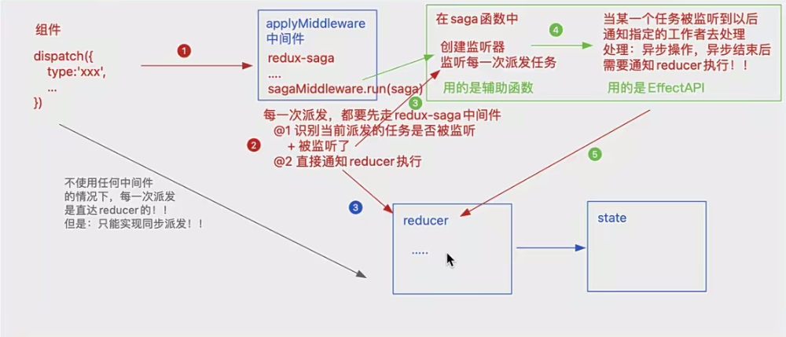
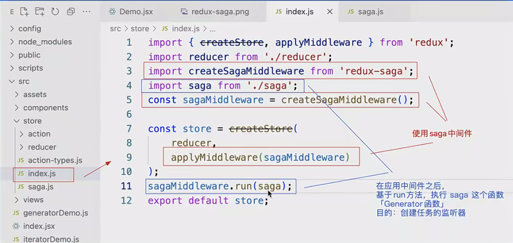
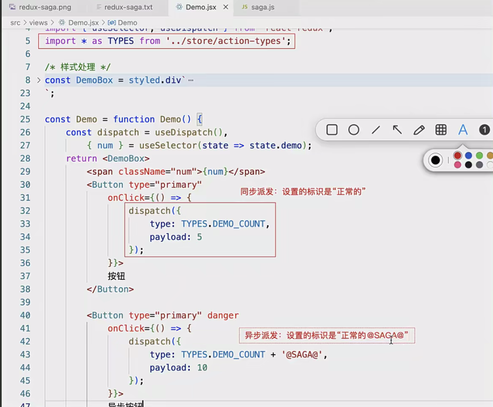

> 官网：https://redux-saga.js.org/docs/About
> 中文网：https://redux-saga-in-chinese.js.org/
>
> redux-saga 是一个用于管理 `异步获取数据(副作用)` 的 redux 中间件；它的目标是让副作用管理更容易，执行更高效，测试更简单，处理故障时更容易…
>
> 学习 redux-saga 之前，需要先掌握 ES6 中的 Iterator 迭代器 和 Generator 生成器 ！！

#### 1. redux-thunk 与 redux-saga 的比较

**redux 中的数据流**
action ———> reducer ———> state

- action 是一个纯粹对象（plain object）
- reducer 是一个纯函数（和外界没有任何关系）
- 都只能处理同步的操作

**redux-thunk 中间件的处理流程**
action1 ———> middleware ———> action2 ———> reducer ———> state

```javascript
/* redux-thunk中间件的部分源码 */
"use strict";
function createThunkMiddleware(extraArgument) {
  var middleware = function middleware(_ref) {
    var dispatch = _ref.dispatch,
      getState = _ref.getState;
    return function (next) {
      return function (action) {
        if (typeof action === "function") {
          // 如果返回的action是个函数，则把函数执行「在函数中完成异步操作，用传递的dispatch单独实现派发！！」
          return action(dispatch, getState, extraArgument);
        }
        return next(action);
      };
    };
  };
  return middleware;
}
```

弊端：异步操作分散到每一个 action 中；而且返回函数中的代码具备多样性！！

**redux-saga 中间件的工作流程**
redux-saga 中提供了一系列的 api，可以去监听纯粹对象格式的 action，方便单元测试！！
action1 ———> redux-saga 监听 ———> 执行提供的 API 方法 ———> 返回描述对象 ———> 执行异步操作 ———> action2 ———> reducer ———> state

这样说完，大家可能是不太理解的，那么接下来，我们去做一个案例，详细解读一下 redux-saga 的语法和优势！！

#### 2. redux-saga 的基础知识

_备注：需要先准备一套基于 “redux、redux-thunk” 实现的投票案例，我们在此基础上去修改 ！！_

**安装中间件**
$ npm install redux-saga
$ yarn add redux-saga

**使用中间件**
store/index.js

```javascript
import { createStore, applyMiddleware } from "redux";
import createSagaMiddleware from "redux-saga";
import reducer from "./reducer";
import saga from "./saga";
// saga
const sagaMiddleware = createSagaMiddleware();
// 创建store容器
const store = createStore(reducer, applyMiddleware(sagaMiddleware));
// 启动saga
sagaMiddleware.run(saga);
export default store;
```

store/action-types.js

```javascript
export const VOTE_SUP = "VOTE_SUP";
export const VOTE_OPP = "VOTE_OPP";

export const DEMO = "DEMO";
```

store/reducer

```javascript
// demoReducer
import * as TYPES from '../action-types';
import _ from '../../assets/utils';
let initial = {
    num: 0
};
export default function demoReducer(state = initial, action) {
    state = _.clone(state);
    let { payload = 1 } = action;
    switch (action.type) {
        case TYPES.DEMO:
            state.num += payload;
            break;
        default:
    }
    return state;
};

// index.js
import { combineReducers } from 'redux';
import voteReducer from './voteReducer';
import demoReducer from './demoReducer';
const reducer = combineReducers({
    vote: voteReducer,
    demo: demoReducer
});
export default reducer;
```

Demo.jsx 组件中

```javascript
import React from "react";
import { Button } from "antd";
import { useSelector, useDispatch } from "react-redux";
const Demo = function Demo() {
  const { num } = useSelector((state) => state.demo),
    dispatch = useDispatch();
  return (
    <div>
      <span style={{ fontSize: 20, paddingLeft: 10 }}>{num}</span>
      <br />
      <Button
        type="primary"
        onClick={() => {
          //基于dispatch进行派发....
        }}
      >
        按钮
      </Button>
    </div>
  );
};
export default Demo;
```

**saga.js 工作流程**



这样其实会执行 2 次 reducer，我们可以通过代码来实现，同步走 123（3 是蓝色），然后异步走 12345。

第一部分：创建监听器「基于 saga 的辅助函数」

- take(pattern)
- takeEvery(pattern, saga, …args)
- takeLatest(pattern, saga, ..args)
- throttle(ms, pattern, saga, ..args)
- …

第二部分：创建执行函数「基于 Effect 创建器(API)」

- put(action)
- call(fn, …args)
- fork(fn, …args)
- select(selector, …args)
- …

**每一次组件派发后发生的事情**
每一次在组件中，基于 `dispatch(action)` 的时候：

- 首先会通知 reducer 执行
- 然后再去通知 saga 中的监听器执行



同步和异步做区分，异步通过加"@SAGA@"，也有人单独创建一个 saga-types.js 文件来管理异步的派发。

1. 在组件中基于 dispatch 派发的时候，派发的 action 对象中的 type 属性「派发的行为标识」，它的命名上需要注意一个细节！！
   因为：每一次派发，一定会把 reducer 执行一遍，再去 saga 中间中，判断此任务是否被监听...
   如果打算进行“同步派发”：
   则我们派发的行为标识需要和 reducer 中做判断的行为标识保持一致！！
   并且在 saga 中，不要再对这个标识进行监听了！！
   这样的标识，我们可以在 store/action-types 中进行统一管理！！
   如果打算进行“异步派发”：
   我们派发的标识，“一定不能”和 reducer 中做判断的标识一样！！
   需要 saga 中对这个标识进行监听！监听到派发后，进行异步的操作处理！！
   我们可以在正常标识的后面加“@SAGA@”「规范：我自己定义的」
   当异步操作结束，我们基于 yield put 进行派发的时候，设置的派发标识，要和 reducer 中做判断的标识一样！！

2. yield take(异步标识)：创建监听器，监听派发指定标识的异步任务

   - 单纯这样处理，只会被监听一次，我们特殊处理一下
     while (true) {
     let action = yield take(异步标识);
     yield workingCount(action);
     }

3. yield takeEvery(异步标识,要执行的方法)

   - 等价于上述基于 while(true)的操作！！
   - 本身就可以实现一直监听的操作！！被监到后，把传递进来的函数执行！！
     yield takeEvery(异步标识, workingCount);

   yield takeLatest(异步标识,working)

   - 和 takeEvery 一样，每一次异步派发都会被监测到，都会把 working 执行
   - 只不过，在执行 working 之前，会把正在运行的操作都结束掉，只保留当前最新的「也就是最后一次」
   - 对异步派发任务的防抖处理「结束边界」

   yield throttle(ms, 异步标识, working);

   - 对异步派发进行节流处理：组件中频繁进行派发操作，我们控制一定的触发频率「依然会触发多次，只不过做了降频」
   - 它不是对执行的方法做节流，而是对异步任务的监测做节流：第一次异步任务被监测到派发后，下一次监测到，需要过“ms”这么长时间！！

   yield debounce(ms, 异步标识, working);

   - 和 takeLatest 一样，也是做防抖处理「只识别一次」
   - 但是原理和 takeLatest 是不一样的，和 throttle 类似：它是对异步任务的监测做防抖处理，在指定的“ms”时间内，我们触发多次，任务也只能被监测到一次「监测最后一次」，把 working 执行一次！！

4. working 工作区中使用的 EffectsAPI
   yield delay(ms) 设置延迟操作「和我们之前自己写的 delay 延迟函数类型」，只有延迟时间到达后，其下面的代码才会继续执行！！

   yield put(action) 派发任务到 reducer，等价于 dispatch

   let { ... } = yield select(mapState)

   - 基于 mapState 函数，返回需要使用的公共状态
   - yield 处理后的结果，就是返回的公共状态，我们可以解构赋值
     let { num } = yield select(state => state.demo);

   let result = yield call(方法, 实参 1, 实参 2, ...)

   - 基于 call 方法，可以把指定的函数执行，把实参一项项的传递给方法
   - 真实项目中，我们一般基于 call 方法，实现从服务器获取数据
   - result 就是异步调取接口成功，从服务器获取的信息
   - ...
     let result = yield apply(this, 方法, [实参 1, 实参 2, ...]);

   yield fork(方法, 实参 1, 实参 2, ...)

   - 以 非阻塞调用 的形式执行方法



**关于监听器创建的细节**

组件中

```javascript
<Button
  type="primary"
  onClick={() => {
    dispatch({
      type: "DEMO-SAGA",
      payload: 10,
    });
  }}
>
  按钮
</Button>
```

saga.js -> take 函数的运用

```javascript
import * as TYPES from "./action-types";
const working = function* working(action) {
  // 等价于 dispatch派发：通知reducer执行
  yield put({
    type: TYPES.DEMO,
    payload: action.payload,
  });
};
export default function* saga() {
  /* // 创建监听器，当监听到派发后，才会继续向下执行
    // 特征：只能监听一次
    // action：可以获取派发时传递的action
    let action = yield take("DEMO-SAGA");
    yield working(action); */

  // 可基于循环，创建无限监听机制
  while (true) {
    let action = yield take("DEMO-SAGA");
    yield working(action);
  }
}
```

saga.js -> 其它监听器辅助函数的运用

```javascript
const working = function* working(action) {
  console.log("AAA");
  // 设置延迟函数：等待2000ms后，才会继续向下执行！！
  yield delay(2000);
  yield put({
    type: TYPES.DEMO,
    payload: action.payload,
  });
};
export default function* saga() {
  /* // 派发后，立即通知异步的working执行；
    // 但是在working没有处理完毕之前，所有其他的派发任务都不在处理！！
    while (true) {
        let action = yield take("DEMO-SAGA");
        yield working(action);
    } */
  /* // 每一次派发任务都会被执行
    yield takeEvery("DEMO-SAGA", working); */
  /* // 每一次派发任务都会被执行，但是会把之前没有处理完毕的干掉
    yield takeLatest("DEMO-SAGA", working); */
  /* // 每一次派发的任务会做节流处理；在频繁触发的操作中，1000ms内，只会处理一次派发任务
    yield throttle(1000, "DEMO-SAGA", working); */
  /* // 每一次派发的任务会做防抖处理；在频繁触发的操作中，只识别最后一次派发任务进行处理
    yield debounce(1000, "DEMO-SAGA", working); */
}
```

#### 3. 基于 redux-saga 重写 Vote 案例

组件

```javascript
import { useSelector, useDispatch } from 'react-redux';
import * as TYPES from '../store/action-types';
...
const Vote = function Vote() {
    const { supNum, oppNum } = useSelector(state => state.vote),
        dispatch = useDispatch();
    return <VoteBox>
        ...
        <div className="footer">
            <Button type="primary"
                onClick={() => {
                    dispatch({
                        type: TYPES.VOTE_SUP
                    });
                }}>
                支持
            </Button>
            <Button type="primary"
                onClick={() => {
                    dispatch({
                        type: "VOTE-SUP-SAGA"
                    });
                }}>
                异步支持
            </Button>

            <Button type="primary" danger
                onClick={() => {
                    dispatch({
                        type: TYPES.VOTE_OPP
                    });
                }}>
                反对
            </Button>
            <Button type="primary" danger
                onClick={() => {
                    dispatch({
                        type: "VOTE-OPP-SAGA"
                    });
                }}>
                反对异步
            </Button>
        </div>
    </VoteBox>;
};
export default Vote;
```

saga.js

```javascript
import { takeLatest, put, delay } from "redux-saga/effects";
import * as TYPES from "./action-types";

const voteSupWorking = function* voteSupWorking() {
  yield delay(2000);
  yield put({
    type: TYPES.VOTE_SUP,
  });
};

const voteOppWorking = function* voteOppWorking() {
  yield delay(2000);
  yield put({
    type: TYPES.VOTE_OPP,
  });
};

export default function* saga() {
  yield takeLatest("VOTE-SUP-SAGA", voteSupWorking);
  yield takeLatest("VOTE-OPP-SAGA", voteOppWorking);
}
```
