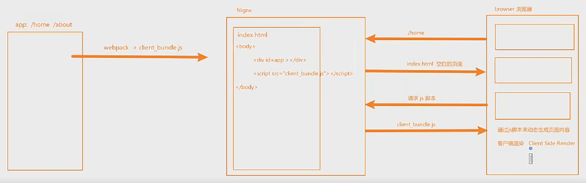
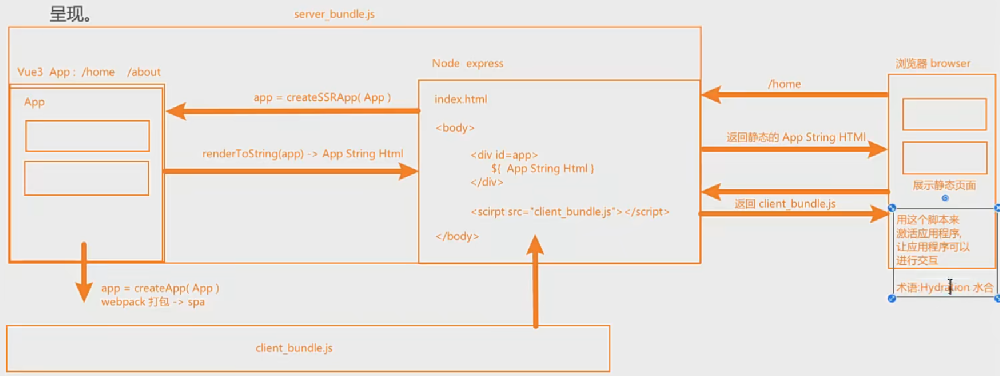
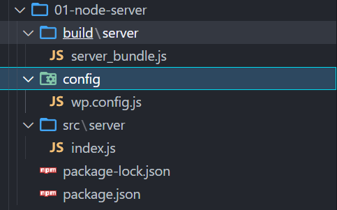
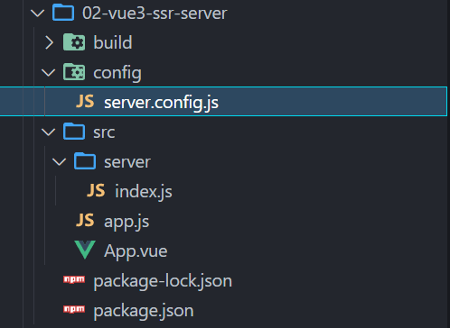
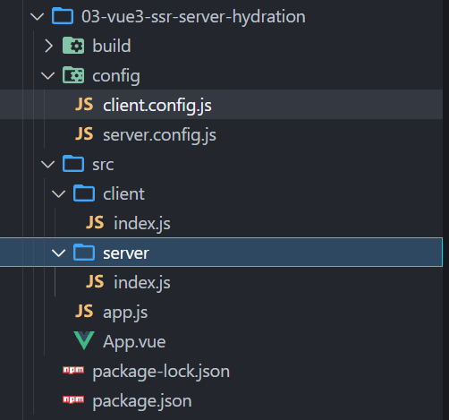
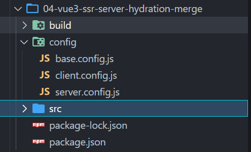
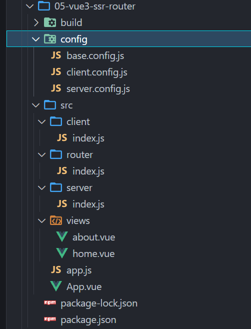
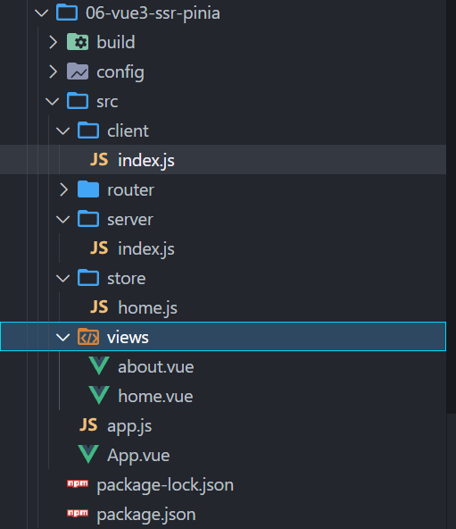
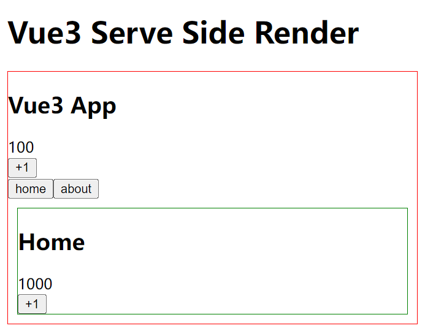

## **单页应用程序（SPA）**

单页应用程序 (SPA) 全称是：Single-page application，SPA 应用是在客户端呈现的（术语称：CRS）。

- SPA 应用默认只返回一个空 HTML 页面，如：body 只有\<div id="app">\</div>。

- 而整个应用程序的内容都是通过 Javascript 动态加载，包括应用程序的逻辑、UI 以及与服务器通信相关的所有数据。

- 构建 SPA 应用常见的库和框架有： React、AngularJS、Vue.js 等。

客户端渲染原理



## **SPA 优缺点**

SPA 的优点

只需加载一次

- SPA 应用程序只需要在第一次请求时加载页面，页面切换不需重新加载，而传统的 Web 应用程序必须在每次请求时都得加载页面，需要花费更多时间。因此，SPA 页面加载速度要比传统 Web 应用程序更快。

更好的用户体验

- SPA 提供类似于桌面或移动应用程序的体验。用户切换页面不必重新加载新页面
- 切换页面只是内容发生了变化，页面并没有重新加载，从而使体验变得更加流畅

可轻松的构建功能丰富的 Web 应用程序

SPA 的缺点

- SPA 应用默认只返回一个空 HTML 页面，不利于 SEO （search engine optimization )
- 首屏加载的资源过大时，一样会影响首屏的渲染
- 也不利于构建复杂的项目，复杂 Web 应用程序的大文件可能变得难以维护

## **爬虫-工作流程**

Google 爬虫的工作流程分为 3 个阶段，并非每个网页都会经历这 3 个阶段：

**抓取**：

- 爬虫（也称蜘蛛），从互联网上发现各类网页，网页中的外部连接也会被发现。
- 抓取数以十亿被发现网页的内容，如：文本、图片和视频

**索引编制**：

- 爬虫程序会分析网页上的文本、图片和视频文件
- 并将信息存储在大型数据库（索引区）中
- 例如 \<title> 元素和 Alt 属性、图片、视频等
- 爬虫会对内容类似的网页归类分组
- 不符合规则内容和网站会被清理
  - 如：禁止访问 或 需要权限网站等等

**呈现搜索结果**：

当用户在 Google 中搜索时，搜索引擎会根据内容的类型，选择一组网页中最具代表性的网页进行呈现


## **搜索引擎的优化（SEO）**

语义性 HTML 标记

- 标题用\<h1>，一个页面只有一个； 副标题用\<h2>到\<h6>。
- 不要过度使用 h 标签，多次使用不会增加 SEO（search engine optimization )。
- 段落用\<p>，列表用\<ul>，并且 li 只放在 ul 中 等等。

每个页面需包含：标题 + 内部链接

- 每个页面对应的 title，同一网站所有页面都有内链可以指向首页

确保链接可供抓取，如右图所示：


meta 标签优化：设置 description keywords 等

文本标记和 img：

- 比如\<b>和\<strong>加粗文本的标签，爬虫也会关注到该内容
- img 标签添加 alt 属，图片加载失败，爬虫会取 alt 内容。

robots.txt 文件：规定爬虫可访问您网站上的哪些网址。

sitemap.xml 站点地图：在站点地图列出所有网页，确保爬虫不会漏掉某些网页

更多查看：https://developers.google.com/search/docs/crawling-indexing/valid-page-metadata

## **静态站点生成（SSG）**

静态站点生成(SSG) 全称是：Static Site Generate，是预先生成好的静态网站。

- SSG 应用一般在构建阶段就确定了网站的内容。
- 如果网站的内容需要更新了，那必须得重新再次构建和部署。
- 构建 SSG 应用常见的库和框架有： Vue Nuxt、 React Next.js 等。

SSG 的优点：

- 访问速度非常快，因为每个页面都是在构建阶段就已经提前生成好了。
- 直接给浏览器返回静态的 HTML，也有利于 SEO
- SSG 应用依然保留了 SPA 应用的特性，比如：前端路由、响应式数据、虚拟 DOM 等

SSG 的缺点：

- 页面都是静态，不利于展示实时性的内容，实时性的更适合 SSR。
- 如果站点内容更新了，那必须得重新再次构建和部署。

## **服务器端渲染（SSR）**

服务器端渲染全称是：Server Side Render，在服务器端渲染页面，并将渲染好 HTML 返回给浏览器呈现。

SSR 应用的页面是在服务端渲染的，用户每请求一个 SSR 页面都会先在服务端进行渲染，然后将渲染好的页面，返回给浏览器呈现。

构建 SSR 应用常见的库和框架有： Vue Nuxt、 React Next.js 等（SSR 应用也称同构应用） 。

服务器端渲染原理



## **SSR 优缺点**

SSR 的优点

更快的首屏渲染速度

- 浏览器显示静态页面的内容要比 JavaScript 动态生成的内容快得多。
- 当用户访问首页时可立即返回静态页面内容，而不需要等待浏览器先加载完整个应用程序。

更好的 SEO

- 爬虫是最擅长爬取静态的 HTML 页面，服务器端直接返回一个静态的 HTML 给浏览器。
- 这样有利于爬虫快速抓取网页内容，并编入索引，有利于 SEO。

SSR 应用程序在 Hydration（水合） 之后依然可以保留 Web 应用程序的交互性。比如：前端路由、响应式数据、虚拟 DOM 等

SSR 的缺点

- SSR 通常需要对服务器进行更多 API 调用，以及在服务器端渲染需要消耗更多的服务器资源，成本高。
- 增加了一定的开发成本，用户需要关心哪些代码是运行在服务器端，哪些代码是运行在浏览器端。
- SSR 配置站点的缓存通常会比 SPA 站点要复杂一点。

## **SSR 解决方案**

SSR 的解决方案：

- 方案一：php、jsp ...
- 方案二：从零搭建 SSR 项目（ Node+webpack+Vue/React ）
- 方案三：直接使用流行的框架（推荐）
  - React : Next.js
  - Vue3 : Nuxt3 | | Vue2 : Nuxt.js
  - Angular : Anglular Universal

SSR 应用场景非常广阔，比如：

- SaaS 产品，如：电子邮件网站、在线游戏、客户关系管理系统（CRM）、采购系统等
- 门户网站、电子商务、零售网站
- 单个页面、静态网站、文档类网站等等

## **邂逅 Vue3 + SSR**

Vue 除了支持开发 SPA 应用之外，其实也是支持开发 SSR 应用的。

在 Vue 中创建 SSR 应用，需要调用 createSSRApp 函数，而不是 createApp

- createApp：创建应用，直接挂载到页面上
- createSSRApp：创建应用，是在激活的模式下挂载应用

服务端用 @vue/server-renderer 包中的 renderToString 来进行渲染。

## **Node Server 搭建**

需安装的依赖项：

- npm i express
- npm i –D nodemon
- npm i -D webpack webpack-cli webpack-node-externals

nodemon:

启动 Node 程序时并监听文件的变化，变化即刷新

webpack-node-externals：

排除掉 node_modules 中所有的模块

文件目录结构如下：



pageckage.json

```json
{
  "name": "01-node-server",
  "version": "1.0.0",
  "description": "",
  "main": "index.js",
  "scripts": {
    "test": "echo \"Error: no test specified\" && exit 1",
    "build:server": "webpack --config ./config/wp.config.js --watch",
    "start": "nodemon ./build/server/server_bundle.js",
    "dev": "nodemon ./src/server/index.js"
  },
  "keywords": [],
  "author": "",
  "license": "ISC",
  "dependencies": {
    "express": "^4.18.2"
  },
  "devDependencies": {
    "nodemon": "^2.0.20",
    "webpack": "^5.75.0",
    "webpack-cli": "^5.0.1",
    "webpack-node-externals": "^3.0.0"
  }
}
```

src/server/index.js

```javascript
let express = require("express");
let server = express();

server.get("/", (req, res) => {
  res.send(
    `
     Hello Node Server 2000
    `
  );
});

server.listen(3000, () => {
  console.log("start node server on 3000 ~");
});
```

到这里执行 npm run dev，然后浏览器访问 localhost:3000 就可以看到 Hello Node Server 2000

接着我们对服务进行打包，因为等会会在 src/server/index.js 中引入 vue、pinia 等

config/wp.config.js

```javascript
let path = require("path");
let nodeExternals = require("webpack-node-externals");
module.exports = {
  target: "node", // fs path
  mode: "development",
  entry: "./src/server/index.js",
  output: {
    filename: "server_bundle.js",
    path: path.resolve(__dirname, "../build/server"),
  },
  externals: [nodeExternals()], // 排除 node_module 中的包
};
```

这样执行 npm run build:server 的时候就会在 build/server 目录下生成一个 server_bundle.js 文件，接着执行

npm run start，跑起来访问 localhost:3000，这样我们的服务就算打包好了。

## **Vue3 + SSR 搭建**

需安装的依赖项：

- npm i express
- npm i –D nodemon
- npm i vue
- npm i -D vue-loader
- npm i -D babel-loader @babel/preset-env
- npm i -D webpack webpack-cli
- npm i -D webpack-merge webpack-node-externals

vue-loader：加载.vue 文件

webpack-merge： 用来合并 webpack 配置

babel-loader、@babel/preset-env

- 加载 JS 文件，转换新语法

## **跨请求状态污染**

在 SPA 中，整个生命周期中只有一个 App 对象实例 或 一个 Router 对象实例 或 一个 Store 对象实例都是可以的，因为每个用户在

使用浏览器访问 SPA 应用时，应用模块都会重新初始化，这也是一种**单例模式。**

然而，在 SSR 环境下，App 应用模块通常只在服务器启动时初始化一次。同一个应用模块会在多个服务器请求之间被复用，而

我们的单例状态对象也一样，也会在多个请求之间被复用，比如：

- 当某个用户对共享的单例状态进行修改，那么这个状态可能会意外地泄露给另一个在请求的用户。
- 我们把这种情况称为：**跨请求状态污染**。

为了避免这种跨请求状态污染，SSR 的解决方案是：

- 可以在每个请求中为整个应用创建一个全新的实例，包括后面的 router 和全局 store 等实例。
- 所以我们在创建 App 或 路由 或 Store 对象时都是使用一个函数来创建，保证每个请求都会创建一个全新的实例。
- 这样也会有缺点：需要消耗更多的服务器的资源。

文件目录结构如下：



src/server/index.js

```javascript
let express = require("express");
let server = express();
import createApp from "../app";
import { renderToString } from "@vue/server-renderer";

server.get("/", async (req, res) => {
  let app = createApp();
  let appStringHtml = await renderToString(app);
  res.send(
    `
    <!DOCTYPE html>
    <html lang="en">
    <head>
      <meta charset="UTF-8">
      <meta http-equiv="X-UA-Compatible" content="IE=edge">
      <meta name="viewport" content="width=device-width, initial-scale=1.0">
      <title>Document</title>
    </head>
    <body>
      <h1>Vue3 Serve Side Render</h1>
      <div id="app">
        ${appStringHtml}
      </div>
      
    </body>
    </html>
    `
  );
});

server.listen(3000, () => {
  console.log("start node server on 3000 ~");
});
```

src/app.js

```javascript
import { createSSRApp } from "vue";
import App from "./App.vue";

// 这里为什么写一个函数来返回app实例 ?
// 通过函数来返回app实例,可以保证每个请求都会返回一个新的app实例, 来避免 跨请求状态的污染
export default function createApp() {
  let app = createSSRApp(App);
  return app;
}
```

src/App.vue

```html
<template>
  <div class="app" style="border: 1px solid red">
    <h2>Vue3 App</h2>
    <div>{{ count }}</div>
    <button @click="addCounter">+1</button>
  </div>
</template>

<script setup>
  import { ref } from "vue";
  const count = ref(100);
  function addCounter() {
    count.value++;
  }
</script>
```

config/server.config.js，这里改名了

```javascript
let path = require("path");
let nodeExternals = require("webpack-node-externals");
let { VueLoaderPlugin } = require("vue-loader/dist/index");
module.exports = {
  target: "node", // fs path
  mode: "development",
  entry: "./src/server/index.js",
  output: {
    filename: "server_bundle.js",
    path: path.resolve(__dirname, "../build/server"),
  },
  module: {
    rules: [
      {
        test: /\.js$/,
        loader: "babel-loader",
        options: {
          presets: ["@babel/preset-env"],
        },
      },
      {
        test: /\.vue$/,
        loader: "vue-loader",
      },
    ],
  },
  plugins: [new VueLoaderPlugin()],
  resolve: {
    // 添加了这些扩展名之后, 项目中导报如下的扩展名文件就不需要编写文件的后缀
    extensions: [".js", ".json", ".wasm", ".jsx", ".vue"],
  },
  externals: [nodeExternals()], // 排除 node_module 中的包
};
```

package.json

```json
"scripts": {
    "build:server": "webpack --config ./config/server.config.js --watch", // 这里也得改
    "start": "nodemon ./build/server/server_bundle.js"
},
```

同样执行 npm run build:server，然后执行 npm run start

访问 localhost:3000，就可以看到 App.vue 了


不过，+1 按钮不能点击，需要进行水合，具体往下看

## **Vue3 SSR + Hydration**

服务器端渲染页面 + 客户端激活页面，是页面有交互效果（这个过程称为：Hydration 水合）

Hydration 的具体步骤如下：

- 1.开发一个 App 应用，比如 App.vue
- 2.将 App.vue 打包为一个客户端的 client_bundle.js 文件
  - 用来激活应用，使页面有交互效果
- 3.将 App.vue 打包为一个服务器端的 server_bundle.js 文件
  - 用来在服务器端动态生成页面的 HTML
- 4. server_bundle.js 渲染的页面 + client_bundle.js 文件进行 Hydration

页面目录结构如下：



src/client/index.js

```javascript
import { createApp } from "vue";
import App from "../App.vue";
// spa
let app = createApp(App);
app.mount("#app");
```

src/server/index.js

```javascript
let express = require("express");
let server = express();
import createApp from "../app";
import { renderToString } from "@vue/server-renderer";

// 部署 静态资源 这样下面script引入的client/client_bundle.js才会在build目录下
server.use(express.static("build"));

server.get("/", async (req, res) => {
  let app = createApp();
  let appStringHtml = await renderToString(app);
  res.send(
    `
    <!DOCTYPE html>
    <html lang="en">
    <head>
      <meta charset="UTF-8">
      <meta http-equiv="X-UA-Compatible" content="IE=edge">
      <meta name="viewport" content="width=device-width, initial-scale=1.0">
      <title>Document</title>
    </head>
    <body>
      <h1>Vue3 Serve Side Render</h1>
      <div id="app">
        ${appStringHtml}
      </div>
      <script src="/client/client_bundle.js"></script>
    </body>
    </html>
    `
  );
});

server.listen(3000, () => {
  console.log("start node server on 3000 ~");
});
```

config/client.config.js

```javascript
let path = require("path");
let { VueLoaderPlugin } = require("vue-loader");
let { DefinePlugin } = require("webpack");
module.exports = {
  target: "web",
  mode: "development",
  entry: "./src/client/index.js",
  output: {
    filename: "client_bundle.js",
    path: path.resolve(__dirname, "../build/client"),
  },
  module: {
    rules: [
      {
        test: /\.js$/,
        loader: "babel-loader",
        options: {
          presets: ["@babel/preset-env"],
        },
      },
      {
        test: /\.vue$/,
        loader: "vue-loader",
      },
    ],
  },
  plugins: [
    new VueLoaderPlugin(),
    new DefinePlugin({
      __VUE_OPTIONS_API__: false, // 处理控制台的警告
      __VUE_PROD_DEVTOOLS__: false,
    }),
  ],
  resolve: {
    // 添加了这些扩展名之后, 项目中导报如下的扩展名文件就不需要编写文件的后缀
    extensions: [".js", ".json", ".wasm", ".jsx", ".vue"],
  },
};
```

package.json

```json
"scripts": {
  "build:server": "webpack --config ./config/server.config.js --watch",
  "build:client": "webpack --config ./config/client.config.js --watch",
  "start": "nodemon ./build/server/server_bundle.js"
},
```

## **Vue3 SSR + Vue Router**

需再安装的依赖项：

npm i vue-router

注意事项：

- 为了避免 跨请求状态污染
- 需在每个请求中都创建一个全新 router

在使用路由之前，我们对 webpack 进行一下配置，因为 config/client.config.js 和 config/server.config.js 有很多相同的代码，需要进行合并

目录结构如下：



config/base.config.js

```javascript
let { VueLoaderPlugin } = require("vue-loader");
module.exports = {
  mode: "development",
  module: {
    rules: [
      {
        test: /\.js$/,
        loader: "babel-loader",
        options: {
          presets: ["@babel/preset-env"],
        },
      },
      {
        test: /\.vue$/,
        loader: "vue-loader",
      },
    ],
  },
  plugins: [new VueLoaderPlugin()],
  resolve: {
    // 添加了这些扩展名之后, 项目中导报如下的扩展名文件就不需要编写文件的后缀
    extensions: [".js", ".json", ".wasm", ".jsx", ".vue"],
  },
};
```

config/client.config.js

```javascript
let path = require("path");
let { DefinePlugin } = require("webpack");
let { merge } = require("webpack-merge");
let baseConfig = require("./base.config");
module.exports = merge(baseConfig, {
  target: "web",
  entry: "./src/client/index.js",
  output: {
    filename: "client_bundle.js",
    path: path.resolve(__dirname, "../build/client"),
  },

  plugins: [
    new DefinePlugin({
      __VUE_OPTIONS_API__: false,
      __VUE_PROD_DEVTOOLS__: false,
    }),
  ],
});
```

config/server.config.js

```javascript
let path = require("path");
let nodeExternals = require("webpack-node-externals");
let { merge } = require("webpack-merge");
let baseConfig = require("./base.config");

module.exports = merge(baseConfig, {
  target: "node", // fs path
  entry: "./src/server/index.js",
  output: {
    filename: "server_bundle.js",
    path: path.resolve(__dirname, "../build/server"),
  },
  externals: [nodeExternals()], // 排除 node_module 中的包
});
```

目录结构如下：



src/client/index.js

```javascript
import { createApp } from "vue";
import { createWebHistory } from "vue-router";
import App from "../App.vue";
import createRouter from "../router";
// spa
let app = createApp(App);

// 安装路由插件
let router = createRouter(createWebHistory());
app.use(router);

router.isReady().then(() => {
  app.mount("#app");
});
```

src/server/index.js

```javascript
let express = require("express");
let server = express();
import createApp from "../app";
import { renderToString } from "@vue/server-renderer";
import createRouter from "../router";
// 内存路由-> node用
import { createMemoryHistory } from "vue-router";

// 部署 静态资源
server.use(express.static("build"));

// /  or /about
server.get("/*", async (req, res) => {
  let app = createApp();

  // app 安装路由插件
  let router = createRouter(createMemoryHistory());
  app.use(router);
  await router.push(req.url || "/"); //  /  or /about 等待页面跳转好
  await router.isReady(); // 等待(异步)路由加载完成,在渲染页面

  let appStringHtml = await renderToString(app);
  res.send(
    `
    <!DOCTYPE html>
    <html lang="en">
    <head>
      <meta charset="UTF-8">
      <meta http-equiv="X-UA-Compatible" content="IE=edge">
      <meta name="viewport" content="width=device-width, initial-scale=1.0">
      <title>Document</title>
    </head>
    <body>
      <h1>Vue3 Serve Side Render</h1>
      <div id="app">
        ${appStringHtml}
      </div>
      <script src="/client/client_bundle.js"></script>
    </body>
    </html>
    `
  );
});

server.listen(3000, () => {
  console.log("start node server on 3000 ~");
});
```

src/router/index.js

```javascript
import { createRouter } from "vue-router";

const routes = [
  {
    path: "/",
    component: () => import("../views/home.vue"),
  },
  {
    path: "/about",
    component: () => import("../views/about.vue"),
  },
];

export default function (history) {
  // history由外面传进来
  return createRouter({
    history,
    routes,
  });
}
```

src/App.vue

```html
<template>
  <div class="app" style="border: 1px solid red">
    <h2>Vue3 App</h2>
    <div>{{ count }}</div>
    <button @click="addCounter">+1</button>

    <div>
      <router-link to="/">
        <button>home</button>
      </router-link>
      <router-link to="/about">
        <button>about</button>
      </router-link>
    </div>
    <!-- 路由的占位 -->
    <router-view></router-view>
  </div>
</template>

<script setup>
  import { ref } from "vue";
  const count = ref(100);
  function addCounter() {
    count.value++;
  }
</script>
```

src/views/home.vue

```html
<template>
  <div class="app" style="border: 1px solid green; margin: 10px">
    <h2>Home</h2>
    <div>{{ count }}</div>
    <button @click="addCounter">+1</button>
  </div>
</template>

<script setup>
  import { ref } from "vue";
  const count = ref(200);
  function addCounter() {
    count.value++;
  }
</script>
```

src/views/about.vue

```html
<template>
  <div class="app" style="border: 1px solid blue; margin: 10px">
    <h2>About</h2>
    <div>{{ count }}</div>
    <button @click="addCounter">+1</button>
  </div>
</template>

<script setup>
  import { ref } from "vue";
  const count = ref(300);
  function addCounter() {
    count.value++;
  }
</script>
```

## **Vue3 SSR + Pinia**

需再安装的依赖项：

npm i pinia

注意事项：

- 为了避免 跨请求状态污染
- 需在每个请求中都创建一个全新 pinia

目录结构如下：



src/client/index.js

```javascript
import { createApp } from "vue";
import { createWebHistory } from "vue-router";
import App from "../App.vue";
import createRouter from "../router";
import { createPinia } from "pinia";
// spa
let app = createApp(App);

// 安装路由插件
let router = createRouter(createWebHistory());
app.use(router);

// app 安装pinia插件
let pinia = createPinia();
app.use(pinia);

router.isReady().then(() => {
  app.mount("#app");
});
```

src/server/index.js

```javascript
let express = require("express");
let server = express();
import createApp from "../app";
import { renderToString } from "@vue/server-renderer";
import createRouter from "../router";
// 内存路由-> node用
import { createMemoryHistory } from "vue-router";
import { createPinia } from "pinia";
// 部署 静态资源
server.use(express.static("build"));

// /  or /about
server.get("/*", async (req, res) => {
  let app = createApp();

  // app 安装路由插件
  let router = createRouter(createMemoryHistory());
  app.use(router);
  await router.push(req.url || "/"); //  /  or /about 等待页面跳转好
  await router.isReady(); // 等待(异步)路由加载完成,在渲染页面

  // app 安装pinia插件
  let pinia = createPinia();
  app.use(pinia);

  let appStringHtml = await renderToString(app);
  res.send(
    `
    <!DOCTYPE html>
    <html lang="en">
    <head>
      <meta charset="UTF-8">
      <meta http-equiv="X-UA-Compatible" content="IE=edge">
      <meta name="viewport" content="width=device-width, initial-scale=1.0">
      <title>Document</title>
    </head>
    <body>
      <h1>Vue3 Serve Side Render</h1>
      <div id="app">
        ${appStringHtml}
      </div>
      <script src="/client/client_bundle.js"></script>
    </body>
    </html>
    `
  );
});

server.listen(3000, () => {
  console.log("start node server on 3000 ~");
});
```

src/store/home.js

```javascript
import { defineStore } from "pinia";

export const useHomeStore = defineStore("home", {
  state() {
    return {
      count: 1000,
    };
  },
  actions: {
    increment() {
      this.count++;
    },
    decrement() {
      this.count--;
    },
    // async fetchHomeData() {
    //   let res = await axios.get()
    //   this.homeInfo = res.data
    // }
  },
});
```

src/views/home.vue

```html
<template>
  <div class="app" style="border: 1px solid green; margin: 10px">
    <h2>Home</h2>
    <div>{{ count }}</div>
    <button @click="addCounter">+1</button>
  </div>
</template>

<script setup>
  import { storeToRefs } from "pinia";
  import { useHomeStore } from "../store/home";
  let homeStore = useHomeStore();
  let { count } = storeToRefs(homeStore);
  function addCounter() {
    count.value++;
  }
</script>
```

src/views/about.vue

```html
<template>
  <div class="app" style="border: 1px solid blue; margin: 10px">
    <h2>About</h2>
    <div>{{ count }}</div>
    <button @click="addCounter">+1</button>
  </div>
</template>

<script setup>
  import { storeToRefs } from "pinia";
  import { useHomeStore } from "../store/home";
  let homeStore = useHomeStore();
  let { count } = storeToRefs(homeStore);
  function addCounter() {
    count.value++;
  }
</script>
```


