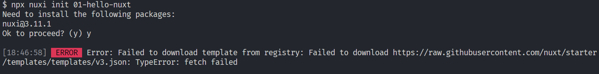
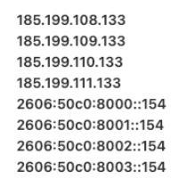
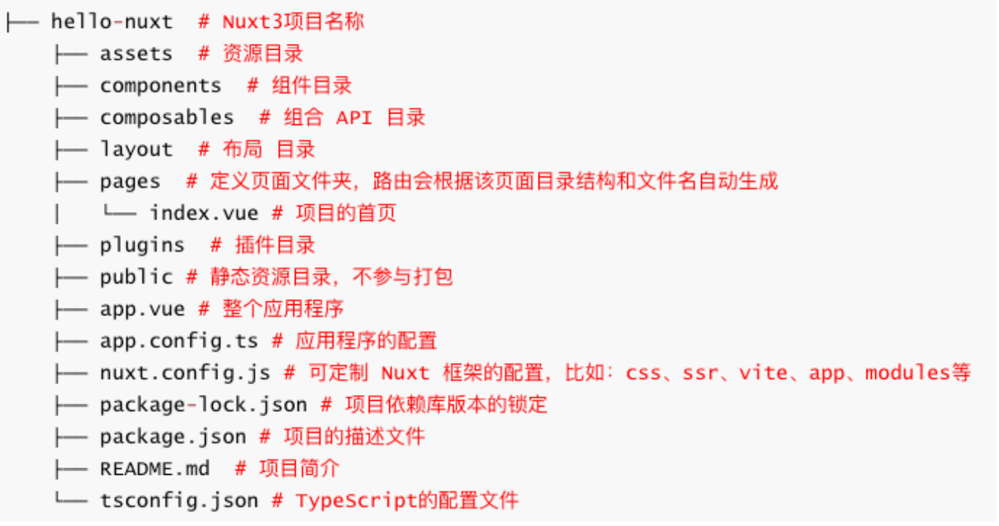
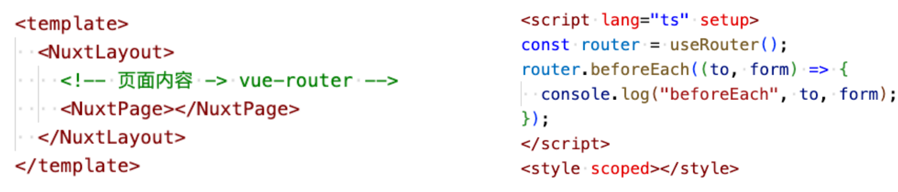
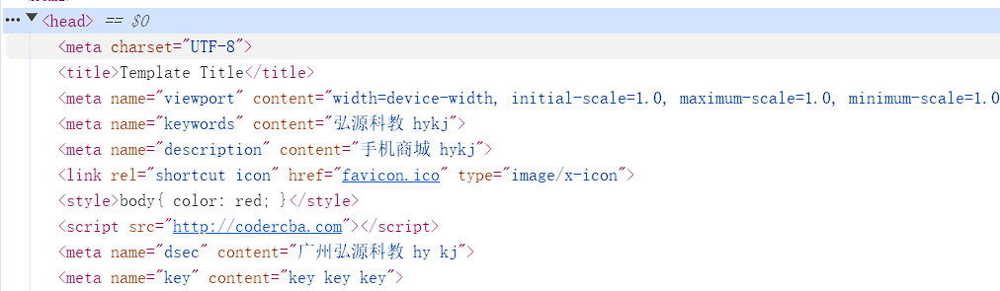
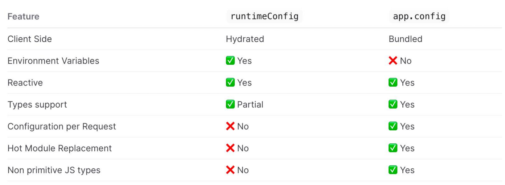
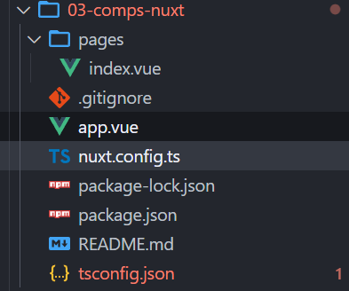
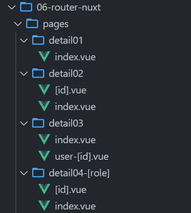

## **什么是 Nuxt？**

在了解 Nuxt 之前，我们先来了解一下创建一个现代应用程序，所需的技术：

- 支持数据双向绑定 和 组件化（ Nuxt 选择了 Vue.js ）。
- 处理客户端的导航（ Nuxt 选择了 vue-router ）。
- 支持开发中热模块替换和生产环境代码打包（ Nuxt 支持 webpack 5 和 Vite ）。
- 兼容旧版浏览器，支持最新的 JavaScript 语法转译（ Nuxt 使用 esbuild ）。
- 应用程序支持开发环境服务器，也支持服务器端渲染 或 API 接口开发。
- Nuxt 使用 h3 来实现部署可移植性（h3 是一个极小的高性能的 http 框架）
  - 如：支持在 Serverless、Workers 和 Node.js 环境中运行。

Nuxt 是一个 **直观的 Web 框架**

- 自 2016 年 10 月以来，Nuxt 专门负责集成上述所描述的事情 ，并提供前端和后端的功能。
- Nuxt 框架可以用来快速构建下一个 Vue.js 应用程序，如支持 CSR 、SSR、SSG 渲染模式的应用等。

## **Nuxt 发展史**

Nuxt.js

诞生于 2016 年 10 月 25 号，由 Sebastien Chopin 创建，主要是基于 Vue2 、Webpack2 、Node 和 Express。

在 2018 年 1 月 9 日， Sebastien Chopin 正式宣布，发布 Nuxt.js 1.0 版本。

- 重要的变化是**放弃了对 node < 8 的支持**

2018 年 9 月 21 日， ， Sebastien Chopin 正式宣布，发布 Nuxt.js 2.0 版本。

- 开始使用 Webpack 4 及其技术栈， 其它的并没有做出重大更改。

2021 年 8 月 12 日至今，Nuxt.js 最新的版本为：Nuxt.js 2.15.8

Nuxt3 版本：

- 经过 16 个月的工作，Nuxt 3 beta 于 2021 年 10 月 12 日发布，引入了基于 Vue 3、Vite 和 Nitro( 服务引擎 ) 。
- 六个月后， 2022 年 4 月 20 日，Pooya Parsa 宣布 Nuxt 3 的第一个候选版本，代号为“Mount Hope”
- 在 2022 年 11 月 16 号， Pooya Parsa 再次宣布 Nuxt3 发布为第一个正式稳定版本。

官网地址： https://nuxt.com/

## **Nuxt3 特点**

Vue 技术栈

- Nuxt3 是基于 Vue3 + Vue Router + Vite 等技术栈，全程 Vue3+Vite 开发体验（Fast）。

自动导包

- Nuxt 会自动导入辅助函数、组合 API 和 Vue API ，无需手动导入。
- 基于规范的目录结构，Nuxt 还可以对自己的组件、 插件使用自动导入。

约定式路由（目录结构即路由）

- Nuxt 路由基于 vue-router，在 pages/ 目录中创建的每个页面，都会根据目录结构和文件名来自动生成路由

渲染模式：Nuxt 支持多种渲染模式（SSR、CSR、SSG 等）

利于搜索引擎优化：服务器端渲染模式，不但可以提高首屏渲染速度，还利于 SEO

服务器引擎

- 在开发环境中，它使用 Rollup 和 Node.js 。
- 在生产环境中，使用 Nitro 将您的应用程序和服务器构建到一个通用.output 目录中。
  - Nitro 服务引擎提供了跨平台部署的支持，包括 Node、Deno、Serverless、Workers 等平台上部署。

## **Nuxt.js VS Nuxt3**


## **Nuxt3 环境搭建**

在开始之前，请确保您已安装推荐的设置**：**

- Node.js （最新 LTS 版本，或 16.11 以上）
- VS Code
  - Volar、ESLint、Prettier

命令行工具，新建项目（hello-nuxt )

- 方式一：npx nuxi init hello-nuxt
- 方式二：pnpm dlx nuxi init hello-nuxt
- 方式三：npm install –g nuxi && nuxi init hello-nuxt

运行项目: cd hello-nuxt

- yarn install
- pnpm install --shamefully-hoist（创建一个扁平的 node_modules 目录结构，类似 npm 和 yarn）
  - 或者在项目根目录下创建一个.npmrc 文件，然后输入 shamefully-hoist=true
- yarn dev

## **创建项目报错**

执行 npx nuxi init 01-hello-nuxt 报如下错误，主要是网络不通导致：



解决方案：

- 第一步：ping raw.githubusercontent.com 检查是否通
- 第二步：如果访问不通，代表是网络不通
- 第三步：配置 host，本地解析域名
  - Mac 电脑 host 配置路径： /etc/hosts
  - Win 电脑 host 配置路由：c:/Windows/System32/drivers/etc/hosts
- 第四步：在 host 文件中新增一行 ，编写如下配置：
  - 185.199.108.133 raw.githubusercontent.com
  - 前面配置的 IP 可使用如下：
  - 
- 第五步：重新 ping 域名，如果通了就可以用了
- 第六步：重新开一个终端创建项目即可

## **Nuxt3 目录结构**



package.json


.nuxt 目录下的 types 下会生成很多类型，这些类型是什么时候生成的呢？


是在执行 nuxt prepare 的时候生成的。

## **应用入口（App.vue）**

默认情况下，Nuxt 会将此文件视为**入口**点，并为应用程序的每个路由呈现其内容，常用于：

- 定义页面布局 Layout 或 自定义布局，如：NuxtLayout
- 定义路由的占位，如：NuxtPage，对 router-view 做了一层包装
- 编写全局样式
- 全局监听路由 等等



app.vue

```html
<template>
  <div>
    <!-- 组件库的组件 nuxt/ui -->
    <NuxtWelcome />
  </div>
</template>
<script setup>
  // 监听全局路由
  //  let router = useRouter()
  //  router.beforeEach((to, form)=>{

  //  })
</script>
<style></style>
```

## **Nuxt 配置（nuxt.config）**

nuxt.config.ts 配置文件位于项目的根目录，可对 Nuxt 进行自定义配置。比如，可以进行如下配置：

runtimeConfig：运行时配置，即定义环境变量

- 可通过.env 文件中的环境变量来覆盖，优先级（.env > runtimeConfig）
  - .env 的变量会打入到 process.env 中，符合规则的会覆盖 runtimeConfig 的变量
  - .env 一般用于某些终端启动应用时动态指定配置，同时支持 dev 和 pro

appConfig： 应用配置，定义在构建时确定的公共变量，如：theme

- 配置会和 app.config.ts 的配置合并（优先级 app.config.ts > appConfig）

app：app 配置

- head：给每个页面上设置 head 信息，也支持 useHead 配置和内置组件。

ssr：指定应用渲染模式

router：配置路由相关的信息，比如在客户端渲染可以配置 hash 路由

alias：路径的别名，默认已配好

modules：配置 Nuxt 扩展的模块，比如：@pinia/nuxt @nuxt/image

routeRules：定义路由规则，可更改路由的渲染模式或分配基于路由缓存策略（公测阶段）

builder：可指定用 vite 还是 webpack 来构建应用，默认是 vite。如切换为 webpack 还需要安装额外的依赖。

nuxt.config.ts

```typescript
export default defineNuxtConfig({
  // 1.这里定义的运行时配置会不会打入到 process.env
  runtimeConfig: {
    appKey: "aabbcc", // server
    public: {
      baseURL: "http://codercba.com", // server and client -> client_bundle.js
    },
  },
});
```

app.vue

runtimeConfig 的配置会被运行在服务端，如果写在 public 里面可以同时运行在客户端和服务端

```html
<script setup>
  // 1.判断代码之心的环境
  if (process.server) {
    console.log("运行在 server");
  }

  if (process.client) {
    console.log("运行在 client");
  }

  if (typeof window === "object") {
    console.log("运行在 client");
  }

  // 2.获取运行时配置( server and client )
  const runtimeConfig = useRuntimeConfig();
  if (process.server) {
    console.log(runtimeConfig.appKey); // "aabbcc"
    console.log(runtimeConfig.public.baseURL); // "http://codercba.com"
  }
  if (process.client) {
    // console.log(runtimeConfig.appKey); // not
    console.log(runtimeConfig.public.baseURL);
  }
</script>
```

我们也可以通过.env 来配置环境变量，它的优先级会比 runtimeConfig 高，会覆盖 runtimeConfig 中的配置

.env

注意：这里的格式要以 NUXT\_开头，并且后面的名字是由 runtimeConfig 中的字段比如 appKey 转变成 APP_KEY 才可以，APP_KEY2 不行

```json
NUXT_APP_KEY = 'DDDDDD'
# NUXT_APP_KEY2 = 'dddddd'
NUXT_PUBLIC_BASE_URL="http://localhost"
# 在这里写的变量会添加到 process.env.xxx 中
PORT=9090
```

在 app.vue 中打印 process.env，就可以获取到这些变量，但是注意，是拿不到 process.env.appKey，因为这个变量没有定义

## **应用配置（app.config）**

Nuxt 3 提供了一个 app.config.ts 应用配置文件，用来定义在构建时确定的公共变量，例如：

- 网站的标题、主题色 以及任何不敏感的项目配置

app.config.ts 配置文件中的选项不能使用 env 环境变量来覆盖，与 runtimeConfig 不同

不要将秘密或敏感信息放在 app.config.ts 文件中，该文件是客户端公开

nuxt.config.ts

appConfig

```typescript
export default defineNuxtConfig({
  // 2.定义应用的配置
  appConfig: {
    title: "Hello Nuxt3 HYKJ",
    theme: {
      primary: "yellow",
    },
  },
});
```

app.vue

```html
<script setup>
  // 3.获取appConfig
  let appConifg = useAppConfig();
  // server client
  console.log(appConifg.title);
  console.log(appConifg.theme.primary);

  onMounted(() => {
    // onMounted只会运行在客户端
    document.title = appConifg.title;
  });
</script>
```

appConfig 的配置也可以单独抽取到 app.config.ts 中进行配置，在 app.config.ts 中的配置，如果和 appConfig 重复，会覆盖掉 appConfig 配置

app.config.ts（根目录下）

```typescript
export default defineAppConfig({
  title: "Hello Nuxt3 liujun",
  theme: {
    primary: "blue",
  },
});
```

## app 配置

app 配置有三种方式：

方式一：在 nuxt.config.ts 中进行配置

```typescript
export default defineNuxtConfig({
  // 3.app 配置
  app: {
    // 给app所有的页面的head添加的配置(SEO, 添加外部的资源)
    head: {
      title: "HYKJ",
      charset: "UTF-8",
      viewport:
        "width=device-width, initial-scale=1.0, maximum-scale=1.0, minimum-scale=1.0,user-scalable=no",
      meta: [
        {
          name: "keywords",
          content: "弘源科教 hykj",
        },
        {
          name: "description",
          content: "手机商城 hykj",
        },
      ],
      link: [
        {
          rel: "shortcut icon",
          href: "favicon.ico",
          type: "image/x-icon",
        },
      ],
      style: [
        {
          children: `body{ color: red; }`,
        },
      ],
      script: [
        {
          src: "http://codercba.com",
        },
      ],
    },
  },
});
```

方式二：

在组件内使用 useHead，比如 app.vue

```html
<script setup>
  // 4.动态的该app所有的页面添加 head的内容
  useHead({
    title: "app useHead", // Ref
    bodyAttrs: {
      class: "liujun",
    },
    meta: [
      {
        name: "dsec",
        content: "广州弘源科教 hy kj",
      },
    ],
    style: [],
    link: [],
    // script: [
    //   {
    //     src: "http://liujun.com",
    //     body: true,
    //   },
    // ],
  });
</script>
```

方式三：

在组件内的 template 中使用

```html
<template>
  <div>
    <Title>Template Title</Title>
    <Meta name="key" content="key key key"></Meta>
  </div>
</template>
```

最终都会被添加到 head 中



这三种方式优先级：方式三 > 方式二 > 方式一

## router 配置

配置路由相关的信息，比如在客户端渲染可以配置 hash 路由

nuxt.config.ts

```typescript
export default defineNuxtConfig({
  // 4.spa
  ssr: false,
  router: {
    options: {
      hashMode: true, // 只在spa应用是有效的
    },
  },
});
```

## **runtimeConifg vs app.config**

runtimeConfig 和 app.config 都用于向应用程序公开变量。要确定是否应该使用其中一种，以下是一些指导原则：

- runtimeConfig：定义环境变量，比如：运行时需要指定的私有或公共 token。
- app.config：定义公共变量，比如：在构建时确定的公共 token、网站配置。



## **Nuxt3 内置组件**

Nuxt3 框架也提供一些内置的组件，常用的如下：

SEO 组件： Html、Body、Head、Title、Meta、Style、Link、NoScript、Base

NuxtWelcome：欢迎页面组件，该组件是 @nuxt/ui 的一部分

NuxtLayout：是 Nuxt 自带的页面布局组件

NuxtPage：是 Nuxt 自带的页面占位组件

- 需要显示位于目录中的顶级或嵌套页面 pages/
- 是对 router-view 的封装

ClientOnly：该组件中的默认插槽的内容只在客户端渲染

- 而 fallback 插槽的内容只在服务器端渲染

NuxtLink：是 Nuxt 自带的页面导航组件

- 是 Vue Router\<RouterLink>组件 和 HTML\<a>标签的封装。

文件目录结构如下：



app.vue

```html
<template>
  <div>
    <h1>App</h1>
    <!--是 对 router-view 封装 -->
    <NuxtPage></NuxtPage>
  </div>
</template>
```

pages/index.vue

fallback 是当页面还没有渲染完成展示的内容

```html
<template>
  <div class="home">
    <div>我是Home Page</div>

    <!-- <ClientOnly fallback-tag="h3" fallback="loading....">
      <div>我只会在 client 渲染</div>
    </ClientOnly> -->

    <ClientOnly>
      <div>我只会在 client 渲染</div>
      <template #fallback>
        <h2>服务器端渲染的 loading 页面</h2>
      </template>
    </ClientOnly>
  </div>
</template>
```

## **全局样式**

直接在 app.vue 中定义：

app.vue

```html
<template>
  <div class="global-style">1.NuxtWelcome</div>
</template>

<style lang="scss">
  .global-style {
    color: red;
  }
</style>
```

pages/index.vue，这个组件也能使用

```html
<template>
  <div class="global-style">1.NuxtWelcome</div>
</template>
```

这种方式开发中用的比较少

所以，我们可以在 nuxt.config.ts 中进行如下配置：

```typescript
export default defineNuxtConfig({
  css: ["@/assets/styles/main.css"],
});
```

接着在项目根目录下创建 assets/styles/main.css

```css
/* 这里的是全局样式 */
.global-style1 {
  color: green;
}
```

app.vue

这样也可以使用全局样式

```html
<template>
  <div class="global-style">1.NuxtWelcome</div>
  <div class="global-style1">2.全局样式</div>
</template>
```

除了使用 css，也可以使用全局的 scss，但是需要安装 sass，执行 npm i sass -D

assets/styles/global.scss

```scss
// 也是全局样式
$color: blue;

.global-style2 {
  color: $color;
}
```

nuxt.config.ts 中进行配置，配置方式和 main.css 一样

```typescript
export default defineNuxtConfig({
  css: ["@/assets/styles/main.css", "@/assets/styles/global.scss"],
});
```

然后使用

```html
<template>
  <div class="global-style">1.NuxtWelcome</div>
  <div class="global-style1">2.全局样式</div>
  <div class="global-style2">3.Home Page 全局样式</div>
</template>
```

我们开发中还会定义全局变量，那么如何进行配置呢？

首先，创建 assets/styles/varibale.scss

```scss
// 定义全局的SCSS变量
$fsColor: purple;
$fs20: 20px;
// 混合
@mixin border() {
  border: 1px solid red;
}
```

如果想在组件内使用，直接引入使用即可

```html
<template>
  <div class="local-style">4.Home Page 局部样式</div>
</template>

<style scoped lang="scss">
  /* 1.手动导入全局样式 */
  @import "~/assets/styles/variables.scss";

  .local-style {
    color: $fsColor;
    font-size: $fs20;
    @include border();
  }
</style>
```

除了使用上面@import 这种写法（实际上已经快过期），还可以使用另外一种（推荐使用这种）

```html
<style scoped lang="scss">
  // as vb: 给这个模块起一个命名空间
  @use "~/assets/styles/variables.scss" as vb;

  .local-style {
    color: vb.$fsColor;
    font-size: vb.$fs20;
    @include vb.border();
  }
</style>
```

如果我们想省略 vb.，可以像下面这样引入

```html
<style scoped lang="scss">
  // as * : 可以省略命名空间
  @use "~/assets/styles/variables.scss" as *;

  .local-style {
    color: $fsColor;
    font-size: $fs20;
    @include border();
  }
</style>
```

上面这些方式都是手动导入全局变量的 scss，如果想要自动导入使用就需要再 nuxt.config.ts 中进行如下配置：

```typescript
export default defineNuxtConfig({
  vite: {
    css: {
      preprocessorOptions: {
        scss: {
          // 自动的给  scss 模块首行添加额外的数据:@use "@/assets/styles/variables.scss" as *;
          additionalData: '@use "@/assets/styles/variables.scss" as *;',
        },
      },
    },
  },
});
```

## **资源的导入**

**public 目录**

用作静态资产的公共服务器，可在应用程序上直接通过 URL 直接访问，user.png 位于 public 目录下

```html
<template>
  <!-- public资源的访问 -->
  
  <div class="bg-public"></div>
</template>

<style lang="scss">
  .bg-public {
    width: 200px;
    height: 200px;
    border: 1px solid red;
    background-image: url(/user.png);
  }
</style>
```

**assets 目录**

assets 经常用于存放如样式表、字体或 SVG 的资产

可以使用 ~/assets/ 路径引用位于 assets 目录中的资产文件

~/assets/ 路径也支持在背景中使用

```html
<template>
  <!-- assets资源的访问 -->
  
  
  
  <!-- base64 、 url -->
  <div class="bg-assets"></div>
</template>

<script setup>
  import ImgFeel from "@/assets/images/feel.png";
</script>

<style lang="scss">
  .bg-assets {
    width: 140px;
    height: 140px;
    border: 1px solid red;
    /* background-image: url(~/assets/images/avatar.png); */
    background-image: url(@/assets/images/avatar.png);
  }
</style>
```

## **字体图标**

**字体图标使用步骤**

1.将字体图标存放在 assets 目录下

2.字体文件可以使用 ~/assets/ 路径引用

3.在 nuxt.config 配置文件中导入全局样式

4.在页面中就可以使用字体图标了

nuxt.config.ts

```typescript
export default defineNuxtConfig({
  css: ["@/assets/cus-font/iconfont.css"], // 自定字体图标
});
```

登录阿里字体图标官网，把图标下载下来，只需要拿到 iconfont.css 和 iconfont.ttf，放到 assets/cus-font 目录中

assets/cus-font/iconfont.css

```css
@font-face {
  font-family: "iconfont"; /* Project id  */
  src: url("~/assets/cus-font/iconfont.ttf") format("truetype"); // 改下url即可
}

.iconfont {
  font-family: "iconfont" !important;
  font-size: 16px;
  font-style: normal;
  -webkit-font-smoothing: antialiased;
  -moz-osx-font-smoothing: grayscale;
}

.icon-cart:before {
  content: "\e6af";
}

.icon-delete:before {
  content: "\e6b4";
}

.icon-home:before {
  content: "\e626";
}

.icon-mine:before {
  content: "\f0182";
}

.icon-edit:before {
  content: "\e66e";
}
```

```html
<template>
  <!-- 字体图片的使用 -->
  <i class="iconfont icon-cart"></i>
  <i class="iconfont icon-edit"></i>
</template>
```

## **新建页面**

Nuxt 项目中的页面是在 pages 目录 下创建的

在 pages 目录创建的页面，Nuxt 会根据该页面的目录结构和其文件名来自动生成对应的路由。

页面路由也称为文件系统路由器（file system router），路由是 Nuxt 的核心功能之一

**新建页面步骤**

1.创建页面文件，比如： pages/index.vue

2.将\<NuxtPage /> 内置组件添加到 app.vue

3.页面如果使用 scss 那么需要安装：npm i sass -D

**命令快速创建页面**

npx nuxi add page home # 创建 home 页面

npx nuxi add page detail/[id] # 创建 detail 页面

npx nuxi add page user-[role]/[id] # 创建 user 页面

app.vue

```html
<template>
  <div>
    <!-- 是对router-view的封装 -->
    <NuxtPage></NuxtPage>
  </div>
</template>
```

创建 pages/category.vue 就会生成/category 的路由，也可以创建 pages/cart/index.uve，会生成/cart 的路由

## **组件导航（NuxtLink）**

\<NuxtLink>是 Nuxt 内置组件，是对 RouterLink 的封装，用来实现页面的导航。

- 该组件底层是一个\<a>标签，因此使用 a + href 属性也支持路由导航
- 但是用 a 标签导航会有触发浏览器默认刷新事件，而 NuxtLink 不会，NuxtLink 还扩展了其它的属性和功能

应用 Hydration 后（已激活，可交互），页面导航会通过前端路由来实现。这可以防止整页刷新

当然，手动输入 URL 后，点击刷新浏览器也可导航，这会导致整个页面刷新

NuxtLink 组件属性：

- to：支持路由路径、路由对象、URL
- href：to 的别名
- activeClass：激活链接的类名
- target：和 a 标签的 target 一样，指定何种方式显示新页面
- 等等

```html
<template>
  <div>
    <div>
      <!-- router-link -->
      <NuxtLink to="/">
        <button>home</button>
      </NuxtLink>
      <NuxtLink
        :to="{
          path: '/category',
          query: {
            id: 100,
          },
        }"
      >
        <button>category</button>
      </NuxtLink>
      <NuxtLink href="/cart">
        <button>cart</button>
      </NuxtLink>

      <NuxtLink href="/profile" active-class="active-liujun">
        <button>profile</button>
      </NuxtLink>

      <NuxtLink href="/find" replace>
        <button>find replace</button>
      </NuxtLink>

      <a href="/more">
        <button>more a 标签</button>
      </a>

      <NuxtLink to="https://www.jd.com" target="_blank">
        <button>jd.com</button>
      </NuxtLink>
    </div>
    <!-- 是对router-view的封装 -->
    <NuxtPage></NuxtPage>
  </div>
</template>
```

## **编程导航 （一）**

Nuxt3 除了可以通过\<NuxtLink>内置组件来实现导航，同时也支持编程导航：navigateTo 。

通过编程导航，在应用程序中就可以轻松实现动态导航了，但是编程导航不利于 SEO。

navigateTo 函数在服务器端和客户端都可用，也可以在插件、中间件中使用，也可以直接调用以执行页面导航，例如：

- 当用户触发该 goToProfile()方法时，我们通过 navigateTo 函数来实现动态导航。
- 建议： goToProfile 方法总是返回 navigateTo 函数（该函数不需要导入）或 返回异步函数

navigateTo( to , options) 函数:

- to: 可以是纯字符串 或 外部 URL 或 路由对象
- options: 导航配置，可选
  - replace：默认为 false，为 true 时会替换当前路由页面
  - external：默认为 false，不允许导航到外部连接，true 则允许
  - 等等

## **编程导航（二）**

Nuxt3 中的编程导航除了可以通过 navigateTo 来实现导航，同时也支持 useRouter ( 或 Options API 的 this.$router )

useRouter 常用的 API

- back：页面返回，和 一样 router.go(-1)
- forward：页面前进，同 router.go(1)
- go：页面返回或前进，如 router.go(-1) or router.go(1)
- push：以编程方式导航到新页面。建议改用 navigateTo 。支持性更好
- replace：以编程方式导航到新页面，但会替换当前路由。建议改用 navigateTo 。支持性更好
- beforeEach：路由守卫钩子，每次导航前执行（用于全局监听）
- afterEach：路由守卫钩子，每次导航后执行（用于全局监听）
- ...

```html
<template>
  <div>
    <div>
      <!-- 1.组件的方式 -->
      <NuxtLink to="/">
        <button>home</button>
      </NuxtLink>
      <!-- 2.通过navigateTo -->
      <!-- <NuxtLink @click="goToCategory">
        <button>category</button>
      </NuxtLink> -->
      <button @click="goToCategory">category</button>

      <!-- 3.通过编程的方式进行导航 -->
      <button @click="goToCart">cart</button>

      <button @click="goBack">Back</button>
    </div>
    <!-- 是对router-view的封装 -->
    <NuxtPage></NuxtPage>
  </div>
</template>
<script setup>
  function goToCategory() {
    return navigateTo("/category");

    // return navigateTo(
    //   {
    //     path: "/category",
    //     query: {
    //       id: 200,
    //     },
    //   },
    //   {
    //     replace: true, // 是否是替换当前的页面
    //   }
    // );

    // return navigateTo("https://www.jd.com", {
    //   external: true,
    // });
  }

  // useRouter
  let router = useRouter();
  function goToCart() {
    router.push("/cart"); // navigateTo
  }
  function goBack() {
    router.go(-1);
  }

  // 路由的守卫
  router.beforeEach((to, form) => {
    console.log(to);
    console.log(form);
  });
</script>
```

## **动态路由**

Nuxt3 和 Vue 一样，也是支持动态路由的，只不过在 Nuxt3 中，动态路由也是根据目录结构和文件的名称自动生成。

动态路由语法：

页面组件目录 或 页面组件文件都 支持 [ ] 方括号语法

方括号里编写动态路由的参数

例如，动态路由 支持如下写法：

- pages/detail/[id].vue -> /detail/:id
- pages/detail/user-[id].vue -> /detail/user-:id
- pages/detail/[role]/[id].vue -> /detail/:role/:id
- pages/detail-[role]/[id].vue -> /detail-:role/:id



注意，如果是该目录的动态路由，如上图的 detail04-[role]，需要先删除根目录下的.nuxt 目录，然后重新执行 npm run postinstall，

执行 npm run postinstall 会重新生成.nuxt 目录

## **路由参数**

动态路由参数

1.通过 [] 方括号语法定义动态路由，比如：/detail/[id].vue

2.页面跳转时，在 URL 路径中传递动态路由参数，比如：/detail/10010

3.目标页面通过 route.params 获取动态路由参数

查询字符串参数

1.页面跳转时，通过查询字符串方式传递参数，比如：/detail/10010?name=liujun

2.目标页面通过 route.query 获取查询字符串参数

```html
<template>
  <div>
    <NuxtLink to="/">
      <button>Home</button>
    </NuxtLink>
    <NuxtLink to="/detail01">
      <button>detail01</button>
    </NuxtLink>
    <NuxtLink to="/detail02">
      <button>detail02/index</button>
    </NuxtLink>
    <NuxtLink to="/detail02/abc?name=liujun">
      <button>detail02/abc</button>
    </NuxtLink>
    <NuxtLink to="/detail03/user-1234">
      <button>detail03/user-1234</button>
    </NuxtLink>
    <NuxtLink to="/detail04-admin">
      <button>detail04-admin</button>
    </NuxtLink>
    <NuxtLink to="/detail04-admin/abc">
      <button>detail04-admin/abc</button>
    </NuxtLink>
    <NuxtLink to="/detail05/abc">
      <button>detail05/abc</button>
    </NuxtLink>
    <NuxtLink to="/parent">
      <button>parent</button>
    </NuxtLink>
    <!-- router-view -->
    <NuxtPage></NuxtPage>
  </div>
</template>
```

detail02/[id].vue

```html
<template>
  <div>Page: detail02 id={{ id }} name={{ name }}</div>
</template>
<script lang="ts" setup>
  // 拿到动态路由的参数
  const route = useRoute();
  const { id } = route.params;
  const { name } = route.query;
</script>
<style scoped></style>
```

detail04-[role]/[id].vue

```html
<template>
  <div>Page: detail04 role={{ role }} id={{ id }}</div>
</template>
<script lang="ts" setup>
  // 拿到动态路由的参数
  const route = useRoute();
  const { role, id } = route.params;
</script>
<style scoped></style>
```

## **404 Page**

捕获所有不配路由（即 404 not found 页面）

通过在方括号内添加三个点 ，如：[...slug].vue 语法，其中 slug 可以是其它字符串。

除了支持在 pages 根目录下创建，也支持在其子目录中创建。

Nuxt3 正式版不支持 404.vue 页面了，以前的候选版是支持的 404.vue，但是 Next.js 是支持。

pages/detail05/[...slug].vue

这个 404 页面只在 detail05 目录下才生效，也就是浏览器地址输入 detail05/xx/xxx 才会生效

```html
<script lang="ts" setup></script>

<template>
  <div>Page: Detail05 404 not find page</div>
</template>

<style scoped></style>
```

如果想定义全局的 404 页面

pages/[...slug].vue

也可以拿到 slug 参数，是个数组

```html
<template>
  <div>404 Page slug={{ slug }}</div>
</template>
<script lang="ts" setup>
  const route = useRoute();
  const { slug } = route.params;
</script>
<style scoped></style>
```

## **路由匹配规则**

路由匹配需注意的事项

预定义路由优先于动态路由，动态路由优先于捕获所有路由。请看以下示例：

1.预定义路由：pages/detail/create.vue

- 将匹配 /detail/create

  2.动态路由：pages/detail/[id].vue

- 将匹配/detail/1, /detail/abc 等
- 但不匹配 /detail/create 、/detail/1/1、/detail/ 等

  3.捕获所有路由：pages/detail/[...slug].vue

- 将匹配 /detail/1/2, /detail/a/b/c 等
- 但不匹配 /detail 等
