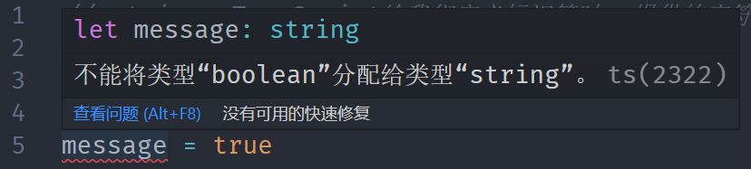
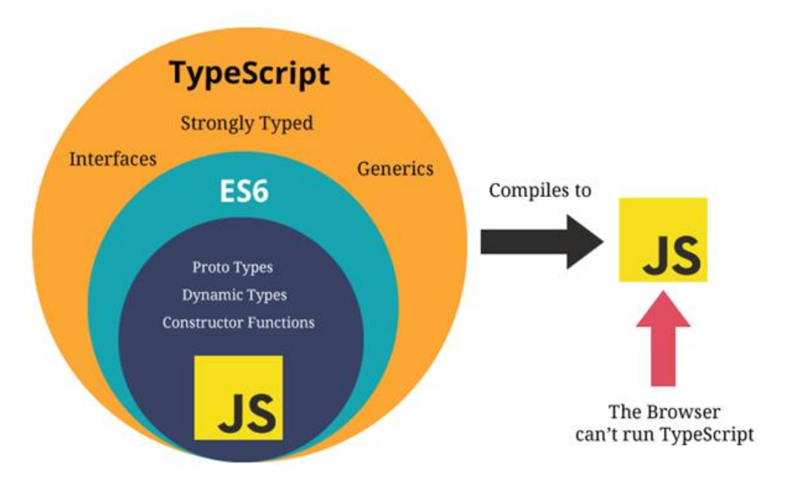

## JavaScript 是一门优秀的语言

**我始终相信：任何新技术的出现都是为了解决原有技术的某个痛点。**

**JavaScript 是一门优秀的编程语言吗？**

- 每个人可能观点并不完全一致，但是从很多角度来看，JavaScript 是一门非常优秀的编程语言
- 而且，可以说在很长一段时间内这个语言不会被代替，并且会在更多的领域被大家广泛使用

**著名的 Atwood 定律：**

Stack Overflow 的创立者之一的 **Jeff Atwood** 在 2007 年提出了著名的 **Atwood 定律**

any application that can be written in JavaScript, will eventually be written in JavaScript

任何可以使用 JavaScript 来实现的应用都最终都会使用 JavaScript 实现

**其实我们已经看到了，这句话正在一步步被应验：**

- Web 端的开发我们一直都是使用 JavaScript；
- 移动端开发可以借助于 ReactNative、Weex、Uniapp 等框架实现跨平台开发；
- 小程序端的开发也是离不开 JavaScript；
- 桌面端应用程序我们可以借助于 Electron 来开发；
- 服务器端开发可以借助于 Node 环境使用 JavaScript 来开发

## **JavaScript 的痛点**

并且随着近几年前端领域的快速发展，让 JavaScript 迅速被普及和受广大开发者的喜爱，借助于 JavaScript 本身的强大，也让使

用 JavaScript 开发的人员越来越多。

**优秀的 JavaScript 没有缺点吗？**

- 其实上由于各种历史因素，JavaScript 语言本身存在很多的缺点
- 比如 ES5 以及之前的使用的 var 关键字关于作用域的问题
- 比如最初 JavaScript 设计的数组类型并不是连续的内存空间
- 比如直到今天 JavaScript 也没有加入类型检测这一机制

**JavaScript 正在慢慢变好**

- 不可否认的是，JavaScript 正在慢慢变得越来越好，无论是从底层设计还是应用层面
- ES6、7、8 等的推出，每次都会让这门语言更加现代、更加安全、更加方便
- 但是直到今天，JavaScript 在类型检测上依然是毫无进展（为什么类型检测如此重要，我后面会聊到）

## **类型带来的问题**

**首先你需要知道，编程开发中我们有一个共识：**错误出现的越早越好

- 能在**写代码的时候**发现错误，就不要在**代码编译时**再发现（IDE 的优势就是在代码编写过程中帮助我们发现错误）
- 能在**代码编译期间**发现错误，就不要在**代码运行期间**再发现（类型检测就可以很好的帮助我们做到这一点）
- 能在开发阶段发现错误，就不要在测试期间发现错误，能在测试期间发现错误，就不要在上线后发现错误

**现在我们想探究的就是如何在** **代码编译期间** **发现代码的错误：**

JavaScript 可以做到吗？不可以，我们来看下面这段经常可能出现的代码问题

```ts
function getLength(str) {
  return str.length;
}

getLength("abc"); // 正确的调用
getLength(); // 错误的调用（IDE并不会报错）
```


## **类型错误**

**这是我们一个非常常见的错误：**

- 这个错误很大的原因就是因为 JavaScript 没有对我们传入的参数进行任何的限制，只能等到运行期间才发现这个错误；
- 并且当这个错误产生时，会影响后续代码的继续执行，也就是整个项目都因为一个小小的错误而深入崩溃

**当然，你可能会想：我怎么可能犯这样低级的错误呢？**

- 当我们写像我们上面这样的简单的 demo 时，这样的错误很容易避免，并且当出现错误时，也很容易检查出来

- 但是当我们开发一个大型项目时呢？你能保证自己一定不会出现这样的问题吗？而且如果我们是调用别人的类库，又如何知

  道让我们传入的到底是什么样的参数呢？

但是，如果我们可以给 JavaScript 加上很多限制，在开发中就可以很好的避免这样的问题了：

- 比如我们的 getLength 函数中 str 是一个必传的类型，没有调用者没有传编译期间就会报错
- 比如我们要求它的必须是一个 String 类型，传入其他类型就直接报错
- 那么就可以知道很多的错误问题在编译期间就被发现，而不是等到运行时再去发现和修改

## **类型思维的缺失**

**我们已经简单体会到没有类型检查带来的一些问题，JavaScript 因为从设计之初就没有考虑类型的约束问题，所以造成了前端开**

**发人员关于类型思维的缺失：**

- **前端开发人员**通常不关心变量或者参数是什么类型的，如果在必须确定类型时，我们往往需要使用各种判断验证
- 从其他方向转到前端的人员，也会因为没有类型约束，而总是担心自己的代码不安全，不够健壮

所以我们经常会说 JavaScript 不适合开发大型项目，因为当项目一旦庞大起来，这种宽松的类型约束会带来非常多的安全隐患，多人员开发它们之间也没有良好的类型契约

- 比如当我们去实现一个核心类库时，如果没有类型约束，那么需要对别人传入的参数进行各种验证来保证我们代码的健壮性

- 比如我们去调用别人的函数，对方没有对函数进行任何的注释，我们只能去看里面的逻辑来理解这个函数需要传入什么参数，

  返回值是什么类型

## **JavaScript 添加类型约束**

**为了弥补 JavaScript 类型约束上的缺陷，增加类型约束，很多公司推出了自己的方案：**

- 2014 年，Facebook 推出了 flow 来对 JavaScript 进行类型检查
- 同年，Microsoft 微软也推出了 TypeScript1.0 版本
- 他们都致力于为 JavaScript 提供类型检查

而现在，无疑**TypeScript 已经完全胜出**：

- Vue2.x 的时候采用的就是 flow 来做类型检查
- Vue3.x 已经全线转向 TypeScript，98.3%使用 TypeScript 进行了重构
- 而 Angular 在很早期就使用 TypeScript 进行了项目重构并且需要使用 TypeScript 来进行开发
- 而甚至 Facebook 公司一些自己的产品也在使用 TypeScript

**学习 TypeScript 不仅仅可以为我们的代码增加类型约束，而且可以培养我们前端程序员具备类型思维**

如果之后想要学习其他语言，比如 Java、Dart 等也会是驾轻就熟

## **认识 TypeScript**

**虽然我们已经知道 TypeScript 是干什么的，也知道它解决了什么样的问题，但是我们还是需要全面的来认识一下 TypeScript 到底是什么？**

**我们来看一下 TypeScript 在 GitHub 和官方上对自己的定义：**

- GitHub 说法：TypeScript is a superset of JavaScript that compiles to clean JavaScript output
- TypeScript 官网：TypeScript is a typed superset of JavaScript that compiles to plain JavaScript
- 翻译一下：TypeScript 是拥有类型的 JavaScript 超集，它可以编译成普通、干净、完整的 JavaScript 代码

**怎么理解上面的话呢？**

- 我们可以将 TypeScript 理解成加强版的 JavaScript

- JavaScript 所拥有的特性，TypeScript 全部都是支持的，并且它紧随 ECMAScript 的标准，所以 ES6、ES7、ES8 等新语法标准，它都是

  支持的

- TypeScript 在实现新特性的同时，总是保持和 ES 标准的同步甚至是领先

- 并且在语言层面上，不仅仅增加了类型约束，而且包括一些语法的扩展，比如枚举类型（Enum）、元组类型（Tuple）等

- 并且 TypeScript 最终会被编译成 JavaScript 代码，所以你并不需要担心它的兼容性问题，在编译时也可以不借助于 Babel 这样的工具

**所以，我们可以把 TypeScript 理解成更加强大的 JavaScript，不仅让 JavaScript 更加安全，而且给它带来了诸多好用的好用特性**

## **TypeScript 的特点**

**官方对 TypeScript 有几段特点的描述，我觉得非常到位（虽然有些官方，了解一下），我们一起来分享一下：**

**始于 JavaScript，归于 JavaScript**

- TypeScript 从今天数以百万计的 JavaScript 开发者所熟悉的语法和语义开始

- 使用现有的 JavaScript 代码，包括流行的 JavaScript 库，并从 JavaScript 代码中调用 TypeScript 代码

- TypeScript 可以编译出纯净、 简洁的 JavaScript 代码，并且可以运行在任何浏览器上、Node.js 环境中和任何支持 ECMAScript 3（或

  更高版本）的 JavaScript 引擎中

**TypeScript 是一个强大的工具，用于构建大型项目**

- 类型允许 JavaScript 开发者在开发 JavaScript 应用程序时使用高效的开发工具和常用操作比如静态检查和代码重构

- 类型是可选的，类型推断让一些类型的注释使你的代码的静态验证有很大的不同。类型让你定义软件组件之间的接口和洞察现有

  JavaScript 库的行为

**拥有先进的 JavaScript**

- TypeScript 提供最新的和不断发展的 JavaScript 特性，包括那些来自 2015 年的 ECMAScript 和未来的提案中的特性，比如异步功能和

  Decorators，以帮助建立健壮的组件

- 这些特性为高可信应用程序开发时是可用的，但是会被编译成简洁的 ECMAScript3（或更新版本）的 JavaScript

## **众多项目采用 TypeScript**

**正是因为有这些特性，TypeScript 目前已经在很多地方被应用：**

- Angular 源码在很早就使用 TypeScript 来进行了重写，并且开发 Angular 也需要掌握 TypeScript
- Vue3 源码也采用了 TypeScript 进行重写，在阅读源码时你会看到大量 TypeScript 的语法
- 包括目前已经变成最流行的编辑器 VSCode 也是使用 TypeScript 来完成的
- 包括在 React 中已经使用的 ant-design 的 UI 库，也大量使用 TypeScript 来编写
- 目前公司非常流行 Vue3+TypeScript、React+TypeScript 的开发模式
- 包括小程序开发，也是支持 TypeScript 的

## **大前端的发展趋势**

**大前端是一群最能或者说最需要折腾的开发者：**

- 客户端开发者：从 Android 到 iOS，或者从 iOS 到 Android，到 RN，甚至现在越来越多的客户端开发者接触前端相关知识

  （Vue、React、Angular、小程序）

- 前端开发者：从 jQuery 到 AngularJS，到三大框架并行：Vue、React、Angular，还有小程序，甚至现在也要接触客户端开

  发（比如 RN、Flutter）

- 目前又面临着不仅仅学习 ES 的特性，还要学习 TypeScript

- 新框架的出现，我们又需要学习新框架的特性，比如 vue3.x、react18 等等

- 新的工具也是层出不穷，比如 vite（版本更新也很快）

**但是每一样技术的出现都会让惊喜，因为他必然是解决了之前技术的某一个痛点的，而 TypeScript 真是解决了 JavaScript 存在**

**的很多设计缺陷，尤其是关于类型检测的。**

**并且从开发者长远的角度来看，学习 TypeScript 有助于我们前端程序员培养 类型思维，这种思维方式对于完成大型项目尤为重**

**要。**

## **TypeScript 的编译环境**

**在前面我们提到过，TypeScript 最终会被编译成 JavaScript 来运行，所以我们需要搭建对应的环境：**

我们需要在电脑上安装 TypeScript，这样就可以通过 TypeScript 的 Compiler 将其编译成 JavaScript

**所以，我们需要先可以先进行全局的安装：**

```ts
## 安装命令
npm install typescript -g
## 查看版本
tsc --version
```

## **TypeScript 的运行环境**

**如果我们每次为了查看 TypeScript 代码的运行效果，都通过经过两个步骤的话就太繁琐了：**

- 第一步：通过 tsc 编译 TypeScript 到 JavaScript 代码
- 第二步：在浏览器或者 Node 环境下运行 JavaScript 代码

**是否可以简化这样的步骤呢？**

- 比如编写了 TypeScript 之后可以直接运行在浏览器上？
- 比如编写了 TypeScript 之后，直接通过 node 的命令来执行？

**上面我提到的两种方式，可以通过两个解决方案来完成：**

- 方式一：通过 webpack，配置本地的 TypeScript 编译环境和开启一个本地服务，可以直接运行在浏览器上
- 方式二：通过 ts-node 库，为 TypeScript 的运行提供执行环境

**方式一：webpack 配置**

https://mp.weixin.qq.com/s/wnL1l-ERjTDykWM76l4Ajw

## **使用 ts-node**

**方式二：安装 ts-node**

```ts
npm install ts-node -g
```

**另外 ts-node 需要依赖 tslib 和 @types/node 两个包：**

```ts
npm install tslib @types/node -g
```

**现在，我们可以直接通过 ts-node 来运行 TypeScript 的代码：**

```ts
ts-node math.ts
```

## **变量的声明**

**我们已经强调过很多次，在 TypeScript 中定义变量需要指定 标识符 的类型**

**所以完整的声明格式如下：**

**声明了类型后 TypeScript 就会进行类型检测**，**声明的类型可以称之为类型注解（Type Annotation）**

```ts
var/let/const 标识符: 数据类型 = 赋值;
```

比如**我们声明一个 message，完整的写法如下：**

- 注意：这里的 string 是小写的，和 String 是有区别的
- string 是 TypeScript 中定义的字符串类型，String 是 ECMAScript 中定义的一个类

```ts
// string: TypeScript给我们定义标识符时, 提供的字符串类型
// String: JavaScript中字符串的包装类
let message: string = "Hello World";
```

**如果我们给 message 赋值其他类型的值，那么就会报错：**

```ts
let message: string = "Hello World";
message = true;
```



## **声明变量的关键字**

**在 TypeScript 定义变量（标识符）和 ES6 之后一致，可以使用 var、let、const 来定义**

```ts
// 定义标识符
let name: string = "why";
const age: number = 18;
const height: number = 1.88;
```

**当然，在 tslint 中并不推荐使用 var 来声明变量：**

可见，在 TypeScript 中并不建议再使用 var 关键字了，主要原因和 ES6 升级后 let 和 var 的区别是一样的，var 是没有块级作用域

的，会引起很多的问题，这里不再展开探讨

## **变量的类型推导（推断）**

**在开发中，有时候为了方便起见我们并不会在声明每一个变量时都写上对应的数据类型，我们更希望可以通过 TypeScript 本身的**

**特性帮助我们推断出对应的变量类型：**

```ts
// 声明一个标识符时, 如果有直接进行赋值, 会根据赋值的类型推导出标识符的类型注解
// 这个过程称之为类型推导
// let进行类型推导, 推导出来的通用类型
// const进行类型推导, 推导出来的字面量类型(后续专门讲解)
let name = "why";
let age = 18;
const height = 1.88;
```

## **JavaScript 和 TypeScript 的数据类型**

**我们经常说 TypeScript 是 JavaScript 的一个超级：**



## **JavaScript 类型 – number 类型**

**数字类型是我们开发中经常使用的类型，TypeScript 和 JavaScript 一样，不区分整数类型（int）和浮点型（double），统一为**

**number 类型**

```ts
let num = 100;
num = 20;
num = 6.66;
```

**学习过 ES6 应该知道，ES6 新增了二进制和八进制的表示方法，而 TypeScript 也是支持二进制、八进制、十六进制的表示：**

```ts
// 其他进制表示
num = 100; // 十进制
num = 0b110; // 二进制
num = 0o555; // 八进制
num = 0xf23; // 十六进制
```

## **JavaScript 类型 – boolean 类型**

**boolean 类型只有两个取值：true 和 false，非常简单**

```ts
let flag: boolean = true;
flag = false;
flag = 20 > 30;
```

## **JavaScript 类型 – string 类型**

**string 类型是字符串类型，可以使用单引号或者双引号表示：**

```ts
let message: string = "string";
message = "Hello TypeScript";
```

**同时也支持 ES6 的模板字符串来拼接变量和字符串：**

```ts
const name = "why";
const age = 18;
const height = 1.88;

const info = `my name is ${name}, age is ${age}, height is ${height}`;
console.log(info);
```

## **JavaScript 类型 – Array 类型**

**数组类型**的定义也非常简单，有两种方式：

Array\<string>事实上是一种泛型的写法，我们会在后续中学习它的用法

**如果添加其他类型到数组中，那么会报错：**

```ts
// 明确的指定<数组>的类型注解: 两种写法
// 1. string[]: 数组类型, 并且数组中存放的字符串类型
// 2. Array<string>: 数组类型, 并且数组中存放的是字符串类型

// 注意事项: 在真实的开发中, 数组一般存放相同的类型, 不要存放不同的类型
let names: string[] = ["abc", "cba", "nba"];
names.push("aaa");
// names.push(123)

let nums: Array<number> = [123, 321, 111];
```

## **JavaScript 类型 – Object 类型**

**object 对象类型可以用于描述一个对象：**

```ts
let info: object = {
  name: "why",
  age: 18,
  height: 1.88,
};
```

**但是从 info 中我们不能获取数据，也不能设置数据：**


## **JavaScript 类型 – Symbol 类型**

**在 ES5 中，如果我们是不可以在对象中添加相同的属性名称的，比如下面的做法：**

```ts
const person = {
  identify: "程序员",
  identify: "老师",
};
```

**通常我们的做法是定义两个不同的属性名字：比如 identity1 和 identity2**

**但是我们也可以通过 symbol 来定义相同的名称，因为 Symbol 函数返回的是不同的值：**

```ts
const s1: symbol = Symbol("title");
const s2: symbol = Symbol("title");
const person = {
  [s1]: "程序员",
  [s2]: "老师",
};
```

## **JavaScript 类型 – null 和 undefined 类型**

**在 JavaScript 中，undefined 和 null 是两个基本数据类型**

**在 TypeScript 中，它们各自的类型也是 undefined 和 null，也就意味着它们既是实际的值，也是自己的类型：**

```ts
let n: null = null;
let u: undefined = undefined;
```

## **函数的参数类型**

**函数是 JavaScript 非常重要的组成部分，TypeScript 允许我们指定函数的参数和返回值的类型**

**参数的类型注解**

声明函数时，可以在每个参数后添加类型注解，以声明函数接受的参数类型

```ts
// 在定义一个TypeScript中的函数时, 都要明确的指定参数的类型
function sum(num1: number, num2: number) {
  return num1 + num2;
}

const res = sum(123, 321);
// sum("abc", "cba")
// sum({}, {})
```

## **函数的返回值类型**

**我们也可以添加返回值的类型注解，这个注解出现在函数列表的后面：**

**和变量的类型注解一样，我们通常情况下不需要返回类型注解，因为 TypeScript 会根据 return 返回值推断函数的返回类型：**

某些第三方库为了方便理解，会明确指定返回类型，看个人喜好

```ts
// 在定义一个TypeScript中的函数时
// 返回值类型可以明确的指定, 也可以自动进行类型推导
function sum(num1: number, num2: number): number {
  return num1 + num2;
}

const res = sum(123, 321);
```

## 函数的类型-练习

```ts
// 定义对象类型
type LyricType = {
  time: number;
  text: string;
};

// 歌词解析工具
function parseLyric(): LyricType[] {
  const lyrics: LyricType[] = [];
  lyrics.push({ time: 1111, text: "天空想要下雨" });
  return lyrics;
}

const lyricInfos = parseLyric();
for (const item of lyricInfos) {
  console.log(item.time, item.text);
}
```

## **匿名函数的参数**

**匿名函数与函数声明会有一些不同：**

- 当一个函数出现在 TypeScript 可以确定该函数会被如何调用的地方时
- 该函数的参数会自动指定类型

```ts
const names: string[] = ["abc", "cba", "nba"];

// 匿名函数是否需要添加类型注解呢? 最好不要添加类型注解
names.forEach(function (item, index, arr) {
  console.log(item, index, arr);
});
```

**我们并没有指定 item 的类型，但是 item 是一个 string 类型：**

- 这是因为 TypeScript 会根据 forEach 函数的类型以及数组的类型推断出 item 的类型
- 这个过程称之为上下文类型（_contextual typing_），因为函数执行的上下文可以帮助确定参数和返回值的类型

## **对象类型**

**如果我们希望限定一个函数接受的参数是一个对象，这个时候要如何限定呢？**

我们可以使用对象类型

```ts
// 1.对象类型的简单回顾
// const info: {
//   name: string
//   age: number
// } = {
//   name: "why",
//   age: 18
// }

// 2.对象类型和函数类型结合使用
type PointType = {
  x: number;
  y: number;
  z?: number;
};
function printCoordinate(point: PointType) {
  console.log("x坐标:", point.x);
  console.log("y坐标:", point.y);
}

// printCoordinate(123)
printCoordinate({ x: 20, y: 30 });
```

**在这里我们使用了一个对象来作为类型：**

- 在对象我们可以添加属性，并且告知 TypeScript 该属性需要是什么类型
- 属性之间可以使用 , 或者 ; 来分割，最后一个分隔符是可选的
- 每个属性的类型部分也是可选的，如果不指定，那么就是 any 类型

## **可选类型**

**对象类型也可以指定哪些属性是可选的，可以在属性的后面添加一个?：**

```ts
type PointType = {
  x: number;
  y: number;
  z?: number; // 可选类型 可选参数必须跟在必须参数后面
};
function printCoordinate(point: PointType) {
  console.log("x坐标:", point.x);
  console.log("y坐标:", point.y);
}

printCoordinate({ x: 20, y: 30 });
printCoordinate({ x: 20, y: 30, z: 40 });
```

## **TypeScript 类型 - any 类型**

在某些情况下，我们确实无法确定一个变量的类型**，**并且可能它会发生一些变化，这个时候我们可以使用 any 类型（类似于 Dart

语言中的 dynamic 类型）

**any 类型有点像一种讨巧的 TypeScript 手段：**

- 我们可以对 any 类型的变量进行任何的操作，包括获取不存在的属性、方法
- 我们给一个 any 类型的变量赋值任何的值，比如数字、字符串的值

```ts
// any类型就表示不限制标识符的任意类型, 并且可以在该标识符上面进行任意的操作(在TypeScript中回到JavaScript中)
let id: any = "aaaa";

id = "bbbb";
id = 123;
console.log(id.length);

id = { name: "why", level: 99 };

// 定义数组
const infos: any[] = ["abc", 123, {}, []];
```

**如果对于某些情况的处理过于繁琐不希望添加规定的类型注解，或者在引入一些第三方库时，缺失了类型注解，这个时候我们可**

**以使用 any：**

包括在 Vue 源码中，也会使用到 any 来进行某些类型的适配

## **TypeScript 类型 - unknown 类型**

**unknown 是 TypeScript 中比较特殊的一种类型，它用于描述类型不确定的变量**

和 any 类型有点类似，但是 unknown 类型的值上做任何事情都是不合法的

**什么意思呢？我们来看下面的场景：**

```ts
let foo: unknown = "aaa";
foo = 123;

// unknown类型默认情况下在上面进行任意的操作都是非法的
// 要求必须进行类型的校验(缩小), 才能根据缩小之后的类型, 进行对应的操作
if (typeof foo === "string") {
  // 类型缩小
  console.log(foo.length, foo.split(" "));
}
```

## **TypeScript 类型 - void 类型**

**void 通常用来指定一个函数是没有返回值的，那么它的返回值就是 void 类型：**

```ts
// 1.在TS中如果一个函数没有任何的返回值, 那么返回值的类型就是void类型
// 2.如果返回值是void类型, 那么我们也可以返回undefined(TS编译器允许这样做而已)
function sum(num1: number, num2: number): void {
  console.log(num1 + num2);

  // return 123 错误的做法
}

// 应用场景: 用来指定函数类型的返回值是void
type LyricInfoType = { time: number; text: string };
// parseLyric函数的数据类型: (lyric: string) => LyricInfoType[]
function parseLyric(lyric: string): LyricInfoType[] {
  const lyricInfos: LyricInfoType[] = [];
  // 解析
  return lyricInfos;
}

// parseLyric => 函数/对象
type FooType = () => void;
const foo: FooType = () => {};

// 举个例子:(涉及函数的类型问题, 后续还会详细讲解)
// 1.定义要求传入的函数的类型
type ExecFnType = (...args: any[]) => void;

// 2.定义一个函数, 并且接收的参数也是一个函数, 而且这个函数的类型必须是ExecFnType
function delayExecFn(fn: ExecFnType) {
  setTimeout(() => {
    fn("why", 18);
  }, 1000);
}

// 3.执行上面函数, 并且传入一个匿名函数
delayExecFn((name, age) => {
  console.log(name, age);
});
```

**当基于上下文的类型推导（Contextual Typing）推导出返回类型为 void 的时候，并不会强制函数一定不能返回内容**

```ts
type FnType = () => void;

const foo: FnType = () => {
  return 123;
};

const names = ["abc", "cba", "nba"];
names.forEach((item) => item.length);
```

## **TypeScript 类型 - never 类型**

**never 表示永远不会发生值的类型，比如一个函数：**

- 如果一个函数中是一个死循环或者抛出一个异常，那么这个函数会返回东西吗？
- 不会，那么写 void 类型或者其他类型作为返回值类型都不合适，我们就可以使用 never 类型

```ts
// 一. 实际开发中只有进行类型推导时, 可能会自动推导出来是never类型, 但是很少使用它
// 1.一个函数是死循环
// function foo(): never {
//   // while(true) {
//   //   console.log("-----")
//   // }
//   throw new Error("1233")
// }
// foo()

// 2.解析歌词的工具
function parseLyric() {
  return [];
}

// 二. 封装框架/工具库的时候可以使用一下never
// 其他时候在扩展工具的时候, 对于一些没有处理的case, 可以直接报错
function handleMessage(message: string | number | boolean) {
  switch (typeof message) {
    case "string":
      console.log(message.length);
      break;
    case "number":
      console.log(message);
      break;
    case "boolean":
      console.log(Number(message));
      break;
    default:
      const check: never = message;
  }
}

handleMessage("aaaa");
handleMessage(1234);

// 另外同事调用这个函数
handleMessage(true);
```

## **TypeScript 类型 - tuple 类型**

**tuple 是元组类型，很多语言中也有这种数据类型，比如 Python、Swift 等**

**那么 tuple 和数组有什么区别呢？**

- 首先，数组中通常建议存放相同类型的元素，不同类型的元素是不推荐放在数组中。（可以放在对象或者元组中）
- 其次，元组中每个元素都有自己特性的类型，根据索引值获取到的值可以确定对应的类型

**那么 tuple 在什么地方使用的是最多的呢？**

tuple 通常可以作为返回的值，在使用的时候会非常的方便

```ts
// 保存我的个人信息: why 18 1.88
// 1.使用数组类型
// 不合适: 数组中最好存放相同的数据类型, 获取值之后不能明确的知道对应的数据类型
const info1: any[] = ["why", 18, 1.88];
const value = info1[2];
console.log();

// 2.使用对象类型(最多)
const info2 = {
  name: "why",
  age: 18,
  height: 1.88,
};

// 3.使用元组类型
// 元组数据结构中可以存放不同的数据类型, 取出来的item也是有明确的类型
const info3: [string, number, number] = ["why", 18, 1.88];
const value2 = info3[2];

// 在函数中使用元组类型是最多的(函数的返回值) T 代表泛型
function useState<T>(initialState: T): [T, (newValue: T) => void] {
  let stateValue = initialState;
  function setValue(newValue: T) {
    stateValue = newValue;
  }

  return [stateValue, setValue];
}

const [count, setCount] = useState(10);
console.log(count);
setCount(100);
```
