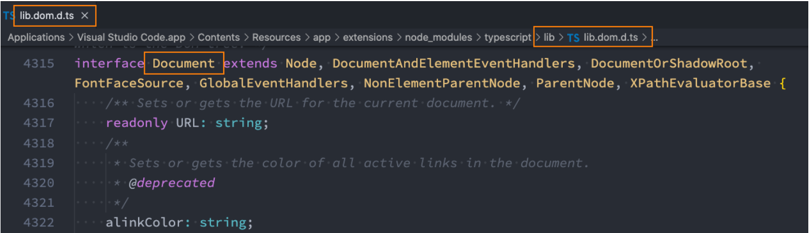
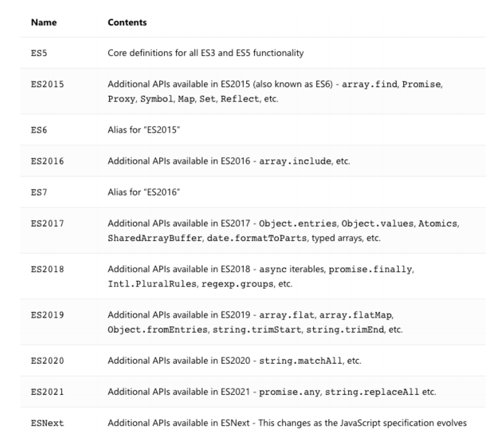
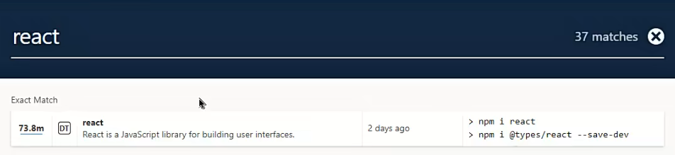
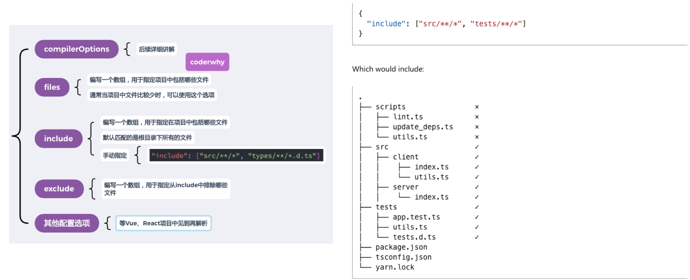
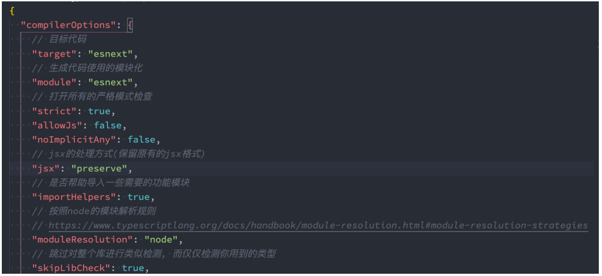
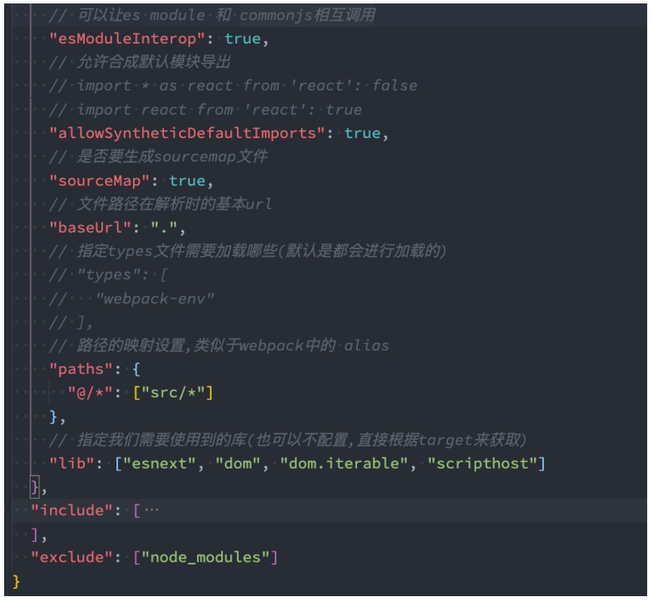

## **TypeScript 模块化**

**JavaScript** **有一个很长的处理模块化代码的历史，TypeScript 从 2012 年开始跟进，现在已经实现支持了很多格式。但是随着**

**时间流逝，社区和** **JavaScript** **规范已经使用为名为 ES Module 的格式，这也就是我们所知的** **import/export** **语法。**

ES 模块在 2015 年被添加到 JavaScript 规范中，到 2020 年，大部分的 web 浏览器和 JavaScript 运行环境都已经广泛支持。

所以在 TypeScript 中最主要使用的模块化方案就是 ES Module；

**在前面我们已经学习过各种各样模块化方案以及对应的细节，这里我们主要学习 TypeScript 中一些比较特别的细节。**

## **非模块（Non-modules）**

**我们需要先理解** **TypeScript** **认为什么是一个模块。**

JavaScript 规范声明任何没有 export 的 JavaScript 文件都应该被认为是一个脚本，而非一个模块。

在一个脚本文件中，变量和类型会被声明在共享的全局作用域，将多个输入文件合并成一个输出文件，或者在 HTML 使用多

个 \<script> 标签加载这些文件。

**如果你有一个文件，现在没有任何 import 或者 export，但是你希望它被作为模块处理，添加这行代码：**

```ts
export {};
```

**这会把文件改成一个没有导出任何内容的模块，这个语法可以生效，无论你的模块目标是什么。**

## **内置类型导入（Inline type imports）**

**TypeScript 4.5 也允许单独的导入，你需要使用 type 前缀 ，表明被导入的是一个类型：**

**这些可以让一个非 TypeScript 编译器比如 Babel、swc 或者 esbuild 知道什么样的导入可以被安全移除。**

utils/type.ts

```ts
interface IPerson {
  name: string;
  age: number;
}

type IDType = number | string;
```

index.ts

```ts
// 导入的是类型, 推荐在类型的前面加上type关键
// import { type IDType, type IPerson } from "./utils/type"
// 多个type可以将type写在外面
import type { IDType, IPerson } from "./utils/type";

const id1: IDType = 111;
const p: IPerson = { name: "why", age: 18 };
```

## **命名空间 namespace（了解）**

**TypeScript 有它自己的模块格式，名为 namespaces ，它在 ES 模块标准之前出现。**

命名空间在 TypeScript 早期时，称之为内部模块，目的是将一个模块内部再进行作用域的划分，防止一些命名冲突的问题；

虽然命名空间没有被废弃，但是由于 ES 模块已经拥有了命名空间的大部分特性，因此更推荐使用 ES 模块，这样才能与

JavaScript 的（发展）方向保持一致。

utils/format.ts

```ts
export namespace price {
  // 外面想要使用里面这里也得导出
  export function format(price: string) {
    return "¥" + price;
  }

  export const name = "price";
}

export namespace date {
  export function format(dateString) {
    return "2022-10-10";
  }

  const name = "date";
}
```

index.ts

```ts
import { price, date } from "./utils/format";

// 使用命名空间中的内容
price.format("1111");
date.format("22222");
```

## **类型的查找**

**之前我们所有的 typescript 中的类型，几乎都是我们自己编写的，但是我们也有用到一些其他的类型：**

```ts
const imageEl = document.getElementById("image") as HTMLImageElement;
```

**大家是否会奇怪，我们的 HTMLImageElement 类型来自哪里呢？甚至是 document 为什么可以有 getElementById 的方法呢？**

其实这里就涉及到 typescript 对类型的管理和查找规则了。

**我们这里先给大家介绍另外的一种 typescript 文件：.d.ts 文件**

我们之前编写的 typescript 文件都是 .ts 文件，这些文件最终会输出 .js 文件，也是我们通常编写代码的地方；

还有另外一种文件 .d.ts 文件，它是用来做类型的声明(declare)，称之为类型声明（Type Declaration）或者类型定义（Type

Definition）文件。

它仅仅用来做类型检测，告知 typescript 我们有哪些类型；

**那么 typescript 会在哪里查找我们的类型声明呢？**

内置类型声明；

外部定义类型声明（一般是第三方库）；

自己定义类型声明；

## **内置类型声明**

**内置类型声明是 typescript 自带的、帮助我们内置了 JavaScript 运行时的一些标准化 API 的声明文件；**

包括比如 Function、String、Math、Date 等内置类型；

也包括运行环境中的 DOM API，比如 Window、Document 等；

**TypeScript 使用模式命名这些声明文件 lib.[something].d.ts。**



**内置类型声明通常在我们安装 typescript 的环境中会带有的；**

也就是只要执行了 npm install typescript -g，就会有内置类型声明

https://github.com/microsoft/TypeScript/tree/main/lib

## webpack 环境配置

配置 webpack 最主要是想让 ts 代码直接运行到浏览器上

一会我们需要安装很多包，我们需要对包进行记录，执行 npm init，就会初始化一个 package.json 文件

我们想使用 webpack，就需要安装它，执行下面的命令

```json
npm install webpack webapck-cli -D
```

在项目根目录下创建 webpack.config.js 文件

```javascript
const path = require("path");
const HtmlWeabpckPlugin = require("html-webpack-plugin");

module.exports = {
  mode: "development",
  entry: "./src/index.ts",
  output: {
    path: path.resolve(__dirname, "./dist"),
    filename: "bundle.js",
  },
  resolve: {
    extensions: [".ts", ".js", ".cjs", ".json"],
  },
  devServer: {},
  module: {
    rules: [
      {
        test: /\.ts$/,
        loader: "ts-loader",
      },
    ],
  },
  plugins: [
    new HtmlWeabpckPlugin({
      template: "./index.html",
    }),
  ],
};
```

在配置过程中需要使用 ts-loader，那么就需要安装

```json
npm install ts-loader -D
```

我们也想使用 html 模板，相应的在根目录下手动创建一个 index.html 文件，不需要改什么，创建就行

```json
npm install html-webpack-plugin -D
```

除此之外，还需要搭建一个本地服务，才能在浏览器实时查看

```json
npm install webpack-dev-server -D
```

这个东西怎么使用呢？找到 package.json，增加一个 serve 的配置

```json
"scripts": {
    "serve": "webpack serve",
},
```

接着执行 npm run serve 就可以跑起来了，但是跑起来没有成功，会报错，是因为 ts-loader 需要依赖一个文件 tsconfig.json

那么只需要执行

```json
tsc --init
```

再次执行 npm run serve 就可以跑起来了

## **内置声明的环境**

**我们可以通过 target 和 lib 来决定哪些内置类型声明是可以使用的：**

例如，startsWith 字符串方法只能从称为 ECMAScript 6 的 JavaScript 版本开始使用；

**我们可以通过 target 的编译选项来配置：TypeScript 通过 lib 根据您的 target 设置更改默认包含的文件来帮助解决此问题。**

https://www.typescriptlang.org/tsconfig#lib

就是 tsconfig.json 这个文件里面有个 target 属性，比如配置 ES3，那么 ES6 的代码就无效了，可以对它进行配置，开发中很少对这个进行配置，做个了解即可



## **外部定义类型声明 – 第三方库**

**外部类型声明通常是我们使用一些库（比如第三方库）时，需要的一些类型声明。**

**这些库通常有两种类型声明方式：**

方式一：在自己库中进行类型声明（编写.d.ts 文件），比如 axios

方式二：通过社区的一个公有库 DefinitelyTyped 存放类型声明文件

该库的 GitHub 地址：https://github.com/DefinitelyTyped/DefinitelyTyped/

该库查找声明安装方式的地址：https://www.typescriptlang.org/dt/search?search=

比如我们安装 react 的类型声明： npm i @types/react --save-dev



一些库，比如 axios 已经帮我们进行了类型声明，直接使用不会报错，也有类型提示；

一些库，比如 react，是没有进行类型声明，使用会报错，这时我们得借助 DefinitelyTyped 这个库就会有类型提示；

还有一些库，比如 loadsh，既没有自己的类型声明，在 DefinitelyTyped 这个库也找不到，此时我们就需要自定义了

## **外部定义类型声明 – 自定义声明**

**什么情况下需要自己来定义声明文件呢？**

情况一：我们使用的第三方库是一个纯的 JavaScript 库，没有对应的声明文件；比如 lodash

情况二：我们给自己的代码中声明一些类型，方便在其他地方直接进行使用；

index.html

```html
<!DOCTYPE html>
<html lang="en">
  <head>
    <meta charset="UTF-8" />
    <meta http-equiv="X-UA-Compatible" content="IE=edge" />
    <meta name="viewport" content="width=device-width, initial-scale=1.0" />
    <title>TSDemo</title>
  </head>
  <body>
    <script>
      const whyName = "why";
      const whyAge = 18;
      const whyHeight = 1.88;

      function foo(bar) {
        return "hello world";
      }

      function Person(name, age) {
        this.name = name;
        this.age = age;
      }
    </script>
  </body>
</html>
```

我们在 index.html 定义了一些变量，函数以及类，正常打包之后会生成一个 bundle.js，在上面的 script 后面，这也就意味着在 src/index.ts

中是可以使用不会报错，但是实际上却会报错，需要我们自定义声明

types/why.d.ts

```ts
// 为自己的 变量/函数/类 定义类型声明
declare const whyName: string;
declare const whyAge: number;
declare const whyHeight: number;

declare function foo(bar: string): string;

declare class Person {
  constructor(public name: string, public age: number);
}
```

src/index.ts

```ts
// 需要编写类型声明
console.log(whyName, whyAge, whyHeight);
console.log(foo("why"));

const p = new Person("kobe", 30);
console.log(p.name, p.age);
```

.d.ts 文件是给全局声明使用的，平常开发的业务代码需要也写到这里吗？不需要

src/inde.ts

```ts
// 给自己的代码添加类型声明文件
// 平时使用的代码中用到的类型, 直接在当前位置进行定义或者在业务文件夹某一个位置编写一个类型文件即可
type IDType = number | string;
interface IKun {
  name: string;
  age: number;
  slogan: string;
}
```

## **declare 声明模块**

**我们也可以声明模块，比如 lodash 模块默认不能使用的情况，可以自己来声明这个模块：**

**声明模块的语法:** **declare module '模块名' {}。**

在声明模块的内部，我们可以通过 export 导出对应库的类、函数等；

types/why.d.ts

```ts
declare module "lodash" {
  export function join(...args: any[]): any;
}
```

src/index.ts

```ts
import _ from "lodash";

// lodash
console.log(_.join(["abc", "cba"]));
```

## **declare 声明文件**

**在某些情况下，我们也可以声明文件：**

比如在开发 vue 的过程中，默认是不识别我们的.vue 文件的，那么我们就需要对其进行文件的声明；

比如在开发中我们使用了 png 这类图片文件，默认 typescript 也是不支持的，也需要对其进行声明；

src/index.ts

```ts
import App from "./vue/App.vue";
```

vue/App.vue

```javascript
<template>
  <div class="home">
    <h2>home</h2>
  </div>
</template>

<script setup lang="ts">

</script>

<style lang="less" scoped>

</style>
```

这样引入 vue 会报错，需要自定义声明

types/why.d.ts

```ts
declare module "*.vue";
```

但是这样声明仅仅只是定义了 vue 是一个模块，并没有告诉我们它是个组件

当然，后面我们做项目使用脚手架开发，会帮我们默认进行如下配置

```ts
declare module "*.vue" {
  import { defineComponent } from "vue";
  const component: defineComponent;

  export default component;
}
```

接下来，我们引入一张图片显示在浏览器上

src/index.ts

```ts
import KobeImage from "./img/kobe02.png";
```

我们先引入，但是发现会报错，那么我们同样需要自定义声明

types/why.d.ts

```ts
// 声明文件模块
declare module "*.png";
declare module "*.jpg";
declare module "*.jpeg";
declare module "*.svg";
```

这样就没报错了，我们将图片渲染到浏览器上

src/index.ts

```ts
import KobeImage from "./img/kobe02.png";

// 图片文件的使用
const imgEl = document.createElement("img");
imgEl.src = KobeImage;
document.body.append(imgEl);
```

运行项目，npm run serve，发现根本跑不起来，我们需要在 webpack.config.js 中进行配置

```javascript
const path = require("path");
const HtmlWeabpckPlugin = require("html-webpack-plugin");

module.exports = {
  mode: "development",
  entry: "./src/index.ts",
  output: {
    path: path.resolve(__dirname, "./dist"),
    filename: "bundle.js",
  },
  resolve: {
    extensions: [".ts", ".js", ".cjs", ".json"],
  },
  devServer: {},
  module: {
    rules: [
      {
        test: /\.ts$/,
        loader: "ts-loader",
      },
      // 在这里配置
      {
        test: /\.(png|jpe?g|svg|gif)$/,
        type: "asset/resource",
      },
    ],
  },
  plugins: [
    new HtmlWeabpckPlugin({
      template: "./index.html",
    }),
  ],
};
```

## **declare 命名空间**

**比如我们在 index.html 中直接引入了 jQuery：**

CDN 地址： https://cdn.bootcdn.net/ajax/libs/jquery/3.6.0/jquery.js

**我们可以进行命名空间的声明：**

index.html

```html
<!DOCTYPE html>
<html lang="en">
  <head>
    <meta charset="UTF-8" />
    <meta http-equiv="X-UA-Compatible" content="IE=edge" />
    <meta name="viewport" content="width=device-width, initial-scale=1.0" />
    <title>TSDemo</title>
    <script src="https://cdn.bootcdn.net/ajax/libs/jquery/3.6.0/jquery.js
  "></script>
  </head>
  <body></body>
</html>
```

types/why.d.ts

```ts
// 声明成模块(不合适)
// 声明命名空间
declare namespace $ {
  export function ajax(settings: any): any;
}
```

src/index.ts

```ts
// jquery
$.ajax({
  url: "http://codercba.com:8000/home/multidata",
  success: function (res: any) {
    console.log(res);
  },
});
```

## **认识 tsconfig.json 文件**

**什么是 tsconfig.json 文件呢？（官方的解释）**

当目录中出现了 tsconfig.json 文件，则说明该目录是 TypeScript 项目的根目录；

tsconfig.json 文件指定了编译项目所需的根目录下的文件以及编译选项。

**官方的解释有点“官方”，直接看我的解释。**

**tsconfig.json 文件有两个作用：**

作用一（主要的作用）：让 TypeScript Compiler 在编译的时候，知道如何去编译 TypeScript 代码和进行类型检测；

比如是否允许不明确的 this 选项，是否允许隐式的 any 类型；

将 TypeScript 代码编译成什么版本的 JavaScript 代码；

作用二：让编辑器（比如 VSCode）可以按照正确的方式识别 TypeScript 代码；

对于哪些语法进行提示、类型错误检测等等；

**JavaScript 项目可以使用 jsconfig.json 文件，它的作用与 tsconfig.json 基本相同，只是默认启用了一些 JavaScript 相关的**

**编译选项。**

在之前的 Vue 项目、React 项目中我们也有使用过；

## **tsconfig.json 配置**

**tsconfig.json 在编译时如何被使用呢?**

在调用 tsc 命令并且没有其它输入文件参数时，编译器将由当前目录开始向父级目录寻找包含 tsconfig 文件的目录。

调用 tsc 命令并且没有其他输入文件参数，可以使用 --project （或者只是 -p）的命令行选项来指定包含了 tsconfig.json 的

目录；

当命令行中指定了输入文件参数， tsconfig.json 文件会被忽略；

**webpack 中使用 ts-loader 进行打包时，也会自动读取 tsconfig 文件，根据配置编译 TypeScript 代码。**

**tsconfig.json 文件包括哪些选项呢？**

tsconfig.json 本身包括的选项非常非常多，我们不需要每一个都记住；

可以查看文档对于每个选项的解释：https://www.typescriptlang.org/tsconfig

当我们开发项目的时候，选择 TypeScript 模板时，tsconfig 文件默认都会帮助我们配置好的；

**接下来我们学习一下哪些重要的、常见的选项。**

## **tsconfig.json 顶层选项**



## **tsconfig.json 文件**

**tsconfig.json 是用于配置 TypeScript 编译时的配置选项：**

https://www.typescriptlang.org/tsconfig

**我们这里讲解几个比较常见的：**

下面的配置选项是 vue 脚手架选择 TS 模板的默认配置

这里 target 虽然配置的是 esnext，目前是 ES13，但是最终还是使用 babel 进行编译

有个使用小技巧，比如想看 target 的配置：在上面地址后面拼接一个#target 就会定位到 target 的配置选项

https://www.typescriptlang.org/tsconfig#target




