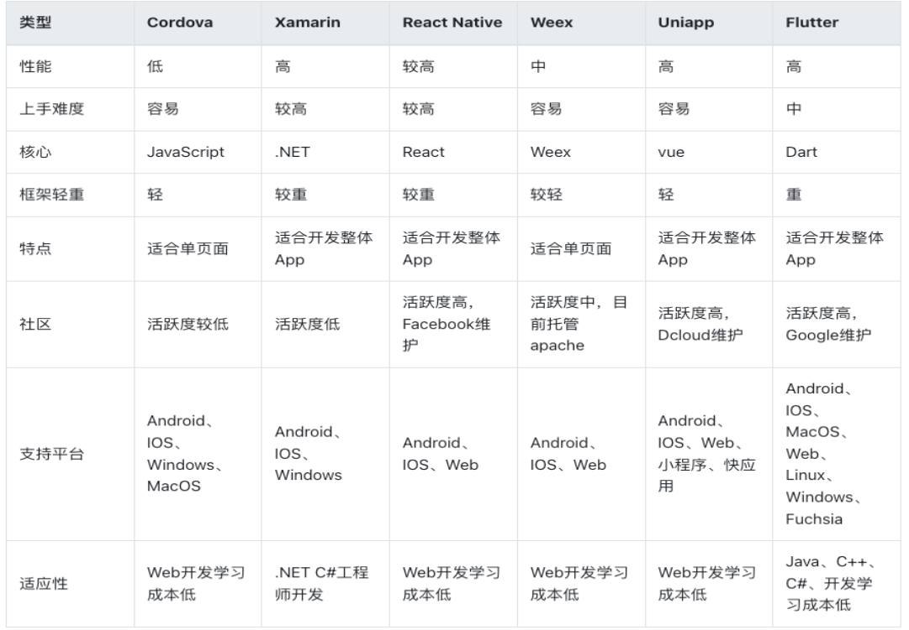
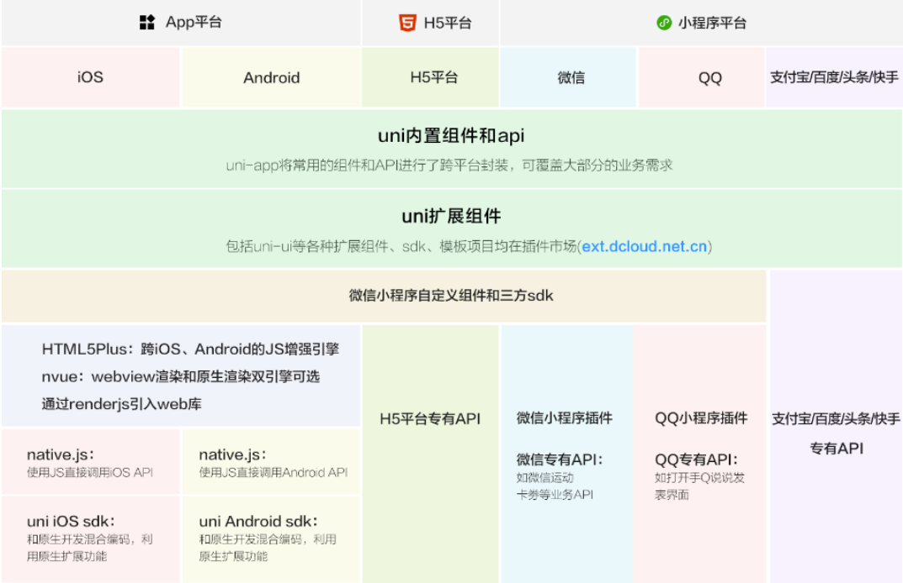
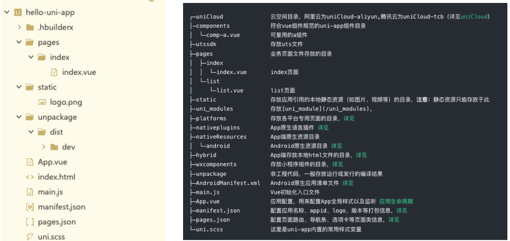
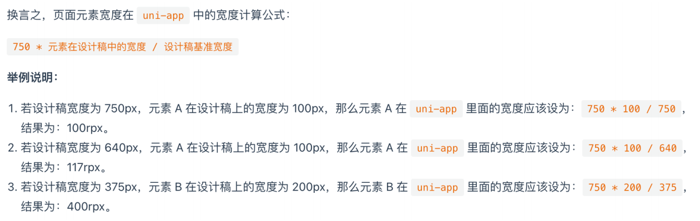

## **邂逅跨平台开发**

传统移动端开发方式

自从 iOS 和 Android 系统诞生以来，移动端开发主要由 iOS 和 Android 这两大平台占据。

早期的移动端开发人员主要是针对 iOS 和 Android 这两个平台分别进行同步开发。

原生开发模式优缺点：

- 原生 App 在体验、性能、兼容性都非常好，并可以非常方便使用硬件设备，比如：摄像头、罗盘等
- 但是同时开发两个平台，无论是成本上，还是时间，对于企业来说这个花费都是巨大，不可接受的。
- 纯原生 开发效率 和 上线周期 也严重影响了应用快速的迭代，也不利于多个平台版本控制等。

跨平台开发的诞生

- 因为原生 App 存在：时间长、成本高、迭代慢、部署慢、不利于推广等因素。
- 导致了跨平台开发的概念渐渐走进了人们的视野。
- 因此 “一套代码，多端运行” 的跨平台理念也应运而生 。

## **原生 VS 跨平台**

原生开发的特点：

- 性能稳定，使用流畅，用户体验好、功能齐全，安全性有保证，兼容性好，可使用手机所有硬件功能等

- 但是开发周期长、维护成本高、迭代慢、部署慢、新版本必须重新下载应用

- 不支持跨平台，必须同时开发多端代码

跨平台开发的特点：

- 可以跨平台，一套代码搞定 iOS、Android、微信小程序、H5 应用等
- 开发成本较低，开发周期比原生短
- 适用于跟系统交互少、页面不太复杂的场景。
- 但是对开发者要求高，除了本身 JS 的了解，还必须熟悉一点原生开发
- 不适合做高性能、复杂用户体验，以及定制高的应用程序。比如：抖音、微信、QQ 等。
- 同时开发多端兼容和适配比较麻烦、调试起来不方便。

## **跨平台发展史**

跨平台发展史

2009 年以前，当时最要是使用最原始的 HTML + CSS + JS 进行移动端 App 开发。

2009-2014 年间， 出现了 PhoneGap 、Cordova 等跨平台框架，以及 Ionic 轻量级的手机端 UI 库。

2015 年，ReactNative（跨平台框架）掀起了国内跨平台开发热潮，一些互联网大厂纷纷投入 ReactNative 开发阵营。

2016 年，阿里开源了 Weex，它是一个可以使用现代化 Web 技术开发高性能原生应用的框架。

2017 年 Google I/O 大会上，Google 正式向外界公布了 Flutter，一款跨平台开发工具包，用于为 Android、iOS、Web、

Windows、Mac 等平台开发应用。

2017 年至今，微信小程序、uni-app、Taro 等一系列跨平台小程序框架陆续流行起来了。

应该如何选择？个人建议

需要做高性能、复杂用户体验、定制高的 APP、需硬件支持的选 原生开发

需要性能较好、体验好、跨 Android、iOS 平台、 H5 平台、也需要硬件支持的选 Flutter（采用 Dart 开发）

需要跨小程序、H5 平台、Android、iOS 平台、不太复杂的先选 uni-app，其次选 Taro

不需要扩平台的，选择对应技术框架即可。

## **跨平台框架对比**



## **认识 uni-app**

官网对 uni-app 的介绍：

uni-app 是一个使用 Vue.js 开发前端应用的框架。

即开发者编写一套代码，便可发布到 iOS、Android、Web（响应式）、以及各种小程序（微信/支付宝/百度/头条/飞书

/QQ/快手/钉钉/淘宝）、快应用等多个平台。

uni-app 在手，做啥都不愁。即使不跨端， uni-app 也是更好的小程序开发框架、更好的 App 跨平台框架、更方便的 H5 开发

框架。不管领导安排什么样的项目，你都可以快速交付，不需要转换开发思维、不需要更改开发习惯。

uni-app 的历史

uni-app 中的 uni，读 you ni，是统一的意思。

DCloud 于 2012 年开始研发的小程序技术，并推出了 HBuilder X 开发工具。

2015 年，DCloud 正式商用了自己的小程序，产品名为“流应用”，

并捐献给了工信部旗下的 HTML5 中国产业联盟。

该应用能接近原生功能和性能的 App，并且即点即用，不需要安装。

微信团队经过分析，于 2016 年初决定上线微信小程序业务，但其没有接入中国产业联盟标准，而是订制了自己的标准。

## **uni-app VS 微信小程序**

uni-app 和微信小程序相同点：

都是接近原生的体验、打开即用、不需要安装

都可开发微信小程序、都有非常完善的官方文档

uni-app 和微信小程序区别：

uni-app 支持跨平台，编写一套代码，可以发布到多个平台，而微信小程序不支持

uni-app 纯 Vue 体验、高效、统一、工程化强，微信小程序工程化弱、使用小程序开发语言。

微信小程序适合较复杂、定制性较高、兼容和稳定性更好的应用

uni-app 适合不太复杂的应用，因为需要兼容多端，多端一起兼容和适配增加了开发者心智负担

uni-app 和 微信小程序，应该如何选择？

需要跨平台、不太复杂的应用选 uni-app，复杂的应用使用 uni-app 反而增加了难度。

不需要跨平台、较复杂、对兼容和稳定性要求高的选原生微信小程序。

## **uni-app 架构图**



## **uni-app 初体验**

创建 uni-app 项目

支持 可视化界面 和 Vue-CLI 两种方式。可视化方式比较简单，HBuilder X 内置相关环境，开箱即用。

开发工具 HBuilder X：

Hbuilder X 是通用的前端开发工具，但为 uni-app 做了特别强化 。

下载地址：https://hx.dcloud.net.cn/Tutorial/install/windows

安装完之后可以注册一个 Dcloud 的开发者账号(左下角可以点击注册)

注意：用 Vue3 的 Composition API 建议用 HBuilder X 最新 Alpha 版，旧版有兼容问题

方式一（推荐）：HBuilderX 创建 uni-app 项目步骤：

点工具栏里的文件 -> 新建 -> 项目（快捷键 Ctrl+N）

选择 uni-app 类型，输入工程名，选择模板，选择 Vue 版本，点击创建即可。

方式二： Vue-CLI 命令行创建

全局安装 Vue-CLI （目前仍推荐使用 vue-cli 4.x ）： npm install -g @vue/cli@4

创建项目：

```javascript
vue create -p dcloudio/uni-preset-vue my-project-name
```

下面是 HBuilderX 的一些设置：

设置主题：

工具->主题

使用 vscode 快捷键的方案设置：

工具->预设快捷键方案切换-> Vscode

设置字体大小：

运行->运行到小程序模拟器->运行设置->常用配置->编辑器字体大小

## **HBuilder X 开发工具特点**

HBuilderX 从 v3.2.5(包含)开始优化了对 vue3 的支持。

完善的提示，在代码助手右侧还能看到清晰的帮助描述。

支持 css 中使用 v-bind 提示和参数变量提示及转到定义(Alt+click)

Vue3 推荐使用的 setup 语法糖支持也完全支持。

在 data、props 和 setup 中定义的变量以及 methods 和 setup 内定义的函数都能在 template 中提示和转到定义(Alt+click)。

HBuilderX 支持各种表达式语法，如 less、scss、stylus、typescript 等高亮，无需安装插件。

this 的精准识别和语法提示。

组件的标签、属性都可以直接被提示出来。

不管是关闭 HBuilder，还是断电、崩溃，临时文件始终会自动保存。

更多功能：https://hx.dcloud.net.cn/Tutorial/Language/vue

## **运行 uni-app**

在浏览器运行

选中 uniapp 项目，点击工具栏的运行 -> 运行到浏览器 -> 选择浏览器，即可体验 uni-app 的 web 版。

在微信开发者工具运行

选中 uniapp 项目，点击工具栏的运行 -> 运行到小程序模拟器 -> 微信开发者工具，即可在微信开发者工具里面体验 uni-app。

其它注意事项：

- 1.微信开发者工具需要开启服务端口：小程序开发工具设置 -> 安全（目的是让 HBuilder 可以启动微信开发者工具）
- 2.如第一次使用，需配置微信开发者工具的安装路径（会提示下图）。
  - 点击工具栏运行 -> 运行到小程序模拟器 -> 运行设置，配置相应小程序开发者工具的安装路径
- 3.自动启动失败，可用微信开发者工具手动打开项目（项目在 unpackage/dist/dev/mp-weixin 路径下）。

在运行 App 到手机或模拟器（需要先安装模拟器）

先连接真机 或者 模拟器（Android 的还需要配置 adb 调试桥命令行工具）

选中 uniapp 项目，点击工具栏的运行 -> 运行 App 到手机或模拟器，即可在该设备里面体验 uni-app（支持中文路径）。

## **安装 mumu 模拟器**

第一步：下载 mumu 模拟器：https://mumu.163.com/mac/index.html

第二步：安装 mumu 模拟器

第三步：配置 adb 调试桥命令行工具（用于 HBuilder X 和 Android 模拟器建立连接，来实时调试和热重载。HBuilder X 是有内置 adb 的 )

HBuilderX 正式版的 adb 目录位置：安装路径下的 tools/adbs 目录

而 MAC 下为 HBuilderX.app/Contents/tools/adbs 目录；

HBuilderX Alpha 版的 adb 目录位置：安装路径下的 plugins/launcher/tools/adbs 目录( 需先运行后安装了插槽才会有该目录 )

默认是没有 launcher 这个文件夹的，需要在运行->运行到手机或模拟器->下载真机运行插件，才能看到 launcher 文件夹

而 MAC 下为/Applications/HBuilderX-Alpha.app/Contents/HBuilderX/plugins/launcher/tools/adbs 目录

在 adbs 目录下运行./adb ，即可使用 adb 命令（Win 和 Mac 一样）。

如想要全局使用 adb 命令，window 电脑可在：设置 -> 高级设计 -> 环境变量中设置

第四步：HBuilder X 开发工具连接 mumu 模拟器，使用 adb 调试桥来连接

进入到 HBuliderX 开发工具安装路径下的 plugins/launcher/tools/adbs 执行下面这个命令

```javascript
./adb connect 127.0.0.1:7555
```

但是每次，都要进入到这个目录去连接会比较麻烦，我们可以在全局配置一个环境变量

此电脑->右键属性->高级系统设置->高级->环境变量->系统变量->Path->找到 HBuliderX 开发工具安装路径下的 plugins/launcher/tools/adbs，整个路径粘贴进去，那么就可以在命令行使用 adb 了。

（ 端口是固定的，启动 mumu 模拟器默认是运行在 7555 端口）

第五步：选中项目 -> 运行 ->运行 App 到手机或模拟器-> 选中 Android 基座（基座其实是一个 app 壳）

## **安装其它模拟器**

Mac 电脑：

可以安装 Xcode 或者 Android Studio 软件。推荐 XCode。

Window 电脑：

安装 mumu、夜神、雷电模拟器等（推荐）

可以安装 Android Studio 软件（模拟器大、速度慢、卡）。

详细安装教程

可以看资料中对应的安装文档

## **目录结构**



## **开发规范**

为了实现多端兼容，综合考虑编译速度、运行性能等因素，uni-app 约定了如下开发规范：

页面文件遵循 Vue 单文件组件 (SFC) 规范

组件标签靠近小程序规范，详见 uni-app 组件规范

接口能力（JS API）靠近微信小程序规范，但需将前缀 wx 替换为 uni，详见 uni-app 接口规范

数据绑定及事件处理同 Vue.js 规范，同时补充了 App 及页面的生命周期

为兼容多端运行，建议使用 flex 布局进行开发，推荐使用 rpx 单位（750 设计稿）。

文档直接查看 uni-app 的官网文档： https://uniapp.dcloud.net.cn/

## **main.js**

main.js 是 uni-app 的入口文件，主要作用是：

- 初始化 vue 实例。
- 定义全局组件。
- 定义全局属性。
- 安装插件，如：pinia、vuex 等。

目前创建的项目使用的是 vue3 的版本，所以会打印是 vue3 的代码，如果想要切换 vue 的版本，在 manifest.json->基础配置->Vue 版本选择

```javascript
import App from "./App";

// #ifndef VUE3
console.log("不是vue3的代码");
import Vue from "vue";
import "./uni.promisify.adaptor";
Vue.config.productionTip = false;
App.mpType = "app";
const app = new Vue({
  ...App,
});
app.$mount();
// #endif

// #ifdef VUE3
console.log("是vue3的代码");
import { createSSRApp } from "vue";
export function createApp() {
  const app = createSSRApp(App);
  return {
    app,
  };
}
// #endif
```

## **App.vue**

App.vue 入口组件

App.vue 是 uni-app 的入口组件，所有页面都是在 App.vue 下进行切换

App.vue 本身不是页面，这里不能编写视图元素，也就是没有`<template>`元素

App.vue 的作用：

- 应用的生命周期
- 编写全局样式
- 定义全局数据 globalData

注意：应用生命的周期仅可在 App.vue 中监听，在页面监听无效。

## **全局和局部样式**

全局样式

App.vue 中 style 的样式为全局样式，作用于每一个页面（style 标签不支持 scoped，写了导致样式无效）。

App.vue 中通过 @import 语句可以导入外联样式，一样作用于每一个页面。

App.vue

```javascript
<script>
	export default {
		onLaunch: function() {
			console.log('App Launch')
		},
		onShow: function() {
			console.log('App Show')
		},
		onHide: function() {
			console.log('App Hide')
		}
	}
</script>

<style lang="scss"> // 这里需要指定lang为scss，那么uniapp才会去下载插件compile-dart-sass插件
	/*每个页面公共css */
  @import '@/static/css/variable.css';
  @import '@/static/css/base.scss';

  .title {
    color: red;
    border: 2rpx solid $borderColor;
  }
</style>
```

pages/index/index.vue

```javascript
<template>
	<view class="name title">1.全局变量</view>
</template>

<script>
</script>

<style>
</style>
```

static/css/variable.css

```css
.name {
  font-size: 50rpx;
}
```

static/css/base.scss

```scss
$borderColor: blue;
```

uni.scss 文件也是用来编写全局公共样式，通常用来定义全局变量。

uni.scss 中通过 @import 语句可以导入外联样式，一样作用于每一个页面。

局部样式

在 pages 目录下 的 vue 文件的 style 中的样式为局部样式，只作用对应的页面，并会覆盖 App.vue 中相同的选择器。

vue 文件中的 style 标签也可支持 scss 等预处理器，比如：安装 dart-sass 插件后，style 标签便可支持 scss 写样式了。

style 标签支持 scoped 吗？不支持，不需写。

## **uni.scss**

uni.scss 全局样式文件

为了方便整体控制应用风格。 默认定义了 uni-app 框架内置全局变量，当然也可以存放自定义的全局变量等

在 uni.scss 中定义的变量，我们无需 @import 就可以在任意组件中直接使用。

使用 uni.scss 中的变量，需在 HBuilderX 里面安装 scss 插件（dart-sass 插件），

然后在该组件的 style 上加 lang=“scss”，重启即可生效。

注意事项：

这里的 uni-app 框架内置变量和后面 uni-ui 组件库的内置变量是不一样的。

uni.scss 定义的变量是全局可以直接使用，App.vue 定义的变量只能在当前组件中使用。

```scss
// 1.定义自定义的全局的样式变量
@import "@/static/css/base.scss";
$hy-color: orange;

// 2.重写uni-app内置的样式变量
$uni-color-primary: #007aff;

// 3.重写uni-ui内置的样式变量
```

## **页面调用接口**

getApp() 函数( 兼容 h5、weapp、app )**：**

用于获取当前应用实例，可用于获取 globalData 。

getCurrentPages() 函数**(** 兼容 h5、weapp、app )

用于获取当前页面栈的实例，以数组形式按栈的顺序给出。

数组：第一个元素为首页，最后一个元素为当前页面。

仅用于展示页面栈的情况，请勿修改页面栈，以免造成页面状态错误。

常用方法如下图所示：


App.vue

```javascript
<script>
	export default {
		// App 应用的生命周期函数
		onLaunch: function(options) {
			// 在这里可以获取到小程序设置的启动参数
			console.log('App Launch', options)
		},
		onShow: function() {
			console.log('App Show')
		},
		onHide: function() {
			console.log('App Hide')
		},
		// 定义全局的数据，暂时只支持Option API的写法
		globalData: {
			name: 'liujun',
			age: 18
		}
	}
</script>
```

pages/index/index.vue

```javascript
<template>
	<view class="content">
		<view class="title name box">1.全局变量</view>
	</view>
</template>

<script>
	export default {
		data() {
			return {
				title: 'Hello'
			}
		},
		// 页面的生命周期
		onLoad() {
			// console.log(this); // Vue的实例

			// 1.拿到全局数据 globalData
			const app = getApp() // weapp  h5  app
			console.log("globalData=", app.globalData);

			// 2.拿到当前页面的路由
			const pages = getCurrentPages()
			console.log(pages[pages.length - 1].route);
		},
		// 属于的Vue组件的生命周期
		beforeCreate() {},
		created() {

		},
		methods: {

		}
	}
</script>

<style lang="scss">
	// @import '@/static/css/base.scss';

	// 默认就是局部样式
	.box{
		border-radius: $radius;
	}

	page{
		// height: auto;
	}
</style>
```

## **pages.json**

pages.json 全局页面配置（兼容 h5、weapp、app ）

pages.json 文件用来对 uni-app 进行全局配置，类似微信小程序中 app.json。

决定页面的路径、窗口样式、原生的导航栏、底部的原生 tabbar 等。


pages.json

```json
{
  "pages": [
    //pages数组中第一项表示应用启动页，参考：https://uniapp.dcloud.io/collocation/pages
    {
      "path": "pages/index/index",
      "style": {
        // "navigationBarTextStyle": "black", // 上面的优先级比下面全局定义的高
        "navigationBarTitleText": "uni-app"
      }
    }
  ],
  "globalStyle": {
    "navigationBarTextStyle": "white",
    "navigationBarTitleText": "购物街",
    "navigationBarBackgroundColor": "#ff8198",
    "backgroundColor": "#F8F8F8"
  }
}
```

## **manifest.json**

manifest.json 应用配置

Android 平台相关配置

iOS 平台相关配置

Web 端相关的配置：不需要启动 https 协议

微信小程序相关配置：需要配置微信小程序的 AppID

## **常用内置组件**

view：视图容器。类似于传统 html 中的 div，用于包裹各种元素内容。（视图容器可以使用 div 吗？可以，但 div 不跨平台）

text：文本组件。用于包裹文本内容。

button：在小程序端的主题 和 在其它端的主题色不一样（可通过条件编译来统一风格）。

image：图片。默认宽度 320px、高度 240px

仅支持相对路径、绝对路径，支持导入，支持 base64 码；

scrollview：可滚动视图区域，用于区域滚动。

使用竖向滚动时，需要给 `<scroll-view>` 一个固定高度，通过 css 设置 height

使用横向滚动时，需要给`<scroll-view>`添加 white-space: nowrap;样式，子元素设置为行内块级元素。

APP 和小程序中，请勿在 scroll-view 中使用 map、video 等原生组件。

小程序的 scroll-view 中也不要使用 canvas、textarea 原生组件。

若要使用下拉刷新，建议使用页面的滚动，而不是 scroll-view 。

swiper：滑块视图容器，一般用于左右滑动或上下滑动比如 banner 轮播图。

默认宽 100%，高为 150px，可设置 swiper 组件高度来修改默认高度，图片宽高可用 100%。

```javascript
<template>
	<view class="content">
		<!-- 直接写div是可以,但是不推荐, 并且这个div标签是不跨平台组件 -->
		<!-- <div>我是一个div</div> -->
		<view class="title">1.我是一个View组件(是一个跨平台组件)</view>
		<text class="text">2.我是一个Text组件</text>
		<button type="default">3.我是一个button</button>
		<!-- primary 是一个主题色
		 1. 自己封装一个button
		 2. 重写button的样式( 条件编译 ) 微信小程序按钮的背景色不太一样
		-->
		<button type="primary">4.我是一个button</button>

		<!-- 图片 -->
		<!-- 相对路径 -->
		<!-- <image src="../../static/images/cvy.png" mode="widthFix"></image> -->
		<!-- 绝对路径 -->
		<!-- <image src="@/static/images/cvy.png" mode="widthFix"></image> -->
		<!-- 导入的图片 -->
		<image class="image" :src="cvy" mode="widthFix"></image>
		<!-- base64 字符串 -->

		<scroll-view scroll-y="true" class="hy-v-scroll">
			<view class="v-item">item1</view>
			<view class="v-item">item2</view>
			<view class="v-item">item3</view>
			<view class="v-item">item4</view>
			<view class="v-item">item5</view>
			<view class="v-item">item6</view>
			<view class="v-item">item7</view>
		</scroll-view>
		// show-scrollbar是否显示滚动条
		<scroll-view scroll-x="true" class="hy-h-scroll" :show-scrollbar="false">
			<view class="h-item">item1</view>
			<view class="h-item">item2</view>
			<view class="h-item">item3</view>
			<view class="h-item">item4</view>
			<view class="h-item">item5</view>
			<view class="h-item">item6</view>
			<view class="h-item">item7</view>
		</scroll-view>

		<swiper
			class="hy-swiper"
			:indicator-dots="true"
			indicator-active-color="#ff8198"
			indicator-color="#f8f8f8"
			:autoplay="true"
			:interval="3000" :duration="1000">
			<swiper-item>
				<image class="swiper-image" src="@/static/images/banner/banner01.jpeg" ></image>
			</swiper-item>
			<swiper-item>
				<image class="swiper-image" src="@/static/images/banner/banner02.jpeg"></image>
			</swiper-item>
		</swiper>


	</view>
</template>

<script>
	import cvy from '@/static/images/cvy.png'
	export default {
		data() {
			return {
				title: 'Hello',
				cvy
			}
		},
		onLoad() {

		},
		methods: {

		}
	}
</script>

<style lang="scss">
	.image{
		width: 200rpx;
	}
	.hy-v-scroll{
		height: 400rpx;
		border: 2rpx solid red;
		box-sizing: border-box;
		.v-item{
			height: 200rpx;
			border-bottom: 2rpx solid blue;
		}
	}


	// 局部样式
	.hy-h-scroll{
		white-space: nowrap;
		// 隐藏原生实现的滚动条 这样写不能隐藏，需要使用:global()或:deep
		// &::webkit-scrollbar{
		// 	display: none;
		// }

		// 编写全局样式 h5设置了隐藏滚动条，滚动条还在，需要修改样式隐藏
		// :global()或:deep都可以修改
		:deep(.hy-h-scroll .uni-scroll-view::-webkit-scrollbar){
			display: none;
		}

		.h-item{
			display: inline-block;
			height: 200rpx;
			width: 200rpx;
			border-right: 2rpx solid hotpink;
		}
	}

	.hy-swiper{// 修改轮播图的高度
	   height: 400rpx;
	}

	.swiper-image{
		width: 100%;
		height: 100%;
	}


</style>
```

## **尺寸单位（rpx）**

uni-app 支持的通用 css 单位包括 px、rpx（推荐单位）、vh、vw

px 即屏幕像素，rpx 是响应式像素（ responsive pixel ），可以根据屏幕宽度进行自适应。

规定屏幕宽为 750rpx。如在 iPhone6 上，屏幕宽度为 375px，共有 750 个物理像素。

则 750rpx = 375px = 750 物理像素，1rpx = 0.5px = 1 物理像素。

建议： 开发微信小程序时设计师可以用 iPhone6 作为设计稿的标准（即：设计稿宽度为 750px）。



## **样式导入**

使用@import 语句可以导入外联样式（css 或 scss）

@import 后跟需要导入的外联样式表的相对路径， 用 ; 表示语句结束。

除了相对路径，默认是支持绝对路径（即@别名前缀）

- 相对路径：../../common/base.css
- 绝对路径：@/static/common/base.css

## **背景图片**

uni-app 支持使用在 css 里设置背景图片，使用方式与普通 web 项目大体相同，但需要注意以下几点：

支持 base64 格式图片，支持网络路径图片。

小程序不支持在 css 中使用本地文件，包括背景图和字体文件，需转成 base64 后使用。如何转？

使用本地背景图片或字体图标需注意：

- 为方便开发者，在背景图片小于 40kb 时，uni-app 编译到不支持本地背景图的平台时，会自动将其转化为 base64 格式；

- 图片大于等于 40kb，会有性能问题，不建议使用太大的背景图，如开发者必须使用，则需自己将其转换为 base64 格式使

  用，或将其挪到服务器上，从网络地址引用。

- 本地背景图片的引用路径推荐使用以 ~@ 开头的绝对路径。

```javascript
<template>
	<view class="style-page">
		<view class="bg-view"></view>
	</view>
</template>

<script>
	export default {
		data() {
			return {

			};
		}
	}
</script>

<style lang="scss">
	.bg-view{
		height: 200rpx;
		border: 1px solid red;

		// 3 kb 在小程序端编译器会将其转成base64
		// background-image: url("~@/static/logo.png");
		background-image: url("~@/static/cvy.png"); // 图片需要放到static根目录下，否则在小程序端不会展示
		background-repeat: no-repeat;
		background-size: contain;

		// 70+kb 在小程序端是不支持的
		// background-image: url('~@/static/images/banner/banner01.jpeg');
	}
</style>
```

## **字体图标**

uni-app 支持使用字体图标，使用方式与普通 web 项目相同，注意事项也会背景图片一样，使用步骤如下：

先制作字体图标，比如：可以在 iconfont 网站中生成

将字体图标文件引入项目，比如：iconfont.ttf

在全局的 css 中引入字体图标，比如：App.vue

首先，打开 iconfont 官网，https://www.iconfont.cn/

然后，将图标加入购物之后，点击购物车，下载代码

下载之后保留 iconfont.ttf 和 iconfont.css 文件，iconfont.css 需要修改引用的路径

```css
/* 导入字体图标 */
@font-face {
  font-family: "iconfont"; /* Project id  */
  src: url("~@/static/custom-font/iconfont.ttf") format("truetype"); // 改下路径即可
}

.iconfont {
  font-family: "iconfont" !important;
  font-size: 16px;
  font-style: normal;
  -webkit-font-smoothing: antialiased;
  -moz-osx-font-smoothing: grayscale;
}

.icon-shouye:before {
  content: "\e668";
}

.icon-touxiang-kong:before {
  content: "\e660";
}

.icon-video:before {
  content: "\e63e";
}

.icon-video1:before {
  content: "\e624";
}

.icon-music:before {
  content: "\e664";
}

.icon-Video:before {
  content: "\e69e";
}

.icon-music1:before {
  content: "\e654";
}

.icon-tupian:before {
  content: "\f1cb";
}

.icon-dache:before {
  content: "\f1cc";
}
```

```javascript
<template>
	<view class="style-page">
		<view class="bg-view"></view>
		<text class="text iconfont icon-shouye"></text>
		<text class="text iconfont icon-Video"></text>
	</view>
</template>

<script>
	export default {
		data() {
			return {

			};
		}
	}
</script>

<style lang="scss">
	.bg-view{
		height: 200rpx;
		border: 1px solid red;

		// 3 kb 在小程序端编译器会将其转成base64
		// background-image: url("~@/static/logo.png");
		background-image: url("~@/static/cvy.png");
		background-repeat: no-repeat;
		background-size: contain;

		// 70+kb 在小程序端是不支持的
		// background-image: url('~@/static/images/banner/banner01.jpeg');
	}

	.text{ // 修改字体图标的大小和颜色
		font-size: 50rpx;
		color: red;
	}
</style>
```
