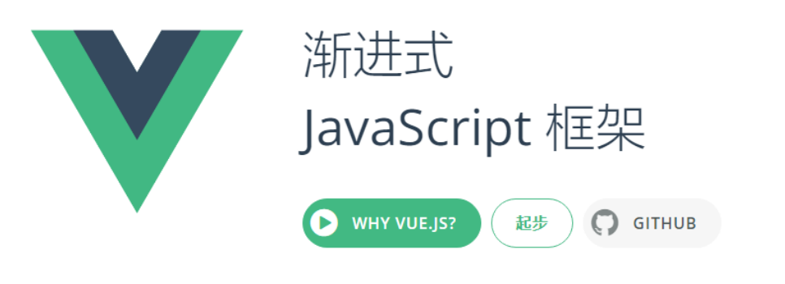
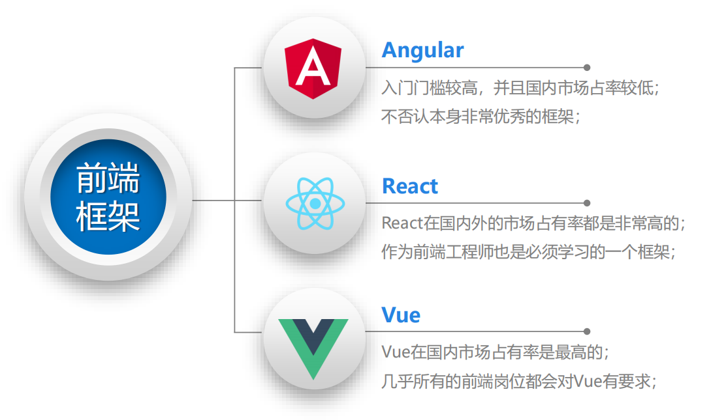
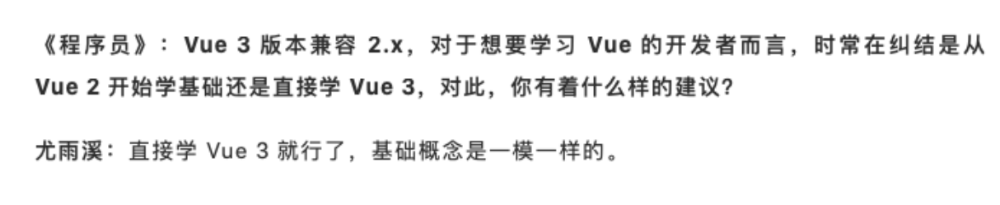
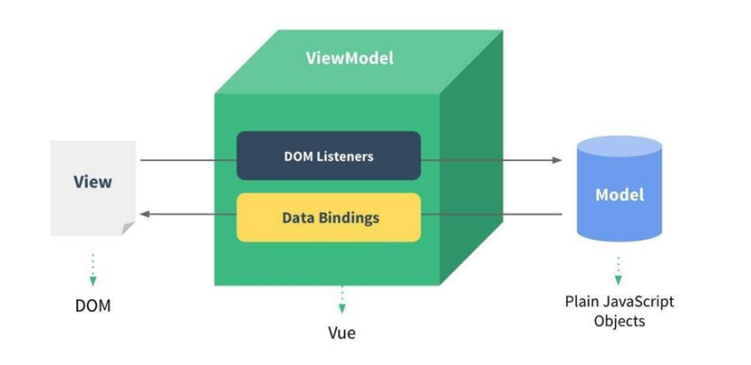
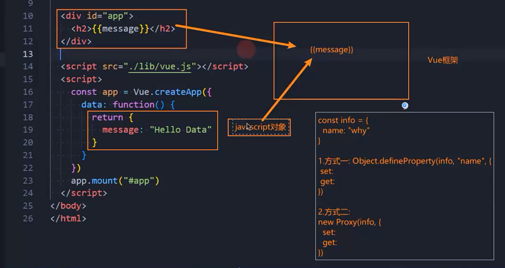
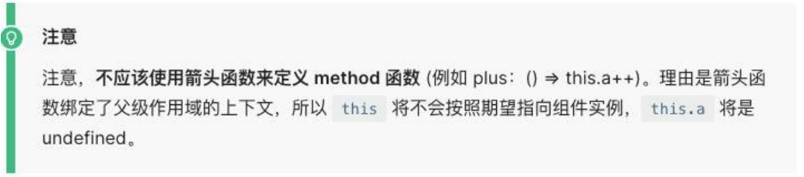
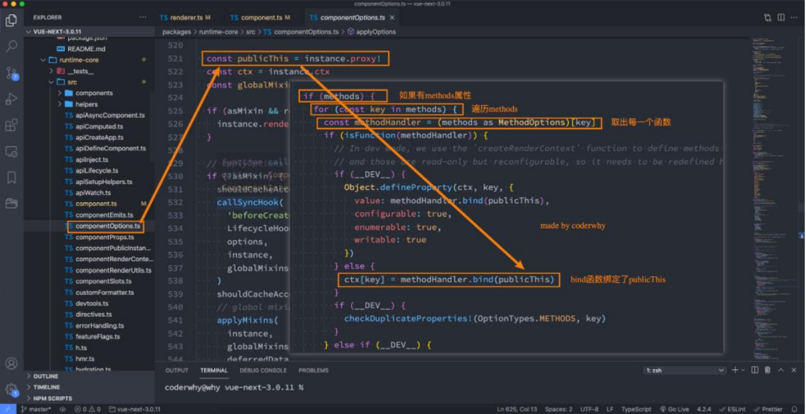

## **认识 Vue**

**Vue (读音 /vju/，类似于 view) 是一套用于构建用户界面的渐进式 JavaScript 框架。**

全称是 Vue.js 或者 Vuejs；

它基于标准 HTML、CSS 和 JavaScript 构建，并提供了一套声明式的、组件化的编程模型；

帮助你高效地开发用户界面，无论任务是简单还是复杂；

**什么是渐进式框架呢？**

表示我们可以在项目中一点点来引入和使用 Vue，而不一定需要全部使用 Vue 来开发整个项目；



## **目前 Vue 在前端处于什么地位？**

**目前前端最流行的是三大框架：Vue、React、Angular。**



## **谁是最好的前端框架？**

**当然，我不会去给出我的结论：**

首先，这是一个敏感的话题，在很多地方都争论不休，就像很多人喜欢争论谁才是世界上最好的语言一样；

其次，争论这个话题是没有意义的，争论不休的话题；

**但是，我们从现实的角度，分析一下，学习哪一门语言更容易找到工作？**

找后端的工作：优先推荐 Java、其次推荐 Go、再次推荐 Node（JavaScript），可能不推荐 PHP、C#；

找前端的工作：优先推荐 JavaScript（TypeScript）、其次 Flutter、再次 Android（Java、Kotlin）、iOS（OC、Swift）；

也有很多的其他方向：游戏开发、人工智能、算法工程师等等；

**那么，就前端来说，学习了 HTML、CSS、JavaScript，哪一个框架更容易找到工作？**

如果去国外找工作，优先推荐 React、其次是 Vue 和 Angular；

如果在国内找工作，优先推荐、必须学习 Vue，其次是 React，其次是 Angular；

## **学习 vue2 还是 vue3？**



## **目前需要学习 Vue3 吗？**

在 2020 年的 9 月 19 日，万众期待的 Vue3 终于发布了正式版，命名为**“One Piece”**。

更好的性能；

更小的包体积；

更好的 TypeScript 集成；

更优秀的 API 设计。

**那么现在是否是学习 vue3 的时间呢？**

答案是肯定的

Vue3 目前已经是稳定的版本，并且 Vue3 在 2022 年 2 月 7 日已经成为默认安装版本；

目前社区也经过一定时间的沉淀，更加的完善了，包括 AntDesignVue、Element-Plus 都提供了对 Vue3 的支持，所以很多公

司目前新的项目都已经在使用 Vue3 来进行开发了。

并且在面试的时候，几乎都会问到各种各样 Vue3 相关的问题；

## **如何使用 Vue 呢？**

**Vue 的本质，就是一个 JavaScript 的库：**

刚开始我们不需要把它想象的非常复杂；

我们就把它理解成一个已经帮助我们封装好的库；

在项目中可以引入并且使用它即可。

**那么安装和使用 Vue 这个 JavaScript 库有哪些方式呢？**

方式一：在页面中通过 CDN 的方式来引入；

方式二：下载 Vue 的 JavaScript 文件，并且自己手动引入；

方式三：通过 npm 包管理工具安装使用它（webpack 再讲）；

方式四：直接通过 Vue CLI 创建项目，并且使用它；

## **方式一：CDN 引入**

**Vue 的 CDN 引入：**

```javascript
<script src="https://unpkg.com/vue@next"></script>
```

## Hello Vue 案例的实现：

```html
<body>
  <h2>哈哈哈</h2>
  <p>我是内容, 呵呵呵呵</p>

  <div id="app"></div>

  <!-- CDN地址 -->
  <script src="https://unpkg.com/vue@next"></script>
  <script>
    // 使用Vue
    const app = Vue.createApp({
      template: `<h2>Hello World</h2><span>呵呵呵</span>`,
    });
    // 挂载
    app.mount("#app");
  </script>
</body>
```

## **方式二：下载和引入**

**下载 Vue 的源码，可以直接打开 CDN 的链接：**

打开链接，复制其中所有的代码；

创建一个新的文件，比如 vue.js，将代码复制到其中；

**通过 script 标签，引入刚才的文件：**

```javascript
<script src="./lib/vue.js"></script>
```

## Hello Vue 的案例实现：

```html
<body>
  <div id="app"></div>

  <script src="./lib/vue.js"></script>
  <script>
    // 1.创建app
    const app = Vue.createApp({
      template: `<h1>Hello Vue</h1>`,
    });

    // 2.挂载app
    app.mount("#app");
  </script>
</body>
```

## **Vue 初体验**

案例体验一：动态展示 Hello World 数据

```html
<body>
  <div id="app"></div>

  <script src="./lib/vue.js"></script>
  <script>
    const app = Vue.createApp({
      // 插值语法: {{title}}
      template: `<h2>{{message}}</h2>`,
      data: function () {
        return {
          title: "Hello World",
          message: "你好啊, Vue3",
        };
      },
    });
    app.mount("#app");
  </script>
</body>
```

案例体验二：展示列表的数据

```html
<body>
  <div id="app"></div>

  <script src="./lib/vue.js"></script>
  <script>
    const app = Vue.createApp({
      template: `
        <h2>电影列表</h2>
        <ul>
          <li v-for="item in movies">{{item}}</li>
        </ul>
      `,
      data: function () {
        return {
          message: "你好啊, 李银河",
          movies: ["大话西游", "星际穿越", "盗梦空间", "少年派", "飞驰人生"],
        };
      },
    });
    app.mount("#app");
  </script>
</body>
```

案例体验三：计数器功能实现

```html
<body>
  <div id="app"></div>

  <script src="./lib/vue.js"></script>
  <script>
    const app = Vue.createApp({
      template: `
        <h2>当前计数: {{counter}}</h2>
        <button @click="increment">+1</button>
        <button @click="decrement">-1</button>
      `,
      data: function () {
        return {
          counter: 0,
        };
      },
      methods: {
        increment: function () {
          this.counter++;
        },
        decrement: function () {
          this.counter--;
        },
      },
    });
    app.mount("#app");
  </script>
</body>
```

计数器功能的重构

```html
<body>
  // 不写template，默认用app里面的模板
  <div id="app">
    <h2>当前计数: {{counter}}</h2>
    <button @click="increment">+1</button>
    <button @click="decrement">-1</button>
  </div>

  <script src="./lib/vue.js"></script>
  <script>
    const app = Vue.createApp({
      data: function () {
        return {
          counter: 0,
        };
      },
      methods: {
        increment: function () {
          this.counter++;
        },
        decrement: function () {
          this.counter--;
        },
      },
    });
    app.mount("#app");
  </script>
</body>
```

## **计数器原生实现**

```html
<body>
  <h2>当前计数: <span class="counter"></span></h2>
  <button class="add">+1</button>
  <button class="sub">-1</button>

  <script>
    // 1.获取dom
    const h2El = document.querySelector("h2");
    const counterEl = document.querySelector(".counter");
    const addBtnEl = document.querySelector(".add");
    const subBtnEl = document.querySelector(".sub");

    // 2.定义一个变量记录数据
    let counter = 100;
    counterEl.textContent = counter;

    // 2.监听按钮的点击
    addBtnEl.onclick = function () {
      counter++;
      counterEl.textContent = counter;
    };
    subBtnEl.onclick = function () {
      counter--;
      counterEl.textContent = counter;
    };
  </script>
</body>
```

## **声明式和命令式**

原生开发和 Vue 开发的模式和特点，我们会发现是完全不同的，这里其实涉及到**两种不同的编程范式**：

命令式编程和声明式编程；

命令式编程关注的是 “how to do”自己完成整个 how 的过程；

声明式编程关注的是 “what to do”，由框架(机器)完成 “how”的过程；

**在原生的实现过程中，我们是如何操作的呢？**

我们每完成一个操作，都需要通过 JavaScript 编写一条代码，来给浏览器一个指令；

这样的编写代码的过程，我们称之为命令式编程；

在早期的原生 JavaScript 和 jQuery 开发的过程中，我们都是通过这种命令式的方式在编写代码的；

**在 Vue 的实现过程中，我们是如何操作的呢？**

我们会在 createApp 传入的对象中声明需要的内容，模板 template、数据 data、方法 methods；

这样的编写代码的过程，我们称之为是声明式编程；

目前 Vue、React、Angular、小程序的编程模式，我们称之为声明式编程；

## **MVVM 模型**

**MVC 和 MVVM 都是一种软件的体系结构**

MVC 是 Model – View –Controller 的简称，是在前期被使用非常框架的架构模式，比如 iOS、前端；

MVVM 是 Model-View-ViewModel 的简称，是目前非常流行的架构模式；

**通常情况下，我们也经常称 Vue 是一个 MVVM 的框架。**

Vue 官方其实有说明，Vue 虽然并没有完全遵守 MVVM 的模型，但是整个设计是受到它的启发的。



## **data 属性**

**data 属性是传入一个函数，并且该函数需要返回一个对象：**

在 Vue2.x 的时候，也可以传入一个对象（虽然官方推荐是一个函数）；

在 Vue3.x 的时候，必须传入一个函数，否则就会直接在浏览器中报错；

**data 中返回的对象会被 Vue 的响应式系统劫持，之后对该对象的修改或者访问都会在劫持中被处理：**

所以我们在 template 或者 app 中通过 {{counter}} 访问 counter，可以从对象中获取到数据；

所以我们修改 counter 的值时，app 中的 {{counter}}也会发生改变；

**具体这种响应式的原理，我们后面会有专门的篇幅来讲解。**



## **methods 属性**

**methods 属性是一个对象，通常我们会在这个对象中定义很多的方法：**

这些方法可以被绑定到 模板中；

在该方法中，我们可以使用 this 关键字来直接访问到 data 中返回的对象的属性；

**对于有经验的同学，在这里我提一个问题，官方文档有这么一段描述：**

问题一：为什么不能使用箭头函数（官方文档有给出解释）？

问题二：不使用箭头函数的情况下，this 到底指向的是什么？（可以作为一道面试题）



## **问题一：不能使用箭头函数？**

**我们在 methods 中要使用 data 返回对象中的数据：**

那么这个 this 是必须有值的，并且应该可以通过 this 获取到 data 返回对象中的数据。

**那么我们这个 this 能不能是 window 呢？**

不可以是 window，因为 window 中我们无法获取到 data 返回对象中的数据；

但是如果我们使用箭头函数，那么这个 this 就会是 window 了；

**为什么是 window 呢？**

这里涉及到箭头函数使用 this 的查找规则，它会在自己的上层作用域中来查找 this；

最终刚好找到的是 script 作用域中的 this，所以就是 window；

```html
<body>
  <div id="app">
    <h2>当前计数: {{counter}}</h2>
    <button @click="increment">+1</button>
  </div>

  <script src="./lib/vue.js"></script>
  <script>
    console.log(this); // window

    const app = Vue.createApp({
      data: function () {
        return {
          counter: 0,
        };
      },

      // methods: option api
      methods: {
        increment: function () {
          this.counter++;
        },
        // 强调: methods中函数不能写成箭头函数
        // increment: () => {
        //   console.log(this) // window
        // }
      },
    });

    app.mount("#app");
  </script>
</body>
```

## **问题二：this 到底指向什么？**

事实上 Vue 的源码当中就是对 methods 中的所有函数进行了遍历，并且通过 bind 绑定了 this：



## **其他属性**

**当然，这里还可以定义很多其他的属性，我们会在后续进行讲解：**

比如 props、computed、watch、emits、setup 等等；

也包括很多的生命周期函数；

**不用着急，我们会一个个学习它们的。**
