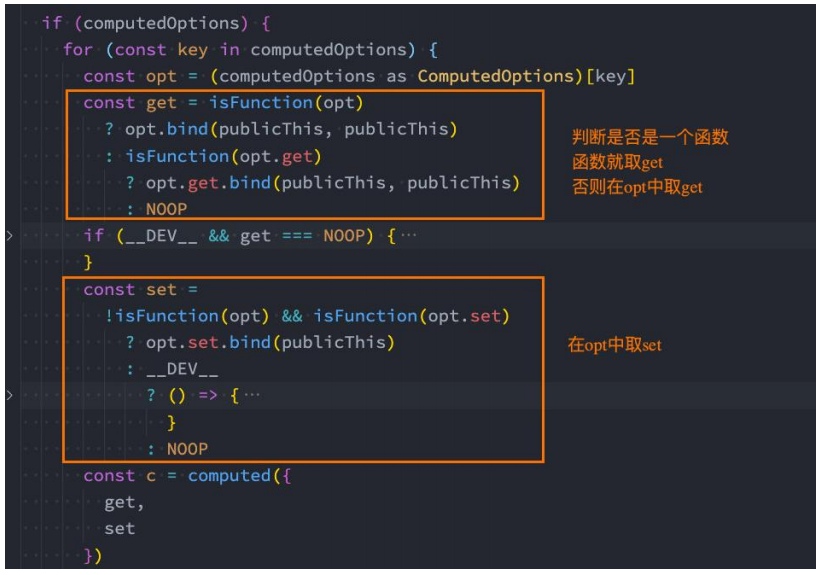
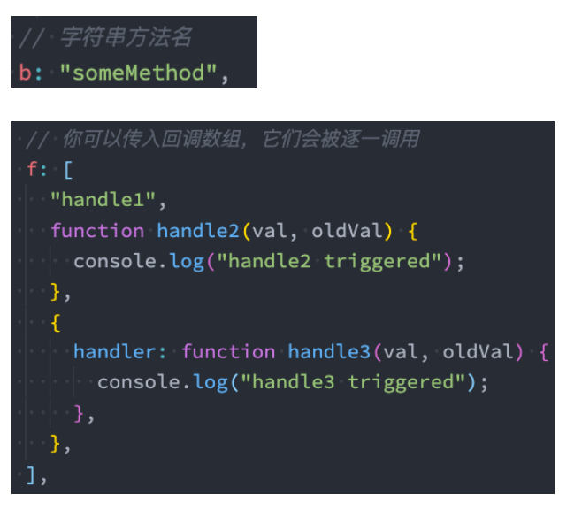
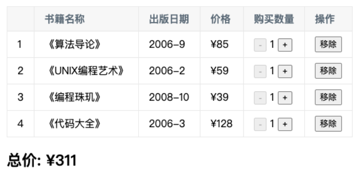

## **复杂 data 的处理方式**

**我们知道，在模板中可以直接通过插值语法显示一些 data 中的数据。**

**但是在某些情况，我们可能需要对数据进行一些转化后再显示，或者需要将多个数据结合起来进行显示；**

比如我们需要对多个 data 数据进行运算、三元运算符来决定结果、数据进行某种转化后显示；

在模板中使用表达式，可以非常方便的实现，但是设计它们的初衷是用于简单的运算；

在模板中放入太多的逻辑会让模板过重和难以维护；

并且如果多个地方都使用到，那么会有大量重复的代码；

**我们有没有什么方法可以将逻辑抽离出去呢？**

可以，其中一种方式就是将逻辑抽取到一个 method 中，放到 methods 的 options 中；

但是，这种做法有一个直观的弊端，就是所有的 data 使用过程都会变成了一个方法的调用；

另外一种方式就是使用计算属性 computed；

## **认识计算属性 computed**

**什么是计算属性呢？**

官方并没有给出直接的概念解释；

而是说：对于任何包含响应式数据的复杂逻辑，你都应该使用**计算属性**；

计算属性将被混入到组件实例中

所有 getter 和 setter 的 this 上下文自动地绑定为组件实例；

**计算属性的用法：**

**选项：**computed

**类型：**

```javascript
{ [key: string]: Function | { get: Function, set: Function } }
```

**那接下来我们通过案例来理解一下这个计算属性。**

## **案例实现思路**

**我们来看三个案例：**

案例一：我们有两个变量：firstName 和 lastName，希望它们拼接之后在界面上显示；

案例二：我们有一个分数：score

当 score 大于 60 的时候，在界面上显示及格；

当 score 小于 60 的时候，在界面上显示不及格；

案例三：我们有一个变量 message，记录一段文字：比如 Hello World

某些情况下我们是直接显示这段文字；

某些情况下我们需要对这段文字进行反转；

**我们可以有三种实现思路：**

思路一：在模板语法中直接使用表达式；

思路二：使用 method 对逻辑进行抽取；

思路三：使用计算属性 computed；

## **实现思路一：模板语法**

**思路一的实现：模板语法**

缺点一：模板中存在大量的复杂逻辑，不便于维护（模板中表达式的初衷是用于简单的计算）；

缺点二：当有多次一样的逻辑时，存在重复的代码；

缺点三：多次使用的时候，很多运算也需要多次执行，没有缓存；

```html
<body>
  <div id="app">
    <!-- 插值语法表达式直接进行拼接 -->
    <!-- 1.拼接名字 -->
    <h2>{{ firstName + " " + lastName }}</h2>
    <h2>{{ firstName + " " + lastName }}</h2>
    <h2>{{ firstName + " " + lastName }}</h2>

    <!-- 2.显示分数等级 -->
    <h2>{{ score >= 60 ? '及格': '不及格' }}</h2>

    <!-- 3.反转单词显示文本 -->
    <h2>{{ message.split(" ").reverse().join(" ") }}</h2>
  </div>

  <script src="../lib/vue.js"></script>
  <script>
    // 1.创建app
    const app = Vue.createApp({
      // data: option api
      data() {
        return {
          // 1.姓名
          firstName: "kobe",
          lastName: "bryant",

          // 2.分数: 及格/不及格
          score: 80,

          // 3.一串文本: 对文本中的单词进行反转显示
          message: "my name is why",
        };
      },
    });

    // 2.挂载app
    app.mount("#app");
  </script>
</body>
```

## **实现思路二：method 实现**

**思路二的实现：method 实现**

缺点一：我们事实上先显示的是一个结果，但是都变成了一种方法的调用；

缺点二：多次使用方法的时候，没有缓存，也需要多次计算；

```html
<body>
  <div id="app">
    <!-- 插值语法表达式直接进行拼接 -->
    <!-- 1.拼接名字 -->
    <h2>{{ getFullname() }}</h2>
    <h2>{{ getFullname() }}</h2>
    <h2>{{ getFullname() }}</h2>

    <!-- 2.显示分数等级 -->
    <h2>{{ getScoreLevel() }}</h2>

    <!-- 3.反转单词显示文本 -->
    <h2>{{ reverseMessage() }}</h2>
  </div>

  <script src="../lib/vue.js"></script>
  <script>
    // 1.创建app
    const app = Vue.createApp({
      // data: option api
      data() {
        return {
          // 1.姓名
          firstName: "kobe",
          lastName: "bryant",

          // 2.分数: 及格/不及格
          score: 80,

          // 3.一串文本: 对文本中的单词进行反转显示
          message: "my name is why",
        };
      },
      methods: {
        getFullname() {
          return this.firstName + " " + this.lastName;
        },
        getScoreLevel() {
          return this.score >= 60 ? "及格" : "不及格";
        },
        reverseMessage() {
          return this.message.split(" ").reverse().join(" ");
        },
      },
    });

    // 2.挂载app
    app.mount("#app");
  </script>
</body>
```

## **思路三的实现：computed 实现**

**思路三的实现：computed 实现**

注意：计算属性看起来像是一个函数，但是我们在使用的时候不需要加\()，这个后面讲 setter 和 getter 时会讲到；

我们会发现无论是直观上，还是效果上计算属性都是更好的选择；

并且计算属性是有缓存的；

```html
<body>
  <div id="app">
    <!-- 插值语法表达式直接进行拼接 -->
    <!-- 1.拼接名字 -->
    <h2>{{ fullname }}</h2>
    <h2>{{ fullname }}</h2>
    <h2>{{ fullname }}</h2>

    <!-- 2.显示分数等级 -->
    <h2>{{ scoreLevel }}</h2>

    <!-- 3.反转单词显示文本 -->
    <h2>{{ reverseMessage }}</h2>
  </div>

  <script src="../lib/vue.js"></script>
  <script>
    // 1.创建app
    const app = Vue.createApp({
      // data: option api
      data() {
        return {
          // 1.姓名
          firstName: "kobe",
          lastName: "bryant",

          // 2.分数: 及格/不及格
          score: 80,

          // 3.一串文本: 对文本中的单词进行反转显示
          message: "my name is why",
        };
      },
      computed: {
        // 1.计算属性默认对应的是一个函数
        fullname() {
          return this.firstName + " " + this.lastName;
        },

        scoreLevel() {
          return this.score >= 60 ? "及格" : "不及格";
        },

        reverseMessage() {
          return this.message.split(" ").reverse().join(" ");
        },
      },
    });

    // 2.挂载app
    app.mount("#app");
  </script>
</body>
```

## **计算属性 vs methods**

在上面的实现思路中，我们会发现计算属性和 methods 的实现看起来是差别是不大的，而且我们多次提到计算属性有缓存的。

接下来我们来看一下同一个计算多次使用，计算属性和 methods 的差异：

```html
<body>
  <div id="app">
    <!-- 1.methods -->
    <h2>{{ getFullname() }}</h2>
    <h2>{{ getFullname() }}</h2>
    <h2>{{ getFullname() }}</h2>

    <!-- 2.computed -->
    <h2>{{ fullname }}</h2>
    <h2>{{ fullname }}</h2>
    <h2>{{ fullname }}</h2>

    <!-- 修改name值 -->
    <button @click="changeLastname">修改lastname</button>
  </div>

  <script src="../lib/vue.js"></script>
  <script>
    // 1.创建app
    const app = Vue.createApp({
      // data: option api
      data() {
        return {
          firstName: "kobe",
          lastName: "bryant",
        };
      },
      methods: {
        getFullname() {
          console.log("getFullname-----"); // 执行了3次
          return this.firstName + " " + this.lastName;
        },
        changeLastname() {
          this.lastName = "why"; // 改变lastName，fullname会重写计算并发生改变
        },
      },
      computed: {
        fullname() {
          console.log("computed fullname-----"); // 只执行一次
          return this.firstName + " " + this.lastName;
        },
      },
    });

    // 2.挂载app
    app.mount("#app");
  </script>
</body>
```

## **计算属性的缓存**

**这是什么原因呢？**

这是因为计算属性会基于它们的依赖关系进行缓存；

在数据不发生变化时，计算属性是不需要重新计算的；

但是如果依赖的数据发生变化，在使用时，计算属性依然会重新进行计算；

## **计算属性的 setter 和 getter**

**计算属性在大多数情况下，只需要一个 getter 方法即可，所以我们会将计算属性直接写成一个函数。**

**但是，如果我们确实想设置计算属性的值呢？**

这个时候我们也可以给计算属性设置一个 setter 的方法；

```html
<body>
  <div id="app">
    <h2>{{ fullname }}</h2>

    <button @click="setFullname">设置fullname</button>
  </div>

  <script src="../lib/vue.js"></script>
  <script>
    // 1.创建app
    const app = Vue.createApp({
      // data: option api
      data() {
        return {
          firstname: "coder",
          lastname: "why",
        };
      },
      computed: {
        // 语法糖的写法
        // fullname() {
        //   return this.firstname + " " + this.lastname
        // },

        // 完整的写法:
        fullname: {
          get: function () {
            return this.firstname + " " + this.lastname;
          },
          set: function (value) {
            // "kobe bryant"会传给value
            const names = value.split(" ");
            this.firstname = names[0];
            this.lastname = names[1];
          },
        },
      },
      methods: {
        setFullname() {
          this.fullname = "kobe bryant";
        },
      },
    });

    // 2.挂载app
    app.mount("#app");
  </script>
</body>
```

## **源码如何对 setter 和 getter 处理呢？（了解）**

**你可能觉得很奇怪，Vue 内部是如何对我们传入的是一个 getter，还是说是一个包含 setter 和 getter 的对象进行处理的呢？**

事实上非常的简单，Vue 源码内部只是做了一个逻辑判断而已；



## **认识侦听器 watch**

**什么是侦听器呢？**

开发中我们在 data 返回的对象中定义了数据，这个数据通过插值语法等方式绑定到 template 中；

当数据变化时，template 会自动进行更新来显示最新的数据；

但是在某些情况下，我们希望在代码逻辑中监听某个数据的变化，这个时候就需要用侦听器 watch 来完成了；

**侦听器的用法如下：**

**选项：**watch

**类型：**

```javascript
{ [key: string]: string | Function | Object | Array}
```

```html
<body>
  <div id="app">
    <h2>{{message}}</h2>
    <button @click="changeMessage">修改message</button>
  </div>

  <script src="../lib/vue.js"></script>
  <script>
    // Proxy -> Reflect
    // 1.创建app
    const app = Vue.createApp({
      // data: option api
      data() {
        return {
          message: "Hello Vue",
          info: { name: "why", age: 18 },
        };
      },
      methods: {
        changeMessage() {
          this.message = "你好啊, 李银河!";
          this.info = { name: "kobe" };
        },
      },
      watch: {
        // 1.默认有两个参数: newValue/oldValue
        message(newValue, oldValue) {
          console.log("message数据发生了变化:", newValue, oldValue);
        },
        info(newValue, oldValue) {
          // 2.如果是对象类型, 那么拿到的是代理对象
          // console.log("info数据发生了变化:", newValue, oldValue)
          // console.log(newValue.name, oldValue.name)

          // 3.获取原始对象
          // console.log({ ...newValue })
          console.log(Vue.toRaw(newValue));
        },
      },
    });

    // 2.挂载app
    app.mount("#app");
  </script>
</body>
```

## **侦听器 watch 的配置选项**

**我们先来看一个例子：**

当我们点击按钮的时候会修改 info.name 的值；

这个时候我们使用 watch 来侦听 info，可以侦听到吗？答案是不可以。

这是因为默认情况下，**watch 只是在侦听 info 的引用变化**，对于**内部属性的变化是不会做出响应**的：

这个时候我们可以使用一个选项 deep 进行更深层的侦听；

注意前面我们说过 watch 里面侦听的属性对应的也可以是一个 Object；

还有**另外一个属性**，是**希望一开始的就会立即执行一次**：

这个时候我们使用 immediate 选项；

这个时候无论后面数据是否有变化，侦听的函数都会优先执行一次；

```html
<body>
  <div id="app">
    <h2>{{ info.name }}</h2>
    <button @click="changeInfo">修改info</button>
  </div>

  <script src="../lib/vue.js"></script>
  <script>
    // 1.创建app
    const app = Vue.createApp({
      // data: option api
      data() {
        return {
          info: { name: "why", age: 18 },
        };
      },
      methods: {
        changeInfo() {
          // 1.创建一个新对象, 赋值给info
          // this.info = { name: "kobe" }

          // 2.直接修改原对象某一个属性
          this.info.name = "kobe";
        },
      },
      watch: {
        // 默认watch监听不会进行深度监听
        // info(newValue, oldValue) {
        //   console.log("侦听到info改变:", newValue, oldValue)
        // }

        // 进行深度监听
        info: {
          handler(newValue, oldValue) {
            console.log("侦听到info改变:", newValue, oldValue);
            console.log(newValue === oldValue); // 设置immediate为true，oldValue为undefined
            // 不设置immediate为true，那么newValue和oldValue相等
          },
          // 监听器选项:
          // info进行深度监听
          deep: true,
          // 第一次渲染直接执行一次监听器
          immediate: true,
        },
        "info.name": function (newValue, oldValue) {
          console.log("name发生改变:", newValue, oldValue); // 会发生改变
        },
      },
    });

    // 2.挂载app
    app.mount("#app");
  </script>
</body>
```

## **侦听器 watch 的其他方式（一）**



## **侦听器 watch 的其他方式（二）**

另外一个是 Vue3 文档中没有提到的，但是 Vue2 文档中有提到的是侦听对象的属性：

```javascript
"info.name": function(newValue, oldValue) {
    console.log("name发生改变:", newValue, oldValue)
}
```

**还有另外一种方式就是使用 $watch 的 API：**

**我们可以在 created 的生命周期（后续会讲到）中，使用 this.$watchs 来侦听；**

第一个参数是要侦听的源；

第二个参数是侦听的回调函数 callback；

第三个参数是额外的其他选项，比如 deep、immediate；

```html
<body>
  <div id="app">
    <h2>{{message}}</h2>
    <button @click="changeMessage">修改message</button>
  </div>

  <script src="../lib/vue.js"></script>
  <script>
    // 1.创建app
    const app = Vue.createApp({
      // data: option api
      data() {
        return {
          message: "Hello Vue",
        };
      },
      methods: {
        changeMessage() {
          this.message = "你好啊, 李银河!";
        },
      },
      // 生命周期回调函数: 当前的组件被创建时自动执行
      // 一般在该函数中, 会进行网络请求
      created() {
        // ajax/fetch/axios
        console.log("created");

        this.$watch(
          "message",
          (newValue, oldValue) => {
            console.log("message数据变化:", newValue, oldValue);
          },
          { deep: true }
        );
      },
    });

    // 2.挂载app
    app.mount("#app");
  </script>
</body>
```

## **综合案例**

**现在我们来做一个相对综合一点的练习：书籍购物车**



**案例说明：**

1.在界面上以表格的形式，显示一些书籍的数据；

2.在底部显示书籍的总价格；

3.点击+或者-可以增加或减少书籍数量（如果为 1，那么不能继续-）；

4.点击移除按钮，可以将书籍移除（当所有的书籍移除完毕时，显示：购物车为空~）；

```html
<html lang="en">
  <head>
    <meta charset="UTF-8" />
    <meta http-equiv="X-UA-Compatible" content="IE=edge" />
    <meta name="viewport" content="width=device-width, initial-scale=1.0" />
    <title>Document</title>
    <style>
      table {
        border-collapse: collapse;
        /* text-align: center; */
      }

      thead {
        background-color: #f5f5f5;
      }

      th,
      td {
        border: 1px solid #aaa;
        padding: 8px 16px;
      }

      .active {
        background-color: skyblue;
      }
    </style>
  </head>
  <body>
    <div id="app">
      <!-- 1.搭建界面内容 -->
      <template v-if="books.length">
        <table>
          <thead>
            <tr>
              <th>序号</th>
              <th>书籍名称</th>
              <th>出版日期</th>
              <th>价格</th>
              <th>购买数量</th>
              <th>操作</th>
            </tr>
          </thead>
          <tbody>
            <tr
              v-for="(item, index) in books"
              :key="item.id"
              @click="rowClick(index)"
              :class="{ active: index === currentIndex }"
            >
              <td>{{ index + 1 }}</td>
              <td>{{ item.name }}</td>
              <td>{{ item.date }}</td>
              <td>{{ formatPrice(item.price) }}</td>
              <td>
                <button
                  :disabled="item.count <= 1"
                  @click="decrement(index, item)"
                >
                  -
                </button>
                {{ item.count }}
                <button @click="increment(index, item)">+</button>
              </td>
              <td>
                <button @click="removeBook(index, item)">移除</button>
              </td>
            </tr>
          </tbody>
        </table>

        <h2>总价: {{ formatPrice(totalPrice) }}</h2>
      </template>

      <template v-else>
        <h1>购物车为空, 请添加喜欢的书籍~</h1>
        <p>商场中有大量的IT类的书籍, 请选择添加学习, 注意保护好自己的头发!</p>
      </template>
    </div>

    <script src="../lib/vue.js"></script>
    <script src="./data/data.js"></script>
    <script>
      // 1.创建app
      const app = Vue.createApp({
        // data: option api
        data() {
          return {
            books: books,
            currentIndex: 0,
          };
        },
        // computed
        computed: {
          totalPrice() {
            // 1.直接遍历books
            // let price = 0
            // for (const item of this.books) {
            //   price += item.price * item.count
            // }
            // return price

            // 2.reduce(自己决定)
            return this.books.reduce((preValue, item) => {
              return preValue + item.price * item.count;
            }, 0);
          },
        },
        methods: {
          formatPrice(price) {
            return "¥" + price;
          },

          // 监听-和+操作
          decrement(index, item) {
            console.log("点击-");
            // this.books[index].count--
            item.count--;
          },
          increment(index, item) {
            console.log("点击+:", index);
            // this.books[index].count++
            item.count++;
          },
          removeBook(index, item) {
            this.books.splice(index, 1);
          },
          rowClick(index) {
            this.currentIndex = index;
          },
        },
      });

      // 2.挂载app
      app.mount("#app");
    </script>
  </body>
</html>
```

```javascript
const books = [
  {
    id: 1,
    name: "《算法导论》",
    date: "2006-9",
    price: 85.0,
    count: 1,
  },
  {
    id: 2,
    name: "《UNIX编程艺术》",
    date: "2006-2",
    price: 59.0,
    count: 1,
  },
  {
    id: 3,
    name: "《编程珠玑》",
    date: "2008-10",
    price: 39.0,
    count: 1,
  },
  {
    id: 4,
    name: "《代码大全》",
    date: "2006-3",
    price: 128.0,
    count: 1,
  },
  {
    id: 5,
    name: "《你不知道JavaScript》",
    date: "2014-8",
    price: 88.0,
    count: 1,
  },
];
```

## 列表的选中

```html
<html lang="en">
  <head>
    <meta charset="UTF-8" />
    <meta http-equiv="X-UA-Compatible" content="IE=edge" />
    <meta name="viewport" content="width=device-width, initial-scale=1.0" />
    <title>Document</title>
    <style>
      .active {
        color: red;
      }
    </style>
  </head>
  <body>
    <div id="app">
      <ul>
        <!-- <h2 :class="{title: false}"></h2> -->

        <!-- 对active的class进行动态绑定 -->
        <!-- 需求一: 将索引值为1的li添加上active -->
        <!-- 需求二：用一个变量（属性）记录当前点击的位置 -->
        <li
          :class="{active: index === currentIndex}"
          @click="liClick(index)"
          v-for="(item, index) in movies"
        >
          {{item}}
        </li>
      </ul>
    </div>

    <script src="../lib/vue.js"></script>
    <script>
      // 1.创建app
      const app = Vue.createApp({
        // data: option api
        data() {
          return {
            movies: ["星际穿越", "阿凡达", "大话西游", "黑客帝国"],
            currentIndex: -1,
          };
        },
        methods: {
          liClick(index) {
            console.log("liClick:", index);
            this.currentIndex = index;
          },
        },
      });

      // 2.挂载app
      app.mount("#app");
    </script>
  </body>
</html>
```
