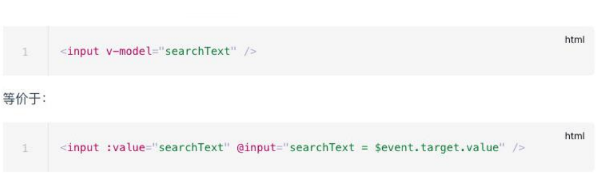

## **v-model 的基本使用**

**表单提交**是开发中非常常见的功能，也是和用户交互的重要手段：

比如用户在登录、注册时需要提交账号密码；

比如用户在检索、创建、更新信息时，需要提交一些数据；

这些都要求我们可以在**代码逻辑中获取到用户提交的数据**，我们通常会使用**v-model 指令**来完成：

v-model 指令可以在表单 input、textarea 以及 select 元素上创建双向数据绑定；

它会根据控件类型自动选取正确的方法来更新元素；

尽管有些神奇，但 v-model 本质上不过是语法糖，它负责监听用户的输入事件来更新数据，并在某种极端场景下进行一些特

殊处理；

## **v-model 的原理**

**官方有说到，v-model 的原理其实是背后有两个操作：**

v-bind 绑定 value 属性的值；

v-on 绑定 input 事件监听到函数中，函数会获取最新的值赋值到绑定的属性中；



```html
<body>
  <div id="app">
    <!-- 1.手动的实现了双向绑定 -->
    <!-- <input type="text" :value="message" @input="inputChange"> -->

    <!-- 2.v-model实现双向绑定 -->
    <!-- <input type="text" v-model="message"> -->

    <!-- 3.登录功能 -->
    <label for="account">
      账号:<input id="account" type="text" v-model="account" />
    </label>
    <label for="password">
      密码:<input id="password" type="password" v-model="password" />
    </label>

    <button @click="loginClick">登录</button>

    <h2>{{message}}</h2>
  </div>

  <script src="../lib/vue.js"></script>
  <script>
    // 1.创建app
    const app = Vue.createApp({
      // data: option api
      data() {
        return {
          message: "Hello Model",
          account: "",
          password: "",
        };
      },
      methods: {
        inputChange(event) {
          this.message = event.target.value;
        },
        loginClick() {
          const account = this.account;
          const password = this.password;

          // url发送网络请求
          console.log(account, password);
        },
      },
    });

    // 2.挂载app
    app.mount("#app");
  </script>
</body>
```

## **v-model 绑定 textarea**

我们再来绑定一下**其他的表单类型**：textarea、checkbox、radio、select

**我们来看一下绑定 textarea：**

```html
<body>
  <div id="app">
    <textarea cols="30" rows="10" v-model="content"></textarea>

    <p>输入的内容: {{content}}</p>
  </div>

  <script src="../lib/vue.js"></script>
  <script>
    // 1.创建app
    const app = Vue.createApp({
      // data: option api
      data() {
        return {
          content: "",
        };
      },
    });

    // 2.挂载app
    app.mount("#app");
  </script>
</body>
```

## **v-model 绑定 checkbox**

**我们来看一下 v-model 绑定 checkbox：单个勾选框和多个勾选框**

**单个勾选框：**

v-model 即为布尔值。

此时 input 的 value 属性并不影响 v-model 的值。

**多个复选框：**

当是多个复选框时，因为可以选中多个，所以对应的 data 中属性是一个数组。

当选中某一个时，就会将 input 的 value 添加到数组中。

```html
<body>
  <div id="app">
    <!-- 1.checkbox单选框: 绑定到属性中的值是一个Boolean -->
    <label for="agree">
      <!-- 单选框加value没有意义，不会影响v-model的值 -->
      <input id="agree" type="checkbox" v-model="isAgree" /> 同意协议
    </label>
    <h2>单选框: {{isAgree}}</h2>
    <hr />

    <!-- 2.checkbox多选框: 绑定到属性中的值是一个Array -->
    <!-- 注意: 多选框当中, 必须明确的绑定一个value值 -->
    <div class="hobbies">
      <h2>请选择你的爱好:</h2>
      <label for="sing">
        <input id="sing" type="checkbox" v-model="hobbies" value="sing" /> 唱
      </label>
      <label for="jump">
        <input id="jump" type="checkbox" v-model="hobbies" value="jump" /> 跳
      </label>
      <label for="rap">
        <input id="rap" type="checkbox" v-model="hobbies" value="rap" /> rap
      </label>
      <label for="basketball">
        <input
          id="basketball"
          type="checkbox"
          v-model="hobbies"
          value="basketball"
        />
        篮球
      </label>
      <h2>爱好: {{hobbies}}</h2>
    </div>
  </div>

  <script src="../lib/vue.js"></script>
  <script>
    // 1.创建app
    const app = Vue.createApp({
      // data: option api
      data() {
        return {
          isAgree: false,
          hobbies: [],
        };
      },
    });

    // 2.挂载app
    app.mount("#app");
  </script>
</body>
```

## **v-model 绑定 radio**

**v-model 绑定 radio，用于选择其中一项；**

这里也需要绑定 value，本来需要加 name 属性让它们互斥，但是使用了 v-model 绑定同一个值，name 属性可以省略，上面的 checkbox 也是一样可以省略 name

```html
<body>
  <div id="app">
    <div class="gender">
      <label for="male">
        <input id="male" type="radio" v-model="gender" value="male" /> 男
      </label>
      <label for="female">
        <input id="female" type="radio" v-model="gender" value="female" /> 女
      </label>
      <h2>性别: {{gender}}</h2>
    </div>
  </div>

  <script src="../lib/vue.js"></script>
  <script>
    // 1.创建app
    const app = Vue.createApp({
      // data: option api
      data() {
        return {
          gender: "female",
        };
      },
    });

    // 2.挂载app
    app.mount("#app");
  </script>
</body>
```

## **v-model 绑定 select**

**和 checkbox 一样，select 也分单选和多选两种情况。**

**单选：只能选中一个值**

v-model 绑定的是一个值；

当我们选中 option 中的一个时，会将它对应的 value 赋值到 fruit 中；

**多选：可以选中多个值**

v-model 绑定的是一个数组；

当选中多个值时，就会将选中的 option 对应的 value 添加到数组 fruit 中；

```html
<body>
  <div id="app">
    <!-- select的单选 -->
    <select v-model="fruit">
      <option value="apple">苹果</option>
      <option value="orange">橘子</option>
      <option value="banana">香蕉</option>
    </select>
    <h2>单选: {{fruit}}</h2>
    <hr />

    <!-- select的多选，按住Ctrl或Shift多选 -->
    <select multiple size="3" v-model="fruits">
      <option value="apple">苹果</option>
      <option value="orange">橘子</option>
      <option value="banana">香蕉</option>
    </select>
    <h2>多选: {{fruits}}</h2>
  </div>

  <script src="../lib/vue.js"></script>
  <script>
    // 1.创建app
    const app = Vue.createApp({
      // data: option api
      data() {
        return {
          fruit: "orange",
          fruits: [],
        };
      },
    });

    // 2.挂载app
    app.mount("#app");
  </script>
</body>
```

## **v-model 的值绑定**

**目前我们在前面的案例中大部分的值都是在 template 中固定好的：**

比如 gender 的两个输入框值 male、female；

比如 hobbies 的三个输入框值 basketball、football、tennis；

在真实开发中，我们的数据可能是来自服务器的，那么我们就可以先将值请求下来，绑定到 data 返回的对象中，再通过 v-bind 来

进行值的绑定，这个过程就是**值绑定**。

```html
<body>
  <div id="app">
    <!-- 1.select的值绑定 -->
    <select multiple size="3" v-model="fruits">
      <option v-for="item in allFruits" :key="item.value" :value="item.value">
        {{item.text}}
      </option>
    </select>
    <h2>多选: {{fruits}}</h2>

    <hr />

    <!-- 2.checkbox的值绑定 -->
    <div class="hobbies">
      <h2>请选择你的爱好:</h2>
      <template v-for="item in allHobbies" :key="item.value">
        <label :for="item.value">
          <input
            :id="item.value"
            type="checkbox"
            v-model="hobbies"
            :value="item.value"
          />
          {{item.text}}
        </label>
      </template>
      <h2>爱好: {{hobbies}}</h2>
    </div>
  </div>

  <script src="../lib/vue.js"></script>
  <script>
    // 1.创建app
    const app = Vue.createApp({
      // data: option api
      data() {
        return {
          // 水果
          allFruits: [
            { value: "apple", text: "苹果" },
            { value: "orange", text: "橘子" },
            { value: "banana", text: "香蕉" },
          ],
          fruits: [],

          // 爱好
          allHobbies: [
            { value: "sing", text: "唱" },
            { value: "jump", text: "跳" },
            { value: "rap", text: "rap" },
            { value: "basketball", text: "篮球" },
          ],
          hobbies: [],
        };
      },
    });

    // 2.挂载app
    app.mount("#app");
  </script>
</body>
```

## **v-model 修饰符 - lazy**

**lazy 修饰符是什么作用呢？**

默认情况下，v-model 在进行双向绑定时，绑定的是 input 事件，那么会在每次内容输入后就将最新的值和绑定的属性进行同

步；

如果我们在 v-model 后跟上 lazy 修饰符，那么会将绑定的事件切换为 change 事件，只有在提交时（比如回车或失去焦点）才会触发；

## **v-model 修饰符 - number**

**我们先来看一下 v-model 绑定后的值是什么类型的：**

message 总是 string 类型，即使在我们设置 type 为 number 也是 string 类型；

**如果我们希望转换为数字类型，那么可以使用 .number 修饰符：**

## **v-model 修饰符 - trim**

**如果要自动过滤用户输入的首尾空白字符，可以给 v-model 添加** **trim 修饰符：**

```html
<body>
  <div id="app">
    <!-- 1.lazy: 绑定change事件  -->
    <input type="text" v-model.lazy="message" />
    <h2>message: {{message}}</h2>

    <hr />

    <!-- 2.number: 自动将内容转换成数字 -->
    <input type="text" v-model.number="counter" />
    <h2>counter:{{counter}}-{{typeof counter}}</h2>

    <input type="number" v-model="counter2" />
    <h2>counter2:{{counter2}}-{{typeof counter2}}</h2>

    <hr />

    <!-- 3.trim: 去除首尾的空格 -->
    <input type="text" v-model.trim="content" />
    <h2>content: {{content}}</h2>

    <hr />

    <!-- 4.使用多个修饰符 -->
    <input type="text" v-model.lazy.trim="content" />
    <h2>content: {{content}}</h2>
  </div>

  <script src="../lib/vue.js"></script>
  <script>
    // 1.创建app
    const app = Vue.createApp({
      // data: option api
      data() {
        return {
          message: "Hello Vue",
          counter: 0,
          counter2: 0,
          content: "",
        };
      },
      watch: {
        content(newValue) {
          console.log("content:", newValue);
        },
      },
    });

    // 2.挂载app
    app.mount("#app");
  </script>
</body>
```

## **v-model 组件上使用**

**v-model 也可以使用在组件上，Vue2 版本和 Vue3 版本有一些区别。**

具体的使用方法，后面讲组件化开发再具体学习。
