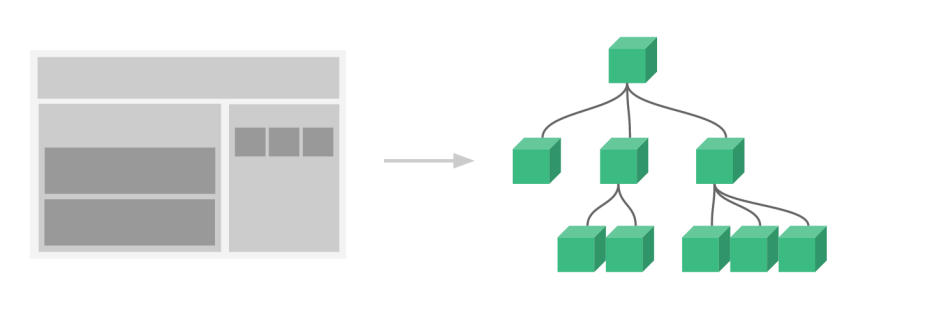
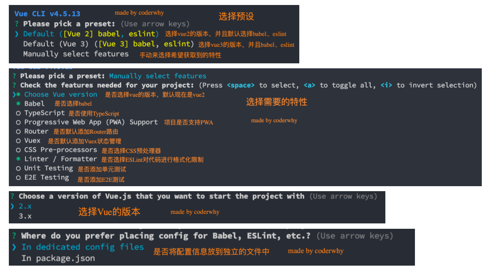
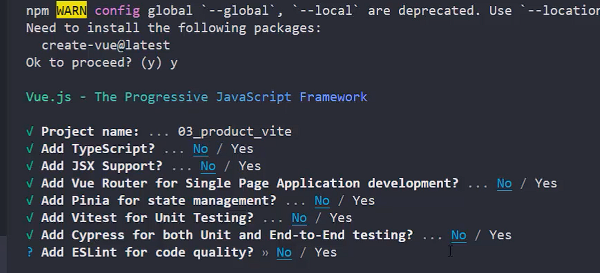
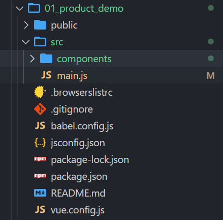
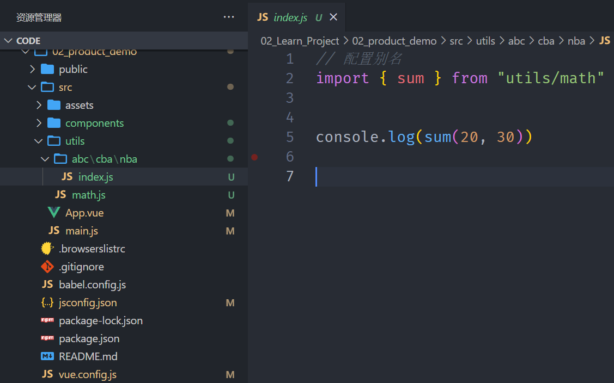
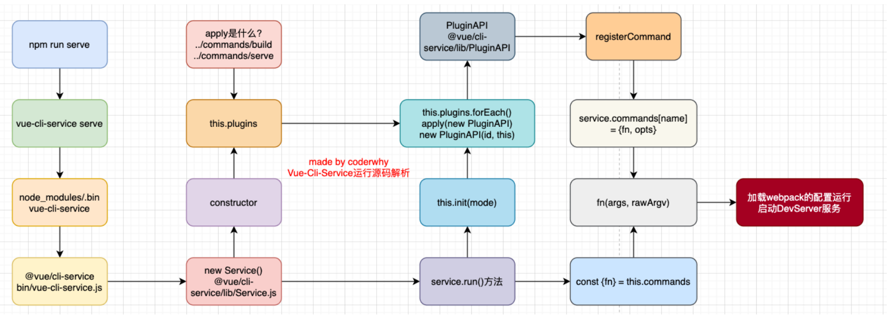

## **组件化开发**

**现在可以说整个的大前端开发都是组件化的天下**，

无论从三大框架（Vue、React、Angular），还是跨平台方案的 Flutter，甚至是移动端都在转向组件化开发，包括小程序的开发也是采用组件化开发的思想。

所以，学习组件化最重要的是它的思想，每个框架或者平台可能实现方法不同，但是思想都是一样的。

**我们需要通过组件化的思想来思考整个应用程序：**

我们将一个完整的页面分成很多个组件；

每个组件都用于实现页面的一个功能块；

而每一个组件又可以进行细分；

而组件本身又可以在多个地方进行复用；

## **Vue 的组件化**

**组件化是 Vue、React、Angular 的核心思想，也是我们后续课程的重点（包括以后实战项目）：**

前面我们的 createApp 函数传入了一个对象 App，这个对象其实本质上就是一个组件，也是我们应用程序的根组件；

```html
<body>
  <div id="app">
    <h2>{{message}}</h2>
  </div>

  <script src="../lib/vue.js"></script>
  <script>
    // 1.组件: App组件(根组件) App对象就是根组件
    const App = {
      data() {
        return {
          message: "Hello Vue",
        };
      },
    };

    // 1.创建app
    const app = Vue.createApp(App);

    // 2.挂载app
    app.mount("#app");
  </script>
</body>
```

组件化提供了一种抽象，让我们可以开发出一个个独立可复用的小组件来构造我们的应用；

任何的应用都会被抽象成一颗组件树；



接下来，我们来学习一下在**Vue 中如何注册一个组件**，以及之后**如何使用这个注册后的组件**。

## **注册组件的方式**

如果我们现在有一部分**内容（模板、逻辑等）**，我们希望将这部分内容抽取到一个**独立的组件**中去维护，这个时候**如何注册一个**

**组件**呢？

**注册组件分成两种：**

全局组件：在任何其他的组件中都可以使用的组件；

局部组件：只有在注册的组件中才能使用的组件；

## **注册全局组件**

**我们先来学习一下全局组件的注册：**

全局组件需要使用我们全局创建的 app 来注册组件；

通过 component 方法传入组件名称、组件对象即可注册一个全局组件了；

之后，我们可以在 App 组件的 template 中直接使用这个全局组件：

```html
<html lang="en">
  <head>
    <meta charset="UTF-8" />
    <meta http-equiv="X-UA-Compatible" content="IE=edge" />
    <meta name="viewport" content="width=device-width, initial-scale=1.0" />
    <title>Document</title>
    <style>
      .product {
        background-color: orange;
      }
    </style>
  </head>
  <body>
    <div id="app">
      <!-- 1.内容一: -->
      <product-item></product-item>

      <!-- 2.内容二: -->
      <product-item></product-item>

      <!-- 3.内容三: -->
      <product-item></product-item>
    </div>

    <!-- 组件product-item的模板 -->
    <template id="item">
      <div class="product">
        <h2>我是商品</h2>
        <div>商品图片</div>
        <div>商品价格: <span>¥9.9</span></div>
        <p>商品描述信息, 9.9秒杀</p>
      </div>
    </template>

    <script src="../lib/vue.js"></script>
    <script>
      /*
      1.通过app.component(组件名称, 组件的对象)
      2.在App组件的模板中, 可以直接使用product-item的组件
    */

      // 1.组件: App组件(根组件)
      const App = {};

      // 2.创建app
      const app = Vue.createApp(App);

      // 3.注册一个全局组件
      // product-item全局组件

      // app.component("product-item", {
      //   template: `
      //   <div class="product">
      //     <h2>我是商品</h2>
      //     <div>商品图片</div>
      //     <div>商品价格: <span>¥9.9</span></div>
      //     <p>商品描述信息, 9.9秒杀</p>
      //   </div>
      //   `
      // })
      app.component("product-item", {
        template: "#item",
      });

      // 2.挂载app
      app.mount("#app");
    </script>
  </body>
</html>
```

## **全局组件的逻辑**

**当然，我们组件本身也可以有自己的代码逻辑：**

比如自己的 data、computed、methods 等等

```html
<html lang="en">
  <head>
    <meta charset="UTF-8" />
    <meta http-equiv="X-UA-Compatible" content="IE=edge" />
    <meta name="viewport" content="width=device-width, initial-scale=1.0" />
    <title>Document</title>
    <style>
      .product {
        background-color: orange;
      }
    </style>
  </head>
  <body>
    <div id="app">
      <!-- <home-nav></home-nav> -->
      <HomeNav></HomeNav>
      <home-nav></home-nav>

      <product-item></product-item>
      <product-item></product-item>
      <product-item></product-item>
    </div>

    <template id="nav">
      <h2>我是应用程序的导航</h2>
    </template>

    <template id="product">
      <div class="product">
        <h2>{{title}}</h2>
        <p>商品描述, 限时折扣, 赶紧抢购</p>
        <p>价格: {{price}}</p>
        <button @click="favarItem">收藏</button>
      </div>
    </template>

    <script src="../lib/vue.js"></script>
    <script>
      // 1.创建app
      const app = Vue.createApp({
        // data: option api
        data() {
          return {
            message: "Hello Vue",
          };
        },
      });

      // 2.注册全局组件
      app.component("product-item", {
        template: "#product",
        data() {
          return {
            title: "我是商品Item",
            price: 9.9,
          };
        },
        methods: {
          favarItem() {
            console.log("收藏了当前的item");
          },
        },
      });

      app.component("HomeNav", {
        template: "#nav",
      });

      // 2.挂载app
      app.mount("#app");
    </script>
  </body>
</html>
```

## **组件的名称**

**在通过 app.component 注册一个组件的时候，第一个参数是组件的名称，定义组件名的方式有两种：**

**方式一：使用 kebab-case（短横线分割符）**

当使用 kebab-case (短横线分隔命名) 定义一个组件时，你也必须在引用这个自定义元素时使用 kebab-case，例如 <my

component-name>；

**方式二：使用 PascalCase（驼峰标识符）**

当使用 PascalCase (首字母大写命名) 定义一个组件时，你在引用这个自定义元素时两种命名法都可以使用。

也就是说 `<my-component-name>` 和 `<MyComponentName>` 都是可接受的；

```html
<html lang="en">
  <head>
    <meta charset="UTF-8" />
    <meta http-equiv="X-UA-Compatible" content="IE=edge" />
    <meta name="viewport" content="width=device-width, initial-scale=1.0" />
    <title>Document</title>
    <style>
      .product {
        background-color: orange;
      }
    </style>
  </head>
  <body>
    <div id="app">
      <!-- <home-nav></home-nav> -->
      <HomeNav></HomeNav> // 这种写法在html中不生效，但是在.vue文件中生效
      <home-nav></home-nav>

      <product-item></product-item>
      <product-item></product-item>
      <product-item></product-item>
    </div>

    <template id="nav">
      <div>---------------------nav start ------------------------</div>
      <h2>我是应用程序的导航</h2>
      <product-item></product-item>
      <div>---------------------nav end ------------------------</div>
    </template>

    <template id="product">
      <div class="product">
        <h2>{{title}}</h2>
        <p>商品描述, 限时折扣, 赶紧抢购</p>
        <p>价格: {{price}}</p>
        <button @click="favarItem">收藏</button>
      </div>
    </template>

    <script src="../lib/vue.js"></script>
    <script>
      // 1.创建app
      const app = Vue.createApp({
        // data: option api
        data() {
          return {
            message: "Hello Vue",
          };
        },
      });

      // 2.注册全局组件
      // 全局组件的特点: 一旦注册成功后, 可以在任意其他组件的template中使用
      app.component("product-item", {
        template: "#product",
        data() {
          return {
            title: "我是商品Item",
            price: 9.9,
          };
        },
        methods: {
          favarItem() {
            console.log("收藏了当前的item");
          },
        },
      });

      app.component("HomeNav", {
        template: "#nav",
      });

      // 2.挂载app
      app.mount("#app");
    </script>
  </body>
</html>
```

## **注册局部组件**

全局组件往往是在应用程序一开始就会**全局组件**完成，那么就意味着如果**某些组件我们并没有用到**，**也会一起被注册：**

比如我们注册了三个全局组件：ComponentA、ComponentB、ComponentC；

在开发中我们只使用了 ComponentA、ComponentB，如果 ComponentC 没有用到但是我们依然在全局进行了注册，那么

就意味着类似于 webpack 这种打包工具在打包我们的项目时，我们依然会对其进行打包；

这样最终打包出的 JavaScript 包就会有关于 ComponentC 的内容，用户在下载对应的 JavaScript 时也会增加包的大小；

**所以在开发中我们通常使用组件的时候采用的都是局部注册：**

局部注册是在我们需要使用到的组件中，通过 components 属性选项来进行注册；

比如之前的 App 组件中，我们有 data、computed、methods 等选项了，事实上还可以有一个 components 选项；

该 components 选项对应的是一个对象，对象中的键值对是 组件的名称: 组件对象；

```html
<html lang="en">
  <head>
    <meta charset="UTF-8" />
    <meta http-equiv="X-UA-Compatible" content="IE=edge" />
    <meta name="viewport" content="width=device-width, initial-scale=1.0" />
    <title>Document</title>
    <style>
      .product {
        background-color: orange;
      }
    </style>
  </head>
  <body>
    <div id="app">
      <home-nav></home-nav>

      <product-item></product-item>
      <product-item></product-item>
      <product-item></product-item>
    </div>

    <template id="product">
      <div class="product">
        <h2>{{title}}</h2>
        <p>商品描述, 限时折扣, 赶紧抢购</p>
        <p>价格: {{price}}</p>
        <button>收藏</button>
      </div>
    </template>

    <template id="nav">
      <div>-------------------- nav start ---------------</div>
      <h1>我是home-nav的组件</h1>
      <product-item></product-item>
      <div>-------------------- nav end ---------------</div>
    </template>

    <script src="../lib/vue.js"></script>
    <script>
      // 1.创建app
      const ProductItem = {
        template: "#product",
        data() {
          return {
            title: "我是product的title",
            price: 9.9,
          };
        },
      };

      // 1.1.组件打算在哪里被使用
      const app = Vue.createApp({
        // components: option api
        components: {
          ProductItem,
          HomeNav: {
            template: "#nav",
            components: {
              ProductItem,
            },
          },
        },
        // data: option api
        data() {
          return {
            message: "Hello Vue",
          };
        },
      });

      // 2.挂载app
      app.mount("#app");
    </script>
  </body>
</html>
```

## **Vue 的开发模式**

目前我们使用 vue 的过程都是**在 html 文件中**，通过 template 编写自己的模板、脚本逻辑、样式等。

**但是随着项目越来越复杂，我们会采用组件化的方式来进行开发：**

这就意味着每个组件都会有自己的模板、脚本逻辑、样式等；

当然我们依然可以把它们抽离到单独的 js、css 文件中，但是它们还是会分离开来；

也包括我们的 script 是在一个全局的作用域下，很容易出现命名冲突的问题；

并且我们的代码为了适配一些浏览器，必须使用 ES5 的语法；

在我们编写代码完成之后，依然需要通过工具对代码进行构建、优化；

**所以在真实开发中，我们可以通过一个后缀名为 .vue 的 single-file components (单文件组件)解决，并且可以使用**

**webpack 或者 vite 或者 rollup 等构建工具来对其进行处理。**

## **单文件的特点**

**在这个组件中我们可以获得非常多的特性：**

代码的高亮；

ES6、CommonJS 的模块化能力；

组件作用域的 CSS；

可以使用预处理器来构建更加丰富的组件，比如

TypeScript、Babel、Less、Sass 等；

## **如何支持 SFC**

如果我们想要使用这一的 SFC 的.vue 文件，比较**常见的是两种方式**：

方式一：使用 Vue CLI 来创建项目，项目会默认帮助我们配置好所有的配置选项，可以在其中直接使用.vue 文件；

方式二：自己使用 webpack 或 rollup 或 vite 这类打包工具，对其进行打包处理；

**我们最终，无论是后期我们做项目，还是在公司进行开发，通常都会采用 Vue CLI 的方式来完成。**

## **VSCode 对 SFC 文件的支持**

**在前面我们提到过，真实开发中多数情况下我们都是使用 SFC（** **single-file components (单文件组件)** **）。**

**我们先说一下 VSCode 对 SFC 的支持：**

插件一：Vetur，从 Vue2 开发就一直在使用的 VSCode 支持 Vue 的插件；

插件二：Volar，官方推荐的插件；

## **Vue CLI 脚手架**

**什么是 Vue 脚手架？**

我们前面学习了如何通过 webpack 配置 Vue 的开发环境，但是在真实开发中我们不可能每一个项目从头来完成所有的

webpack 配置，这样显示开发的效率会大大的降低；

所以在真实开发中，我们通常会使用脚手架来创建一个项目，Vue 的项目我们使用的就是 Vue 的脚手架；

脚手架其实是建筑工程中的一个概念，在我们软件工程中也会将一些帮助我们搭建项目的工具称之为脚手架；

**Vue 的脚手架就是 Vue CLI：**

CLI 是 Command-Line Interface, 翻译为命令行界面；

我们可以通过 CLI 选择项目的配置和创建出我们的项目；

Vue CLI 已经内置了 webpack 相关的配置，我们不需要从零来配置；

## **Vue CLI 安装和使用**

**安装 Vue CLI（目前最新的版本是 v5.0.8）**

我们是进行全局安装，这样在任何时候都可以通过 vue 的命令来创建项目；

```javascript
npm install @vue/cli -g
```

**升级 Vue CLI：**

如果是比较旧的版本，可以通过下面的命令来升级

```javascript
npm update @vue/cli -g
```

**通过 Vue 的命令来创建项目**

```javascript
vue create 项目的名称
```

## Vue 创建项目的方式一：vue create

使用 vue create 创建出来的项目使用的打包工具是 webpack



## Vue 创建项目的方式二：vite 工具

执行下面的命令

```javascript
npm init vue@latest
```

执行上面这个命令会做两件事情

1.安装一个本地工具 create-vue

2.使用 create-vue 创建一个 vue 的项目

上面这种方式创建出来的项目，底层是基于 vite 进行打包



## **项目的目录结构**



到目前为止，创建出来的项目有 2 个文件我们是不认识的，一个是.browserslistrc，另外一个是 jsconfig.json，

.browserslistrc 是用来设置目标浏览器，jsconfig.json 是给 vscode 用的，可以给我们更好的代码提示。

src/main.js

```javascript
import { createApp } from "vue/dist/vue.esm-bundler"; // 这里要使用这个库来解析template模板

const App = {
  template: `<h2>{{title}}</h2>`,
  data() {
    return {
      title: "我也是标题",
    };
  },
};

const app = createApp(App);

app.mount("#app");
```

上面这种写法又回到了之前的 html 中的写法

那么我们可以使用.vue 文件，进行分离

src/main.js

```javascript
import { createApp } from "vue/dist/vue.esm-bundler";

import App from "./components/App.vue"; // 这里引入
import ProductItem from "./components/ProductItem.vue";

const app = createApp(App);

// 全局注册
app.component("product-item", ProductItem);

app.mount("#app");
```

components/App.vue

```vue
<template>
  <h2>{{ title }}</h2>
  <h2>当前计数: {{ counter }}</h2>
  <button @click="increment">+1</button>
  <button @click="decrement">-1</button>

  <product-item></product-item>
</template>

<script>
import ProductItem from "./ProductItem.vue";

export default {
  // 这里要导出对象，因为在main.js中导入了，一个组件就是一个对象
  components: {
    ProductItem, // 局部注册，先导入，再注册，然后在template中即可使用
  },
  data() {
    return {
      title: "我还是标题",
      counter: 0,
    };
  },
  methods: {
    increment() {
      this.counter++;
    },
    decrement() {
      this.counter--;
    },
  },
};
</script>

<style>
h2 {
  color: red;
}
</style>
```

components/ProductItem.vue

```vue
<template>
  <div class="product">
    <h2>我是商品标题</h2>
    <p>我是商品描述, 9.9秒杀</p>
    <div>价格: {{ price }}</div>
  </div>
</template>

<script>
export default {
  data() {
    return {
      price: 9.9,
    };
  },
};
</script>

<style></style>
```

## jsconfig.json 文件的作用

作用：给 VSCode 来进行读取, VSCode 在读取到其中的内容时, 给我们的代码更加友好的提示

开发中最常用的其中一个就是工具函数 utils，项目一复杂层级就会比较深，其他 js 文件进行引用的时候路径不太好找

比如 src/utils/math.js 路径下有个工具函数想在 src/utils/abc/cba/nba/index.js 中使用，如果没有配置别名需要根据相对路径进行查找，不太方便，那么可以进行别名的配置。

如何配置？

在 vue.config.js 文件中进行配置，增加一个 configureWebpack 属性，里面配置和之前学的 webpack 一样

```javascript
const { defineConfig } = require("@vue/cli-service");
module.exports = defineConfig({
  transpileDependencies: true,
  configureWebpack: {
    resolve: {
      // 配置路径别名
      // @是已经配置好的路径别名: 对应的是src路径
      alias: {
        utils: "@/utils",
      },
    },
  },
});
```

配置好之后就可以在 index.js 文件使用了，引入的时候就可以下面这样写



但是，到这里会发现没有代码提示，需要自己手动敲 utils/math，这个时候 jsconfig.json 就派上用场了

```json
{
  "compilerOptions": {
    "target": "es5", // 最终打包出来ES5代码
    "module": "esnext", // 使用ES模块化规范
    "baseUrl": "./", // 这样配置，src是相对于当前目录的src
    "moduleResolution": "node", // 模块查找规则根据node进行查找
    "paths": {
      "@/*": ["src/*"],
      // 增加utils的路径配置，引入的时候vscode会有代码提示
      "utils/*": ["src/utils/*"]
    },
    "lib": [
      // 使用下面这些库会有的对应代码提示
      "esnext",
      "dom",
      "dom.iterable",
      "scripthost"
    ]
  }
}
```

上面配置完 utils 的路径之后，vscode 就会有代码提示

## Vue 不同版本对 template 的处理

在 src/main.js 中我们有两种方式编写 Vue 的代码，

第一种：不使用.vue 文件

```javascript
import { createApp } from "vue/dist/vue.esm-bundler"; // compile代码

const App = {
  template: `<h2>Hello Vue3 App</h2>`,
  data() {
    return {};
  },
};

createApp(App).mount("#app");
```

第二种：使用.vue 文件

```javascript
import { createApp } from "vue"; // 不支持template选项

import App from "./App.vue";
createApp(App).mount("#app");
```

但是不管使用哪种方式，要将我们编写的代码交给浏览器解析并最终渲染都需要经过下面的过程

DOM 元素，比如 div 元素，经过 compile 编译转换成 createVNode 函数，再调用 createVNode 函数就会变成 vnode，一个个 vnode 就会组成虚拟 DOM，再将虚拟 DOM 转换成真实的 DOM

我们了解了整个过程，就知道为什么不同版本（这里不同版本指的是上面两种不同的写法）的 Vue 引入不同的库了

将模板转换成 createVNode 函数都需要经过 compile 编译，默认是 vue 的源码来完成，使用第一种方法，因为 vue 中的源码，没有进行 compile 编译，所以需要指定使用 vue/dist/vue.esm-bundler 进行 compile 编译；而第二种方法使用了 vue-loader，它所做的事情就包含了将模板转换成 createVNode 函数

## Vue 文件 style 自己的作用域

```vue
<template>
  <div class="app">
    <h2 class="title">我是App.vue中的h2元素</h2>

    <!-- AppHeader -->
    <AppHeader></AppHeader>
  </div>
</template>

<script>
import AppHeader from "./components/AppHeader";

export default {
  name: "App",
  components: {
    AppHeader,
  },
};
</script>
// 加scoped就会形成作用域，只在当前.vue文件中生效
<style scoped>
.title {
  color: red;
}
</style>
```

## **Vue CLI 的运行原理**


