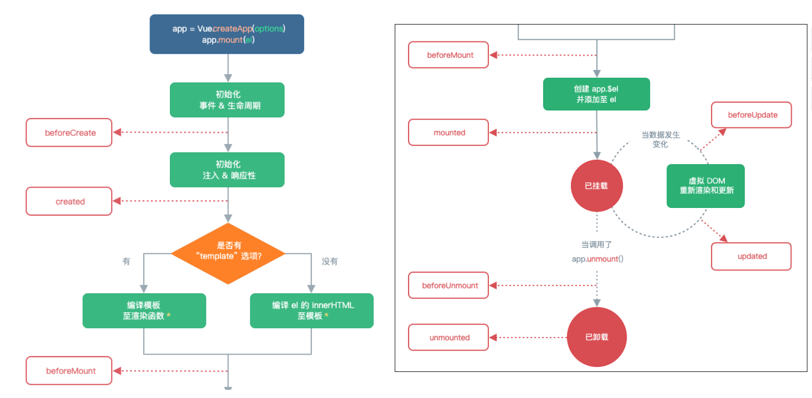
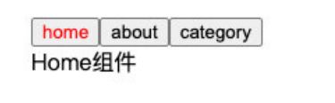
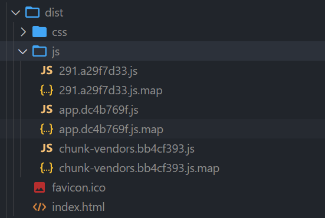
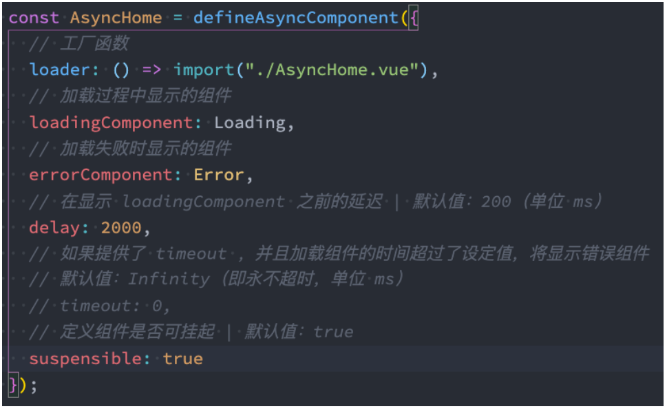
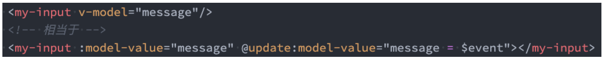
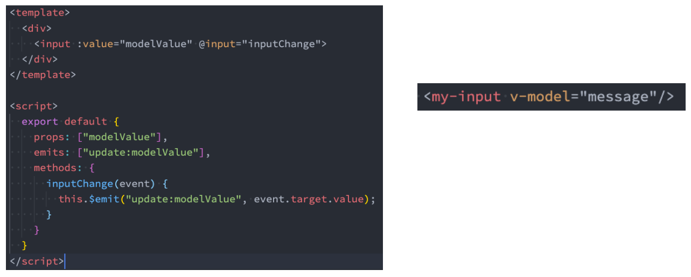

## **认识生命周期**

**什么是生命周期呢？**

生物学上，生物生命周期指得是一个生物体在生命开始到结束周而复始所历经的一系列变化过程；

每个组件都可能会经历从创建、挂载、更新、卸载等一系列的过程；

在这个过程中的某一个阶段，我们可能会想要添加一些属于自己的代码逻辑（比如组件创建完后就请求一些服务器数据）；

但是我们如何可以知道目前组件正在哪一个过程呢？Vue 给我们提供了组件的生命周期函数；

**生命周期函数：**

生命周期函数是一些钩子函数（回调函数），在某个时间会被 Vue 源码内部进行回调；

通过对生命周期函数的回调，我们可以知道目前组件正在经历什么阶段；

那么我们就可以在该生命周期中编写属于自己的逻辑代码了；

## **生命周期的流程**



## 生命周期的过程分析

App/Home/Banner/ShowMessage

beforeCreate

1、创建组件实例

created(重要：1、发送网络请求 2、事件监听 3、this.$watch)

2、template 模板编译

beforeMount

3、挂载到虚拟 DOM -虚拟 DOM => 真实 DOM =>界面看到 h2/div

mounted（重要：元素已经被挂载，获取 DOM，使用 DOM）

4、数据更新：message 改变

beforeUpdate

根据最新数据生成的 VNode，生成新的虚拟 DOM=>真实的 DOM

updated

5、不再使用 v-if="false"

beforeUnmount

将之前挂载在虚拟 DOM 中 VNode 从虚拟 DOM 移除

unmounted（相对重要：回收操作（取消事件监听））

将组件实例销毁掉

## 生命周期演练

App.vue

```javascript
<template>
  <h2>message: {{message}}-{{counter}}</h2>
  <button @click="message = 'Hello World'">修改message</button>
  <button @click="counter++">+1</button>

  <div>
    <button @click="isShowHome = !isShowHome">显示Home</button>
    <home v-if="isShowHome"></home>
  </div>
</template>

<script>
  import Home from "./Home.vue"

  export default {
    components: {
      Home
    },
    data() {
      return {
        message: "Hello App",
        counter: 0,
        isShowHome: true
      }
    },
    // 1.组件被创建之前
    beforeCreate() {
      console.log("beforeCreate")
    },
    // 2.组件被创建完成
    created() {
      console.log("created")
      console.log("1.发送网络请求, 请求数据")
      console.log("2.监听eventbus事件")
      console.log("3.监听watch数据")
    },
    // 3.组件template准备被挂载
    beforeMount() {
      console.log("beforeMount")
    },
    // 4.组件template被挂载: 虚拟DOM -> 真实DOM
    mounted() {
      console.log("mounted")
      console.log("1.获取DOM")
      console.log("2.使用DOM")
    },
    // 5.数据发生改变
    // 5.1. 准备更新DOM
    beforeUpdate() {
      console.log("beforeUpdate")
    },
    // 5.2. 更新DOM
    updated() {
      console.log("updated")
    },

    // 6.卸载VNode -> DOM元素
    // 6.1.卸载之前
    beforeUnmount() {
      console.log("beforeUnmount")
    },
    // 6.2.DOM元素被卸载完成
    unmounted() {
      console.log("unmounted")
    }
  }
</script>

<style scoped>
</style>
```

Home.vue

```javascript
<template>
  <h2>Home</h2>
</template>

<script>
  export default {
	// 点击显示Home按钮会触发这2个生命周期
    beforeUnmount() {
      console.log("home beforeUnmount")
    },
    unmounted() {
      console.log("home unmounted")
    }
  }
</script>

<style scoped>
</style>
```

## **$refs 的使用**

某些情况下，我们在组件中想要**直接获取到元素对象或者子组件实例**：

在 Vue 开发中我们是不推荐进行原生 DOM 操作的；

这个时候，我们可以给元素或者组件绑定一个 ref 的 attribute 属性；

**组件实例有一个$refs 属性：**

它一个对象 Object，持有注册过 ref attribute 的所有 DOM 元素和组件实例。

## **$parent和$root**

**我们可以通过$parent 来访问父元素。**

通过$root 来访问根组件，即 App.vue

注意：在 Vue3 中已经**移除了$children 的属性**，所以不可以使用了。

App.vue

```javascript
<template>
  <div class="app">
    <h2 ref="title" class="title" :style="{ color: titleColor }">{{ message }}</h2>
    <button ref="btn" @click="changeTitle">修改title</button>

    <banner ref="banner"/>
  </div>
</template>

<script>
  import Banner from "./Banner.vue"

  export default {
    components: {
      Banner
    },
    data() {
      return {
        message: "Hello World",
        titleColor: "red"
      }
    },
    methods: {
      changeTitle() {
        // 1.不要主动的去获取DOM, 并且修改DOM内容
        // this.message = "你好啊, 李银河!"
        // this.titleColor = "blue"

        // 2.获取h2/button元素
        console.log(this.$refs.title)
        console.log(this.$refs.btn)

        // 3.获取banner组件: 组件实例
        console.log(this.$refs.banner)

        // 3.1.在父组件中可以主动的调用子组件的对象方法
        this.$refs.banner.bannerClick()

        // 3.2.获取banner组件实例, 获取banner中的元素
        console.log(this.$refs.banner.$el) // 如果banner只有一个根节点，那么可以通过$el获取banner组件的根

        // 3.3.如果banner template是多个根, 拿到的是第一个node节点
        // 注意: 开发中不推荐一个组件的template中有多个根元素
        // console.log(this.$refs.banner.$el.nextElementSibling)

        // 4.组件实例还有两个属性(了解):
        console.log(this.$parent) // 获取父组件 null，App.vue的父组件是null
        console.log(this.$root) // 获取根组件 自己，因为当前是App.vue
      }
    }
  }
</script>

<style scoped>
</style>
```

Banner.vue

```javascript
<template>
  <div class="banner">
    <h2>Banner</h2>
  </div>
</template>

<script>
  export default {
    created() {

    },
    methods: {
      bannerClick() {
        console.log("bannerClick")
      }
    }
  }
</script>

<style scoped>
</style>
```

## **切换组件案例**

**比如我们现在想要实现了一个功能：**

点击一个 tab-bar，切换不同的组件显示；



这个案例我们可以通过两种不同的实现思路来实现：

方式一：通过 v-if 来判断，显示不同的组件；

方式二：动态组件的方式；

## **v-if 显示不同的组件**

**我们可以先通过 v-if 来判断显示不同的组件，这个可以使用我们之前讲过的知识来实现：**

App.vue

```javascript
<template>
  <div class="app">
    <div class="tabs">
      <template v-for="(item, index) in tabs" :key="item">
        <button :class="{ active: currentIndex === index }"
                @click="itemClick(index)">
          {{ item }}
        </button>
      </template>
    </div>
    <div class="view">
      <!-- 1.第一种做法: v-if进行判断逻辑, 决定要显示哪一个组件 -->
      <template v-if="currentIndex === 0">
        <home></home>
      </template>
      <template v-else-if="currentIndex === 1">
        <about></about>
      </template>
      <template v-else-if="currentIndex === 2">
        <category></category>
      </template>

    </div>
  </div>
</template>

<script>
  import Home from './views/Home.vue'
  import About from './views/About.vue'
  import Category from './views/Category.vue'

  export default {
    components: {
      Home,
      About,
      Category
    },
    data() {
      return {
        tabs: ["home", "about", "category"],
        currentIndex: 0
      }
    },
    methods: {
      itemClick(tab) {
        this.currentIndex = index
      },
    }
  }
</script>

<style scoped>
  .active {
    color: red;
  }
</style>
```

views/About.vue

```javascript
<template>
  <div>
    <h2>About组件</h2>
  </div>
</template>

<script>
  export default {

  }
</script>

<style scoped>
</style>
```

views/Category.vue

```javascript
<template>
  <div>
    <h2>Category组件</h2>
  </div>
</template>

<script>
  export default {

  }
</script>

<style scoped>
</style>
```

views/Home.vue

```javascript
<template>
  <div>
    <h2>Category组件</h2>
  </div>
</template>

<script>
  export default {

  }
</script>

<style scoped>
</style>
```

## **动态组件的实现**

**动态组件是使用 component 组件，通过一个特殊的 attribute is 来实现：**

```javascript
<template>
  <div class="app">
    <div class="tabs">
      <template v-for="(item, index) in tabs" :key="item">
        <button :class="{ active: currentTab === item }"
                @click="itemClick(item)">
          {{ item }}
        </button>
      </template>
    </div>
    <div class="view">
      <!-- 1.第一种做法: v-if进行判断逻辑, 决定要显示哪一个组件 -->
      <!-- <template v-if="currentIndex === 0">
        <home></home>
      </template>
      <template v-else-if="currentIndex === 1">
        <about></about>
      </template>
      <template v-else-if="currentIndex === 2">
        <category></category>
      </template> -->

      <!-- 2.第二种做法: 动态组件 component -->
      <!-- is中的组件需要来自两个地方: 1.全局注册的组件 2.局部注册的组件 -->
      <!-- <component :is="tabs[currentIndex]"></component> -->
      <component :is="currentTab">
      </component>
    </div>
  </div>
</template>

<script>
  import Home from './views/Home.vue'
  import About from './views/About.vue'
  import Category from './views/Category.vue'

  export default {
    components: {
      Home,
      About,
      Category
    },
    data() {
      return {
        tabs: ["home", "about", "category"],
        // currentIndex: 0
        currentTab: "home"
      }
    },
    methods: {
      itemClick(tab) {
        this.currentTab = tab
      },
    }
  }
</script>

<style scoped>
  .active {
    color: red;
  }
</style>
```

**这个 currentTab 的值需要是什么内容呢？**

全局注册：可以是通过 component 函数注册的组件；

布局注册：在一个组件对象的 components 对象中注册的组件；

## **动态组件的传值**

**如果是动态组件我们可以给它们传值和监听事件吗？**

也是一样的；

只是我们需要将属性和监听事件放到 component 上来使用；

App.vue

```javascript
<template>
  <div class="app">
    <div class="tabs">
      <template v-for="(item, index) in tabs" :key="item">
        <button :class="{ active: currentTab === item }"
                @click="itemClick(item)">
          {{ item }}
        </button>
      </template>
    </div>
    <div class="view">
      <!-- 1.第一种做法: v-if进行判断逻辑, 决定要显示哪一个组件 -->
      <!-- <template v-if="currentIndex === 0">
        <home></home>
      </template>
      <template v-else-if="currentIndex === 1">
        <about></about>
      </template>
      <template v-else-if="currentIndex === 2">
        <category></category>
      </template> -->

      <!-- 2.第二种做法: 动态组件 component -->
      <!-- is中的组件需要来自两个地方: 1.全局注册的组件 2.局部注册的组件 -->
      <!-- <component :is="tabs[currentIndex]"></component> -->

      <component name="why"
                 :age="18"
                 @homeClick="homeClick"
                 :is="currentTab">
      </component>
    </div>
  </div>
</template>

<script>
  import Home from './views/Home.vue'
  import About from './views/About.vue'
  import Category from './views/Category.vue'

  export default {
    components: {
      Home,
      About,
      Category
    },
    data() {
      return {
        tabs: ["home", "about", "category"],
        // currentIndex: 0
        currentTab: "home"
      }
    },
    methods: {
      itemClick(tab) {
        this.currentTab = tab
      },
      homeClick(payload) {
        console.log("homeClick:", payload)
      }
    }
  }
</script>

<style scoped>
  .active {
    color: red;
  }
</style>
```

Home.vue

```javascript
<template>
  <div>
    <h2>Home组件: {{ name }} - {{ age }}</h2>
    <button @click="homeBtnClick">homeBtn</button>
  </div>
</template>

<script>
  export default {
    props: {
      name: {
        type: String,
        default: ""
      },
      age: {
        type: Number,
        default: 0
      }
    },
    emits: ["homeClick"],
    methods: {
      homeBtnClick() {
        this.$emit("homeClick", "home")
      }
    }
  }
</script>

<style scoped>
</style>
```

## **认识 keep-alive**

**我们先对之前的案例中 Home 组件进行改造：**

在其中增加了一个按钮，点击可以递增的功能；

比如我们将 counter 点到 10，那么在切换到 about 再切换回来 home 时，**状态是否可以保持呢？**

答案是否定的；

这是因为默认情况下，我们在切换组件后，home 组件会被销毁掉，再次回来时会重新创建组件；

但是，在开发中某些情况我们希望继续保持组件的状态，而不是销毁掉，这个时候我们就可以**使用一个内置组件：keep-alive**。

## **keep-alive 属性**

**keep-alive 有一些属性：**

include - string | RegExp | Array。只有名称匹配的组件会被缓存；

exclude - string | RegExp | Array。任何名称匹配的组件都不会被缓存；

max - number | string。最多可以缓存多少组件实例，一旦达到这个数字，那么缓存组件中最近没有被访问的实例会被销毁；

**include 和 exclude prop 允许组件有条件地缓存：**

二者都可以用逗号分隔字符串、正则表达式或一个数组来表示；

匹配首先检查组件自身的 name 选项；

## **缓存组件的生命周期**

对于缓存的组件来说，再次进入时，我们是**不会执行 created 或者 mounted 等生命周期函数**的：

但是有时候我们确实希望监听到何时重新进入到了组件，何时离开了组件；

这个时候我们可以使用 activated 和 deactivated 这两个生命周期钩子函数来监听；

App.vue

```javascript
<template>
  <div class="app">
    <div class="tabs">
      <template v-for="(item, index) in tabs" :key="item">
        <button :class="{ active: currentTab === item }"
                @click="itemClick(item)">
          {{ item }}
        </button>
      </template>
    </div>
    <div class="view">
      <!-- include: 组件的名称来自于组件定义时name选项  -->
      <keep-alive include="home,about">
        <component :is="currentTab"></component>
      </keep-alive>
    </div>
  </div>
</template>

<script>
  import Home from './views/Home.vue'
  import About from './views/About.vue'
  import Category from './views/Category.vue'

  export default {
    components: {
      Home,
      About,
      Category
    },
    data() {
      return {
        tabs: ["home", "about", "category"],
        // currentIndex: 0
        currentTab: "home"
      }
    },
    methods: {
      itemClick(tab) {
        this.currentTab = tab
      },
      homeClick(payload) {
        console.log("homeClick:", payload)
      }
    }
  }
</script>

<style scoped>
  .active {
    color: red;
  }
</style>
```

views/Home.vue

```javascript
<template>
  <div>
    <h2>Home组件</h2>
    <h2>当前计数: {{ counter }}</h2>
    <button @click="counter++">+1</button>
  </div>
</template>

<script>
  export default {
    name: "home", // keep-alive的include或exclude的name来自于这里
    data() {
      return {
        counter: 0
      }
    },
    // 没有使用keep-alive缓存的组件，切换到home组件会执行created，离开home组件会执行unmounted
    created() {
      console.log("home created")
    },
    unmounted() {
      console.log("home unmounted")
    },
    // 对于保持keep-alive组件, 监听有没有进行切换
    // keep-alive组件进入活跃状态
    activated() {
      console.log("home activated")
    },
    deactivated() {
      console.log("home deactivated")
    }
  }
</script>

<style scoped>
</style>
```

views/About.vue

```javascript
<template>
  <div>
    <h2>About组件</h2>
  </div>
</template>

<script>
  export default {
    name: "about",
    unmounted() {
      console.log("about unmounted")
    }
  }
</script>

<style scoped>
</style>
```

views/Category.vue

```javascript
<template>
  <div>
    <h2>Category组件</h2>
  </div>
</template>

<script>
  export default {
    unmounted() {
      console.log("category unmounted")
    }
  }
</script>

<style scoped>
</style>
```

## **Webpack 的代码分包**

**默认的打包过程：**

默认情况下，在构建整个组件树的过程中，因为组件和组件之间是通过模块化直接依赖的，那么 webpack 在打包时就会将组

件模块打包到一起（比如一个 app.js 文件中）；

这个时候随着项目的不断庞大，app.js 文件的内容过大，会造成首屏的渲染速度变慢；

**打包时，代码的分包：**

所以，对于一些不需要立即使用的组件，我们可以单独对它们进行拆分，拆分成一些小的代码块 chunk.js；

这些 chunk.js 会在需要时从服务器加载下来，并且运行代码，显示对应的内容；

**那么 webpack 中如何可以对代码进行分包呢？**

main.js

```javascript
// import函数可以让webpack对导入文件进行分包处理
import("./utils/math").then((res) => {
  res.sum(20, 30);
});
```



执行 npm run build 打包，.map 文件是 sourcemap 后面再讲，chunk-vendors 是第三方库比如 vue 框架源码，app.js 是自己编写的页面代码，291 是 utils/math.js，进行分包处理后才有的。

## **Vue 中实现异步组件**

如果我们的项目过大了，对于**某些组件**我们希望**通过异步的方式来进行加载**（目的是可以对其进行分包处理），那么 Vue 中给我

们提供了一个函数：**defineAsyncComponent**。

**defineAsyncComponent 接受两种类型的参数：**

类型一：工厂函数，该工厂函数需要返回一个 Promise 对象；

类型二：接受一个对象类型，对异步函数进行配置；

**工厂函数类型一的写法：**

App.vue

```javascript
<script>
  import { defineAsyncComponent } from 'vue'

  import Home from './views/Home.vue'
  import About from './views/About.vue'
  // import Category from './views/Category.vue'
  // const Category = import("./views/Category.vue") // 这是一个Promise对象
  const AsyncCategory = defineAsyncComponent(() => import("./views/Category.vue"))

  export default {
    components: {
      Home,
      About,
      Category: AsyncCategory
    },
    data() {
      return {
        tabs: ["home", "about", "category"],
        // currentIndex: 0
        currentTab: "home"
      }
    },
    methods: {
      itemClick(tab) {
        this.currentTab = tab
      },
      homeClick(payload) {
        console.log("homeClick:", payload)
      }
    }
  }
</script>
```

## **异步组件的写法二（了解）**



## **组件的 v-model**

**前面我们在 input 中可以使用 v-model 来完成双向绑定：**

这个时候往往会非常方便，因为 v-model 默认帮助我们完成了两件事；

v-bind:value 的数据绑定和@input 的事件监听；

如果我们现在**封装了一个组件**，其他地方在使用这个组件时，是否也可以**使用 v-model 来同时完成这两个功能**呢？

也是可以的，vue 也支持在组件上使用 v-model；

**当我们在组件上使用的时候，等价于如下的操作：**

我们会发现和 input 元素不同的只是属性的名称和事件触发的名称而已；



App.vue

```javascript
<template>
  <div class="app">
    <!-- 1.input v-model -->
    <!-- <input v-model="message">
    <input :value="message" @input="message = $event.target.value"> -->

    <!-- 2.组件的v-model: 默认modelValue -->
    <counter v-model="appCounter"></counter>
    <counter :modelValue="appCounter" @update:modelValue="appCounter = $event"></counter>

  </div>
</template>

<script>
  import Counter from './Counter.vue'

  export default {
    components: {
      Counter,
    },
    data() {
      return {
        message: "Hello World",
        appCounter: 100,
      }
    }
  }
</script>

<style scoped>
</style>
```

Counter.vue

```javascript
<template>
  <div>
    <h2>Counter: {{ modelValue }}</h2>
    <button @click="changeCounter">修改counter</button>
  </div>
</template>

<script>
  export default {
    props: {
      modelValue: {
        type: Number,
        default: 0
      }
    },
    emits: ["update:modelValue"],
    methods: {
      changeCounter() {
        this.$emit("update:modelValue", 999)
      }
    }
  }
</script>

<style scoped>
</style>
```

## **组件 v-model 的实现**

**那么，为了我们的 MyInput 组件可以正常的工作，这个组件内的 `<input> `必须：**

将其 value attribute 绑定到一个名叫 modelValue 的 prop 上；

在其 input 事件被触发时，将新的值通过自定义的 update:modelValue 事件抛出；



## **绑定多个属性**

我们现在通过 v-model 是直接绑定了一个属性，如果我们**希望绑定多个属性**呢？

也就是我们希望在一个组件上使用多个 v-model 是否可以实现呢？

我们知道，默认情况下的 v-model 其实是绑定了 modelValue 属性和 @update:modelValue 的事件；

如果我们希望绑定更多，可以给 v-model 传入一个参数，那么这个参数的名称就是我们绑定属性的名称；

**v-model:title 相当于做了两件事：**

绑定了 title 属性；

监听了 @update:title 的事件；

App.vue

```javascript
<template>
  <div class="app">
    <!-- 1.input v-model -->
    <!-- <input v-model="message">
    <input :value="message" @input="message = $event.target.value"> -->

    <!-- 2.组件的v-model: 默认modelValue -->
    <counter v-model="appCounter"></counter>
    <counter :modelValue="appCounter" @update:modelValue="appCounter = $event"></counter>

    <!-- 3.组件的v-model: 自定义名称counter -->
    <counter2 v-model:counter="appCounter" v-model:why="appWhy"></counter2>
  </div>
</template>

<script>
  import Counter from './Counter.vue'
  import Counter2 from './Counter2.vue'

  export default {
    components: {
      Counter,
      Counter2
    },
    data() {
      return {
        message: "Hello World",
        appCounter: 100,
        appWhy: "coderwhy"
      }
    }
  }
</script>

<style scoped>
</style>
```

Counter2.vue

```javascript
<template>
  <div>
    <h2>Counter: {{ counter }}</h2>
    <button @click="changeCounter">修改counter</button>

    <!-- why绑定 -->
    <hr>
    <h2>why: {{ why }}</h2>
    <button @click="changeWhy">修改why的值</button>
  </div>
</template>

<script>
  export default {
    props: {
      counter: {
        type: Number,
        default: 0
      },
      why: {
        type: String,
        default: ""
      }
    },
    emits: ["update:counter", "update:why"],
    methods: {
      changeCounter() {
        this.$emit("update:counter", 999)
      },
      changeWhy() {
        this.$emit("update:why", "kobe")
      }
    }
  }
</script>

<style scoped>
</style>
```

## **认识 Mixin**

目前我们是使用组件化的方式在开发整个 Vue 的应用程序，但是**组件和组件之间有时候会存在相同的代码逻辑**，我们希望对**相同**

**的代码逻辑进行抽取**。

在 Vue2 和 Vue3 中都支持的一种方式就是**使用 Mixin 来完成**：

Mixin 提供了一种非常灵活的方式，来分发 Vue 组件中的可复用功能；

一个 Mixin 对象可以包含任何组件选项；

当组件使用 Mixin 对象时，所有 Mixin 对象的选项将被 混合 进入该组件本身的选项中；

## **Mixin 的基本使用**

App.vue，没什么改变

```javascript
<template>
  <div>
    <home></home>
    <about></about>
    <category></category>
  </div>
</template>

<script>
  import Home from './views/Home.vue'
  import About from './views/About.vue'
  import Category from './views/Category.vue'

  export default {
    components: {
      Home,
      About,
      Category
    }
  }
</script>

<style scoped>
</style>
```

views/Home.vue

```javascript
<template>
  <h2>Home组件</h2>
</template>

<script>
  import messageMixin from '../mixins/message-mixin'

  export default {
    // options api
    components: {

    },
    mixins: [messageMixin],
    data() {
      return {
        homeNames: [ "abc", "cba" ]
      }
    },
    methods: {

    },
    created() {
      console.log("home created")
    }
  }
</script>

<style scoped>
</style>
```

views/About.vue

```javascript
<template>
  <h2>About组件</h2>
</template>

<script>
  import messageMixin from '../mixins/message-mixin'

  export default {
    mixins: [messageMixin]
  }
</script>

<style scoped>
</style>
```

views/Category.vue

```javascript
<template>
  <h2>Category组件</h2>
</template>

<script>
  import messageMixin from '../mixins/message-mixin'

  export default {
    mixins: [messageMixin]
  }
</script>

<style scoped>
</style>
```

## **Mixin 的合并规则**

**如果 Mixin 对象中的选项和组件对象中的选项发生了冲突，那么 Vue 会如何操作呢？**

这里分成不同的情况来进行处理；

**情况一：如果是 data 函数的返回值对象**

返回值对象默认情况下会进行合并；

如果 data 返回值对象的属性发生了冲突，那么会保留组件自身的数据；

**情况二：如何生命周期钩子函数**

生命周期的钩子函数会被合并到数组中，都会被调用；

**情况三：值为对象的选项，例如 methods、components 和 directives，将被合并为同一个对象。**

比如都有 methods 选项，并且都定义了方法，那么它们都会生效；

但是如果对象的 key 相同，那么会取组件对象的键值对；

## **全局混入 Mixin**

**如果组件中的某些选项，是所有的组件都需要拥有的，那么这个时候我们可以使用全局的 mixin：**

全局的 Mixin 可以使用 应用 app 的方法 mixin 来完成注册；

一旦注册，那么全局混入的选项将会影响每一个组件；

math.js

```javascript
import { createApp } from "vue";

const app = createApp(App);
app.mixin({
  created() {
    console.log("mixin created");
  },
});
app.mount("#app");
```
