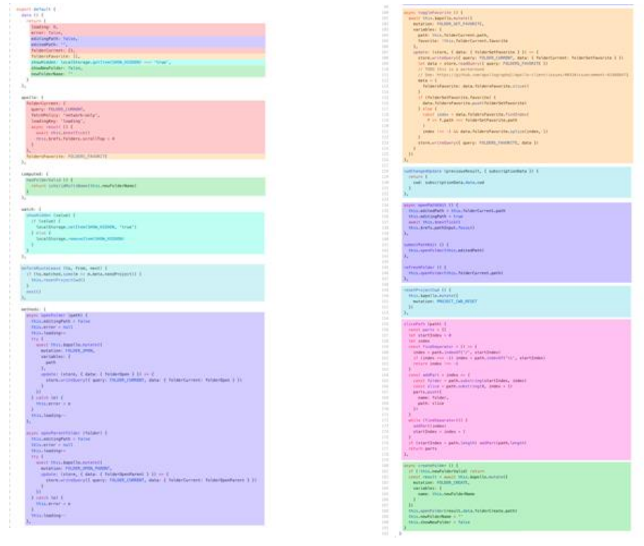
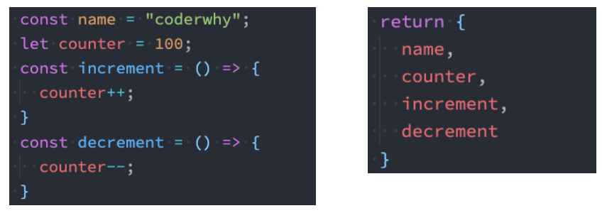
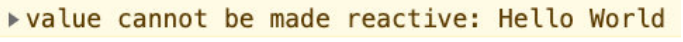
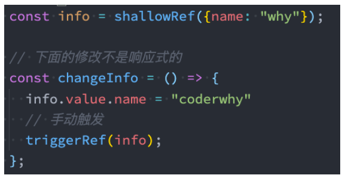
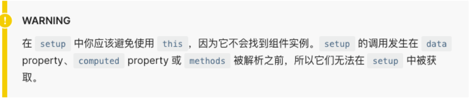

## **Options API 的弊端**

在 Vue2 中，我们**编写组件的方式是 Options API**：

Options API 的一大特点就是在对应的属性中编写对应的功能模块；

比如 data 定义数据、methods 中定义方法、computed 中定义计算属性、watch 中监听属性改变，也包括生命周期钩子；

**但是这种代码有一个很大的弊端：**

当我们实现某一个功能时，这个功能对应的代码逻辑会被拆分到各个属性中；

当我们组件变得更大、更复杂时，逻辑关注点的列表就会增长，那么同一个功能的逻辑就会被拆分的很分散；

尤其对于那些一开始没有编写这些组件的人来说，这个组件的代码是难以阅读和理解的（阅读组件的其他人）；

**下面我们来看一个非常大的组件，其中的逻辑功能按照颜色进行了划分：**

这种碎片化的代码使用理解和维护这个复杂的组件变得异常困难，并且隐藏了潜在的逻辑问题；

并且当我们处理单个逻辑关注点时，需要不断的跳到相应的代码块中；

## **大组件的逻辑分散**



如果我们能将同一个逻辑关注点相关的代码收集在一起会更好。

**这就是 Composition API 想要做的事情，以及可以帮助我们完成的事情。**

也有人把 Vue Composition API 简称为**VCA**。

## **认识 Composition API**

那么既然知道 Composition API 想要帮助我们做什么事情，接下来看一下**到底是怎么做**呢？

为了开始使用 Composition API，我们需要有一个可以实际使用它（编写代码）的地方；

在 Vue 组件中，这个位置就是 setup 函数；

**setup 其实就是组件的另外一个选项：**

只不过这个选项强大到我们可以用它来替代之前所编写的大部分其他选项；

比如 methods、computed、watch、data、生命周期等等；

**接下来我们一起学习这个函数的使用：**

函数的参数

函数的返回值

## **setup 函数的参数**

我们先来研究一个 setup 函数的参数，它主要**有两个参数**：

第一个参数：props
第二个参数：context

props 非常好理解，它其实就是**父组件传递过来的属性**会被**放到 props 对象**中，我们在**setup 中如果需要使用**，那么就可以直接

通过 props 参数获取：

对于定义 props 的类型，我们还是和之前的规则是一样的，在 props 选项中定义；

并且在 template 中依然是可以正常去使用 props 中的属性，比如 message；

如果我们在 setup 函数中想要使用 props，那么不可以通过 this 去获取（后面我会讲到为什么）；

因为 props 有直接作为参数传递到 setup 函数中，所以我们可以直接通过参数来使用即可；

另外一个参数是 context，我们也称之为是一个**SetupContext**，它里面**包含三个属性**：

attrs：所有的非 prop 的 attribute；

slots：父组件传递过来的插槽（这个在以渲染函数返回时会有作用，后面会讲到）；

emit：当我们组件内部需要发出事件时会用到 emit（因为我们不能访问 this，所以不可以通过 this.$emit 发出事件）；

## **setup 函数的返回值**

setup 既然是一个函数，那么它也可以有**返回值**，**它的返回值用来做什么呢？**

setup 的返回值可以在模板 template 中被使用；

也就是说我们可以通过 setup 的返回值来替代 data 选项；

甚至是我们可以**返回一个执行函数**来**代替在 methods 中定义的方法**：



但是，如果我们将 counter 在 increment 或者 decrement 进行操作时，**是否可以实现界面的响应式呢？**

答案是不可以；

这是因为对于一个定义的变量来说，默认情况下，Vue 并不会跟踪它的变化，来引起界面的响应式操作；

## setup 函数的体验

App.vue

```javascript
<template>
  <div class="app">
    <!-- template中ref对象自动解包 -->
    <h2>当前计数: {{ counter }}</h2>
    <button @click="increment">+1</button>
    <button @click="decrement">-1</button>
  </div>
</template>

<script>
import { ref } from 'vue'
import useCounter from './hooks/useCounter'

export default {
  setup() {
    // 1.定义counter的内容
    // 默认定义的数据都不是响应式数据
    // let counter = ref(100)
    // const increment = () => {
    //   counter.value++
    //   console.log(counter.value)
    // }
    // const decrement = () => {
    //   counter.value--
    // }
    // const { counter, increment, decrement } = useCounter()

    return {
      ...useCounter()
    }
  }
}
</script>

<style>
</style>
```

hoosk/useCounter.js

```javascript
import { ref } from "vue";

export default function useCounter() {
  let counter = ref(100);
  const increment = () => {
    counter.value++;
    console.log(counter.value);
  };
  const decrement = () => {
    counter.value--;
  };

  return { counter, increment, decrement };
}
```

## **Reactive API**

如果想为在 setup 中定义的数据提供响应式的特性，那么我们可以**使用 reactive 的函数**：

**那么这是什么原因呢？为什么就可以变成响应式的呢？**

这是因为当我们使用 reactive 函数处理我们的数据之后，数据再次被使用时就会进行依赖收集；

当数据发生改变时，所有收集到的依赖都是进行对应的响应式操作（比如更新界面）；

事实上，我们编写的 data 选项，也是在内部交给了 reactive 函数将其变成响应式对象的；

```javascript
<template>
  <div>
    <h2>message: {{ message }}</h2>
    <button @click="changeMessage">修改message</button>
    <hr>
    <h2>账号: {{ account.username }}</h2>
    <h2>密码: {{ account.password }}</h2>
    <button @click="changeAccount">修改账号</button>
    <hr>
  </div>
</template>

<script>
  import { reactive } from 'vue'

  export default {
    setup() {
      // 1.定义普通的数据: 可以正常的被使用
      // 缺点: 数据不是响应式的
      let message = "Hello World"
      function changeMessage() {
        message = "你好啊,李银河!"
        console.log(message)
      }

      // 2.定义响应式数据
      // 2.1.reactive函数: 定义复杂类型的数据
      const account = reactive({
        username: "coderwhy",
        password: "123456"
      })
      function changeAccount() {
        account.username = "kobe"
      }

      return {
        message,
        changeMessage,
        account,
        changeAccount,
      }
    }
  }
</script>

<style scoped>
</style>
```

## **Ref API**

reactive API 对**传入的类型是有限制的**，它要求我们必须传入的是**一个对象或者数组类型**：

如果我们传入一个基本数据类型（String、Number、Boolean）会报一个警告；



这个时候 Vue3 给我们提供了**另外一个 API：ref API**

ref 会返回一个可变的响应式对象，该对象作为一个 **响应式的引用** 维护着它内部的值，这就是 ref 名称的来源；

它内部的值是在 ref 的 value 属性中被维护的；

**这里有两个注意事项：**

在模板中引入 ref 的值时，Vue 会自动帮助我们进行解包操作，所以我们并不需要在模板中通过 ref.value 的方式来使用；

但是在 setup 函数内部，它依然是一个 ref 引用， 所以对其进行操作时，我们依然需要使用 ref.value 的方式；

## **Ref 自动解包**

**模板中的解包是浅层的解包**，如果我们的代码是下面的方式：

如果我们**将 ref 放到一个 reactive 的属性**当中，那么**在模板中使用时，它会自动解包**：

App.vue

```javascript
<template>
  <div>
    <h2>message: {{ message }}</h2>
    <button @click="changeMessage">修改message</button>
    <hr>
    <h2>账号: {{ account.username }}</h2>
    <h2>密码: {{ account.password }}</h2>
    <button @click="changeAccount">修改账号</button>
    <hr>
    <!-- 默认情况下在template中使用ref时, vue会自动对其进行解包(取出其中value) -->
    <h2>当前计数: {{ counter }}</h2>
    <button @click="increment">+1</button>
    <button @click="counter++">+1</button>

    <hr>
    <!-- 使用的时候不需要写.value -->
    <h2>当前计数: {{ info.counter }}</h2>
    <!-- 修改的时候需要写.value -->
    <button @click="info.counter.value++">+1</button>
  </div>
</template>

<script>
  import { reactive, ref } from 'vue'

  export default {
    setup() {
      // 1.定义普通的数据: 可以正常的被使用
      // 缺点: 数据不是响应式的
      let message = "Hello World"
      function changeMessage() {
        message = "你好啊,李银河!"
        console.log(message)
      }

      // 2.定义响应式数据
      // 2.1.reactive函数: 定义复杂类型的数据
      const account = reactive({
        username: "coderwhy",
        password: "123456"
      })
      function changeAccount() {
        account.username = "kobe"
      }

      // 2.2.ref函数: 定义简单类型的数据(也可以定义复杂类型的数据)
      // counter定义响应式数据
      const counter = ref(0)
      function increment() {
        counter.value++
      }

      // 3.ref是浅层解包
      const info = {
        counter
      }

      return {
        message,
        changeMessage,
        account,
        changeAccount,
        counter,
        increment,
        info
      }
    }
  }
</script>

<style scoped>
</style>
```

## ref 和 reactive 的开发选择

App.vue

```javascript
<template>
  <div>
    <form>
      账号: <input type="text" v-model="account.username">
      密码: <input type="password" v-model="account.password">
    </form>

    <form>
      账号: <input type="text" v-model="username">
      密码: <input type="password" v-model="password">
    </form>

    <hr>

    <show-info :name="name" :age="age"></show-info>
  </div>
</template>

<script>
  import { onMounted, reactive, ref } from 'vue'
  import ShowInfo from './ShowInfo.vue'

  export default {
    components: {
      ShowInfo
    },
    data() {
      return {
        message: "Hello World"
      }
    },
    setup() {
      // 定义响应式数据: reactive/ref
      // 强调: ref也可以定义复杂的数据
      const info = ref({})
      console.log(info.value)

      // 1.reactive的应用场景
      // 1.1.条件一: reactive应用于本地的数据
      // 1.2.条件二: 多个数据之间是有关系/联系(聚合的数据, 组织在一起会有特定的作用)
      const account = reactive({
        username: "coderwhy",
        password: "1234567"
      })

      const username = ref("coderwhy")
      const password = ref("123456")

      // 2.ref的应用场景: 其他的场景基本都用ref(computed)
      // 2.1.定义本地的一些简单数据
      const message = ref("Hello World")
      const counter = ref(0)
      const name = ref("why")
      const age = ref(18)

      // 2.定义从网络中获取的数据也是使用ref
      // const musics = reactive([])
      const musics = ref([])
      onMounted(() => {
        const serverMusics = ["海阔天空", "小苹果", "野狼"]
        musics.value = serverMusics
      })


      return {
        account,
        username,
        password,
        name,
        age
      }
    }
  }
</script>

<style scoped>
</style>
```

## devtool 插件的安装

https://github.com/vuejs/devtools

找到最新版本的 tags，clone 下来，然后 cnpm install，npm run build

打包后的文件在 node_modules\@vue-devtools\shell-chrome 下

打开 chrome://extensions/，将包拖进去

## Vue 中单向数据流的规范和做法

App.vue

```javascript
<template>
  <h2>App: {{ info }}</h2>
  <show-info :info="info"
             @changeInfoName="changeInfoName">
  </show-info>
</template>

<script>
  import { reactive } from 'vue'
  import ShowInfo from './ShowInfo.vue'

  export default {
    components: {
      ShowInfo
    },
    setup() {
      // 本地定义多个数据, 都需要传递给子组件
      // name/age/height
      const info = reactive({
        name: "why",
        age: 18,
        height: 1.88
      })

      function changeInfoName(payload) {
        info.name = payload
      }

      return {
        info,
        changeInfoName,
      }
    }
  }
</script>

<style scoped>
</style>
```

ShowInfo.vue

```javascript
<template>
  <div>
    <h2>ShowInfo: {{ info }}</h2>
    <!-- 代码没有错误, 但是违背规范(单向数据流) -->
    <button @click="info.name = 'kobe'">ShowInfo按钮</button>
    <!-- 正确的做法: 符合单项数据流-->
    <button @click="showInfobtnClick">ShowInfo按钮</button>
  </div>
</template>

<script>
  export default {
    props: {
      // reactive数据
      info: {
        type: Object,
        default: () => ({})
      },
    },
    emits: ["changeInfoName"],
    setup(props, context) {
      function showInfobtnClick() {
        context.emit("changeInfoName", "kobe")
      }

      return {
        showInfobtnClick,
      }
    }
  }
</script>

<style scoped>
</style>
```

## **认识 readonly**

我们通过**reactive 或者 ref 可以获取到一个响应式的对象**，但是某些情况下，我们**传入给其他地方（组件）**的这个响应式对象希

望**在另外一个地方（组件）被使用**，但是**不能被修改**，这个时候**如何防止这种情况的出现**呢？

Vue3 为我们提供了 readonly 的方法；

readonly 会返回原始对象的只读代理（也就是它依然是一个 Proxy，这是一个 proxy 的 set 方法被劫持，并且不能对其进行修

改）；

**在开发中常见的 readonly 方法会传入三个类型的参数：**

类型一：普通对象；

类型二：reactive 返回的对象；

类型三：ref 的对象；

## **readonly 的使用**

**在 readonly 的使用过程中，有如下规则：**

readonly 返回的对象都是不允许修改的；

但是经过 readonly 处理的原来的对象是允许被修改的；

比如 const info = readonly(obj)，info 对象是不允许被修改的；

比如 const info = readonly(obj)，info 对象是不允许被修改的；

但是我们不能去修改 readonly 返回的对象 info；

**其实本质上就是 readonly 返回的对象的 setter 方法被劫持了而已；**

## **readonly 的应用**

**那么这个 readonly 有什么用呢？**

在我们传递给其他组件数据时，往往希望其他组件使用我们传递的内容，但是不允许它们修改时，就可以使用 readonly 了；

App.vue

```javascript
<template>
  <h2>App: {{ info }}</h2>
  <show-info :info="info"
             :roInfo="roInfo"
             @changeInfoName="changeInfoName"
             @changeRoInfoName="changeRoInfoName">
  </show-info>
</template>

<script>
  import { reactive, readonly } from 'vue'
  import ShowInfo from './ShowInfo.vue'

  export default {
    components: {
      ShowInfo
    },
    setup() {
      // 本地定义多个数据, 都需要传递给子组件
      // name/age/height
      const info = reactive({
        name: "why",
        age: 18,
        height: 1.88
      })

      function changeInfoName(payload) {
        info.name = payload
      }

      // 使用readOnly包裹info
      const roInfo = readonly(info)
      function changeRoInfoName(payload) {
        info.name = payload
      }

      return {
        info,
        changeInfoName,
        roInfo,
        changeRoInfoName
      }
    }
  }
</script>

<style scoped>
</style>
```

ShowInfo.vue

```javascript
<template>
  <div>
    <h2>ShowInfo: {{ info }}</h2>
    <!-- 代码没有错误, 但是违背规范(单项数据流) -->
    <button @click="info.name = 'kobe'">ShowInfo按钮</button>
    <!-- 正确的做法: 符合单项数据流-->
    <button @click="showInfobtnClick">ShowInfo按钮</button>
    <hr>
    <!-- 使用readonly的数据 -->
    <h2>ShowInfo: {{ roInfo }}</h2>
    <!-- 代码就会无效(报警告) -->
    <!-- <button @click="roInfo.name = 'james'">ShowInfo按钮</button> -->
    <!-- 正确的做法 -->
    <button @click="roInfoBtnClick">roInfo按钮</button>
  </div>
</template>

<script>
  export default {
    props: {
      // reactive数据
      info: {
        type: Object,
        default: () => ({})
      },
      // readonly数据
      roInfo: {
        type: Object,
        default: () => ({})
      }
    },
    emits: ["changeInfoName", "changeRoInfoName"],
    setup(props, context) {
      function showInfobtnClick() {
        context.emit("changeInfoName", "kobe")
      }

      function roInfoBtnClick() {
        context.emit("changeRoInfoName", "james")
      }

      return {
        showInfobtnClick,
        roInfoBtnClick
      }
    }
  }
</script>

<style scoped>
</style>
```

## **Reactive 判断的 API**

**isProxy**

检查对象是否是由 reactive 或 readonly 创建的 proxy。

**isReactive**

检查对象是否是由 reactive 创建的响应式代理

如果该代理是 readonly 建的，但包裹了由 reactive 创建的另一个代理，它也会返回 true；

```javascript
const info = reactive({ name: "info" });
const roInfo = readonly(info);

isReactive(roInfo); // true
```

**isReadonly**

检查对象是否是由 readonly 创建的只读代理。

**toRaw**

返回 reactive 或 readonly 代理的原始对象（**不**建议保留对原始对象的持久引用。请谨慎使用）。

可以用来调试

**shallowReactive**

创建一个响应式代理，它跟踪其自身 property 的响应性，但不执行嵌套对象的深层响应式转换 (深层还是原生对象)。

```javascript
const info = reactive({
  name: "why",
  friend: {
    name: "kobe", // 如果不想监听name，那么就可以使用shallowReactive
  },
});
```

**shallowReadonly**

创建一个 proxy，使其自身的 property 为只读，但不执行嵌套对象的深度只读转换（深层还是可读、可写的）。

## **toRefs**

如果我们使用**ES6 的解构语法**，对**reactive 返回的对象进行解构获取值**，那么之后无论是**修改结构后的变量**，还是**修改 reactive**

**返回的 state 对象**，**数据都不再是响应式**的：

那么有没有办法**让我们解构出来的属性是响应式**的呢？

Vue 为我们提供了一个 toRefs 的函数，可以将 reactive 返回的对象中的属性都转成 ref；

那么我们再次进行结构出来的 name 和 age 本身都是 ref 的；

这种做法相当于已经在 info.name 和 ref.value 之间建立了 链接，任何一个修改都会引起另外一个变化；

```javascript
<template>
  <div>
    <h2>info: {{ name }} - {{ age }}</h2>
    <button @click="age++">修改age</button>
  </div>
</template>

<script>
  import { reactive, toRefs } from 'vue'

  export default {
    setup() {

        const info = reactive({
          name: "why",
          age: 18,
        })

        // reactive被解构后会变成普通的值, 失去响应式
        const { name, age } = toRefs(info)

        return {
          name,
          age,
        }

    }
  }

</script>

<style scoped>
</style>
```

## **toRef**

如果我们只希望转换一个**reactive 对象中的属性为 ref**, 那么可以**使用 toRef 的方法**：

```javascript
<template>
  <div>
    <h2>info: {{ name }} - {{ age }} - {{ height }}</h2>
    <button @click="age++">修改age</button>
    <button @click="height = 1.89">修改height</button>
  </div>
</template>

<script>
  import { reactive, toRefs, toRef } from 'vue'

  export default {
    setup() {

        const info = reactive({
          name: "why",
          age: 18,
          height: 1.88
        })

        // reactive被解构后会变成普通的值, 失去响应式
        const { name, age } = toRefs(info)
        const height = toRef(info, "height")

        return {
          name,
          age,
          height
        }

    }
  }

</script>

<style scoped>
</style>
```

## **ref 其他的 API**

**unref**

如果我们想要**获取一个 ref 引用中的 value**，那么也可以**通过 unref 方法**：

如果参数是一个 ref，则返回内部值，否则返回参数本身；

这是 val = isRef(val) ? val.value : val 的语法糖函数；

**isRef**

判断值是否是一个 ref 对象

**shallowRef**

创建一个浅层的 ref 对象

**triggerRef**

手动触发和 shallowRef 相关联的副作用



## **setup 不可以使用 this**

**官方关于 this 有这样一段描述（这段描述是我给官方提交了 PR 之后的一段描述）：**

表达的含义是 this 并没有指向当前组件实例；

并且在 setup 被调用之前，data、computed、methods 等都没有被解析；

所以无法在 setup 中获取 this；


