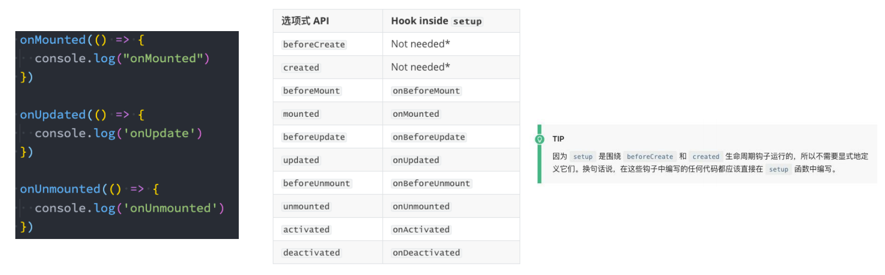
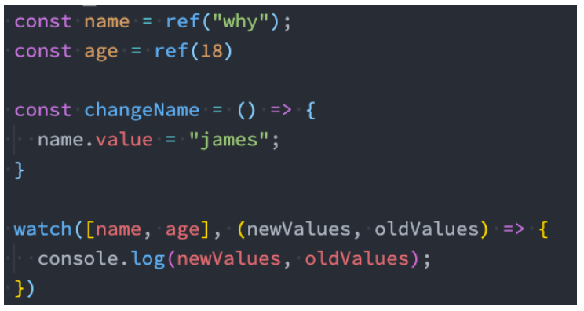
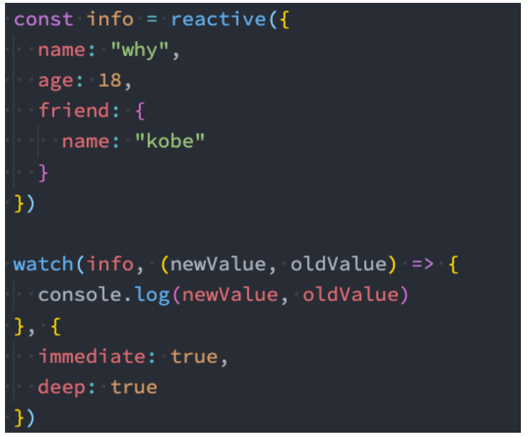
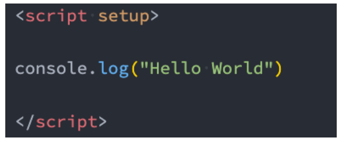
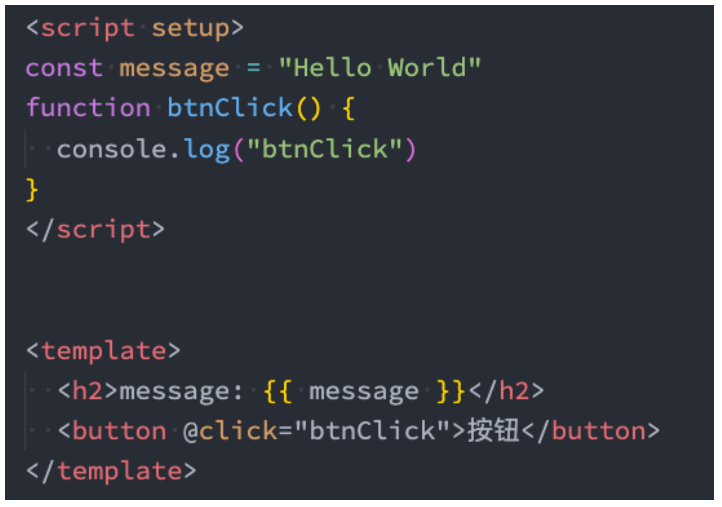
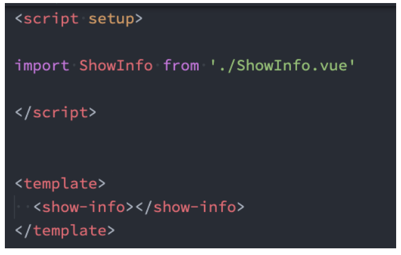
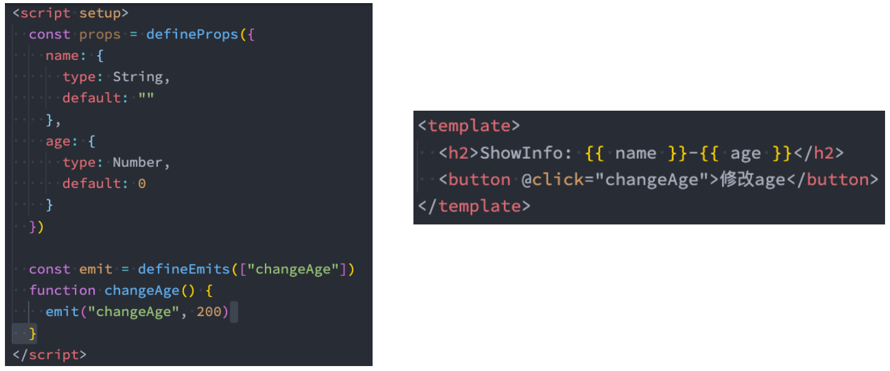
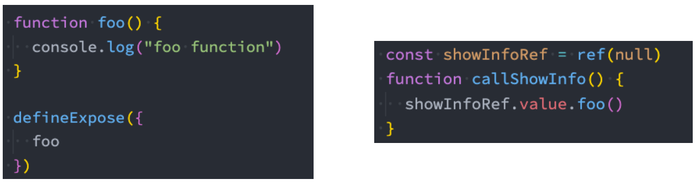
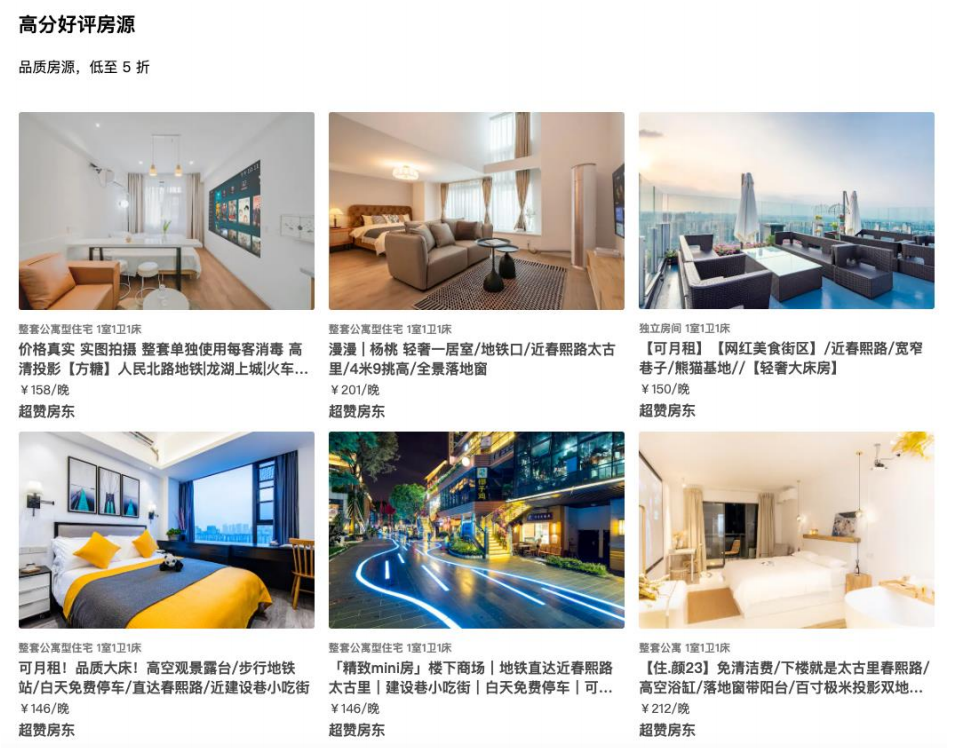

## **computed**

**在前面我们讲解过计算属性 computed：当我们的某些属性是依赖其他状态时，我们可以使用计算属性来处理**

在前面的 Options API 中，我们是使用 computed 选项来完成的；

在 Composition API 中，我们可以在 setup 函数中使用 computed 方法来编写一个计算属性；

**如何使用 computed 呢？**

方式一：接收一个 getter 函数，并为 getter 函数返回的值，返回一个不变的 ref 对象；

方式二：接收一个具有 get 和 set 的对象，返回一个可变的（可读写）ref 对象；

```javascript
<template>
  <h2>{{ fullname }}</h2>
  <button @click="setFullname">设置fullname</button>
  <h2>{{ scoreLevel }}</h2>
</template>

<script>
import { reactive, computed, ref } from 'vue'

  export default {
    setup() {
      // 1.定义数据
      const names = reactive({
        firstName: "kobe",
        lastName: "bryant"
      })

      // const fullname = computed(() => {
      //   return names.firstName + " " + names.lastName
      // })
      const fullname = computed({
        set: function(newValue) {
          const tempNames = newValue.split(" ")
          names.firstName = tempNames[0]
          names.lastName = tempNames[1]
        },
        get: function() {
          return names.firstName + " " + names.lastName
        }
      })

      console.log(fullname)

      function setFullname() {
        fullname.value = "coder why"
        console.log(names)
      }


      // 2.定义score
      const score = ref(89)
      const scoreLevel = computed(() => {
        return score.value >= 60 ? "及格": "不及格"
      })

      return {
        names,
        fullname,
        setFullname,
        scoreLevel
      }
    }
  }
</script>

<style scoped>
</style>
```

## **setup 中使用 ref**

**在 setup 中如何使用 ref 获取元素或者组件？**

其实非常简单，我们只需要定义一个 ref 对象，绑定到元素或者组件的 ref 属性上即可；

App.vue

```javascript
<template>
  <!-- 1.获取元素 -->
  <h2 ref="titleRef">我是标题</h2>
  <button ref="btnRef">按钮</button>

  <!-- 2.获取组件实例 -->
  <show-info ref="showInfoRef"></show-info>

  <button @click="getElements">获取元素</button>
</template>

<script>
  import { ref, onMounted } from 'vue'
  import ShowInfo from './ShowInfo.vue'

  export default {
    components: {
      ShowInfo
    },
    setup() {
      const titleRef = ref()
      const btnRef = ref()
      const showInfoRef = ref()

      // mounted的生命周期函数
      onMounted(() => {
        console.log(titleRef.value)
        console.log(btnRef.value)
        console.log(showInfoRef.value)

        showInfoRef.value.showInfoFoo()
      })

      function getElements() {
        console.log(titleRef.value)
      }

      return {
        titleRef,
        btnRef,
        showInfoRef,
        getElements
      }
    }
  }
</script>

<style scoped>
</style>
```

ShowInfo.vue

```javascript
<template>
  <div>ShowInfo</div>
</template>

<script>
  export default {
    // methods: {
    //   showInfoFoo() {
    //     console.log("showInfo foo function")
    //   }
    // }
    setup() {
      function showInfoFoo() {
        console.log("showInfo foo function")
      }

      return {
        showInfoFoo
      }
    }
  }
</script>

<style scoped>
</style>
```

## **生命周期钩子**

**我们前面说过 setup 可以用来替代 data 、 methods 、 computed 等等这些选项，也可以替代生命周期钩子。**

**那么 setup 中如何使用生命周期函数呢？**

可以使用直接导入的 onX 函数注册生命周期钩子；



## **Provide 函数**

**事实上我们之前还学习过 Provide 和 Inject，Composition API 也可以替代之前的 Provide 和 Inject 的选项。**

**我们可以通过 provide 来提供数据：**

可以通过 provide 方法来定义每个 Property；

**provide 可以传入两个参数：**

name：提供的属性名称；

value：提供的属性值；

## **Inject 函数**

**在 后代组件 中可以通过 inject 来注入需要的属性和对应的值：**

可以通过 inject 来注入需要的内容；

**inject 可以传入两个参数：**

要 inject 的 property 的 name；

默认值；

## **数据的响应式**

为了增加 provide 值和 inject 值之间的响应性，我们可以在 provide 值时使用 ref 和 reactive。

App.vue

```javascript
<template>
  <div>AppContent: {{ name }}</div>
  <button @click="name = 'kobe'">app btn</button>
  <show-info></show-info>
</template>

<script>
  import { provide, ref } from 'vue'
  import ShowInfo from './ShowInfo.vue'

  export default {
    components: {
      ShowInfo
    },
    setup() {
      const name = ref("why")

      provide("name", name) // name是响应式的
      provide("age", 18)

      return {
        name
      }
    }
  }
</script>

<style scoped>
</style>
```

ShowInfo.vue

```javascript
<template>
  <div>ShowInfo: {{ name }}-{{ age }}-{{ height }} </div>
</template>

<script>
  import { inject } from 'vue'

  export default {
    // inject的options api注入, 那么依然需要手动来解包 上面使用 name.vue
    // inject: ["name", "age"],
    setup() {
      const name = inject("name")
      const age = inject("age")
      const height = inject("height", 1.88) // 默认值1.88

      return {
        name,
        age,
        height
      }
    }
  }
</script>

<style scoped>
</style>
```

## **侦听数据的变化**

**在前面的 Options API 中，我们可以通过 watch 选项来侦听 data 或者 props 的数据变化，当数据变化时执行某一些操作。**

**在 Composition API 中，我们可以使用 watchEffect 和 watch 来完成响应式数据的侦听；**

watchEffect：用于自动收集响应式数据的依赖；

watch：需要手动指定侦听的数据源；

## **Watch 的使用**

**watch 的 API 完全等同于组件 watch 选项的 Property：**

watch 需要侦听特定的数据源，并且执行其回调函数；

默认情况下它是惰性的，只有当被侦听的源发生变化时才会执行回调；

```javascript
<template>
  <div>AppContent</div>
  <button @click="message = '你好啊,李银河!'">修改message</button>
  <button @click="info.friend.name = 'james'">修改info</button>
</template>

<script>
  import { reactive, ref, watch } from 'vue'

  export default {
    setup() {
      // 1.定义数据
      const message = ref("Hello World")
      const info = reactive({
        name: "why",
        age: 18,
        friend: {
          name: "kobe"
        }
      })

      // 2.侦听数据的变化 默认是有进行深度侦听，即deep为true
      watch(message, (newValue, oldValue) => {
        console.log(newValue, oldValue)
      })
      watch(info, (newValue, oldValue) => {
        console.log(newValue, oldValue) // 这边打印的对象是Proxy
        console.log(newValue === oldValue)
      }, {
        immediate: true
      })

      // 3.监听reactive数据变化后, 获取普通对象
      watch(() => ({ ...info }), (newValue, oldValue) => {
        console.log(newValue, oldValue) // 这边打印的是普通对象
      }, {
        immediate: true,
        deep: true
      })

      return {
        message,
        info
      }
    }
  }
</script>

<style scoped>
</style>
```

## **侦听多个数据源**

**侦听器还可以使用数组同时侦听多个源：**



## **watch 的选项**

**如果我们希望侦听一个深层的侦听，那么依然需要设置 deep 为 true：**

也可以传入 immediate 立即执行；



## **watchEffect**

**当侦听到某些响应式数据变化时，我们希望执行某些操作，这个时候可以使用** **watchEffect。**

我们来看一个案例：

首先，watchEffect 传入的函数会被立即执行一次，并且在执行的过程中会收集依赖；

其次，只有收集的依赖发生变化时，watchEffect 传入的函数才会再次执行；

## **watchEffect 的停止侦听**

**如果在发生某些情况下，我们希望停止侦听，这个时候我们可以获取 watchEffect 的返回值函数，调用该函数即可。**

```javascript
<template>
  <div>
    <h2>当前计数: {{ counter }}</h2>
    <button @click="counter++">+1</button>
    <button @click="name = 'kobe'">修改name</button>
  </div>
</template>

<script>
  import { watchEffect, watch, ref } from 'vue'

  export default {
    setup() {
      const counter = ref(0)
      const name = ref("why")

      // watch(counter, (newValue, oldValue) => {})

      // 1.watchEffect传入的函数默认会直接被执行
      // 2.在执行的过程中, 会自动的收集依赖(依赖哪些响应式的数据)
      const stopWatch = watchEffect(() => {
        console.log("-------", counter.value, name.value) // 只要counter.value和name.value发生变化，就会自动侦听

        // 判断counter.value > 10 就停止侦听
        if (counter.value >= 10) {
          stopWatch()
        }
      })

      return {
        counter,
        name
      }
    }
  }
</script>

<style scoped>
</style>
```

## **useCounter**

简单一句话概括，就是对相同的逻辑进行抽取放到一个函数当中。

hooks/useCounter.js

```javascript
import { ref, onMounted } from "vue";

export default function useCounter() {
  const counter = ref(0);
  function increment() {
    counter.value++;
  }
  function decrement() {
    counter.value--;
  }
  onMounted(() => {
    setTimeout(() => {
      counter.value = 989;
    }, 1000);
  });

  return {
    counter,
    increment,
    decrement,
  };
}
```

在 Home.vue 中使用

```javascript
<template>
  <h2>Home计数: {{ counter }}</h2>
  <button @click="increment">+1</button>
  <button @click="decrement">-1</button>
</template>

<script>
  import useCounter from '../hooks/useCounter'

  export default {
    setup() {
      // 1.counter逻辑
      const { counter, increment, decrement } = useCounter()

      return {
        counter,
        increment,
        decrement,
      }
    }
  }
</script>

<style scoped>
</style>
```

在 About.vue 中使用

```javascript
<template>
  <h2>About计数: {{ counter }}</h2>
  <button @click="increment">+1</button>
  <button @clcik="decrement">-1</button>
</template>

<script>
  import useCounter from '../hooks/useCounter'

  export default {
    setup() {

      return {
        ...useCounter() // 也可以使用...语法
      }
    }
  }
</script>

<style scoped>
</style>
```

## **useTitle**

如果我们只是想点击按钮修改标题，可以写个下面这样的 useTitle

App.vue

```javascript
<template>
  <div>AppContent</div>
  <button @click="changeTitle">修改title</button>
</template>

<script>
  import Home from './views/Home.vue'
  import About from './views/About.vue'

  import useTitle from './hooks/useTitle'

  export default {
    components: {
      Home,
      About
    },
    setup() {
      function changeTitle() {
        useTitle("app title")
      }

      return {
        changeTitle,
      }
    }
  }
</script>

<style scoped>
</style>
```

hooks/useTitle.js

```javascript
export default function useTitle() {
  document.title = title;
}
```

如果我们是在多个页面来回之间切换，当点击 home 按钮时，标题改成首页，点击 about 按钮时，标题改成关于

在 Home.vue 和 About.vue 都调用 useTitle 就行了

App.vue

```javascript
<template>
  <div>AppContent</div>
  <button @click="changeTitle">修改title</button>

  <!-- 1.计数器 -->
  <!-- <hr>
  <home></home>
  <hr>
  <about></about> -->

  <!-- 2.home和about页面的切换 -->
  <button @click="currentPage = 'home'">home</button>
  <button @click="currentPage = 'about'">about</button>

  <component :is="currentPage"></component>

</template>

<script>
  import { ref } from 'vue'
  import Home from './views/Home.vue'
  import About from './views/About.vue'

  import useTitle from './hooks/useTitle'

  export default {
    components: {
      Home,
      About
    },
    setup() {
      const currentPage = ref("home")

      function changeTitle() {
        useTitle("app title")
      }

      return {
        changeTitle,
        currentPage
      }
    }
  }
</script>

<style scoped>
</style>
```

views/Home.vue

```javascript
<template>
  <h2>Home计数: {{ counter }}</h2>
  <button @click="increment">+1</button>
  <button @click="decrement">-1</button>
</template>

<script>
  import useCounter from '../hooks/useCounter'
  import useTitle from '../hooks/useTitle'

  export default {
    setup() {
      // 1.counter逻辑
      const { counter, increment, decrement } = useCounter()
      // 2.修改标题
      useTitle("首页")

      return {
        counter,
        increment,
        decrement,
      }
    }
  }
</script>

<style scoped>
</style>
```

views/About.vue

```javascript
<template>
  <h2>About计数: {{ counter }}</h2>
  <button @click="increment">+1</button>
  <button @clcik="decrement">-1</button>
</template>

<script>
  import useCounter from '../hooks/useCounter'
  import useTitle from '../hooks/useTitle'

  export default {
    setup() {

      // 切换标题
      useTitle("关于")

      return {
        ...useCounter()
      }
    }
  }
</script>

<style scoped>
</style>
```

但是也有可能我们想在 Home.vue 中频繁更改 title，比如下面这样，那么会发现调用了多次 useTitle 函数

```javascript
<template>
  <h2>Home计数: {{ counter }}</h2>
  <button @click="increment">+1</button>
  <button @click="decrement">-1</button>

  <button @click="popularClick">首页-流行</button>
  <button @click="hotClick">首页-热门</button>
  <button @click="songClick">首页-歌单</button>
</template>

<script>
  import useCounter from '../hooks/useCounter'
  import useTitle from '../hooks/useTitle'

  export default {
    setup() {
      // 1.counter逻辑
      const { counter, increment, decrement } = useCounter()

      // 2.修改标题
      useTitle("首页")

      // 3.监听按钮的点击
      function popularClick() {
        useTitle("首页-流行")
      }
      function hotClick() {
        useTitle("首页-热门")
      }
      function songClick() {
        useTitle("首页-歌单")
      }

      return {
        counter,
        increment,
        decrement,
        popularClick,
        hotClick,
        songClick,
      }
    }
  }
</script>

<style scoped>
</style>
```

我们希望的是 useTitle 会返回一个 title，然后在 Home.vue 中引入，只需要调用一次 useTitle，之后只需要改 useTitle 返回的 title 就行了。

```javascript
<template>
  <h2>Home计数: {{ counter }}</h2>
  <button @click="increment">+1</button>
  <button @click="decrement">-1</button>

  <button @click="popularClick">首页-流行</button>
  <button @click="hotClick">首页-热门</button>
  <button @click="songClick">首页-歌单</button>
</template>

<script>
  import { onMounted, ref } from 'vue'
  import useCounter from '../hooks/useCounter'
  import useTitle from '../hooks/useTitle'

  export default {
    setup() {
      // 1.counter逻辑
      const { counter, increment, decrement } = useCounter()

      // 2.修改标题
      const { title } = useTitle("首页")

      // 3.监听按钮的点击
      function popularClick() {
        title.value = "首页-流行"
      }
      function hotClick() {
        title.value = "首页-热门"
      }
      function songClick() {
        title.value = "首页-歌单"
      }


      return {
        counter,
        increment,
        decrement,
        popularClick,
        hotClick,
        songClick,
      }
    }
  }
</script>

<style scoped>
</style>
```

useTitle.js 也得做修改，返回 title

```javascript
import { ref, watch } from "vue";

export default function useTitle(titleValue) {
  // document.title = title

  // 定义ref的引入数据
  const title = ref(titleValue);

  // 监听title的改变
  watch(
    title,
    (newValue) => {
      document.title = newValue;
    },
    {
      immediate: true,
    }
  );

  // 返回ref值
  return {
    title,
  };
}
```

## **useScrollPosition**

我们来完成一个监听界面滚动位置的 Hook：

useScrollPosition.js

```javascript
import { reactive } from "vue";

export default function useScrollPosition() {
  // 1.使用reative记录位置
  const scrollPosition = reactive({
    x: 0,
    y: 0,
  });

  // 2.监听滚动
  document.addEventListener("scroll", () => {
    scrollPosition.x = window.scrollX;
    scrollPosition.y = window.scrollY;
  });

  return {
    scrollPosition,
  };
}
```

Home.vue

```javascript
<template>
  <div class="scroll">
    <h2>x: {{ scrollPosition.x }}</h2>
    <h2>y: {{ scrollPosition.y }}</h2>
  </div>
</template>

<script>
  import useScrollPosition from '../hooks/useScrollPosition'

  export default {
    setup() {
      // 4.获取滚动位置
      const { scrollPosition } = useScrollPosition()
      console.log(scrollPosition)

      return {
        scrollPosition
      }
    }
  }
</script>

<style scoped>
</style>
```

## **script setup 语法**

`<script setup>` 是在单文件组件 (SFC) 中使用组合式 API 的编译时语法糖，当同时使用 SFC 与组合式 API 时则推荐该语法。

更少的样板内容，更简洁的代码；

能够使用纯 Typescript 声明 prop 和抛出事件；

更好的运行时性能 ；

更好的 IDE 类型推断性能 ；

**使用这个语法，需要将 setup attribute 添加到 `<script>` 代码块上：**



里面的代码会被编译成组件 setup() 函数的内容：

这意味着与普通的 `<script>` 只在组件被首次引入的时候执行一次不同；

`<script setup>` 中的代码会在每次组件实例被创建的时候执行。

## **顶层的绑定会被暴露给模板**

**当使用 `<script setup>` 的时候，任何在 `<script setup> `声明的顶层的绑定 (包括变量，函数声明，以及 import 引入的内容)**

**都能在模板中直接使用**



**响应式数据需要通过 ref、reactive 来创建。**

## **导入的组件直接使用**

`<script setup>` 范围里的值也能被直接作为自定义组件的标签名使用：



## **defineProps() 和 defineEmits()**

**为了在声明 props 和 emits 选项时获得完整的类型推断支持，我们可以使用 defineProps 和 defineEmits API，它们将自动**

**地在 `<script setup>` 中可用：**



## **defineExpose()**

**使用 `<script setup>` 的组件是默认关闭的：**

通过模板 ref 或者 $parent 链获取到的组件的公开实例，不会暴露任何在 `<script setup>` 中声明的绑定；

**通过 defineExpose 编译器宏来显式指定在 `<script setup>` 组件中要暴露出去的 property：**



App.vue

```javascript
<template>
  <div>AppContent: {{ message }}</div>
  <button @click="changeMessage">修改message</button>
  <show-info name="why"
             :age="18"
             @info-btn-click="infoBtnClick"
             ref="showInfoRef">
  </show-info>
  <show-info></show-info>
  <show-info></show-info>
</template>

<script setup>
  // 1.所有编写在顶层中的代码, 都是默认暴露给template可以使用
  import { ref, onMounted } from 'vue'
  import ShowInfo from './ShowInfo.vue'

  // 2.定义响应式数据
  const message = ref("Hello World")
  console.log(message.value)

  // 3.定义绑定的函数
  function changeMessage() {
    message.value = "你好啊, 李银河!"
  }

  function infoBtnClick(payload) {
    console.log("监听到showInfo内部的点击:", payload)
  }

  // 4.获取组件实例
  const showInfoRef = ref()
  onMounted(() => {
    showInfoRef.value.foo()
  })

</script>

<style scoped>
</style>
```

ShowInfo.vue

```javascript
<template>
  <div>ShowInfo: {{ name }}-{{ age }}</div>
  <button @click="showInfoBtnClick">showInfoButton</button>
</template>

<script setup>

// 定义props 父传子用defineProps，如果想要拿到数据可以用props接收
const props = defineProps({
  name: {
    type: String,
    default: "默认值"
  },
  age: {
    type: Number,
    default: 0
  }
})

// 绑定函数, 并且发出事件 子传父通信用defineEmits
const emits = defineEmits(["infoBtnClick"])
function showInfoBtnClick() {
  emits("infoBtnClick", "showInfo内部发生了点击")
}

// 定义foo的函数 父组件如果想调用子组件的foo方法，需要暴露出去，使用defineExpose
function foo() {
  console.log("foo function")
}
defineExpose({
  foo
})

</script>

<style scoped>
</style>
```

## **案例实战练习**



App.vue

```javascript
<template>
  <div class="app">
    <!-- 1.高评价 -->
    <room-area :area-data="highScore"></room-area>
  </div>
</template>

<script setup>
  import { ref } from 'vue';
  import RoomArea from './components/RoomArea.vue'

  // 1.获取数据
  // import highScore from "./data/high_score.json"
  // console.log(highScore)


  // 2.模拟网络请求数据
  const highScore = ref({})
  setTimeout(() => {
    import("./data/high_score.json").then(res => {
      highScore.value = res.default
    })
  }, 1000);

</script>

<style lang="less" scoped>
  .app {
    width: 1032px;
    padding: 40px;
    margin: 0 auto;
  }
</style>
```

components/RoomArea.vue

```javascript
<template>
  <div class="room-area">
    <!-- 1.区域header -->
    <area-header :title="areaData.title" :subtitle="areaData.subtitle"/>

    <!-- 2.房间列表 -->
    <div class="room-list">
      <template v-for="item in areaData.list" :key="item.id">
        <room-item :item-data="item"/>
      </template>
    </div>
  </div>
</template>

<script setup>
import AreaHeader from './AreaHeader.vue'
import RoomItem from './RoomItem.vue'

defineProps({
  areaData: {
    type: Object,
    default: () => ({})
  }
})

</script>

<style lang="less" scoped>
  .room-list {
    display: flex;
    flex-wrap: wrap;
    margin: 20px -8px;
  }
</style>
```

components/AreaHeader.vue

```javascript
<template>
  <div class="area-header">
    <h3 class="title">{{ title }}</h3>
    <div class="subtitle">{{ subtitle }}</div>
  </div>
</template>

<script setup>

defineProps({
  title: {
    type: String,
    default: "默认标题"
  },
  subtitle: {
    type: String,
    default: "默认子标题"
  }
})

</script>

<style lang="less" scoped>

  .area-header {
    height: 84px;

    .title {
      font-size: 22px;
    }

    .subtitle {
      margin-top: 12px;
      font-size: 16px;
    }
  }

</style>
```

components/RoomItem.vue

```javascript
<template>
  <div class="room-item">
    <div class="item-inner">
      <div class="cover">
        
      </div>
      <div class="info">
        <div class="title" :style="{ color: titleInfo.color }">
          {{ titleInfo.text }}
        </div>
        <div class="name">
          {{ itemData.name }}
        </div>
        <div class="price">
          {{ itemData.price_format + "/晚" }}
        </div>
        <div class="bottom-info" :style="bottomInfo.style">
          {{ bottomInfo.content }}
        </div>
      </div>
    </div>
  </div>
</template>

<script setup>
  import { computed } from 'vue';

  // 1.定义props
  const props = defineProps({
    itemData: {
      type: Object,
      default: () => ({})
    }
  })

  // 2.定义计算属性
  // const titleText = computed(() => {
  //   return props.itemData.verify_info.messages.join(" ")
  // })
  // const titleColor = computed(() => {
  //   return props.itemData.verify_info.text_color
  // })
  const titleInfo = computed(() => {
    return {
      text: props.itemData.verify_info.messages.join(" "),
      color: props.itemData.verify_info.text_color
    }
  })
  const bottomInfo = computed(() => {
    return {
      content: props.itemData.bottom_info.content,
      style: {
        color: props.itemData.bottom_info.content_color,
        fontSize: props.itemData.bottom_info.font_size + "px"
      }
    }
  })

</script>

<style lang="less" scoped>
  .room-item {
    width: 33.333333%;

    .item-inner {
      margin: 0 8px 12px;
      color: #484848;
      font-weight: 800;

      img {
        width: 100%;
        border-radius: 3px;
      }

      .info {
        .title {
          margin-top: 8px;
          font-size: 12px;
        }

        .name {
          margin-top: 3px;
          font-size: 16px;

          overflow: hidden;
          text-overflow: ellipsis;
          display: -webkit-box;
          -webkit-line-clamp: 2;
          -webkit-box-orient: vertical;
        }

        .price {
          margin: 3px 0;
          font-size: 14px;
          font-weight: 400;
        }
      }
    }
  }
</style>
```

data/high_score.json

```json
{
  "title": "高分好评房源",
  "subtitle": "来看看这些颇受房客好评的房源吧",
  "list": [
    {
      "id": "47773281",
      "picture_url": "https://z1.muscache.cn/im/pictures/miso/Hosting-47773281/original/de5df68f-8582-4ee6-82c4-a52443d9e83b.jpeg?aki_policy=large",
      "verify_info": {
        "messages": ["整套公寓型住宅", "1室1卫1床"],
        "text_color": "#767676"
      },
      "name": "价格真实 实图拍摄 整套单独使用每客消毒 高清投影【方糖】人民北路地铁|龙湖上城|火车北站|密码锁|",
      "price": 158,
      "price_format": "￥158",
      "star_rating": 5,
      "star_rating_color": "#008489",
      "reviews_count": 1282,
      "reviews": [
        {
          "comments": "还不错",
          "created_at": "2022-06-21T00:00:00Z",
          "is_translated": false,
          "localized_date": "2022年6月",
          "reviewer_image_url": "https://a0.muscache.com/im/pictures/user/762d2557-cdd5-427f-bcc8-26d61d885ab9.jpg?aki_policy=x_medium",
          "review_id": 653751197167823900
        }
      ],
      "bottom_info": {
        "content": "超赞房东",
        "content_color": "#767676",
        "font_size": "10",
        "visibility": "LIST_VIEW"
      },
      "lat": 30.6816,
      "lng": 104.07032,
      "image_url": "/springdiscount/8ee76f60e2777c6c01195b318ace9656.jpg"
    },
    {
      "id": "54376288",
      "picture_url": "https://z1.muscache.cn/im/pictures/miso/Hosting-54376288/original/71d12acc-ee2c-4721-8809-8a2b4666bb01.jpeg?aki_policy=large",
      "verify_info": {
        "messages": ["整套公寓型住宅", "1室1卫1床"],
        "text_color": "#767676"
      },
      "name": "漫漫 | 杨桃 轻奢一居室/地铁口/近春熙路太古里/4米9挑高/全景落地窗",
      "price": 201,
      "price_format": "￥201",
      "star_rating": 5,
      "star_rating_color": "#008489",
      "reviews_count": 76,
      "reviews": [
        {
          "comments": "总体好评，房间的搭配是更讨女性喜欢的，比较强的ins风，东西比较齐全，比如洗衣机和冰箱都是有的，然后去太古里不是特别近需要骑车，另外门窗很薄。",
          "created_at": "2022-06-22T00:00:00Z",
          "is_translated": false,
          "localized_date": "2022年6月",
          "reviewer_image_url": "https://a0.muscache.com/im/pictures/user/986322dc-5205-445f-8274-ebd71ee748ed.jpg?aki_policy=x_medium",
          "review_id": 654502854910423900
        }
      ],
      "bottom_info": {
        "content": "超赞房东",
        "content_color": "#767676",
        "font_size": "10",
        "visibility": "LIST_VIEW"
      },
      "lat": 30.672022,
      "lng": 104.088898,
      "image_url": "/springdiscount/2f461f589f4a0b7784ef1c35875837a6.jpg"
    },
    {
      "id": "45817721",
      "picture_url": "https://z1.muscache.cn/im/pictures/miso/Hosting-45817721/original/80f99830-f104-4404-86fd-1af856ac9b73.jpeg?aki_policy=large",
      "verify_info": {
        "messages": ["独立房间", "1室1卫1床"],
        "text_color": "#767676"
      },
      "name": "【可月租】【网红美食街区】/近春熙路/宽窄巷子/熊猫基地//【轻奢大床房】",
      "price": 150,
      "price_format": "￥150",
      "star_rating": 5,
      "star_rating_color": "#008489",
      "reviews_count": 507,
      "reviews": [
        {
          "comments": "挺好的",
          "created_at": "2022-06-09T00:00:00Z",
          "is_translated": false,
          "localized_date": "2022年6月",
          "reviewer_image_url": "https://a0.muscache.com/im/pictures/user/7b8fb8de-6437-4d10-bc37-d878fa084c5d.jpg?aki_policy=x_medium",
          "review_id": 645148062181591700
        }
      ],
      "bottom_info": {
        "content": "超赞房东",
        "content_color": "#767676",
        "font_size": "10",
        "visibility": "LIST_VIEW"
      },
      "lat": 30.68856,
      "lng": 104.09887,
      "image_url": "/springdiscount/9b88e80dbe461f427cbe97c1e6265bb9.jpg"
    },
    {
      "id": "47434782",
      "picture_url": "https://z1.muscache.cn/im/pictures/miso/Hosting-47434782/original/8e550632-acec-4478-a641-7ecc0062b1db.jpeg?aki_policy=large",
      "verify_info": {
        "messages": ["整套公寓型住宅", "1室1卫1床"],
        "text_color": "#767676"
      },
      "name": "可月租！品质大床！高空观景露台/步行地铁站/白天免费停车/直达春熙路/近建设巷小吃街",
      "price": 146,
      "price_format": "￥146",
      "star_rating": 5,
      "star_rating_color": "#008489",
      "reviews_count": 1184,
      "reviews": [
        {
          "comments": "在永立住过几家公寓，这一家老板很热情，房间在35楼，晚上住高层很安静，大早上外面有点施工的声音，关上窗户基本可以隔绝。房间很整洁，从洗衣机 热水器 花洒还有洗手台的购置看出来老板比较用心。靠窗有桌子，但房间内没有沙发，不过也对得起这个价格了。楼下有一个小商业体，有许多餐馆和麦当劳，便利店也有开到很晚的。最近的地铁站是李家沱3号线，去7号线驷马桥路途稍微远一些。",
          "created_at": "2022-06-08T00:00:00Z",
          "is_translated": false,
          "localized_date": "2022年6月",
          "reviewer_image_url": "https://a0.muscache.com/im/pictures/user/f0e1a670-a96c-46a7-a995-126e317b77f6.jpg?aki_policy=x_medium",
          "review_id": 644366154235822300
        }
      ],
      "bottom_info": {
        "content": "超赞房东",
        "content_color": "#767676",
        "font_size": "10",
        "visibility": "LIST_VIEW"
      },
      "lat": 30.69036,
      "lng": 104.10039,
      "image_url": "/springdiscount/f5dd50f6ad6c307f11f30f3d77521079.jpg"
    },
    {
      "id": "40356486",
      "picture_url": "https://z1.muscache.cn/im/pictures/e4aa2fdd-70f5-43dc-90ee-8a6d1d739d84.jpg?aki_policy=large",
      "verify_info": {
        "messages": ["整套公寓型住宅", "1室1卫1床"],
        "text_color": "#767676"
      },
      "name": "「精致mini房」楼下商场｜地铁直达近春熙路太古里｜建设巷小吃街｜白天免费停车｜可开发票｜行李寄存",
      "price": 146,
      "price_format": "￥146",
      "star_rating": 5,
      "star_rating_color": "#008489",
      "reviews_count": 1139,
      "reviews": [
        {
          "comments": "位置比较好 楼下全是吃的 性价比很高 建议老板可以加装个避光窗帘要不早上光太强了还有就是电视换个系统 电影感觉好少哈哈 别的都还不错 下次还会来",
          "created_at": "2022-06-18T00:00:00Z",
          "is_translated": false,
          "localized_date": "2022年6月",
          "reviewer_image_url": "https://a0.muscache.com/im/pictures/user/fe5bb0d1-4a85-4bb7-b417-3b1ec2c296c0.jpg?aki_policy=x_medium",
          "review_id": 651640404764253600
        }
      ],
      "bottom_info": {
        "content": "超赞房东",
        "content_color": "#767676",
        "font_size": "10",
        "visibility": "LIST_VIEW"
      },
      "lat": 30.68856,
      "lng": 104.09887,
      "image_url": "/springdiscount/b85ac5ad3658912e6d9d66aafee87f92.jpg"
    },
    {
      "id": "45098754",
      "picture_url": "https://z1.muscache.cn/im/pictures/6e739539-940e-456f-a10d-0e8526feb943.jpg?aki_policy=large",
      "verify_info": {
        "messages": ["整套公寓", "1室1卫1床"],
        "text_color": "#767676"
      },
      "name": "【住.颜23】免清洁费/下楼就是太古里春熙路/高空浴缸/落地窗带阳台/百寸极米投影双地铁/其他点头像",
      "price": 212,
      "price_format": "￥212",
      "star_rating": 5,
      "star_rating_color": "#008489",
      "reviews_count": 156,
      "reviews": [
        {
          "comments": "位置很便利，房间简洁干净，但浴缸热水用不起。",
          "created_at": "2022-06-05T00:00:00Z",
          "is_translated": false,
          "localized_date": "2022年6月",
          "reviewer_image_url": "https://a0.muscache.com/im/pictures/user/c7e52930-6432-4310-9de1-0cacfcb56b14.jpg?aki_policy=x_medium",
          "review_id": 642180681003801200
        }
      ],
      "bottom_info": {
        "content": "超赞房东",
        "content_color": "#767676",
        "font_size": "10",
        "visibility": "LIST_VIEW"
      },
      "lat": 30.65122,
      "lng": 104.08556,
      "image_url": "/springdiscount/872952d67cc83e0135faea56e6587a32.jpg"
    }
  ]
}
```
